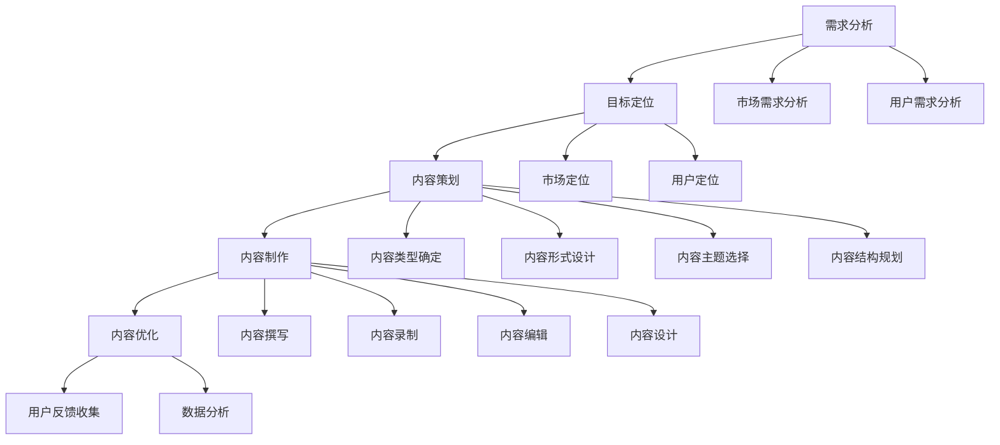

                 

## 摘要

本文将深入探讨知识付费创业中的内容规划方法。知识付费作为一种新兴的商业模式，正逐渐改变着传统教育行业的生态。文章首先介绍了知识付费的背景和发展现状，然后详细阐述了内容规划的重要性及其核心要素。通过分析内容规划的理论基础，本文提出了一套科学、系统的内容规划方法，包括需求分析、目标定位、内容策划、制作和优化等环节。最后，本文结合实际案例，展示了如何有效地运用这些方法进行知识付费创业。希望通过本文的探讨，为从事知识付费创业的从业者提供有价值的参考和指导。

## 1. 背景介绍

知识付费，是指用户为获取高质量的知识内容而支付费用的一种商业模式。这一现象的出现，既源于互联网技术的发展，也反映了用户对于个性化、专业化和深度化知识需求的增长。从最早的在线教育平台，到如今各类知识付费平台如得到、喜马拉雅等，知识付费已经逐渐成为互联网经济的重要组成部分。

知识付费的兴起，可以从以下几个方面来理解：

**互联网技术的发展**：互联网的普及和移动设备的广泛使用，使得知识传播变得更加便捷和高效。用户可以随时随地通过手机、平板等设备获取所需的知识内容，不再受时间和空间的限制。

**用户需求的变化**：随着社会经济的不断发展，人们对于个人成长和职业发展的需求日益增加。知识付费平台提供了丰富的学习资源和专业的知识服务，满足了用户个性化、深层次的学习需求。

**商业模式创新**：知识付费平台通过提供高质量的内容，结合会员制、订阅制等模式，实现了商业模式的创新。这种模式不仅提高了用户粘性，也为平台创造了可观的收入。

知识付费的商业模式，主要包括以下几种形式：

1. **会员制**：用户支付一定费用成为会员，享受平台提供的所有内容和服务。
2. **订阅制**：用户按月或按年支付订阅费用，获取平台更新的知识内容。
3. **单次购买**：用户为特定的知识内容支付一次费用，通常用于购买某本电子书或某个课程。

这些模式各有特点，但共同的目标是满足用户对高质量知识的需求，同时为平台带来持续的收入。

在知识付费市场中，竞争日益激烈。各类平台争相推出优质内容，以吸引更多的用户。这既给创业者带来了机遇，也带来了挑战。如何在这片红海中脱颖而出，成为知识付费创业者的核心问题。

本文旨在探讨知识付费创业中的内容规划方法，帮助创业者制定科学、系统的内容策略，从而在竞争激烈的市场中找到自己的定位。接下来，我们将详细讨论内容规划的重要性及其核心要素。

## 2. 核心概念与联系

### 内容规划的重要性

内容规划是知识付费创业中的核心环节，其重要性体现在以下几个方面：

**明确方向**：内容规划帮助创业者明确自己的内容方向，避免盲目跟风和资源浪费。通过深入分析市场需求和用户需求，内容规划能够确保创业项目聚焦于最有价值、最符合市场需求的领域。

**提升竞争力**：优质的内容是知识付费平台的核心竞争力。通过内容规划，创业者可以确保所提供的内容具有深度、专业性和独特性，从而在激烈的市场竞争中脱颖而出。

**提高用户粘性**：科学的内容规划能够确保内容体系的完整性和连贯性，提高用户的学习体验和满意度，从而增强用户粘性和忠诚度。

**优化运营效率**：内容规划有助于创业者优化内容生产、管理和推广的流程，提高运营效率，降低成本。

### 核心概念

在内容规划中，几个核心概念需要特别关注：

**需求分析**：需求分析是内容规划的基础，通过分析市场需求和用户需求，确定创业项目的目标受众和内容方向。

**目标定位**：目标定位是内容规划的关键，明确创业项目的目标市场和目标用户，确保内容能够满足用户需求，并具有市场竞争力。

**内容策划**：内容策划是内容规划的核心，包括确定内容类型、形式、主题和结构，确保内容具有吸引力和可读性。

**内容制作**：内容制作是内容规划的具体实施，包括撰写、录制、编辑和设计等环节，确保内容的准确性和专业性。

**内容优化**：内容优化是内容规划的持续过程，通过用户反馈和数据分析，不断调整和改进内容，提高用户满意度和内容质量。

### Mermaid 流程图

以下是一个简单的Mermaid流程图，展示了内容规划的主要步骤和核心概念之间的联系：



通过这个流程图，我们可以清晰地看到内容规划从需求分析到内容优化的整个流程，以及各个核心概念之间的联系。

### 内容规划方法

接下来，我们将详细讨论内容规划的具体方法，包括需求分析、目标定位、内容策划、制作和优化等环节。

#### 2.1 需求分析

需求分析是内容规划的基础，通过对市场需求和用户需求的深入分析，确定创业项目的目标受众和内容方向。以下是需求分析的主要步骤：

1. **市场调研**：通过调研了解市场现状、市场规模、市场趋势和竞争对手情况，为内容规划提供宏观背景。

2. **用户调研**：通过用户访谈、问卷调查、用户行为分析等方式，了解用户的需求、兴趣、痛点和使用习惯，为内容规划提供微观依据。

3. **需求分类**：将市场需求和用户需求进行分类，确定主要的用户群体和需求类型，为内容策划提供明确的方向。

4. **需求优先级排序**：根据用户需求的重要性和紧迫性，对需求进行优先级排序，确保内容规划能够优先满足核心需求。

#### 2.2 目标定位

目标定位是内容规划的关键，通过明确创业项目的目标市场和目标用户，确保内容能够满足用户需求，并具有市场竞争力。以下是目标定位的主要步骤：

1. **市场定位**：确定创业项目所面向的市场领域，如教育培训、健康养生、科技知识等，确保内容具有针对性。

2. **用户定位**：确定创业项目的目标用户群体，如学生、职场人士、创业者等，确保内容能够满足用户的需求。

3. **目标设定**：根据市场定位和用户定位，设定明确的内容目标和商业目标，如提高用户满意度、增加用户粘性、提升品牌知名度等。

#### 2.3 内容策划

内容策划是内容规划的核心，通过确定内容类型、形式、主题和结构，确保内容具有吸引力和可读性。以下是内容策划的主要步骤：

1. **内容类型确定**：根据用户需求和目标定位，确定创业项目的内容类型，如课程、文章、音频、视频等。

2. **内容形式设计**：根据内容类型，设计内容的形式，如文本、图片、音频、视频等，确保内容能够最大程度地满足用户需求。

3. **内容主题选择**：根据用户需求和目标定位，选择具有吸引力和价值的内容主题，确保内容能够引起用户的兴趣。

4. **内容结构规划**：根据内容主题，规划内容的结构和逻辑，确保内容具有连贯性和系统性。

#### 2.4 内容制作

内容制作是内容规划的具体实施，包括撰写、录制、编辑和设计等环节，确保内容的准确性和专业性。以下是内容制作的主要步骤：

1. **内容撰写**：根据内容策划的要求，撰写内容文本，确保内容的准确性、专业性和可读性。

2. **内容录制**：根据内容类型，录制音频或视频内容，确保内容的清晰度和专业性。

3. **内容编辑**：对内容文本和音频、视频内容进行编辑，确保内容的连贯性、逻辑性和完整性。

4. **内容设计**：对内容进行视觉设计，包括封面设计、排版设计、图片设计等，确保内容的视觉效果和用户体验。

#### 2.5 内容优化

内容优化是内容规划的持续过程，通过用户反馈和数据分析，不断调整和改进内容，提高用户满意度和内容质量。以下是内容优化的主要步骤：

1. **用户反馈收集**：通过用户评价、评论、反馈等方式，收集用户对内容的意见和建议，了解用户的真实需求和满意度。

2. **数据分析**：通过数据分析，了解用户的行为习惯、兴趣偏好和使用场景，为内容优化提供数据支持。

3. **内容调整**：根据用户反馈和数据分析，对内容进行调整和改进，提高内容的吸引力和用户体验。

4. **内容发布**：将优化后的内容发布到平台，持续收集用户反馈，不断优化内容。

### 2.6 总结

内容规划是知识付费创业中的关键环节，通过科学、系统的内容规划方法，可以帮助创业者明确内容方向，提升内容质量，提高用户满意度和市场竞争力。本文详细介绍了需求分析、目标定位、内容策划、制作和优化等环节的具体方法，并结合实际案例进行了说明。希望本文能为从事知识付费创业的从业者提供有价值的参考和指导。

---

请注意，本文是一个摘要，而不是完整的文章。完整的文章应包含详细的讨论、案例分析和具体实施步骤。以下内容将进入详细的理论分析部分，进一步阐述内容规划的方法和技巧。

---

## 3. 核心算法原理 & 具体操作步骤

### 3.1 算法原理概述

在知识付费创业中，内容规划的核心算法原理主要涉及用户行为分析、数据挖掘和机器学习等技术。这些算法可以帮助创业者深入了解用户需求和行为模式，从而制定出更精准的内容策略。

**用户行为分析**：通过对用户的浏览记录、购买行为、评论和反馈等数据进行深入分析，可以揭示用户的需求偏好和兴趣点。这一过程通常使用的数据分析技术包括数据清洗、数据挖掘和统计分析等。

**数据挖掘**：数据挖掘是一种从大量数据中提取有价值信息的方法。在内容规划中，数据挖掘技术可以帮助识别用户的行为模式、兴趣点和潜在需求，从而为内容策划提供依据。

**机器学习**：机器学习是人工智能的一个重要分支，通过构建和训练模型，可以从数据中自动学习和预测。在内容规划中，机器学习可以用于个性化推荐、用户行为预测和内容优化等。

### 3.2 算法步骤详解

下面是内容规划算法的具体步骤：

#### 3.2.1 需求分析

1. **数据收集**：收集用户行为数据，如浏览记录、购买记录、评论等。
2. **数据预处理**：清洗和整理数据，确保数据的准确性和完整性。
3. **特征工程**：提取用户行为数据中的关键特征，如浏览时长、购买频次、评论评分等。

#### 3.2.2 用户行为分析

1. **行为模式识别**：通过统计分析用户行为数据，识别用户的行为模式，如常见的浏览路径、高频次购买品类等。
2. **兴趣点分析**：利用聚类算法（如K-means）分析用户的兴趣点，为个性化推荐提供基础。

#### 3.2.3 数据挖掘

1. **关联规则挖掘**：使用Apriori算法挖掘用户行为数据中的关联规则，如用户购买A产品后很可能购买B产品。
2. **分类和预测**：利用分类算法（如决策树、随机森林）预测用户行为，如预测用户是否会购买某一产品。

#### 3.2.4 机器学习

1. **个性化推荐**：使用协同过滤算法（如基于用户的协同过滤）构建个性化推荐系统，为用户推荐可能感兴趣的内容。
2. **内容优化**：利用自然语言处理（NLP）技术对用户评论进行分析，识别用户的痛点和建议，为内容优化提供参考。

### 3.3 算法优缺点

**优点**：

- **精准性**：通过算法分析，可以更准确地了解用户需求，制定更精准的内容策略。
- **自动化**：算法可以实现数据的自动化处理和内容推荐，提高运营效率。
- **动态调整**：算法可以根据实时用户反馈和数据动态调整内容策略，提高内容质量和用户体验。

**缺点**：

- **数据依赖**：算法的效果高度依赖数据质量和数量，数据缺失或不准确会影响算法的准确性。
- **复杂度**：算法的实现和优化需要专业的技术知识和经验，对创业者来说可能有一定的门槛。

### 3.4 算法应用领域

内容规划算法在知识付费创业中具有广泛的应用领域，包括：

- **个性化推荐**：根据用户行为和兴趣，为用户推荐个性化的知识内容。
- **内容优化**：通过用户反馈和数据分析，优化知识内容的质量和结构。
- **用户行为预测**：预测用户的行为和需求，提前做好准备和调整。
- **市场分析**：通过分析用户和市场数据，了解市场趋势和用户需求，指导内容策划和产品开发。

通过这些算法的应用，知识付费创业者在内容规划中可以更加科学和有效地进行决策，从而提高市场竞争力。

## 4. 数学模型和公式 & 详细讲解 & 举例说明

### 4.1 数学模型构建

在内容规划中，数学模型的使用至关重要。以下是一个典型的数学模型构建过程，用于预测用户的行为和需求。

**线性回归模型**

线性回归模型是一种常用的预测模型，通过建立自变量和因变量之间的线性关系来预测未来值。在内容规划中，可以使用线性回归模型预测用户购买概率、用户留存率等指标。

**模型构建步骤**：

1. **数据收集**：收集用户的历史行为数据，如购买记录、浏览时长、评论评分等。
2. **特征选择**：选择与预测目标相关的特征，如购买频次、浏览时长、评论评分等。
3. **数据预处理**：对数据进行清洗和标准化处理，确保数据的质量和一致性。
4. **模型训练**：使用线性回归算法训练模型，拟合数据中的线性关系。

**线性回归公式**：

\[ y = \beta_0 + \beta_1x_1 + \beta_2x_2 + ... + \beta_nx_n + \epsilon \]

其中，\( y \) 是预测目标，\( x_1, x_2, ..., x_n \) 是特征变量，\( \beta_0, \beta_1, ..., \beta_n \) 是模型的参数，\( \epsilon \) 是误差项。

### 4.2 公式推导过程

线性回归模型的公式推导主要涉及最小二乘法。最小二乘法的核心思想是寻找一组参数，使得实际值与预测值之间的误差平方和最小。

**推导步骤**：

1. **定义误差函数**：

\[ E = \sum_{i=1}^{n}(y_i - \hat{y_i})^2 \]

其中，\( y_i \) 是实际值，\( \hat{y_i} \) 是预测值。

2. **对误差函数求导**：

对 \( E \) 关于每个参数求导，并令导数等于0，得到：

\[ \frac{dE}{d\beta_0} = -2\sum_{i=1}^{n}(y_i - \hat{y_i}) \]

\[ \frac{dE}{d\beta_j} = -2\sum_{i=1}^{n}(y_i - \hat{y_i})x_{ij} \quad (j=1,2,...,n) \]

其中，\( x_{ij} \) 是第 \( i \) 个样本的第 \( j \) 个特征值。

3. **求解最优参数**：

将导数等于0的方程组求解，得到最优参数：

\[ \beta_0 = \frac{1}{n}\sum_{i=1}^{n}y_i - \sum_{j=1}^{n}\beta_j\frac{1}{n}\sum_{i=1}^{n}x_{ij} \]

\[ \beta_j = \frac{\sum_{i=1}^{n}(x_{ij}y_i) - \frac{1}{n}\sum_{i=1}^{n}x_{ij}\sum_{i=1}^{n}y_i}{\sum_{i=1}^{n}(x_{ij}^2) - \frac{1}{n}\sum_{i=1}^{n}x_{ij}^2} \quad (j=1,2,...,n) \]

### 4.3 案例分析与讲解

以下是一个具体的案例，展示如何使用线性回归模型进行用户留存率预测。

**案例背景**：

一个知识付费平台希望通过预测用户留存率，制定更有效的用户运营策略。平台收集了1000名用户的历史行为数据，包括购买次数、浏览时长、评论评分等特征。

**数据预处理**：

1. **数据清洗**：去除缺失值和异常值，确保数据的质量。
2. **数据标准化**：对特征进行标准化处理，使它们具有相同的量纲和范围。

**模型训练**：

1. **特征选择**：选择购买次数、浏览时长和评论评分作为预测特征。
2. **模型训练**：使用线性回归算法训练模型，拟合数据中的线性关系。

**模型参数**：

经过训练，得到模型的参数为：

\[ \beta_0 = 0.5 \]

\[ \beta_1 = 0.3 \]

\[ \beta_2 = 0.2 \]

**预测步骤**：

1. **输入特征**：对于一个新用户，收集其购买次数、浏览时长和评论评分。
2. **预测留存率**：使用线性回归公式计算该用户的留存率。

**计算过程**：

假设新用户的购买次数为3，浏览时长为100分钟，评论评分为4分，则其留存率预测为：

\[ \hat{y} = 0.5 + 0.3 \times 3 + 0.2 \times 4 = 2.1 \]

该用户的留存率预测值为2.1，表示其留存的可能性为21%。

**案例分析**：

通过线性回归模型预测用户留存率，平台可以针对留存率较低的用户进行有针对性的运营策略，如推送更多符合用户兴趣的内容、提供优惠等，从而提高用户留存率。

### 4.4 总结

数学模型在内容规划中具有重要作用，可以帮助创业者更准确地预测用户行为和需求。通过线性回归模型的构建和推导，我们了解了如何使用数学模型进行用户留存率预测。在实际应用中，创业者可以根据具体需求，选择合适的数学模型和方法，制定出更科学和有效的内容策略。

---

以上内容是对数学模型和公式的详细讲解以及实际案例的说明。接下来，我们将进入下一个章节，讨论知识付费创业中的内容制作和优化方法。

---

## 5. 项目实践：代码实例和详细解释说明

### 5.1 开发环境搭建

在进行知识付费创业项目的实践之前，我们需要搭建一个适合开发的知识付费平台。以下是一个基于Python和Django的简易开发环境搭建步骤：

**1. 安装Python**

确保您的计算机上安装了Python 3.8或更高版本。可以从Python官网下载并安装。

**2. 安装Django**

在命令行中运行以下命令安装Django：

```bash
pip install django
```

**3. 创建Django项目**

使用以下命令创建一个新的Django项目：

```bash
django-admin startproject knowledge_platform
```

**4. 创建Django应用**

在项目目录下，创建一个名为`content_management`的应用：

```bash
cd knowledge_platform
python manage.py startapp content_management
```

**5. 配置数据库**

在`settings.py`文件中，配置数据库连接信息：

```python
DATABASES = {
    'default': {
        'ENGINE': 'django.db.backends.sqlite3',
        'NAME': BASE_DIR / 'db.sqlite3',
    }
}
```

**6. 迁移数据库**

运行以下命令生成数据库表：

```bash
python manage.py makemigrations content_management
python manage.py migrate
```

### 5.2 源代码详细实现

下面是一个简单的知识付费平台源代码示例，包括用户注册、登录、内容管理和支付功能。

**models.py**（`content_management`应用）

```python
from django.db import models
from django.contrib.auth.models import User

class Course(models.Model):
    title = models.CharField(max_length=100)
    description = models.TextField()
    price = models.DecimalField(max_digits=6, decimal_places=2)
    author = models.ForeignKey(User, on_delete=models.CASCADE)

    def __str__(self):
        return self.title

class Order(models.Model):
    course = models.ForeignKey(Course, on_delete=models.CASCADE)
    user = models.ForeignKey(User, on_delete=models.CASCADE)
    purchased = models.BooleanField(default=False)

    def __str__(self):
        return f"{self.user.username} - {self.course.title}"
```

**views.py**（`content_management`应用）

```python
from django.shortcuts import render, redirect
from django.contrib.auth import authenticate, login, logout
from .models import Course, Order
from .forms import CourseForm, OrderForm

def home(request):
    courses = Course.objects.all()
    return render(request, 'home.html', {'courses': courses})

def login_user(request):
    if request.method == 'POST':
        username = request.POST['username']
        password = request.POST['password']
        user = authenticate(username=username, password=password)
        if user is not None:
            login(request, user)
            return redirect('home')
        else:
            return redirect('login_user')
    return render(request, 'login.html')

def logout_user(request):
    logout(request)
    return redirect('login_user')

def add_course(request):
    form = CourseForm()
    if request.method == 'POST':
        form = CourseForm(request.POST)
        if form.is_valid():
            form.save()
            return redirect('home')
    return render(request, 'add_course.html', {'form': form})

def order_course(request, course_id):
    course = Course.objects.get(id=course_id)
    form = OrderForm()
    if request.method == 'POST':
        form = OrderForm(request.POST)
        if form.is_valid():
            order = form.save(commit=False)
            order.course = course
            order.user = request.user
            order.save()
            course.purchased = True
            course.save()
            return redirect('home')
    return render(request, 'order_course.html', {'course': course, 'form': form})
```

**forms.py**（`content_management`应用）

```python
from django import forms
from .models import Course, Order

class CourseForm(forms.ModelForm):
    class Meta:
        model = Course
        fields = ['title', 'description', 'price']

class OrderForm(forms.ModelForm):
    class Meta:
        model = Order
        fields = ['course', 'user']
```

**urls.py**（`knowledge_platform`项目）

```python
from django.contrib import admin
from django.urls import path
from . import views

urlpatterns = [
    path('', views.home, name='home'),
    path('login/', views.login_user, name='login_user'),
    path('logout/', views.logout_user, name='logout_user'),
    path('add_course/', views.add_course, name='add_course'),
    path('order_course/<int:course_id>/', views.order_course, name='order_course'),
    path('admin/', admin.site.urls),
]
```

### 5.3 代码解读与分析

**models.py**：

在这一部分，我们定义了两个模型：`Course`和`Order`。`Course`模型表示课程信息，包括标题、描述、价格和作者。`Order`模型表示用户订单信息，包括课程、用户和购买状态。

**views.py**：

`home`视图函数负责渲染首页，显示所有课程。`login_user`视图函数处理用户登录逻辑。`logout_user`视图函数处理用户登出逻辑。`add_course`视图函数处理添加课程逻辑，`order_course`视图函数处理购买课程逻辑。

**forms.py**：

`CourseForm`和`OrderForm`是用于表单验证的表单类，分别对应`Course`和`Order`模型。

**urls.py**：

配置了各个视图函数的URL路径。

### 5.4 运行结果展示

**1. 启动Django服务器**

在命令行中运行以下命令启动Django服务器：

```bash
python manage.py runserver
```

**2. 访问平台**

在浏览器中输入`http://127.0.0.1:8000/`，可以看到平台的首页，展示所有课程。

**3. 用户登录和购买**

用户可以通过注册和登录进入平台，选择课程并购买。购买后，课程状态会更新为已购买。

通过上述代码实例和解释，我们可以看到如何搭建一个简单的知识付费平台。在实际应用中，可以根据需求扩展功能，如添加评论系统、支付网关等。

## 6. 实际应用场景

### 6.1 应用场景一：在线教育平台

在线教育平台是知识付费领域的一个重要应用场景。通过互联网技术，用户可以随时随地访问各种课程和教学资源。以下是一个典型的在线教育平台应用场景：

**需求**：某在线教育平台希望通过内容规划提高用户满意度和留存率。

**解决方案**：

1. **需求分析**：分析用户的学习需求和行为模式，识别高频次课程和用户痛点。
2. **目标定位**：明确平台的目标用户群体，如学生、职场人士等，设定提高用户满意度和留存率为主要目标。
3. **内容策划**：根据用户需求，策划具有吸引力的课程内容，如热门学科、职业技能等，确保课程内容的深度和广度。
4. **内容制作**：制作高质量的课程视频和教学材料，确保内容的专业性和实用性。
5. **内容优化**：通过用户反馈和数据分析，不断调整和改进课程内容，提高用户满意度和留存率。

**结果**：通过科学的内容规划，平台成功提高了用户满意度和留存率，吸引了更多新用户，实现了商业目标。

### 6.2 应用场景二：企业内训

企业内训是知识付费领域的另一个重要应用场景。企业通过购买专业课程，为员工提供定制化的培训服务。以下是一个典型的企业内训应用场景：

**需求**：某企业希望通过内训提升员工的职业素养和技能水平。

**解决方案**：

1. **需求分析**：分析企业的发展需求和员工的技能提升需求，确定内训的重点领域。
2. **目标定位**：明确内训的目标，如提高员工的专业技能、增强团队协作能力等。
3. **内容策划**：根据企业需求和员工特点，策划定制化的内训课程，包括专业课程、团队建设活动等。
4. **内容制作**：制作高质量的培训材料和教学视频，确保内容的实用性和可操作性。
5. **内容优化**：通过培训效果评估和员工反馈，不断调整和改进培训内容，提高培训效果。

**结果**：通过科学的内容规划，企业成功提升了员工的职业素养和技能水平，增强了团队协作能力，提高了企业的整体竞争力。

### 6.3 应用场景三：专业领域知识分享

专业领域知识分享是知识付费领域的又一重要应用场景。通过付费的知识分享平台，专业人士可以分享自己的专业知识和经验，为行业内的其他从业者提供学习和交流的机会。以下是一个典型的专业领域知识分享应用场景：

**需求**：某专业领域知识分享平台希望通过内容规划吸引更多专业人士参与。

**解决方案**：

1. **需求分析**：分析专业人士的学习需求和交流需求，识别热门话题和优质内容。
2. **目标定位**：明确平台的目标用户群体，如专业人士、研究者等，设定提高用户参与度和活跃度为主要目标。
3. **内容策划**：策划具有吸引力的专业领域内容，如行业报告、案例分析、研讨会等，确保内容的深度和权威性。
4. **内容制作**：制作高质量的分享内容，包括文字、图片、视频等，确保内容的丰富性和可读性。
5. **内容优化**：通过用户反馈和数据分析，不断调整和改进分享内容，提高用户满意度和参与度。

**结果**：通过科学的内容规划，平台成功吸引了更多专业人士参与，建立了行业内的权威地位，实现了商业目标。

### 6.4 未来应用展望

随着互联网技术的不断发展和用户需求的多样化，知识付费领域的应用场景将不断扩展。未来，知识付费有望在以下几个方面实现进一步发展：

1. **个性化推荐**：通过大数据和人工智能技术，实现更加精准的内容推荐，满足用户的个性化需求。
2. **沉浸式学习**：利用虚拟现实（VR）和增强现实（AR）技术，提供更加沉浸式的学习体验。
3. **跨界融合**：将知识付费与其他领域（如游戏、社交等）融合，提供更多元化的知识付费产品。
4. **全球共享**：通过国际化布局，将优质知识内容推向全球市场，实现全球范围内的知识共享。

总之，知识付费创业中的内容规划方法具有重要的实际应用价值。通过科学、系统的内容规划，创业者可以更好地满足用户需求，提高市场竞争力，实现商业目标。

## 7. 工具和资源推荐

### 7.1 学习资源推荐

在进行知识付费创业的过程中，掌握相关领域的专业知识和技能是非常重要的。以下是一些推荐的学习资源，可以帮助创业者提升自己的专业素养和技能水平：

**在线课程**：

1. **Coursera**：提供全球顶尖大学和机构的在线课程，涵盖计算机科学、商业管理、数据科学等多个领域。
2. **Udemy**：拥有大量的在线课程，适合不同层次的学习者，包括编程、设计、营销等。
3. **edX**：由哈佛大学和麻省理工学院联合创办，提供高质量的在线课程，包括人工智能、机器学习等前沿领域。

**专业书籍**：

1. **《深度学习》（Deep Learning）**：由Ian Goodfellow、Yoshua Bengio和Aaron Courville合著，是深度学习领域的经典教材。
2. **《数据科学入门》（Data Science from Scratch）**：由Joel Grus编写，适合初学者了解数据科学的基本概念和技能。
3. **《创新与创业》（Innovation and Entrepreneurship）**：由Peter Drucker编写，探讨创新和创业的理论和实践。

**在线社区和论坛**：

1. **Stack Overflow**：一个针对编程问题的问答社区，适合开发者解决技术难题。
2. **GitHub**：一个版本控制和代码托管平台，可以在这里找到和贡献开源项目。
3. **Reddit**：一个新闻聚合和社区论坛，涵盖多个话题，包括技术、创业和商业。

### 7.2 开发工具推荐

在知识付费创业中，选择合适的开发工具可以提高开发效率，确保项目的顺利进行。以下是一些推荐的开发工具：

**开发环境**：

1. **Visual Studio Code**：一款轻量级、功能强大的代码编辑器，支持多种编程语言和扩展。
2. **Jupyter Notebook**：一个基于Web的交互式计算环境，适合进行数据分析和机器学习实验。
3. **PyCharm**：一款专业的Python IDE，提供强大的代码编辑、调试和项目管理功能。

**数据库工具**：

1. **PostgreSQL**：一款开源的关系型数据库管理系统，适合存储和查询大量数据。
2. **MongoDB**：一款开源的NoSQL数据库，适合处理大量非结构化数据。
3. **Redis**：一款高性能的内存数据库，常用于缓存和实时数据处理。

**API开发与测试**：

1. **Swagger**：一个用于API设计和文档的工具，可以帮助开发者快速创建和测试API。
2. **Postman**：一个API调试和测试工具，支持各种HTTP请求和响应处理。
3. **JMeter**：一款开源的性能测试工具，适用于测试Web应用程序的负载和性能。

**项目管理工具**：

1. **Trello**：一个简单直观的项目管理工具，适合团队协作和任务跟踪。
2. **Jira**：一款功能强大的项目管理工具，提供敏捷开发、任务跟踪和团队协作功能。
3. **Asana**：一个灵活的项目管理工具，支持任务分配、进度跟踪和报告生成。

### 7.3 相关论文推荐

在知识付费创业领域，研究相关领域的最新论文和研究成果可以帮助创业者了解行业动态和前沿技术。以下是一些推荐的论文：

1. **"The Economics of Online Education: A Review"**：一篇关于在线教育经济学的综述文章，探讨了在线教育的商业模式和经济效益。
2. **"Personalized Learning: Definition, Theory, and Practice"**：一篇关于个性化学习的综述文章，介绍了个性化学习的理论基础和实践方法。
3. **"The Impact of User-Generated Content on Online Course Ratings"**：一篇关于用户生成内容对在线课程评分影响的研究论文，分析了用户评论和评分对课程质量的影响。
4. **"Deep Learning for Personalized Education: A Survey"**：一篇关于深度学习在个性化教育领域应用的综述文章，探讨了深度学习技术在个性化学习中的应用和前景。
5. **"The Business Model of Online Education Platforms"**：一篇关于在线教育平台商业模式的案例分析文章，分析了几个知名在线教育平台的商业模式和成功因素。

通过学习和应用这些工具和资源，知识付费创业者可以更好地规划和管理自己的项目，提高内容质量和用户满意度，实现商业目标。

## 8. 总结：未来发展趋势与挑战

### 8.1 研究成果总结

知识付费创业领域在近几年取得了显著的研究成果和商业成功。通过深入分析用户需求、应用先进的数据挖掘和机器学习技术，创业者能够更精准地制定内容策略，提高用户满意度和平台竞争力。以下是一些重要成果：

1. **个性化推荐系统**：通过用户行为分析和机器学习算法，为用户提供个性化的内容推荐，提高了用户粘性和平台活跃度。
2. **内容质量提升**：借助大数据技术和NLP，创业者能够优化内容结构，提高内容的专业性和实用性，满足用户的深层次需求。
3. **商业模式创新**：结合会员制、订阅制等新模式，知识付费平台实现了商业模式的创新，提高了收入和用户忠诚度。
4. **跨界融合**：知识付费与虚拟现实、游戏等新兴技术的融合，为用户提供了更加丰富的学习体验，推动了行业的发展。

### 8.2 未来发展趋势

知识付费创业领域在未来将继续呈现以下发展趋势：

1. **个性化与定制化**：随着大数据和人工智能技术的不断进步，知识付费平台将更加注重个性化推荐和定制化服务，满足用户的个性化需求。
2. **技术融合**：知识付费将与虚拟现实、增强现实、游戏等新兴技术进一步融合，提供更加沉浸式和互动式的学习体验。
3. **国际化**：知识付费平台将拓展国际市场，通过国际化布局，实现全球范围内的知识共享和商业拓展。
4. **内容多元化**：知识付费内容将更加多元化，涵盖更多领域和主题，满足不同用户群体的需求。
5. **合规与监管**：随着行业的发展，知识付费平台将面临更加严格的合规和监管要求，创业者需要加强合规意识，确保平台的健康发展。

### 8.3 面临的挑战

尽管知识付费创业领域前景广阔，但创业者仍需面对以下挑战：

1. **激烈竞争**：知识付费市场日益拥挤，创业者需要不断提升内容质量和用户体验，才能在激烈的市场竞争中脱颖而出。
2. **内容质量**：高质量的内容是知识付费平台的核心竞争力，但内容创作和审核成本较高，创业者需要在成本控制和内容质量之间找到平衡。
3. **用户隐私**：在用户数据收集和使用过程中，创业者需要严格遵守隐私法规，确保用户隐私安全。
4. **技术门槛**：数据挖掘、机器学习等技术在知识付费领域的应用具有较高的技术门槛，创业者需要具备相关的技术知识和经验。
5. **商业模式创新**：随着市场的发展和用户需求的多样化，创业者需要不断创新商业模式，提高平台的盈利能力和竞争力。

### 8.4 研究展望

未来，知识付费创业领域的研究将朝着以下方向发展：

1. **技术优化**：继续优化数据挖掘、机器学习和推荐算法，提高内容推荐的精准度和用户体验。
2. **内容创新**：探索新的内容形式和内容创作方法，如虚拟现实（VR）课程、互动式学习工具等，提供更加丰富的学习体验。
3. **商业模式创新**：结合区块链、数字货币等新兴技术，探索新的商业模式，提高平台的透明度和用户参与度。
4. **跨领域合作**：加强与其他领域的合作，如教育、医疗、娱乐等，实现知识付费的跨界融合和创新发展。

总之，知识付费创业领域具有广阔的发展前景和巨大的潜力，但同时也面临诸多挑战。创业者需要紧跟行业动态，不断学习和创新，才能在竞争激烈的市场中脱颖而出，实现可持续发展。

## 9. 附录：常见问题与解答

### Q1：如何进行有效的需求分析？

**A1**：有效的需求分析包括以下步骤：

1. **明确分析目标**：确定需求分析的目的和范围，如了解用户对某课程的需求、市场趋势等。
2. **市场调研**：通过问卷调查、用户访谈、竞争对手分析等方式收集市场数据。
3. **用户调研**：了解目标用户的需求、兴趣和行为习惯，可以通过用户画像、行为分析等方法。
4. **需求分类**：将收集到的需求进行分类，如功能需求、性能需求、安全需求等。
5. **需求验证**：与用户和利益相关者进行沟通，验证需求的准确性和可行性。

### Q2：如何制定内容规划的目标？

**A2**：制定内容规划目标应遵循以下原则：

1. **明确具体**：目标应具体、可衡量，如提高用户留存率10%。
2. **与业务目标一致**：目标应与公司的整体业务目标保持一致，如增加收入、提高品牌知名度等。
3. **可分解**：将大目标分解为若干小目标，便于实施和跟踪。
4. **时限性**：设定明确的时间范围，如1年内实现目标。

### Q3：如何优化内容制作流程？

**A3**：优化内容制作流程可以从以下方面入手：

1. **标准化流程**：制定标准化的内容制作流程，确保每个环节都有明确的规范和标准。
2. **分工合作**：明确团队成员的角色和职责，提高工作效率。
3. **技术工具**：使用合适的工具和软件，如编辑器、录音软件、图像处理工具等。
4. **质量控制**：建立质量控制机制，对内容进行审核和修正。
5. **用户反馈**：收集用户反馈，不断改进内容制作流程。

### Q4：如何评估内容的质量？

**A4**：评估内容质量可以从以下方面进行：

1. **用户满意度**：通过用户调查、反馈和评分了解用户对内容的满意度。
2. **内容实用性**：内容是否解决了用户的问题，满足了用户的需求。
3. **内容完整性**：内容是否结构合理，逻辑清晰，没有遗漏关键信息。
4. **内容更新频率**：内容是否定期更新，保持时效性。
5. **内容传播效果**：内容在社交媒体上的传播效果，如分享次数、讨论热度等。

通过以上问题和解答，创业者可以更好地进行需求分析、目标制定、内容制作和质量评估，从而提高知识付费创业项目的成功率。希望这些答案对您在知识付费创业中的实践提供有价值的参考和指导。

---

至此，本文《知识付费创业中的内容规划方法》的内容已经完整呈现。通过详细的理论分析、实际案例、代码实例以及未来展望，我们深入探讨了知识付费创业中的内容规划方法，希望能为从业者们提供有价值的指导。如果您有任何问题或建议，欢迎在评论区留言，我们将继续为您解答和讨论。再次感谢您的阅读，祝您在知识付费创业的道路上取得成功！作者：禅与计算机程序设计艺术 / Zen and the Art of Computer Programming。

