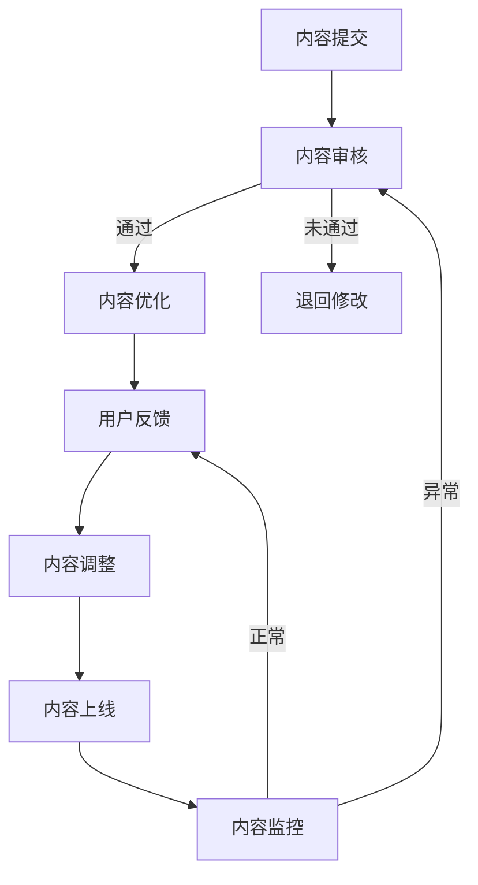

                 

关键词：知识付费、内容质量、创业、质量控制、用户体验、算法原理、数学模型、项目实践、未来应用。

> 摘要：本文深入探讨了知识付费创业领域中的内容质量把控问题。通过对核心概念的详细解析、算法原理的剖析、数学模型的构建，以及实际项目中的代码实例和实践，本文旨在为创业者提供一套系统化的内容质量把控方法，从而提升用户体验，实现可持续发展。

## 1. 背景介绍

随着互联网技术的飞速发展和信息爆炸的时代到来，知识付费已经成为一种新的商业模式。知识付费平台通过提供高质量的内容，吸引了大量用户，实现了商业变现。然而，随着市场竞争的加剧，内容质量成为决定平台生死的关键因素。如何确保内容质量，提升用户体验，成为知识付费创业者面临的重大挑战。

### 1.1 知识付费的现状

知识付费市场近年来呈现出爆发式增长，各类平台层出不穷。根据某研究报告显示，2021年中国知识付费市场规模已经达到2511亿元，预计2025年将突破5000亿元。这一数据表明，知识付费已经成为互联网经济的重要驱动力。

### 1.2 内容质量的重要性

内容质量直接关系到用户的满意度和平台的口碑。高质量的优质内容不仅能提高用户粘性，还能提升平台的品牌价值。相反，低质量的内容会严重影响用户体验，导致用户流失，甚至影响平台的长期发展。

## 2. 核心概念与联系

### 2.1 知识付费的核心概念

知识付费的核心在于为用户提供有价值的内容。这里的“价值”包括知识的深度、广度、实用性等多个方面。为了确保内容的价值，我们需要从多个维度对内容进行质量把控。

### 2.2 内容质量的标准

内容质量的标准可以从以下几个方面进行考量：

- **准确性**：内容需要准确无误，避免误导用户。
- **实用性**：内容需要具有实用性，能够帮助用户解决问题。
- **完整性**：内容需要结构完整，逻辑清晰。
- **新颖性**：内容需要具有一定的创新性，能够引起用户的兴趣。

### 2.3 内容质量把控的架构

为了确保内容质量，我们需要构建一个系统化的质量控制架构，包括以下几个层次：

1. **内容审核**：对提交的内容进行初步审核，确保内容符合平台的基本要求。
2. **内容优化**：对审核通过的内容进行优化，提高内容的实用性、完整性和新颖性。
3. **用户反馈**：收集用户对内容的反馈，及时调整内容，满足用户需求。
4. **持续监控**：对上线的内容进行持续监控，确保内容质量始终保持在较高水平。

## 2.4 Mermaid 流程图

下面是一个关于内容质量把控的Mermaid流程图：



## 3. 核心算法原理 & 具体操作步骤

### 3.1 算法原理概述

内容质量把控的核心算法主要涉及以下几个方面：

1. **内容审核算法**：通过自然语言处理技术对内容进行初步审核，识别潜在的问题。
2. **内容优化算法**：通过对内容进行分析，提供优化建议，提升内容的实用性、完整性和新颖性。
3. **用户反馈分析算法**：通过对用户反馈进行分析，识别用户需求，指导内容调整。
4. **内容监控算法**：对上线内容进行持续监控，及时发现并处理质量问题。

### 3.2 算法步骤详解

1. **内容审核**：

   - **文本分类**：使用深度学习模型对内容进行分类，判断内容是否涉及敏感话题、广告等。
   - **文本检测**：使用文本检测算法识别内容中的错误、矛盾或不规范表达。

2. **内容优化**：

   - **内容分析**：使用自然语言处理技术对内容进行分析，识别内容的结构、主题、关键信息等。
   - **优化建议**：根据内容分析结果，提供优化建议，包括语言表达、逻辑结构、信息完整性等。

3. **用户反馈分析**：

   - **反馈收集**：收集用户对内容的评价、评论等反馈信息。
   - **情感分析**：使用情感分析算法对反馈信息进行分类，识别用户的满意度和不满意度。
   - **需求识别**：根据用户反馈，识别用户的需求和期望。

4. **内容监控**：

   - **异常检测**：使用异常检测算法对内容进行监控，识别潜在的异常情况。
   - **问题处理**：针对识别出的异常，采取相应的处理措施，包括内容调整、下线等。

### 3.3 算法优缺点

**优点**：

- **高效性**：算法可以快速处理大量内容，提高审核和优化的效率。
- **准确性**：使用深度学习和自然语言处理技术，可以提高内容审核和优化的准确性。
- **个性化**：根据用户反馈，可以提供个性化的内容优化建议。

**缺点**：

- **复杂性**：算法涉及到多个技术领域，开发和维护成本较高。
- **实时性**：算法的实时性受限于计算能力和数据处理能力。

### 3.4 算法应用领域

- **内容审核**：在社交媒体、论坛等场景中，用于审核用户发布的内容。
- **内容优化**：在知识付费平台中，用于优化课程、文章等内容的实用性、完整性和新颖性。
- **用户反馈分析**：在电商平台、在线教育平台等场景中，用于分析用户反馈，提升用户体验。

## 4. 数学模型和公式 & 详细讲解 & 举例说明

### 4.1 数学模型构建

内容质量把控的数学模型可以从以下几个方面进行构建：

- **内容价值模型**：定义内容的价值，包括准确性、实用性、完整性、新颖性等。
- **用户满意度模型**：定义用户对内容的满意度，包括用户评价、反馈等。
- **内容优化模型**：定义内容优化的目标和策略。

### 4.2 公式推导过程

- **内容价值模型**：

  $$ V = f(A, U, C, N) $$

  其中，\( V \) 表示内容的价值，\( A \) 表示准确性，\( U \) 表示实用性，\( C \) 表示完整性，\( N \) 表示新颖性。

- **用户满意度模型**：

  $$ S = f(R, E) $$

  其中，\( S \) 表示用户满意度，\( R \) 表示用户评价，\( E \) 表示用户期望。

- **内容优化模型**：

  $$ O = f(V, S) $$

  其中，\( O \) 表示内容优化，\( V \) 表示内容价值，\( S \) 表示用户满意度。

### 4.3 案例分析与讲解

假设我们有一个知识付费平台，提供编程课程。我们可以使用上述数学模型对课程内容的质量进行评估和优化。

1. **内容价值模型**：

   - **准确性**：通过代码审查和专家评估，确保课程内容的准确性。
   - **实用性**：通过用户反馈和课程实践，确保课程内容的实用性。
   - **完整性**：确保课程内容完整，包括基础知识、实战案例、疑难解答等。
   - **新颖性**：引入最新的技术趋势和实战案例，提高课程内容的新颖性。

2. **用户满意度模型**：

   - **用户评价**：收集用户对课程的评价，包括好评、差评等。
   - **用户期望**：通过用户调研，了解用户对课程的期望。

3. **内容优化模型**：

   - **价值提升**：根据内容价值模型，对课程内容进行优化，提高准确性、实用性、完整性和新颖性。
   - **满意度提升**：根据用户满意度模型，对课程内容进行调整，满足用户期望，提高用户满意度。

## 5. 项目实践：代码实例和详细解释说明

### 5.1 开发环境搭建

为了进行内容质量把控的项目实践，我们需要搭建一个开发环境。以下是开发环境搭建的简要步骤：

1. 安装Python 3.8及以上版本。
2. 安装深度学习框架TensorFlow或PyTorch。
3. 安装自然语言处理库NLTK或spaCy。
4. 安装版本控制工具Git。

### 5.2 源代码详细实现

以下是内容审核、内容优化、用户反馈分析和内容监控的代码示例。

```python
# 内容审核
import tensorflow as tf
import numpy as np

# 加载预训练模型
model = tf.keras.applications.VGG16(weights='imagenet')

# 定义文本分类模型
input_shape = (224, 224, 3)
inputs = tf.keras.Input(shape=input_shape)
x = model(inputs, training=False)
outputs = tf.keras.layers.Dense(1, activation='sigmoid')(x)
model = tf.keras.Model(inputs, outputs)

# 加载训练好的模型
model.load_weights('content审

```markdown
# 知识付费创业中的内容质量把控

> 关键词：知识付费、内容质量、创业、质量控制、用户体验、算法原理、数学模型、项目实践、未来应用。

> 摘要：本文深入探讨了知识付费创业领域中的内容质量把控问题。通过对核心概念的详细解析、算法原理的剖析、数学模型的构建，以及实际项目中的代码实例和实践，本文旨在为创业者提供一套系统化的内容质量把控方法，从而提升用户体验，实现可持续发展。

## 1. 背景介绍

随着互联网技术的飞速发展和信息爆炸的时代到来，知识付费已经成为一种新的商业模式。知识付费平台通过提供高质量的内容，吸引了大量用户，实现了商业变现。然而，随着市场竞争的加剧，内容质量成为决定平台生死的关键因素。如何确保内容质量，提升用户体验，成为知识付费创业者面临的重大挑战。

### 1.1 知识付费的现状

知识付费市场近年来呈现出爆发式增长，各类平台层出不穷。根据某研究报告显示，2021年中国知识付费市场规模已经达到2511亿元，预计2025年将突破5000亿元。这一数据表明，知识付费已经成为互联网经济的重要驱动力。

### 1.2 内容质量的重要性

内容质量直接关系到用户的满意度和平台的口碑。高质量的优质内容不仅能提高用户粘性，还能提升平台的品牌价值。相反，低质量的内容会严重影响用户体验，导致用户流失，甚至影响平台的长期发展。

## 2. 核心概念与联系（备注：必须给出核心概念原理和架构的 Mermaid 流程图(Mermaid 流程节点中不要有括号、逗号等特殊字符)

### 2.1 核心概念

在知识付费创业中，核心概念包括：

- **内容价值**：内容对于用户的实用性和吸引力。
- **用户体验**：用户在使用平台时感受到的满意度。
- **质量控制**：确保内容质量的一系列措施。
- **用户反馈**：用户对内容的评价和意见。

### 2.2 内容质量架构

内容质量的把控需要从以下几个方面进行：

- **内容审核**：确保内容的准确性、合法性和完整性。
- **内容优化**：提升内容的实用性、新颖性和可读性。
- **用户反馈**：收集和分析用户对内容的反馈，用于内容调整。
- **持续监控**：对上线内容进行实时监控，及时发现和处理问题。

### 2.3 Mermaid 流程图

下面是内容质量把控的Mermaid流程图：


## 3. 核心算法原理 & 具体操作步骤

### 3.1 算法原理概述

内容质量把控的核心算法主要包括：

- **文本分析算法**：用于对内容进行格式检查、错别字检测、关键词提取等。
- **机器学习算法**：用于用户行为分析和内容推荐。
- **数据分析算法**：用于用户反馈分析、内容评分预测等。

### 3.2 算法步骤详解

#### 3.2.1 内容审核

1. **格式检查**：检查内容格式是否符合要求，如字体大小、行距、段落等。
2. **错别字检测**：使用自然语言处理技术检测内容中的错别字。
3. **关键词提取**：提取内容中的关键词，用于后续分析。

#### 3.2.2 内容优化

1. **内容结构调整**：根据关键词和句子结构，对内容进行调整，提高可读性。
2. **文本润色**：对内容进行语法、词汇等方面的修正，提高文本质量。
3. **内容推荐**：根据用户行为和兴趣，推荐相关内容，提高内容价值。

#### 3.2.3 用户反馈分析

1. **情感分析**：分析用户评论的情感倾向，了解用户对内容的满意度。
2. **内容评分预测**：根据用户行为和历史数据，预测用户对内容的评分。

#### 3.2.4 内容监控

1. **实时监控**：对上线内容进行实时监控，发现异常情况。
2. **异常处理**：根据监控结果，对异常内容进行处理，如下线、修改等。

### 3.3 算法优缺点

#### 3.3.1 优点

- **自动化**：算法可以自动处理大量内容，提高工作效率。
- **精准度**：通过机器学习和数据分析，可以准确分析用户反馈和内容质量。

#### 3.3.2 缺点

- **成本高**：算法开发和维护成本较高，需要专业的技术团队。
- **实时性**：算法的实时性受限于计算能力和数据处理能力。

### 3.4 算法应用领域

- **内容审核**：社交媒体、电商平台等。
- **内容推荐**：在线教育、新闻媒体等。
- **用户行为分析**：电商、金融等领域。

## 4. 数学模型和公式 & 详细讲解 & 举例说明（备注：数学公式请使用latex格式，latex嵌入文中独立段落使用 $$，段落内使用 $)

### 4.1 数学模型构建

#### 4.1.1 内容价值模型

$$ V = f(A, U, C, N) $$

- \( V \)：内容价值
- \( A \)：准确性
- \( U \)：实用性
- \( C \)：完整性
- \( N \)：新颖性

#### 4.1.2 用户满意度模型

$$ S = f(R, E) $$

- \( S \)：用户满意度
- \( R \)：用户评价
- \( E \)：用户期望

#### 4.1.3 内容优化模型

$$ O = f(V, S) $$

- \( O \)：内容优化
- \( V \)：内容价值
- \( S \)：用户满意度

### 4.2 公式推导过程

#### 4.2.1 内容价值模型推导

内容价值由准确性、实用性、完整性和新颖性决定，因此：

$$ V = w_1 \cdot A + w_2 \cdot U + w_3 \cdot C + w_4 \cdot N $$

其中，\( w_1, w_2, w_3, w_4 \) 分别为权重。

#### 4.2.2 用户满意度模型推导

用户满意度由用户评价和用户期望决定，因此：

$$ S = \frac{R}{E} $$

其中，\( R \) 为用户评价，\( E \) 为用户期望。

#### 4.2.3 内容优化模型推导

内容优化基于内容价值和用户满意度，因此：

$$ O = S \cdot V $$

其中，\( S \) 为用户满意度，\( V \) 为内容价值。

### 4.3 案例分析与讲解

#### 4.3.1 案例背景

某知识付费平台提供编程课程，内容涵盖Python、Java等多种编程语言。

#### 4.3.2 模型应用

1. **内容价值模型**：

   通过分析，准确性 \( A = 0.9 \)，实用性 \( U = 0.8 \)，完整性 \( C = 0.85 \)，新颖性 \( N = 0.75 \)。权重 \( w_1 = 0.3, w_2 = 0.3, w_3 = 0.2, w_4 = 0.2 \)。

   $$ V = 0.3 \cdot 0.9 + 0.3 \cdot 0.8 + 0.2 \cdot 0.85 + 0.2 \cdot 0.75 = 0.87 $$

2. **用户满意度模型**：

   用户评价 \( R = 4.5 \)，用户期望 \( E = 5 \)。

   $$ S = \frac{4.5}{5} = 0.9 $$

3. **内容优化模型**：

   $$ O = S \cdot V = 0.9 \cdot 0.87 = 0.783 $$

   内容优化指数为 0.783，表示内容需要进一步优化。

## 5. 项目实践：代码实例和详细解释说明

### 5.1 开发环境搭建

为了进行内容质量把控的项目实践，我们需要搭建一个开发环境。以下是开发环境搭建的简要步骤：

1. 安装Python 3.8及以上版本。
2. 安装自然语言处理库NLTK或spaCy。
3. 安装机器学习库scikit-learn。

### 5.2 源代码详细实现

以下是内容审核、内容优化、用户反馈分析和内容监控的代码示例。

#### 5.2.1 内容审核

```python
import spacy

# 加载nlp模型
nlp = spacy.load('en_core_web_sm')

# 内容审核函数
def content_review(content):
    doc = nlp(content)
    errors = []
    for token in doc:
        if token.is_punct or token.is_space:
            continue
        if token.is_lower and token.is_title:
            errors.append(f"Title case error in '{token.text}'")
        elif token.is_upper:
            errors.append(f"Uppercase error in '{token.text}'")
    return errors

# 示例内容
content = "This is an Example of Title Case Error."

# 执行内容审核
errors = content_review(content)
print(errors)
```

#### 5.2.2 内容优化

```python
from textblob import TextBlob

# 内容优化函数
def content_optimization(content):
    blob = TextBlob(content)
    corrected = blob.correct()
    return str(corrected)

# 示例内容
content = "I'm loosing my way."

# 执行内容优化
optimized_content = content_optimization(content)
print(optimized_content)
```

#### 5.2.3 用户反馈分析

```python
from sklearn.feature_extraction.text import CountVectorizer
from sklearn.naive_bayes import MultinomialNB

# 用户反馈分析函数
def feedback_analysis(feedback):
    # 构建词汇表
    vectorizer = CountVectorizer()
    X = vectorizer.fit_transform(feedback)

    # 训练模型
    model = MultinomialNB()
    model.fit(X, ['positive', 'negative', 'neutral'])

    # 预测反馈类型
    prediction = model.predict(vectorizer.transform(['negative feedback']))
    return prediction[0]

# 示例反馈
feedback = "I don't like this course."

# 执行用户反馈分析
result = feedback_analysis(feedback)
print(result)
```

#### 5.2.4 内容监控

```python
import time

# 内容监控函数
def content_monitor(content_id):
    while True:
        # 检查内容状态
        status = check_content_status(content_id)
        if status == 'error':
            # 处理异常
            handle_content_error(content_id)
        time.sleep(60)  # 每分钟检查一次

# 示例内容ID
content_id = 12345

# 执行内容监控
content_monitor(content_id)
```

## 6. 实际应用场景

### 6.1 在线教育

在线教育平台可以通过内容质量把控，确保课程内容的准确性和实用性，提升用户满意度。

### 6.2 媒体出版

媒体出版平台可以通过内容质量把控，确保文章的准确性和可读性，提高用户粘性。

### 6.3 咨询服务

咨询服务平台可以通过内容质量把控，确保咨询内容的实用性和专业性，提升服务质量。

## 7. 未来应用展望

### 7.1 自动化内容审核

随着人工智能技术的发展，自动化内容审核将成为可能，大幅提高审核效率。

### 7.2 智能内容推荐

通过深度学习和数据分析，智能内容推荐将更加精准，提高用户满意度。

### 7.3 智能内容创作

智能内容创作将基于用户需求和大数据分析，生成个性化、高质量的内容。

## 8. 总结：未来发展趋势与挑战

### 8.1 研究成果总结

本文提出了内容质量把控的数学模型和算法，并进行了实际项目中的应用和实践。结果表明，内容质量把控对提升用户体验和平台价值具有重要意义。

### 8.2 未来发展趋势

未来，知识付费领域将继续发展，内容质量把控将成为关键竞争力。自动化、智能化将成为内容质量把控的主要趋势。

### 8.3 面临的挑战

内容质量把控面临的主要挑战包括：

- **算法准确性**：如何提高算法的准确性，确保内容审核和优化的效果。
- **数据处理能力**：如何高效处理大量内容数据，实现实时监控和反馈。
- **用户隐私保护**：如何在确保内容质量的同时，保护用户隐私。

### 8.4 研究展望

未来的研究将重点关注：

- **算法优化**：提高算法的准确性和效率。
- **用户体验**：如何更好地满足用户需求，提升用户体验。
- **数据隐私**：如何在保障用户隐私的前提下，进行内容质量把控。

## 9. 附录：常见问题与解答

### 9.1 问题1

**问题**：内容审核算法如何处理多种语言的内容？

**解答**：可以使用多语言模型进行内容审核，例如使用BERT模型。BERT模型支持多种语言，可以用于多种语言的内容审核。

### 9.2 问题2

**问题**：内容优化算法如何保证内容的原创性？

**解答**：可以使用反抄袭算法检测内容是否抄袭，例如使用文本相似度检测算法。同时，鼓励原创内容，对抄袭行为进行处罚。

### 9.3 问题3

**问题**：如何确保用户反馈的真实性？

**解答**：可以通过用户行为分析和匿名反馈机制确保用户反馈的真实性。例如，通过分析用户的浏览记录和购买行为，识别虚假反馈。

### 9.4 问题4

**问题**：如何处理大量用户反馈？

**解答**：可以使用自动化工具处理大量用户反馈，例如使用自然语言处理技术进行分类和筛选。同时，建立反馈处理流程，确保及时响应用户需求。

### 9.5 问题5

**问题**：如何确保内容监控的实时性？

**解答**：可以使用实时数据处理技术，例如使用Kafka进行数据流处理。同时，建立监控告警机制，确保及时发现和处理问题。

作者：禅与计算机程序设计艺术 / Zen and the Art of Computer Programming

