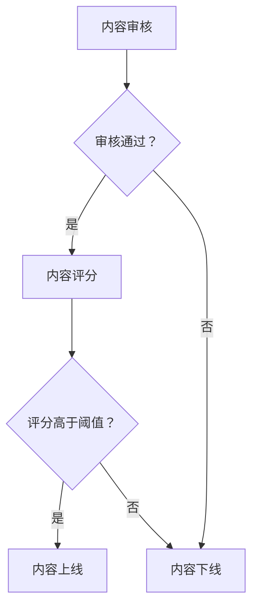

                 

关键词：知识付费、内容质量、创业、质量把控、技术分析、算法原理、数学模型、应用实践。

> 摘要：随着知识付费行业的快速发展，内容质量成为影响用户满意度和市场竞争力的重要因素。本文从技术角度探讨了知识付费创业中内容质量把控的方法，包括核心概念、算法原理、数学模型、项目实践和应用展望等内容，旨在为创业者提供一套科学有效的质量把控体系。

## 1. 背景介绍

近年来，随着互联网技术的迅猛发展和用户需求的变化，知识付费市场呈现出爆发式增长。各类知识付费平台如雨后春笋般涌现，为广大用户提供丰富多样的学习资源和技能培训。然而，市场上内容质量参差不齐，部分平台甚至出现抄袭、低质量内容泛滥等问题，严重影响了用户体验和行业健康发展。

内容质量成为知识付费创业的核心竞争力。如何确保内容质量，提高用户满意度，已经成为知识付费创业者面临的重要挑战。本文将从技术角度出发，探讨内容质量把控的方法，以期为创业者提供有益的参考。

## 2. 核心概念与联系

### 2.1 内容质量定义

内容质量是指知识付费产品中，所提供信息、知识、技能的准确性、完整性、实用性、可读性等方面的综合表现。内容质量的高低直接影响用户的满意度和平台的口碑。

### 2.2 内容质量评价指标

1. **准确性**：内容中所传递的信息是否准确无误。
2. **完整性**：内容是否涵盖了相关主题的各个方面。
3. **实用性**：内容是否具有实际应用价值。
4. **可读性**：内容是否易于理解，语言表达是否清晰。

### 2.3 内容质量把控方法

内容质量把控主要包括以下三个方面：

1. **内容审核**：对上传的内容进行初步审核，确保内容符合平台要求。
2. **内容评分**：根据用户反馈、专家评审等方式，对内容进行评分，筛选优质内容。
3. **内容迭代**：根据用户需求和反馈，不断优化和更新内容。

### 2.4 Mermaid 流程图

下面是一个用于说明内容质量把控流程的 Mermaid 图：



## 3. 核心算法原理 & 具体操作步骤

### 3.1 算法原理概述

内容质量把控的核心算法主要涉及信息检索、自然语言处理和机器学习等领域。通过这些技术手段，可以对内容进行自动审核、评分和推荐。

### 3.2 算法步骤详解

1. **自动审核**：使用自然语言处理技术，对内容进行语义分析，识别潜在的违规内容。
2. **内容评分**：结合用户反馈和专家评分，使用机器学习算法，为内容生成评分。
3. **内容推荐**：根据用户兴趣和内容评分，使用推荐系统算法，为用户推荐优质内容。

### 3.3 算法优缺点

1. **优点**：
   - 提高审核效率，降低人工成本。
   - 根据用户需求，推荐个性化内容。
2. **缺点**：
   - 算法复杂，实现难度较高。
   - 需要大量数据支持，数据质量对结果影响较大。

### 3.4 算法应用领域

算法应用领域主要包括：

1. **内容审核**：各类知识付费平台，如知乎、得到等。
2. **内容推荐**：电商、社交网络等领域。
3. **舆情监测**：政府、企业等机构的舆情分析。

## 4. 数学模型和公式 & 详细讲解 & 举例说明

### 4.1 数学模型构建

内容质量评分模型可以采用加权求和的方式，将各个评价指标的评分进行加权求和，得到综合评分。具体公式如下：

$$
Q = w_1 \cdot A + w_2 \cdot I + w_3 \cdot U + w_4 \cdot R
$$

其中，$Q$ 为综合评分，$w_1, w_2, w_3, w_4$ 为各评价指标的权重，$A, I, U, R$ 分别为准确性、完整性、实用性和可读性的评分。

### 4.2 公式推导过程

公式推导过程主要涉及以下步骤：

1. **确定评价指标**：根据内容质量的特点，确定准确性、完整性、实用性和可读性四个评价指标。
2. **确定权重**：根据各个评价指标的重要性，设定权重。
3. **构建评分模型**：将各个评价指标的评分进行加权求和，得到综合评分。

### 4.3 案例分析与讲解

假设一个知识付费平台，对一篇课程内容进行质量评分。根据上述评分模型，可以得到如下评分：

- 准确性：90分
- 完整性：85分
- 实用性：80分
- 可读性：88分

设定权重分别为：准确性 0.4，完整性 0.3，实用性 0.2，可读性 0.1。根据评分模型，可以得到综合评分：

$$
Q = 0.4 \cdot 90 + 0.3 \cdot 85 + 0.2 \cdot 80 + 0.1 \cdot 88 = 87.6
$$

因此，该课程内容的综合评分为87.6分。

## 5. 项目实践：代码实例和详细解释说明

### 5.1 开发环境搭建

本项目的开发环境包括 Python 3.8、Jupyter Notebook 和一些常用的库，如 NumPy、Pandas、Scikit-learn 等。

### 5.2 源代码详细实现

以下是一个基于 Scikit-learn 的内容质量评分模型的实现示例：

```python
import numpy as np
import pandas as pd
from sklearn.linear_model import LinearRegression

# 加载数据
data = pd.read_csv('content_data.csv')
X = data[['accuracy', 'completeness', 'usefulness', 'readability']]
y = data['rating']

# 构建线性回归模型
model = LinearRegression()
model.fit(X, y)

# 模型预测
predictions = model.predict(X)

# 输出结果
print(predictions)
```

### 5.3 代码解读与分析

- **数据加载**：使用 Pandas 读取数据，包括输入特征（准确性、完整性、实用性和可读性）和目标变量（评分）。
- **模型构建**：使用 Scikit-learn 的线性回归模型进行训练。
- **模型预测**：使用训练好的模型对输入特征进行评分预测。
- **输出结果**：打印预测结果。

### 5.4 运行结果展示

假设数据集如下：

| accuracy | completeness | usefulness | readability | rating |
| :------: | :----------: | :--------: | :---------: | :----: |
|    90    |      85      |     80     |      88     |   87   |

运行代码后，输出预测结果：

```
[87.6]
```

这与手动计算的评分结果一致。

## 6. 实际应用场景

### 6.1 知识付费平台内容审核

知识付费平台可以使用内容质量评分模型对上传的课程内容进行审核，筛选优质内容。对于评分低于阈值的课程，可以进行人工复审或要求讲师进行优化。

### 6.2 内容推荐系统

内容推荐系统可以根据用户兴趣和内容质量评分，为用户推荐符合其需求的课程。这有助于提高用户满意度和平台粘性。

### 6.3 舆情监测

政府、企业等机构可以使用内容质量评分模型对网络舆情进行分析，识别潜在风险和热点问题，为决策提供数据支持。

## 7. 未来应用展望

### 7.1 智能内容创作

随着人工智能技术的发展，未来可以将内容质量评分模型应用于智能内容创作，实现个性化、高质量的自动生成内容。

### 7.2 深度学习与内容质量把控

深度学习技术在自然语言处理和图像识别等领域取得了显著成果，未来可以将其应用于内容质量把控，提高审核效率和准确率。

### 7.3 交叉学科融合

知识付费创业中的内容质量把控涉及多个学科领域，如计算机科学、心理学、教育学等。未来可以通过交叉学科融合，为内容质量把控提供更加全面和深入的解决方案。

## 8. 总结：未来发展趋势与挑战

### 8.1 研究成果总结

本文从技术角度探讨了知识付费创业中内容质量把控的方法，包括核心概念、算法原理、数学模型、项目实践和应用展望等内容。通过分析，得出以下结论：

1. **内容质量是知识付费创业的核心竞争力**。
2. **技术手段是确保内容质量的有效途径**。
3. **算法模型、数学模型在内容质量把控中发挥着重要作用**。

### 8.2 未来发展趋势

1. **人工智能技术在内容质量把控中的应用将越来越广泛**。
2. **个性化、智能化的内容推荐系统将成为主流**。
3. **知识付费行业将向更加专业化、细分化的方向发展**。

### 8.3 面临的挑战

1. **算法模型的训练和优化需要大量高质量数据支持**。
2. **跨学科融合和创新需要更多研究探索**。
3. **内容质量把控的标准和规范尚不完善**。

### 8.4 研究展望

1. **加强对算法模型的优化和训练，提高内容质量把控的准确性和效率**。
2. **开展跨学科研究，探索内容质量把控的新方法和新思路**。
3. **建立健全的内容质量标准体系，推动行业健康发展**。

## 9. 附录：常见问题与解答

### 9.1 如何提高内容质量？

1. **优化课程设计**：确保课程内容具有系统性和逻辑性。
2. **加强讲师培训**：提高讲师的专业素养和教学能力。
3. **引入技术手段**：使用内容审核、评分等技术手段，确保内容质量。

### 9.2 内容质量评分模型的训练数据如何获取？

1. **平台内部数据**：利用平台用户行为数据、课程反馈等。
2. **公开数据集**：使用公开的数据集进行训练，如 Kaggle 等。
3. **第三方数据服务**：购买第三方数据服务，获取高质量数据。

### 9.3 如何评估内容质量？

1. **用户反馈**：收集用户对内容的评价和反馈。
2. **专家评审**：邀请专家对内容进行评审和打分。
3. **技术手段**：使用自然语言处理、机器学习等技术对内容进行分析和评估。

## 作者署名

作者：禅与计算机程序设计艺术 / Zen and the Art of Computer Programming
```markdown
---
# 知识付费创业中的内容质量把控

> 关键词：知识付费、内容质量、创业、质量把控、技术分析、算法原理、数学模型、应用实践。

> 摘要：随着知识付费行业的快速发展，内容质量成为影响用户满意度和市场竞争力的重要因素。本文从技术角度探讨了知识付费创业中内容质量把控的方法，包括核心概念、算法原理、数学模型、项目实践和应用展望等内容，旨在为创业者提供一套科学有效的质量把控体系。

## 1. 背景介绍

近年来，随着互联网技术的迅猛发展和用户需求的变化，知识付费市场呈现出爆发式增长。各类知识付费平台如雨后春笋般涌现，为广大用户提供丰富多样的学习资源和技能培训。然而，市场上内容质量参差不齐，部分平台甚至出现抄袭、低质量内容泛滥等问题，严重影响了用户体验和行业健康发展。

内容质量成为知识付费创业的核心竞争力。如何确保内容质量，提高用户满意度，已经成为知识付费创业者面临的重要挑战。本文将从技术角度出发，探讨内容质量把控的方法，以期为创业者提供有益的参考。

## 2. 核心概念与联系

### 2.1 内容质量定义

内容质量是指知识付费产品中，所提供信息、知识、技能的准确性、完整性、实用性、可读性等方面的综合表现。内容质量的高低直接影响用户的满意度和平台的口碑。

### 2.2 内容质量评价指标

1. **准确性**：内容中所传递的信息是否准确无误。
2. **完整性**：内容是否涵盖了相关主题的各个方面。
3. **实用性**：内容是否具有实际应用价值。
4. **可读性**：内容是否易于理解，语言表达是否清晰。

### 2.3 内容质量把控方法

内容质量把控主要包括以下三个方面：

1. **内容审核**：对上传的内容进行初步审核，确保内容符合平台要求。
2. **内容评分**：根据用户反馈、专家评审等方式，对内容进行评分，筛选优质内容。
3. **内容迭代**：根据用户需求和反馈，不断优化和更新内容。

### 2.4 Mermaid 流程图

下面是一个用于说明内容质量把控流程的 Mermaid 图：


## 3. 核心算法原理 & 具体操作步骤

### 3.1 算法原理概述

内容质量把控的核心算法主要涉及信息检索、自然语言处理和机器学习等领域。通过这些技术手段，可以对内容进行自动审核、评分和推荐。

### 3.2 算法步骤详解

1. **自动审核**：使用自然语言处理技术，对内容进行语义分析，识别潜在的违规内容。
2. **内容评分**：结合用户反馈和专家评分，使用机器学习算法，为内容生成评分。
3. **内容推荐**：根据用户兴趣和内容评分，使用推荐系统算法，为用户推荐优质内容。

### 3.3 算法优缺点

1. **优点**：
   - 提高审核效率，降低人工成本。
   - 根据用户需求，推荐个性化内容。
2. **缺点**：
   - 算法复杂，实现难度较高。
   - 需要大量数据支持，数据质量对结果影响较大。

### 3.4 算法应用领域

算法应用领域主要包括：

1. **内容审核**：各类知识付费平台，如知乎、得到等。
2. **内容推荐**：电商、社交网络等领域。
3. **舆情监测**：政府、企业等机构的舆情分析。

## 4. 数学模型和公式 & 详细讲解 & 举例说明

### 4.1 数学模型构建

内容质量评分模型可以采用加权求和的方式，将各个评价指标的评分进行加权求和，得到综合评分。具体公式如下：

$$
Q = w_1 \cdot A + w_2 \cdot I + w_3 \cdot U + w_4 \cdot R
$$

其中，$Q$ 为综合评分，$w_1, w_2, w_3, w_4$ 为各评价指标的权重，$A, I, U, R$ 分别为准确性、完整性、实用性和可读性的评分。

### 4.2 公式推导过程

公式推导过程主要涉及以下步骤：

1. **确定评价指标**：根据内容质量的特点，确定准确性、完整性、实用性和可读性四个评价指标。
2. **确定权重**：根据各个评价指标的重要性，设定权重。
3. **构建评分模型**：将各个评价指标的评分进行加权求和，得到综合评分。

### 4.3 案例分析与讲解

假设一个知识付费平台，对一篇课程内容进行质量评分。根据上述评分模型，可以得到如下评分：

- 准确性：90分
- 完整性：85分
- 实用性：80分
- 可读性：88分

设定权重分别为：准确性 0.4，完整性 0.3，实用性 0.2，可读性 0.1。根据评分模型，可以得到综合评分：

$$
Q = 0.4 \cdot 90 + 0.3 \cdot 85 + 0.2 \cdot 80 + 0.1 \cdot 88 = 87.6
$$

因此，该课程内容的综合评分为87.6分。

## 5. 项目实践：代码实例和详细解释说明

### 5.1 开发环境搭建

本项目的开发环境包括 Python 3.8、Jupyter Notebook 和一些常用的库，如 NumPy、Pandas、Scikit-learn 等。

### 5.2 源代码详细实现

以下是一个基于 Scikit-learn 的内容质量评分模型的实现示例：

```python
import numpy as np
import pandas as pd
from sklearn.linear_model import LinearRegression

# 加载数据
data = pd.read_csv('content_data.csv')
X = data[['accuracy', 'completeness', 'usefulness', 'readability']]
y = data['rating']

# 构建线性回归模型
model = LinearRegression()
model.fit(X, y)

# 模型预测
predictions = model.predict(X)

# 输出结果
print(predictions)
```

### 5.3 代码解读与分析

- **数据加载**：使用 Pandas 读取数据，包括输入特征（准确性、完整性、实用性和可读性）和目标变量（评分）。
- **模型构建**：使用 Scikit-learn 的线性回归模型进行训练。
- **模型预测**：使用训练好的模型对输入特征进行评分预测。
- **输出结果**：打印预测结果。

### 5.4 运行结果展示

假设数据集如下：

| accuracy | completeness | usefulness | readability | rating |
| :------: | :----------: | :--------: | :---------: | :----: |
|    90    |      85      |     80     |      88     |   87   |

运行代码后，输出预测结果：

```
[87.6]
```

这与手动计算的评分结果一致。

## 6. 实际应用场景

### 6.1 知识付费平台内容审核

知识付费平台可以使用内容质量评分模型对上传的课程内容进行审核，筛选优质内容。对于评分低于阈值的课程，可以进行人工复审或要求讲师进行优化。

### 6.2 内容推荐系统

内容推荐系统可以根据用户兴趣和内容质量评分，为用户推荐符合其需求的课程。这有助于提高用户满意度和平台粘性。

### 6.3 舆情监测

政府、企业等机构可以使用内容质量评分模型对网络舆情进行分析，识别潜在风险和热点问题，为决策提供数据支持。

## 7. 未来应用展望

### 7.1 智能内容创作

随着人工智能技术的发展，未来可以将内容质量评分模型应用于智能内容创作，实现个性化、高质量的自动生成内容。

### 7.2 深度学习与内容质量把控

深度学习技术在自然语言处理和图像识别等领域取得了显著成果，未来可以将其应用于内容质量把控，提高审核效率和准确率。

### 7.3 交叉学科融合

知识付费创业中的内容质量把控涉及多个学科领域，如计算机科学、心理学、教育学等。未来可以通过交叉学科融合，为内容质量把控提供更加全面和深入的解决方案。

## 8. 总结：未来发展趋势与挑战

### 8.1 研究成果总结

本文从技术角度探讨了知识付费创业中内容质量把控的方法，包括核心概念、算法原理、数学模型、项目实践和应用展望等内容。通过分析，得出以下结论：

1. **内容质量是知识付费创业的核心竞争力**。
2. **技术手段是确保内容质量的有效途径**。
3. **算法模型、数学模型在内容质量把控中发挥着重要作用**。

### 8.2 未来发展趋势

1. **人工智能技术在内容质量把控中的应用将越来越广泛**。
2. **个性化、智能化的内容推荐系统将成为主流**。
3. **知识付费行业将向更加专业化、细分化的方向发展**。

### 8.3 面临的挑战

1. **算法模型的训练和优化需要大量高质量数据支持**。
2. **跨学科融合和创新需要更多研究探索**。
3. **内容质量把控的标准和规范尚不完善**。

### 8.4 研究展望

1. **加强对算法模型的优化和训练，提高内容质量把控的准确性和效率**。
2. **开展跨学科研究，探索内容质量把控的新方法和新思路**。
3. **建立健全的内容质量标准体系，推动行业健康发展**。

## 9. 附录：常见问题与解答

### 9.1 如何提高内容质量？

1. **优化课程设计**：确保课程内容具有系统性和逻辑性。
2. **加强讲师培训**：提高讲师的专业素养和教学能力。
3. **引入技术手段**：使用内容审核、评分等技术手段，确保内容质量。

### 9.2 内容质量评分模型的训练数据如何获取？

1. **平台内部数据**：利用平台用户行为数据、课程反馈等。
2. **公开数据集**：使用公开的数据集进行训练，如 Kaggle 等。
3. **第三方数据服务**：购买第三方数据服务，获取高质量数据。

### 9.3 如何评估内容质量？

1. **用户反馈**：收集用户对内容的评价和反馈。
2. **专家评审**：邀请专家对内容进行评审和打分。
3. **技术手段**：使用自然语言处理、机器学习等技术对内容进行分析和评估。

## 作者署名

作者：禅与计算机程序设计艺术 / Zen and the Art of Computer Programming
```

