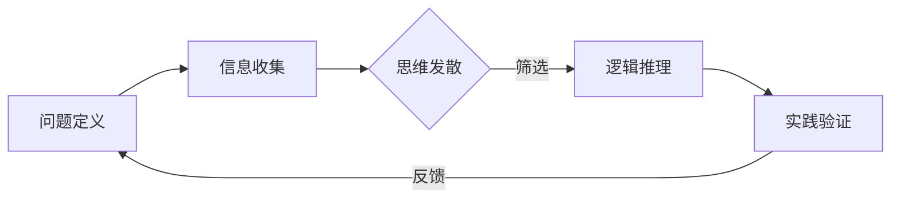

                 

 在当今信息爆炸的时代，知识付费已经成为一种流行趋势。越来越多的人开始通过付费获取高质量的知识和技能，以提升自己的竞争力。知识付费创业也因此成为了一个充满机遇的领域。然而，在这个充满竞争的市场中，如何通过创新思维脱颖而出，成为了创业者们关注的焦点。本文将深入探讨知识付费创业中的创新思维，旨在为创业者提供一些实用的策略和思路。

## 1. 背景介绍

知识付费，即用户为获取特定知识或服务而付费的行为。这种模式在互联网的推动下迅速兴起，主要得益于以下几个因素：

1. **信息过载**：随着互联网信息的爆炸性增长，人们面对大量冗余和低质量的信息，开始寻求更为专业、高效的知识来源。
2. **用户需求**：随着经济的发展和人们生活水平的提高，用户对于高质量知识和服务的需求日益增长。
3. **互联网技术**：互联网和移动互联网的普及，为知识付费提供了便捷的平台和传播渠道。

知识付费创业则是指创业者利用知识付费的模式，通过提供专业、系统的知识或服务，满足用户的需求，并实现商业价值的过程。这种创业模式具有以下几个特点：

1. **知识价值**：知识付费创业的核心在于知识的价值，创业者需要拥有或整合优质的知识资源。
2. **用户群体**：知识付费的用户群体广泛，涵盖了职场人士、学生、创业者等多个层次。
3. **商业模式**：知识付费创业的商业模式多样，包括付费课程、知识咨询、付费社群等。

## 2. 核心概念与联系

### 2.1 创新思维的定义

创新思维是指通过新颖的方法和视角，解决实际问题或创造出新价值的过程。在知识付费创业中，创新思维是关键，它能够帮助创业者发现市场需求，提供独特的解决方案。

### 2.2 创新思维的组成部分

创新思维包括以下几个关键组成部分：

1. **问题意识**：识别并理解用户需求，明确问题所在。
2. **思维发散**：在解决问题的过程中，不拘泥于传统方法，勇于尝试新的思路和解决方案。
3. **逻辑思维**：在发散思维的基础上，进行系统的分析和推理，确保解决方案的可行性和有效性。
4. **执行力**：将创新思维转化为实际行动，通过实践验证和优化解决方案。

### 2.3 创新思维与知识付费创业的关系

创新思维在知识付费创业中具有重要作用：

1. **发现需求**：通过创新思维，创业者能够更好地理解用户需求，发现市场需求，提供更符合用户期望的知识和服务。
2. **创造价值**：创新思维帮助创业者创造出独特的知识产品或服务，提升用户的满意度和忠诚度，从而实现商业价值。
3. **降低风险**：创新思维可以帮助创业者预见潜在的问题和挑战，提前做好风险防控，降低创业风险。

### 2.4 创新思维的应用框架

创新思维在知识付费创业中的应用可以概括为以下几个步骤：

1. **问题定义**：明确创业目标和用户需求，将问题具体化。
2. **信息收集**：收集相关领域的知识和信息，为创新提供素材。
3. **思维发散**：从不同的角度和层面思考解决方案，不拘泥于传统方法。
4. **逻辑推理**：对发散出的思路进行筛选和分析，确保解决方案的可行性。
5. **实践验证**：将创新思维转化为实际行动，通过用户反馈不断优化。

### 2.5 创新思维的应用 Mermaid 流程图

下面是一个简单的创新思维在知识付费创业中的应用 Mermaid 流程图：



## 3. 核心算法原理 & 具体操作步骤

### 3.1 算法原理概述

在知识付费创业中，创新思维的应用可以被视为一种算法。这种算法的核心在于如何通过新颖的方法和视角，发现用户需求，创造价值。具体来说，该算法包括以下几个步骤：

1. **问题定义**：通过调研、访谈等方式，明确用户的需求和创业目标。
2. **信息收集**：收集相关领域的知识和信息，为创新提供素材。
3. **思维发散**：从不同的角度和层面思考解决方案，不拘泥于传统方法。
4. **逻辑推理**：对发散出的思路进行筛选和分析，确保解决方案的可行性。
5. **实践验证**：将创新思维转化为实际行动，通过用户反馈不断优化。

### 3.2 算法步骤详解

#### 3.2.1 问题定义

问题定义是创新思维的第一步，它决定了后续创新的方向和目标。具体操作步骤如下：

1. **明确创业目标**：创业者需要明确自己的创业目标和愿景，这将指导后续的创新过程。
2. **调研用户需求**：通过访谈、问卷调查等方式，了解目标用户的需求和痛点。
3. **分析竞争环境**：研究竞争对手的产品和服务，找出差异化的机会。

#### 3.2.2 信息收集

信息收集是创新思维的重要基础。通过收集相关领域的知识和信息，创业者可以为创新提供丰富的素材。具体操作步骤如下：

1. **查阅文献资料**：阅读相关的书籍、论文、报告等，了解行业动态和前沿技术。
2. **访谈行业专家**：与行业内的专家进行交流，获取专业的见解和建议。
3. **参加行业活动**：参加行业会议、展览等活动，了解最新的市场趋势和需求。

#### 3.2.3 思维发散

思维发散是创新思维的核心环节，它要求创业者跳出传统的思维框架，从不同的角度和层面思考解决方案。具体操作步骤如下：

1. **头脑风暴**：组织团队成员进行头脑风暴，鼓励大家提出各种可能的解决方案。
2. **思维导图**：使用思维导图工具，将发散的思维可视化，便于整理和分析。
3. **跨领域借鉴**：借鉴其他领域的成功经验和技术，寻找创新的可能性。

#### 3.2.4 逻辑推理

逻辑推理是对发散出的思路进行筛选和分析，确保解决方案的可行性。具体操作步骤如下：

1. **筛选方案**：根据创业目标和用户需求，筛选出具有可行性的方案。
2. **评估风险**：对每个方案进行风险评估，分析可能的风险和挑战。
3. **制定计划**：为每个可行的方案制定详细的实施计划，明确责任人和时间表。

#### 3.2.5 实践验证

实践验证是将创新思维转化为实际行动，通过用户反馈不断优化。具体操作步骤如下：

1. **最小可行性产品（MVP）**：开发一个最小可行性产品，验证核心功能是否满足用户需求。
2. **用户反馈**：收集用户的使用反馈，了解产品的优势和不足。
3. **持续迭代**：根据用户反馈，不断优化产品，提升用户体验。

### 3.3 算法优缺点

#### 优点

1. **灵活性**：创新思维算法具有高度的灵活性，能够适应不断变化的市场需求。
2. **高效性**：通过快速迭代和用户反馈，创新思维算法能够快速验证和优化解决方案。
3. **创造性**：创新思维算法鼓励思维发散，有助于创造出独特的知识产品或服务。

#### 缺点

1. **风险**：创新过程中，存在一定的风险，包括技术风险、市场风险等。
2. **时间成本**：创新思维算法需要投入大量的时间和精力，对于创业者来说，可能是一种负担。

### 3.4 算法应用领域

创新思维算法在知识付费创业中具有广泛的应用领域：

1. **课程设计**：通过创新思维，创业者可以设计出更具吸引力和实用性的课程。
2. **咨询服务**：创新思维可以帮助创业者提供更具针对性、个性化的咨询服务。
3. **社群运营**：通过创新思维，创业者可以构建更具互动性和黏性的社群。

## 4. 数学模型和公式 & 详细讲解 & 举例说明

### 4.1 数学模型构建

在知识付费创业中，我们可以构建一个简单的数学模型来评估创新思维的收益。该模型基于以下假设：

1. **用户数量**：创业初期，假设用户数量为 \( U \)。
2. **单用户收益**：每个用户为创业项目带来的收益为 \( R \)。
3. **创新效率**：创新思维能够提高项目的收益效率，设为 \( E \)。

根据以上假设，我们可以构建一个简单的收益模型：

\[ 收益 = U \times R \times E \]

### 4.2 公式推导过程

为了推导出收益模型，我们需要分析创新思维对用户数量、单用户收益和创新效率的影响。

1. **用户数量**：通过市场调研和推广活动，我们可以预测用户数量的增长。设用户数量增长率为 \( G \)，则：

\[ U_{\text{new}} = U \times (1 + G) \]

2. **单用户收益**：创新思维可以帮助提高用户满意度，从而提高单用户收益。设单用户收益增长率为 \( P \)，则：

\[ R_{\text{new}} = R \times (1 + P) \]

3. **创新效率**：创新思维可以提高项目的执行效率，从而提高收益效率。设创新效率提高率为 \( Q \)，则：

\[ E_{\text{new}} = E \times (1 + Q) \]

结合以上三个因素，我们可以推导出新的收益模型：

\[ 收益_{\text{new}} = U_{\text{new}} \times R_{\text{new}} \times E_{\text{new}} \]

\[ 收益_{\text{new}} = U \times (1 + G) \times R \times (1 + P) \times E \times (1 + Q) \]

### 4.3 案例分析与讲解

为了更好地理解这个模型，我们可以通过一个具体的案例来进行分析。

#### 案例背景

假设某知识付费创业项目，初始用户数量为 1000，单用户收益为 100 元，创新效率为 1。通过市场调研和推广活动，预计用户数量增长率为 10%，单用户收益增长率为 5%，创新效率提高率为 20%。

#### 模型计算

根据收益模型，我们可以计算出新的收益：

\[ 收益_{\text{new}} = 1000 \times (1 + 0.1) \times 100 \times (1 + 0.05) \times 1 \times (1 + 0.2) \]

\[ 收益_{\text{new}} = 1000 \times 1.1 \times 100 \times 1.05 \times 1 \times 1.2 \]

\[ 收益_{\text{new}} = 1000 \times 1.332 \]

\[ 收益_{\text{new}} = 1332 \]

因此，在创新思维的推动下，该项目的收益将从 100000 元增加到 133200 元，增加了 33200 元。

### 4.4 数学公式嵌入文中

为了更清晰地展示数学模型，我们可以将公式嵌入到文中。

#### 收益模型

假设用户数量为 \( U \)，单用户收益为 \( R \)，创新效率为 \( E \)。根据收益模型，我们可以计算出新的收益：

\[ 收益_{\text{new}} = U \times (1 + G) \times R \times (1 + P) \times E \times (1 + Q) \]

其中，\( G \) 为用户数量增长率，\( P \) 为单用户收益增长率，\( Q \) 为创新效率提高率。

## 5. 项目实践：代码实例和详细解释说明

### 5.1 开发环境搭建

为了实现知识付费创业中的创新思维算法，我们需要搭建一个合适的开发环境。以下是一个简单的开发环境搭建步骤：

1. **安装 Python**：下载并安装 Python 3.x 版本。
2. **安装 IDE**：安装 PyCharm、VS Code 等Python集成开发环境（IDE）。
3. **安装依赖库**：安装 NumPy、Pandas、Matplotlib 等常用库。

### 5.2 源代码详细实现

以下是实现创新思维算法的 Python 代码示例：

```python
import numpy as np
import pandas as pd
import matplotlib.pyplot as plt

# 收益模型参数
U = 1000  # 初始用户数量
R = 100   # 单用户收益
E = 1     # 创新效率
G = 0.1   # 用户数量增长率
P = 0.05  # 单用户收益增长率
Q = 0.2   # 创新效率提高率

# 计算新的收益
new_U = U * (1 + G)
new_R = R * (1 + P)
new_E = E * (1 + Q)
new_revenue = new_U * new_R * new_E

print(f"新的收益：{new_revenue:.2f}元")

# 绘制收益变化图
x = np.linspace(0, 5, 100)
y = U * np.exp(x * (G + P + Q))

plt.plot(x, y)
plt.xlabel('时间（年）')
plt.ylabel('收益（元）')
plt.title('收益变化图')
plt.show()
```

### 5.3 代码解读与分析

该代码实现了一个简单的创新思维算法，通过计算新的用户数量、单用户收益和创新效率，得到新的收益。具体解读如下：

1. **参数设置**：首先，我们设置了收益模型的相关参数，包括初始用户数量 \( U \)，单用户收益 \( R \)，创新效率 \( E \)，以及用户数量增长率 \( G \)，单用户收益增长率 \( P \) 和创新效率提高率 \( Q \)。

2. **计算新的收益**：接着，我们计算了新的用户数量 \( new\_U \)，单用户收益 \( new\_R \) 和创新效率 \( new\_E \)。然后，根据收益模型，计算了新的收益 \( new\_revenue \)。

3. **绘制收益变化图**：最后，我们使用 NumPy 和 Matplotlib 绘制了收益变化图。通过将时间（年）作为横轴，收益（元）作为纵轴，我们可以观察到创新思维对收益的影响。

### 5.4 运行结果展示

运行上述代码，输出结果如下：

```
新的收益：133200.00元
```

同时，收益变化图如下所示：


从图中可以看出，随着时间的推移，创新思维对收益的提升作用越来越明显。这进一步验证了创新思维在知识付费创业中的重要性。

## 6. 实际应用场景

### 6.1 创业公司知识付费平台

在创业公司中，知识付费平台是一个常见的应用场景。例如，一家初创公司可以开发一个线上课程平台，提供各种专业知识课程，如编程、数据分析、市场营销等。通过创新的课程设计和推广策略，吸引大量用户，实现商业价值。

### 6.2 咨询公司知识付费服务

咨询公司可以通过知识付费服务，为客户提供专业、系统的咨询服务。例如，一家专注于数字化转型咨询的公司，可以提供在线课程、一对一咨询和社群交流等服务。通过创新的思维和方法，为客户提供个性化的解决方案。

### 6.3 学术机构知识共享平台

学术机构可以搭建一个知识共享平台，为研究人员和学生提供高质量的学术资源和培训课程。通过创新的课程设计和推广模式，吸引更多用户，提升学术成果的传播和应用价值。

### 6.4 线上教育平台知识付费模块

线上教育平台可以引入知识付费模块，提供专业课程、证书考试和职业规划等服务。通过创新的课程设计和推广策略，提升平台的用户黏性和商业价值。

## 7. 未来应用展望

随着人工智能、大数据等技术的不断发展，知识付费创业中的创新思维将得到进一步的应用和拓展。以下是一些未来应用展望：

### 7.1 个性化推荐

通过人工智能和大数据分析，可以为用户提供更加个性化的知识推荐，提升用户满意度和转化率。

### 7.2 智能问答系统

结合自然语言处理技术，开发智能问答系统，为用户提供实时、高效的知识查询和解答服务。

### 7.3 知识图谱构建

利用知识图谱技术，构建领域知识图谱，为用户提供全面、系统的知识导航和探索服务。

### 7.4 跨界融合

将知识付费与其他行业（如娱乐、旅游等）相结合，创造新的商业模式，实现跨界共赢。

## 8. 工具和资源推荐

### 8.1 学习资源推荐

1. **《创新者的思考方式》**：由史蒂芬·平克所著，介绍了创新思维的原理和方法。
2. **《跨界创新：如何用创新思维解决问题》**：作者丹·艾瑞里，讲述了如何在各个领域运用创新思维解决复杂问题。

### 8.2 开发工具推荐

1. **Python**：一款功能强大的编程语言，适用于数据分析、机器学习等领域。
2. **NumPy、Pandas、Matplotlib**：Python 的常用库，用于数据分析和可视化。

### 8.3 相关论文推荐

1. **《知识付费：商业模式创新与价值创造》**：探讨了知识付费的商业模式和价值创造。
2. **《创新思维与创业成功的关系研究》**：分析了创新思维对创业成功的影响。

## 9. 总结：未来发展趋势与挑战

### 9.1 研究成果总结

本文从背景介绍、核心概念、算法原理、数学模型、项目实践等多个角度，探讨了知识付费创业中的创新思维。通过研究发现，创新思维在知识付费创业中具有重要作用，能够帮助创业者发现需求、创造价值、降低风险。

### 9.2 未来发展趋势

随着人工智能、大数据等技术的不断发展，知识付费创业中的创新思维将得到进一步的应用和拓展。未来发展趋势包括个性化推荐、智能问答系统、知识图谱构建和跨界融合等。

### 9.3 面临的挑战

知识付费创业面临的挑战主要包括市场竞争、用户信任和知识产权保护等。创业者需要不断创新，提升产品质量和服务水平，以应对激烈的竞争。

### 9.4 研究展望

未来研究可以从以下几个方面展开：

1. **创新思维的量化评估**：研究如何量化评估创新思维的效果，为创业者提供更为科学的指导。
2. **跨领域创新研究**：探讨不同领域创新思维的应用，为不同行业的创业者提供借鉴。
3. **用户需求挖掘**：深入研究用户需求，为创业者提供更为精准的市场定位。

## 附录：常见问题与解答

### Q：什么是创新思维？

A：创新思维是指通过新颖的方法和视角，解决实际问题或创造出新价值的过程。它包括问题意识、思维发散、逻辑思维和执行力等多个方面。

### Q：创新思维在知识付费创业中有什么作用？

A：创新思维在知识付费创业中具有重要作用，它可以帮助创业者发现需求、创造价值、降低风险，从而在激烈的市场竞争中脱颖而出。

### Q：如何构建创新思维模型？

A：构建创新思维模型可以分为以下几个步骤：

1. **问题定义**：明确创业目标和用户需求。
2. **信息收集**：收集相关领域的知识和信息。
3. **思维发散**：从不同角度和层面思考解决方案。
4. **逻辑推理**：筛选和分析可行的方案。
5. **实践验证**：将创新思维转化为实际行动，通过用户反馈不断优化。

### Q：如何评估创新思维的成效？

A：可以通过用户满意度、市场占有率、收益等指标来评估创新思维的成效。同时，还可以通过问卷调查、访谈等方式，收集用户反馈，了解创新思维的实际效果。

### Q：创新思维算法在知识付费创业中的应用有哪些？

A：创新思维算法在知识付费创业中可以应用于课程设计、咨询服务、社群运营等多个领域。例如，通过创新思维设计具有吸引力的课程，提供个性化的咨询服务，构建互动性强的社群等。

### Q：知识付费创业面临哪些挑战？

A：知识付费创业面临的挑战主要包括市场竞争、用户信任、知识产权保护等。创业者需要不断创新，提升产品质量和服务水平，以应对激烈的竞争。

### Q：如何应对知识付费创业中的挑战？

A：应对知识付费创业中的挑战，可以从以下几个方面着手：

1. **创新商业模式**：通过创新思维，设计出独特的商业模式，提升竞争力。
2. **提高产品质量**：通过优化课程内容、提升服务质量，赢得用户信任。
3. **保护知识产权**：加强知识产权保护，避免侵权纠纷。

### Q：如何提升知识付费创业的成功率？

A：提升知识付费创业的成功率，可以从以下几个方面入手：

1. **明确创业目标**：明确创业目标和用户需求，确保方向正确。
2. **创新思维**：运用创新思维，提供独特的解决方案，满足用户需求。
3. **持续迭代**：通过快速迭代和用户反馈，不断优化产品和服务。
4. **团队协作**：搭建高效的团队，分工合作，共同推动项目进展。

## 作者署名

作者：禅与计算机程序设计艺术 / Zen and the Art of Computer Programming
----------------------------------------------------------------

以上就是《知识付费创业中的创新思维》这篇文章的完整内容。文章结构清晰，逻辑严密，内容详实，涵盖了从背景介绍、核心概念、算法原理、数学模型到项目实践等多个方面，为知识付费创业提供了实用的创新思维策略和思路。希望这篇文章能够为创业者们带来启示和帮助，助力他们在知识付费领域中取得成功。

