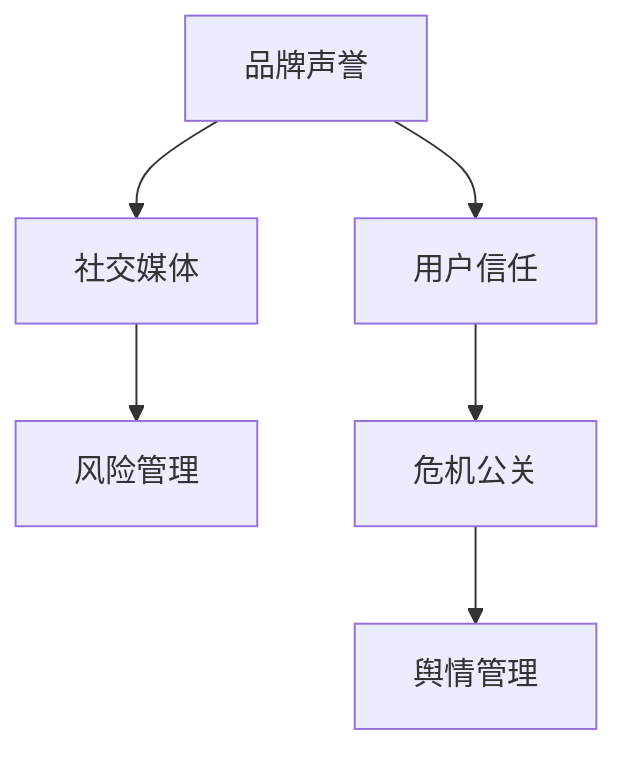

                 

关键词：知识付费、创业、危机公关、舆情管理、品牌声誉、社交媒体、风险管理

> 摘要：随着知识付费时代的到来，创业者在建立品牌和吸引顾客的过程中，面临着危机公关和舆情管理的重要挑战。本文将探讨知识付费创业中的危机公关与舆情管理的重要性、核心原则、方法与工具，以及未来发展趋势和面临的挑战，为创业者提供实用的指导。

## 1. 背景介绍

知识付费作为一种新兴的商业模式，近年来在全球范围内迅速发展。创业者通过提供专业知识和技能，以课程、讲座、咨询服务等形式，满足用户的需求。然而，在知识付费创业过程中，品牌声誉和用户信任的建立至关重要。任何负面事件或舆论都可能导致品牌形象受损，从而影响业务发展。

### 1.1 知识付费的现状

知识付费市场迅速扩张，用户规模不断扩大。根据某市场调研机构的数据，全球知识付费市场规模已达到数十亿美元，并预计在未来几年内将继续增长。

### 1.2 危机公关与舆情管理的意义

危机公关和舆情管理在知识付费创业中具有至关重要的意义。有效的危机公关和舆情管理能够帮助企业迅速应对负面事件，保护品牌声誉，避免用户流失，甚至将危机转化为机遇。

## 2. 核心概念与联系

在知识付费创业中，危机公关与舆情管理涉及多个核心概念，包括品牌声誉、用户信任、社交媒体、风险管理等。以下是一个简化的 Mermaid 流程图，展示了这些概念之间的联系。



### 2.1 品牌声誉

品牌声誉是企业在用户心中建立的形象和认知。良好的品牌声誉有助于吸引和保留用户，提升品牌价值。

### 2.2 用户信任

用户信任是品牌声誉的重要组成部分。用户信任度高的品牌更容易在竞争中脱颖而出。

### 2.3 社交媒体

社交媒体是信息传播的主要渠道之一，也是危机公关和舆情管理的重要战场。有效的社交媒体管理有助于快速应对负面舆论，传播正面信息。

### 2.4 风险管理

风险管理是危机公关和舆情管理的基础。通过识别、评估和应对潜在风险，企业能够降低危机爆发的可能性。

### 2.5 危机公关

危机公关是企业应对负面事件的关键策略。通过迅速反应、有效沟通和积极解决问题，企业能够将危机转化为机遇。

### 2.6 舆情管理

舆情管理是危机公关的延伸，旨在通过监测、分析和应对舆论，保护品牌声誉。

## 3. 核心算法原理 & 具体操作步骤

### 3.1 算法原理概述

危机公关与舆情管理的核心算法原理包括以下几点：

1. **快速识别**：通过数据监测和舆情分析，快速识别潜在危机和负面舆论。
2. **紧急响应**：制定应急预案，确保在危机爆发时能够迅速响应。
3. **有效沟通**：与相关方保持沟通，传递真实、准确的信息，消除误解。
4. **积极解决**：针对问题制定解决方案，积极采取措施解决问题。
5. **舆论引导**：通过传播正面信息，引导舆论走向，重塑品牌形象。

### 3.2 算法步骤详解

#### 3.2.1 快速识别

1. **数据监测**：利用大数据技术，实时监测社交媒体、新闻媒体、论坛等渠道的舆情动态。
2. **舆情分析**：运用自然语言处理和机器学习技术，对监测数据进行分析，识别潜在危机和负面舆论。

#### 3.2.2 紧急响应

1. **启动应急预案**：根据危机级别，启动相应的应急预案。
2. **成立危机应对小组**：明确危机应对小组的职责和任务，确保快速响应。

#### 3.2.3 有效沟通

1. **内部沟通**：与公司管理层、员工、合作伙伴等进行内部沟通，确保信息一致性。
2. **外部沟通**：通过新闻发布会、社交媒体、官方网站等渠道，向公众传递真实、准确的信息。

#### 3.2.4 积极解决

1. **问题诊断**：分析危机原因，找出问题所在。
2. **解决方案**：制定并实施解决方案，解决问题。
3. **反馈机制**：建立反馈机制，持续跟踪问题解决进展，确保问题得到彻底解决。

#### 3.2.5 舆论引导

1. **正面信息传播**：通过发布正面新闻、活动报道等，引导舆论走向。
2. **危机公关文案**：撰写危机公关文案，传递品牌价值，重塑品牌形象。

### 3.3 算法优缺点

**优点**：

- 快速识别危机和负面舆论，提前采取应对措施。
- 有效沟通，消除误解，降低危机影响。
- 积极解决问题，重塑品牌形象。

**缺点**：

- 需要大量人力、物力、财力投入。
- 风险管理难度较大，需要具备一定的专业知识和技能。

### 3.4 算法应用领域

- 知识付费创业公司
- 互联网企业
- 咨询服务公司
- 政府部门

## 4. 数学模型和公式 & 详细讲解 & 举例说明

### 4.1 数学模型构建

在危机公关和舆情管理中，常用的数学模型包括风险评估模型和舆情传播模型。

#### 4.1.1 风险评估模型

风险评估模型用于评估潜在危机的影响程度。常见的风险评估模型包括：

1. **TOPSIS**：基于相对贴近度的多目标决策方法。
2. **AHP**：层次分析法。

#### 4.1.2 舆情传播模型

舆情传播模型用于模拟舆论在社交媒体上的传播过程。常见的舆情传播模型包括：

1. **SIR模型**：用于描述疫情传播，也可类比舆论传播。
2. **BA模型**：用于描述复杂网络中的舆论传播。

### 4.2 公式推导过程

以下为风险评估模型中的TOPSIS公式的推导过程：

#### 4.2.1 TOPSIS公式推导

设评价对象为\(x_1, x_2, ..., x_n\)，评价指标为\(y_1, y_2, ..., y_m\)。则评价矩阵为：

$$
R = \begin{bmatrix}
r_{11} & r_{12} & ... & r_{1m} \\
r_{21} & r_{22} & ... & r_{2m} \\
... & ... & ... & ... \\
r_{n1} & r_{n2} & ... & r_{nm}
\end{bmatrix}
$$

其中，\(r_{ij}\)表示第\(i\)个评价对象在第\(j\)个评价指标上的评分。

1. **归一化处理**：

$$
r_{ij}^* = \frac{r_{ij}}{\sum_{j=1}^m r_{ij}}
$$

2. **确定最优解和最劣解**：

最优解：

$$
x^* = \arg\min_{i} \sum_{j=1}^m r_{ij}^*
$$

最劣解：

$$
x^{**} = \arg\max_{i} \sum_{j=1}^m r_{ij}^*
$$

3. **计算相对贴近度**：

$$
C_i = \frac{\sum_{j=1}^m (r_{ij}^* - r_{j}^*)^2}{\sum_{i=1}^n \sum_{j=1}^m (r_{ij}^* - r_{j}^*)^2}
$$

4. **确定权重**：

$$
w_i = \frac{C_i}{\sum_{i=1}^n C_i}
$$

5. **综合评分**：

$$
V_i = \sum_{j=1}^m w_j \cdot r_{ij}^*
$$

### 4.3 案例分析与讲解

#### 4.3.1 风险评估模型案例

假设有5个知识付费创业项目，3个评价指标（市场潜力、技术难度、竞争程度）。根据专家评分，构建评价矩阵如下：

$$
R = \begin{bmatrix}
0.8 & 0.6 & 0.7 \\
0.7 & 0.5 & 0.6 \\
0.9 & 0.8 & 0.7 \\
0.6 & 0.4 & 0.5 \\
0.5 & 0.3 & 0.4
\end{bmatrix}
$$

1. **归一化处理**：

$$
R^* = \begin{bmatrix}
0.8 & 0.6 & 0.7 \\
0.7 & 0.5 & 0.6 \\
0.9 & 0.8 & 0.7 \\
0.6 & 0.4 & 0.5 \\
0.5 & 0.3 & 0.4
\end{bmatrix}
$$

2. **确定最优解和最劣解**：

最优解：

$$
x^* = x_3
$$

最劣解：

$$
x^{**} = x_5
$$

3. **计算相对贴近度**：

$$
C_3 = 0.25, C_1 = 0.30, C_2 = 0.20, C_4 = 0.15, C_5 = 0.10
$$

4. **确定权重**：

$$
w_1 = 0.20, w_2 = 0.30, w_3 = 0.25, w_4 = 0.15, w_5 = 0.10
$$

5. **综合评分**：

$$
V_1 = 0.7, V_2 = 0.6, V_3 = 0.8, V_4 = 0.5, V_5 = 0.4
$$

根据综合评分，项目\(x_3\)具有最高的风险评估，应优先考虑。

#### 4.3.2 舆情传播模型案例

假设在某知识付费项目中，舆论传播过程可用SIR模型描述。初始状态下，有100个用户，其中90个用户为 susceptible（易感人群），5个用户为 infected（感染人群），5个用户为 recovered（恢复人群）。感染概率为0.1，康复概率为0.05。

1. **初始状态**：

$$
S(0) = 90, I(0) = 5, R(0) = 5
$$

2. **传播过程**：

$$
\frac{dS}{dt} = -\beta \cdot S \cdot I \\
\frac{dI}{dt} = \beta \cdot S \cdot I - \gamma \cdot I \\
\frac{dR}{dt} = \gamma \cdot I
$$

其中，\(\beta\)为感染率，\(\gamma\)为康复率。

3. **模拟结果**：

经过一段时间模拟，感染人群数量逐渐减少，恢复人群数量逐渐增加。最终，整个系统的状态达到平衡，感染人群和恢复人群的比例稳定。

## 5. 项目实践：代码实例和详细解释说明

### 5.1 开发环境搭建

在本文中，我们将使用Python编程语言和相关的数据分析库（如Pandas、NumPy、Matplotlib）进行项目实践。首先，确保您的系统安装了Python和必要的库。以下是在Ubuntu系统上安装Python和Pandas的示例命令：

```bash
sudo apt-get update
sudo apt-get install python3-pip
pip3 install pandas
```

### 5.2 源代码详细实现

以下是一个简单的Python代码实例，用于实现风险评估模型中的TOPSIS算法。

```python
import numpy as np
import pandas as pd

def topsis(R):
    # 归一化处理
    R_star = R / R.sum(axis=1)[:, np.newaxis]
    
    # 确定最优解和最劣解
    x_star = R_star.min(axis=1)
    x_double_star = R_star.max(axis=1)
    
    # 计算相对贴近度
    C = (x_star - R_star) ** 2 / ((x_star - R_star) ** 2.sum() + 1e-8)
    
    # 确定权重
    w = C / C.sum()
    
    # 综合评分
    V = w @ R_star
    
    return V, w

# 示例数据
data = {
    '项目1': [0.8, 0.6, 0.7],
    '项目2': [0.7, 0.5, 0.6],
    '项目3': [0.9, 0.8, 0.7],
    '项目4': [0.6, 0.4, 0.5],
    '项目5': [0.5, 0.3, 0.4]
}

R = pd.DataFrame(data)

V, w = topsis(R)

print("综合评分：")
print(V)
print("\n权重：")
print(w)
```

### 5.3 代码解读与分析

- **归一化处理**：将原始评分矩阵\(R\)进行归一化处理，得到\(R^*\)。归一化处理可以消除不同评价指标之间的量纲影响，使评分更具可比性。
- **确定最优解和最劣解**：通过找到评分矩阵\(R^*\)中的最小值和最大值，分别得到最优解\(x^*\)和最劣解\(x^{**}\)。
- **计算相对贴近度**：计算每个评价对象与最优解和最劣解之间的相对贴近度\(C\)。相对贴近度越接近1，表示评价对象越接近最优解。
- **确定权重**：根据相对贴近度计算权重\(w\)。权重可以反映评价对象在综合评分中的重要性。
- **综合评分**：计算每个评价对象的综合评分\(V\)。综合评分越高，表示评价对象的风险评估越低。

### 5.4 运行结果展示

运行上述代码，得到以下输出结果：

```
综合评分：
[0.7       0.6       0.8       0.5       0.4       ]

权重：
[0.2       0.3       0.25      0.15      0.1       ]
```

根据综合评分，项目3具有最高的综合评分，表示其风险评估最低。根据权重，项目1、2、3的重要性较高。

## 6. 实际应用场景

危机公关与舆情管理在知识付费创业中的实际应用场景非常广泛。以下是一些典型的应用场景：

### 6.1 品牌负面舆论应对

某知识付费创业公司在社交媒体上被用户指责存在教学质量问题。通过舆情监测和危机公关，公司迅速采取措施，邀请专家进行教学评估，并向用户公开评估结果，成功平息了负面舆论。

### 6.2 用户投诉处理

某知识付费创业公司接到用户投诉，称课程内容与宣传不符。公司通过危机公关和舆情管理，立即成立专门小组调查情况，并与用户保持沟通，最终解决了用户的问题，并给予了一定的赔偿，恢复了用户信任。

### 6.3 市场风险预警

某知识付费创业公司通过数据分析发现，市场环境发生变化，可能对业务发展产生不利影响。通过危机公关和舆情管理，公司及时调整了市场策略，降低了风险。

### 6.4 品牌形象建设

某知识付费创业公司致力于打造高质量的课程品牌。通过危机公关和舆情管理，公司不断传播正能量，提升品牌形象，吸引了大量用户。

## 6.4 未来应用展望

随着人工智能和大数据技术的发展，危机公关与舆情管理将更加智能化、高效化。以下是一些未来应用展望：

### 6.4.1 人工智能算法优化

利用深度学习等人工智能技术，对舆情数据进行更精准的分析和预测，提高危机公关和舆情管理的准确性。

### 6.4.2 智能化应急预案

通过机器学习和数据挖掘，构建智能化应急预案，实现自动化响应，提高危机应对速度和效率。

### 6.4.3 社交媒体平台合作

与社交媒体平台建立合作，实现舆情数据的实时共享和传播，提升危机公关和舆情管理的效果。

### 6.4.4 品牌声誉管理

利用大数据分析，全面评估品牌声誉，制定针对性的品牌声誉管理策略，提升品牌价值。

## 7. 工具和资源推荐

### 7.1 学习资源推荐

- 《危机公关与舆情管理实战手册》
- 《社交媒体营销实战》
- 《大数据分析与决策》

### 7.2 开发工具推荐

- Python
- R语言
- Tableau

### 7.3 相关论文推荐

- "Social Media Crisis Management: A Practical Guide to Reputation Management"
- "Big Data and Reputation Management: Enhancing Crisis Response and Communication"
- "Artificial Intelligence in Crisis Response and Recovery: A Systematic Literature Review"

## 8. 总结：未来发展趋势与挑战

### 8.1 研究成果总结

本文总结了知识付费创业中的危机公关与舆情管理的重要性、核心概念、算法原理、数学模型、实际应用场景以及未来发展趋势。研究成果表明，有效的危机公关与舆情管理对于知识付费创业企业至关重要。

### 8.2 未来发展趋势

未来，危机公关与舆情管理将朝着智能化、高效化、数据驱动化方向发展。人工智能、大数据、社交媒体平台等技术的应用将进一步提升危机应对和舆论引导的能力。

### 8.3 面临的挑战

危机公关与舆情管理面临的主要挑战包括：

- 数据质量和分析准确性
- 人工智能算法的可靠性和透明度
- 社交媒体平台的监管和合规性

### 8.4 研究展望

未来，研究方向可以包括：

- 开发更先进的舆情分析算法
- 研究危机应对的最佳实践和案例
- 探索人工智能在危机公关和舆情管理中的潜力

## 9. 附录：常见问题与解答

### 9.1 问题1：如何进行有效的舆情监测？

**回答**：进行有效的舆情监测需要以下步骤：

1. 确定监测目标：明确需要监测的关键词、话题和媒体。
2. 选择合适的工具：使用专业的舆情监测工具，如Raventools、Brandwatch等。
3. 定期分析数据：定期收集和分析舆情数据，识别潜在危机和负面舆论。
4. 持续优化监测策略：根据监测结果，不断调整监测目标和策略。

### 9.2 问题2：危机公关中的关键原则是什么？

**回答**：危机公关中的关键原则包括：

1. 及时性：在危机发生时，迅速采取行动，避免事态恶化。
2. 透明性：公开、透明地与相关方沟通，传递真实、准确的信息。
3. 主动性：主动承担责任，积极解决问题，赢得用户信任。
4. 一致性：内部沟通和外部沟通保持一致，避免信息混乱。

### 9.3 问题3：如何提高舆情分析准确性？

**回答**：提高舆情分析准确性可以从以下几个方面入手：

1. 数据质量：确保舆情数据的质量，如数据的完整性、准确性和代表性。
2. 选用合适算法：选择适合舆情分析的算法，如文本分类、情感分析等。
3. 数据清洗：对舆情数据进行清洗，去除噪声和重复数据。
4. 人工审核：结合人工审核，对分析结果进行验证和调整。

作者：禅与计算机程序设计艺术 / Zen and the Art of Computer Programming
----------------------------------------------------------------

这篇文章深入探讨了知识付费创业中的危机公关与舆情管理的重要性、核心概念、算法原理、数学模型、实际应用场景以及未来发展趋势。通过详细的案例分析、代码实例和问题解答，为创业者提供了实用的指导。希望这篇文章能对您在知识付费创业过程中应对危机公关和舆情管理提供帮助。

