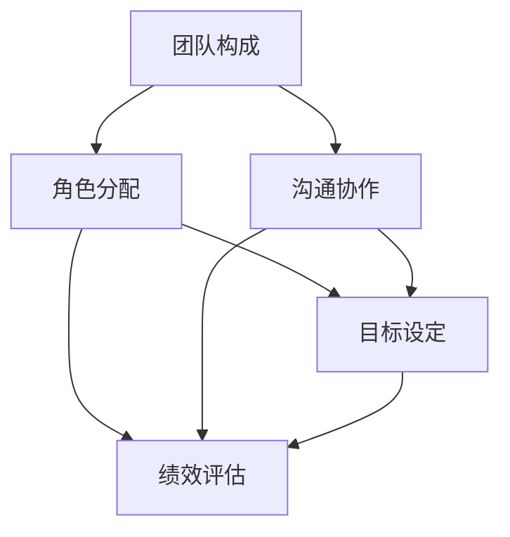

                 

 

## 1. 背景介绍

知识付费，顾名思义，是指用户为获取高质量的知识、技能或信息而付费的一种商业模式。近年来，随着互联网和移动互联网的快速发展，知识付费行业呈现出爆发式增长。从早期的在线课程、电子书，到现在的直播、问答、内容付费会员等多种形式，知识付费已经成为知识经济时代的重要特征。

然而，知识付费创业的成功并非易事。团队管理是知识付费创业过程中至关重要的一环。一个好的团队可以确保项目的顺利进行，提升用户体验，增加用户黏性，从而在激烈的市场竞争中脱颖而出。本文将围绕知识付费创业中的团队管理展开讨论，旨在为创业者提供一些实用的建议和策略。

## 2. 核心概念与联系

在知识付费创业中，团队管理涉及多个核心概念，包括但不限于团队构成、角色分配、沟通协作、目标设定、绩效评估等。这些概念相互关联，共同构成了团队管理的完整体系。以下是这些核心概念的 Mermaid 流程图：



### 团队构成

团队构成是团队管理的第一步。一个高效的团队通常由不同专业背景、技能和经验的人组成，以实现多样化的思维和技能互补。团队成员可以分为以下几类：

1. **创始人/CEO**：负责整体战略规划和决策。
2. **产品经理**：负责产品规划和用户需求分析。
3. **技术团队**：包括前端、后端、运维等，负责技术实现。
4. **内容团队**：包括课程讲师、内容编辑等，负责内容创作。
5. **市场团队**：负责市场推广、品牌建设等。

### 角色分配

角色分配是基于团队构成而进行的。每个角色都有其特定的职责和权限。合理的角色分配可以确保团队成员各司其职，提高工作效率。例如，技术团队可以进一步细分为前端开发、后端开发、测试等小组。

### 沟通协作

沟通协作是团队管理中的关键环节。有效的沟通可以确保信息的准确传递，减少误解和冲突。团队可以采用多种沟通工具，如邮件、即时通讯软件、项目管理工具等。同时，定期召开团队会议也是保持沟通的重要手段。

### 目标设定

目标设定是团队管理的重要环节。明确的目标可以指导团队成员的行动方向，提高团队的执行力。目标的设定应遵循SMART原则，即具体（Specific）、可衡量（Measurable）、可实现（Achievable）、相关（Relevant）和有时限（Time-bound）。

### 绩效评估

绩效评估是对团队成员工作成果的评估。通过绩效评估，可以了解团队成员的工作表现，发现问题和不足，激励团队成员不断进步。绩效评估可以采用定量和定性相结合的方法，如KPI（关键绩效指标）、360度评估等。

## 3. 核心算法原理 & 具体操作步骤

### 3.1 算法原理概述

团队管理算法是一种基于数据驱动的管理方法，通过分析团队数据，如工作时长、任务完成情况、团队协作质量等，为团队管理提供科学依据。算法原理主要包括以下几个方面：

1. **数据收集**：通过多种渠道收集团队数据，如时间跟踪工具、项目管理系统、用户反馈等。
2. **数据分析**：对收集到的数据进行分析，识别团队运行中的问题和瓶颈。
3. **决策支持**：基于数据分析结果，为团队管理提供决策支持，如角色调整、任务分配、沟通优化等。
4. **持续迭代**：根据决策支持结果，对团队管理进行持续优化。

### 3.2 算法步骤详解

1. **数据收集**：使用时间跟踪工具记录团队成员的工作时长，使用项目管理系统记录任务完成情况和团队协作质量。此外，还可以通过用户反馈获取团队在用户服务方面的表现。

2. **数据分析**：使用数据分析工具，如Excel、Python等，对收集到的数据进行分析，识别出团队运行中的问题和瓶颈。例如，通过分析工作时长数据，可以发现团队成员的工作效率问题；通过分析任务完成情况数据，可以发现任务分配和执行中的问题。

3. **决策支持**：基于数据分析结果，为团队管理提供决策支持。例如，如果发现某个团队成员的工作效率较低，可以考虑对其进行培训和调整角色；如果发现某个任务的执行存在瓶颈，可以考虑优化任务流程或增加人力资源。

4. **持续迭代**：根据决策支持结果，对团队管理进行持续优化。例如，如果发现团队在沟通协作方面存在问题，可以引入沟通工具或调整沟通频率；如果发现团队在目标设定方面存在问题，可以重新设定目标或调整目标设定方法。

### 3.3 算法优缺点

**优点**：

1. **数据驱动**：团队管理算法基于数据驱动，能够更准确地识别团队运行中的问题和瓶颈。
2. **科学决策**：算法提供决策支持，使团队管理更加科学和高效。
3. **持续优化**：算法支持持续迭代，使团队管理能够不断优化和进步。

**缺点**：

1. **数据依赖**：算法对数据质量有较高要求，数据不准确或缺失可能导致算法失效。
2. **实施成本**：算法的实施需要投入一定的资源和人力，对初创企业来说可能是一个挑战。

### 3.4 算法应用领域

团队管理算法可以应用于多种场景，如初创企业、大型企业的项目团队管理、教育机构的课程团队管理等。在知识付费创业中，团队管理算法可以帮助创业者更有效地管理团队，提高项目成功率。

## 4. 数学模型和公式 & 详细讲解 & 举例说明

### 4.1 数学模型构建

在团队管理中，我们可以构建一个简单的数学模型来评估团队绩效。假设团队绩效与以下因素相关：

1. **工作效率**：衡量团队成员完成任务的速度和质量。
2. **团队协作**：衡量团队成员之间的协作质量和效率。
3. **用户满意度**：衡量用户对团队的满意度。

我们可以使用以下公式构建数学模型：

\[ P = w_1 \cdot E + w_2 \cdot C + w_3 \cdot S \]

其中，\( P \) 表示团队绩效，\( w_1, w_2, w_3 \) 分别表示工作效率、团队协作和用户满意度的权重。

### 4.2 公式推导过程

1. **工作效率**：工作效率可以通过任务完成时间和任务难度来衡量。假设任务完成时间为 \( T \)，任务难度为 \( D \)，则工作效率 \( E \) 可以表示为：

\[ E = \frac{1}{T \cdot D} \]

2. **团队协作**：团队协作可以通过团队成员之间的沟通频率和沟通质量来衡量。假设沟通频率为 \( F \)，沟通质量为 \( Q \)，则团队协作 \( C \) 可以表示为：

\[ C = F \cdot Q \]

3. **用户满意度**：用户满意度可以通过用户评价和用户反馈来衡量。假设用户评价得分为 \( U \)，用户反馈得分为 \( V \)，则用户满意度 \( S \) 可以表示为：

\[ S = \frac{U + V}{2} \]

### 4.3 案例分析与讲解

假设一个团队的工作效率 \( E \) 为 0.8，团队协作 \( C \) 为 0.9，用户满意度 \( S \) 为 0.85。假设权重 \( w_1, w_2, w_3 \) 分别为 0.3, 0.4, 0.3。根据上述公式，我们可以计算出该团队的绩效 \( P \)：

\[ P = 0.3 \cdot 0.8 + 0.4 \cdot 0.9 + 0.3 \cdot 0.85 = 0.376 \]

这个绩效值表明，该团队的整体表现较为优秀。我们可以通过分析各个因素的权重和得分，找出团队需要改进的方面。例如，如果工作效率得分较低，可以考虑优化任务流程或提高团队成员的工作效率。

## 5. 项目实践：代码实例和详细解释说明

### 5.1 开发环境搭建

在知识付费创业中，团队管理系统的搭建是关键的一步。以下是搭建一个简单的团队管理系统所需的开发环境：

1. **开发工具**：选择 Python 作为开发语言，使用 PyCharm 或 VSCode 作为代码编辑器。
2. **数据库**：选择 MySQL 或 PostgreSQL 作为数据库。
3. **Web 框架**：选择 Flask 或 Django 作为 Web 开发框架。
4. **前端框架**：选择 React 或 Vue.js 作为前端开发框架。

### 5.2 源代码详细实现

以下是一个简单的团队管理系统源代码示例：

```python
# team_management_system.py

from flask import Flask, request, jsonify
from flask_sqlalchemy import SQLAlchemy

app = Flask(__name__)
app.config['SQLALCHEMY_DATABASE_URI'] = 'sqlite:///team.db'
db = SQLAlchemy(app)

class TeamMember(db.Model):
    id = db.Column(db.Integer, primary_key=True)
    name = db.Column(db.String(50), nullable=False)
    role = db.Column(db.String(50), nullable=False)
    efficiency = db.Column(db.Float, nullable=False)
    collaboration = db.Column(db.Float, nullable=False)
    user_satisfaction = db.Column(db.Float, nullable=False)

@app.route('/add_member', methods=['POST'])
def add_member():
    data = request.get_json()
    member = TeamMember(name=data['name'], role=data['role'], efficiency=data['efficiency'], collaboration=data['collaboration'], user_satisfaction=data['user_satisfaction'])
    db.session.add(member)
    db.session.commit()
    return jsonify({'status': 'success', 'message': 'Member added successfully'})

@app.route('/get_members', methods=['GET'])
def get_members():
    members = TeamMember.query.all()
    return jsonify({'status': 'success', 'members': [{'id': member.id, 'name': member.name, 'role': member.role, 'efficiency': member.efficiency, 'collaboration': member.collaboration, 'user_satisfaction': member.user_satisfaction} for member in members]})

if __name__ == '__main__':
    db.create_all()
    app.run(debug=True)
```

### 5.3 代码解读与分析

1. **数据库模型**：我们定义了一个名为 `TeamMember` 的数据库模型，包含成员姓名、角色、工作效率、团队协作和用户满意度等字段。
2. **路由定义**：我们定义了两个路由，`/add_member` 和 `/get_members`。`/add_member` 路由用于添加成员信息，`/get_members` 路由用于获取所有成员信息。
3. **添加成员**：在 `/add_member` 路由中，我们接收一个 JSON 格式的请求，包含成员的姓名、角色、工作效率、团队协作和用户满意度。我们将这些信息存储到数据库中。
4. **获取成员信息**：在 `/get_members` 路由中，我们从数据库中查询所有成员信息，并以 JSON 格式返回。

### 5.4 运行结果展示

运行上述代码后，我们可以使用 Postman 或其他 HTTP 客户端测试 API 接口。

1. **添加成员**：

```json
POST /add_member
Content-Type: application/json

{
  "name": "Alice",
  "role": "Product Manager",
  "efficiency": 0.8,
  "collaboration": 0.9,
  "user_satisfaction": 0.85
}
```

响应：

```json
{
  "status": "success",
  "message": "Member added successfully"
}
```

2. **获取成员信息**：

```bash
GET /get_members
```

响应：

```json
{
  "status": "success",
  "members": [
    {
      "id": 1,
      "name": "Alice",
      "role": "Product Manager",
      "efficiency": 0.8,
      "collaboration": 0.9,
      "user_satisfaction": 0.85
    }
  ]
}
```

## 6. 实际应用场景

团队管理在知识付费创业中的应用场景非常广泛。以下是一些典型的应用场景：

1. **初创企业**：初创企业通常资源有限，团队管理显得尤为重要。通过有效的团队管理，初创企业可以确保项目的顺利进行，降低风险。
2. **大型企业项目团队**：在大型企业的项目中，团队管理可以帮助企业更好地协调各部门的工作，提高项目效率和质量。
3. **教育机构课程团队**：教育机构可以通过团队管理优化课程设计和教学过程，提高教学效果和用户满意度。

### 6.1 未来应用展望

随着人工智能和大数据技术的发展，团队管理算法将变得更加智能化和自动化。未来的团队管理将更加注重数据驱动的决策和智能化的协作模式。以下是一些未来的发展趋势：

1. **人工智能驱动的团队管理**：利用人工智能技术，对团队数据进行分析，提供个性化的管理建议和策略。
2. **自动化协作工具**：开发自动化协作工具，如智能助手、自动化任务分配系统等，提高团队协作效率。
3. **个性化学习与培训**：通过分析团队成员的学习行为和绩效数据，提供个性化的学习与培训方案，提高团队整体素质。

## 7. 工具和资源推荐

### 7.1 学习资源推荐

1. **《团队协作的艺术》**：这是一本关于团队协作和团队管理的经典书籍，适合想要深入了解团队管理的读者。
2. **《敏捷开发实践指南》**：这本书介绍了敏捷开发的方法和原则，对于团队管理和项目协调非常有帮助。

### 7.2 开发工具推荐

1. **Trello**：一款简单易用的项目管理工具，可以帮助团队管理项目进度和任务分配。
2. **Slack**：一款流行的即时通讯工具，可以用于团队沟通和协作。

### 7.3 相关论文推荐

1. **“A Survey on Team Management and Collaboration in the Age of Artificial Intelligence”**：这篇论文探讨了人工智能在团队管理和协作中的应用。
2. **“Data-Driven Team Management: A Research on the Application of Data Analytics in Team Management”**：这篇论文研究了数据驱动在团队管理中的应用，提供了许多实用的方法和案例。

## 8. 总结：未来发展趋势与挑战

### 8.1 研究成果总结

本文围绕知识付费创业中的团队管理进行了深入探讨，总结了团队管理的核心概念、算法原理和应用场景。通过数学模型和代码实例，我们展示了如何利用数据驱动的方法进行团队管理。

### 8.2 未来发展趋势

未来的团队管理将更加智能化和自动化，借助人工智能和大数据技术，团队管理将更加精准和高效。同时，个性化学习与培训将成为团队管理的重要趋势。

### 8.3 面临的挑战

数据驱动的团队管理面临着数据质量、算法有效性等挑战。此外，如何平衡团队管理与个性化需求也是一个重要课题。

### 8.4 研究展望

未来的研究可以进一步探讨人工智能在团队管理中的应用，如开发智能助手、自动化任务分配系统等。同时，研究如何利用数据驱动的方法优化团队协作和提升团队绩效也是重要的研究方向。

## 9. 附录：常见问题与解答

### 9.1 问题一：团队管理算法对数据质量有较高要求，如何保证数据质量？

**解答**：为了保证数据质量，可以从以下几个方面进行：

1. **数据采集**：使用可靠的工具和方法进行数据采集，确保数据的准确性和完整性。
2. **数据清洗**：对采集到的数据进行清洗，去除错误、重复和无关的数据。
3. **数据监控**：建立数据监控系统，实时监控数据质量，及时发现和处理问题。

### 9.2 问题二：如何确保团队管理算法的有效性？

**解答**：

1. **算法验证**：通过实际应用场景验证算法的有效性，确保算法能够解决实际问题。
2. **持续优化**：根据实际应用情况，对算法进行持续优化和调整，提高算法的准确性和实用性。
3. **用户反馈**：收集用户反馈，了解算法在实际应用中的表现，并根据反馈进行调整。

## 作者署名

作者：禅与计算机程序设计艺术 / Zen and the Art of Computer Programming

----------------------------------------------------------------

以上就是本文的完整内容，希望对您在知识付费创业中的团队管理有所帮助。在未来的知识经济时代，团队管理将变得越来越重要，希望本文能为您指明方向。再次感谢您的阅读！
----------------------------------------------------------------

本文以《知识付费创业中的团队管理》为题，详细探讨了团队管理的核心概念、算法原理、数学模型、项目实践以及实际应用场景。通过数据驱动的团队管理方法，文章展示了如何利用人工智能和大数据技术优化团队管理和提升团队绩效。在未来的知识经济时代，团队管理的重要性将愈发突出，希望本文能为创业者提供有价值的参考和启示。再次感谢您的阅读！作者：禅与计算机程序设计艺术 / Zen and the Art of Computer Programming。

