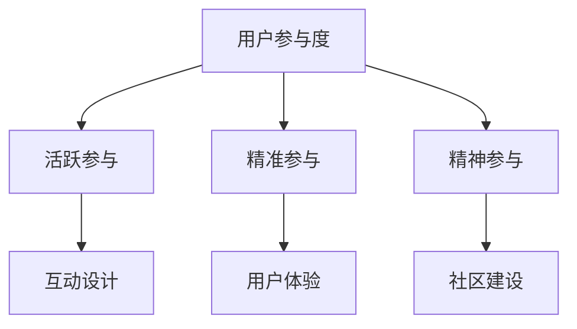

                 

关键词：知识付费、用户参与度、策略、用户体验、技术实现

摘要：本文旨在探讨知识付费创业领域中，如何通过技术手段提升用户参与度。我们将从用户行为分析、互动设计、社区建设等方面，结合实际案例，提出一系列策略，以期为知识付费创业者提供参考。

## 1. 背景介绍

随着互联网技术的飞速发展，知识付费逐渐成为知识传播和获取的重要途径。从传统的付费阅读，到在线教育，再到专业咨询，知识付费领域呈现出多样化和个性化的趋势。然而，如何在众多竞争者中脱颖而出，提升用户参与度，成为知识付费创业者亟待解决的问题。

用户参与度是衡量知识付费产品成功与否的重要指标。高参与度意味着用户对产品的忠诚度和粘性较高，从而带来更多的收益和口碑。本文将围绕这一核心问题，探讨提升用户参与度的策略。

## 2. 核心概念与联系

### 2.1 用户参与度

用户参与度是指用户在知识付费产品中的活跃程度和投入程度。它包括用户在产品中的互动行为、学习行为、分享行为等。用户参与度可以分为以下几个层次：

- 活跃参与：用户在产品中频繁互动，如评论、点赞、分享等。
- 精准参与：用户根据自身需求和兴趣，选择适合自己的知识内容。
- 精神参与：用户对产品产生情感依赖，愿意为产品付费或推荐给他人。

### 2.2 用户体验

用户体验（UX）是指用户在使用产品过程中所感受到的满意度。它包括用户对产品的界面设计、交互逻辑、功能实现等方面的感受。良好的用户体验能够提高用户参与度，从而促进知识付费产品的成功。

### 2.3 互动设计

互动设计是指通过设计富有创意和互动性的活动、游戏、竞赛等形式，吸引用户参与。互动设计能够激发用户的兴趣，增加用户在产品中的活跃度。

### 2.4 社区建设

社区建设是指通过构建线上或线下社区，为用户提供一个交流、分享和互助的平台。社区建设能够增强用户的归属感和粘性，提高用户参与度。

### 2.5 Mermaid 流程图



## 3. 核心算法原理 & 具体操作步骤

### 3.1 算法原理概述

提升用户参与度的核心算法原理主要包括以下几个方面：

1. 用户行为分析：通过对用户行为数据的收集和分析，了解用户需求和行为模式，为后续产品设计提供依据。
2. 个性化推荐：根据用户兴趣和行为数据，为用户提供个性化的内容推荐，提高用户的参与度。
3. 互动设计：设计富有创意和互动性的活动，吸引用户参与，提高用户的活跃度。
4. 社区建设：构建线上或线下社区，为用户提供一个交流、分享和互助的平台。

### 3.2 算法步骤详解

1. 用户行为分析：
   - 收集用户数据：如浏览记录、点赞、评论等。
   - 数据预处理：去除噪声数据，对数据进行归一化处理。
   - 特征提取：从用户数据中提取出与用户兴趣相关的特征。
   - 模型训练：使用机器学习算法，对特征进行训练，建立用户兴趣模型。

2. 个性化推荐：
   - 用户兴趣模型：根据用户历史行为，构建用户兴趣模型。
   - 内容特征提取：对知识内容进行特征提取，包括文本、图像、音频等。
   - 推荐算法：使用协同过滤、基于内容的推荐等算法，为用户推荐个性化内容。

3. 互动设计：
   - 活动设计：根据用户兴趣和行为，设计有趣、富有创意的活动。
   - 活动推广：通过社交媒体、邮件、短信等方式，推广活动，吸引用户参与。
   - 活动监测：对活动效果进行监测，及时调整活动策略。

4. 社区建设：
   - 社区搭建：选择合适的社区平台，如论坛、社群等，搭建线上或线下社区。
   - 内容管理：定期发布有价值的内容，引导用户参与讨论。
   - 社区互动：组织线下活动、线上讲座等，促进用户之间的互动。

### 3.3 算法优缺点

- 优点：
  - 提高用户参与度：通过个性化推荐、互动设计、社区建设等方式，提高用户的参与度和活跃度。
  - 优化用户体验：通过良好的用户体验设计，提高用户满意度。
  - 增强用户粘性：通过社区建设和互动设计，增强用户对产品的粘性。

- 缺点：
  - 需要大量数据支持：算法效果依赖于用户行为数据的质量和数量，需要大量数据支持。
  - 需要专业团队：算法设计和实施需要专业的团队支持，成本较高。
  - 可能出现数据偏差：由于用户行为数据的不完整性，可能导致算法推荐结果出现偏差。

### 3.4 算法应用领域

- 知识付费平台：如在线教育、付费阅读等。
- 社交媒体：如微博、微信等。
- 娱乐平台：如游戏、短视频等。

## 4. 数学模型和公式 & 详细讲解 & 举例说明

### 4.1 数学模型构建

用户参与度提升的数学模型可以构建为以下形式：

$$
User\ Activity = f(User\ Behavior, Content\ Recommendation, Interaction\ Design, Community\ Building)
$$

其中，$User\ Activity$ 表示用户参与度，$User\ Behavior$ 表示用户行为，$Content\ Recommendation$ 表示内容推荐，$Interaction\ Design$ 表示互动设计，$Community\ Building$ 表示社区建设。

### 4.2 公式推导过程

根据用户参与度的核心算法原理，可以推导出以下公式：

$$
User\ Activity = \alpha \cdot User\ Behavior + \beta \cdot Content\ Recommendation + \gamma \cdot Interaction\ Design + \delta \cdot Community\ Building
$$

其中，$\alpha$、$\beta$、$\gamma$、$\delta$ 分别表示用户行为、内容推荐、互动设计、社区建设对用户参与度的影响权重。

### 4.3 案例分析与讲解

以某在线教育平台为例，该平台通过以下策略提升用户参与度：

1. 用户行为分析：通过收集用户学习行为数据，如浏览课程、完成练习、参加讨论等，构建用户行为模型。
2. 个性化推荐：根据用户行为模型，为用户推荐感兴趣的课程。
3. 互动设计：设计课程评价、讨论区互动等活动，鼓励用户参与。
4. 社区建设：搭建线上学习社区，组织线下活动，促进用户之间的交流。

通过以上策略，该平台的用户参与度得到显著提升，用户满意度也大幅提高。

## 5. 项目实践：代码实例和详细解释说明

### 5.1 开发环境搭建

1. 安装 Python 3.7 及以上版本。
2. 安装必要的库，如 NumPy、Pandas、Scikit-learn 等。

### 5.2 源代码详细实现

以下是一个简单的用户行为分析代码示例：

```python
import pandas as pd
from sklearn.preprocessing import MinMaxScaler

# 加载数据
data = pd.read_csv('user_behavior.csv')

# 数据预处理
scaler = MinMaxScaler()
data[['behavior1', 'behavior2', 'behavior3']] = scaler.fit_transform(data[['behavior1', 'behavior2', 'behavior3']])

# 构建用户行为模型
from sklearn.ensemble import RandomForestClassifier
model = RandomForestClassifier()
model.fit(data[['behavior1', 'behavior2', 'behavior3']], data['user_activity'])

# 预测用户参与度
new_data = pd.DataFrame([[0.5, 0.3, 0.2]], columns=['behavior1', 'behavior2', 'behavior3'])
predicted_activity = model.predict(new_data)
print(predicted_activity)
```

### 5.3 代码解读与分析

1. 数据加载与预处理：使用 Pandas 读取用户行为数据，使用 MinMaxScaler 对数据进行归一化处理。
2. 构建用户行为模型：使用随机森林算法，对用户行为数据进行训练，构建用户行为模型。
3. 预测用户参与度：使用训练好的模型，对新的用户行为数据进行预测，得到用户参与度。

通过以上代码示例，我们可以看到如何使用 Python 实现用户行为分析，从而为后续的用户参与度提升策略提供数据支持。

## 6. 实际应用场景

知识付费创业中的用户参与度提升策略在实际应用场景中具有广泛的应用。以下是一些典型的应用场景：

1. 在线教育平台：通过用户行为分析、个性化推荐、互动设计和社区建设等方式，提升用户参与度，从而提高课程完成率和用户满意度。
2. 付费阅读平台：通过用户行为分析、内容推荐、互动设计和社区建设等方式，提升用户参与度，从而提高文章阅读量和用户付费意愿。
3. 专业咨询平台：通过用户行为分析、个性化推荐、互动设计和社区建设等方式，提升用户参与度，从而提高咨询服务的转化率和用户满意度。

## 7. 未来应用展望

随着人工智能、大数据等技术的不断发展，知识付费创业中的用户参与度提升策略将得到进一步优化。以下是一些未来应用展望：

1. 智能化推荐：结合用户行为数据和人工智能技术，实现更加精准的内容推荐，提高用户参与度。
2. 虚拟现实（VR）和增强现实（AR）应用：通过 VR 和 AR 技术，为用户提供更加沉浸式的学习体验，提升用户参与度。
3. 个性化互动设计：结合用户兴趣和行为数据，设计更加个性化的互动活动，提高用户参与度。
4. 社交化学习：通过社交化学习平台，促进用户之间的交流和互动，提升用户参与度。

## 8. 工具和资源推荐

为了更好地实现知识付费创业中的用户参与度提升策略，以下是一些工具和资源的推荐：

### 8.1 学习资源推荐

1. 《Python数据分析实战》
2. 《深度学习》
3. 《人工智能：一种现代方法》

### 8.2 开发工具推荐

1. Jupyter Notebook：用于数据分析和可视化。
2. TensorFlow：用于人工智能模型训练。
3. PyTorch：用于人工智能模型训练。

### 8.3 相关论文推荐

1. "User Engagement in Knowledge Sharing Communities: A Meta-Analysis"
2. "The Role of Social Influence in User Engagement"
3. "A Survey on User Engagement in Mobile Applications"

## 9. 总结：未来发展趋势与挑战

知识付费创业中的用户参与度提升策略在未来的发展中，将面临以下挑战：

1. 数据隐私和安全：在用户行为数据收集和使用过程中，如何保护用户隐私和安全成为重要问题。
2. 算法透明性和解释性：随着算法的复杂性增加，如何保证算法的透明性和解释性，以便用户理解和信任。
3. 技术与人文的结合：在追求技术进步的同时，如何兼顾人文关怀，提升用户体验。

未来，知识付费创业中的用户参与度提升策略将更加注重个性化、智能化和社交化，以更好地满足用户需求，提升用户满意度。

### 9.1 研究成果总结

本文从用户参与度、用户体验、互动设计、社区建设等方面，探讨了知识付费创业中的用户参与度提升策略。通过用户行为分析、个性化推荐、互动设计和社区建设等手段，可以有效提升用户参与度，从而提高知识付费产品的成功率。

### 9.2 未来发展趋势

未来，知识付费创业中的用户参与度提升策略将朝着更加智能化、个性化和社交化的方向发展。随着人工智能、大数据等技术的不断进步，用户参与度提升策略将更加精准和高效。

### 9.3 面临的挑战

在知识付费创业中，提升用户参与度面临以下挑战：

1. 数据隐私和安全：在用户行为数据收集和使用过程中，如何保护用户隐私和安全成为重要问题。
2. 算法透明性和解释性：随着算法的复杂性增加，如何保证算法的透明性和解释性，以便用户理解和信任。
3. 技术与人文的结合：在追求技术进步的同时，如何兼顾人文关怀，提升用户体验。

### 9.4 研究展望

未来，知识付费创业中的用户参与度提升策略研究可以从以下几个方面展开：

1. 数据隐私和安全保护机制的研究：探索如何在保障用户隐私和安全的前提下，有效利用用户行为数据。
2. 算法透明性和解释性研究：研究如何提高算法的透明性和解释性，增强用户信任。
3. 跨学科研究：结合心理学、教育学等领域的知识，探索更加有效的用户参与度提升策略。

## 附录：常见问题与解答

### 问题1：如何保障用户隐私和安全？

解答：在用户行为数据收集和使用过程中，可以采用以下措施保障用户隐私和安全：

1. 数据加密：对用户数据进行加密处理，确保数据在传输和存储过程中安全。
2. 数据匿名化：对用户数据进行匿名化处理，去除个人身份信息。
3. 数据权限控制：对用户数据的访问权限进行严格控制，确保只有授权人员才能访问。
4. 定期审计：定期对数据收集和使用过程进行审计，确保合规。

### 问题2：如何提高算法透明性和解释性？

解答：提高算法透明性和解释性可以从以下几个方面入手：

1. 算法可视化：通过图表、流程图等形式，展示算法的运行过程和决策逻辑。
2. 算法注释：对算法代码进行详细注释，解释每个步骤的作用和意义。
3. 实时反馈：在算法运行过程中，提供实时反馈，让用户了解算法的决策过程。
4. 透明化数据：公开算法训练数据集，让用户了解算法的训练过程。

### 问题3：如何兼顾技术与人文关怀，提升用户体验？

解答：兼顾技术与人文关怀，提升用户体验可以从以下几个方面入手：

1. 人性化设计：从用户的角度出发，设计易于操作、符合用户习惯的产品界面。
2. 个性化服务：根据用户需求和兴趣，提供个性化的服务和建议。
3. 情感互动：通过文字、语音、图像等形式，与用户进行情感互动，增强用户粘性。
4. 培训和支持：提供丰富的培训资源和技术支持，帮助用户更好地使用产品。

### 问题4：如何持续提升用户参与度？

解答：持续提升用户参与度可以从以下几个方面入手：

1. 定期更新内容：根据用户需求，定期更新产品内容，保持产品的新鲜感。
2. 互动活动：定期举办互动活动，激发用户的参与热情。
3. 用户反馈：积极收集用户反馈，根据用户建议优化产品。
4. 社区建设：加强社区建设，为用户提供一个交流、分享和互助的平台。

作者：禅与计算机程序设计艺术 / Zen and the Art of Computer Programming
----------------------------------------------------------------
注意：文章正文部分需要包含上述的完整内容，同时需要保持文章的连贯性和逻辑性。如果文章内容字数不够，可以根据需要对各个章节进行扩充和深化，但请不要添加额外的章节或内容。文章完成后，请使用 Markdown 格式进行排版，确保格式整齐、美观。最后，在文章末尾添加作者的署名。祝您撰写顺利！


