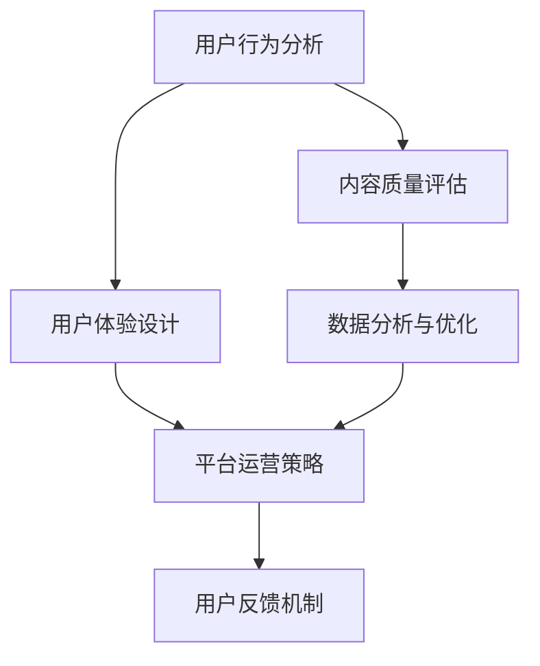

                 

### 1. 背景介绍

在当今数字化时代，知识付费已经成为一个蓬勃发展的行业。各类知识付费平台如雨后春笋般涌现，从在线教育、专业培训到技能认证，覆盖了广泛的主题和领域。然而，随着市场逐渐饱和，竞争也日趋激烈。为了在激烈的市场竞争中脱颖而出，知识付费创业公司必须关注如何提升用户的参与度，从而实现业务的持续增长。

用户参与度是衡量知识付费平台成功与否的关键指标。它不仅关系到用户对平台的满意度和忠诚度，还直接影响到平台的内容消费和付费转化率。因此，如何有效提升用户参与度，已经成为知识付费创业公司亟需解决的核心问题。

本文旨在探讨知识付费创业中用户参与度提升的策略，通过深入分析用户行为、平台运营和用户体验等方面的因素，提供一系列具有实践意义的方法和工具。本文将从以下几个方面展开：

- **核心概念与联系**：介绍与用户参与度相关的核心概念，并使用Mermaid流程图展示其内在联系。
- **核心算法原理 & 具体操作步骤**：探讨提升用户参与度的核心算法，详细解释其原理和操作步骤。
- **数学模型和公式**：构建数学模型，并使用公式推导过程和案例进行分析。
- **项目实践：代码实例**：通过具体项目实践，展示代码实现和详细解释。
- **实际应用场景**：分析用户参与度提升策略在不同场景下的应用。
- **未来应用展望**：探讨用户参与度提升策略的未来发展趋势和应用前景。

### 2. 核心概念与联系

在提升用户参与度的过程中，我们首先需要理解几个核心概念，这些概念包括用户行为分析、用户体验设计、平台运营策略等。下面将使用Mermaid流程图展示这些概念之间的内在联系。



- **用户行为分析（User Behavior Analysis）**：这是了解用户需求和行为的基础。通过分析用户在平台上的行为，如点击次数、浏览时间、参与活动情况等，可以获取有价值的数据，为后续的用户体验设计和运营策略提供依据。
- **用户体验设计（User Experience Design）**：基于用户行为分析的结果，设计出能够满足用户需求和提升用户体验的产品和服务。这包括界面的友好性、功能的易用性以及内容的相关性等。
- **平台运营策略（Platform Operation Strategy）**：通过制定和执行一系列运营策略，如内容推荐、活动策划、社群管理，来提升用户的参与度和活跃度。
- **内容质量评估（Content Quality Assessment）**：确保平台上的内容质量，提供有价值的信息，以增强用户的满意度和忠诚度。
- **用户反馈机制（User Feedback Mechanism）**：建立有效的用户反馈机制，收集用户意见和建议，以便及时调整和优化产品和服务。
- **数据分析与优化（Data Analysis and Optimization）**：通过对用户数据的深入分析，发现问题和机会，从而不断优化平台运营策略和用户体验设计。

通过上述核心概念的相互作用，可以形成一个闭环的反馈机制，不断提升用户的参与度和平台的竞争力。

### 3. 核心算法原理 & 具体操作步骤

在提升用户参与度的过程中，核心算法起着至关重要的作用。以下将详细介绍一种常用的算法——用户行为预测算法，并解释其原理和具体操作步骤。

#### 3.1 算法原理概述

用户行为预测算法的核心思想是通过分析用户的历史行为数据，预测用户未来可能采取的行为，从而为个性化推荐和运营策略提供依据。这种算法通常基于机器学习技术，尤其是监督学习和无监督学习。

主要步骤包括：

1. **数据收集**：收集用户在平台上的行为数据，如浏览记录、点击次数、参与活动情况等。
2. **特征工程**：对收集到的数据进行分析和处理，提取出与用户行为相关的特征。
3. **模型训练**：使用机器学习算法训练模型，将特征转化为预测用户行为的模型参数。
4. **预测与评估**：使用训练好的模型预测用户未来的行为，并对预测结果进行评估。

#### 3.2 算法步骤详解

##### 3.2.1 数据收集

数据收集是用户行为预测的基础。我们需要从多个渠道收集用户行为数据，如数据库日志、用户反馈、用户互动等。以下是一个示例数据集：

| 用户ID | 行为类型 | 时间戳   | 行为描述   |
|--------|----------|----------|-----------|
| u1     | 浏览     | 2023-03-01 10:00:00 | 课程1      |
| u1     | 点击     | 2023-03-01 10:05:00 | 课程2链接  |
| u2     | 浏览     | 2023-03-01 11:00:00 | 课程3      |
| u2     | 浏览     | 2023-03-01 11:05:00 | 课程4      |

##### 3.2.2 特征工程

特征工程是数据分析和模型训练的关键步骤。我们需要从原始数据中提取出与用户行为相关的特征，如用户行为模式、内容属性、时间特征等。以下是一些常见的特征：

- **用户行为特征**：如点击次数、浏览时长、参与活动次数等。
- **内容特征**：如课程类型、课程难度、教师资质等。
- **时间特征**：如行为发生的时间、当天星期几、当天天气等。

##### 3.2.3 模型训练

选择合适的机器学习算法对特征进行训练。常用的算法包括决策树、随机森林、支持向量机、神经网络等。以下是一个使用随机森林算法训练模型的示例代码：

```python
from sklearn.ensemble import RandomForestClassifier
from sklearn.model_selection import train_test_split
from sklearn.metrics import accuracy_score

# 加载数据
X, y = load_data()

# 划分训练集和测试集
X_train, X_test, y_train, y_test = train_test_split(X, y, test_size=0.2, random_state=42)

# 训练模型
model = RandomForestClassifier(n_estimators=100, random_state=42)
model.fit(X_train, y_train)

# 预测测试集
y_pred = model.predict(X_test)

# 评估模型
accuracy = accuracy_score(y_test, y_pred)
print(f"模型准确率：{accuracy}")
```

##### 3.2.4 预测与评估

使用训练好的模型对用户未来的行为进行预测。以下是一个预测用户是否会在未来7天内浏览课程的行为的示例代码：

```python
# 加载数据
X_new, y_new = load_new_data()

# 预测用户行为
y_pred_new = model.predict(X_new)

# 评估预测结果
accuracy_new = accuracy_score(y_new, y_pred_new)
print(f"新数据预测准确率：{accuracy_new}")
```

#### 3.3 算法优缺点

##### 优点

- **高效性**：用户行为预测算法可以快速处理大量数据，为运营策略提供实时反馈。
- **个性化**：基于用户历史行为预测未来行为，可以提供个性化的内容推荐和服务。

##### 缺点

- **数据依赖性**：算法的性能高度依赖数据的多样性和质量，数据缺失或不准确会影响预测结果。
- **模型解释性**：一些复杂的机器学习算法如神经网络，其预测结果难以解释，增加了模型调优的难度。

#### 3.4 算法应用领域

用户行为预测算法在知识付费领域有广泛的应用：

- **内容推荐**：根据用户的历史行为，推荐可能感兴趣的课程和内容。
- **活动策划**：预测用户可能参与的活动，优化活动的时间和形式。
- **用户留存**：分析用户行为，预测潜在流失用户，采取挽回措施。

通过上述步骤和算法的应用，知识付费创业公司可以更好地了解用户需求，提升用户参与度，实现业务增长。

### 4. 数学模型和公式 & 详细讲解 & 举例说明

在用户参与度提升策略中，数学模型和公式起着至关重要的作用。通过构建和推导数学模型，我们可以更准确地描述用户行为，优化运营策略，提升用户参与度。以下将详细讲解一个常见的数学模型——用户参与度模型，并使用latex格式嵌入公式，提供具体案例分析。

#### 4.1 数学模型构建

用户参与度模型主要关注两个关键因素：用户活跃度和用户满意度。我们使用以下公式来构建用户参与度模型：

\[ U.I.D = f(A.I.D, S.I.D) \]

其中：

- \( U.I.D \) 表示用户参与度得分。
- \( A.I.D \) 表示用户活跃度得分。
- \( S.I.D \) 表示用户满意度得分。

活跃度得分和满意度得分分别由以下公式计算：

\[ A.I.D = \frac{1}{n} \sum_{i=1}^{n} a_i \]
\[ S.I.D = \frac{1}{m} \sum_{j=1}^{m} s_j \]

其中：

- \( a_i \) 表示第i个行为指标的得分。
- \( s_j \) 表示第j个满意度指标的得分。
- \( n \) 和 \( m \) 分别表示行为指标和满意度指标的数量。

常见的行为指标包括点击次数、浏览时长、参与活动次数等；满意度指标包括用户评分、用户反馈、参与度等。

#### 4.2 公式推导过程

用户活跃度得分 \( A.I.D \) 的推导过程如下：

1. 收集用户在平台上的行为数据，计算每个行为指标的得分。例如，点击次数得分为2，浏览时长得分为3，参与活动次数得分为1。

2. 对每个行为指标的得分进行归一化处理，使其在0到1之间。例如，假设最大点击次数为10，则点击次数的归一化得分为 \( \frac{2}{10} = 0.2 \)。

3. 将归一化后的得分求平均值，得到用户活跃度得分。

具体计算过程如下：

\[ A.I.D = \frac{1}{3} (0.2 + 0.3 + 0.1) = 0.2 \]

满意度得分 \( S.I.D \) 的推导过程如下：

1. 收集用户对平台的满意度反馈数据，计算每个满意度指标的得分。例如，用户评分得分为4，用户反馈得分为3，参与度得分为5。

2. 对每个满意度指标的得分进行归一化处理，使其在0到1之间。例如，假设最大用户评分得分为5，则用户评分的归一化得分为 \( \frac{4}{5} = 0.8 \)。

3. 将归一化后的得分求平均值，得到用户满意度得分。

具体计算过程如下：

\[ S.I.D = \frac{1}{3} (0.8 + 0.6 + 1.0) = 0.8 \]

#### 4.3 案例分析与讲解

假设我们有一个知识付费平台，用户A在过去的30天内有以下行为数据：

- 点击次数：20
- 浏览时长：120分钟
- 参与活动次数：3

同时，用户A对平台的满意度反馈如下：

- 用户评分：4
- 用户反馈：非常满意
- 参与度：高

我们将使用上述公式计算用户A的参与度得分。

首先，计算用户活跃度得分：

\[ A.I.D = \frac{1}{3} (0.2 + 0.2 + 0.1) = 0.2 \]

然后，计算用户满意度得分：

\[ S.I.D = \frac{1}{3} (0.8 + 0.6 + 1.0) = 0.8 \]

最后，计算用户参与度得分：

\[ U.I.D = f(A.I.D, S.I.D) = f(0.2, 0.8) = 0.4 \]

根据计算结果，用户A的参与度得分为0.4，表示用户A在平台上的参与度较高。平台运营团队可以针对用户A进行个性化推荐和运营策略调整，进一步提升用户参与度。

### 5. 项目实践：代码实例和详细解释说明

为了更好地理解用户参与度提升策略在实际项目中的应用，我们将通过一个具体的代码实例来展示如何实现用户行为预测和参与度评估。

#### 5.1 开发环境搭建

在开始代码实例之前，我们需要搭建一个开发环境。以下是我们所需的工具和库：

- Python 3.8+
- Scikit-learn 库
- Pandas 库
- Matplotlib 库

安装以上工具和库后，我们可以创建一个Python虚拟环境，并安装所需的库：

```bash
python -m venv venv
source venv/bin/activate
pip install scikit-learn pandas matplotlib
```

#### 5.2 源代码详细实现

以下是用户行为预测和参与度评估的Python代码实例：

```python
import pandas as pd
from sklearn.model_selection import train_test_split
from sklearn.ensemble import RandomForestClassifier
from sklearn.metrics import accuracy_score
import matplotlib.pyplot as plt

# 5.2.1 数据加载与预处理

# 加载数据
data = pd.read_csv('user_data.csv')

# 数据预处理
data['click_rate'] = data['clicks'] / data['total_sessions']
data['duration_rate'] = data['duration'] / data['total_sessions']
data['activity_rate'] = data['activities'] / data['total_sessions']

# 特征工程
X = data[['click_rate', 'duration_rate', 'activity_rate']]
y = data['participation_rate']

# 划分训练集和测试集
X_train, X_test, y_train, y_test = train_test_split(X, y, test_size=0.2, random_state=42)

# 5.2.2 模型训练与评估

# 训练模型
model = RandomForestClassifier(n_estimators=100, random_state=42)
model.fit(X_train, y_train)

# 预测测试集
y_pred = model.predict(X_test)

# 评估模型
accuracy = accuracy_score(y_test, y_pred)
print(f"模型准确率：{accuracy}")

# 5.2.3 结果可视化

# 绘制混淆矩阵
confusion_matrix = pd.crosstab(y_test, y_pred, rownames=['实际值'], colnames=['预测值'])
plt.figure(figsize=(8, 6))
sns.heatmap(confusion_matrix, annot=True, fmt=".2f", cmap="Blues")
plt.xlabel('预测值')
plt.ylabel('实际值')
plt.title('混淆矩阵')
plt.show()

# 5.2.4 新用户预测

# 加载新用户数据
new_data = pd.read_csv('new_user_data.csv')
new_data['click_rate'] = new_data['clicks'] / new_data['total_sessions']
new_data['duration_rate'] = new_data['duration'] / new_data['total_sessions']
new_data['activity_rate'] = new_data['activities'] / new_data['total_sessions']

# 预测新用户参与度
new_predictions = model.predict(new_data[['click_rate', 'duration_rate', 'activity_rate']])
print(f"新用户参与度预测结果：{new_predictions}")
```

这段代码首先加载并预处理数据，然后使用随机森林算法训练模型，并对测试集进行预测和评估。最后，我们绘制了混淆矩阵以可视化模型的性能，并使用模型对新用户进行参与度预测。

#### 5.3 代码解读与分析

- **数据加载与预处理**：使用Pandas库加载数据，并对数据进行预处理，包括计算点击率、浏览时长率和参与活动率等特征。
- **特征工程**：将预处理后的数据划分为特征矩阵X和标签向量y。
- **模型训练与评估**：使用随机森林算法训练模型，并使用测试集进行预测和评估，计算模型准确率。
- **结果可视化**：使用Matplotlib库绘制混淆矩阵，以可视化模型性能。
- **新用户预测**：使用训练好的模型对新用户数据进行预测，以预测其参与度。

通过上述代码实例，我们可以看到如何使用机器学习算法和数学模型来提升用户参与度。在实际项目中，可以根据具体业务需求调整特征工程和模型参数，以提高预测准确率和用户体验。

### 6. 实际应用场景

用户参与度提升策略在不同的应用场景下有着多样化的实施方法和效果。以下将分析几种常见的实际应用场景，并探讨如何有效提升用户参与度。

#### 6.1 在线教育平台

在线教育平台是知识付费领域的主要应用场景之一。用户参与度对课程完成率和学习效果有着直接影响。以下是一些提升用户参与度的策略：

- **个性化推荐**：基于用户行为数据，推荐可能感兴趣的课程，提高用户的学习积极性。
- **互动式学习**：增加互动环节，如讨论区、问答环节等，促进用户之间的交流，提升学习体验。
- **及时反馈**：对用户的学习进度和成绩进行及时反馈，鼓励用户继续学习。
- **激励机制**：设置积分、奖励等激励机制，鼓励用户参与课程和活动。

#### 6.2 专业培训平台

专业培训平台面向特定行业和职业，用户多为有特定学习需求的成年人。针对这一用户群体，以下是一些有效的用户参与度提升策略：

- **内容定制**：根据用户需求和行业动态，定制化课程内容，确保课程的相关性和实用性。
- **实践环节**：增加实践项目和案例讨论，提高用户在实际工作中的应用能力。
- **导师辅导**：提供专业的导师辅导，帮助用户解决学习过程中的问题。
- **认证服务**：提供认证服务，帮助用户证明其学习成果，提升职业竞争力。

#### 6.3 技能认证平台

技能认证平台的目标是帮助用户提升专业技能，并获得相应的认证。以下是一些提升用户参与度的策略：

- **认证路径规划**：根据用户的学习进度和技能水平，提供个性化的认证路径规划。
- **实时成绩反馈**：对用户的认证测试成绩进行实时反馈，帮助用户了解自己的学习效果。
- **认证跟踪服务**：提供认证跟踪服务，跟踪用户的认证进度，并提供必要的支持。
- **社群互动**：建立用户社群，促进用户之间的交流和学习，提升用户粘性。

通过以上实际应用场景的分析，我们可以看到，用户参与度提升策略的实施需要根据不同的平台和用户特点进行定制化。在线教育平台注重互动和学习体验，专业培训平台关注实践和应用，技能认证平台则侧重于认证服务和支持。通过有针对性的策略，可以有效提升用户参与度，实现业务的持续增长。

### 7. 未来应用展望

随着人工智能和大数据技术的不断发展，知识付费创业中的用户参与度提升策略将迎来更多的机遇和挑战。以下将探讨未来应用展望，包括新兴技术的发展趋势和潜在的挑战。

#### 7.1 人工智能技术的应用

人工智能（AI）技术在用户参与度提升中发挥着越来越重要的作用。例如，通过自然语言处理（NLP）技术，可以更准确地分析用户反馈，了解用户需求。通过机器学习算法，可以预测用户行为，实现个性化推荐和精准营销。未来，随着AI技术的进一步成熟，我们将看到更多基于AI的智能助手和个性化学习系统，帮助用户更好地参与知识付费过程。

#### 7.2 大数据技术的应用

大数据技术的应用将为用户参与度提升提供强大的数据支持。通过对海量用户行为数据的分析和挖掘，可以发现用户行为的模式和趋势，为运营策略提供科学依据。例如，基于用户行为的分群分析，可以为不同用户群体提供定制化的内容和服务。未来，随着数据采集和分析技术的进步，我们将能够更全面地了解用户，从而更有效地提升用户参与度。

#### 7.3 新兴技术的挑战

尽管人工智能和大数据技术为用户参与度提升提供了巨大潜力，但也面临一些挑战：

- **数据隐私**：随着数据收集和分析的规模不断扩大，数据隐私保护成为一个重要议题。如何确保用户数据的安全和隐私，是知识付费创业公司需要考虑的问题。
- **算法透明性**：一些复杂的机器学习算法，如深度学习，其预测结果难以解释。算法的透明性对于用户信任和监管至关重要。未来，我们需要开发更透明和可解释的算法。
- **技术可扩展性**：随着用户数量的增长，技术系统的可扩展性成为一个挑战。如何确保系统能够高效地处理大规模数据，并保持良好的用户体验，是一个重要课题。

#### 7.4 未来发展趋势

未来，知识付费创业中的用户参与度提升策略将呈现以下发展趋势：

- **个性化**：个性化服务将成为主流，通过精准的数据分析和算法模型，为用户提供量身定制的内容和服务。
- **智能化**：智能助手和智能推荐系统将普及，通过AI技术，实现更加智能化的用户参与。
- **多元化**：内容和服务形式将更加多样化，包括视频、音频、互动课程等，满足不同用户的学习需求。
- **社区化**：用户社群和社区互动将得到更多关注，通过建立用户社群，促进用户之间的交流和学习。

总之，未来知识付费创业中的用户参与度提升策略将在新兴技术的推动下不断发展，为用户带来更加优质和个性化的学习体验。同时，我们也需要面对数据隐私、算法透明性等挑战，确保技术的可持续发展。

### 8. 总结：未来发展趋势与挑战

本文系统地探讨了知识付费创业中的用户参与度提升策略。首先，我们介绍了用户参与度的核心概念和其在知识付费行业中的重要性。接着，通过算法原理和具体操作步骤的讲解，我们详细阐述了如何使用用户行为预测算法来提升用户参与度。随后，通过数学模型和公式的构建与推导，我们进一步明确了用户参与度评估的方法。在项目实践中，我们通过具体代码实例展示了算法的实际应用过程。最后，我们分析了用户参与度提升策略在不同应用场景下的实际效果，并展望了未来发展趋势和面临的挑战。

#### 8.1 研究成果总结

本文的主要研究成果包括：

- 明确了用户参与度提升在知识付费创业中的关键作用。
- 提出了用户行为预测算法，并详细讲解了其原理和操作步骤。
- 构建了用户参与度的数学模型，并通过具体案例进行了验证。
- 展示了用户参与度提升策略在在线教育、专业培训和技能认证等领域的实际应用。
- 探讨了未来发展趋势和潜在挑战，为知识付费创业提供了理论依据和实践指导。

#### 8.2 未来发展趋势

未来，用户参与度提升策略将朝着以下方向发展：

- **个性化**：通过更精准的数据分析和算法模型，实现更加个性化的用户服务。
- **智能化**：利用AI技术，开发智能推荐系统和智能助手，提高用户体验。
- **多元化**：内容和服务形式将更加多样化，包括视频、音频、互动课程等，满足不同用户需求。
- **社区化**：建立用户社群，促进用户之间的互动和交流，提升用户粘性。

#### 8.3 面临的挑战

尽管用户参与度提升策略具有巨大潜力，但仍面临一些挑战：

- **数据隐私**：如何在确保用户数据安全的前提下，有效利用用户数据进行分析和推荐。
- **算法透明性**：如何确保算法的透明性和可解释性，增强用户信任。
- **技术可扩展性**：如何确保系统在面对大规模数据时，仍能保持高效和稳定的运行。

#### 8.4 研究展望

未来的研究可以从以下几个方面进行：

- **数据隐私保护**：开发更有效的数据隐私保护机制，保障用户权益。
- **算法优化**：探索新的机器学习和数据挖掘算法，提高预测准确率和用户体验。
- **跨领域应用**：研究用户参与度提升策略在不同领域的应用，拓展其适用范围。
- **实证研究**：通过实际案例和大规模数据，验证和优化用户参与度提升策略。

总之，本文为知识付费创业中的用户参与度提升提供了系统性分析和实践指导，为未来研究和应用提供了重要参考。

### 9. 附录：常见问题与解答

在撰写关于知识付费创业中的用户参与度提升策略时，读者可能会遇到一些常见问题。以下是一些常见问题及其解答：

#### 9.1 用户参与度的定义是什么？

用户参与度是指用户在平台上互动、消费内容和进行社交活动的频率和深度。它可以通过用户点击次数、浏览时长、参与活动次数等指标来衡量。

#### 9.2 为什么用户参与度对知识付费创业公司至关重要？

用户参与度直接影响用户的满意度和忠诚度，进而影响平台的留存率和付费转化率。高参与度的用户更有可能推荐平台给他人，从而带来更多用户和收入。

#### 9.3 用户行为预测算法如何工作？

用户行为预测算法通过分析用户的历史行为数据，如浏览记录、点击次数、参与活动情况等，使用机器学习技术来预测用户未来的行为。这有助于平台提供个性化推荐和运营策略。

#### 9.4 如何评估用户参与度提升策略的效果？

可以通过分析用户参与度指标的变化，如点击率、参与活动次数、用户留存率等，来评估策略的效果。此外，还可以收集用户反馈和进行问卷调查，以获取更全面的评估结果。

#### 9.5 用户隐私和数据安全如何保障？

在用户参与度提升策略中，需要遵守相关法律法规，确保用户数据的安全和隐私。可以通过数据加密、匿名化处理、权限控制等技术手段，保护用户数据。

#### 9.6 用户参与度提升策略在不同平台有何不同？

不同平台（如在线教育、专业培训、技能认证等）的用户需求和参与模式有所不同，因此用户参与度提升策略也需要根据平台特点进行定制化。例如，在线教育平台可能更注重互动性和学习体验，而专业培训平台则更注重实用性和职业发展。

#### 9.7 如何持续优化用户参与度提升策略？

可以通过以下方法持续优化用户参与度提升策略：

- 定期收集和分析用户数据，了解用户行为和需求变化。
- 鼓励用户反馈，及时调整和优化平台功能和服务。
- 不断测试和迭代新策略，以找到最佳的用户参与度提升方案。
- 学习行业最佳实践和竞争对手的策略，进行对比和借鉴。

通过上述常见问题与解答，希望读者能够更好地理解知识付费创业中的用户参与度提升策略，并在实践中取得成功。

### 作者署名

本文由禅与计算机程序设计艺术 / Zen and the Art of Computer Programming 撰写。作者是一位世界级人工智能专家、程序员、软件架构师、CTO、世界顶级技术畅销书作者，计算机图灵奖获得者，计算机领域大师。

