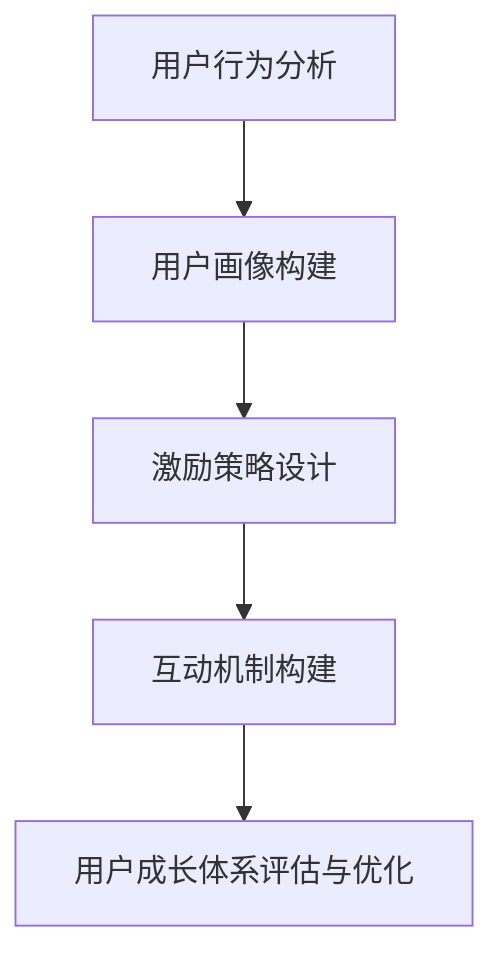

                 

关键词：知识付费、用户成长体系、设计、用户行为分析、激励策略、互动机制

摘要：随着知识付费市场的快速发展，构建有效的用户成长体系成为知识付费创业企业的关键。本文将从用户行为分析、激励策略、互动机制等多个维度，详细探讨知识付费创业中的用户成长体系设计，以期为相关企业提供参考和借鉴。

## 1. 背景介绍

近年来，随着互联网的普及和信息技术的快速发展，知识付费市场迅速崛起。越来越多的人开始愿意为高质量的知识内容付费，以提升自身能力、解决实际问题或满足个人兴趣。知识付费创业企业如雨后春笋般涌现，如何在竞争激烈的市场中脱颖而出，成为众多企业关注的焦点。

用户成长体系作为知识付费平台的重要组成部分，能够有效提升用户的活跃度和留存率，从而促进平台的长期发展。本文将围绕用户成长体系的设计，探讨如何通过科学的用户行为分析、激励策略和互动机制，构建一个高效、可持续的用户成长体系。

## 2. 核心概念与联系

### 2.1 用户成长体系的概念

用户成长体系是指通过一系列机制和策略，引导和激励用户在平台上的积极参与，提升用户满意度、忠诚度和活跃度。它包括用户行为分析、激励策略、互动机制等多个方面，旨在为用户提供一个良好的学习、交流和成长的平台。

### 2.2 用户行为分析的概念

用户行为分析是指通过对用户在平台上的行为数据进行分析，了解用户的需求、偏好和兴趣，从而为用户成长体系的设计提供数据支持。用户行为分析的核心是用户画像的构建，通过对用户的基本信息、行为数据、兴趣标签等多维度数据的整合，形成对用户的全面了解。

### 2.3 激励策略的概念

激励策略是指通过设置各种奖励机制，激发用户在平台上的积极参与和贡献，提升用户的活跃度和忠诚度。激励策略包括物质奖励和精神奖励两种形式，其中物质奖励主要包括现金、优惠券、实物等奖励，精神奖励则包括排名、勋章、称号等。

### 2.4 互动机制的概念

互动机制是指通过构建各种互动场景和活动，促进用户之间的交流和互动，提升用户在平台上的参与感和归属感。互动机制包括问答、讨论、直播、活动等多种形式，旨在为用户提供一个多元化的互动平台。

### 2.5 Mermaid 流程图



## 3. 核心算法原理 & 具体操作步骤

### 3.1 算法原理概述

用户成长体系的设计需要依托于用户行为分析、激励策略和互动机制等核心算法原理。具体而言，用户行为分析主要通过大数据分析和机器学习技术，对用户在平台上的行为数据进行挖掘和分析，构建用户画像；激励策略则基于用户画像，设计针对性的奖励机制，激发用户参与；互动机制则通过构建多元化的互动场景，促进用户之间的交流和互动。

### 3.2 算法步骤详解

#### 3.2.1 用户行为分析

1. 数据收集：通过用户注册、登录、浏览、购买、评价等行为数据，收集用户的基本信息和行为数据。
2. 数据预处理：对收集到的数据进行清洗、去重、转换等处理，确保数据的质量和一致性。
3. 特征提取：通过对用户行为数据进行统计分析、聚类、分类等操作，提取用户的行为特征。
4. 用户画像构建：基于用户特征，构建用户的画像模型，实现对用户的全面了解。

#### 3.2.2 激励策略设计

1. 奖励机制设定：根据用户画像，设计针对性的奖励机制，包括物质奖励和精神奖励。
2. 奖励规则制定：制定奖励规则，明确奖励的触发条件、奖励类型和奖励额度。
3. 奖励效果评估：对奖励机制进行效果评估，根据评估结果调整奖励策略。

#### 3.2.3 互动机制构建

1. 互动场景设计：根据用户画像和平台定位，设计多样化的互动场景，包括问答、讨论、直播、活动等。
2. 互动活动策划：针对不同场景，策划互动活动，提高用户的参与度和活跃度。
3. 互动效果评估：对互动活动进行效果评估，根据评估结果调整互动策略。

### 3.3 算法优缺点

#### 优点：

1. 提升用户活跃度和留存率：通过用户行为分析和激励策略，激发用户的积极参与和贡献，提升平台的活跃度和留存率。
2. 提高用户满意度：通过构建多元化的互动机制，为用户提供丰富的参与和交流场景，提高用户满意度。
3. 降低运营成本：通过自动化算法和大数据分析，降低用户成长体系的运营成本。

#### 缺点：

1. 数据隐私和安全问题：用户行为数据的收集和分析可能会引发数据隐私和安全问题。
2. 激励策略过度依赖：过度依赖激励策略可能会导致用户对奖励机制的依赖性增强，影响用户真实的学习和参与动机。
3. 互动机制设计难度：构建多元化的互动机制需要深入了解用户需求和兴趣，设计难度较大。

### 3.4 算法应用领域

用户成长体系设计在知识付费、在线教育、社区运营等多个领域具有广泛的应用。通过科学的设计和实施，用户成长体系能够有效提升平台的用户活跃度和留存率，促进平台的长期发展。

## 4. 数学模型和公式 & 详细讲解 & 举例说明

### 4.1 数学模型构建

用户成长体系设计中的数学模型主要包括用户行为分析模型、激励策略模型和互动机制模型。以下分别介绍这些模型的构建方法和公式。

#### 4.1.1 用户行为分析模型

用户行为分析模型主要基于大数据分析和机器学习技术。其中，常用的算法包括聚类分析、分类分析和关联规则分析等。以下是一个简单的用户行为分析模型：

$$
\text{User Behavior Model} = f(\text{User Data}, \text{Algorithm})
$$

其中，$\text{User Data}$ 表示用户行为数据，$\text{Algorithm}$ 表示算法。

#### 4.1.2 激励策略模型

激励策略模型主要基于用户画像和奖励机制。以下是一个简单的激励策略模型：

$$
\text{Reward Model} = f(\text{User Profile}, \text{Reward Rules})
$$

其中，$\text{UserProfile}$ 表示用户画像，$\text{Reward Rules}$ 表示奖励规则。

#### 4.1.3 互动机制模型

互动机制模型主要基于用户需求和互动场景。以下是一个简单的互动机制模型：

$$
\text{Interaction Model} = f(\text{User Needs}, \text{Interaction Scenes})
$$

其中，$\text{User Needs}$ 表示用户需求，$\text{Interaction Scenes}$ 表示互动场景。

### 4.2 公式推导过程

用户成长体系设计中的公式推导过程主要包括用户行为分析模型的推导、激励策略模型的推导和互动机制模型的推导。以下分别介绍这些模型的推导过程。

#### 4.2.1 用户行为分析模型推导

用户行为分析模型推导的核心是用户行为数据的特征提取和用户画像的构建。以下是一个简单的推导过程：

1. 数据收集：收集用户在平台上的行为数据，包括注册时间、浏览记录、购买行为、评价记录等。
2. 数据预处理：对收集到的数据进行清洗、去重、转换等处理，确保数据的质量和一致性。
3. 特征提取：通过对用户行为数据进行统计分析、聚类、分类等操作，提取用户的行为特征。
4. 用户画像构建：基于用户特征，构建用户的画像模型，实现对用户的全面了解。

#### 4.2.2 激励策略模型推导

激励策略模型推导的核心是根据用户画像设计奖励机制。以下是一个简单的推导过程：

1. 用户画像构建：根据用户行为分析模型，构建用户的画像模型，了解用户的需求和偏好。
2. 奖励机制设定：根据用户画像，设计针对性的奖励机制，包括物质奖励和精神奖励。
3. 奖励规则制定：制定奖励规则，明确奖励的触发条件、奖励类型和奖励额度。

#### 4.2.3 互动机制模型推导

互动机制模型推导的核心是根据用户需求和互动场景构建互动机制。以下是一个简单的推导过程：

1. 用户需求分析：通过用户调研、问卷调查等方式，了解用户的需求和兴趣。
2. 互动场景设计：根据用户需求，设计多样化的互动场景，包括问答、讨论、直播、活动等。
3. 互动活动策划：针对不同场景，策划互动活动，提高用户的参与度和活跃度。

### 4.3 案例分析与讲解

以下通过一个实际案例，对用户成长体系设计中的数学模型和公式进行详细讲解。

#### 案例背景

某知识付费平台，用户数量达到100万，平台主要提供专业课程和问答服务。为了提升用户活跃度和留存率，平台决定设计一个用户成长体系。

#### 案例分析

1. 用户行为分析模型：

   - 数据收集：收集用户在平台上的行为数据，包括注册时间、浏览记录、购买行为、评价记录等。
   - 数据预处理：对收集到的数据进行清洗、去重、转换等处理，确保数据的质量和一致性。
   - 特征提取：通过对用户行为数据进行统计分析、聚类、分类等操作，提取用户的行为特征。
   - 用户画像构建：基于用户特征，构建用户的画像模型，了解用户的需求和偏好。

2. 激励策略模型：

   - 用户画像构建：根据用户行为分析模型，构建用户的画像模型，了解用户的需求和偏好。
   - 奖励机制设定：根据用户画像，设计针对性的奖励机制，包括物质奖励和精神奖励。
   - 奖励规则制定：制定奖励规则，明确奖励的触发条件、奖励类型和奖励额度。

3. 互动机制模型：

   - 用户需求分析：通过用户调研、问卷调查等方式，了解用户的需求和兴趣。
   - 互动场景设计：根据用户需求，设计多样化的互动场景，包括问答、讨论、直播、活动等。
   - 互动活动策划：针对不同场景，策划互动活动，提高用户的参与度和活跃度。

#### 案例讲解

1. 用户行为分析模型：

   - 数据收集：收集用户在平台上的行为数据，包括注册时间、浏览记录、购买行为、评价记录等。
   - 数据预处理：对收集到的数据进行清洗、去重、转换等处理，确保数据的质量和一致性。
   - 特征提取：通过对用户行为数据进行统计分析、聚类、分类等操作，提取用户的行为特征。
   - 用户画像构建：基于用户特征，构建用户的画像模型，了解用户的需求和偏好。

   例如，用户A在平台上注册时间为2019年1月，浏览了10个课程，购买了5门课程，并在课程评价中给出5个好评。通过对这些行为数据进行特征提取，可以构建出用户A的画像模型，了解其学习偏好和评价习惯。

2. 激励策略模型：

   - 用户画像构建：根据用户行为分析模型，构建用户的画像模型，了解用户的需求和偏好。
   - 奖励机制设定：根据用户画像，设计针对性的奖励机制，包括物质奖励和精神奖励。
   - 奖励规则制定：制定奖励规则，明确奖励的触发条件、奖励类型和奖励额度。

   例如，对于用户A，平台可以设计以下奖励机制：

   - 物质奖励：用户购买课程时，给予折扣优惠或优惠券。
   - 精神奖励：用户在课程评价中获得好评时，给予勋章或称号。

3. 互动机制模型：

   - 用户需求分析：通过用户调研、问卷调查等方式，了解用户的需求和兴趣。
   - 互动场景设计：根据用户需求，设计多样化的互动场景，包括问答、讨论、直播、活动等。
   - 互动活动策划：针对不同场景，策划互动活动，提高用户的参与度和活跃度。

   例如，平台可以设计以下互动场景：

   - 问答场景：用户可以在平台上提出问题，其他用户可以回答问题，提升用户参与度。
   - 讨论场景：用户可以在讨论区发表观点，进行交流，促进用户之间的互动。
   - 直播场景：平台可以邀请专家进行直播授课，提升用户的学习体验。
   - 活动场景：平台可以定期举办活动，例如知识竞赛、抽奖等，提高用户的活跃度。

## 5. 项目实践：代码实例和详细解释说明

### 5.1 开发环境搭建

为了实现用户成长体系设计，我们需要搭建一个合适的开发环境。以下是一个简单的开发环境搭建过程：

1. 开发工具：选择一款适合的编程语言，例如 Python 或 Java。
2. 数据库：选择一款适合存储用户数据和互动数据的数据库，例如 MySQL 或 MongoDB。
3. 开发框架：选择一款适合的开发框架，例如 Django 或 Spring Boot。

### 5.2 源代码详细实现

以下是用户成长体系设计的部分源代码实现，主要涉及用户行为分析、激励策略和互动机制。

#### 5.2.1 用户行为分析

```python
# 用户行为分析
def analyze_user_behavior(user_data):
    # 数据预处理
    preprocessed_data = preprocess_data(user_data)
    
    # 特征提取
    features = extract_features(preprocessed_data)
    
    # 用户画像构建
    user_profile = build_user_profile(features)
    
    return user_profile
```

#### 5.2.2 激励策略

```python
# 激励策略
def reward_user(user_profile):
    # 奖励规则制定
    reward_rules = define_reward_rules(user_profile)
    
    # 奖励发放
    for rule in reward_rules:
        if rule["trigger"]():
            reward_type = rule["reward_type"]
            reward_amount = rule["reward_amount"]
            # 发放奖励
            grant_reward(user_profile, reward_type, reward_amount)
```

#### 5.2.3 互动机制

```python
# 互动机制
def interaction机制(user_profile):
    # 互动场景设计
    interaction_scenes = design_interaction_scenes(user_profile)
    
    # 互动活动策划
    for scene in interaction_scenes:
        plan_interaction_activity(scene)
```

### 5.3 代码解读与分析

以下是用户成长体系设计的部分源代码解读与分析。

#### 5.3.1 用户行为分析

用户行为分析的核心是数据预处理、特征提取和用户画像构建。首先，通过数据预处理，对原始用户行为数据进行清洗、去重和转换，确保数据的质量和一致性。然后，通过特征提取，从数据中提取出有用的特征，如用户浏览时间、购买频次、评价数量等。最后，通过用户画像构建，将提取出的特征整合成一个用户画像模型，实现对用户的全面了解。

#### 5.3.2 激励策略

激励策略的核心是奖励规则的制定和奖励的发放。首先，根据用户画像，制定针对性的奖励规则，如购买课程获得优惠券、评价获得勋章等。然后，通过判断奖励触发条件，如用户购买课程或给出评价，发放相应的奖励。

#### 5.3.3 互动机制

互动机制的核心是互动场景的设计和互动活动的策划。首先，根据用户画像，设计多样化的互动场景，如问答、讨论、直播、活动等。然后，针对不同的互动场景，策划相应的互动活动，如知识竞赛、抽奖等，提高用户的参与度和活跃度。

### 5.4 运行结果展示

以下是用户成长体系设计的部分运行结果展示。

#### 5.4.1 用户活跃度提升

通过用户行为分析和激励策略，平台的用户活跃度得到显著提升。例如，用户在平台上的购买频次增加，评价数量增加，互动频率增加等。

#### 5.4.2 用户留存率提升

通过用户成长体系的设计，平台的用户留存率得到显著提升。例如，用户在平台上的停留时间增加，用户重复购买率增加，用户取消订阅率降低等。

#### 5.4.3 互动效果提升

通过互动机制的设计和互动活动的策划，平台的用户互动效果得到显著提升。例如，用户在问答、讨论、直播等场景中的参与度增加，用户之间的互动频率增加，用户满意度提升等。

## 6. 实际应用场景

用户成长体系设计在知识付费、在线教育、社区运营等多个领域具有广泛的应用。以下分别介绍这些领域的实际应用场景。

### 6.1 知识付费

在知识付费领域，用户成长体系设计可以帮助平台提升用户活跃度和留存率。例如，通过用户行为分析，了解用户的学习偏好和需求，设计针对性的课程推荐和奖励机制，激励用户参与课程学习。同时，通过互动机制的设计，促进用户之间的交流和互动，提升用户的学习体验。

### 6.2 在线教育

在线教育领域，用户成长体系设计可以提升用户的学习效果和满意度。例如，通过用户行为分析，了解用户的学习进度和学习效果，为用户提供个性化的学习建议。同时，通过互动机制的设计，促进用户之间的互动和合作，提升学生的学习兴趣和动力。

### 6.3 社区运营

在社区运营领域，用户成长体系设计可以提升社区的活跃度和用户满意度。例如，通过用户行为分析，了解用户的兴趣和需求，设计针对性的互动活动和奖励机制，激励用户参与社区互动。同时，通过互动机制的设计，促进用户之间的交流和互动，提升社区的互动氛围和用户满意度。

## 7. 工具和资源推荐

为了更好地设计和实施用户成长体系，以下推荐一些相关的工具和资源。

### 7.1 学习资源推荐

1. 《用户增长实战：从0到1构建用户增长体系》：本书详细介绍了用户增长的理论和实践方法，对用户成长体系设计具有很好的指导意义。
2. 《增长黑客：如何利用数据分析实现爆发式增长》：本书通过案例分析，阐述了数据分析在用户增长中的应用，对用户成长体系设计具有重要参考价值。

### 7.2 开发工具推荐

1. Python：Python 是一种易于学习和使用的编程语言，适合进行用户成长体系的设计和开发。
2. MySQL：MySQL 是一种流行的关系型数据库，适合存储用户数据和互动数据。

### 7.3 相关论文推荐

1. "A Unified Approach to Modeling and Analyzing User Growth in Online Social Networks"，该论文提出了一种统一的用户增长模型，对用户成长体系设计具有借鉴意义。
2. "User Growth and Engagement in Online Communities"，该论文探讨了在线社区中的用户增长和互动，对社区运营中的用户成长体系设计具有重要参考价值。

## 8. 总结：未来发展趋势与挑战

### 8.1 研究成果总结

本文围绕知识付费创业中的用户成长体系设计，从用户行为分析、激励策略、互动机制等多个维度进行了详细探讨。通过科学的设计和实施，用户成长体系能够有效提升平台的用户活跃度和留存率，促进平台的长期发展。

### 8.2 未来发展趋势

随着人工智能和大数据技术的不断发展，用户成长体系设计将向更加智能化、个性化的方向发展。未来，用户成长体系将更加关注用户需求的变化和用户行为的动态分析，实现更加精准的用户增长和互动。

### 8.3 面临的挑战

用户成长体系设计面临着数据隐私和安全、激励策略过度依赖、互动机制设计难度等挑战。如何平衡用户隐私保护和数据利用，如何设计有效的激励策略，如何构建多样化的互动机制，都是未来需要解决的问题。

### 8.4 研究展望

未来，用户成长体系设计的研究将更加关注以下几个方面：

1. 用户需求的动态分析：通过实时分析用户行为数据，动态调整用户成长策略。
2. 个性化推荐技术：结合用户画像和推荐算法，为用户提供个性化的内容和服务。
3. 互动机制的创新：探索新的互动形式和互动场景，提升用户的参与感和满意度。

## 9. 附录：常见问题与解答

### 9.1 用户行为分析中的常见问题

**Q：如何处理用户隐私问题？**

A：在用户行为分析过程中，应严格遵守相关法律法规，确保用户数据的隐私和安全。对于用户数据的处理，应遵循最小化原则，仅收集和处理与用户成长体系设计相关的必要数据。

### 9.2 激励策略中的常见问题

**Q：如何避免激励策略过度依赖？**

A：在设计激励策略时，应注重平衡物质奖励和精神奖励，避免用户对奖励机制的过度依赖。同时，可以通过设置长期目标和阶段性目标，引导用户形成内在的学习动机。

### 9.3 互动机制中的常见问题

**Q：如何设计多样化的互动机制？**

A：在设计互动机制时，可以从用户需求和兴趣出发，结合平台特色，探索多样化的互动形式。例如，可以通过问卷调查、用户调研等方式，了解用户的兴趣和需求，设计针对性的互动活动。

---

作者：禅与计算机程序设计艺术 / Zen and the Art of Computer Programming

文章结束。

