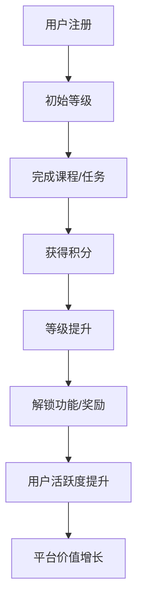

                 

关键词：知识付费、用户成长体系、激励机制、数据分析、用户行为、用户体验、平台设计

> 摘要：本文将探讨知识付费创业领域中的用户成长体系设计，分析用户成长体系的核心概念及其设计原则，提出基于用户行为的成长体系构建方法，并通过实际案例分享，深入解读成长体系在知识付费平台中的应用和效果。

## 1. 背景介绍

知识付费作为近年来迅速崛起的新兴商业模式，已经深刻影响了教育培训、专业咨询、内容创作等多个领域。随着互联网技术的不断进步，用户对个性化、高质量的知识内容需求日益增长，知识付费平台如雨后春笋般涌现。然而，如何在激烈的竞争中留住用户、促进用户持续活跃，成为了知识付费创业者面临的重要课题。

用户成长体系作为一种激励机制，旨在通过构建一个多维度的成长路径，激励用户积极参与平台互动，提升用户黏性和满意度。一个科学、合理、富有吸引力的用户成长体系，不仅能够提升用户活跃度，还能够帮助平台筛选出优质用户，为平台带来持续的价值。

## 2. 核心概念与联系

### 2.1. 用户成长体系定义

用户成长体系是指通过设定一系列用户成长目标和激励机制，引导用户在平台上实现自我提升的过程。用户成长体系的核心目标是提升用户体验，增强用户黏性，并最终实现平台价值的最大化。

### 2.2. 用户成长体系组成部分

用户成长体系主要由以下几个方面组成：

1. **成长目标**：设定清晰的成长目标，引导用户按照一定的路径逐步提升。
2. **激励机制**：通过奖励、积分、等级提升等方式激励用户积极参与。
3. **成长路径**：构建合理、多元化的成长路径，满足不同层次用户的需求。
4. **数据分析**：通过数据收集和分析，评估用户成长体系的实际效果，持续优化成长体系。

### 2.3. 用户成长体系架构

用户成长体系架构图如下：



## 3. 核心算法原理 & 具体操作步骤

### 3.1 算法原理概述

用户成长体系的核心算法主要包括以下几个方面：

1. **积分计算**：根据用户行为（如完成任务、观看视频、参与讨论等），系统自动计算积分。
2. **等级评估**：积分累积到一定程度，用户等级提升，解锁新的功能或奖励。
3. **激励机制**：设定不同等级的奖励，鼓励用户积极参与。

### 3.2 算法步骤详解

1. **用户行为数据收集**：平台通过用户行为数据收集系统，实时记录用户的各项行为数据。
2. **积分计算**：根据预设的积分规则，对用户行为数据进行积分计算。
3. **等级评估**：系统根据积分累积情况，对用户等级进行评估。
4. **激励发放**：用户等级提升后，系统自动发放相应的激励。

### 3.3 算法优缺点

**优点**：

- **用户黏性提升**：通过成长体系和激励机制，激发用户持续活跃。
- **用户筛选**：成长体系有助于筛选出优质用户，为平台带来价值。
- **用户体验优化**：合理设计的成长路径和激励机制，提升用户满意度。

**缺点**：

- **算法复杂度**：需要较高的技术门槛，算法设计和优化需要持续迭代。
- **用户疲劳**：过度依赖激励机制，可能导致用户疲劳或产生依赖。

### 3.4 算法应用领域

用户成长体系在知识付费领域的应用十分广泛，如在线教育、专业咨询、内容创作等平台。通过成长体系，平台能够有效提升用户活跃度和满意度，实现平台价值的最大化。

## 4. 数学模型和公式 & 详细讲解 & 举例说明

### 4.1 数学模型构建

用户成长体系的数学模型主要包括积分计算和等级评估两个方面。

#### 积分计算模型

$$
\text{积分} = \sum_{i=1}^{n} (\text{行为权重} \times \text{行为次数})
$$

其中，行为权重是根据用户行为的重要性和频率设定的权重系数，行为次数是用户在某一时间段内完成的行为数量。

#### 等级评估模型

$$
\text{等级} = \text{积分} / \text{等级阈值}
$$

其中，等级阈值是根据不同等级的积分范围设定的阈值。

### 4.2 公式推导过程

积分计算公式的推导主要基于用户行为的加权求和。首先，定义用户在某一时间段内完成的行为种类为 $n$，每种行为的重要性和频率可以用权重 $w_i$ 表示，行为次数为 $c_i$。则积分计算公式可以表示为：

$$
\text{积分} = \sum_{i=1}^{n} w_i \times c_i
$$

对于等级评估公式，假设每个等级的积分阈值分别为 $t_1, t_2, \ldots, t_n$，则用户当前等级可以表示为：

$$
\text{等级} = \sum_{i=1}^{n} (\text{积分} \div t_i)
$$

### 4.3 案例分析与讲解

假设一个知识付费平台设定以下积分规则：

- 观看视频：10积分/次
- 完成作业：30积分/次
- 参与讨论：5积分/次

同时，设定等级阈值如下：

- 初级：0-100积分
- 中级：101-500积分
- 高级：501-1000积分

#### 案例分析

用户A在一个月内完成以下行为：

- 观看视频10次
- 完成作业5次
- 参与讨论10次

根据积分计算公式，用户A的积分为：

$$
\text{积分} = (10 \times 10) + (5 \times 30) + (10 \times 5) = 350
$$

根据等级评估公式，用户A的等级为：

$$
\text{等级} = 350 / 500 = 0.7
$$

用户A目前处于中级。

#### 案例讲解

本案例通过简单的积分计算和等级评估，展示了用户成长体系在知识付费平台中的应用。积分规则和等级阈值的设计需要结合平台实际情况进行优化，以实现最佳的用户成长效果。

## 5. 项目实践：代码实例和详细解释说明

### 5.1 开发环境搭建

本文采用Python语言进行用户成长体系算法的实现。开发环境搭建如下：

- Python版本：3.8
- 数据库：MySQL
- 开发工具：PyCharm

### 5.2 源代码详细实现

#### 积分计算模块

```python
def calculate_score(actions):
    scores = {
        'watch_video': 10,
        'complete_assignment': 30,
        'participate_discussion': 5
    }
    total_score = 0
    for action, count in actions.items():
        total_score += scores[action] * count
    return total_score
```

#### 等级评估模块

```python
def evaluate_level(score, level_thresholds):
    for level, threshold in level_thresholds.items():
        if score >= threshold:
            return level
    return '未达到等级'
```

### 5.3 代码解读与分析

代码首先定义了两个核心模块：积分计算模块和等级评估模块。积分计算模块通过字典形式存储不同行为的积分权重，并根据用户行为数据计算总积分。等级评估模块根据预设的等级阈值，评估用户的等级。

### 5.4 运行结果展示

```python
# 用户行为数据
actions = {
    'watch_video': 10,
    'complete_assignment': 5,
    'participate_discussion': 10
}

# 积分计算
score = calculate_score(actions)
print(f"用户积分：{score}")

# 等级评估
level_thresholds = {
    '初级': 100,
    '中级': 500,
    '高级': 1000
}
level = evaluate_level(score, level_thresholds)
print(f"用户等级：{level}")
```

输出结果：

```
用户积分：350
用户等级：中级
```

## 6. 实际应用场景

### 6.1 知识付费平台中的用户成长体系应用

在知识付费平台中，用户成长体系的应用主要体现在以下几个方面：

- **课程学习**：用户通过完成课程学习任务获得积分，提升等级，解锁更多高级课程。
- **社区互动**：用户在社区参与讨论、发表观点获得积分，提升等级，增加在社区的权重。
- **知识分享**：用户通过分享知识内容获得积分，提升等级，增强个人影响力。

### 6.2 用户成长体系在在线教育平台的应用

在线教育平台通过用户成长体系，不仅能够激励用户积极参与学习，还能够筛选出优秀学员，为平台带来更多优质内容。例如，用户在完成课程后，可以发表学习心得，获得相应积分，提升等级，同时平台也可以根据积分和用户行为数据，推荐适合的学习资源。

## 7. 工具和资源推荐

### 7.1 学习资源推荐

- 《人人都是产品经理》：一本关于产品设计的经典入门书籍，适合初学者。
- 《数据挖掘：实用工具与技术》：一本关于数据挖掘的实用指南，适合对数据分析有兴趣的朋友。

### 7.2 开发工具推荐

- PyCharm：一款强大的Python开发工具，支持智能提示、代码分析等功能。
- MySQL：一款流行的关系型数据库，适合用于数据存储和管理。

### 7.3 相关论文推荐

- "A Growth Hacking Framework for Your Business"：一篇关于增长黑客框架的论文，探讨了用户增长策略。
- "The Power of Habit: Why We Do What We Do in Life and Business"：一本关于习惯力量的畅销书，适合了解用户行为心理学。

## 8. 总结：未来发展趋势与挑战

### 8.1 研究成果总结

本文从用户成长体系的设计原则、算法原理、实际应用等方面，全面探讨了知识付费创业中的用户成长体系。通过案例分析，展示了用户成长体系在知识付费平台中的实际应用效果。

### 8.2 未来发展趋势

- **个性化推荐**：未来用户成长体系将更加注重个性化推荐，根据用户兴趣和行为，提供定制化的成长路径。
- **大数据分析**：随着大数据技术的发展，用户成长体系将更加依赖于用户行为数据的分析，实现更加精准的用户运营。
- **AI赋能**：人工智能技术的应用，将进一步提升用户成长体系的智能化水平，实现更加高效的用户运营。

### 8.3 面临的挑战

- **算法复杂性**：用户成长体系的算法设计和优化，需要较高的技术门槛，如何在保证算法准确性的同时，简化算法实现，是未来需要解决的问题。
- **用户疲劳**：过度依赖激励机制，可能导致用户疲劳或产生依赖，如何平衡激励机制和用户体验，是平台需要持续关注的问题。

### 8.4 研究展望

未来，用户成长体系的研究将更加关注个性化、智能化和高效化，通过不断优化算法和激励机制，实现用户价值的最大化。同时，结合人工智能、大数据等前沿技术，为用户成长体系提供更多创新解决方案。

## 9. 附录：常见问题与解答

### 9.1 用户成长体系的设计原则有哪些？

用户成长体系的设计原则主要包括：

- **目标明确**：设定清晰的成长目标，引导用户按照一定路径逐步提升。
- **激励机制**：通过奖励、积分、等级提升等方式激励用户积极参与。
- **用户体验**：注重用户体验，确保成长路径简单、易懂、有趣。
- **数据驱动**：通过数据分析和反馈，持续优化成长体系。

### 9.2 用户成长体系在知识付费平台中的具体应用有哪些？

用户成长体系在知识付费平台中的具体应用主要包括：

- **课程学习**：通过完成课程学习任务获得积分，提升等级，解锁更多高级课程。
- **社区互动**：在社区参与讨论、发表观点获得积分，提升等级，增加在社区的权重。
- **知识分享**：通过分享知识内容获得积分，提升等级，增强个人影响力。

### 9.3 如何平衡激励机制和用户体验？

平衡激励机制和用户体验可以从以下几个方面入手：

- **适度激励**：避免过度依赖激励机制，以免用户产生疲劳或依赖。
- **多样化激励**：提供多样化的激励方式，满足不同用户的需求。
- **用户体验优化**：注重用户体验，确保成长路径简单、易懂、有趣。

---

通过本文的探讨，我们希望为知识付费创业者提供有益的启示和指导，助力他们在激烈的市场竞争中，构建科学、合理、富有吸引力的用户成长体系，实现平台价值的最大化。作者：禅与计算机程序设计艺术 / Zen and the Art of Computer Programming。|

