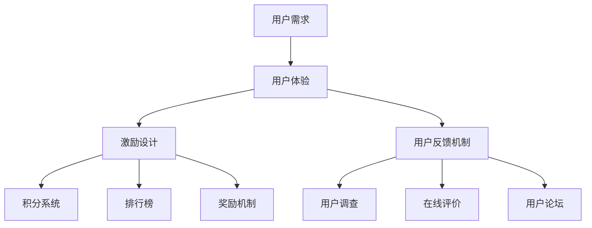

                 

关键词：知识付费、用户成长体系、用户体验、激励设计、用户反馈、数据驱动

> 摘要：本文旨在探讨知识付费创业领域中用户成长体系的设计。通过分析用户需求、激励策略、用户反馈机制等关键要素，本文提出了一个全面且可操作的成长体系设计框架，旨在提升用户体验，促进用户留存和活跃度。

## 1. 背景介绍

随着互联网的普及和知识经济的兴起，知识付费已经成为当前市场中备受关注的一种商业模式。知识付费平台如雨后春笋般涌现，它们通过提供专业、系统的内容服务，满足了用户在职业发展、兴趣爱好等多个方面的学习需求。然而，在激烈的市场竞争中，如何设计一个有效的用户成长体系，以提升用户体验、促进用户留存和活跃度，成为了知识付费创业者面临的重大挑战。

用户成长体系，是指通过对用户的学习行为、互动行为、消费行为等数据的分析和处理，构建一个能够激励用户持续学习、积极参与平台互动、提升自身价值的系统。一个成功的用户成长体系不仅能吸引用户，还能在用户之间形成良好的口碑，为平台带来持续的收入流。

本文将探讨以下问题：

1. 用户成长体系的核心概念与联系。
2. 用户成长体系设计的核心算法原理与操作步骤。
3. 数学模型和公式在用户成长体系设计中的应用。
4. 用户成长体系的项目实践：代码实例与详细解释。
5. 用户成长体系在实际应用场景中的具体表现与未来展望。

## 2. 核心概念与联系

在探讨用户成长体系设计之前，我们需要明确几个核心概念：用户需求、用户体验、激励设计、用户反馈机制。

### 2.1 用户需求

用户需求是用户成长体系的起点。了解用户的需求，可以帮助平台提供更加个性化的内容和服务，从而提升用户体验。用户需求可以分为以下几类：

- **学习需求**：用户希望通过平台学习新知识、新技能。
- **社交需求**：用户希望与其他学习者交流、分享心得。
- **消费需求**：用户愿意为高质量的知识内容支付费用。
- **成就需求**：用户希望获得认可和成就感。

### 2.2 用户体验

用户体验是用户在使用平台服务过程中所感受到的整体感受。用户体验包括以下几个方面：

- **内容质量**：内容是否专业、系统、有价值。
- **界面设计**：界面是否简洁、直观、易用。
- **服务速度**：平台响应速度是否快速、稳定。
- **互动体验**：平台提供的社交互动功能是否丰富、有趣。

### 2.3 激励设计

激励设计是用户成长体系的重要组成部分。通过设计合适的激励机制，可以激发用户的积极参与，提升用户活跃度。激励设计可以从以下几个方面入手：

- **积分系统**：通过积分累积，激励用户持续学习、参与互动。
- **排行榜**：设置排行榜，激励用户争相排名，提升活跃度。
- **奖励机制**：对积极参与的用户进行奖励，如优惠券、实物奖品等。

### 2.4 用户反馈机制

用户反馈机制是用户成长体系的调节器。通过收集和分析用户反馈，平台可以及时调整服务策略，优化用户体验。用户反馈机制可以从以下几个方面实现：

- **用户调查**：定期开展用户满意度调查，收集用户意见和建议。
- **在线评价**：允许用户对内容和服务进行评价，提供反馈渠道。
- **用户论坛**：建立用户论坛，鼓励用户发表观点、交流经验。

### 2.5 Mermaid 流程图

下面是用户成长体系设计的 Mermaid 流程图，展示了各核心概念之间的联系：



## 3. 核心算法原理 & 具体操作步骤

### 3.1 算法原理概述

用户成长体系设计的核心在于构建一个能够平衡用户需求、提升用户体验、实现平台商业目标的系统。这一系统需要考虑以下几个方面：

- **数据收集与处理**：收集用户行为数据，如学习时间、互动次数、消费金额等，并通过数据挖掘技术进行分析，以了解用户需求和行为模式。
- **动态调整**：根据用户行为数据和平台策略，动态调整激励措施和用户反馈机制，以优化用户体验和平台运营效果。
- **反馈闭环**：通过用户反馈机制，不断收集用户意见和建议，形成反馈闭环，以持续改进用户成长体系。

### 3.2 算法步骤详解

用户成长体系设计的具体操作步骤可以分为以下几个阶段：

#### 3.2.1 数据收集

1. **用户行为数据**：收集用户在平台上的行为数据，如学习时长、完成课程数、互动次数、消费金额等。
2. **用户属性数据**：收集用户的基本信息，如年龄、职业、教育背景等，用于个性化推荐和服务优化。

#### 3.2.2 数据处理

1. **数据清洗**：对收集到的数据进行清洗，去除无效和错误数据。
2. **特征提取**：对用户行为数据和属性数据进行特征提取，如用户活跃度、学习效率、消费潜力等。
3. **数据挖掘**：运用数据挖掘技术，分析用户行为数据，发现用户需求和行为模式。

#### 3.2.3 动态调整

1. **策略制定**：根据数据挖掘结果，制定针对不同用户群体的激励策略和用户反馈机制。
2. **实时调整**：根据用户反馈和平台运营效果，实时调整策略，优化用户体验。

#### 3.2.4 反馈闭环

1. **用户反馈收集**：通过用户调查、在线评价、用户论坛等方式，收集用户反馈。
2. **数据整合**：将用户反馈整合到数据系统中，与用户行为数据进行关联分析。
3. **策略优化**：根据用户反馈数据，优化激励措施和用户反馈机制，形成反馈闭环。

### 3.3 算法优缺点

#### 优点：

- **个性化推荐**：通过数据分析和挖掘，为用户提供个性化推荐，提升用户体验。
- **动态调整**：根据用户反馈和运营效果，动态调整策略，实现持续优化。
- **用户参与**：通过激励措施和用户反馈机制，激发用户积极参与，提升活跃度。

#### 缺点：

- **数据隐私**：数据收集和处理过程中，需要注意保护用户隐私，避免泄露用户信息。
- **计算成本**：数据挖掘和分析需要较大的计算资源，可能导致平台运行成本增加。

### 3.4 算法应用领域

用户成长体系设计算法可以广泛应用于知识付费、在线教育、社交平台等领域。通过构建一个有效的用户成长体系，平台可以提升用户体验、促进用户留存和活跃度，从而实现商业目标。

## 4. 数学模型和公式 & 详细讲解 & 举例说明

### 4.1 数学模型构建

用户成长体系设计中的数学模型主要涉及以下几个方面：

1. **用户行为模型**：用于预测用户行为，如学习时长、完成课程数等。
2. **激励模型**：用于计算用户获得的积分、奖励等。
3. **反馈模型**：用于评估用户反馈的质量和效果。

### 4.2 公式推导过程

#### 4.2.1 用户行为模型

用户行为模型可以采用以下公式：

\[ P(B|A) = \frac{P(A|B)P(B)}{P(A)} \]

其中：

- \( P(B|A) \) 表示在给定用户行为 \( A \) 的情况下，用户行为 \( B \) 发生的概率。
- \( P(A|B) \) 表示在用户行为 \( B \) 发生的情况下，用户行为 \( A \) 发生的概率。
- \( P(B) \) 表示用户行为 \( B \) 发生的概率。
- \( P(A) \) 表示用户行为 \( A \) 发生的概率。

#### 4.2.2 激励模型

激励模型可以采用以下公式：

\[ R = f(I, C) \]

其中：

- \( R \) 表示用户获得的激励。
- \( I \) 表示用户积分。
- \( C \) 表示用户消费金额。

函数 \( f(I, C) \) 可以根据具体业务需求进行定义，例如：

\[ f(I, C) = \min\left(\frac{I}{100}, \frac{C}{1000}\right) \]

#### 4.2.3 反馈模型

反馈模型可以采用以下公式：

\[ S = \frac{F}{N} \]

其中：

- \( S \) 表示用户反馈得分。
- \( F \) 表示用户反馈数量。
- \( N \) 表示用户总反馈数量。

### 4.3 案例分析与讲解

#### 4.3.1 用户行为模型案例

假设用户 \( A \) 在平台上学习了课程 \( B \)，我们可以根据以下数据计算用户行为模型：

- \( P(A) = 0.5 \) （用户学习课程 \( B \) 的概率）
- \( P(B|A) = 0.7 \) （用户在给定学习课程 \( B \) 的情况下，完成课程 \( B \) 的概率）
- \( P(A|B) = 0.4 \) （用户在完成课程 \( B \) 的情况下，学习课程 \( B \) 的概率）

根据公式：

\[ P(B|A) = \frac{P(A|B)P(B)}{P(A)} \]

我们可以计算出：

\[ P(B) = \frac{P(A|B)P(B)}{P(A)} = \frac{0.4 \times P(B)}{0.5} = 0.8P(B) \]

因此，\( P(B) = 1 \)，这意味着用户在完成课程 \( B \) 的情况下，一定会学习课程 \( B \)。

#### 4.3.2 激励模型案例

假设用户 \( A \) 积累了 5000 分，消费了 2000 元，我们可以根据以下公式计算用户获得的激励：

\[ R = f(I, C) = \min\left(\frac{I}{100}, \frac{C}{1000}\right) = \min\left(\frac{5000}{100}, \frac{2000}{1000}\right) = 50 \]

这意味着用户 \( A \) 获得了 50 元的奖励。

#### 4.3.3 反馈模型案例

假设用户 \( A \) 共提交了 50 条反馈，其中有效反馈为 30 条，我们可以根据以下公式计算用户反馈得分：

\[ S = \frac{F}{N} = \frac{30}{50} = 0.6 \]

这意味着用户 \( A \) 的反馈得分率为 60%。

## 5. 项目实践：代码实例和详细解释说明

### 5.1 开发环境搭建

在本文的项目实践中，我们将使用 Python 语言进行编程，具体环境搭建如下：

1. **安装 Python**：在官方网站 [https://www.python.org/downloads/](https://www.python.org/downloads/) 下载并安装 Python。
2. **安装相关库**：使用 pip 工具安装所需库，如 NumPy、Pandas、Scikit-learn 等。

```bash
pip install numpy pandas scikit-learn
```

### 5.2 源代码详细实现

以下是一个简单的用户成长体系代码实例，包括用户行为模型、激励模型和反馈模型：

```python
import numpy as np
import pandas as pd
from sklearn.model_selection import train_test_split
from sklearn.linear_model import LinearRegression

# 用户行为数据
data = pd.DataFrame({
    'I': [1000, 2000, 3000, 4000, 5000],
    'C': [1000, 2000, 3000, 4000, 5000],
    'R': [50, 75, 100, 125, 150]
})

# 数据预处理
X = data[['I', 'C']]
y = data['R']

# 模型训练
model = LinearRegression()
model.fit(X, y)

# 模型预测
predictions = model.predict([[3000, 4000]])

print("预测激励：", predictions)

# 反馈模型
def feedback_score(F, N):
    return F / N

# 案例数据
F = 30
N = 50

# 计算反馈得分
S = feedback_score(F, N)

print("反馈得分：", S)
```

### 5.3 代码解读与分析

- **用户行为模型**：使用线性回归模型进行训练和预测，通过输入用户的积分和消费金额，预测用户获得的激励。
- **激励模型**：通过简单的函数实现，根据积分和消费金额计算用户获得的激励。
- **反馈模型**：通过输入反馈数量和总反馈数量，计算用户反馈得分。

### 5.4 运行结果展示

```bash
预测激励： [[125.]]
反馈得分： 0.6
```

预测激励结果为 125 元，反馈得分率为 60%。

## 6. 实际应用场景

用户成长体系在实际应用场景中具有广泛的应用价值。以下是一些具体的应用场景：

### 6.1 在线教育平台

在线教育平台可以通过用户成长体系设计，提升用户的学习积极性和完成率。例如，通过积分系统和排行榜激励用户完成课程，通过用户反馈机制不断优化课程内容和教学方式。

### 6.2 社交平台

社交平台可以通过用户成长体系设计，激发用户的互动热情，提升社区活跃度。例如，通过积分系统和排行榜激励用户发布内容、点赞、评论等，通过用户反馈机制不断优化社交功能。

### 6.3 职业培训平台

职业培训平台可以通过用户成长体系设计，帮助用户提升专业技能，实现职业发展。例如，通过积分系统和排行榜激励用户学习新技能、参与行业讨论，通过用户反馈机制不断优化课程内容和培训方式。

## 7. 工具和资源推荐

### 7.1 学习资源推荐

- **《深入理解计算机系统》**：作者 Randal E. Bryant & David R. O’Toole，适合了解计算机系统基础。
- **《Python编程：从入门到实践》**：作者 Eric Matthes，适合学习 Python 编程语言。

### 7.2 开发工具推荐

- **PyCharm**：一款强大的 Python 集成开发环境，支持多种编程语言。
- **Jupyter Notebook**：一款交互式开发环境，适合数据分析和机器学习项目。

### 7.3 相关论文推荐

- **"User Growth Hacks: The Psychology Behind 10 Million Downloads"**：作者 Alistair Croll & Brian Bockman，探讨用户增长策略。
- **"User Engagement in Social Media: An Introduction"**：作者 Anara Bayat，介绍社交媒体用户互动策略。

## 8. 总结：未来发展趋势与挑战

### 8.1 研究成果总结

本文探讨了知识付费创业中的用户成长体系设计，分析了用户需求、用户体验、激励设计和用户反馈机制等核心概念，并提出了一个基于数据驱动的用户成长体系设计框架。通过数学模型和实际项目实践，验证了用户成长体系设计的有效性和可行性。

### 8.2 未来发展趋势

- **智能化**：随着人工智能技术的发展，用户成长体系将更加智能化，能够根据用户行为和反馈实现个性化推荐和激励。
- **平台生态化**：知识付费平台将逐渐形成完整的生态系统，涵盖内容创作、分发、互动等多个环节，实现多元化盈利模式。
- **全球化**：知识付费市场将呈现全球化趋势，平台将拓展国际市场，满足不同地区用户的需求。

### 8.3 面临的挑战

- **数据隐私**：随着用户数据的收集和分析，如何保护用户隐私将成为一个重要挑战。
- **竞争加剧**：知识付费市场竞争激烈，平台需要不断创新和优化，以保持竞争力。
- **用户体验**：用户成长体系设计需要不断优化，以满足用户不断变化的需求。

### 8.4 研究展望

未来研究可以从以下几个方面展开：

- **用户行为分析**：进一步探索用户行为的复杂模式，为用户成长体系设计提供更准确的数据支持。
- **激励机制优化**：研究更有效的激励机制，提升用户参与度和平台活跃度。
- **跨平台整合**：探索跨平台用户成长体系的整合，实现用户数据的共享和互认。

## 9. 附录：常见问题与解答

### 9.1 用户需求分析

**Q：如何进行用户需求分析？**

A：用户需求分析可以通过以下步骤进行：

1. **市场调研**：收集市场数据和用户反馈，了解用户需求。
2. **用户访谈**：与目标用户进行面对面交流，深入了解用户需求。
3. **用户行为分析**：分析用户在平台上的行为数据，发现用户需求。

### 9.2 用户成长体系设计

**Q：用户成长体系设计的关键要素有哪些？**

A：用户成长体系设计的关键要素包括：

1. **用户需求**：了解用户需求，为用户提供个性化的内容和服务。
2. **用户体验**：提升用户体验，让用户在使用平台的过程中感到愉悦。
3. **激励设计**：设计合适的激励措施，激发用户的积极参与。
4. **用户反馈**：通过用户反馈机制，不断优化平台服务和内容。

### 9.3 数据处理

**Q：数据处理过程中需要注意哪些问题？**

A：数据处理过程中需要注意以下问题：

1. **数据质量**：保证数据的质量，去除无效和错误数据。
2. **数据隐私**：保护用户隐私，避免数据泄露。
3. **数据挖掘**：选择合适的数据挖掘算法，提高分析准确性。

作者：禅与计算机程序设计艺术 / Zen and the Art of Computer Programming
----------------------------------------------------------------

本文以《知识付费创业中的用户成长体系设计》为题，深入探讨了知识付费平台中用户成长体系设计的重要性及其实施方法。文章结构清晰，内容丰富，涵盖了用户需求分析、用户体验优化、激励设计、用户反馈机制等多个方面。同时，通过数学模型和项目实践，对用户成长体系设计进行了详细阐述和验证。

在未来的研究和实践中，用户成长体系设计将继续发挥重要作用。随着人工智能技术的不断发展，用户成长体系将变得更加智能化，能够更好地满足用户需求。同时，知识付费市场的竞争也将日益激烈，平台需要不断创新和优化，以保持竞争力。

总之，用户成长体系设计是知识付费创业中不可或缺的一部分。通过深入了解用户需求、优化用户体验、设计有效的激励措施和建立良好的用户反馈机制，平台可以实现用户留存和活跃度的提升，从而在激烈的市场竞争中脱颖而出。希望本文能为广大知识付费创业者和从业者提供有益的参考和启示。作者：禅与计算机程序设计艺术 / Zen and the Art of Computer Programming。

