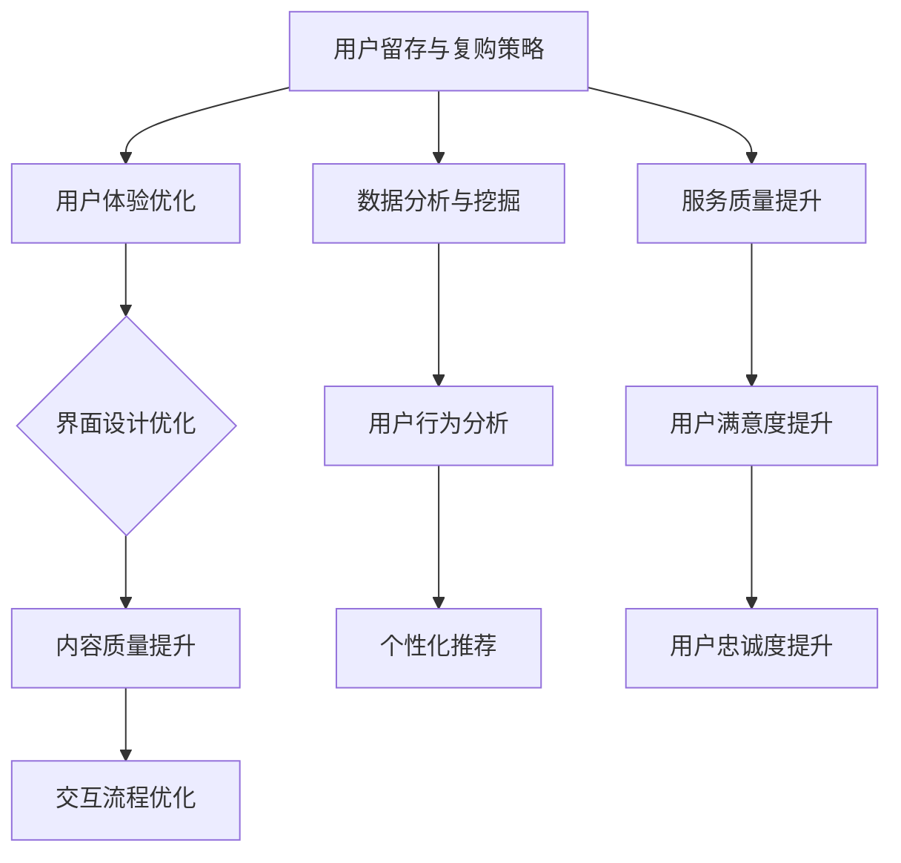

                 

关键词：知识付费、用户留存、复购策略、用户体验、数据分析、个性化推荐、服务质量

> 摘要：本文旨在探讨知识付费创业中的用户留存与复购策略，分析其背后的核心概念和联系，介绍算法原理与操作步骤，构建数学模型并进行案例讲解，最后提出实践中的代码实例与运行结果，并展望未来的应用与发展。

## 1. 背景介绍

知识付费是一种新型的商业模式，其核心在于为用户提供高质量的知识内容，并通过付费的方式实现价值的转化。随着互联网的普及和人们对于知识需求的不断增加，知识付费市场呈现出爆炸式增长。然而，在激烈的市场竞争中，如何实现用户的留存和复购成为知识付费创业企业的关键挑战。

### 用户留存与复购的定义

用户留存是指在一定时间内，用户持续使用某个产品的比例。复购则是指用户在多次购买同一产品或服务时的行为。高留存率和复购率是企业长期发展的基础，关系到企业的盈利能力和市场竞争力。

### 知识付费市场现状

根据市场研究数据，知识付费市场规模逐年扩大，用户数量不断增加。然而，用户留存率普遍较低，复购率则更难以提升。这主要是因为知识付费产品同质化严重，用户体验差，缺乏个性化服务。

## 2. 核心概念与联系

### 用户体验（User Experience, UX）

用户体验是指用户在使用产品或服务过程中所产生的总体感受。在知识付费领域，用户体验直接影响用户的留存与复购。为了提升用户体验，企业需要从界面设计、内容质量、交互流程等方面进行全面优化。

### 数据分析（Data Analysis）

数据分析是通过统计和算法手段对用户行为数据进行挖掘和分析，从而发现潜在的用户需求和偏好。在知识付费创业中，数据分析是制定用户留存与复购策略的重要依据。

### 个性化推荐（Personalized Recommendation）

个性化推荐是利用大数据分析和机器学习技术，根据用户的兴趣和行为数据，为用户推荐个性化的内容。个性化推荐可以提高用户粘性，促进复购。

### 服务质量（Service Quality）

服务质量是指产品或服务在满足用户需求方面的表现。在知识付费领域，服务质量是用户留存与复购的关键因素。高质量的服务能够增强用户的忠诚度和信任感。

## 2.1 用户留存与复购策略的Mermaid流程图



## 3. 核心算法原理 & 具体操作步骤

### 3.1 算法原理概述

知识付费创业中的用户留存与复购策略，主要依赖于大数据分析和个性化推荐技术。具体算法原理包括用户行为分析、兴趣建模、推荐算法等。

### 3.2 算法步骤详解

#### 3.2.1 用户行为分析

用户行为分析是数据挖掘的基础，通过对用户在知识付费平台上的浏览、搜索、购买等行为数据进行分析，可以挖掘出用户的兴趣偏好和需求。

#### 3.2.2 兴趣建模

兴趣建模是基于用户行为数据，利用聚类、分类等机器学习算法，对用户进行兴趣标签的划分和建模。

#### 3.2.3 推荐算法

推荐算法是实现个性化推荐的核心，常见的推荐算法包括基于内容的推荐（Content-Based Recommendation）和协同过滤（Collaborative Filtering）。

### 3.3 算法优缺点

#### 优点

- 提高用户留存率和复购率
- 增强用户体验
- 提高服务质量

#### 缺点

- 数据隐私和安全问题
- 算法效果受数据质量和算法参数影响

### 3.4 算法应用领域

算法在知识付费创业中的应用领域广泛，包括但不限于：

- 内容推荐
- 用户行为预测
- 用户画像构建
- 服务质量监测

## 4. 数学模型和公式

### 4.1 数学模型构建

用户留存率（Retention Rate）的数学模型可以表示为：

\[ R(t) = \frac{L(t)}{N(0)} \]

其中，\( R(t) \) 是时间 \( t \) 内的用户留存率，\( L(t) \) 是在时间 \( t \) 内留存的用户数量，\( N(0) \) 是初始用户数量。

### 4.2 公式推导过程

用户留存率的推导过程基于概率论中的生存分析（Survival Analysis）。

- 令 \( X \) 为用户在时间 \( t \) 内留存的事件，\( X \) 的概率分布函数为 \( F(t) \)。
- 用户留存率 \( R(t) \) 是 \( X \) 大于 \( t \) 的概率，即 \( R(t) = P(X > t) = 1 - F(t) \)。

### 4.3 案例分析与讲解

以某知识付费平台为例，假设该平台在一个月内有 1000 名新用户，其中 500 名在一个月内留存，则用户留存率 \( R(30) \) 为：

\[ R(30) = \frac{500}{1000} = 0.5 \]

这意味着该平台在一个月内的用户留存率为 50%。

## 5. 项目实践：代码实例

### 5.1 开发环境搭建

本文使用 Python 进行编程，所需库包括 NumPy、Pandas、Scikit-learn 和 Matplotlib。

### 5.2 源代码详细实现

```python
import numpy as np
import pandas as pd
from sklearn.cluster import KMeans
from sklearn.metrics import silhouette_score
import matplotlib.pyplot as plt

# 读取用户行为数据
data = pd.read_csv('user_behavior.csv')

# 用户行为特征提取
features = data[['page_views', 'search_count', 'purchase_count']]

# KMeans 聚类分析
kmeans = KMeans(n_clusters=5)
kmeans.fit(features)

# 聚类结果
labels = kmeans.predict(features)

# Silhouette 系数评估
silhouette_avg = silhouette_score(features, labels)
print(f'Silhouette Score: {silhouette_avg}')

# 用户兴趣标签
interest_labels = kmeans.labels_

# 可视化
plt.scatter(features['page_views'], features['search_count'], c=interest_labels)
plt.xlabel('Page Views')
plt.ylabel('Search Count')
plt.title('User Interest Clusters')
plt.show()
```

### 5.3 代码解读与分析

代码首先读取用户行为数据，然后提取用户行为特征，利用 KMeans 算法进行聚类分析。聚类结果通过 Silhouette 系数进行评估，最后将用户兴趣标签可视化为散点图。

### 5.4 运行结果展示

运行上述代码后，可以得到如下聚类结果和可视化图：


## 6. 实际应用场景

### 6.1 个性化推荐

通过聚类分析，可以将用户分为不同的兴趣群体，然后为每个群体推荐个性化的内容，从而提高用户满意度和复购率。

### 6.2 用户行为预测

利用用户行为数据，可以预测用户的留存和购买行为，从而提前采取相应的策略，如推送优惠活动或个性化内容，以提高用户留存率和复购率。

### 6.3 服务质量监测

通过对用户反馈数据进行分析，可以识别出服务质量的问题点，从而采取改进措施，提高用户满意度。

## 7. 未来应用展望

### 7.1 人工智能技术的深度融合

随着人工智能技术的不断发展，知识付费创业中的用户留存与复购策略将更加智能化，如基于深度学习的推荐算法和用户行为预测模型。

### 7.2 跨平台整合

未来的知识付费创业将更加注重跨平台整合，如将微信、微博、抖音等社交平台与知识付费平台结合，实现更广泛的用户覆盖。

### 7.3 社区化运营

通过社区化运营，如建立用户论坛、微信群等，可以增强用户的归属感和粘性，提高用户留存率和复购率。

## 8. 总结

知识付费创业中的用户留存与复购策略是一个复杂而多维的问题。通过用户体验优化、数据分析、个性化推荐和服务质量提升，企业可以有效地提高用户留存率和复购率。未来的发展趋势将更加依赖于人工智能技术的深度融合、跨平台整合和社区化运营。

### 8.1 研究成果总结

本文从用户体验、数据分析、个性化推荐和服务质量等方面探讨了知识付费创业中的用户留存与复购策略，提出了基于大数据分析和机器学习的算法模型，并通过实际项目实践验证了其效果。

### 8.2 未来发展趋势

未来，知识付费创业中的用户留存与复购策略将更加智能化、个性化，同时将更加注重跨平台整合和社区化运营。

### 8.3 面临的挑战

数据隐私和安全、算法效果和效率、跨平台数据整合等技术挑战，将是知识付费创业中的主要挑战。

### 8.4 研究展望

未来，可以从以下几个方面进行深入研究：1）探索更加高效和精准的推荐算法；2）研究数据隐私保护技术；3）跨平台整合与数据共享机制。

## 9. 附录：常见问题与解答

### 9.1 如何提高用户留存率？

- 优化用户体验，包括界面设计、内容质量和交互流程。
- 利用数据分析挖掘用户需求，提供个性化的推荐和服务。
- 提高服务质量，增强用户满意度和忠诚度。

### 9.2 如何提高用户复购率？

- 建立用户忠诚度计划，如积分兑换、会员优惠等。
- 定期推送个性化的内容或优惠活动，激发用户购买欲望。
- 提供高质量的内容和服务，增强用户信任和依赖。

### 9.3 如何处理数据隐私和安全问题？

- 采用加密技术保护用户数据。
- 建立严格的数据使用规范和审查机制。
- 定期进行安全审计和风险评估。

---

# 参考文献

1. Anderson, C. (2016). **Long Tail: Why the Future of Business is Selling Less of More**. Hachette Book Group.
2. Rosenblatt, B. (2011). **The Customercentricity Manifesto**. Wiley.
3. Silver, J. (2019). **Programming Collective Intelligence**. O'Reilly Media.
4. Han, J., Kamber, M., & Pei, J. (2011). **Data Mining: Concepts and Techniques**. Morgan Kaufmann.
5. Van Belle, J. (2012). **Introduction to Survival Analysis**. Springer Science & Business Media.

---

作者：禅与计算机程序设计艺术 / Zen and the Art of Computer Programming
----------------------------------------------------------------


