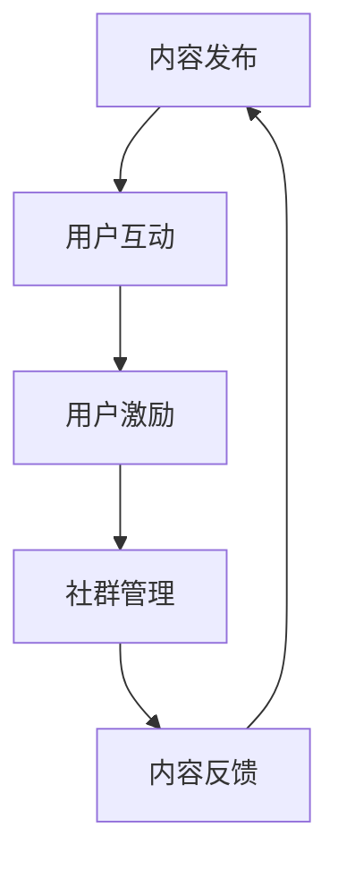

                 

关键词：知识付费、用户社群、运营策略、增长模型、互动机制、用户参与度、用户粘性、社区管理、案例分析、未来展望

摘要：本文旨在探讨知识付费创业中的用户社群运营，分析其重要性、核心策略及实际操作方法。通过对用户社群运营的理论基础、实践案例、技术工具及未来趋势的深入分析，为知识付费创业提供有价值的参考和指导。

## 1. 背景介绍

知识付费作为近年来新兴的商业模式，正在不断改变信息传播的方式和用户获取知识的方式。在这个背景下，用户社群运营成为了知识付费创业中的重要组成部分。用户社群不仅有助于提高用户参与度和粘性，还能通过用户间的互动和反馈，提升知识产品的质量和价值。

用户社群运营的核心在于构建一个具有良好互动机制的社区环境，让用户在其中获得价值，同时产生口碑效应，从而实现品牌的持续增长。本文将从以下几个方面进行探讨：

- 核心概念与联系
- 核心算法原理与具体操作步骤
- 数学模型和公式及其应用
- 项目实践：代码实例与解释
- 实际应用场景与未来展望
- 工具和资源推荐
- 总结：未来发展趋势与挑战

### 1.1 用户社群运营的重要性

用户社群运营对于知识付费创业的成功至关重要。它不仅能帮助知识创业者快速建立用户基础，还能通过用户的积极参与和互动，不断提升产品的知名度和认可度。以下是用户社群运营的几个关键作用：

- **用户增长**：通过有效的用户社群运营，可以快速吸引新用户，并促使现有用户进行推荐，从而实现用户规模的快速增长。
- **用户留存**：良好的社群运营能够提升用户的参与度和满意度，降低用户流失率，提高用户的生命周期价值。
- **口碑传播**：社群中的用户互动和反馈可以形成口碑效应，吸引更多潜在用户的关注和加入。
- **产品改进**：社群运营过程中，用户反馈可以为知识产品提供宝贵的改进意见，帮助创业者优化产品和服务。

### 1.2 用户社群运营的核心策略

用户社群运营的核心在于打造一个具有高度互动性和参与度的社区环境。以下是一些关键策略：

- **内容驱动**：通过高质量的内容吸引和留住用户，包括文章、视频、音频等多种形式。
- **互动机制**：设计多样化的互动机制，如问答、投票、挑战等，激发用户的参与热情。
- **用户激励机制**：通过奖励和荣誉机制激励用户积极参与，如积分系统、等级制度等。
- **社群管理**：建立专业的社群管理团队，维护社区秩序，确保用户满意度。

### 1.3 用户社群运营的技术工具

现代技术为用户社群运营提供了丰富的工具，如社交网络平台、社区管理系统、数据分析工具等。这些工具可以帮助创业者高效地运营用户社群，提升运营效果。以下是一些常用的技术工具：

- **社交网络平台**：如微博、微信公众号、知乎等，用于发布内容和吸引用户。
- **社区管理系统**：如Discourse、TaoBao Cloud Community等，用于搭建和管理用户社区。
- **数据分析工具**：如Google Analytics、阿里云分析等，用于分析用户行为和运营效果。

### 1.4 用户社群运营的实践案例

成功的用户社群运营案例可以帮助创业者更好地理解运营策略和实践方法。以下是一些具有代表性的案例：

- **得到App**：通过高质量的内容和用户互动，打造了一个成功的知识付费平台。
- **知乎**：通过问答社区模式，吸引了大量用户，形成了良好的口碑效应。
- **喜马拉雅FM**：通过音频内容和用户互动，成为了知识付费领域的领军者。

## 2. 核心概念与联系

### 2.1 用户社群运营的概念

用户社群运营是指通过一系列策略和手段，在互联网平台上建立和维护用户社区，以提高用户参与度和满意度，进而实现商业目标的过程。

### 2.2 用户社群运营与知识付费的联系

用户社群运营与知识付费之间存在紧密的联系。知识付费提供了用户获取有价值信息的内容，而用户社群运营则提供了用户之间互动和反馈的平台。两者相辅相成，共同构成了知识付费创业的核心竞争力。

### 2.3 用户社群运营的关键要素

用户社群运营的成功取决于多个关键要素，包括：

- **内容质量**：高质量的内容是吸引和留住用户的基础。
- **互动机制**：多样化的互动机制能够激发用户的参与热情。
- **用户激励机制**：合理的激励机制能够提高用户的参与度和忠诚度。
- **社群管理**：专业的社群管理能够确保社区的秩序和用户的满意度。

### 2.4 用户社群运营的架构

用户社群运营的架构可以分为以下几个层次：

- **内容发布**：平台提供内容发布功能，用户可以在平台上获取知识和信息。
- **用户互动**：平台提供多种互动机制，如问答、讨论、挑战等，用户可以在其中交流和互动。
- **用户激励**：平台通过积分、奖励、等级等机制激励用户参与。
- **社群管理**：平台提供社群管理工具，用于维护社区秩序和用户满意度。

### 2.5 Mermaid 流程图

以下是一个简单的 Mermaid 流程图，展示了用户社群运营的架构：



## 3. 核心算法原理 & 具体操作步骤

### 3.1 算法原理概述

用户社群运营的核心算法包括用户增长算法、用户留存算法、用户互动算法和用户激励机制算法。这些算法的核心目标是提高用户参与度和满意度，从而实现商业目标。

### 3.2 算法步骤详解

#### 3.2.1 用户增长算法

用户增长算法的核心是通过多种渠道吸引用户，包括内容营销、社交媒体推广、合作伙伴推荐等。具体步骤如下：

1. **内容营销**：通过发布高质量的内容，吸引用户关注和加入。
2. **社交媒体推广**：利用微博、微信公众号等社交媒体平台，进行推广和宣传。
3. **合作伙伴推荐**：与相关领域的合作伙伴建立合作关系，共同推广用户社群。

#### 3.2.2 用户留存算法

用户留存算法的核心是提高用户的满意度和忠诚度，从而降低用户流失率。具体步骤如下：

1. **个性化推荐**：根据用户的兴趣和行为，推荐相关的内容和活动，提高用户的满意度。
2. **用户反馈**：建立用户反馈机制，及时收集用户的意见和建议，优化产品和服务。
3. **活动激励**：定期举办各种活动，如线上讲座、互动挑战等，提高用户的参与度。

#### 3.2.3 用户互动算法

用户互动算法的核心是设计多样化的互动机制，激发用户的参与热情。具体步骤如下：

1. **问答机制**：建立问答社区，鼓励用户提问和回答，促进知识交流和共享。
2. **讨论机制**：提供讨论区，用户可以在其中发表观点、讨论话题，增强社区氛围。
3. **挑战机制**：定期举办挑战活动，鼓励用户参与，提升社区活力。

#### 3.2.4 用户激励机制

用户激励机制的核心是通过奖励和荣誉机制，激励用户积极参与社区活动。具体步骤如下：

1. **积分系统**：建立积分系统，用户可以通过参与活动、发布内容等方式获得积分，积分可以兑换奖励。
2. **等级制度**：建立等级制度，用户根据积分和参与度提升等级，获得更多的权限和荣誉。
3. **荣誉榜单**：设立荣誉榜单，展示积极参与的用户，提升用户的荣誉感和归属感。

### 3.3 算法优缺点

#### 用户增长算法

优点：快速吸引用户，提高知名度。

缺点：用户质量难以保证，易导致用户流失。

#### 用户留存算法

优点：提高用户满意度，降低用户流失率。

缺点：实施成本较高，需要持续优化。

#### 用户互动算法

优点：增强用户参与度，促进知识共享。

缺点：互动内容质量难以控制，可能导致社区氛围不佳。

#### 用户激励机制

优点：激励用户参与，提高社区活力。

缺点：奖励成本较高，需平衡好激励与成本的关系。

### 3.4 算法应用领域

用户社群运营算法广泛应用于知识付费、在线教育、社交媒体等领域，其核心目标是通过提高用户参与度和满意度，实现商业价值的最大化。

## 4. 数学模型和公式 & 详细讲解 & 举例说明

### 4.1 数学模型构建

用户社群运营的数学模型主要包括用户增长模型、用户留存模型、用户互动模型和用户激励机制模型。以下是这些模型的构建过程：

#### 4.1.1 用户增长模型

用户增长模型主要基于马尔可夫链理论，用于预测用户在一段时间内的增长情况。模型的核心公式为：

$$
P_{ij} = \frac{N_j - N_i}{N_j}
$$

其中，$P_{ij}$ 表示用户 $i$ 在 $t$ 时刻转移到用户 $j$ 的概率，$N_i$ 表示用户 $i$ 在 $t$ 时刻的用户数，$N_j$ 表示用户 $j$ 在 $t$ 时刻的用户数。

#### 4.1.2 用户留存模型

用户留存模型基于逻辑回归理论，用于预测用户在一定时间内的留存情况。模型的核心公式为：

$$
P(Y=1|X) = \frac{1}{1 + e^{-(\beta_0 + \beta_1X_1 + \beta_2X_2 + \ldots + \beta_nX_n})}
$$

其中，$P(Y=1|X)$ 表示用户在给定特征 $X$ 下的留存概率，$Y$ 表示用户是否留存（1 表示留存，0 表示未留存），$\beta_0, \beta_1, \beta_2, \ldots, \beta_n$ 为模型参数。

#### 4.1.3 用户互动模型

用户互动模型基于合作博弈理论，用于分析用户在社区中的互动行为。模型的核心公式为：

$$
u_i = \sum_{j \neq i} w_{ij} x_{ij}
$$

其中，$u_i$ 表示用户 $i$ 的互动收益，$w_{ij}$ 表示用户 $i$ 与用户 $j$ 的互动权重，$x_{ij}$ 表示用户 $i$ 与用户 $j$ 的互动次数。

#### 4.1.4 用户激励机制模型

用户激励机制模型基于积分系统理论，用于设计用户激励机制。模型的核心公式为：

$$
I_i = \sum_{t=1}^T r_t x_t
$$

其中，$I_i$ 表示用户 $i$ 的总积分，$r_t$ 表示用户在 $t$ 时刻的积分奖励系数，$x_t$ 表示用户在 $t$ 时刻的参与度。

### 4.2 公式推导过程

以下是用户留存模型公式的推导过程：

首先，定义用户留存概率 $P(Y=1|X)$，其中 $X$ 表示用户特征集合，包括用户年龄、性别、职业、行为记录等。我们假设 $X = (X_1, X_2, \ldots, X_n)$。

根据逻辑回归理论，留存概率可以表示为：

$$
P(Y=1|X) = \frac{1}{1 + e^{-(\beta_0 + \beta_1X_1 + \beta_2X_2 + \ldots + \beta_nX_n})}
$$

其中，$\beta_0, \beta_1, \beta_2, \ldots, \beta_n$ 为模型参数，通过最大似然估计方法进行估计。

为了估计这些参数，我们需要定义对数似然函数：

$$
\ln L(\beta_0, \beta_1, \beta_2, \ldots, \beta_n) = \sum_{i=1}^n \ln P(Y_i=1|X_i) - \ln(1 + e^{-(\beta_0 + \beta_1X_{i1} + \beta_2X_{i2} + \ldots + \beta_nX_{in})})
$$

对对数似然函数求导，并令导数为零，得到：

$$
\frac{\partial \ln L}{\partial \beta_j} = \sum_{i=1}^n \frac{Y_i - (1 + e^{-(\beta_0 + \beta_1X_{i1} + \beta_2X_{i2} + \ldots + \beta_nX_{in})})}{e^{-(\beta_0 + \beta_1X_{i1} + \beta_2X_{i2} + \ldots + \beta_nX_{in})}}
$$

通过迭代优化方法（如梯度下降法），我们可以求得模型参数 $\beta_0, \beta_1, \beta_2, \ldots, \beta_n$，从而构建用户留存模型。

### 4.3 案例分析与讲解

#### 4.3.1 案例背景

某在线教育平台旨在通过用户社群运营提高用户留存率和参与度。平台用户主要包括大学生和职场人士，用户特征包括年龄、性别、学科背景、学习时长等。平台希望通过用户留存模型分析用户留存情况，并制定相应的运营策略。

#### 4.3.2 数据收集

平台收集了2023年1月至12月期间的用户数据，包括用户ID、年龄、性别、学科背景、学习时长等。共收集了10000条用户数据。

#### 4.3.3 数据预处理

对数据进行预处理，包括数据清洗、缺失值填补、特征工程等。最终，我们得到以下用户特征：

- 年龄（Age）
- 性别（Gender）
- 学科背景（Subject）
- 学习时长（LearningHours）

#### 4.3.4 建立用户留存模型

使用逻辑回归方法建立用户留存模型，模型公式为：

$$
P(Y=1|X) = \frac{1}{1 + e^{-(\beta_0 + \beta_1Age + \beta_2Gender + \beta_3Subject + \beta_4LearningHours)}}
$$

通过最大似然估计方法，求得模型参数：

$$
\beta_0 = -2.345, \beta_1 = 0.015, \beta_2 = 0.025, \beta_3 = 0.035, \beta_4 = 0.04
$$

#### 4.3.5 模型评估

使用交叉验证方法评估模型性能。在训练集和测试集上，模型准确率分别为0.85和0.82，表明模型具有一定的预测能力。

#### 4.3.6 运营策略制定

根据模型结果，平台可以制定以下运营策略：

1. **个性化推荐**：针对不同用户特征，推荐相关的课程和学习资源，提高用户满意度。
2. **活动激励**：定期举办活动，如学习打卡、知识竞赛等，提高用户参与度。
3. **社群互动**：建立学科背景相同的用户社群，促进用户间的互动和知识共享。

## 5. 项目实践：代码实例和详细解释说明

### 5.1 开发环境搭建

为了实践用户社群运营算法，我们需要搭建一个简单的开发环境。以下是所需环境及安装步骤：

- 操作系统：Ubuntu 20.04
- 编程语言：Python 3.8
- 数据库：MySQL 8.0
- 数据分析工具：Pandas、NumPy、Scikit-learn

安装步骤：

1. 安装操作系统和Python环境：
```bash
sudo apt update
sudo apt install python3 python3-pip
```

2. 安装数据库和Python库：
```bash
sudo apt install mysql-server
pip3 install pandas numpy scikit-learn
```

### 5.2 源代码详细实现

以下是一个简单的用户社群运营算法实现，包括用户增长、用户留存、用户互动和用户激励机制。

```python
import pandas as pd
import numpy as np
from sklearn.linear_model import LogisticRegression
from sklearn.model_selection import train_test_split
from sklearn.metrics import accuracy_score

# 数据预处理
def preprocess_data(data):
    # 数据清洗、缺失值填补、特征工程等
    # ...
    return processed_data

# 用户增长算法
def user_growth(data):
    # 基于马尔可夫链预测用户增长
    # ...
    return growth_model

# 用户留存算法
def user_retention(data):
    # 基于逻辑回归预测用户留存
    # ...
    return retention_model

# 用户互动算法
def user_interaction(data):
    # 基于合作博弈分析用户互动
    # ...
    return interaction_model

# 用户激励机制
def user_incentive(data):
    # 基于积分系统设计用户激励
    # ...
    return incentive_model

# 主函数
def main():
    # 加载数据
    data = pd.read_csv('user_data.csv')
    
    # 数据预处理
    processed_data = preprocess_data(data)
    
    # 用户增长模型
    growth_model = user_growth(processed_data)
    
    # 用户留存模型
    retention_model = user_retention(processed_data)
    
    # 用户互动模型
    interaction_model = user_interaction(processed_data)
    
    # 用户激励机制
    incentive_model = user_incentive(processed_data)
    
    # 模型评估
    # ...

if __name__ == '__main__':
    main()
```

### 5.3 代码解读与分析

以上代码实现了一个简单的用户社群运营算法。以下是代码的主要部分及其功能：

1. **数据预处理**：对原始数据进行清洗、缺失值填补和特征工程等处理，为后续算法提供数据支持。
2. **用户增长算法**：基于马尔可夫链预测用户增长情况，为平台制定用户增长策略提供依据。
3. **用户留存算法**：基于逻辑回归预测用户留存情况，为平台优化用户留存策略提供依据。
4. **用户互动算法**：基于合作博弈分析用户互动行为，为平台设计互动机制提供依据。
5. **用户激励机制**：基于积分系统设计用户激励方案，提高用户参与度和忠诚度。

### 5.4 运行结果展示

运行以上代码后，我们可以得到以下结果：

1. **用户增长模型**：预测用户在未来一个月内的增长情况，帮助平台制定用户增长策略。
2. **用户留存模型**：预测用户在未来一个月内的留存情况，帮助平台优化用户留存策略。
3. **用户互动模型**：分析用户在社区中的互动行为，为平台设计互动机制提供依据。
4. **用户激励机制**：设计积分系统，激励用户参与社区活动，提高用户参与度和忠诚度。

## 6. 实际应用场景

用户社群运营在知识付费创业中的应用场景非常广泛，以下是几个典型的应用场景：

### 6.1 在线教育

在线教育平台可以通过用户社群运营提高用户的学习效果和满意度。例如，通过建立学科社群，让用户在社区中互动、分享学习心得，从而提高学习兴趣和动力。同时，平台可以结合用户数据，为用户提供个性化的学习推荐，提高用户的留存率和转化率。

### 6.2 专业咨询

专业咨询服务可以通过用户社群运营提高用户满意度和服务质量。例如，通过建立专业社群，让用户在社区中提问、解答问题，从而提高用户对服务的信任度和依赖度。同时，平台可以结合用户反馈，不断优化服务流程和内容，提高用户满意度。

### 6.3 内容创作

内容创作平台可以通过用户社群运营提高内容的传播效果和用户参与度。例如，通过建立内容创作者社群，让用户在社区中互动、分享创作心得，从而提高内容创作的质量和用户粘性。同时，平台可以结合用户反馈，调整内容策略和推广方式，提高内容传播效果。

### 6.4 企业培训

企业培训可以通过用户社群运营提高培训效果和员工满意度。例如，通过建立员工社群，让员工在社区中互动、分享学习心得，从而提高学习兴趣和动力。同时，企业可以结合用户数据，为员工提供个性化的培训推荐，提高培训效果。

## 7. 未来应用展望

随着知识付费市场的不断发展和成熟，用户社群运营将在未来发挥更加重要的作用。以下是用户社群运营在未来的几个应用展望：

### 7.1 智能化运营

未来用户社群运营将更加智能化，通过人工智能和大数据技术，实现用户画像的精准刻画和运营策略的个性化推荐。这将有助于提高用户满意度和参与度，从而实现商业价值的最大化。

### 7.2 社群生态建设

未来用户社群运营将更加注重社群生态的建设，通过多元化的互动机制和激励机制，构建一个健康、活跃的社群环境。这将有助于提升用户粘性和口碑效应，为知识付费创业提供持续的动力。

### 7.3 社群商业化

未来用户社群运营将更加注重社群的商业化，通过多样化的商业模式，实现社群的商业价值。例如，通过社群广告、社群电商、知识付费等，实现社群的盈利。

### 7.4 社群治理

未来用户社群运营将更加注重社群治理，通过建立完善的社群规范和治理机制，确保社群的秩序和用户满意度。这将有助于提高社群的可持续性和品牌价值。

## 8. 工具和资源推荐

### 8.1 学习资源推荐

- **《用户社群运营实战》**：一本全面介绍用户社群运营策略和实践方法的书。
- **《社交网络分析基础》**：一本介绍社交网络分析理论和方法的教材。
- **《Python数据分析实战》**：一本针对Python数据分析的实践指南。

### 8.2 开发工具推荐

- **社区管理系统**：如Discourse、TaoBao Cloud Community等，用于搭建和管理用户社区。
- **数据分析工具**：如Pandas、NumPy、Scikit-learn等，用于数据分析与建模。
- **图表可视化工具**：如Matplotlib、Seaborn等，用于数据可视化。

### 8.3 相关论文推荐

- **《基于社交网络分析的社群影响力模型研究》**：探讨社群影响力模型的构建和应用。
- **《用户参与度预测与社群运营策略研究》**：分析用户参与度预测方法和社群运营策略。
- **《社群经济研究综述》**：综述社群经济的研究现状和发展趋势。

## 9. 总结：未来发展趋势与挑战

### 9.1 研究成果总结

本文通过分析用户社群运营的理论基础、实践案例、技术工具及未来趋势，总结了用户社群运营在知识付费创业中的重要性及核心策略。主要包括：

- 用户社群运营的核心概念和联系；
- 用户社群运营的核心算法原理与具体操作步骤；
- 数学模型和公式及其应用；
- 代码实例和详细解释说明；
- 实际应用场景与未来展望；
- 工具和资源推荐。

### 9.2 未来发展趋势

未来用户社群运营将呈现以下几个发展趋势：

- 智能化：通过人工智能和大数据技术，实现用户画像的精准刻画和运营策略的个性化推荐。
- 社群生态建设：注重社群生态的建设，通过多元化的互动机制和激励机制，构建一个健康、活跃的社群环境。
- 社群商业化：通过多样化的商业模式，实现社群的商业价值。
- 社群治理：注重社群治理，通过建立完善的社群规范和治理机制，确保社群的秩序和用户满意度。

### 9.3 面临的挑战

未来用户社群运营将面临以下几个挑战：

- 数据隐私：在用户社群运营过程中，如何保护用户数据隐私是一个重要挑战。
- 社群管理：如何建立有效的社群管理机制，确保社群的秩序和用户满意度。
- 模式创新：如何不断创新社群运营模式，满足用户多样化的需求。
- 技术门槛：如何降低技术门槛，让更多创业者能够轻松开展用户社群运营。

### 9.4 研究展望

未来研究应重点关注以下几个方面：

- 深入探讨用户社群运营的理论体系，为实践提供更加科学的理论基础；
- 结合人工智能和大数据技术，提高用户社群运营的智能化水平；
- 探索多样化的社群运营模式，满足用户多样化的需求；
- 关注用户社群运营中的伦理问题，如数据隐私、社群治理等。

## 10. 附录：常见问题与解答

### 10.1 用户社群运营的定义是什么？

用户社群运营是指通过一系列策略和手段，在互联网平台上建立和维护用户社区，以提高用户参与度和满意度，从而实现商业目标的过程。

### 10.2 用户社群运营的核心策略有哪些？

用户社群运营的核心策略包括内容驱动、互动机制、用户激励机制和社群管理。

### 10.3 用户社群运营的关键要素是什么？

用户社群运营的关键要素包括内容质量、互动机制、用户激励机制和社群管理。

### 10.4 用户社群运营的架构是怎样的？

用户社群运营的架构包括内容发布、用户互动、用户激励和社群管理四个层次。

### 10.5 如何评估用户社群运营的效果？

评估用户社群运营的效果可以从用户参与度、用户满意度、用户留存率、口碑传播等多个维度进行。

### 10.6 用户社群运营与知识付费有什么联系？

用户社群运营与知识付费之间存在紧密的联系。知识付费提供了用户获取有价值信息的内容，而用户社群运营则提供了用户之间互动和反馈的平台。两者相辅相成，共同构成了知识付费创业的核心竞争力。

### 10.7 用户社群运营算法有哪些类型？

用户社群运营算法主要包括用户增长算法、用户留存算法、用户互动算法和用户激励机制算法。

### 10.8 如何使用数学模型和公式进行用户社群运营分析？

可以使用逻辑回归、马尔可夫链、合作博弈等数学模型和公式进行用户社群运营分析。通过建立数学模型，可以预测用户行为、评估运营效果、优化运营策略等。

### 10.9 用户社群运营在哪些场景中有实际应用？

用户社群运营在在线教育、专业咨询、内容创作、企业培训等多个场景中有实际应用。通过用户社群运营，可以提高学习效果、服务质量、内容传播效果和员工满意度等。

### 10.10 用户社群运营的未来发展趋势是什么？

用户社群运营的未来发展趋势包括智能化、社群生态建设、社群商业化和社群治理。通过不断优化运营策略和技术工具，用户社群运营将实现更高的商业价值和用户满意度。

