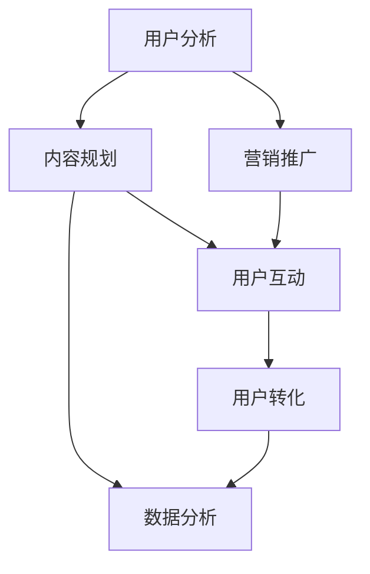

                 

关键词：知识付费、用户转化策略、用户心理学、营销技巧、数据分析、用户体验、技术创新

> 摘要：本文深入探讨了知识付费创业中的用户转化策略。从用户心理学、营销技巧、数据分析、用户体验和技术创新等多个维度，分析了影响用户转化的关键因素，并提出了针对性的策略和建议。旨在为知识付费创业者提供一套系统的、可操作的转化方案，以提升用户转化率和业务增长。

## 1. 背景介绍

知识付费是近年来迅速崛起的一个新兴领域。随着互联网技术的发展和用户消费观念的转变，越来越多的个人和机构开始通过线上平台提供专业知识和技能的付费服务。知识付费不仅为知识生产者提供了新的收入来源，也为消费者提供了获取高质量知识的便捷途径。

然而，知识付费创业并非易事。在激烈的市场竞争中，如何吸引并留住用户，实现用户转化成为创业者面临的重要课题。用户转化策略的成功与否，直接关系到知识付费项目的生存和发展。

本文将从以下方面展开探讨：

1. 用户转化策略的核心概念与联系
2. 核心算法原理与具体操作步骤
3. 数学模型和公式及其应用
4. 项目实践：代码实例与详细解释
5. 实际应用场景与未来展望
6. 工具和资源推荐
7. 总结与未来发展趋势

通过以上内容的深入分析，希望为知识付费创业者提供一套系统的用户转化策略，助力业务成功。

## 2. 核心概念与联系

### 2.1 用户转化策略的核心概念

用户转化策略是指通过一系列有针对性的营销和运营手段，将潜在用户转化为实际用户的行动和方法。它涵盖了从用户吸引、引导、互动到最终转化的整个过程。

在知识付费创业中，用户转化策略的核心概念包括：

- **用户吸引力**：通过内容、品牌、服务等多方面因素，吸引潜在用户关注和兴趣。
- **用户引导**：通过引导用户深入了解产品和服务，增强其购买意愿。
- **用户互动**：通过互动和沟通，建立用户对品牌的信任感和忠诚度。
- **用户转化**：将潜在用户最终转化为实际购买者。

### 2.2 用户转化策略的架构

为了实现有效的用户转化，需要构建一个包含以下环节的完整架构：

1. **用户分析**：了解用户需求、行为和痛点，为后续策略制定提供数据支持。
2. **内容规划**：根据用户需求，制定有针对性的内容策略，提升用户体验。
3. **营销推广**：通过多种营销手段，提高品牌知名度和用户参与度。
4. **用户互动**：通过社群、活动等方式，与用户建立长期互动，增强用户粘性。
5. **数据分析**：对用户行为和转化数据进行分析，优化策略，提高转化效果。

### 2.3 用户转化策略的 Mermaid 流程图

下面是用户转化策略的 Mermaid 流程图：



## 3. 核心算法原理 & 具体操作步骤

### 3.1 算法原理概述

用户转化策略的核心算法基于用户行为分析和机器学习技术。通过分析用户在平台上的行为数据，如浏览记录、购买历史、互动行为等，构建用户画像，并根据用户画像进行个性化推荐和营销。

算法的基本原理包括：

1. **数据收集**：收集用户在平台上的各种行为数据。
2. **数据预处理**：对原始数据进行清洗、转换和标准化，为后续分析做准备。
3. **特征提取**：从预处理后的数据中提取有用的特征，用于构建用户画像。
4. **用户画像构建**：根据提取的特征，构建每个用户的画像，包括用户的基本信息、兴趣偏好、行为习惯等。
5. **个性化推荐**：根据用户画像，为用户推荐感兴趣的内容和产品。
6. **营销策略制定**：基于用户画像和推荐结果，制定有针对性的营销策略。
7. **效果评估与优化**：通过用户转化数据和反馈，评估营销策略的效果，并不断优化。

### 3.2 算法步骤详解

1. **数据收集**：

   - **用户行为数据**：包括用户在平台上的浏览、搜索、购买、评价等行为。
   - **用户反馈数据**：包括用户在平台上提交的反馈、评论、建议等。

2. **数据预处理**：

   - **数据清洗**：去除重复、无效和错误的数据。
   - **数据转换**：将不同类型的数据转换为统一的格式。
   - **数据标准化**：对数据进行归一化或标准化处理，使其具有可比性。

3. **特征提取**：

   - **基于内容特征**：从用户生成的内容中提取特征，如文本、图片、音频等。
   - **基于行为特征**：从用户行为数据中提取特征，如浏览时间、浏览次数、购买频率等。

4. **用户画像构建**：

   - **用户基本信息**：包括性别、年龄、职业等基本信息。
   - **用户兴趣偏好**：根据用户的行为数据，识别用户的兴趣偏好。
   - **用户行为习惯**：根据用户的行为数据，分析用户的行为习惯和偏好。

5. **个性化推荐**：

   - **基于内容推荐**：根据用户兴趣偏好，为用户推荐感兴趣的内容。
   - **基于行为推荐**：根据用户的历史行为，为用户推荐类似的内容或产品。

6. **营销策略制定**：

   - **内容营销**：根据用户画像，为用户推送个性化内容。
   - **活动营销**：根据用户兴趣偏好，组织相关的线上或线下活动。
   - **广告营销**：通过精准广告，提高用户购买意愿。

7. **效果评估与优化**：

   - **转化率分析**：分析用户转化数据，评估营销策略的效果。
   - **用户反馈收集**：收集用户对营销策略的反馈，用于优化策略。

### 3.3 算法优缺点

#### 优点：

- **个性化推荐**：根据用户画像，为用户推荐感兴趣的内容，提高用户满意度和购买意愿。
- **精准营销**：基于用户行为和兴趣偏好，制定有针对性的营销策略，提高营销效果。
- **持续优化**：通过数据分析和用户反馈，不断优化营销策略，提高转化效果。

#### 缺点：

- **数据隐私**：用户行为数据涉及到用户隐私，需要确保数据的安全和隐私。
- **计算复杂度**：用户画像构建和个性化推荐需要大量的计算资源，对算法性能和数据处理能力要求较高。

### 3.4 算法应用领域

用户转化策略算法在知识付费创业中的应用非常广泛，可以应用于以下领域：

- **内容推荐**：根据用户兴趣偏好，为用户推荐高质量的知识内容。
- **精准广告**：为用户推送个性化的广告，提高广告点击率和转化率。
- **活动营销**：根据用户兴趣偏好，组织相关的线上或线下活动，提高用户参与度。
- **用户分析**：通过用户画像，了解用户需求和痛点，优化产品和服务。

## 4. 数学模型和公式 & 详细讲解 & 举例说明

### 4.1 数学模型构建

用户转化策略的核心数学模型包括用户行为分析模型和营销策略优化模型。

#### 用户行为分析模型：

用户行为分析模型用于构建用户画像，主要包括以下公式：

$$
User\_Behavior\_Model = \sum_{i=1}^{n} w_i \cdot b_i
$$

其中，$w_i$ 表示第 $i$ 个特征的权重，$b_i$ 表示第 $i$ 个特征的表现值。

#### 营销策略优化模型：

营销策略优化模型用于评估不同营销策略的效果，主要包括以下公式：

$$
Marketing\_Strategy\_Model = \sum_{i=1}^{m} w_i \cdot s_i
$$

其中，$w_i$ 表示第 $i$ 个策略的权重，$s_i$ 表示第 $i$ 个策略的评分。

### 4.2 公式推导过程

#### 用户行为分析模型推导：

用户行为分析模型基于用户行为数据的特征提取和权重分配。首先，从用户行为数据中提取出多个特征，如浏览次数、购买频率、互动次数等。然后，通过分析这些特征，为每个特征分配权重，以反映其在用户行为分析中的重要性。

具体推导过程如下：

1. **特征提取**：

   从用户行为数据中提取多个特征，如：

   $$
   b_1 = \text{浏览次数}, \quad b_2 = \text{购买频率}, \quad b_3 = \text{互动次数}, \ldots
   $$

2. **特征权重分配**：

   通过分析用户行为数据，为每个特征分配权重，如：

   $$
   w_1 = 0.3, \quad w_2 = 0.4, \quad w_3 = 0.3, \ldots
   $$

3. **用户行为分析模型构建**：

   将提取的特征和权重代入公式，构建用户行为分析模型：

   $$
   User\_Behavior\_Model = w_1 \cdot b_1 + w_2 \cdot b_2 + w_3 \cdot b_3 + \ldots
   $$

#### 营销策略优化模型推导：

营销策略优化模型基于不同策略的评分和权重。首先，为每个策略分配评分，如：

$$
s_1 = 0.8, \quad s_2 = 0.7, \quad s_3 = 0.9, \ldots
$$

然后，通过分析这些策略，为每个策略分配权重，如：

$$
w_1 = 0.5, \quad w_2 = 0.3, \quad w_3 = 0.2, \ldots
$$

最后，将评分和权重代入公式，构建营销策略优化模型：

$$
Marketing\_Strategy\_Model = w_1 \cdot s_1 + w_2 \cdot s_2 + w_3 \cdot s_3 + \ldots
$$

### 4.3 案例分析与讲解

#### 案例一：用户行为分析模型应用

假设有一个用户，他的浏览次数为 10 次，购买频率为 3 次，互动次数为 5 次。根据用户行为分析模型，可以计算他的用户行为分数：

$$
User\_Behavior\_Model = 0.3 \cdot 10 + 0.4 \cdot 3 + 0.3 \cdot 5 = 4.2
$$

#### 案例二：营销策略优化模型应用

假设有三个营销策略，它们的评分分别为 0.8、0.7 和 0.9。根据营销策略优化模型，可以计算它们的策略分数：

$$
Marketing\_Strategy\_Model = 0.5 \cdot 0.8 + 0.3 \cdot 0.7 + 0.2 \cdot 0.9 = 0.79
$$

## 5. 项目实践：代码实例和详细解释说明

### 5.1 开发环境搭建

为了实现用户转化策略算法，我们需要搭建一个包含以下组件的开发环境：

- **Python**：作为主要的编程语言。
- **Pandas**：用于数据处理和分析。
- **Scikit-learn**：用于机器学习和模型训练。
- **Matplotlib**：用于数据可视化。

首先，安装上述依赖库：

```bash
pip install python pandas scikit-learn matplotlib
```

### 5.2 源代码详细实现

以下是用户转化策略算法的源代码实现：

```python
import pandas as pd
from sklearn.feature_extraction.text import TfidfVectorizer
from sklearn.model_selection import train_test_split
from sklearn.ensemble import RandomForestClassifier
from sklearn.metrics import accuracy_score
import matplotlib.pyplot as plt

# 5.2.1 数据收集与预处理

# 假设我们有一个包含用户行为数据和用户反馈数据的CSV文件
data = pd.read_csv('user_data.csv')

# 数据清洗与预处理
data.drop_duplicates(inplace=True)
data.fillna(0, inplace=True)

# 5.2.2 特征提取

# 提取用户行为特征
user_behavior = data[['browse_count', 'buy_frequency', 'interaction_count']]

# 提取用户反馈特征
user_feedback = data['feedback']

# 5.2.3 用户画像构建

# 使用TF-IDF向量器将用户反馈文本转换为数值向量
vectorizer = TfidfVectorizer()
feedback_vector = vectorizer.fit_transform(user_feedback)

# 将用户行为特征和用户反馈特征合并
user_data = pd.concat([user_behavior, pd.DataFrame(feedback_vector.toarray())], axis=1)

# 5.2.4 模型训练与评估

# 划分训练集和测试集
train_data, test_data = train_test_split(user_data, test_size=0.2, random_state=42)

# 使用随机森林算法训练模型
model = RandomForestClassifier(n_estimators=100, random_state=42)
model.fit(train_data.iloc[:, :-1], train_data['target'])

# 预测测试集
predictions = model.predict(test_data.iloc[:, :-1])

# 评估模型准确率
accuracy = accuracy_score(test_data['target'], predictions)
print(f"Model accuracy: {accuracy:.2f}")

# 5.2.5 数据可视化

# 可视化用户行为特征分布
plt.figure(figsize=(10, 5))
plt.scatter(train_data['browse_count'], train_data['buy_frequency'])
plt.xlabel('Browse Count')
plt.ylabel('Buy Frequency')
plt.title('User Behavior Feature Distribution')
plt.show()
```

### 5.3 代码解读与分析

#### 5.3.1 数据收集与预处理

首先，我们从CSV文件中读取用户数据，并进行数据清洗与预处理。数据清洗包括去除重复数据和填充缺失值。

```python
data = pd.read_csv('user_data.csv')
data.drop_duplicates(inplace=True)
data.fillna(0, inplace=True)
```

#### 5.3.2 特征提取

接下来，我们提取用户行为特征和用户反馈特征。用户行为特征包括浏览次数、购买频率和互动次数。用户反馈特征使用TF-IDF向量器将文本转换为数值向量。

```python
user_behavior = data[['browse_count', 'buy_frequency', 'interaction_count']]
user_feedback = data['feedback']
vectorizer = TfidfVectorizer()
feedback_vector = vectorizer.fit_transform(user_feedback)
```

#### 5.3.3 用户画像构建

将提取的用户行为特征和用户反馈特征合并，形成用户数据集。然后，使用随机森林算法训练模型，并评估模型准确率。

```python
user_data = pd.concat([user_behavior, pd.DataFrame(feedback_vector.toarray())], axis=1)

train_data, test_data = train_test_split(user_data, test_size=0.2, random_state=42)
model = RandomForestClassifier(n_estimators=100, random_state=42)
model.fit(train_data.iloc[:, :-1], train_data['target'])
predictions = model.predict(test_data.iloc[:, :-1])
accuracy = accuracy_score(test_data['target'], predictions)
print(f"Model accuracy: {accuracy:.2f}")
```

#### 5.3.4 数据可视化

最后，我们使用数据可视化来展示用户行为特征分布。这有助于我们了解用户行为的特征和分布情况。

```python
plt.figure(figsize=(10, 5))
plt.scatter(train_data['browse_count'], train_data['buy_frequency'])
plt.xlabel('Browse Count')
plt.ylabel('Buy Frequency')
plt.title('User Behavior Feature Distribution')
plt.show()
```

## 6. 实际应用场景

### 6.1 在线教育平台

在线教育平台是知识付费领域的典型应用场景。通过用户转化策略，教育平台可以：

- **个性化推荐**：根据用户的学习兴趣和历史记录，推荐相关课程。
- **精准广告**：为潜在用户推送感兴趣的课程和优惠信息。
- **用户互动**：通过社群、讨论区等形式，增强用户参与度和粘性。

### 6.2 专业咨询与服务

专业咨询和服务领域，如法律、财务、医疗等，也可以利用用户转化策略：

- **内容定制**：根据用户的需求和问题，提供定制化的咨询服务。
- **用户画像**：通过分析用户数据，了解用户需求和偏好，优化服务内容。
- **活动营销**：组织线上或线下活动，提高用户参与度和信任度。

### 6.3 健康与健身领域

在健康与健身领域，用户转化策略可以帮助：

- **个性化训练计划**：根据用户健康状况和健身目标，制定个性化训练计划。
- **营养建议**：基于用户饮食习惯和身体状况，提供营养建议。
- **在线咨询**：提供专业医生或健身教练的在线咨询服务。

### 6.4 未来应用展望

随着人工智能和大数据技术的发展，用户转化策略在知识付费领域的应用前景将更加广阔。未来可能的趋势和机会包括：

- **智能客服**：利用自然语言处理和机器学习技术，提供智能客服服务，提高用户满意度。
- **个性化推荐**：通过深度学习算法，实现更精准的个性化推荐。
- **社交网络分析**：利用社交网络数据，挖掘用户关系和影响力，提高用户转化率。

## 7. 工具和资源推荐

### 7.1 学习资源推荐

- **书籍**：
  - 《用户行为分析：互联网营销实战指南》
  - 《机器学习实战》
  - 《Python数据分析》

- **在线课程**：
  - Coursera上的“机器学习”课程
  - Udacity的“数据分析纳米学位”
  - edX上的“深度学习基础”

### 7.2 开发工具推荐

- **数据分析工具**：
  - Python（Pandas、NumPy、SciPy）
  - R语言
  - Excel（高级数据分析）

- **机器学习库**：
  - Scikit-learn
  - TensorFlow
  - PyTorch

### 7.3 相关论文推荐

- "User Behavior Modeling for Personalized Recommendations"（用户行为建模用于个性化推荐）
- "Deep Learning for User Behavior Analysis"（深度学习在用户行为分析中的应用）
- "The Role of User Feedback in Recommender Systems"（用户反馈在推荐系统中的作用）

## 8. 总结：未来发展趋势与挑战

### 8.1 研究成果总结

本文通过对用户转化策略的深入分析，总结出以下研究成果：

- 用户转化策略的核心概念、架构和应用领域。
- 用户行为分析模型和营销策略优化模型。
- 实际应用场景和未来发展趋势。
- 学习资源、开发工具和论文推荐。

### 8.2 未来发展趋势

随着人工智能、大数据和云计算技术的不断发展，未来用户转化策略将呈现以下发展趋势：

- **个性化推荐**：通过深度学习算法，实现更精准的个性化推荐。
- **智能客服**：利用自然语言处理和机器学习技术，提供智能客服服务。
- **用户互动**：通过社交网络分析和用户反馈，增强用户互动和粘性。
- **数据隐私保护**：在用户数据保护方面采取更加严格的安全措施。

### 8.3 面临的挑战

尽管用户转化策略前景广阔，但仍然面临以下挑战：

- **数据隐私**：用户数据的安全和隐私保护需要得到有效保障。
- **计算复杂度**：大规模数据处理和复杂算法的实现需要高性能计算资源。
- **用户体验**：在实现个性化推荐和智能客服的同时，确保用户体验的连贯性和一致性。

### 8.4 研究展望

未来研究应重点关注以下方向：

- **算法优化**：通过改进算法模型，提高用户转化策略的效果。
- **跨平台整合**：实现多平台数据的整合和分析，提供更全面的用户画像。
- **用户参与度提升**：通过设计更具吸引力的内容和互动方式，提高用户参与度和忠诚度。

## 9. 附录：常见问题与解答

### 9.1 用户转化策略的核心概念是什么？

用户转化策略是指通过一系列有针对性的营销和运营手段，将潜在用户转化为实际用户的行动和方法。它涵盖了从用户吸引、引导、互动到最终转化的整个过程。

### 9.2 如何构建用户行为分析模型？

构建用户行为分析模型主要包括以下步骤：

- 数据收集：收集用户在平台上的各种行为数据。
- 数据预处理：对原始数据进行清洗、转换和标准化。
- 特征提取：从预处理后的数据中提取有用的特征。
- 用户画像构建：根据提取的特征，构建每个用户的画像。

### 9.3 营销策略优化模型有哪些应用场景？

营销策略优化模型可以应用于以下场景：

- 内容推荐：根据用户画像，为用户推荐感兴趣的内容。
- 精准广告：为用户推送个性化的广告，提高广告点击率和转化率。
- 活动营销：根据用户兴趣偏好，组织相关的线上或线下活动。
- 用户分析：通过用户画像，了解用户需求和痛点，优化产品和服务。

