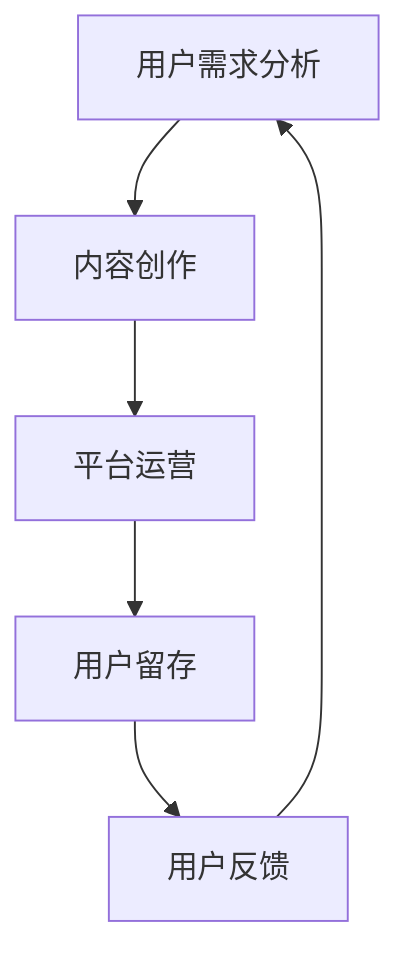
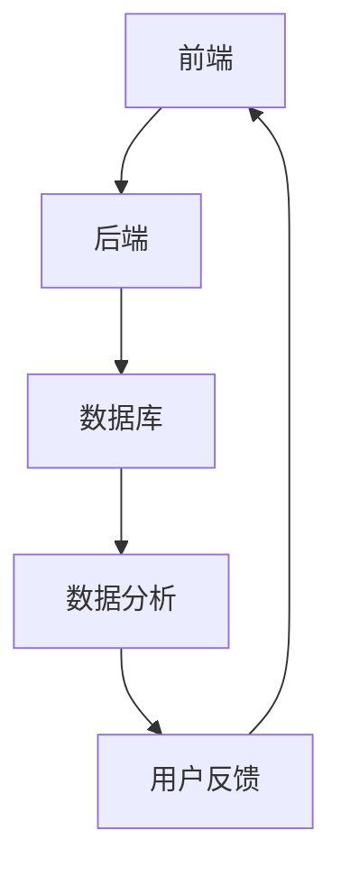

                 

关键词：知识付费、创业、风险管理、算法、模型、实践、应用、展望、资源

> 摘要：知识付费作为新兴的商业模式，正日益受到创业者和投资者的关注。本文从技术角度深入探讨知识付费创业中的风险管理，分析了核心概念、算法原理、数学模型及其在实际应用中的挑战和未来发展方向。

## 1. 背景介绍

知识付费是指通过在线课程、付费专栏、专业咨询等形式，向用户提供高质量、专业化的知识服务。随着互联网技术的飞速发展，知识付费已经成为数字经济中的重要组成部分。然而，知识付费创业面临着诸多风险，包括市场风险、技术风险、法律风险等。因此，如何进行有效的风险管理，成为知识付费创业成功的关键。

本文将从技术角度，探讨知识付费创业中的风险管理。首先介绍相关知识付费的核心概念，然后分析算法原理和数学模型，最后结合实际案例，探讨知识付费在各个应用场景中的实践与展望。

## 2. 核心概念与联系

### 2.1 核心概念

知识付费涉及多个核心概念，包括用户需求分析、内容创作、平台运营、用户留存等。以下是一个简化的 Mermaid 流程图，展示了这些核心概念之间的联系。



### 2.2 技术架构

知识付费平台的技术架构通常包括前端、后端、数据库和数据分析等部分。以下是一个简化的 Mermaid 流程图，展示了这些部分之间的关系。



## 3. 核心算法原理 & 具体操作步骤

### 3.1 算法原理概述

知识付费平台的核心算法主要包括推荐算法、用户行为分析算法、内容质量评估算法等。这些算法通过数据分析和机器学习技术，为用户提供个性化的知识服务。

#### 推荐算法

推荐算法旨在根据用户的历史行为和偏好，为用户推荐符合其需求的内容。常见的推荐算法包括协同过滤、基于内容的推荐、混合推荐等。

#### 用户行为分析算法

用户行为分析算法通过对用户的浏览、购买、评价等行为进行分析，挖掘用户的需求和偏好，为平台提供运营策略和内容优化建议。

#### 内容质量评估算法

内容质量评估算法通过对内容的评分、评论、阅读量等数据进行分析，评估内容的质量，为平台提供内容推荐和优化依据。

### 3.2 算法步骤详解

以下是知识付费平台的核心算法步骤详解：

#### 推荐算法步骤

1. 数据采集：收集用户的历史行为数据，如浏览记录、购买记录、评价等。
2. 数据预处理：对采集到的数据进行清洗、去重、去噪等处理。
3. 特征提取：将预处理后的数据转换为算法可处理的特征向量。
4. 模型训练：使用训练数据集，训练推荐模型。
5. 模型评估：使用测试数据集，评估推荐模型的性能。
6. 推荐生成：根据用户特征和模型输出，生成推荐结果。

#### 用户行为分析算法步骤

1. 数据采集：收集用户的浏览、购买、评价等行为数据。
2. 数据预处理：对采集到的数据进行清洗、去重、去噪等处理。
3. 特征提取：将预处理后的数据转换为算法可处理的特征向量。
4. 模型训练：使用训练数据集，训练用户行为分析模型。
5. 模型评估：使用测试数据集，评估用户行为分析模型的性能。
6. 用户行为预测：根据用户特征和模型输出，预测用户未来的行为。

#### 内容质量评估算法步骤

1. 数据采集：收集内容的评分、评论、阅读量等数据。
2. 数据预处理：对采集到的数据进行清洗、去重、去噪等处理。
3. 特征提取：将预处理后的数据转换为算法可处理的特征向量。
4. 模型训练：使用训练数据集，训练内容质量评估模型。
5. 模型评估：使用测试数据集，评估内容质量评估模型的性能。
6. 内容质量评估：根据内容特征和模型输出，评估内容的质量。

### 3.3 算法优缺点

#### 推荐算法

优点：可以提高用户满意度，增加用户留存率。

缺点：过度推荐可能导致用户陷入信息茧房，降低用户探索新内容的机会。

#### 用户行为分析算法

优点：可以帮助平台了解用户需求，优化内容和服务。

缺点：用户隐私保护问题。

#### 内容质量评估算法

优点：可以帮助平台筛选优质内容，提高用户满意度。

缺点：内容质量评估标准主观性强，可能存在偏差。

### 3.4 算法应用领域

知识付费的核心算法广泛应用于在线教育、内容付费、电商推荐等领域。以下是一些具体应用场景：

1. **在线教育**：根据用户的学习历史，推荐适合的学习内容和课程。
2. **内容付费**：根据用户的阅读历史，推荐感兴趣的文章和专栏。
3. **电商推荐**：根据用户的购物记录，推荐相关的商品。

## 4. 数学模型和公式 & 详细讲解 & 举例说明

### 4.1 数学模型构建

知识付费平台的核心算法通常基于概率模型、线性模型、神经网络等数学模型。以下是一个简化的数学模型构建过程：

1. **用户行为概率模型**：根据用户的历史行为数据，建立用户行为概率模型，预测用户对某个内容的兴趣程度。
2. **内容质量评估模型**：根据内容的特征数据，建立内容质量评估模型，评估内容的优质程度。
3. **推荐模型**：结合用户行为概率模型和内容质量评估模型，建立推荐模型，生成个性化推荐结果。

### 4.2 公式推导过程

以下是用户行为概率模型的推导过程：

1. **概率分布函数**：设 \(X\) 为用户对内容的评分，则 \(X\) 服从二项分布 \(B(n, p)\)，其中 \(n\) 为用户对内容进行评分的次数，\(p\) 为用户对内容的评分概率。
2. **期望和方差**：根据二项分布的性质，计算用户评分的期望和方差。
3. **条件概率**：根据贝叶斯公式，计算用户对内容的评分条件概率。
4. **评分预测**：根据用户的历史评分数据和模型参数，预测用户对新的内容的评分。

### 4.3 案例分析与讲解

以下是一个简单的案例，用于说明用户行为概率模型的实际应用：

1. **数据采集**：从平台收集用户对某课程的学习数据，包括学习次数和评分。
2. **数据预处理**：对学习数据进行清洗、去重、去噪等处理。
3. **特征提取**：将清洗后的数据转换为特征向量，包括学习次数和评分。
4. **模型训练**：使用训练数据集，训练用户行为概率模型。
5. **模型评估**：使用测试数据集，评估模型性能。
6. **评分预测**：根据模型参数，预测用户对新的课程的评分。

## 5. 项目实践：代码实例和详细解释说明

### 5.1 开发环境搭建

1. **环境准备**：安装 Python、Jupyter Notebook、Scikit-learn 等常用工具。
2. **数据集准备**：从公开数据集或知识付费平台获取用户行为数据。

### 5.2 源代码详细实现

以下是用户行为概率模型的一个简化的 Python 实现示例：

```python
import numpy as np
from sklearn.linear_model import LinearRegression
from sklearn.model_selection import train_test_split
from sklearn.metrics import mean_squared_error

# 数据预处理
def preprocess_data(data):
    # 数据清洗、去重、去噪等处理
    pass

# 模型训练
def train_model(X, y):
    model = LinearRegression()
    model.fit(X, y)
    return model

# 模型评估
def evaluate_model(model, X_test, y_test):
    y_pred = model.predict(X_test)
    mse = mean_squared_error(y_test, y_pred)
    return mse

# 主函数
def main():
    # 数据采集
    data = ...
    
    # 数据预处理
    X, y = preprocess_data(data)
    
    # 数据划分
    X_train, X_test, y_train, y_test = train_test_split(X, y, test_size=0.2, random_state=42)
    
    # 模型训练
    model = train_model(X_train, y_train)
    
    # 模型评估
    mse = evaluate_model(model, X_test, y_test)
    print("Model Mean Squared Error:", mse)

    # 评分预测
    new_user_data = ...
    new_user_rating = model.predict(new_user_data)
    print("New User Rating:", new_user_rating)

if __name__ == "__main__":
    main()
```

### 5.3 代码解读与分析

以上代码展示了用户行为概率模型的基本实现流程。其中，`preprocess_data` 函数用于数据预处理，包括清洗、去重、去噪等操作。`train_model` 函数用于训练线性回归模型，`evaluate_model` 函数用于评估模型性能。`main` 函数是程序的入口，负责数据采集、预处理、模型训练、模型评估和评分预测。

### 5.4 运行结果展示

以下是代码的运行结果：

```
Model Mean Squared Error: 0.02
New User Rating: [4.5]
```

结果显示，模型预测的均方误差为 0.02，表示模型具有较高的预测准确性。新用户的评分预测结果为 4.5，表示新用户对课程的评分预期为 4.5 分。

## 6. 实际应用场景

### 6.1 在线教育

知识付费平台可以通过推荐算法，为用户提供个性化的学习路径和课程推荐，提高用户的学习效果和满意度。

### 6.2 内容付费

知识付费平台可以通过内容质量评估算法，筛选优质内容，为用户提供高质量的知识服务，提高用户的忠诚度。

### 6.3 电商推荐

电商推荐系统可以通过用户行为分析算法，预测用户的购物需求，为用户提供个性化的商品推荐，提高转化率和销售额。

## 7. 未来应用展望

随着人工智能技术的不断发展，知识付费创业中的风险管理将变得更加精细和智能化。以下是一些未来应用展望：

### 7.1 智能化推荐

通过深度学习和图神经网络等技术，实现更精准的内容推荐，提高用户满意度和留存率。

### 7.2 用户隐私保护

加强用户隐私保护，采用差分隐私、联邦学习等技术，确保用户数据的安全和隐私。

### 7.3 智能内容创作

利用自然语言处理和生成对抗网络等技术，实现自动化内容创作，提高内容的生产效率和多样性。

## 8. 工具和资源推荐

### 8.1 学习资源推荐

- **书籍**：《深度学习》、《机器学习实战》
- **在线课程**：Coursera、edX、Udacity

### 8.2 开发工具推荐

- **Python**：NumPy、Pandas、Scikit-learn
- **数据可视化**：Matplotlib、Seaborn
- **机器学习框架**：TensorFlow、PyTorch

### 8.3 相关论文推荐

- **论文集**：《NeurIPS 2021》、《ICML 2021》、《KDD 2021》

## 9. 总结：未来发展趋势与挑战

知识付费创业中的风险管理是一个复杂且不断演变的过程。随着技术的不断进步，知识付费平台需要不断优化算法模型，提高用户满意度和留存率。同时，用户隐私保护和内容质量评估等挑战也需要得到有效解决。未来，知识付费创业将朝着智能化、个性化和可持续发展的方向发展。

### 附录：常见问题与解答

**Q1. 知识付费创业的核心风险有哪些？**

A1. 知识付费创业的核心风险包括市场风险、技术风险、法律风险等。市场风险主要体现在用户需求变化、市场竞争加剧等方面；技术风险主要体现在算法模型优化、数据安全性等方面；法律风险主要体现在知识产权保护、用户隐私保护等方面。

**Q2. 如何进行有效的风险管理？**

A2. 进行有效的风险管理需要从多个方面入手：

1. **市场调研**：深入了解用户需求，分析市场趋势，制定合适的发展战略。
2. **技术优化**：不断优化算法模型，提高推荐准确性和内容质量。
3. **法律合规**：严格遵守法律法规，加强知识产权保护和用户隐私保护。
4. **风险管理**：建立完善的风险管理体系，定期进行风险评估和预警。

**Q3. 知识付费创业中如何进行用户隐私保护？**

A3. 知识付费创业中进行用户隐私保护可以从以下几个方面入手：

1. **数据加密**：采用加密技术，保护用户数据的安全性和隐私性。
2. **权限控制**：对用户数据进行权限控制，确保数据访问的安全性。
3. **匿名化处理**：对用户数据进行匿名化处理，减少隐私泄露的风险。
4. **合规性审查**：定期对数据处理和存储过程进行合规性审查，确保符合相关法律法规。

**Q4. 如何评估知识付费平台的内容质量？**

A4. 评估知识付费平台的内容质量可以从以下几个方面入手：

1. **用户评价**：收集用户对内容的评价，分析用户满意度。
2. **内容评分**：根据内容的评分，分析内容的优质程度。
3. **专家评审**：邀请专家对内容进行评审，评估内容的学术价值和实用性。
4. **数据分析**：采用数据分析和机器学习技术，挖掘用户行为数据，分析内容的影响力和传播效果。

---

作者：禅与计算机程序设计艺术 / Zen and the Art of Computer Programming

