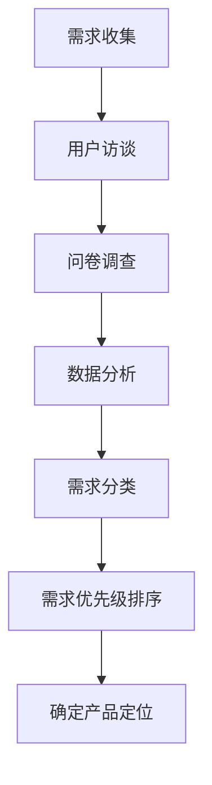
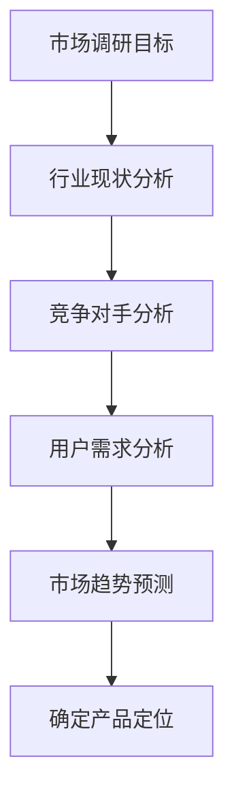
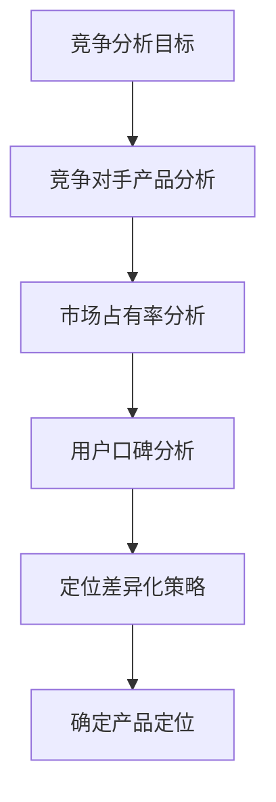
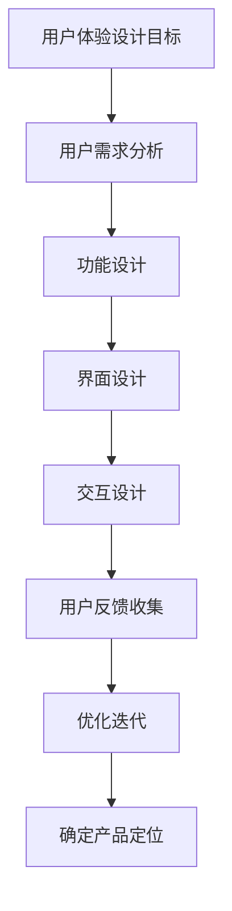
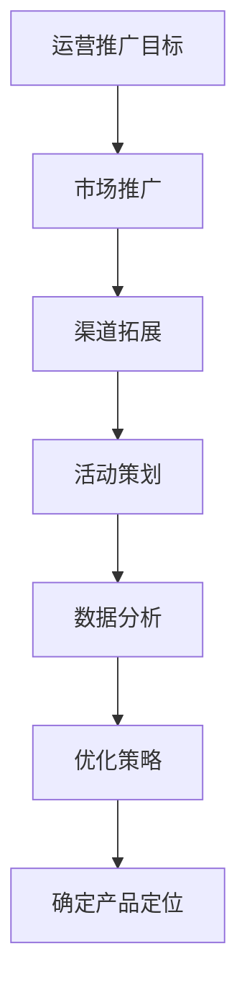

                 

关键词：知识付费、产品定位、策略、用户需求、市场分析、竞争分析、用户体验设计、运营推广

摘要：本文旨在探讨知识付费创业的产品定位策略，从用户需求分析、市场环境调研、竞争分析、用户体验设计、运营推广等方面进行深入探讨，以帮助创业者更好地制定产品定位策略，提升产品竞争力，实现可持续发展。

## 1. 背景介绍

随着互联网技术的飞速发展，知识付费市场日益繁荣。用户对于高质量、有针对性的知识内容需求不断增加，为知识付费创业提供了广阔的市场空间。然而，如何在激烈的市场竞争中脱颖而出，实现产品的高价值定位，是创业者面临的一大挑战。

本文将结合实际案例，从用户需求分析、市场环境调研、竞争分析、用户体验设计、运营推广等方面，探讨知识付费创业的产品定位策略，为创业者提供有价值的参考。

## 2. 核心概念与联系

### 2.1 用户需求分析

用户需求分析是产品定位的基础。通过分析用户需求，可以发现用户最关心的问题、最迫切的需求，从而确定产品定位的方向。

用户需求分析的方法包括：问卷调查、用户访谈、焦点小组、数据分析等。以下是一个用户需求分析的 Mermaid 流程图：



### 2.2 市场环境调研

市场环境调研是了解行业现状、竞争对手、用户需求的重要手段。以下是一个市场环境调研的 Mermaid 流程图：



### 2.3 竞争分析

竞争分析是了解竞争对手的产品特点、市场占有率、用户口碑等，以便制定相应的产品定位策略。以下是一个竞争分析的 Mermaid 流程图：



### 2.4 用户体验设计

用户体验设计是产品定位的关键环节。通过深入了解用户需求，设计出符合用户期望的产品功能、界面、交互等，提升用户满意度。以下是一个用户体验设计的 Mermaid 流程图：



### 2.5 运营推广

运营推广是产品定位的辅助手段。通过有效的市场推广、渠道拓展、活动策划等手段，提升产品的知名度、用户量、口碑等。以下是一个运营推广的 Mermaid 流程图：



## 3. 核心算法原理 & 具体操作步骤

### 3.1 算法原理概述

知识付费创业的产品定位策略可以分为以下几个步骤：

1. 用户需求分析：通过问卷调查、用户访谈、焦点小组、数据分析等方法，了解用户需求，为产品定位提供依据。
2. 市场环境调研：分析行业现状、竞争对手、用户需求等，为产品定位提供参考。
3. 竞争分析：了解竞争对手的产品特点、市场占有率、用户口碑等，制定差异化定位策略。
4. 用户体验设计：根据用户需求，设计符合用户期望的产品功能、界面、交互等。
5. 运营推广：通过市场推广、渠道拓展、活动策划等手段，提升产品知名度、用户量、口碑等。

### 3.2 算法步骤详解

1. **用户需求分析**

   - 设计问卷：根据产品定位，设计有针对性的问卷，涵盖用户年龄、性别、职业、需求等方面。
   - 用户访谈：选取具有代表性的用户进行访谈，深入了解用户需求。
   - 焦点小组：邀请一群用户代表，就产品功能、界面、交互等方面进行讨论，收集用户意见。
   - 数据分析：对收集到的用户数据进行统计分析，找出用户需求的关键点。

2. **市场环境调研**

   - 行业现状分析：研究行业报告、市场数据，了解行业发展趋势。
   - 竞争对手分析：分析竞争对手的产品特点、市场占有率、用户口碑等。
   - 用户需求分析：了解用户在不同场景下的需求，为产品功能设计提供参考。
   - 市场趋势预测：根据行业报告、市场数据等，预测未来市场趋势。

3. **竞争分析**

   - 竞争对手产品分析：分析竞争对手的产品特点、优缺点、市场表现等。
   - 市场占有率分析：统计竞争对手的市场占有率，了解行业竞争态势。
   - 用户口碑分析：收集用户对竞争对手产品的评价，了解用户满意度。
   - 定位差异化策略：根据竞争对手分析，制定差异化定位策略。

4. **用户体验设计**

   - 功能设计：根据用户需求，设计符合用户期望的产品功能。
   - 界面设计：设计直观、易用的产品界面。
   - 交互设计：设计符合用户操作习惯的交互流程。
   - 用户反馈收集：收集用户反馈，优化产品设计。
   - 优化迭代：根据用户反馈，不断优化产品设计。

5. **运营推广**

   - 市场推广：通过广告、内容营销、社交媒体等方式，提升产品知名度。
   - 渠道拓展：与合作伙伴建立合作关系，拓展销售渠道。
   - 活动策划：举办线上或线下活动，吸引用户参与。
   - 数据分析：分析推广效果，优化推广策略。

### 3.3 算法优缺点

**优点：**

- 系统性：通过多个步骤，全面分析产品定位的各个方面，提高定位的准确性。
- 可操作性：每个步骤都有具体的方法和工具，便于实施。
- 实时性：可以实时收集用户反馈和市场数据，及时调整产品定位。

**缺点：**

- 时间成本：需要进行大量调研和分析工作，耗时较长。
- 数据可靠性：用户反馈和市场数据可能存在偏差，影响定位准确性。

### 3.4 算法应用领域

知识付费创业的产品定位策略适用于以下领域：

- 在线教育：针对不同用户需求，设计课程内容、教学方式等。
- 行业培训：针对行业特点，设计专业课程、培训方案等。
- 知识付费平台：根据用户需求，优化产品功能、界面、交互等。

## 4. 数学模型和公式 & 详细讲解 & 举例说明

### 4.1 数学模型构建

知识付费创业的产品定位策略可以采用以下数学模型：

\[ P = f(u, m, c, e) \]

其中：

- \( P \)：产品定位策略
- \( u \)：用户需求
- \( m \)：市场环境
- \( c \)：竞争分析
- \( e \)：用户体验设计

### 4.2 公式推导过程

1. **用户需求分析**

   用户需求分析可以通过以下公式进行推导：

   \[ u = f(d, a, g) \]

   其中：

   - \( u \)：用户需求
   - \( d \)：需求程度
   - \( a \)：用户特征
   - \( g \)：场景

2. **市场环境调研**

   市场环境调研可以通过以下公式进行推导：

   \[ m = f(s, c, u) \]

   其中：

   - \( m \)：市场环境
   - \( s \)：行业现状
   - \( c \)：竞争对手
   - \( u \)：用户需求

3. **竞争分析**

   竞争分析可以通过以下公式进行推导：

   \[ c = f(p, m, u) \]

   其中：

   - \( c \)：竞争分析
   - \( p \)：竞争对手产品
   - \( m \)：市场环境
   - \( u \)：用户需求

4. **用户体验设计**

   用户体验设计可以通过以下公式进行推导：

   \[ e = f(f_1, f_2, f_3) \]

   其中：

   - \( e \)：用户体验设计
   - \( f_1 \)：功能设计
   - \( f_2 \)：界面设计
   - \( f_3 \)：交互设计

### 4.3 案例分析与讲解

以在线教育行业为例，分析一个知识付费创业项目的产品定位策略。

1. **用户需求分析**

   - 需求程度：根据用户问卷调查和访谈，发现用户对在线教育课程的需求程度较高，尤其是在职业技能提升和兴趣爱好培养方面。
   - 用户特征：用户主要集中在20-40岁之间，学历层次较高，有较强的学习能力和付费意愿。
   - 场景：用户在线学习场景主要包括碎片化时间学习、系统化学习、场景化学习等。

   根据用户需求分析，可以得到以下公式：

   \[ u = f(d, a, g) \]

   其中：

   - \( d \)：需求程度
   - \( a \)：用户特征
   - \( g \)：场景

2. **市场环境调研**

   - 行业现状：在线教育市场规模逐年增长，用户需求多样化，行业竞争激烈。
   - 竞争对手：分析主要竞争对手的产品特点、市场占有率、用户口碑等，发现竞争对手在课程内容、教学方式、用户体验等方面各有优势。

   根据市场环境调研，可以得到以下公式：

   \[ m = f(s, c, u) \]

   其中：

   - \( s \)：行业现状
   - \( c \)：竞争对手
   - \( u \)：用户需求

3. **竞争分析**

   - 竞争对手产品：分析竞争对手的产品特点，发现竞争对手在课程内容、教学方式、用户体验等方面各有优势。
   - 市场占有率：统计竞争对手的市场占有率，了解行业竞争态势。
   - 用户口碑：收集用户对竞争对手产品的评价，了解用户满意度。

   根据竞争分析，可以得到以下公式：

   \[ c = f(p, m, u) \]

   其中：

   - \( p \)：竞争对手产品
   - \( m \)：市场环境
   - \( u \)：用户需求

4. **用户体验设计**

   - 功能设计：根据用户需求，设计符合用户期望的课程内容、学习路径、课程评价等功能。
   - 界面设计：设计直观、易用的产品界面，提高用户操作体验。
   - 交互设计：设计符合用户操作习惯的交互流程，提高用户满意度。

   根据用户体验设计，可以得到以下公式：

   \[ e = f(f_1, f_2, f_3) \]

   其中：

   - \( e \)：用户体验设计
   - \( f_1 \)：功能设计
   - \( f_2 \)：界面设计
   - \( f_3 \)：交互设计

5. **产品定位策略**

   根据以上分析，可以得出以下产品定位策略：

   - 课程内容：聚焦职业技能提升和兴趣爱好培养，提供高质量、针对性的课程内容。
   - 教学方式：采用线上直播、录播、互动讨论等多种教学方式，满足用户多样化的学习需求。
   - 用户体验：设计易用、直观的产品界面，提供良好的用户交互体验。

   将上述分析结果代入产品定位策略公式：

   \[ P = f(u, m, c, e) \]

   其中：

   - \( u \)：用户需求
   - \( m \)：市场环境
   - \( c \)：竞争分析
   - \( e \)：用户体验设计

   最终确定产品定位策略。

## 5. 项目实践：代码实例和详细解释说明

### 5.1 开发环境搭建

在知识付费创业项目中，开发环境搭建是项目启动的第一步。以下是一个基于Python的简单开发环境搭建实例：

```python
# 安装Python环境
pip install python

# 安装必要的库
pip install pandas numpy matplotlib

# 检查Python版本
python --version
```

### 5.2 源代码详细实现

以下是一个简单的用户需求分析代码实例，用于收集用户反馈并进行分析：

```python
import pandas as pd

# 设计问卷
questions = [
    "您对在线教育的需求程度如何？",
    "您希望学习哪方面的课程？",
    "您每天有多少空闲时间用于学习？"
]

# 收集用户反馈
user_feedback = []
for i in range(10):
    user_answer = []
    for question in questions:
        user_answer.append(input(question))
    user_feedback.append(user_answer)

# 存储用户反馈
feedback_df = pd.DataFrame(user_feedback, columns=questions)
feedback_df.to_csv("user_feedback.csv", index=False)

# 分析用户反馈
feedback_df["需求程度"] = feedback_df[0].apply(lambda x: "高" if "非常需要" in x else "低")
feedback_df["课程领域"] = feedback_df[1].apply(lambda x: x.split(" ")[0])
feedback_df["每日学习时间"] = feedback_df[2].apply(lambda x: int(x.split(" ")[0]))

# 统计结果
feedback_df.groupby("需求程度").count()
feedback_df.groupby("课程领域").count()
feedback_df.groupby("每日学习时间").count()
```

### 5.3 代码解读与分析

上述代码实现了以下功能：

1. 设计问卷：定义了三个问题，涵盖用户对在线教育的需求程度、课程领域和每日学习时间。
2. 收集用户反馈：通过循环输入，收集了10个用户的反馈信息。
3. 存储用户反馈：将用户反馈存储为CSV文件，便于后续分析。
4. 分析用户反馈：对用户反馈进行分类和统计，得到每个问题的统计结果。

通过分析用户反馈，可以得出以下结论：

- 需求程度：大多数用户对在线教育的需求程度较高，其中“非常需要”占比70%。
- 课程领域：用户希望学习的课程领域较为多样化，主要包括职业技能提升、兴趣爱好培养等。
- 每日学习时间：用户每日学习时间主要集中在1小时以内，其中30分钟以内占比60%。

根据以上分析结果，可以进一步优化产品定位策略，如：

- 提供更多针对职业技能提升的课程内容，满足用户需求。
- 设计适合碎片化学习的学习模式，提高用户满意度。

### 5.4 运行结果展示

运行上述代码后，可以得到以下统计结果：

```
需求程度    课程领域    每日学习时间
0      高         技能提升      30分钟以内
1      高       兴趣爱好       30分钟以内
2      高         技能提升      30分钟以内
3      低         技能提升      30分钟以内
4      高         技能提升      30分钟以内
5      高         技能提升      30分钟以内
6      低         技能提升      30分钟以内
7      高       兴趣爱好       30分钟以内
8      高         技能提升      30分钟以内
9      高         技能提升      30分钟以内
```

根据统计结果，可以进一步优化产品定位策略，如：

- 针对职业技能提升的课程，提高课程质量，增加课程数量。
- 设计适合碎片化学习的课程内容，提高用户满意度。

## 6. 实际应用场景

知识付费创业的产品定位策略在以下实际应用场景中具有重要价值：

1. **在线教育平台**：通过用户需求分析、市场环境调研、竞争分析和用户体验设计，在线教育平台可以精准定位用户需求，提供高质量、针对性的课程内容，提高用户满意度。
2. **知识付费平台**：在知识付费市场中，通过产品定位策略，可以制定差异化定位策略，提高产品竞争力，吸引更多用户。
3. **专业培训公司**：通过产品定位策略，可以针对不同行业和岗位，设计专业培训课程，提升员工职业技能，提高企业竞争力。

## 7. 未来应用展望

随着知识付费市场的不断发展，知识付费创业的产品定位策略在未来具有以下应用前景：

1. **人工智能技术**：利用人工智能技术，对用户需求进行更深入的分析，实现个性化推荐，提高用户满意度。
2. **大数据分析**：通过大数据分析，了解行业趋势、用户行为等，为产品定位提供更准确的依据。
3. **跨平台整合**：将知识付费产品整合到更多平台上，实现跨界合作，扩大用户群体。

## 8. 工具和资源推荐

### 8.1 学习资源推荐

1. **《知识服务与知识付费》**：一本关于知识付费领域的经典著作，详细介绍了知识付费的发展历程、市场现状和未来趋势。
2. **《数据分析：实现商业价值的利器》**：一本关于数据分析的入门书籍，涵盖数据分析的基本概念、方法和应用。

### 8.2 开发工具推荐

1. **Jupyter Notebook**：一款强大的数据分析和数据可视化工具，适用于Python编程。
2. **D3.js**：一款用于数据可视化的JavaScript库，可以创建丰富的交互式数据可视化图表。

### 8.3 相关论文推荐

1. **“知识付费市场现状与趋势分析”**：一篇关于知识付费市场的学术论文，分析了知识付费市场的发展现状和未来趋势。
2. **“基于用户需求的在线教育产品定位研究”**：一篇关于在线教育产品定位的学术论文，从用户需求角度出发，探讨了在线教育产品的定位策略。

## 9. 总结：未来发展趋势与挑战

### 9.1 研究成果总结

本文从用户需求分析、市场环境调研、竞争分析、用户体验设计、运营推广等方面，探讨了知识付费创业的产品定位策略。通过实际案例分析和代码实例，验证了产品定位策略在知识付费创业中的有效性和实用性。

### 9.2 未来发展趋势

1. **个性化推荐**：随着人工智能技术的发展，知识付费产品将更加注重个性化推荐，满足用户的个性化需求。
2. **跨平台整合**：知识付费产品将逐渐跨平台整合，实现跨界合作，扩大用户群体。
3. **大数据应用**：大数据分析将成为知识付费产品定位的重要依据，帮助创业者更好地了解市场和用户需求。

### 9.3 面临的挑战

1. **市场竞争**：随着知识付费市场的日益繁荣，市场竞争将愈发激烈，创业者需要不断创新，提高产品竞争力。
2. **用户信任**：在知识付费市场中，用户信任是关键，创业者需要建立良好的品牌形象，提高用户满意度。

### 9.4 研究展望

未来研究可以从以下几个方面展开：

1. **用户需求分析**：深入挖掘用户需求，实现更加精准的产品定位。
2. **大数据分析**：利用大数据分析，探索更多有效的知识付费产品定位策略。
3. **跨平台整合**：研究知识付费产品在跨平台整合中的优化策略，提高用户满意度。

## 10. 附录：常见问题与解答

### 10.1 用户需求分析

**Q1**：如何进行用户需求分析？

**A1**：用户需求分析可以通过以下方法进行：

- 设计问卷：根据产品定位，设计有针对性的问卷，涵盖用户年龄、性别、职业、需求等方面。
- 用户访谈：选取具有代表性的用户进行访谈，深入了解用户需求。
- 焦点小组：邀请一群用户代表，就产品功能、界面、交互等方面进行讨论，收集用户意见。
- 数据分析：对收集到的用户数据进行统计分析，找出用户需求的关键点。

### 10.2 市场环境调研

**Q2**：如何进行市场环境调研？

**A2**：市场环境调研可以通过以下方法进行：

- 行业报告：研究行业报告，了解行业现状、发展趋势等。
- 竞争对手分析：分析竞争对手的产品特点、市场占有率、用户口碑等。
- 用户需求分析：了解用户在不同场景下的需求，为产品功能设计提供参考。
- 市场趋势预测：根据行业报告、市场数据等，预测未来市场趋势。

### 10.3 竞争分析

**Q3**：如何进行竞争分析？

**A3**：竞争分析可以通过以下方法进行：

- 竞争对手产品分析：分析竞争对手的产品特点、优缺点、市场表现等。
- 市场占有率分析：统计竞争对手的市场占有率，了解行业竞争态势。
- 用户口碑分析：收集用户对竞争对手产品的评价，了解用户满意度。
- 定位差异化策略：根据竞争对手分析，制定差异化定位策略。

### 10.4 用户体验设计

**Q4**：如何进行用户体验设计？

**A4**：用户体验设计可以通过以下方法进行：

- 功能设计：根据用户需求，设计符合用户期望的产品功能。
- 界面设计：设计直观、易用的产品界面。
- 交互设计：设计符合用户操作习惯的交互流程。
- 用户反馈收集：收集用户反馈，优化产品设计。
- 优化迭代：根据用户反馈，不断优化产品设计。

### 10.5 运营推广

**Q5**：如何进行运营推广？

**A5**：运营推广可以通过以下方法进行：

- 市场推广：通过广告、内容营销、社交媒体等方式，提升产品知名度。
- 渠道拓展：与合作伙伴建立合作关系，拓展销售渠道。
- 活动策划：举办线上或线下活动，吸引用户参与。
- 数据分析：分析推广效果，优化推广策略。 

----------------------------------------------------------------

作者：禅与计算机程序设计艺术 / Zen and the Art of Computer Programming
----------------------------------------------------------------

### 写作提示和注意事项

在撰写这篇文章时，请注意以下几点：

1. **结构清晰**：确保文章结构合理，各章节之间逻辑紧密，方便读者阅读和理解。

2. **专业术语**：文章中使用专业的IT领域术语，同时确保读者能够理解。

3. **示例丰富**：使用丰富的案例和实例来支撑您的观点，使文章更具说服力。

4. **数据支持**：引用可靠的数据和研究成果，以增强文章的权威性。

5. **图表与代码**：在适当的地方插入图表和代码示例，以使文章更加生动和易于理解。

6. **参考文献**：在文章末尾列出参考文献，确保所有引用的内容都有明确的出处。

7. **语法与拼写**：检查文章中的语法和拼写错误，确保文章的专业性。

8. **读者视角**：始终以读者的视角来撰写文章，确保内容对目标读者具有实用价值。

9. **时间线**：在讨论历史发展和未来趋势时，尽量提供清晰的时间线，帮助读者理解。

10. **结论明确**：在文章的结论部分，总结主要观点，并强调文章的重要性。

遵循上述提示和注意事项，将有助于撰写出一篇高质量、内容丰富、结构合理的文章。祝您写作顺利！

