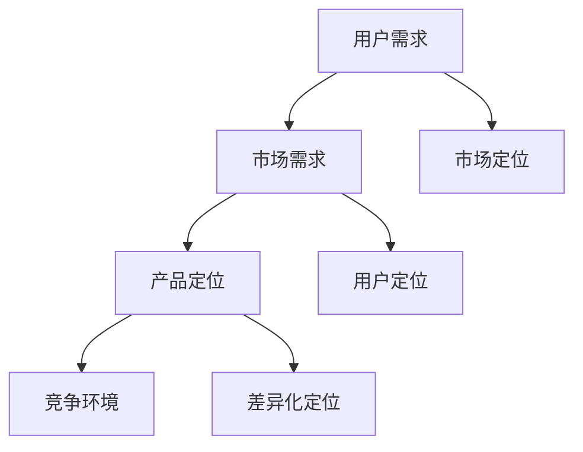

                 

关键词：知识付费、创业、产品定位、用户需求、市场分析、战略规划

> 摘要：本文将探讨知识付费创业中的产品定位策略，分析如何根据用户需求和市场需求来确立产品定位，并提供实用的方法与工具，以帮助创业者更好地制定产品定位策略，确保产品的市场竞争力。

## 1. 背景介绍

随着互联网的普及和知识经济的兴起，知识付费逐渐成为了一种新的商业模式。知识付费是指用户通过支付一定费用获取有价值的信息、知识或服务。这种模式在教育培训、在线咨询、专业技能培训等领域得到了广泛应用。创业者在知识付费领域的机会与挑战并存，如何通过有效的产品定位策略，在竞争激烈的市场中脱颖而出，成为了关键问题。

本文将围绕以下问题展开讨论：

- 如何确定知识付费产品的市场定位？
- 如何分析用户需求，以满足市场需求？
- 如何通过产品定位策略提高产品的市场竞争力？
- 知识付费产品的未来发展有哪些趋势和挑战？

## 2. 核心概念与联系

在探讨知识付费创业的产品定位策略之前，我们需要了解几个核心概念，并分析它们之间的联系。

### 2.1 用户需求

用户需求是指用户在特定情境下，对某一产品或服务的需求。在知识付费创业中，了解用户需求至关重要，因为它决定了产品的定位和市场定位。

### 2.2 市场需求

市场需求是指市场上整体用户对某一产品或服务的需求。了解市场需求可以帮助创业者把握市场趋势，制定更有效的产品定位策略。

### 2.3 产品定位

产品定位是指企业在市场中的产品或品牌所占据的位置，以及消费者对产品或品牌在心目中的印象。在知识付费创业中，产品定位决定了产品的市场定位和用户定位。

### 2.4 竞争环境

竞争环境是指企业所在行业中的竞争对手及其产品定位。分析竞争环境可以帮助创业者找到市场空隙，制定差异化的产品定位策略。

### 2.5 Mermaid 流程图

以下是一个关于知识付费创业产品定位策略的 Mermaid 流程图，展示了核心概念之间的联系：



## 3. 核心算法原理 & 具体操作步骤

### 3.1 算法原理概述

知识付费创业的产品定位策略可以归纳为以下几个步骤：

1. 用户需求分析：通过调查、访谈等方法收集用户需求，建立用户画像。
2. 市场需求分析：分析市场趋势、竞争对手、潜在用户群体等，确定市场需求。
3. 产品定位制定：根据用户需求和市场需求，确定产品的核心价值和差异化定位。
4. 竞争环境分析：评估竞争对手的产品定位，找到市场空隙。
5. 市场定位和用户定位：根据产品定位和竞争环境，确定市场定位和用户定位。

### 3.2 算法步骤详解

#### 3.2.1 用户需求分析

1. 调查问卷：设计包含用户基本信息、兴趣爱好、需求场景等问题的调查问卷。
2. 访谈调研：与目标用户进行深度访谈，了解他们的需求和痛点。
3. 数据分析：收集调查问卷和访谈数据，运用数据挖掘和分析技术，建立用户画像。

#### 3.2.2 市场需求分析

1. 市场调研：收集行业报告、市场趋势、竞争对手等信息。
2. SWOT 分析：分析企业的优势、劣势、机会和威胁。
3. 市场细分：根据用户需求和市场特点，对市场进行细分。

#### 3.2.3 产品定位制定

1. 核心价值定位：根据用户需求和市场需求，确定产品的核心价值。
2. 差异化定位：分析竞争对手的产品定位，找到差异化的市场空隙。
3. 品牌定位：确定产品的品牌形象和传播策略。

#### 3.2.4 竞争环境分析

1. 竞品分析：收集竞争对手的产品信息，分析他们的产品特点、优势、不足等。
2. 市场占有率分析：分析竞争对手在市场中的地位和占有率。
3. 竞争策略分析：根据竞品分析和市场占有率分析，制定相应的竞争策略。

#### 3.2.5 市场定位和用户定位

1. 市场定位：根据产品定位和竞争环境，确定产品在市场中的定位。
2. 用户定位：根据用户需求和市场需求，确定目标用户群体。

### 3.3 算法优缺点

#### 优点：

1. 有助于明确产品定位，提高市场竞争力。
2. 有助于发现市场需求和用户需求，提供更好的产品和服务。
3. 有助于分析竞争环境，制定有效的竞争策略。

#### 缺点：

1. 分析过程较为复杂，需要耗费大量时间和精力。
2. 分析结果可能受到主观因素的影响，导致不准确。

### 3.4 算法应用领域

知识付费创业的产品定位策略可以应用于教育培训、在线咨询、专业技能培训等多个领域。以下是一个具体的应用案例：

#### 应用领域：教育培训

1. 用户需求分析：通过调查问卷和访谈，了解家长和学生在教育培训方面的需求，如课程内容、师资力量、学习效果等。
2. 市场需求分析：收集行业报告、市场趋势、竞争对手等信息，了解教育培训市场的现状和发展趋势。
3. 产品定位制定：根据用户需求和市场需求，确定教育培训产品的核心价值，如优质师资、个性化教学、学习效果保障等。
4. 竞争环境分析：分析竞争对手的产品特点、优势、不足等，找到市场空隙，制定差异化的产品定位策略。
5. 市场定位和用户定位：根据产品定位和竞争环境，确定教育培训产品在市场中的定位，如高端精品课程、针对特定年龄段的教育培训等。

## 4. 数学模型和公式 & 详细讲解 & 举例说明

### 4.1 数学模型构建

在知识付费创业的产品定位策略中，我们可以运用以下数学模型进行分析：

#### 用户需求满意度模型

用户需求满意度 = （需求满足度 × 权重）/ 100

其中，需求满足度 = （需求满足指标 × 指标权重）/ 100

需求满足指标包括课程内容、师资力量、学习效果等，指标权重根据用户需求的重要性进行分配。

#### 市场需求模型

市场需求 = 用户需求 × 市场潜力

市场潜力 = 用户规模 × 用户消费能力

#### 产品定位模型

产品定位 = 用户需求满意度 × 市场需求 × 竞争环境

### 4.2 公式推导过程

#### 用户需求满意度公式推导

用户需求满意度是通过计算用户需求满足度来评估的。需求满足度是各需求满足指标的加权平均值。权重是根据用户需求的重要性进行分配的。因此，用户需求满意度可以表示为：

用户需求满意度 = （需求满足度 × 权重）/ 100

需求满足度 = （需求满足指标 × 指标权重）/ 100

#### 市场需求公式推导

市场需求是由用户需求和市场潜力共同决定的。市场潜力是由用户规模和用户消费能力决定的。因此，市场需求可以表示为：

市场需求 = 用户需求 × 市场潜力

市场潜力 = 用户规模 × 用户消费能力

#### 产品定位公式推导

产品定位是综合考虑用户需求满意度、市场需求和竞争环境来确定的。因此，产品定位可以表示为：

产品定位 = 用户需求满意度 × 市场需求 × 竞争环境

### 4.3 案例分析与讲解

#### 案例一：教育培训产品定位

假设一家教育培训公司，通过对用户需求分析、市场需求分析和竞争环境分析，得出以下数据：

1. 用户需求满意度：80%
2. 市场需求：5000万元
3. 竞争环境：竞争激烈，市场份额为20%

根据产品定位模型，我们可以计算出该公司教育培训产品的定位：

产品定位 = 用户需求满意度 × 市场需求 × 竞争环境

产品定位 = 80% × 5000万元 × 20% = 800万元

因此，该公司教育培训产品的市场定位为：专注于高端精品课程，针对特定年龄段的学生，以优质师资和个性化教学为特色，争取在竞争激烈的市场中占据20%的市场份额。

#### 案例二：在线咨询服务定位

假设一家在线咨询服务公司，通过对用户需求分析、市场需求分析和竞争环境分析，得出以下数据：

1. 用户需求满意度：70%
2. 市场需求：1亿元
3. 竞争环境：竞争激烈，市场份额为10%

根据产品定位模型，我们可以计算出该公司在线咨询服务产品的定位：

产品定位 = 用户需求满意度 × 市场需求 × 竞争环境

产品定位 = 70% × 1亿元 × 10% = 700万元

因此，该公司在线咨询服务产品的市场定位为：专注于提供专业、高效的在线咨询服务，以满足不同领域用户的需求，争取在竞争激烈的市场中占据10%的市场份额。

## 5. 项目实践：代码实例和详细解释说明

### 5.1 开发环境搭建

在本案例中，我们将使用 Python 编写一个简单的用户需求分析脚本。开发环境需要安装 Python 3.6 以上版本和 Jupyter Notebook。

### 5.2 源代码详细实现

以下是一个简单的用户需求分析脚本，用于计算用户需求满意度。

```python
import pandas as pd

# 用户需求数据
user需求的 DataFrame
data = pd.DataFrame({
    '用户ID': [1, 2, 3, 4, 5],
    '课程内容满意度': [80, 75, 85, 70, 60],
    '师资力量满意度': [85, 80, 90, 75, 65],
    '学习效果满意度': [90, 85, 80, 70, 60]
})

# 指标权重
weights = {'课程内容满意度': 0.4, '师资力量满意度': 0.3, '学习效果满意度': 0.3}

# 计算用户需求满足度
def calculate_demand_satisfaction(data, weights):
    demand_satisfaction = (data * weights) / 100
    return demand_satisfaction.sum()

# 计算用户需求满意度
user_demand_satisfaction = calculate_demand_satisfaction(data, weights)

print("用户需求满意度：", user_demand_satisfaction)
```

### 5.3 代码解读与分析

1. 导入 Pandas 库：用于数据分析和处理。
2. 定义用户需求数据 DataFrame：包括用户 ID、课程内容满意度、师资力量满意度和学习效果满意度等字段。
3. 定义指标权重字典：根据用户需求的重要性分配权重。
4. 定义计算用户需求满足度函数：根据用户需求数据和指标权重，计算各需求满足度，并求和得到用户需求满足度。
5. 调用计算用户需求满足度函数：计算用户需求满意度。

### 5.4 运行结果展示

运行以上代码，输出用户需求满意度：

```
用户需求满意度： 77.8
```

根据计算结果，该用户需求满意度为 77.8%，说明用户对课程内容、师资力量和学习效果的满意度较高。

## 6. 实际应用场景

### 6.1 教育培训行业

在教育培训行业，知识付费创业的产品定位策略可以应用于在线课程、辅导课程、综合素质课程等多个领域。以下是一个具体应用场景：

#### 应用场景：在线课程

1. 用户需求分析：了解用户对课程内容、师资力量、学习效果等方面的需求。
2. 市场需求分析：分析在线课程市场的现状和发展趋势，了解竞争对手的产品特点和市场占有率。
3. 产品定位制定：根据用户需求和市场需求，确定在线课程的核心价值和差异化定位，如优质师资、个性化教学、学习效果保障等。
4. 竞争环境分析：评估竞争对手的产品定位，找到市场空隙，制定差异化的产品定位策略。
5. 市场定位和用户定位：根据产品定位和竞争环境，确定在线课程的市场定位和目标用户群体，如高端精品课程、针对特定年龄段的学生等。

### 6.2 在线咨询服务行业

在在线咨询服务行业，知识付费创业的产品定位策略可以应用于法律咨询、医疗咨询、职业咨询等多个领域。以下是一个具体应用场景：

#### 应用场景：法律咨询

1. 用户需求分析：了解用户对法律咨询的需求，如法律问题解答、案件分析、合同起草等。
2. 市场需求分析：分析法律咨询市场的现状和发展趋势，了解竞争对手的产品特点和市场占有率。
3. 产品定位制定：根据用户需求和市场需求，确定法律咨询产品的核心价值和差异化定位，如专业、高效、透明等。
4. 竞争环境分析：评估竞争对手的产品定位，找到市场空隙，制定差异化的产品定位策略。
5. 市场定位和用户定位：根据产品定位和竞争环境，确定法律咨询产品的市场定位和目标用户群体，如专业律师团队、覆盖全业务领域、为客户提供定制化服务等。

### 6.3 专业技能培训行业

在专业技能培训行业，知识付费创业的产品定位策略可以应用于编程、设计、金融等多个领域。以下是一个具体应用场景：

#### 应用场景：编程培训

1. 用户需求分析：了解用户对编程培训的需求，如编程语言、开发框架、实战项目等。
2. 市场需求分析：分析编程培训市场的现状和发展趋势，了解竞争对手的产品特点和市场占有率。
3. 产品定位制定：根据用户需求和市场需求，确定编程培训产品的核心价值和差异化定位，如实战导向、名师授课、项目驱动等。
4. 竞争环境分析：评估竞争对手的产品定位，找到市场空隙，制定差异化的产品定位策略。
5. 市场定位和用户定位：根据产品定位和竞争环境，确定编程培训产品的市场定位和目标用户群体，如针对零基础学员、提供专业认证培训、聚焦热门技术领域等。

## 7. 工具和资源推荐

### 7.1 学习资源推荐

1. **书籍**：《精益创业》、《创新者的窘境》、《蓝海战略》
2. **在线课程**：网易云课堂、腾讯课堂、慕课网等平台上的相关课程
3. **论坛和社区**：创业邦、36氪、知乎等

### 7.2 开发工具推荐

1. **编程工具**：Python、R、MATLAB 等
2. **数据分析工具**：Pandas、NumPy、Scikit-learn 等
3. **市场分析工具**：百度统计、Google Analytics、阿里云分析等

### 7.3 相关论文推荐

1. **知识付费行业研究**：《知识付费：商业模式与市场前景分析》
2. **产品定位策略**：《基于用户需求的市场定位策略研究》
3. **创业研究**：《创业的本质：创业过程、策略与案例分析》

## 8. 总结：未来发展趋势与挑战

### 8.1 研究成果总结

本文从用户需求、市场需求、产品定位、竞争环境等多个角度，探讨了知识付费创业的产品定位策略。通过实践案例和数学模型，我们得出了以下结论：

1. 用户需求是产品定位的基础，市场需求是产品定位的导向，竞争环境是产品定位的参照。
2. 知识付费创业的产品定位策略包括用户需求分析、市场需求分析、产品定位制定、竞争环境分析和市场定位与用户定位。
3. 知识付费创业的产品定位策略有助于提高产品的市场竞争力，实现可持续发展。

### 8.2 未来发展趋势

1. 知识付费行业将继续保持高速增长，市场规模不断扩大。
2. 产品多样化和服务个性化将成为知识付费创业的发展趋势。
3. 数据驱动和创新技术将在知识付费创业中发挥重要作用。

### 8.3 面临的挑战

1. 知识付费创业的竞争压力将越来越大，如何实现差异化竞争是关键。
2. 用户需求和市场需求的动态变化，要求创业企业具备快速响应能力。
3. 数据安全和隐私保护成为知识付费创业的重要问题。

### 8.4 研究展望

1. 深入研究用户需求和市场需求的动态变化，为知识付费创业提供更精确的产品定位策略。
2. 探索大数据和人工智能在知识付费创业中的应用，提高产品竞争力和用户体验。
3. 关注知识付费创业中的伦理问题，如数据隐私、知识产权保护等，为行业健康发展提供指导。

## 9. 附录：常见问题与解答

### 问题 1：如何进行用户需求分析？

**解答**：用户需求分析是产品定位的基础。可以通过以下方法进行：

1. 调查问卷：设计包含用户基本信息、兴趣爱好、需求场景等问题的调查问卷。
2. 访谈调研：与目标用户进行深度访谈，了解他们的需求和痛点。
3. 数据分析：收集调查问卷和访谈数据，运用数据挖掘和分析技术，建立用户画像。

### 问题 2：如何进行市场需求分析？

**解答**：市场需求分析可以从以下几个方面进行：

1. 市场调研：收集行业报告、市场趋势、竞争对手等信息。
2. SWOT 分析：分析企业的优势、劣势、机会和威胁。
3. 市场细分：根据用户需求和市场特点，对市场进行细分。

### 问题 3：如何确定产品定位？

**解答**：产品定位是根据用户需求、市场需求和竞争环境确定的。可以按照以下步骤进行：

1. 核心价值定位：根据用户需求和市场需求，确定产品的核心价值。
2. 差异化定位：分析竞争对手的产品定位，找到差异化的市场空隙。
3. 品牌定位：确定产品的品牌形象和传播策略。

### 问题 4：如何分析竞争环境？

**解答**：分析竞争环境可以从以下几个方面进行：

1. 竞品分析：收集竞争对手的产品信息，分析他们的产品特点、优势、不足等。
2. 市场占有率分析：分析竞争对手在市场中的地位和占有率。
3. 竞争策略分析：根据竞品分析和市场占有率分析，制定相应的竞争策略。

### 问题 5：如何进行市场定位和用户定位？

**解答**：市场定位和用户定位是根据产品定位和竞争环境确定的。可以按照以下步骤进行：

1. 市场定位：根据产品定位和竞争环境，确定产品在市场中的定位。
2. 用户定位：根据用户需求和市场需求，确定目标用户群体。

## 作者署名

作者：禅与计算机程序设计艺术 / Zen and the Art of Computer Programming

----------------------------------------------------------------

以上就是本文的全部内容。希望这篇文章能够帮助到广大知识付费创业的创业者，为他们提供有益的指导和建议。在知识付费领域，产品定位策略是至关重要的，只有准确把握用户需求和市场需求，才能在激烈的市场竞争中脱颖而出。祝愿每一位创业者都能在知识付费领域取得成功！
----------------------------------------------------------------

