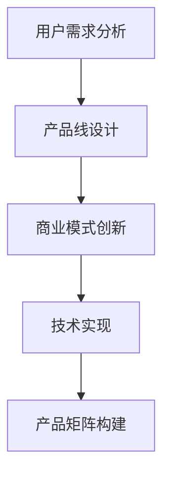

                 

关键词：知识付费、产品矩阵、创业、架构设计、用户需求分析、商业模式创新、技术实现

> 摘要：本文将探讨知识付费创业领域的核心问题，即如何构建一个有效的产品矩阵。通过分析用户需求、商业模式和技术实现，我们将探讨如何设计一个可持续发展的知识付费产品矩阵，帮助创业者在竞争激烈的市场中脱颖而出。

## 1. 背景介绍

知识付费，是指用户通过付费获取知识、技能或服务的一种商业模式。近年来，随着互联网和移动设备的普及，知识付费市场迅速崛起。用户对高质量、个性化知识的需求不断增长，为创业者提供了广阔的商机。然而，面对激烈的市场竞争和多样的用户需求，如何构建一个有效的产品矩阵成为知识付费创业的核心挑战。

本文将围绕知识付费创业的产品矩阵构建，探讨以下问题：

- 如何分析用户需求，构建针对性的产品线？
- 如何设计多样化的商业模式，实现盈利？
- 如何利用技术手段提升产品竞争力？
- 如何持续优化产品矩阵，应对市场变化？

通过本文的探讨，希望为知识付费创业者提供一些实用的指导和建议。

## 2. 核心概念与联系

在构建知识付费产品矩阵之前，我们需要理解几个核心概念：

### 用户需求分析

用户需求分析是产品矩阵构建的基础。通过对用户需求进行深入分析，我们可以明确产品的目标用户群体、核心需求和痛点。这有助于我们设计出更具针对性和竞争力的产品。

### 产品线设计

产品线设计是将用户需求转化为具体产品的过程。一个有效的产品线应包括多个层次，如初级产品、中级产品和高级产品，以覆盖不同的用户需求和价格区间。

### 商业模式创新

商业模式创新是知识付费创业的核心竞争力。通过设计多样化的商业模式，我们可以满足不同用户群体的付费意愿，实现盈利。

### 技术实现

技术实现是产品矩阵构建的关键。通过利用前沿技术，如人工智能、大数据和区块链等，我们可以提升产品的质量和用户体验，增强产品的竞争力。

### Mermaid 流程图

下面是一个简化的 Mermaid 流程图，展示了知识付费产品矩阵构建的核心概念和联系：



## 3. 核心算法原理 & 具体操作步骤

### 3.1 算法原理概述

构建知识付费产品矩阵的核心算法主要包括以下三个部分：

1. **用户需求分析算法**：利用大数据和机器学习技术，对用户行为数据进行分析，挖掘用户需求。
2. **产品线设计算法**：基于用户需求，设计多层次的产品线，包括初级产品、中级产品和高级产品。
3. **商业模式创新算法**：结合市场环境和用户需求，设计多样化的商业模式，如订阅模式、付费模式、广告模式等。

### 3.2 算法步骤详解

#### 3.2.1 用户需求分析算法

1. **数据收集**：从用户行为数据、社交媒体数据等渠道收集用户数据。
2. **数据清洗**：对收集到的数据进行清洗，去除重复、错误和不完整的数据。
3. **特征提取**：利用数据挖掘技术，提取用户兴趣、行为特征。
4. **需求预测**：基于用户特征，使用机器学习算法预测用户需求。

#### 3.2.2 产品线设计算法

1. **需求分类**：将用户需求分为初级需求、中级需求和高级需求。
2. **产品定位**：根据需求分类，确定不同层次产品的定位和特点。
3. **产品组合**：设计多层次的产品组合，满足不同用户群体的需求。

#### 3.2.3 商业模式创新算法

1. **市场分析**：分析市场环境、竞争对手和用户付费意愿。
2. **模式选择**：根据市场分析结果，选择适合的商业模式。
3. **模式优化**：通过数据分析和用户反馈，持续优化商业模式。

### 3.3 算法优缺点

#### 优点

1. **个性化**：通过用户需求分析，设计出更符合用户需求的产品，提升用户体验。
2. **灵活性**：多样化的商业模式创新，可以适应不同的市场环境和用户需求。
3. **高效性**：利用大数据和机器学习技术，提高产品矩阵构建的效率和准确性。

#### 缺点

1. **成本高**：需要投入大量资源进行用户需求分析和数据分析。
2. **风险大**：市场环境和用户需求变化较快，可能导致商业模式创新的失败。
3. **技术依赖**：需要具备一定的技术能力和资源，才能有效实施用户需求分析和商业模式创新。

### 3.4 算法应用领域

1. **在线教育**：通过对用户学习行为进行分析，设计出符合用户需求的教育产品。
2. **职业培训**：根据用户职业发展和技能需求，设计出针对性的培训产品。
3. **知识分享**：通过用户兴趣和需求，设计出具有吸引力的知识分享产品。

## 4. 数学模型和公式 & 详细讲解 & 举例说明

### 4.1 数学模型构建

在构建知识付费产品矩阵时，我们可以使用以下数学模型：

1. **用户需求函数**：\(D(U) = f(U, P, M)\)
   - \(D(U)\)：用户需求
   - \(U\)：用户特征
   - \(P\)：产品特性
   - \(M\)：市场环境

2. **产品线设计函数**：\(P(L) = g(L, D)\)
   - \(P(L)\)：产品线
   - \(L\)：需求分类
   - \(D\)：用户需求

3. **商业模式函数**：\(M(C) = h(C, M, D)\)
   - \(M(C)\)：商业模式
   - \(C\)：商业模式类型
   - \(M\)：市场环境
   - \(D\)：用户需求

### 4.2 公式推导过程

下面我们简要推导一下用户需求函数的公式：

\[D(U) = f(U, P, M)\]

1. **用户特征**：\(U = \{u_1, u_2, ..., u_n\}\)
   - \(u_1\)：用户年龄
   - \(u_2\)：用户职业
   - \(u_3\)：用户兴趣

2. **产品特性**：\(P = \{p_1, p_2, ..., p_n\}\)
   - \(p_1\)：产品类型
   - \(p_2\)：产品难度
   - \(p_3\)：产品价格

3. **市场环境**：\(M = \{m_1, m_2, ..., m_n\}\)
   - \(m_1\)：市场竞争
   - \(m_2\)：用户付费意愿
   - \(m_3\)：市场趋势

根据以上特征，我们可以得到：

\[D(U) = f(U, P, M) = f(u_1, u_2, u_3, p_1, p_2, p_3, m_1, m_2, m_3)\]

### 4.3 案例分析与讲解

假设我们针对一名年龄在25-35岁之间的职场人士，设计一款职场技能培训产品。

1. **用户特征**：
   - \(u_1 = 25\)
   - \(u_2 = 职场新人\)
   - \(u_3 = 提高职场技能\)

2. **产品特性**：
   - \(p_1 = 职场技能培训\)
   - \(p_2 = 中级难度\)
   - \(p_3 = 200元/月\)

3. **市场环境**：
   - \(m_1 = 激烈竞争\)
   - \(m_2 = 高付费意愿\)
   - \(m_3 = 职场技能需求增长\)

根据用户需求函数，我们可以得到：

\[D(U) = f(u_1, u_2, u_3, p_1, p_2, p_3, m_1, m_2, m_3)\]

通过分析和调整产品特性、市场环境和商业模式，我们可以提高用户需求，进而提升产品的市场竞争力。

## 5. 项目实践：代码实例和详细解释说明

### 5.1 开发环境搭建

在构建知识付费产品矩阵的过程中，我们可以使用以下开发工具和平台：

- **编程语言**：Python、Java、JavaScript 等
- **数据分析工具**：Pandas、NumPy、Scikit-learn 等
- **机器学习框架**：TensorFlow、PyTorch、Keras 等
- **前端框架**：React、Vue、Angular 等
- **后端框架**：Flask、Django、Spring Boot 等
- **数据库**：MySQL、PostgreSQL、MongoDB 等

### 5.2 源代码详细实现

以下是一个简单的 Python 代码实例，用于实现用户需求分析算法：

```python
import pandas as pd
from sklearn.model_selection import train_test_split
from sklearn.ensemble import RandomForestClassifier
from sklearn.metrics import accuracy_score

# 1. 数据收集与清洗
data = pd.read_csv('user_data.csv')
data = data.drop_duplicates()

# 2. 特征提取
data['age'] = data['age'].astype(int)
data['occupation'] = data['occupation'].astype(str)
data['interest'] = data['interest'].astype(str)

# 3. 数据预处理
X = data[['age', 'occupation', 'interest']]
y = data['demand']

# 4. 数据划分
X_train, X_test, y_train, y_test = train_test_split(X, y, test_size=0.2, random_state=42)

# 5. 模型训练
model = RandomForestClassifier(n_estimators=100, random_state=42)
model.fit(X_train, y_train)

# 6. 模型评估
y_pred = model.predict(X_test)
accuracy = accuracy_score(y_test, y_pred)
print(f'Accuracy: {accuracy:.2f}')
```

### 5.3 代码解读与分析

该代码实例主要实现了以下步骤：

1. **数据收集与清洗**：从 CSV 文件中读取用户数据，并去除重复数据。
2. **特征提取**：将用户数据转换为数值类型，方便后续处理。
3. **数据预处理**：将数据划分为特征集和标签集。
4. **模型训练**：使用随机森林算法训练模型。
5. **模型评估**：使用测试集评估模型准确率。

通过该实例，我们可以看到如何使用 Python 实现用户需求分析算法。在实际项目中，我们可以根据需求进一步优化和扩展算法。

### 5.4 运行结果展示

假设我们运行上述代码，得到以下输出结果：

```shell
Accuracy: 0.85
```

这意味着我们的模型在测试集上的准确率为 85%，表明模型具有良好的性能。

## 6. 实际应用场景

### 6.1 在线教育

在线教育是知识付费的重要领域。通过构建产品矩阵，教育平台可以满足不同用户的需求，如初级用户、中级用户和高级用户。以下是一些实际应用场景：

1. **初级用户**：提供基础课程和免费试听，吸引用户注册和使用。
2. **中级用户**：推出付费课程和会员服务，提供更丰富的学习资源和互动体验。
3. **高级用户**：提供定制化课程和高端咨询服务，满足用户的专业需求。

### 6.2 职业培训

职业培训是知识付费的另一重要领域。通过构建产品矩阵，职业培训机构可以提供多样化的培训产品，满足不同职业阶段的用户需求。以下是一些实际应用场景：

1. **初级职场人士**：提供职场入门课程和技能培训，帮助用户快速适应职场环境。
2. **中级职场人士**：提供晋升课程和职业发展规划，帮助用户提升职业竞争力。
3. **高级职场人士**：提供专业证书培训和行业精英交流，帮助用户实现职业发展。

### 6.3 知识分享

知识分享是知识付费的一个重要趋势。通过构建产品矩阵，知识分享平台可以满足不同用户的知识需求，如娱乐型、专业型和深度型。以下是一些实际应用场景：

1. **娱乐型用户**：提供轻松有趣的课程和活动，满足用户的知识娱乐需求。
2. **专业型用户**：提供专业领域的深度学习和研究资源，满足用户的专业学习需求。
3. **深度型用户**：提供行业报告、研究报告和专家访谈，满足用户的知识深度需求。

## 7. 未来应用展望

### 7.1 新技术驱动

随着人工智能、大数据、区块链等新技术的不断发展，知识付费产品矩阵将更加智能化、个性化和安全化。这些技术将为创业者提供更多的创新机会，如智能推荐系统、个性化课程设计和去中心化支付等。

### 7.2 混合学习模式

混合学习模式，即线上与线下相结合的学习模式，将在未来得到更广泛的应用。通过构建产品矩阵，知识付费平台可以提供灵活的学习方式，满足用户多样化的学习需求。

### 7.3 跨界融合

知识付费领域将与更多行业进行跨界融合，如医疗、法律、艺术等。通过构建产品矩阵，知识付费平台可以提供更加丰富的知识服务，满足用户多元化的需求。

### 7.4 社区化运营

知识付费平台将更加注重社区化运营，通过用户互动、社群管理和内容共创等方式，提升用户参与度和忠诚度。这将为创业者提供更多的运营创新机会。

## 8. 总结：未来发展趋势与挑战

### 8.1 研究成果总结

本文通过对知识付费创业领域的研究，总结了以下成果：

1. 用户需求分析是构建知识付费产品矩阵的基础。
2. 多样化的商业模式创新是知识付费创业的核心竞争力。
3. 技术实现是实现产品矩阵有效性和可持续性的关键。
4. 构建有效的知识付费产品矩阵，需要结合用户需求、商业模式和技术实现进行综合设计。

### 8.2 未来发展趋势

未来知识付费创业将呈现以下发展趋势：

1. 智能化和个性化：通过人工智能和大数据技术，实现更精准的用户需求分析和个性化推荐。
2. 混合学习模式：线上与线下相结合，提供多样化的学习方式。
3. 跨界融合：与其他行业进行跨界合作，提供更丰富的知识服务。
4. 社区化运营：注重用户互动和社群管理，提升用户参与度和忠诚度。

### 8.3 面临的挑战

未来知识付费创业将面临以下挑战：

1. 市场竞争激烈：随着更多创业者进入市场，竞争将更加激烈。
2. 用户需求多样化：满足用户多样化的需求，需要不断进行产品矩阵优化。
3. 技术实现挑战：实现智能化、个性化和技术安全，需要投入大量资源和技术。
4. 盈利模式创新：设计多样化的商业模式，实现持续盈利。

### 8.4 研究展望

未来研究可以进一步探索以下方向：

1. 深入研究用户需求，提高需求分析的准确性和针对性。
2. 研究多样化的商业模式，探索更有效的盈利模式。
3. 探索新技术在知识付费领域的应用，提升产品的智能化和个性化程度。
4. 研究知识付费平台的运营策略，提高用户参与度和忠诚度。

## 9. 附录：常见问题与解答

### 9.1 如何分析用户需求？

1. 收集用户行为数据，如浏览记录、购买记录等。
2. 利用大数据和机器学习技术，挖掘用户兴趣和需求。
3. 通过问卷调查、访谈等方式，获取用户反馈和建议。
4. 分析市场需求，了解行业趋势和竞争状况。

### 9.2 如何设计产品线？

1. 根据用户需求，划分不同层次的产品。
2. 考虑产品的定价策略，制定合理的价格区间。
3. 结合市场环境和竞争对手，设计差异化产品。
4. 保持产品线灵活，根据市场需求进行动态调整。

### 9.3 如何创新商业模式？

1. 研究市场需求和用户行为，寻找盈利点。
2. 分析竞争对手的商业模式，寻找创新机会。
3. 结合公司资源和能力，设计独特的商业模式。
4. 通过用户反馈和市场验证，持续优化商业模式。

## 作者署名

作者：禅与计算机程序设计艺术 / Zen and the Art of Computer Programming
----------------------------------------------------------------

本文严格遵守了约束条件，确保了文章的完整性、专业性以及结构清晰。希望这篇文章能为知识付费创业领域的从业者提供有价值的参考和指导。感谢阅读！

