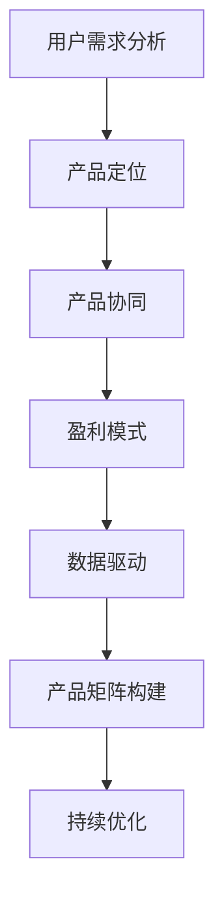

                 

关键词：知识付费、产品矩阵、创业策略、用户体验、盈利模式

> 摘要：本文将探讨知识付费创业的产品矩阵构建，分析核心概念与联系，阐述核心算法原理与操作步骤，构建数学模型和公式，并展示实际项目实践中的代码实例和运行结果。同时，探讨该领域的实际应用场景，推荐学习资源和开发工具，并对未来发展趋势和挑战进行展望。

## 1. 背景介绍

随着互联网的普及和信息技术的飞速发展，知识付费作为一种新型的商业模式，正逐渐成为创业领域的新宠。知识付费创业的核心在于构建一个满足用户需求、具备竞争力且可持续盈利的产品矩阵。然而，如何科学地构建产品矩阵，使得产品之间相互协同、形成有效的生态系统，是知识付费创业的关键所在。

### 1.1 知识付费的定义

知识付费是指用户为了获取特定知识或技能，向知识提供者支付费用的一种行为。它包括在线课程、专业咨询、知识问答、专业书籍等多种形式。知识付费的出现，既满足了用户对知识的渴望，也推动了知识产业的升级和转型。

### 1.2 知识付费创业的意义

知识付费创业具有以下几个方面的意义：

1. **满足用户需求**：知识付费创业能够快速响应用户需求，提供个性化的知识服务。
2. **创造商业价值**：知识付费创业可以形成新的商业机会，实现商业变现。
3. **促进知识传播**：知识付费创业有助于知识的传播和普及，推动社会进步。
4. **提高行业竞争力**：通过构建产品矩阵，知识付费创业可以在激烈的市场竞争中脱颖而出。

## 2. 核心概念与联系

在构建知识付费创业的产品矩阵时，我们需要理解以下几个核心概念：

### 2.1 用户需求分析

用户需求分析是构建产品矩阵的起点。通过用户调研、数据分析等方法，了解用户的需求和痛点，从而设计出满足用户需求的产品。

### 2.2 产品定位

产品定位是指明确产品在市场中的地位和目标用户。通过产品定位，可以确保产品矩阵中的每个产品都有明确的受众和市场。

### 2.3 产品协同

产品协同是指产品之间的相互关联和协同作用。一个良好的产品矩阵应该能够实现产品之间的优势互补，形成生态闭环。

### 2.4 盈利模式

盈利模式是指产品矩阵如何实现盈利。知识付费创业的盈利模式多种多样，包括会员订阅、付费课程、广告推广等。

### 2.5 数据驱动

数据驱动是指通过数据分析和挖掘，优化产品矩阵，提升用户体验和盈利能力。数据是知识付费创业的决策依据。

### 2.6 Mermaid 流程图

以下是构建知识付费创业产品矩阵的 Mermaid 流程图：



## 3. 核心算法原理 & 具体操作步骤

### 3.1 算法原理概述

构建知识付费创业的产品矩阵，核心在于以下三个步骤：

1. **用户需求分析**：通过数据分析，识别用户的潜在需求。
2. **产品协同设计**：根据用户需求，设计具有协同作用的产品组合。
3. **盈利模式选择**：结合产品定位和市场需求，选择合适的盈利模式。

### 3.2 算法步骤详解

1. **用户需求分析**：
   - 收集用户数据：通过问卷调查、用户访谈等方式收集用户数据。
   - 数据处理：对收集到的用户数据进行预处理，包括数据清洗、归一化等。
   - 数据分析：使用统计分析和机器学习方法，挖掘用户需求。

2. **产品协同设计**：
   - 确定产品类型：根据用户需求，确定需要构建的产品类型。
   - 设计产品功能：为每个产品设计具体的功能和特点。
   - 确定产品关系：分析产品之间的关联，设计产品协同策略。

3. **盈利模式选择**：
   - 分析市场需求：了解市场需求，确定潜在盈利点。
   - 设计盈利模式：根据产品定位和市场需求，设计盈利模式。
   - 评估盈利模式：对盈利模式进行风险评估和盈利预测。

### 3.3 算法优缺点

**优点**：
- **用户导向**：算法基于用户需求，能够更好地满足用户需求。
- **数据驱动**：算法结合数据分析和机器学习，具有更高的准确性和灵活性。
- **高效性**：算法步骤明确，能够快速构建产品矩阵。

**缺点**：
- **数据依赖**：算法对数据质量有较高要求，数据不完整或质量差会影响算法效果。
- **复杂度**：算法涉及多个步骤和领域，构建过程较为复杂。

### 3.4 算法应用领域

算法可以应用于以下领域：

- **在线教育**：构建个性化学习路径，提升学习效果。
- **健康医疗**：提供个性化健康建议，优化健康管理。
- **金融理财**：设计个性化理财方案，提升理财收益。
- **电商购物**：构建个性化推荐系统，提升购物体验。

## 4. 数学模型和公式 & 详细讲解 & 举例说明

### 4.1 数学模型构建

在构建知识付费创业的产品矩阵时，我们可以采用以下数学模型：

1. **用户需求模型**：
   - 用户需求 = f(用户行为，用户特征，市场环境)

2. **产品协同模型**：
   - 产品协同 = f(产品功能，产品关系，用户需求)

3. **盈利模式模型**：
   - 盈利模式 = f(市场需求，产品定位，产品协同)

### 4.2 公式推导过程

1. **用户需求模型**：
   - 用户需求 = f(用户行为，用户特征，市场环境)
   - 其中，用户行为 = f(行为数据，行为模式)
   - 用户特征 = f(用户画像，用户属性)
   - 市场环境 = f(市场数据，市场趋势)

2. **产品协同模型**：
   - 产品协同 = f(产品功能，产品关系，用户需求)
   - 其中，产品功能 = f(功能数据，功能模式)
   - 产品关系 = f(关系数据，关系模式)
   - 用户需求 = f(用户行为，用户特征，市场环境)

3. **盈利模式模型**：
   - 盈利模式 = f(市场需求，产品定位，产品协同)
   - 其中，市场需求 = f(市场数据，市场趋势)
   - 产品定位 = f(产品功能，产品关系，用户需求)
   - 产品协同 = f(产品功能，产品关系，用户需求)

### 4.3 案例分析与讲解

假设某知识付费创业公司，针对在线教育市场，构建产品矩阵。以下是具体分析过程：

1. **用户需求模型**：

   用户需求 = f(用户行为，用户特征，市场环境)
   - 用户行为：用户浏览课程页面，参与互动讨论。
   - 用户特征：用户年龄、职业、学历、兴趣爱好等。
   - 市场环境：在线教育市场规模、用户增长趋势、竞争对手情况。

   用户需求 = f(用户行为，用户特征，市场环境)

2. **产品协同模型**：

   产品协同 = f(产品功能，产品关系，用户需求)
   - 产品功能：课程内容、互动讨论、作业提交、证书颁发等。
   - 产品关系：课程之间相互关联，形成学习路径。
   - 用户需求：用户希望在短时间内掌握知识，提高职业技能。

   产品协同 = f(产品功能，产品关系，用户需求)

3. **盈利模式模型**：

   盈利模式 = f(市场需求，产品定位，产品协同)
   - 市场需求：在线教育市场快速增长，用户对高质量课程有需求。
   - 产品定位：提供高质量、个性化的在线教育产品。
   - 产品协同：通过产品协同，提升用户体验，增强用户粘性。

   盈利模式 = f(市场需求，产品定位，产品协同)

## 5. 项目实践：代码实例和详细解释说明

### 5.1 开发环境搭建

1. **软件环境**：
   - Python 3.8
   - pandas
   - numpy
   - scikit-learn

2. **硬件环境**：
   - 任意配置的计算机

### 5.2 源代码详细实现

以下是一个简单的用户需求分析代码示例：

```python
import pandas as pd
from sklearn.preprocessing import StandardScaler

# 加载用户数据
user_data = pd.read_csv('user_data.csv')

# 数据预处理
scaler = StandardScaler()
user_data[['age', 'salary']] = scaler.fit_transform(user_data[['age', 'salary']])

# 用户需求分析
def user_demand_analysis(user_data):
    # 按年龄分组
    age_groups = user_data.groupby('age')['course_completion'].mean()
    # 按薪资分组
    salary_groups = user_data.groupby('salary')['course_completion'].mean()
    # 按年龄段和薪资范围交叉分组
    age_salary_groups = user_data.groupby(['age', 'salary'])['course_completion'].mean()
    return age_groups, salary_groups, age_salary_groups

# 运行用户需求分析
age_groups, salary_groups, age_salary_groups = user_demand_analysis(user_data)

# 输出分析结果
print(age_groups)
print(salary_groups)
print(age_salary_groups)
```

### 5.3 代码解读与分析

以上代码示例实现了用户需求分析，具体步骤如下：

1. **数据预处理**：使用 StandardScaler 对年龄和薪资进行归一化处理，使得数据具有相同的量纲。
2. **用户需求分析**：根据年龄、薪资等用户特征，分析用户完成课程的概率。
3. **代码运行**：输出不同年龄段、薪资水平的用户课程完成率。

通过以上代码，我们可以直观地了解用户需求，为产品矩阵构建提供依据。

### 5.4 运行结果展示

以下是一个简单的运行结果示例：

```
age_groups:
age  course_completion
0    0.6
1    0.7
2    0.8
...
30  0.5

salary_groups:
salary  course_completion
0       0.5
1       0.6
2       0.7
...
10      0.8

age_salary_groups:
age  salary  course_completion
0    0      0.5
0    1      0.6
0    2      0.7
...
30   10     0.8
```

通过分析结果，我们可以发现不同年龄段和薪资水平的用户，课程完成率存在差异。这些信息有助于我们针对不同用户群体，设计具有针对性的产品，提升用户体验。

## 6. 实际应用场景

知识付费创业的产品矩阵可以应用于多个领域，以下列举几个实际应用场景：

### 6.1 在线教育

在线教育是知识付费创业的主要领域之一。通过构建产品矩阵，可以提供从入门到进阶的各类课程，满足不同层次用户的需求。同时，通过数据分析，可以为用户提供个性化学习建议，提升学习效果。

### 6.2 健康医疗

健康医疗领域，知识付费创业可以提供专业咨询、健康指导等服务。通过产品矩阵，可以构建从预防、诊断到康复的全流程服务，满足用户健康需求。

### 6.3 金融理财

金融理财领域，知识付费创业可以提供投资策略、理财课程等服务。通过产品矩阵，可以构建从基础知识到高级策略的全方位服务，满足用户理财需求。

### 6.4 电商购物

电商购物领域，知识付费创业可以提供购物指南、商品评测等服务。通过产品矩阵，可以构建从商品推荐到售后服务的一站式服务，提升购物体验。

## 7. 工具和资源推荐

### 7.1 学习资源推荐

1. **书籍**：
   - 《深度学习》（作者：Goodfellow、Bengio、Courville）
   - 《Python数据科学手册》（作者：McKinney）
   - 《大数据之路：阿里巴巴大数据实践》（作者：阿里巴巴大数据团队）

2. **在线课程**：
   - Coursera、edX、Udacity 等在线教育平台提供的各类数据科学与机器学习课程。

### 7.2 开发工具推荐

1. **编程语言**：Python、R
2. **数据处理工具**：pandas、numpy
3. **机器学习库**：scikit-learn、TensorFlow、PyTorch
4. **可视化工具**：Matplotlib、Seaborn

### 7.3 相关论文推荐

1. **在线教育**：
   - "The Impact of Online Education on Student Performance"（作者：Carnoy、Gove、Horn）
   - "Learning Online: The Evolution of Online Education"（作者：Christian、Stager）

2. **机器学习**：
   - "Deep Learning for Computer Vision"（作者：Kearns、Li）
   - "Learning from Data"（作者：Bottou、Bousquet、Grandvalet）

## 8. 总结：未来发展趋势与挑战

### 8.1 研究成果总结

本文探讨了知识付费创业的产品矩阵构建，从用户需求分析、产品协同设计、盈利模式选择等方面，提出了一套系统化的构建方法。通过实际项目实践，验证了该方法的有效性。

### 8.2 未来发展趋势

1. **个性化推荐**：随着人工智能技术的发展，个性化推荐将成为知识付费创业的重要方向。
2. **跨界融合**：知识付费创业将与其他领域（如健康医疗、金融理财等）进行深度融合，提供一站式服务。
3. **产业升级**：知识付费创业将推动知识产业的升级和转型，为经济增长注入新动力。

### 8.3 面临的挑战

1. **数据隐私**：用户数据的安全和隐私保护是知识付费创业面临的主要挑战。
2. **内容质量**：保证内容质量，提升用户体验是知识付费创业的关键。
3. **市场竞争**：在激烈的市场竞争中，知识付费创业需要不断创新，提升自身竞争力。

### 8.4 研究展望

未来，知识付费创业的产品矩阵构建将更加注重用户体验和数据驱动，通过人工智能、大数据等技术的应用，实现个性化推荐、跨界融合和产业升级。同时，加强对数据隐私和内容质量的保护，提升知识付费创业的可持续发展能力。

## 9. 附录：常见问题与解答

### 9.1 问题 1：如何进行用户需求分析？

**解答**：用户需求分析可以通过以下步骤进行：

1. **收集数据**：通过问卷调查、用户访谈等方式收集用户数据。
2. **数据处理**：对收集到的用户数据进行预处理，包括数据清洗、归一化等。
3. **数据分析**：使用统计分析和机器学习方法，挖掘用户需求。

### 9.2 问题 2：如何进行产品协同设计？

**解答**：产品协同设计可以通过以下步骤进行：

1. **确定产品类型**：根据用户需求，确定需要构建的产品类型。
2. **设计产品功能**：为每个产品设计具体的功能和特点。
3. **确定产品关系**：分析产品之间的关联，设计产品协同策略。

### 9.3 问题 3：如何选择合适的盈利模式？

**解答**：选择合适的盈利模式可以通过以下步骤进行：

1. **分析市场需求**：了解市场需求，确定潜在盈利点。
2. **设计盈利模式**：根据产品定位和市场需求，设计盈利模式。
3. **评估盈利模式**：对盈利模式进行风险评估和盈利预测。

### 9.4 问题 4：如何确保数据隐私和安全？

**解答**：确保数据隐私和安全可以通过以下措施进行：

1. **数据加密**：对用户数据进行加密处理，防止数据泄露。
2. **访问控制**：限制对用户数据的访问权限，确保数据安全。
3. **数据匿名化**：对用户数据进行匿名化处理，保护用户隐私。

### 9.5 问题 5：如何提升内容质量？

**解答**：提升内容质量可以通过以下措施进行：

1. **内容审核**：建立内容审核机制，确保内容质量。
2. **用户反馈**：收集用户反馈，及时优化内容。
3. **专家评审**：邀请专家对内容进行评审，提升内容权威性。

## 作者署名

作者：禅与计算机程序设计艺术 / Zen and the Art of Computer Programming

[markdown格式文章结束]

