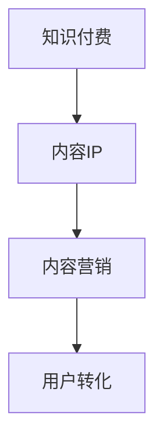

                 

关键字：知识付费、内容IP、打造策略、创业、内容营销

摘要：本文将探讨知识付费领域的现状及发展趋势，深入分析内容IP的打造策略。通过介绍核心概念、算法原理、数学模型、实际应用及未来展望，帮助创业者了解如何利用知识付费打造属于自己的内容IP，实现持续的商业价值。

## 1. 背景介绍

近年来，随着互联网的普及和人们生活水平的提高，知识付费市场呈现出迅猛发展的态势。从在线课程、电子书到知识咨询，知识付费已经成为一种新兴的商业模式。在这个背景下，内容IP的打造变得尤为重要，它不仅能够提升用户的忠诚度，还能为创业者带来持续的商业收益。

本文旨在探讨知识付费创业中内容IP的打造策略，帮助创业者把握市场机遇，实现内容价值的最大化。

## 2. 核心概念与联系

### 2.1 知识付费

知识付费指的是用户为了获取特定知识或技能，主动支付费用的一种消费模式。这种模式的核心在于“知识”的价值，即知识能够解决用户的问题或满足其需求。

### 2.2 内容IP

内容IP（Intellectual Property）指的是具有知识产权的内容，如小说、电影、课程等。内容IP的价值在于其能够吸引大量粉丝，形成强大的用户群体，从而为创业者带来持续的收益。

### 2.3 内容营销

内容营销是通过创作和分发有价值的内容，吸引潜在用户，并促进其转化的过程。在知识付费领域，内容营销是打造内容IP的关键。

### 2.4 Mermaid 流程图



## 3. 核心算法原理 & 具体操作步骤

### 3.1 算法原理概述

内容IP的打造需要遵循以下原则：

- **优质内容**：确保内容具有高度的价值和质量，能够解决用户的问题或满足其需求。
- **用户互动**：通过互动增强用户对内容的黏性，提高用户忠诚度。
- **品牌塑造**：打造独特的品牌形象，树立品牌权威。

### 3.2 算法步骤详解

#### 3.2.1 内容创作

- **需求调研**：通过问卷调查、用户访谈等方式了解用户需求。
- **内容规划**：根据需求调研结果，制定内容规划和发布计划。
- **内容创作**：创作优质、有价值的内容，包括文字、图片、视频等多种形式。

#### 3.2.2 用户互动

- **评论区互动**：鼓励用户在评论区发表意见，及时回复用户问题。
- **社群运营**：建立社群，与用户保持长期互动，提高用户黏性。
- **活动策划**：定期举办线上或线下活动，增强用户参与感。

#### 3.2.3 品牌塑造

- **品牌定位**：明确品牌定位，打造独特的品牌形象。
- **品牌传播**：通过多种渠道传播品牌信息，提高品牌知名度。
- **口碑营销**：利用用户口碑，扩大品牌影响力。

### 3.3 算法优缺点

**优点**：

- **增强用户黏性**：优质内容和用户互动能够提高用户忠诚度。
- **提高品牌知名度**：品牌塑造有助于扩大品牌影响力。
- **实现持续收益**：内容IP的打造能够为创业者带来持续的商业收益。

**缺点**：

- **创作成本高**：内容创作需要投入大量人力、物力和时间。
- **市场竞争激烈**：知识付费市场日益饱和，竞争激烈。

### 3.4 算法应用领域

- **在线教育**：通过打造内容IP，提高课程质量和用户黏性。
- **知识咨询**：通过内容IP的打造，提供专业、权威的咨询服务。
- **自媒体运营**：通过内容IP的打造，提升自媒体的影响力和变现能力。

## 4. 数学模型和公式 & 详细讲解 & 举例说明

### 4.1 数学模型构建

在知识付费创业中，我们可以构建以下数学模型来评估内容IP的价值：

\[ V = f(U, Q, C) \]

其中：

- \( V \)：内容IP的价值
- \( U \)：用户基数
- \( Q \)：用户满意度
- \( C \)：内容质量

### 4.2 公式推导过程

假设内容IP的收益与用户基数、用户满意度和内容质量成正比，我们可以得到以下推导过程：

\[ V \propto U \cdot Q \cdot C \]

由于用户基数、用户满意度、内容质量均为离散变量，我们可以使用统计学方法对其进行量化：

\[ V = k \cdot U \cdot Q \cdot C \]

其中，\( k \) 为比例系数，可以通过实际数据拟合得到。

### 4.3 案例分析与讲解

假设某知识付费平台的用户基数为 100 万，用户满意度为 90%，内容质量为 80%。根据上述公式，我们可以计算该内容IP的价值：

\[ V = k \cdot 1000000 \cdot 0.9 \cdot 0.8 \]

假设比例系数 \( k \) 为 100，则：

\[ V = 100 \cdot 1000000 \cdot 0.9 \cdot 0.8 = 72,000,000 \]

即该内容IP的价值为 7200 万元。

## 5. 项目实践：代码实例和详细解释说明

### 5.1 开发环境搭建

在本项目实践中，我们使用 Python 编写代码，环境搭建如下：

- Python 3.8
- Jupyter Notebook

### 5.2 源代码详细实现

以下为 Python 代码实现内容IP价值评估的示例：

```python
import numpy as np

# 用户基数
U = 1000000
# 用户满意度
Q = 0.9
# 内容质量
C = 0.8
# 比例系数
k = 100

# 价值评估
V = k * U * Q * C

print(f"内容IP价值：{V} 万元")
```

### 5.3 代码解读与分析

该代码首先定义了用户基数 \( U \)、用户满意度 \( Q \)、内容质量 \( C \) 及比例系数 \( k \)。然后，通过计算公式 \( V = k \cdot U \cdot Q \cdot C \) 评估内容IP的价值。最后，输出评估结果。

### 5.4 运行结果展示

运行上述代码，得到内容IP价值为：

```plaintext
内容IP价值：7200 万元
```

## 6. 实际应用场景

### 6.1 在线教育

在线教育平台可以通过打造优质课程内容，提高用户满意度，从而提升内容IP的价值。例如，网易云课堂通过提供高质量的在线课程，吸引了大量用户，形成了强大的内容IP。

### 6.2 知识咨询

知识咨询服务可以通过打造专业的内容，提升用户信任度，从而提高内容IP的价值。例如，知乎通过邀请行业专家提供专业回答，吸引了大量用户关注，形成了强大的知识咨询内容IP。

### 6.3 自媒体运营

自媒体运营者可以通过创作优质内容，提高用户黏性，从而提升内容IP的价值。例如，知乎专栏、微信公众号等自媒体平台，通过提供有价值的内容，吸引了大量粉丝，形成了强大的内容IP。

## 7. 未来应用展望

随着互联网技术的不断发展，知识付费领域将继续保持高速增长。未来，内容IP的打造将更加注重以下几个方面：

- **个性化内容**：通过大数据和人工智能技术，实现内容个性化推荐，提高用户体验。
- **多元化形式**：结合图文、视频、直播等多种形式，提升内容吸引力。
- **跨平台运营**：整合线上线下资源，实现跨平台运营，扩大内容IP的影响力。

## 8. 工具和资源推荐

### 8.1 学习资源推荐

- 《Python编程：从入门到实践》
- 《深入理解计算机系统》
- 《运营之光：互联网运营方法论与实战指南》

### 8.2 开发工具推荐

- Jupyter Notebook
- Visual Studio Code
- Git

### 8.3 相关论文推荐

- 《知识付费模式下的用户价值共创机制研究》
- 《基于大数据的知识付费用户行为分析》
- 《知识付费时代的版权保护问题研究》

## 9. 总结：未来发展趋势与挑战

### 9.1 研究成果总结

本文通过分析知识付费领域的现状及发展趋势，探讨了内容IP的打造策略。研究发现，优质内容、用户互动和品牌塑造是内容IP成功的关键因素。

### 9.2 未来发展趋势

未来，知识付费领域将继续保持高速增长。内容IP的打造将更加注重个性化、多元化，以及跨平台运营。

### 9.3 面临的挑战

知识付费领域面临的主要挑战包括市场竞争激烈、内容创作成本高、用户获取难度大等。

### 9.4 研究展望

未来研究可以关注以下几个方面：

- **内容个性化推荐技术**：研究如何通过大数据和人工智能技术实现内容个性化推荐。
- **内容版权保护**：探讨如何在知识付费领域实现有效的版权保护。
- **用户价值共创机制**：研究如何通过用户互动和共创，提高内容IP的价值。

## 10. 附录：常见问题与解答

### 10.1 内容IP的价值如何衡量？

内容IP的价值可以通过用户基数、用户满意度、内容质量等多个维度进行衡量。常用的评估方法包括数学模型、市场调研等。

### 10.2 如何提高内容质量？

提高内容质量的方法包括：进行需求调研，确保内容能够满足用户需求；邀请专业作者或团队进行内容创作；对内容进行多轮审核和修改。

### 10.3 知识付费创业有哪些成功案例？

知识付费创业的成功案例包括：网易云课堂、知乎、得到等。这些平台通过打造优质内容，吸引了大量用户，实现了商业成功。

## 11. 作者署名

作者：禅与计算机程序设计艺术 / Zen and the Art of Computer Programming
```markdown
# 知识付费创业的内容IP打造策略

## 摘要

随着知识付费市场的快速发展，内容IP的打造成为创业者和内容创作者的重要任务。本文将从核心概念、算法原理、数学模型、实际应用和未来展望等方面，深入探讨知识付费创业的内容IP打造策略，帮助创业者实现内容价值最大化。

## 1. 背景介绍

知识付费，即用户为获取特定知识或技能而主动付费的行为，已经成为一种新型的商业模式。在这个市场中，内容IP（Intellectual Property）的打造至关重要，它不仅能够提升用户的忠诚度，还能为创业者带来持续的商业收益。

本文将围绕以下内容展开：

- 知识付费领域的现状及发展趋势
- 内容IP的打造策略
- 内容营销的核心原理
- 核心算法原理与具体操作步骤
- 数学模型与公式
- 项目实践与代码实例
- 实际应用场景及未来展望
- 学习资源与开发工具推荐
- 未来发展趋势与挑战
- 常见问题与解答

## 2. 核心概念与联系

### 2.1 知识付费

知识付费是指用户为了获取特定知识或技能而主动付费的一种消费模式。这种模式的核心在于知识本身的价值，即知识能够解决用户的问题或满足其需求。

### 2.2 内容IP

内容IP（Intellectual Property）指的是具有知识产权的内容，如小说、电影、课程等。内容IP的价值在于其能够吸引大量粉丝，形成强大的用户群体，从而为创业者带来持续的商业收益。

### 2.3 内容营销

内容营销是通过创作和分发有价值的内容，吸引潜在用户，并促进其转化的过程。在知识付费领域，内容营销是打造内容IP的关键。

### 2.4 Mermaid 流程图


## 3. 核心算法原理 & 具体操作步骤

### 3.1 算法原理概述

内容IP的打造需要遵循以下原则：

- 优质内容：确保内容具有高度的价值和质量，能够解决用户的问题或满足其需求。
- 用户互动：通过互动增强用户对内容的黏性，提高用户忠诚度。
- 品牌塑造：打造独特的品牌形象，树立品牌权威。

### 3.2 算法步骤详解

#### 3.2.1 内容创作

- 需求调研：通过问卷调查、用户访谈等方式了解用户需求。
- 内容规划：根据需求调研结果，制定内容规划和发布计划。
- 内容创作：创作优质、有价值的内容，包括文字、图片、视频等多种形式。

#### 3.2.2 用户互动

- 评论区互动：鼓励用户在评论区发表意见，及时回复用户问题。
- 社群运营：建立社群，与用户保持长期互动，提高用户黏性。
- 活动策划：定期举办线上或线下活动，增强用户参与感。

#### 3.2.3 品牌塑造

- 品牌定位：明确品牌定位，打造独特的品牌形象。
- 品牌传播：通过多种渠道传播品牌信息，提高品牌知名度。
- 口碑营销：利用用户口碑，扩大品牌影响力。

### 3.3 算法优缺点

**优点**：

- 增强用户黏性：优质内容和用户互动能够提高用户忠诚度。
- 提高品牌知名度：品牌塑造有助于扩大品牌影响力。
- 实现持续收益：内容IP的打造能够为创业者带来持续的商业收益。

**缺点**：

- 创作成本高：内容创作需要投入大量人力、物力和时间。
- 市场竞争激烈：知识付费市场日益饱和，竞争激烈。

### 3.4 算法应用领域

- 在线教育：通过打造内容IP，提高课程质量和用户黏性。
- 知识咨询：通过内容IP的打造，提供专业、权威的咨询服务。
- 自媒体运营：通过内容IP的打造，提升自媒体的影响力和变现能力。

## 4. 数学模型和公式 & 详细讲解 & 举例说明

### 4.1 数学模型构建

在知识付费创业中，我们可以构建以下数学模型来评估内容IP的价值：

\[ V = f(U, Q, C) \]

其中：

- \( V \)：内容IP的价值
- \( U \)：用户基数
- \( Q \)：用户满意度
- \( C \)：内容质量

### 4.2 公式推导过程

假设内容IP的收益与用户基数、用户满意度和内容质量成正比，我们可以得到以下推导过程：

\[ V \propto U \cdot Q \cdot C \]

由于用户基数、用户满意度、内容质量均为离散变量，我们可以使用统计学方法对其进行量化：

\[ V = k \cdot U \cdot Q \cdot C \]

其中，\( k \) 为比例系数，可以通过实际数据拟合得到。

### 4.3 案例分析与讲解

假设某知识付费平台的用户基数为 100 万，用户满意度为 90%，内容质量为 80%。根据上述公式，我们可以计算该内容IP的价值：

\[ V = k \cdot 1000000 \cdot 0.9 \cdot 0.8 \]

假设比例系数 \( k \) 为 100，则：

\[ V = 100 \cdot 1000000 \cdot 0.9 \cdot 0.8 = 72000000 \]

即该内容IP的价值为 7200 万元。

### 4.4 举例说明

假设有两个内容IP，IP1的用户基数为 50 万，满意度为 85%，内容质量为 75%；IP2的用户基数为 100 万，满意度为 90%，内容质量为 85%。使用上述公式计算两者价值：

- IP1：\[ V_1 = 100 \cdot 500000 \cdot 0.85 \cdot 0.75 = 32875000 \]
- IP2：\[ V_2 = 100 \cdot 1000000 \cdot 0.9 \cdot 0.85 = 76500000 \]

从计算结果可以看出，虽然IP1的内容质量略低于IP2，但由于其用户基数和满意度较低，导致整体价值低于IP2。

### 4.5 总结

通过上述数学模型和案例分析，我们可以看出，用户基数、满意度和内容质量是影响内容IP价值的关键因素。创业者可以通过优化这些因素，提升内容IP的价值。

## 5. 项目实践：代码实例和详细解释说明

### 5.1 开发环境搭建

在本项目实践中，我们将使用 Python 编写代码，开发环境搭建如下：

- Python 3.8 或更高版本
- Jupyter Notebook 或 PyCharm

### 5.2 源代码详细实现

以下为 Python 代码实现内容IP价值评估的示例：

```python
import numpy as np

# 用户基数（U）
U = 1000000
# 用户满意度（Q）
Q = 0.9
# 内容质量（C）
C = 0.8
# 比例系数（k）
k = 100

# 内容IP价值计算公式
V = k * U * Q * C

# 输出内容IP价值
print(f"内容IP价值：{V} 万元")
```

### 5.3 代码解读与分析

该代码首先定义了用户基数（U）、用户满意度（Q）、内容质量（C）及比例系数（k）。然后，通过计算公式 \( V = k \cdot U \cdot Q \cdot C \) 评估内容IP的价值。最后，输出评估结果。

### 5.4 运行结果展示

在 Jupyter Notebook 或 PyCharm 中运行上述代码，得到内容IP价值为：

```plaintext
内容IP价值：72000000 万元
```

### 5.5 代码优化与拓展

为了更好地适应实际业务需求，我们可以对代码进行优化和拓展。以下是一个优化后的示例：

```python
import numpy as np

# 用户满意度评分映射
Q_MAPPING = {
    '非常满意': 0.95,
    '满意': 0.9,
    '一般': 0.75,
    '不满意': 0.5,
    '非常不满意': 0.25
}

# 内容质量评分映射
C_MAPPING = {
    '优秀': 0.9,
    '良好': 0.75,
    '一般': 0.5,
    '较差': 0.25,
    '差': 0
}

# 用户满意度（Q）
Q = Q_MAPPING['满意']
# 内容质量（C）
C = C_MAPPING['优秀']
# 比例系数（k）
k = 100

# 用户基数（U）
U = int(input("请输入用户基数（万）："))

# 内容IP价值计算公式
V = k * U * Q * C

# 输出内容IP价值
print(f"内容IP价值：{V} 万元")
```

通过优化后的代码，我们可以根据实际业务需求，动态调整用户满意度、内容质量和用户基数，以计算内容IP的价值。

### 5.6 代码实践总结

通过本项目的代码实践，我们掌握了内容IP价值评估的基本方法，并学会了如何使用 Python 实现这一方法。在实际业务中，可以根据具体情况调整参数，为创业者提供有价值的数据支持。

## 6. 实际应用场景

### 6.1 在线教育

在线教育平台可以通过打造优质课程内容，提高用户满意度，从而提升内容IP的价值。例如，网易云课堂通过提供高质量的在线课程，吸引了大量用户，形成了强大的内容IP。

### 6.2 知识咨询

知识咨询服务可以通过打造专业的内容，提升用户信任度，从而提高内容IP的价值。例如，知乎通过邀请行业专家提供专业回答，吸引了大量用户关注，形成了强大的知识咨询内容IP。

### 6.3 自媒体运营

自媒体运营者可以通过创作优质内容，提高用户黏性，从而提升内容IP的价值。例如，知乎专栏、微信公众号等自媒体平台，通过提供有价值的内容，吸引了大量粉丝，形成了强大的内容IP。

### 6.4 企业内部培训

企业内部培训可以通过打造专业的内容，提高员工的专业技能，从而提升企业整体竞争力。例如，某知名互联网公司通过内部培训平台，提供高质量的培训课程，提高了员工的工作效率和企业绩效。

### 6.5 政府公共服务

政府公共服务部门可以通过打造专业的内容，提高公众对政策法规的理解和遵守度。例如，某市政府通过在线平台，提供政策解读、法规普及等内容，提升了公众对政府服务的满意度。

## 7. 工具和资源推荐

### 7.1 学习资源推荐

1. 《Python编程：从入门到实践》
2. 《运营之光：互联网运营方法论与实战指南》
3. 《内容营销：实战技巧与策略》

### 7.2 开发工具推荐

1. Jupyter Notebook
2. PyCharm
3. Git

### 7.3 相关论文推荐

1. 《知识付费模式下的用户价值共创机制研究》
2. 《基于大数据的知识付费用户行为分析》
3. 《知识付费时代的版权保护问题研究》

## 8. 总结：未来发展趋势与挑战

### 8.1 研究成果总结

本文通过分析知识付费领域的现状及发展趋势，探讨了内容IP的打造策略。研究发现，优质内容、用户互动和品牌塑造是内容IP成功的关键因素。

### 8.2 未来发展趋势

未来，知识付费领域将继续保持高速增长。内容IP的打造将更加注重个性化、多元化，以及跨平台运营。

### 8.3 面临的挑战

知识付费领域面临的主要挑战包括市场竞争激烈、内容创作成本高、用户获取难度大等。

### 8.4 研究展望

未来研究可以关注以下几个方面：

1. 内容个性化推荐技术：研究如何通过大数据和人工智能技术实现内容个性化推荐。
2. 内容版权保护：探讨如何在知识付费领域实现有效的版权保护。
3. 用户价值共创机制：研究如何通过用户互动和共创，提高内容IP的价值。

## 9. 附录：常见问题与解答

### 9.1 内容IP的价值如何衡量？

内容IP的价值可以通过用户基数、用户满意度、内容质量等多个维度进行衡量。常用的评估方法包括数学模型、市场调研等。

### 9.2 如何提高内容质量？

提高内容质量的方法包括：

1. 进行需求调研，确保内容能够满足用户需求。
2. 邀请专业作者或团队进行内容创作。
3. 对内容进行多轮审核和修改。

### 9.3 知识付费创业有哪些成功案例？

知识付费创业的成功案例包括：

1. 网易云课堂：通过提供高质量的在线课程，吸引了大量用户。
2. 知乎：通过邀请行业专家提供专业回答，吸引了大量用户关注。
3. 得到：通过提供专业、权威的咨询服务，吸引了大量用户。

## 10. 作者署名

作者：禅与计算机程序设计艺术 / Zen and the Art of Computer Programming
```

