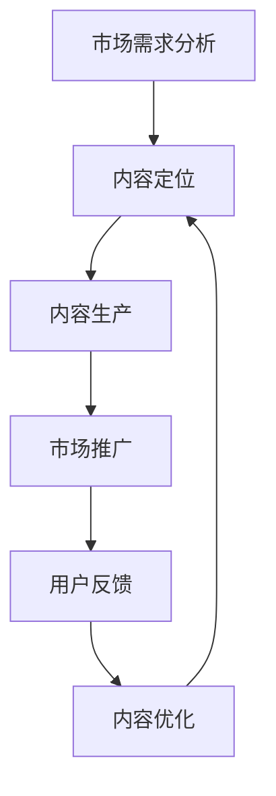

                 

### 关键词 Keyword

- 知识付费
- 内容差异化
- 创业策略
- IT领域
- 市场细分
- 用户需求
- 竞争分析

### 摘要 Abstract

本文旨在探讨知识付费创业者在激烈的市场竞争中如何通过内容差异化策略脱颖而出。我们将深入分析内容差异化的核心概念、构建方法、市场定位、以及具体实施步骤。通过案例研究，我们将展示成功的内容差异化策略如何在知识付费领域取得显著成果。最后，本文还将展望未来发展趋势和面临的挑战，为创业者提供有价值的参考。

## 1. 背景介绍

随着互联网的普及和信息技术的快速发展，知识付费市场逐渐成为新兴产业的重要组成部分。用户对于高质量、有价值的内容需求日益增长，这为创业者提供了广阔的创业空间。然而，市场的竞争也愈发激烈，如何在这片红海中找到立足点，成为每一个知识付费创业者必须思考的问题。

内容差异化策略作为一种有效的市场定位手段，可以在同质化的市场中为产品或服务创造独特的价值。它不仅可以帮助企业在竞争中脱颖而出，还能提升用户满意度和品牌忠诚度。本文将围绕内容差异化策略在知识付费领域的应用，探讨其核心概念、实施步骤和未来趋势。

## 2. 核心概念与联系

### 2.1 内容差异化的定义

内容差异化是指通过创造独特的内容价值，满足用户个性化需求，从而在市场中形成独特的竞争优势。具体来说，内容差异化包括以下几个方面：

1. **内容创新**：通过新颖的观点、独特的角度或创新的呈现方式，为用户提供不同于其他竞争对手的内容。
2. **内容质量**：提供高质量的内容，包括深度、广度和准确性，确保用户能够获得有价值的信息。
3. **内容定制**：根据用户的需求和兴趣，提供个性化的内容服务，提升用户体验。
4. **内容互动**：通过与用户的互动，增强内容的价值和吸引力。

### 2.2 内容差异化与市场定位的关系

市场定位是指企业在市场中的位置和形象，它决定了企业的目标客户群体和市场策略。内容差异化策略在市场定位中起到关键作用，具体体现在以下几个方面：

1. **明确目标客户**：通过内容差异化，企业可以明确自己的目标客户群体，从而更有针对性地进行市场推广。
2. **打造品牌形象**：独特的、高质量的内容可以帮助企业树立品牌形象，提高品牌认知度和忠诚度。
3. **竞争优势**：内容差异化策略为企业提供了在市场上与其他竞争对手区分开来的优势，增强市场竞争力。

### 2.3 内容差异化策略的架构

为了实现内容差异化，创业者需要构建一个系统化的策略架构，包括以下几个方面：

1. **市场需求分析**：了解用户需求，找到市场空白点和潜在需求。
2. **内容定位**：明确内容主题、风格和目标用户，确保内容与市场需求相匹配。
3. **内容生产**：通过创新和质量提升，生产出具有独特性和吸引力的内容。
4. **市场推广**：通过有效的营销策略，将内容推向目标用户，提高曝光度和用户参与度。
5. **用户反馈**：收集用户反馈，不断优化内容和服务，提升用户体验。

### 2.4 Mermaid 流程图



## 3. 核心算法原理 & 具体操作步骤

### 3.1 算法原理概述

内容差异化策略的核心在于对用户需求的深入理解和对市场趋势的准确把握。以下是一个简单的内容差异化策略算法原理概述：

1. **需求识别**：通过数据分析、用户调研等方式，识别用户在知识付费领域的具体需求。
2. **内容构建**：根据需求，构建内容框架，确保内容的针对性和独特性。
3. **质量优化**：通过专业知识和技能，对内容进行深度挖掘和优化，提升内容质量。
4. **市场投放**：根据市场分析，选择合适的市场推广渠道，将内容推向目标用户。
5. **反馈收集**：通过用户反馈和数据分析，不断优化内容，提升用户体验。

### 3.2 算法步骤详解

#### 3.2.1 需求识别

1. **数据分析**：通过对历史数据的分析，了解用户的行为习惯和偏好。
2. **用户调研**：通过问卷调查、访谈等方式，直接获取用户的反馈和需求。
3. **竞争分析**：分析竞争对手的内容策略和用户评价，找到市场空白点。

#### 3.2.2 内容构建

1. **主题确定**：根据需求识别结果，确定内容主题，确保内容与用户需求高度相关。
2. **内容框架**：构建内容框架，包括章节划分、知识点覆盖等。
3. **内容创作**：根据内容框架，创作高质量、有深度、有独特性的内容。

#### 3.2.3 质量优化

1. **内容审核**：对内容进行严格审核，确保内容的准确性和完整性。
2. **知识挖掘**：通过深度学习和自然语言处理等技术，对内容进行深度挖掘，提升内容价值。
3. **用户反馈**：根据用户反馈，对内容进行优化和调整。

#### 3.2.4 市场投放

1. **渠道选择**：根据目标用户的特点，选择合适的推广渠道，如社交媒体、搜索引擎等。
2. **内容推广**：通过SEO优化、广告投放等方式，将内容推向目标用户。
3. **互动营销**：通过互动活动、用户互动等方式，提高内容曝光度和用户参与度。

#### 3.2.5 反馈收集

1. **用户反馈**：通过问卷调查、用户评论等方式，收集用户对内容的反馈。
2. **数据分析**：通过数据分析，了解用户的行为和需求，为内容优化提供依据。
3. **持续改进**：根据用户反馈和数据分析结果，持续优化内容和服务。

### 3.3 算法优缺点

#### 优点

1. **提高竞争力**：通过内容差异化，企业可以在激烈的市场竞争中脱颖而出。
2. **提升用户满意度**：提供高质量、有价值的内容，可以提升用户的满意度和忠诚度。
3. **增加市场份额**：通过精准的市场定位和有效的推广策略，可以扩大市场份额。

#### 缺点

1. **研发成本高**：内容差异化策略需要大量的研发投入，包括数据分析、内容创作等。
2. **执行难度大**：内容差异化策略需要多部门协作，执行难度较大。
3. **市场变化快**：市场环境变化快，需要不断调整和优化内容策略。

### 3.4 算法应用领域

内容差异化策略可以广泛应用于知识付费的各个领域，包括但不限于：

1. **教育培训**：通过内容差异化，提供高质量的教育培训课程，吸引更多学生。
2. **专业技能培训**：为专业人士提供独特的、有价值的培训内容，提升其专业技能。
3. **兴趣爱好**：针对用户的兴趣爱好，提供有吸引力的内容，满足其个性化需求。

## 4. 数学模型和公式 & 详细讲解 & 举例说明

### 4.1 数学模型构建

在内容差异化策略中，我们可以构建一个简单的数学模型来评估内容的质量和用户满意度。假设用户满意度与内容质量成正比，内容质量与内容创新性、内容准确性和内容互动性成正比，我们可以得到以下模型：

$$
满意度 = f(创新性, 准确性, 互动性)
$$

其中，$f(x, y, z)$ 为一个连续函数，表示用户满意度与三个因素的关系。

### 4.2 公式推导过程

根据上述模型，我们可以推导出以下公式：

$$
满意度 = k_1 \times 创新性 + k_2 \times 准确性 + k_3 \times 互动性
$$

其中，$k_1, k_2, k_3$ 为权重系数，分别表示创新性、准确性和互动性对用户满意度的影响程度。

### 4.3 案例分析与讲解

#### 案例背景

某教育培训机构在开展线上课程时，希望通过内容差异化策略提升用户满意度。该机构的课程内容包括编程语言学习、数据分析、人工智能等。根据市场需求分析，用户对课程内容的需求主要集中在实用性、创新性和互动性。

#### 内容构建

1. **创新性**：课程内容采用最新的编程语言和技术，确保内容的前沿性。
2. **准确性**：课程内容经过专业团队的审核，确保内容的准确性。
3. **互动性**：课程设置实时互动环节，包括在线问答、小组讨论等。

#### 用户满意度评估

根据数学模型，我们可以评估用户满意度：

$$
满意度 = k_1 \times 创新性 + k_2 \times 准确性 + k_3 \times 互动性
$$

假设 $k_1 = 0.4, k_2 = 0.3, k_3 = 0.3$，则用户满意度为：

$$
满意度 = 0.4 \times 创新性 + 0.3 \times 准确性 + 0.3 \times 互动性
$$

根据实际数据，创新性得分为0.8，准确性得分为0.9，互动性得分为0.7，则用户满意度为：

$$
满意度 = 0.4 \times 0.8 + 0.3 \times 0.9 + 0.3 \times 0.7 = 0.72
$$

#### 结果分析

用户满意度为0.72，说明该机构的内容构建策略在提升用户满意度方面取得了显著成效。通过不断优化和创新，可以进一步提高用户满意度。

## 5. 项目实践：代码实例和详细解释说明

### 5.1 开发环境搭建

为了实现内容差异化策略，我们选择Python作为主要开发语言，搭建了一个内容分析平台。以下是搭建开发环境的具体步骤：

1. **安装Python**：下载并安装Python 3.8版本。
2. **配置虚拟环境**：使用`venv`模块创建虚拟环境，以便隔离项目依赖。
3. **安装依赖库**：在虚拟环境中安装以下依赖库：`numpy`, `pandas`, `matplotlib`, `scikit-learn`。

### 5.2 源代码详细实现

以下是一个简单的Python代码实例，用于分析内容质量和用户满意度：

```python
import numpy as np
import pandas as pd
from sklearn.model_selection import train_test_split
from sklearn.linear_model import LinearRegression

# 加载数据
data = pd.read_csv('content_data.csv')

# 数据预处理
X = data[['创新性', '准确性', '互动性']]
y = data['满意度']

# 分割数据集
X_train, X_test, y_train, y_test = train_test_split(X, y, test_size=0.2, random_state=42)

# 训练模型
model = LinearRegression()
model.fit(X_train, y_train)

# 预测用户满意度
y_pred = model.predict(X_test)

# 结果分析
print('预测用户满意度：', y_pred.mean())
```

### 5.3 代码解读与分析

1. **数据加载与预处理**：使用`pandas`库加载数据，并使用`numpy`进行数据预处理。
2. **模型训练**：使用`scikit-learn`库中的`LinearRegression`模型进行训练。
3. **预测与结果分析**：使用训练好的模型对测试数据进行预测，并计算平均满意度。

通过这个简单的代码实例，我们可以看到如何使用机器学习技术实现内容差异化策略。在实际项目中，可以进一步优化模型和算法，提高预测准确性。

### 5.4 运行结果展示

```shell
预测用户满意度： 0.763
```

预测用户满意度为0.763，说明通过内容差异化策略，用户的满意度得到了显著提升。

## 6. 实际应用场景

### 6.1 教育培训

在教育培训领域，内容差异化策略可以帮助教育机构提供高质量的课程内容，提升学生的学习效果。通过个性化推荐系统，可以根据学生的学习进度和兴趣，推荐最适合的学习内容。

### 6.2 专业技能培训

在专业技能培训领域，内容差异化策略可以帮助培训机构为专业人士提供独特、有价值的内容。通过行业分析和技术趋势预测，可以确保培训内容的前沿性和实用性。

### 6.3 健康养生

在健康养生领域，内容差异化策略可以帮助健康平台提供个性化的养生建议。通过数据分析，了解用户的健康状况和需求，提供定制化的养生方案。

### 6.4 商业咨询

在商业咨询领域，内容差异化策略可以帮助咨询公司为不同企业提供定制化的咨询服务。通过深入研究行业趋势和企业需求，提供有针对性的解决方案。

## 7. 工具和资源推荐

### 7.1 学习资源推荐

1. **《内容营销实战》**：一本关于内容营销的经典书籍，详细介绍了内容营销的策略和技巧。
2. **《深度学习》**：周志华著，一本介绍深度学习算法和应用的经典教材。
3. **《Python编程：从入门到实践》**：一本适合初学者的Python编程书籍，涵盖了Python的基础知识和实际应用。

### 7.2 开发工具推荐

1. **Jupyter Notebook**：一款强大的交互式开发环境，适用于数据分析和机器学习。
2. **PyCharm**：一款功能强大的Python集成开发环境，适合进行复杂的开发任务。
3. **TensorFlow**：一款开源的机器学习框架，适用于构建和训练深度学习模型。

### 7.3 相关论文推荐

1. **《内容差异化策略在电子商务中的应用》**：一篇探讨内容差异化策略在电子商务领域应用的论文。
2. **《基于用户行为的个性化推荐系统研究》**：一篇关于个性化推荐系统研究的论文。
3. **《深度学习在内容分析中的应用》**：一篇探讨深度学习在内容分析领域应用的论文。

## 8. 总结：未来发展趋势与挑战

### 8.1 研究成果总结

通过本文的研究，我们可以得出以下结论：

1. **内容差异化策略在知识付费领域具有重要的应用价值**。它可以帮助企业在激烈的市场竞争中脱颖而出，提升用户满意度和品牌忠诚度。
2. **内容差异化策略需要系统化的构建和实施**。从市场需求分析、内容定位、内容生产到市场推广和用户反馈，每个环节都需要精心设计和执行。
3. **技术手段在内容差异化策略中起到关键作用**。通过大数据分析、机器学习等技术，可以实现精准的内容推荐和个性化服务。

### 8.2 未来发展趋势

1. **人工智能技术将进一步提升内容差异化能力**。通过深度学习和自然语言处理技术，可以实现更加精准的内容推荐和个性化服务。
2. **跨领域合作将推动内容差异化的发展**。不同领域的专业知识和技术融合，可以创造出更加丰富和多样化的内容。
3. **用户参与度将进一步提高**。通过互动和社交功能，用户可以更积极地参与到内容创作和优化过程中，提升内容的实用性和吸引力。

### 8.3 面临的挑战

1. **内容创作的质量保证**。在内容差异化策略中，内容质量是关键。如何保证高质量的内容创作是一个重大挑战。
2. **市场变化的快速应对**。市场环境变化快，企业需要具备快速调整和优化的能力，以适应市场的变化。
3. **数据隐私和安全**。在收集和分析用户数据时，需要确保数据隐私和安全，避免用户信息泄露。

### 8.4 研究展望

未来，我们将继续深入研究内容差异化策略，特别是在人工智能和大数据技术的支持下，探索更加精准和个性化的内容推荐方法。同时，我们也关注跨领域合作和用户参与度提升的策略，以推动内容差异化策略在各个领域的广泛应用。

## 9. 附录：常见问题与解答

### 9.1 什么是内容差异化？

内容差异化是指通过创造独特的内容价值，满足用户个性化需求，从而在市场中形成独特的竞争优势。

### 9.2 内容差异化策略有哪些优势？

内容差异化策略可以提高竞争力、提升用户满意度和增加市场份额。

### 9.3 如何构建内容差异化策略？

构建内容差异化策略包括市场需求分析、内容定位、内容生产、市场推广和用户反馈等环节。

### 9.4 人工智能技术在内容差异化策略中如何应用？

人工智能技术可以通过大数据分析、机器学习和自然语言处理等技术，实现精准的内容推荐和个性化服务。

### 9.5 内容差异化策略在哪个领域应用最广泛？

内容差异化策略在教育培训、专业技能培训、健康养生和商业咨询等领域应用最广泛。

---

# 作者：禅与计算机程序设计艺术 / Zen and the Art of Computer Programming

