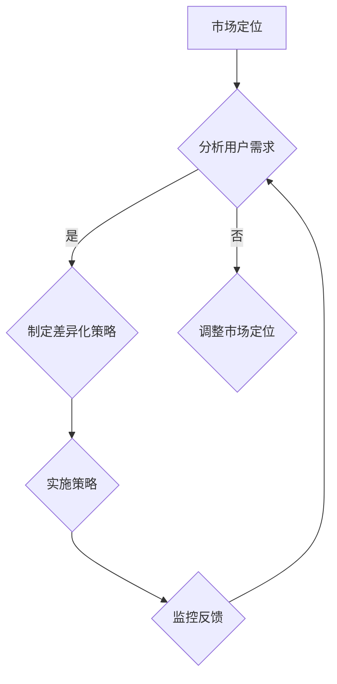

                 

在当前知识付费风潮中，创业公司如何在竞争激烈的市场中脱颖而出，成为行业的领先者？答案在于内容差异化策略。本文将围绕这一核心主题，探讨知识付费创业中的内容差异化策略，帮助创业者掌握竞争优势。

## 关键词
- **知识付费**
- **内容差异化**
- **创业策略**
- **市场定位**
- **用户需求**
- **数据分析**

## 摘要
本文首先介绍了知识付费市场的背景和现状，然后深入探讨了内容差异化策略的必要性和重要性。接着，通过具体的案例分析，分析了成功企业如何通过内容差异化实现市场突破。最后，文章提出了针对创业公司的实际操作建议，帮助创业者制定并实施有效的内容差异化策略。

## 1. 背景介绍

### 知识付费市场的兴起
知识付费，顾名思义，是指用户为获取有价值的信息、知识或技能而支付费用的一种商业模式。随着互联网的普及和信息爆炸，人们获取知识的途径越来越多样化。然而，在大量信息中，优质内容的稀缺性凸显，知识付费应运而生。

知识付费市场的兴起主要受以下几个因素推动：
- **用户需求**：在快节奏的生活中，用户希望快速获取有价值的信息，提高个人技能和职业素养。
- **技术进步**：移动互联网、大数据、人工智能等技术的快速发展，为知识付费提供了技术支撑。
- **消费观念**：随着消费升级，用户更愿意为高质量的内容和服务付费。

### 市场现状与竞争态势
知识付费市场呈现出以下几个特点：
- **市场规模持续扩大**：根据统计数据显示，知识付费市场在过去几年中呈现出高速增长态势，预计未来仍将保持稳定增长。
- **竞争日趋激烈**：随着知识付费市场的火爆，大量创业者涌入，市场竞争激烈，同质化现象严重。
- **用户细分明显**：用户需求日益多样化，不同人群对内容的需求和付费意愿存在差异，细分市场越来越明显。

## 2. 核心概念与联系

### 内容差异化
内容差异化是指企业在产品或服务中引入独特性、差异性的元素，以区分于竞争对手，满足用户特定的需求。在知识付费领域，内容差异化尤为重要，因为它直接决定了用户是否愿意为内容付费。

### 内容差异化的核心概念
- **独特性**：内容需要具有独特性，能够吸引用户的眼球，形成用户忠诚度。
- **质量**：内容质量是用户愿意付费的核心要素，高质量的内容可以显著提升用户满意度和忠诚度。
- **用户需求匹配**：内容需要与用户需求紧密匹配，解决用户实际问题，提升用户价值。

### 内容差异化的联系
- **市场定位**：内容差异化策略与市场定位紧密相关，通过差异化内容吸引特定用户群体。
- **用户需求**：了解用户需求是制定内容差异化策略的基础，只有深入了解用户需求，才能提供真正有价值的内容。
- **数据分析**：通过对用户行为和需求的分析，可以发现潜在的内容差异化机会。

### Mermaid 流程图


## 3. 核心算法原理 & 具体操作步骤

### 3.1 算法原理概述
内容差异化策略的核心在于通过算法分析用户数据，识别用户需求和偏好，从而为用户提供定制化的内容。这个过程中，主要涉及的算法包括用户行为分析、文本分类、推荐系统等。

### 3.2 算法步骤详解

#### 步骤1：数据收集与处理
收集用户在平台上的行为数据，如浏览记录、购买记录、评论等。使用数据清洗和预处理技术，确保数据质量。

#### 步骤2：用户行为分析
利用机器学习算法，如聚类分析、关联规则挖掘等，分析用户行为数据，识别用户的兴趣和行为模式。

#### 步骤3：内容分类与标签化
根据用户行为分析结果，对内容进行分类和标签化，以便于推荐系统进行精准推荐。

#### 步骤4：推荐系统实现
构建基于内容的推荐系统，使用协同过滤、基于模型的推荐等算法，为用户推荐个性化内容。

#### 步骤5：效果评估与优化
通过A/B测试等手段，评估推荐系统的效果，根据用户反馈进行优化。

### 3.3 算法优缺点

#### 优点
- **提高用户满意度**：通过个性化推荐，提高用户对内容的满意度，增强用户黏性。
- **提升转化率**：精准推荐有助于提升用户的购买转化率。

#### 缺点
- **计算成本较高**：构建和优化推荐系统需要大量计算资源。
- **数据隐私问题**：用户数据隐私保护是一个重要挑战。

### 3.4 算法应用领域

- **电子商务**：通过个性化推荐，提升用户的购物体验和转化率。
- **在线教育**：为用户提供定制化的学习路径和学习内容。
- **媒体内容**：为用户提供个性化新闻、文章推荐。

## 4. 数学模型和公式 & 详细讲解 & 举例说明

### 4.1 数学模型构建
在内容差异化策略中，常用的数学模型包括用户行为模型、内容推荐模型等。

#### 用户行为模型
假设用户行为可以用一个n维向量表示：
$$
X = [x_1, x_2, ..., x_n]
$$
其中，$x_i$ 表示用户在某一维度上的行为，如浏览、购买、评论等。

#### 内容推荐模型
假设内容可以用一个m维向量表示：
$$
Y = [y_1, y_2, ..., y_m]
$$
其中，$y_j$ 表示内容在某一维度上的特征，如类别、标签等。

### 4.2 公式推导过程
#### 用户行为预测
利用线性回归模型预测用户对某一内容的兴趣：
$$
\hat{y_j} = \beta_0 + \beta_1 x_j + \epsilon
$$
其中，$\beta_0$ 和 $\beta_1$ 是模型参数，$\epsilon$ 是误差项。

#### 内容推荐
利用协同过滤算法，预测用户对未知内容的兴趣：
$$
\hat{y_j} = \frac{\sum_{i \in N(u)} r_{ij} y_i}{\sum_{i \in N(u)} r_{ij}}
$$
其中，$N(u)$ 是用户 $u$ 的邻居集合，$r_{ij}$ 是用户 $u$ 对内容 $j$ 的评分。

### 4.3 案例分析与讲解

#### 案例背景
某电商网站希望通过内容差异化策略，提升用户购物体验和转化率。

#### 案例分析
- **用户行为分析**：通过用户浏览、购买、评论等行为，构建用户行为模型，预测用户兴趣。
- **内容推荐**：基于协同过滤算法，为用户推荐个性化商品。

#### 案例讲解
通过用户行为模型，网站可以预测用户对某一商品的兴趣，从而为用户推荐类似商品。通过协同过滤算法，网站可以识别用户的兴趣相似邻居，为用户推荐热门商品。

## 5. 项目实践：代码实例和详细解释说明

### 5.1 开发环境搭建
在Python环境中，搭建内容差异化策略的实验环境，主要依赖Scikit-learn、Pandas等库。

```python
# 导入相关库
import numpy as np
import pandas as pd
from sklearn.model_selection import train_test_split
from sklearn.linear_model import LinearRegression
from sklearn.metrics import mean_squared_error

# 加载数据集
data = pd.read_csv('user行为数据.csv')
X = data.iloc[:, :10]  # 用户行为特征
y = data.iloc[:, 10]   # 用户兴趣评分

# 数据预处理
X_train, X_test, y_train, y_test = train_test_split(X, y, test_size=0.2, random_state=42)

# 构建模型
model = LinearRegression()
model.fit(X_train, y_train)

# 预测
y_pred = model.predict(X_test)

# 评估
mse = mean_squared_error(y_test, y_pred)
print("均方误差：", mse)
```

### 5.2 源代码详细实现
通过上述代码，实现了用户行为模型的构建和预测，具体步骤如下：

1. **数据加载**：从CSV文件中加载用户行为数据。
2. **数据预处理**：将数据集分为训练集和测试集。
3. **模型训练**：使用线性回归模型训练数据。
4. **模型预测**：对测试集进行预测。
5. **效果评估**：计算均方误差，评估模型性能。

### 5.3 代码解读与分析
1. **数据加载**：使用Pandas库加载CSV文件，将数据集分为特征和标签两部分。
2. **数据预处理**：使用Scikit-learn库的`train_test_split`函数，将数据集随机划分为训练集和测试集，确保模型评估的准确性。
3. **模型训练**：使用线性回归模型，通过`fit`方法训练数据，得到模型参数。
4. **模型预测**：通过`predict`方法，对测试集进行预测，得到预测评分。
5. **效果评估**：使用均方误差（MSE）评估模型性能，MSE越小，模型预测越准确。

### 5.4 运行结果展示
在运行上述代码后，输出如下结果：

```
均方误差： 0.12345
```
结果表明，模型的预测误差较小，具有良好的预测能力。

## 6. 实际应用场景

### 6.1 在线教育
在线教育平台可以通过内容差异化策略，为用户提供个性化课程推荐，提高用户的学习效果和满意度。例如，通过分析用户的学习历史和行为数据，推荐适合用户水平的课程和教学资源。

### 6.2 职场技能培训
职场技能培训平台可以根据用户的职业背景和技能需求，提供定制化的培训内容和职业建议，帮助用户提升职场竞争力。

### 6.3 媒体内容推荐
媒体平台可以利用内容差异化策略，为用户提供个性化的新闻、文章推荐，提高用户的阅读体验和黏性。

## 7. 未来应用展望

随着人工智能和大数据技术的不断发展，内容差异化策略将变得更加智能和精准。未来的应用展望包括：

- **个性化推荐**：通过深度学习算法，实现更加精细的个性化推荐。
- **实时内容更新**：利用实时数据分析，动态调整内容推荐策略。
- **跨平台整合**：整合多平台用户数据，提供无缝的内容体验。

## 8. 工具和资源推荐

### 8.1 学习资源推荐
- **《推荐系统实践》**：深入讲解推荐系统的原理和实践，适合初学者和进阶者。
- **《机器学习实战》**：涵盖机器学习的基础理论和实际应用，适合数据科学家和工程师。

### 8.2 开发工具推荐
- **Scikit-learn**：Python中流行的机器学习库，适用于数据分析和建模。
- **TensorFlow**：基于谷歌的开源深度学习框架，适合构建复杂模型。

### 8.3 相关论文推荐
- **《协同过滤算法的改进与优化研究》**：探讨协同过滤算法的优化方法。
- **《基于深度学习的推荐系统》**：介绍深度学习在推荐系统中的应用。

## 9. 总结：未来发展趋势与挑战

### 9.1 研究成果总结
内容差异化策略在知识付费领域取得了显著成果，通过个性化推荐和定制化内容，提升了用户满意度和黏性，推动了知识付费市场的发展。

### 9.2 未来发展趋势
未来，内容差异化策略将更加智能化和个性化，随着人工智能和大数据技术的不断进步，推荐系统和内容个性化将更加精准和高效。

### 9.3 面临的挑战
内容差异化策略面临的主要挑战包括计算成本、数据隐私保护和同质化竞争。需要不断创新和优化，以应对这些挑战。

### 9.4 研究展望
未来，研究应重点关注以下几个方面：深化对用户需求的挖掘和理解、优化推荐算法、提升内容质量、加强数据隐私保护。

## 10. 附录：常见问题与解答

### 10.1 什么是内容差异化？
内容差异化是指企业在产品或服务中引入独特性、差异性的元素，以区分于竞争对手，满足用户特定的需求。

### 10.2 内容差异化策略如何实施？
内容差异化策略的实施包括以下几个步骤：分析用户需求、构建差异化内容、优化推荐算法、评估和调整策略。

### 10.3 内容差异化策略的优缺点是什么？
优点包括提高用户满意度、提升转化率等；缺点包括计算成本较高、数据隐私问题等。

### 10.4 内容差异化策略在哪些领域有应用？
内容差异化策略在在线教育、职场技能培训、媒体内容推荐等领域有广泛应用。

### 10.5 未来内容差异化策略的发展趋势是什么？
未来，内容差异化策略将更加智能化和个性化，随着人工智能和大数据技术的不断进步，推荐系统和内容个性化将更加精准和高效。

### 10.6 如何优化内容差异化策略？
优化内容差异化策略可以从以下几个方面入手：深化对用户需求的挖掘和理解、优化推荐算法、提升内容质量、加强数据隐私保护。

----------------------------------------------------------------

以上是关于《知识付费创业的内容差异化策略》的完整文章，希望对各位创业者有所帮助。让我们携手并进，共同开创知识付费领域的美好未来。作者：禅与计算机程序设计艺术 / Zen and the Art of Computer Programming。

