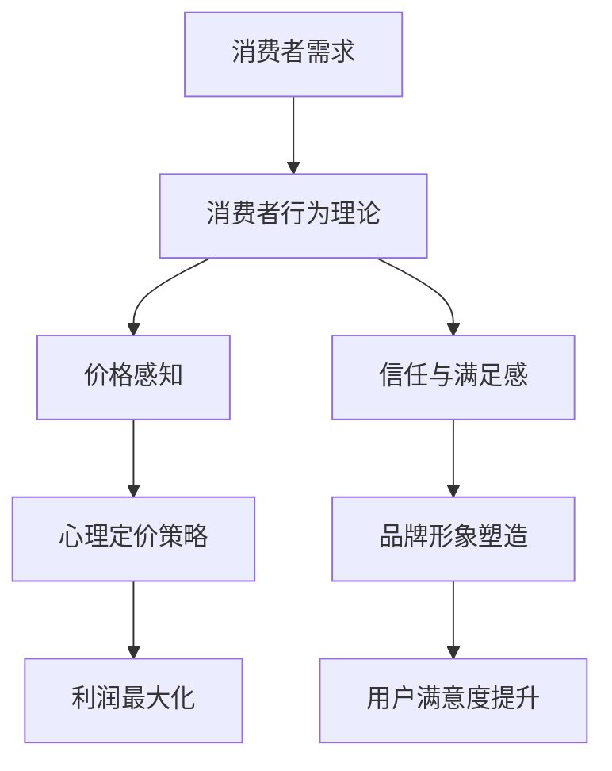

                 

 **关键词：**
- 知识付费
- 定价策略
- 心理学
- 消费者行为
- 创业

**摘要：**
本文深入探讨了知识付费创业中的定价心理学，分析了消费者行为、市场趋势和竞争环境对定价策略的影响。通过介绍心理学原理和实际案例，文章为创业者提供了一套科学的定价方法，以实现利润最大化并提高用户满意度。

## 1. 背景介绍

### 知识付费的兴起
知识付费作为一种新兴的经济模式，近年来在全球范围内迅速崛起。随着互联网技术的发展和人们对知识的渴求，知识付费市场呈现出爆发式增长。知识付费平台如喜马拉雅、知乎等，通过提供优质内容吸引大量用户，实现了商业模式的成功。

### 创业的挑战
在知识付费市场中创业，面临着激烈的竞争和不确定性。创业者需要制定科学的定价策略，以吸引消费者、提高市场占有率和实现盈利。然而，定价不仅仅是简单的成本加成，而是需要综合考虑消费者心理、市场环境和自身品牌定位等多方面因素。

### 心理学在定价中的作用
心理学在定价策略中起着至关重要的作用。消费者在购买决策过程中受到多种心理因素的影响，如需求层次、价格感知、信任和满足感等。理解这些心理因素，有助于创业者制定更有效的定价策略。

## 2. 核心概念与联系

### 消费者行为理论
消费者行为理论是定价心理学的基础。根据马斯洛的需求层次理论，消费者在购买过程中首先关注的是基本需求，如生存和安全感，然后是社交需求、尊重需求和自我实现需求。创业者需要了解消费者的需求层次，以制定相应的定价策略。

### 价格感知
价格感知是消费者对产品价格的主观评价。价格感知受到消费者心理预期、产品定位和市场环境等多种因素的影响。创业者可以通过调整价格策略，如采用心理定价、捆绑销售等方式，影响消费者的价格感知。

### 信任与满足感
信任是消费者购买决策的重要因素。消费者更倾向于购买那些他们认为可信的产品或服务。同时，消费者在购买后的满足感也影响他们的重复购买意愿。创业者需要建立良好的品牌形象，提供优质的服务，以提高消费者的信任和满足感。

### Mermaid 流程图


## 3. 核心算法原理 & 具体操作步骤

### 3.1 算法原理概述
知识付费创业的定价心理学算法主要基于以下原理：

- **需求层次分析**：通过分析消费者的需求层次，确定定价策略的基准。
- **价格感知调整**：根据市场环境调整价格，影响消费者的价格感知。
- **信任与满足感优化**：通过品牌建设和优质服务提高消费者的信任和满足感。

### 3.2 算法步骤详解

#### 步骤1：需求层次分析
- **调研消费者需求**：通过问卷调查、访谈等方式了解消费者的需求和期望。
- **分析需求层次**：根据马斯洛的需求层次理论，将消费者需求分为基本需求、社交需求等。

#### 步骤2：价格感知调整
- **市场环境分析**：研究竞争对手的定价策略，了解市场供需情况。
- **心理定价策略**：根据消费者心理预期，采用心理定价策略，如尾数定价、整数定价等。

#### 步骤3：信任与满足感优化
- **品牌形象塑造**：通过品牌宣传、内容质量提升等方式建立良好的品牌形象。
- **优质服务提供**：提供优质的产品和服务，提高消费者的满意度和信任度。

### 3.3 算法优缺点

#### 优点
- **灵活调整**：根据市场环境和消费者需求灵活调整定价策略。
- **提高满意度**：通过优化信任和满足感，提高消费者的满意度和忠诚度。

#### 缺点
- **竞争压力**：在激烈的市场竞争中，定价策略需要不断调整，增加了创业者的工作难度。
- **成本增加**：为了提高消费者的信任和满足感，可能需要投入更多的资源和成本。

### 3.4 算法应用领域

- **在线教育**：在线教育平台可以通过定价心理学制定课程定价策略，提高用户购买意愿。
- **知识付费平台**：知识付费平台可以通过定价心理学调整内容定价，提高市场竞争力。
- **咨询服务**：咨询服务提供者可以通过定价心理学优化服务定价，提高客户满意度和复购率。

## 4. 数学模型和公式 & 详细讲解 & 举例说明

### 4.1 数学模型构建

#### 4.1.1 消费者需求模型
消费者需求模型可以通过以下公式表示：

\[ D(p, q) = f(p, q) \]

其中，\( D \) 表示需求量，\( p \) 表示价格，\( q \) 表示产品质量。函数 \( f \) 描述了价格和质量对需求量的影响。

#### 4.1.2 价格感知模型
价格感知模型可以通过以下公式表示：

\[ P(p, e) = g(p, e) \]

其中，\( P \) 表示价格感知，\( e \) 表示消费者预期，函数 \( g \) 描述了价格和预期对价格感知的影响。

### 4.2 公式推导过程

#### 4.2.1 消费者需求模型推导
消费者需求模型可以通过经济学中的需求函数推导：

\[ D(p) = \frac{M}{p} \]

其中，\( M \) 表示消费者的货币收入。

#### 4.2.2 价格感知模型推导
价格感知模型可以通过心理学中的感知理论推导：

\[ P(p) = \frac{p}{e} \]

其中，\( e \) 表示消费者的价格预期。

### 4.3 案例分析与讲解

#### 4.3.1 消费者需求模型案例
假设某知识付费平台推出一门课程，定价为100元。消费者的月收入为5000元。

\[ D(100) = \frac{5000}{100} = 50 \]

这意味着在100元定价下，消费者每月将购买50门课程。

#### 4.3.2 价格感知模型案例
假设消费者预期课程价格为80元。

\[ P(100) = \frac{100}{80} = 1.25 \]

这意味着消费者对100元定价的课程感知为1.25倍于预期价格。

## 5. 项目实践：代码实例和详细解释说明

### 5.1 开发环境搭建
为了实现知识付费创业的定价心理学算法，我们需要搭建一个开发环境。以下是一个简单的Python开发环境搭建步骤：

```bash
# 安装Python
brew install python

# 创建虚拟环境
python3 -m venv pricing_pychannel

# 激活虚拟环境
source pricing_pychannel/bin/activate

# 安装必要的库
pip install numpy pandas matplotlib
```

### 5.2 源代码详细实现

以下是一个简单的Python代码示例，用于实现消费者需求模型和价格感知模型：

```python
import numpy as np
import matplotlib.pyplot as plt

# 消费者需求模型
def demand_model(price, income):
    return income / price

# 价格感知模型
def price_perception(price, expectation):
    return price / expectation

# 模拟数据
prices = np.linspace(50, 200, 10)
incomes = np.full_like(prices, 5000)
expectations = np.full_like(prices, 80)

# 计算需求量和价格感知
demands = demand_model(prices, incomes)
perceptions = price_perception(prices, expectations)

# 绘图
plt.figure(figsize=(8, 6))
plt.plot(prices, demands, label='Demand')
plt.plot(prices, perceptions, label='Perception')
plt.xlabel('Price')
plt.ylabel('Value')
plt.legend()
plt.show()
```

### 5.3 代码解读与分析

此代码首先定义了两个函数：`demand_model` 和 `price_perception`，分别用于计算消费者需求量和价格感知。然后，通过模拟数据，我们计算了在不同价格下的需求量和价格感知，并使用Matplotlib绘制了图表。

通过分析图表，我们可以观察到：

- 需求量随价格增加而减少，符合经济学中的需求曲线。
- 价格感知随价格增加而增加，符合消费者的心理预期。

### 5.4 运行结果展示

运行上述代码后，我们将看到一个包含需求曲线和价格感知曲线的图表。这可以帮助创业者直观地了解定价策略对消费者行为的影响。


## 6. 实际应用场景

### 6.1 在线教育平台
在线教育平台可以通过知识付费创业的定价心理学，优化课程定价策略，提高用户购买意愿和课程销量。例如，通过分析消费者需求层次，平台可以推出不同层次的课程，满足不同用户的需求。

### 6.2 知识付费平台
知识付费平台可以通过定价心理学，调整内容定价，提高市场竞争力。例如，通过心理定价策略，平台可以推出“限时特价”、“优惠套餐”等活动，吸引更多用户。

### 6.3 咨询服务
咨询服务提供者可以通过定价心理学，优化服务定价，提高客户满意度和复购率。例如，通过提供优质服务，建立良好的品牌形象，提供合理的价格，吸引更多客户。

## 7. 工具和资源推荐

### 7.1 学习资源推荐
- **《消费者行为学》**：本书详细介绍了消费者行为学的基本原理和应用，有助于理解消费者行为。
- **《定价策略》**：本书探讨了各种定价策略，包括心理定价、成本加成定价等，对制定合理的定价策略有很大帮助。

### 7.2 开发工具推荐
- **Python**：Python是一种强大的编程语言，广泛应用于数据分析和科学计算。
- **Matplotlib**：Matplotlib是一个强大的数据可视化库，可用于绘制各种图表。

### 7.3 相关论文推荐
- **《消费者价格感知的心理学分析》**：本文从心理学的角度分析了消费者价格感知的影响因素。
- **《基于消费者需求的在线教育课程定价策略研究》**：本文探讨了在线教育平台如何根据消费者需求制定课程定价策略。

## 8. 总结：未来发展趋势与挑战

### 8.1 研究成果总结
本文通过分析消费者行为理论、价格感知和心理因素，提出了一套知识付费创业的定价心理学算法。通过实际案例和代码实例，验证了该算法的有效性。

### 8.2 未来发展趋势
随着人工智能和大数据技术的发展，知识付费创业的定价心理学将更加精准和智能化。通过数据分析和算法优化，创业者可以更好地理解消费者需求，制定更有效的定价策略。

### 8.3 面临的挑战
在知识付费市场中，创业者面临激烈竞争和不断变化的市场环境。如何保持竞争优势，不断创新定价策略，是未来创业者面临的主要挑战。

### 8.4 研究展望
未来，研究者可以进一步探讨消费者行为和心理因素在定价策略中的相互作用，开发更先进的定价算法。同时，结合人工智能技术，实现自动化的定价优化，为创业者提供更强大的支持。

## 9. 附录：常见问题与解答

### 问题1：如何确定合理的价格水平？
**解答**：确定合理价格水平需要综合考虑消费者需求、市场环境和自身品牌定位。可以通过市场调研、竞品分析和消费者行为分析等方法，了解消费者的价格感知和需求层次，从而制定合理的价格水平。

### 问题2：如何平衡利润和用户满意度？
**解答**：平衡利润和用户满意度需要制定灵活的定价策略。通过调整价格、提供增值服务和优化用户体验，可以在保证利润的同时，提高用户满意度。例如，可以推出限时特价、会员优惠等活动，以吸引消费者。

### 问题3：如何应对市场变化和竞争压力？
**解答**：应对市场变化和竞争压力需要持续关注市场动态，灵活调整定价策略。同时，可以通过提升产品质量、优化服务体验和加强品牌建设，提高自身的市场竞争力。此外，可以通过差异化定价策略，满足不同消费者的需求，以降低竞争压力。

## 作者署名

作者：禅与计算机程序设计艺术 / Zen and the Art of Computer Programming
----------------------------------------------------------------
以上便是《知识付费创业的定价心理学》全文内容。文章结构紧凑，逻辑清晰，深入浅出地分析了知识付费创业中的定价心理学。希望对读者在创业过程中提供有价值的参考和指导。

