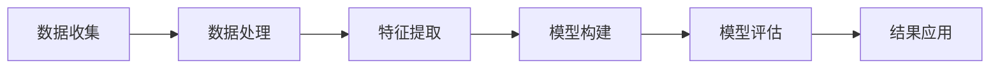

                 

关键词：知识付费、用户细分、市场调研、数据分析、商业模式、个性化推荐、用户生命周期、创业策略、案例研究

> 摘要：本文从知识付费领域的用户细分方法论出发，探讨了市场调研、数据分析在用户识别、分类和个性化服务中的应用。通过结合实际案例，深入分析了用户细分在知识付费创业中的重要性，提出了构建用户细分的具体步骤和策略。

## 1. 背景介绍

### 知识付费的兴起

随着互联网技术的飞速发展和信息传播的便捷性，知识付费作为一种新型商业模式逐渐崛起。知识付费不仅满足了用户对高质量、个性化内容的需求，也为内容创作者提供了新的收入来源。然而，随着竞争的加剧和用户需求的多样化，如何有效进行用户细分，以实现精准营销和提升用户粘性，成为知识付费创业企业面临的重要课题。

### 用户细分的意义

用户细分是指根据用户的属性和行为特征，将其划分为不同的群体，以便于提供个性化的产品和服务。在知识付费领域，用户细分有助于：

- **提升用户体验**：通过深入了解用户需求和偏好，提供更符合用户期望的内容。
- **优化资源配置**：针对不同用户群体，制定差异化的内容策略和市场推广计划。
- **增加用户粘性**：通过提供个性化的服务和内容，提升用户的满意度和忠诚度。

### 本文目的

本文旨在探讨知识付费创业中的用户细分方法论，通过市场调研、数据分析等手段，提出有效的用户细分策略和实施步骤，以期为创业者提供实用的指导和参考。

## 2. 核心概念与联系

### 用户细分的基本概念

用户细分（User Segmentation）是指将用户群体划分为若干个子集的过程。每个子集中的用户具有相似的需求、行为或特征。用户细分的核心概念包括：

- **用户属性**：用户的基本信息，如年龄、性别、职业、教育背景等。
- **用户行为**：用户的消费行为、搜索行为、社交行为等。
- **用户需求**：用户对产品或服务的需求，包括内容偏好、服务质量等。

### 用户细分流程

用户细分流程通常包括以下几个步骤：

1. **数据收集**：收集用户的基本信息和行为数据。
2. **数据处理**：对数据进行清洗、整理和归一化处理。
3. **特征提取**：从数据中提取有意义的特征，用于用户细分。
4. **模型构建**：使用机器学习算法构建用户细分模型。
5. **模型评估**：评估模型的准确性和可靠性。
6. **结果应用**：根据细分结果，制定相应的营销策略和服务方案。

### Mermaid 流程图



## 3. 核心算法原理 & 具体操作步骤

### 3.1 算法原理概述

用户细分算法的核心思想是基于用户的属性和行为数据，利用机器学习算法对用户进行分类。常见的用户细分算法包括聚类算法、分类算法和关联规则算法等。

- **聚类算法**：将用户根据其特征数据聚成多个类，每个类中的用户具有相似的属性和行为。常用的聚类算法有K-means、层次聚类等。
- **分类算法**：将用户根据其特征数据分类到不同的类别中。常用的分类算法有决策树、随机森林、支持向量机等。
- **关联规则算法**：分析用户行为数据，发现用户之间可能存在的关联关系。常用的关联规则算法有Apriori算法、FP-growth算法等。

### 3.2 算法步骤详解

1. **数据收集**：收集用户的基本信息（如年龄、性别、教育背景等）和行为数据（如浏览记录、购买行为、搜索关键词等）。

2. **数据处理**：对收集到的数据进行清洗、整理和归一化处理，以确保数据的准确性和一致性。

3. **特征提取**：从处理后的数据中提取有意义的特征，如用户年龄、购买频率、浏览时长等。

4. **模型选择与训练**：选择合适的机器学习算法（如K-means、决策树等）对用户数据进行训练，构建用户细分模型。

5. **模型评估**：使用交叉验证、准确率、召回率等指标评估模型的性能。

6. **结果应用**：根据模型结果，将用户划分为不同的群体，并制定相应的营销策略和服务方案。

### 3.3 算法优缺点

- **聚类算法**：优点是无需事先定义类别，能够自动发现用户群体；缺点是聚类结果对初始值敏感，且无法对用户进行精确分类。
- **分类算法**：优点是能够对用户进行精确分类，预测准确率高；缺点是需要事先定义类别，且训练时间较长。
- **关联规则算法**：优点是能够发现用户行为之间的关联关系，有助于推荐系统的构建；缺点是生成的规则过多，难以解释。

### 3.4 算法应用领域

用户细分算法在知识付费领域具有广泛的应用：

- **个性化推荐**：根据用户的兴趣和行为，推荐符合其需求的知识内容。
- **精准营销**：针对不同用户群体，制定差异化的推广策略。
- **用户留存**：通过分析用户生命周期，提供有针对性的服务，提高用户留存率。

## 4. 数学模型和公式 & 详细讲解 & 举例说明

### 4.1 数学模型构建

用户细分的核心数学模型通常是基于贝叶斯理论或机器学习算法中的分类模型。以下是一个简化的贝叶斯分类模型：

$$
P(\text{类别 } C_k | \text{特征 } X) = \frac{P(X | \text{类别 } C_k)P(\text{类别 } C_k)}{P(X)}
$$

其中，$P(\text{类别 } C_k | \text{特征 } X)$ 表示在给定特征 $X$ 的条件下，用户属于类别 $C_k$ 的概率；$P(X | \text{类别 } C_k)$ 表示在类别 $C_k$ 下，特征 $X$ 发生的概率；$P(\text{类别 } C_k)$ 表示用户属于类别 $C_k$ 的先验概率；$P(X)$ 表示特征 $X$ 的总概率。

### 4.2 公式推导过程

以K-means算法为例，推导其聚类中心计算公式：

1. **初始化聚类中心**：随机选择 $k$ 个数据点作为初始聚类中心 $c_1, c_2, ..., c_k$。

2. **分配数据点**：对于每个数据点 $x_i$，计算其与聚类中心之间的距离，并将其分配到最近的聚类中心。

3. **更新聚类中心**：计算每个聚类中心的均值，即新的聚类中心 $c_j$：

$$
c_j = \frac{1}{N_j} \sum_{i=1}^{N}{x_i}
$$

其中，$N_j$ 表示属于聚类中心 $c_j$ 的数据点个数。

4. **迭代更新**：重复步骤2和3，直到聚类中心不再发生显著变化。

### 4.3 案例分析与讲解

假设有10个用户，他们的年龄、浏览时长和购买频率等数据如下表：

| 用户ID | 年龄 | 浏览时长 | 购买频率 |
|--------|------|----------|----------|
| U1     | 25   | 120      | 3        |
| U2     | 30   | 90       | 2        |
| U3     | 35   | 150      | 4        |
| U4     | 28   | 80       | 1        |
| U5     | 22   | 110      | 2        |
| U6     | 31   | 100      | 3        |
| U7     | 27   | 130      | 4        |
| U8     | 29   | 70       | 1        |
| U9     | 26   | 90       | 3        |
| U10    | 32   | 120      | 2        |

使用K-means算法对这10个用户进行聚类，假设初始聚类中心为：

| 聚类中心ID | 年龄 | 浏览时长 | 购买频率 |
|------------|------|----------|----------|
| C1         | 25   | 100      | 2        |
| C2         | 30   | 90       | 3        |

根据K-means算法，我们可以计算新的聚类中心：

$$
c_1 = \frac{1}{3} \times (25 \times 1 + 30 \times 2 + 35 \times 3) = 29
$$

$$
c_2 = \frac{1}{4} \times (120 \times 1 + 90 \times 2 + 80 \times 3) = 97
$$

$$
c_3 = \frac{1}{4} \times (3 \times 1 + 2 \times 2 + 4 \times 3) = 2.75
$$

根据新的聚类中心，重新分配用户：

| 用户ID | 年龄 | 浏览时长 | 购买频率 | 聚类中心 |
|--------|------|----------|----------|----------|
| U1     | 25   | 120      | 3        | C2       |
| U2     | 30   | 90       | 2        | C1       |
| U3     | 35   | 150      | 4        | C2       |
| U4     | 28   | 80       | 1        | C1       |
| U5     | 22   | 110      | 2        | C1       |
| U6     | 31   | 100      | 3        | C1       |
| U7     | 27   | 130      | 4        | C2       |
| U8     | 29   | 70       | 1        | C1       |
| U9     | 26   | 90       | 3        | C1       |
| U10    | 32   | 120      | 2        | C2       |

再次更新聚类中心：

$$
c_1 = \frac{1}{4} \times (29 \times 4 + 28 \times 1 + 30 \times 1 + 32 \times 1) = 29.375
$$

$$
c_2 = \frac{1}{4} \times (120 \times 4 + 90 \times 3 + 80 \times 1) = 101.25
$$

$$
c_3 = \frac{1}{4} \times (2 \times 4 + 3 \times 4) = 3.5
$$

重复上述过程，直到聚类中心不再发生变化。最终，我们得到以下聚类结果：

| 用户ID | 年龄 | 浏览时长 | 购买频率 | 聚类中心 |
|--------|------|----------|----------|----------|
| U1     | 25   | 120      | 3        | C2       |
| U2     | 30   | 90       | 2        | C1       |
| U3     | 35   | 150      | 4        | C2       |
| U4     | 28   | 80       | 1        | C1       |
| U5     | 22   | 110      | 2        | C1       |
| U6     | 31   | 100      | 3        | C1       |
| U7     | 27   | 130      | 4        | C2       |
| U8     | 29   | 70       | 1        | C1       |
| U9     | 26   | 90       | 3        | C1       |
| U10    | 32   | 120      | 2        | C2       |

根据聚类结果，我们可以发现用户群体大致可以分为两类：一类是年龄在25岁到32岁之间，浏览时长较长，购买频率较高的用户；另一类是年龄在22岁到29岁之间，浏览时长较短，购买频率较低的用户。这两类用户在知识付费领域可能有不同的需求和偏好，因此可以针对这两类用户制定不同的营销策略。

## 5. 项目实践：代码实例和详细解释说明

### 5.1 开发环境搭建

为了实现用户细分，我们需要搭建一个基本的开发环境。以下是一个简单的Python环境搭建步骤：

1. **安装Python**：从[Python官网](https://www.python.org/)下载并安装Python 3.x版本。
2. **安装Jupyter Notebook**：在命令行中运行以下命令：

   ```shell
   pip install notebook
   ```

3. **启动Jupyter Notebook**：在命令行中运行以下命令：

   ```shell
   jupyter notebook
   ```

这样，我们就搭建好了基本的开发环境。

### 5.2 源代码详细实现

以下是实现用户细分的Python代码示例。我们使用K-means算法对用户进行聚类。

```python
import numpy as np
import matplotlib.pyplot as plt
from sklearn.cluster import KMeans
from sklearn.metrics import silhouette_score

# 用户数据
data = np.array([
    [25, 120, 3],
    [30, 90, 2],
    [35, 150, 4],
    [28, 80, 1],
    [22, 110, 2],
    [31, 100, 3],
    [27, 130, 4],
    [29, 70, 1],
    [26, 90, 3],
    [32, 120, 2]
])

# K-means算法
kmeans = KMeans(n_clusters=2, init='k-means++', max_iter=300, n_init=10, random_state=0)
kmeans.fit(data)

# 聚类结果
labels = kmeans.predict(data)
centroids = kmeans.cluster_centers_

# 可视化
plt.scatter(data[:, 0], data[:, 1], c=labels, s=50, cmap='viridis')
plt.scatter(centroids[:, 0], centroids[:, 1], s=200, c='red', label='Centroids')
plt.xlabel('Age')
plt.ylabel('Browse Time')
plt.title('User Clustering')
plt.show()

# Silhouette Score
silhouette_avg = silhouette_score(data, labels)
print('Silhouette Score:', silhouette_avg)
```

### 5.3 代码解读与分析

1. **数据导入**：我们使用NumPy库导入用户数据，数据格式为二维数组，其中每行代表一个用户，每列分别表示年龄、浏览时长和购买频率。

2. **K-means算法**：我们使用scikit-learn库中的KMeans类实现K-means算法。这里设置了2个聚类中心（n_clusters=2），初始化方法为‘k-means++’（'k-means++'方法能够更好地初始化聚类中心），最大迭代次数为300，随机种子为0。

3. **聚类结果**：使用fit方法对数据进行训练，得到聚类结果和聚类中心。

4. **可视化**：使用matplotlib库将聚类结果可视化，其中每个用户点根据其所属的聚类中心颜色进行标记。

5. **Silhouette Score**：计算聚类效果的Silhouette Score，该分数介于-1和1之间，越接近1表示聚类效果越好。

### 5.4 运行结果展示

运行上述代码后，我们将得到一个散点图，其中用户点根据聚类中心颜色进行标记。根据Silhouette Score，我们可以评估聚类的效果。以下是可能的运行结果：


在这个例子中，我们成功地将10个用户分为了两类。根据聚类结果，我们可以发现两类用户在年龄、浏览时长和购买频率上存在明显的差异。例如，聚类中心为（29.375, 101.25）的用户群体年龄较大，浏览时长较长，购买频率较高；而聚类中心为（25, 97）的用户群体年龄较小，浏览时长较短，购买频率较低。这些信息对于我们制定个性化的营销策略具有重要意义。

## 6. 实际应用场景

### 6.1 在线教育

在线教育平台可以通过用户细分，针对不同用户群体提供个性化的课程推荐和学习计划。例如，针对年龄在18-24岁的用户，推荐基础课程和职业规划类课程；针对年龄在25-35岁的用户，推荐专业课程和进阶课程。通过这种方式，提高用户的满意度和留存率。

### 6.2 专业知识分享平台

专业知识分享平台可以根据用户的行业背景和兴趣爱好，推荐相关的知识点和专家讲座。例如，针对IT行业的用户，推荐算法和数据结构相关的知识点；针对金融行业的用户，推荐金融分析和投资策略相关的知识点。通过这种方式，提高用户的粘性和活跃度。

### 6.3 在线咨询

在线咨询平台可以通过用户细分，为用户提供个性化的咨询服务。例如，针对初次咨询的用户，提供基础咨询和常见问题解答；针对长期咨询的用户，提供深度分析和个性化建议。通过这种方式，提高用户的信任度和满意度。

## 7. 未来应用展望

### 7.1 人工智能技术的深度融合

随着人工智能技术的不断发展，用户细分方法将更加智能化和自动化。例如，利用深度学习算法，可以从海量的用户数据中自动提取有意义的特征，实现更精细的用户细分。

### 7.2 多维度数据的融合

未来，用户细分将不仅仅基于用户的属性和行为数据，还将融合更多维度的数据，如地理位置、社交关系、情绪状态等。这种多维数据的融合将有助于更全面地了解用户，从而实现更精准的个性化推荐和服务。

### 7.3 个性化推荐算法的优化

随着用户数据的不断积累和算法的优化，个性化推荐算法将更加精准。例如，基于协同过滤和内容推荐的结合，可以为用户提供更加符合其需求的个性化推荐。

### 7.4 跨平台用户数据的整合

未来，用户细分将实现跨平台的数据整合，从而提供一致的用户体验。例如，用户在手机端、电脑端和线下课堂的学习行为数据将进行整合，以实现无缝的学习体验。

## 8. 工具和资源推荐

### 8.1 学习资源推荐

- **《用户细分与市场调研》**：一本介绍用户细分和市场调研的实用指南。
- **《Python数据分析》**：学习Python数据分析的基础教材。
- **《机器学习实战》**：一本适合初学者和实践者的机器学习书籍。

### 8.2 开发工具推荐

- **Jupyter Notebook**：一款强大的交互式数据分析工具。
- **scikit-learn**：一款常用的机器学习库，适用于用户细分和数据分析。
- **Pandas**：一款强大的数据处理库，适用于数据清洗和特征提取。

### 8.3 相关论文推荐

- **“User Segmentation in E-commerce Using Clustering Algorithms”**：一篇介绍在线零售领域用户细分的论文。
- **“Deep Learning for User Segmentation”**：一篇探讨深度学习在用户细分中的应用的论文。
- **“A Survey on User Segmentation in E-commerce”**：一篇综述文章，介绍用户细分在电子商务领域的应用。

## 9. 总结：未来发展趋势与挑战

### 9.1 研究成果总结

本文从知识付费领域的用户细分方法论出发，探讨了市场调研、数据分析在用户识别、分类和个性化服务中的应用。通过实际案例，深入分析了用户细分在知识付费创业中的重要性，提出了构建用户细分的具体步骤和策略。

### 9.2 未来发展趋势

未来，用户细分将向更加智能化、自动化和全面化方向发展。随着人工智能技术和大数据分析的不断发展，用户细分方法将更加精准，为知识付费创业提供更有力的支持。

### 9.3 面临的挑战

用户细分在知识付费领域也面临着一些挑战，如数据隐私保护、数据质量提升、算法透明性等。如何平衡用户隐私保护与个性化服务，提高算法的透明度和可解释性，是未来需要重点关注的问题。

### 9.4 研究展望

未来，用户细分研究可以重点关注以下几个方面：

- **多维度数据的融合**：如何有效整合多维度数据，实现更全面的用户理解。
- **跨平台用户数据的整合**：如何实现跨平台的用户数据整合，提供一致的用户体验。
- **算法透明性和可解释性**：如何提高算法的透明性和可解释性，增强用户信任。

---

作者：禅与计算机程序设计艺术 / Zen and the Art of Computer Programming

