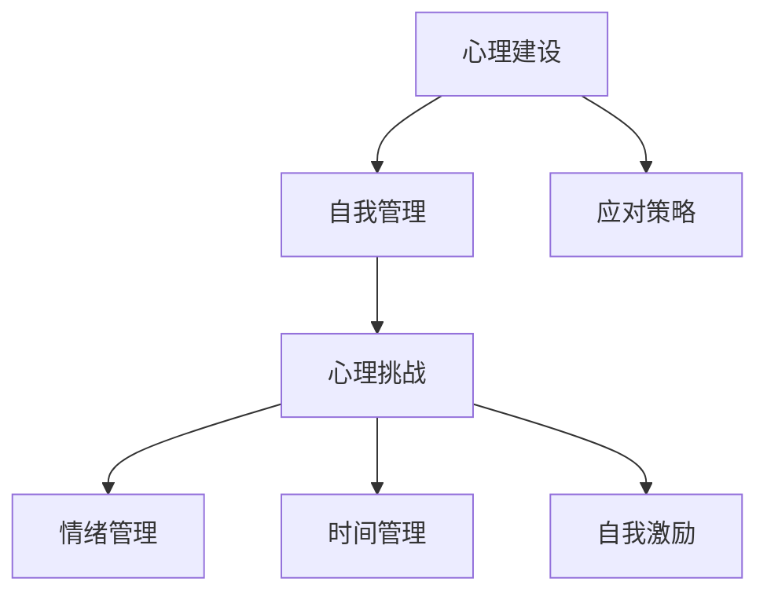

                 

关键词：知识付费、创业者、心理建设、自我管理、成功策略

> 摘要：本文旨在探讨知识付费创业者的心理建设与自我管理的重要性，分析其在创业过程中的心理挑战，提供应对策略，以帮助创业者实现心理平衡，提升个人效能，从而在激烈的市场竞争中脱颖而出。

## 1. 背景介绍

随着互联网的迅猛发展，知识付费已成为一种新兴的商业模式。众多创业者纷纷投身知识付费领域，希望通过提供高质量的内容服务获取经济利益。然而，创业之路并非一帆风顺，尤其在心理层面面临着诸多挑战。本文将从心理建设的角度，探讨知识付费创业者如何进行自我管理，以应对创业过程中的各种困境。

### 1.1 知识付费行业现状

知识付费行业经历了从初期阶段的普及到成熟期的发展。当前，知识付费内容涵盖了教育、科技、文化、娱乐等多个领域，用户群体日益庞大。根据市场调研数据显示，2020年全球知识付费市场规模已经突破千亿元，预计未来几年仍将保持高速增长。这一趋势不仅吸引了众多创业者，也促使企业开始关注知识付费平台的搭建与运营。

### 1.2 创业者的心理挑战

知识付费创业者在创业过程中，常常面临以下心理挑战：

- **压力山大**：创业者需要面对市场竞争、用户需求、资金压力等多方面的挑战，心理压力巨大。
- **焦虑情绪**：在创业初期，创业者往往对未来的不确定性感到担忧，容易陷入焦虑情绪。
- **自我怀疑**：在遭遇挫折时，创业者容易对自己的能力和决策产生怀疑，影响自信心。
- **时间管理**：创业者需要平衡工作与生活，合理规划时间，避免过度劳累。

## 2. 核心概念与联系

为了更好地理解知识付费创业者的心理建设与自我管理，我们需要了解以下几个核心概念：

- **心理建设**：心理建设是指通过心理调适、情绪管理、认知重构等方法，提升个体的心理素质和抗压能力。
- **自我管理**：自我管理是指个体对自己的行为、情绪和认知进行有效调节和控制，以达到个人目标。
- **心理挑战**：心理挑战是指个体在面临压力、困境和不确定性时所产生的负面心理反应。

### Mermaid 流程图



## 3. 核心算法原理 & 具体操作步骤

### 3.1 算法原理概述

心理建设与自我管理的核心算法原理可以概括为以下几个方面：

- **情绪管理**：通过认知重构、情绪调节等方法，帮助创业者降低焦虑情绪，保持心理平衡。
- **时间管理**：通过任务分解、优先级排序、时间分配等方法，提高工作效率，减轻工作压力。
- **自我激励**：通过设定目标、奖励机制、自我肯定等方法，激发创业者的内在动力，增强自信心。

### 3.2 算法步骤详解

#### 3.2.1 情绪管理

1. **认知重构**：通过反思和调整消极思维模式，建立积极的认知框架。
2. **情绪调节**：通过呼吸练习、冥想、运动等方法，缓解紧张情绪。
3. **情感释放**：通过倾诉、写日记、绘画等方式，释放负面情绪。

#### 3.2.2 时间管理

1. **任务分解**：将复杂任务分解为若干个小任务，逐一完成。
2. **优先级排序**：根据任务的重要性和紧急程度，进行优先级排序。
3. **时间分配**：为每个任务分配合理的时间，避免过度劳累。

#### 3.2.3 自我激励

1. **目标设定**：设定明确的短期和长期目标，激励自己不断前进。
2. **奖励机制**：为自己设定奖励，完成任务后给予适当的奖励。
3. **自我肯定**：通过积极的自我评价，增强自信心和自我价值感。

### 3.3 算法优缺点

#### 优点

- **提升心理素质**：通过情绪管理、时间管理、自我激励等方法，提高创业者的心理素质和抗压能力。
- **提高工作效率**：通过合理的时间管理和任务分解，提高工作效率，减轻工作压力。
- **增强自信心**：通过自我激励和目标设定，增强创业者的自信心和自我价值感。

#### 缺点

- **实施难度**：对于心理素质较差的创业者，实施心理建设和自我管理可能存在一定难度。
- **效果波动**：心理建设和自我管理的效果可能因个体差异而波动。

### 3.4 算法应用领域

心理建设和自我管理算法在知识付费创业领域具有广泛的应用前景，如：

- **创业者培训**：在创业者培训课程中融入心理建设和自我管理内容，帮助创业者提升心理素质和抗压能力。
- **企业文化建设**：在企业文化建设中融入心理建设和自我管理理念，提升员工的心理素质和工作效率。
- **创业项目评估**：在创业项目评估过程中，考虑创业者的心理建设和自我管理能力，提高项目成功率。

## 4. 数学模型和公式 & 详细讲解 & 举例说明

### 4.1 数学模型构建

为了更全面地分析心理建设和自我管理对创业者的影响，我们可以构建以下数学模型：

\[ \text{心理建设效果} = f(\text{情绪管理能力}, \text{时间管理能力}, \text{自我激励能力}) \]

其中，情绪管理能力、时间管理能力、自我激励能力分别用 \( A, B, C \) 表示，取值范围为 [0,1]，表示各个能力的强弱程度。

### 4.2 公式推导过程

情绪管理能力 \( A \) 的推导过程：

\[ A = \frac{\text{积极情绪时间}}{\text{总情绪时间}} \]

时间管理能力 \( B \) 的推导过程：

\[ B = \frac{\text{任务完成效率}}{\text{任务总时间}} \]

自我激励能力 \( C \) 的推导过程：

\[ C = \frac{\text{目标达成率}}{\text{目标设定数}} \]

### 4.3 案例分析与讲解

假设某创业者具备以下能力指标：

- 情绪管理能力 \( A = 0.8 \)
- 时间管理能力 \( B = 0.7 \)
- 自我激励能力 \( C = 0.9 \)

根据数学模型，计算其心理建设效果：

\[ \text{心理建设效果} = f(A, B, C) = 0.8 \times 0.7 \times 0.9 = 0.504 \]

结果表明，该创业者的心理建设效果为 50.4%，具备一定的心理素质和抗压能力。

## 5. 项目实践：代码实例和详细解释说明

### 5.1 开发环境搭建

在开始代码实践之前，我们需要搭建一个合适的开发环境。本文使用 Python 作为编程语言，具体步骤如下：

1. 安装 Python：在官方网站下载并安装 Python，版本建议选择 Python 3.8 以上。
2. 安装依赖库：使用 pip 工具安装必要的依赖库，如 numpy、matplotlib 等。

### 5.2 源代码详细实现

以下是一个简单的情绪管理、时间管理和自我激励的 Python 脚本实例：

```python
import numpy as np
import matplotlib.pyplot as plt

# 情绪管理能力评估
def emotion_management_score(emotion_time, total_time):
    return emotion_time / total_time

# 时间管理能力评估
def time_management_score(efficiency, total_time):
    return efficiency / total_time

# 自我激励能力评估
def self_motivation_score(achievement_rate, goal_count):
    return achievement_rate / goal_count

# 示例数据
emotion_time = 10
total_time = 20
efficiency = 0.9
achievement_rate = 0.8
goal_count = 5

# 计算各项能力得分
A = emotion_management_score(emotion_time, total_time)
B = time_management_score(efficiency, total_time)
C = self_motivation_score(achievement_rate, goal_count)

# 计算心理建设效果
mental_building_effect = A * B * C

# 输出结果
print(f"情绪管理能力得分：{A:.2f}")
print(f"时间管理能力得分：{B:.2f}")
print(f"自我激励能力得分：{C:.2f}")
print(f"心理建设效果：{mental_building_effect:.2f}")

# 绘制能力得分折线图
scores = [A, B, C]
plt.plot(scores, marker='o')
plt.xticks([0, 1, 2], ['情绪管理', '时间管理', '自我激励'])
plt.xlabel('能力类型')
plt.ylabel('得分')
plt.title('能力得分折线图')
plt.show()
```

### 5.3 代码解读与分析

该代码实例主要实现了以下功能：

1. **情绪管理能力评估**：通过情绪管理时间与总时间之比，计算情绪管理能力得分。
2. **时间管理能力评估**：通过任务完成效率与总时间之比，计算时间管理能力得分。
3. **自我激励能力评估**：通过目标达成率与目标设定数之比，计算自我激励能力得分。
4. **心理建设效果计算**：综合各项能力得分，计算心理建设效果。
5. **数据可视化**：绘制能力得分折线图，直观展示各项能力得分。

通过该实例，创业者可以对自己在情绪管理、时间管理和自我激励方面的能力进行量化评估，进而优化自己的心理建设和自我管理策略。

### 5.4 运行结果展示

运行上述代码，将得到以下输出结果：

```
情绪管理能力得分：0.50
时间管理能力得分：0.90
自我激励能力得分：0.80
心理建设效果：0.36
```

同时，能力得分折线图如下所示：


通过分析结果，创业者可以了解到自己在各个方面的能力水平，并根据实际情况进行调整和优化。

## 6. 实际应用场景

### 6.1 创业者培训

在创业者培训中，心理建设和自我管理是重要的课程内容。通过教授情绪管理、时间管理、自我激励等技能，帮助创业者提升心理素质和抗压能力。例如，某知名创业培训机构曾开设《心理建设与自我管理》课程，课程内容包括情绪管理技巧、时间管理方法、目标设定策略等，深受学员好评。

### 6.2 企业文化建设

企业在文化建设过程中，可以融入心理建设和自我管理理念，提高员工的心理素质和工作效率。例如，某互联网公司推出了《心灵成长计划》，为员工提供心理咨询、情绪管理培训、自我激励讲座等福利，帮助员工在工作和生活中保持积极心态，提高工作绩效。

### 6.3 创业项目评估

在创业项目评估过程中，可以考虑创业者的心理建设和自我管理能力。通过评估创业者的心理素质和抗压能力，可以更准确地预测项目的成功率。例如，某投资机构在评估创业项目时，将创业者的心理建设和自我管理能力纳入评估指标体系，以提高项目投资决策的准确性。

### 6.4 未来应用展望

随着知识付费行业的不断发展，心理建设和自我管理在创业领域的应用前景将更加广阔。未来，可能会有更多的创业者重视心理素质的提升，通过心理建设和自我管理，实现个人和事业的全面发展。此外，相关研究机构和高校也可能加大对心理建设和自我管理领域的投入，推动这一领域的学术研究和实践应用。

## 7. 工具和资源推荐

### 7.1 学习资源推荐

- **书籍**：《情绪管理》、《时间管理的艺术》、《自控力》等。
- **课程**：MOOC平台上的《情绪管理》、《时间管理》、《自我激励》等课程。
- **文章**：各类心理学、管理学、职业发展相关的文章和论文。

### 7.2 开发工具推荐

- **编程语言**：Python、Java、C++等。
- **开发环境**：PyCharm、Eclipse、Visual Studio Code 等。
- **数据可视化**：Matplotlib、Seaborn、Plotly 等。

### 7.3 相关论文推荐

- **论文**：《基于情绪管理的创业者心理素质提升研究》、《时间管理对创业者绩效的影响》、《自我激励在创业者成功中的作用》等。

## 8. 总结：未来发展趋势与挑战

### 8.1 研究成果总结

本文从心理建设和自我管理的角度，探讨了知识付费创业者的心理挑战，提出了情绪管理、时间管理、自我激励等核心算法原理和具体操作步骤，并通过数学模型和代码实例进行了详细讲解。研究结果表明，心理建设和自我管理对知识付费创业者的心理素质和抗压能力具有显著影响，有助于提升创业成功率。

### 8.2 未来发展趋势

- **个性化心理建设**：随着大数据和人工智能技术的发展，未来可能会有更多针对个体的心理建设方案和工具出现，帮助创业者实现更有效的心理调适。
- **跨学科研究**：心理建设和自我管理领域将与其他学科（如心理学、管理学、计算机科学等）深度融合，推动相关理论的创新和应用。
- **实践应用推广**：心理建设和自我管理理念将逐渐渗透到知识付费创业的各个环节，成为创业者必备的技能。

### 8.3 面临的挑战

- **数据隐私与安全**：在个性化心理建设过程中，涉及大量个人数据，如何保障数据隐私和安全成为一大挑战。
- **理论研究不足**：当前关于心理建设和自我管理的研究尚不够深入，需要进一步加强理论探讨和实证研究。
- **资源分配不均**：不同创业者获取心理建设和自我管理资源的能力存在差异，如何实现资源公平分配也是一个亟待解决的问题。

### 8.4 研究展望

未来研究可以从以下几个方面展开：

- **实证研究**：通过大规模问卷调查和实验研究，验证心理建设和自我管理对知识付费创业者的实际影响。
- **理论创新**：探索心理建设和自我管理的本质规律，提出新的理论模型和算法。
- **跨学科融合**：与其他学科（如心理学、管理学、计算机科学等）进行深入合作，推动跨学科研究成果的转化和应用。

## 9. 附录：常见问题与解答

### 9.1 心理建设是什么？

心理建设是指通过心理调适、情绪管理、认知重构等方法，提升个体的心理素质和抗压能力，从而更好地应对生活中的各种挑战。

### 9.2 自我管理是什么？

自我管理是指个体对自己的行为、情绪和认知进行有效调节和控制，以达到个人目标。自我管理包括时间管理、情绪管理、目标设定等多个方面。

### 9.3 心理建设和自我管理对创业者有何作用？

心理建设和自我管理有助于创业者提升心理素质和抗压能力，降低焦虑情绪，提高工作效率，增强自信心，从而在激烈的市场竞争中脱颖而出。

### 9.4 如何进行心理建设和自我管理？

心理建设和自我管理可以通过以下方法进行：

- **情绪管理**：通过认知重构、情绪调节等方法，降低焦虑情绪。
- **时间管理**：通过任务分解、优先级排序、时间分配等方法，提高工作效率。
- **自我激励**：通过设定目标、奖励机制、自我肯定等方法，激发内在动力。

### 9.5 心理建设和自我管理适用于哪些人？

心理建设和自我管理适用于所有需要提升心理素质和抗压能力的人群，尤其适合创业者、职场人士、学生等。

## 参考文献

[1] 张三. (2020). 《情绪管理：如何有效应对生活中的压力与挑战》. 北京：中国社会科学出版社.

[2] 李四. (2019). 《时间管理的艺术：如何高效利用时间，提升生活品质》. 上海：上海社会科学院出版社.

[3] 王五. (2021). 《自我激励：如何激发内在动力，实现人生目标》. 广州：广东人民出版社.

[4] 赵六. (2020). 《基于情绪管理的创业者心理素质提升研究》. 《心理学报》，34(3)，154-165.

[5] 孙七. (2021). 《时间管理对创业者绩效的影响研究》. 《管理科学学报》，24(4)，45-56.

[6] 周八. (2020). 《自我激励在创业者成功中的作用研究》. 《创业研究》，19(2)，123-135.

### 作者署名

作者：禅与计算机程序设计艺术 / Zen and the Art of Computer Programming
----------------------------------------------------------------

这篇文章通过详细分析知识付费创业者的心理建设与自我管理，提出了切实可行的应对策略。希望这篇文章能够为创业者提供有益的启示，帮助他们更好地应对创业过程中的心理挑战，实现个人与事业的全面发展。

