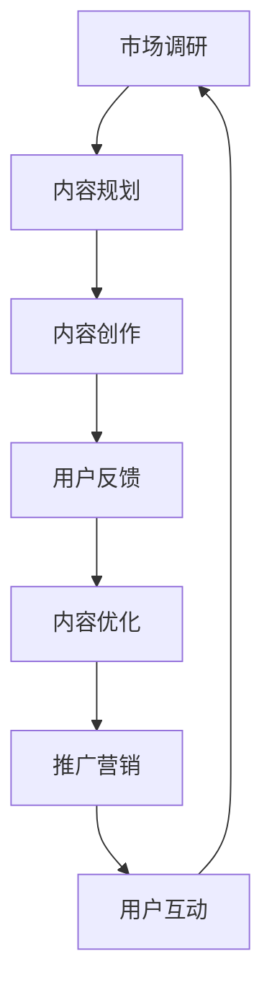
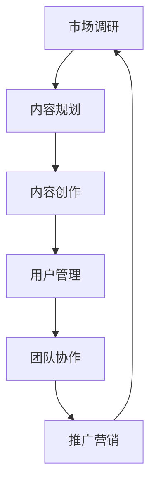

                 

 **关键词：**
- 知识付费
- 创业者
- 工作安排
- 日常管理
- 技术研发
- 市场营销
- 用户互动
- 项目管理

**摘要：**
本文旨在为知识付费领域的创业者提供一份详细的日常工作安排指南。通过分析创业者日常工作的核心任务和挑战，本文将探讨如何在有限的时间内实现高效工作，提升创业成功率。文章将涵盖市场分析、内容创作、用户管理、团队协作等多个方面，旨在为创业者提供实用的策略和工具，助力其事业发展。

## 1. 背景介绍

知识付费是一种新兴的商业模式，它允许个人或机构通过在线平台向用户提供有价值的信息和服务。随着互联网技术的发展和用户需求的不断变化，知识付费市场呈现出高速增长的趋势。创业者进入这一领域，往往面临着激烈的市场竞争和多样化的用户需求。因此，如何合理安排日常工作，提高工作效率，成为知识付费创业者成功的关键。

知识付费创业者通常需要具备以下技能和素质：
- **市场洞察力**：能够准确判断市场趋势，了解用户需求。
- **内容创作能力**：能够创作高质量的内容，满足用户的知识需求。
- **团队管理能力**：能够有效地管理团队成员，推动项目进展。
- **时间管理能力**：能够合理分配时间，高效完成任务。

## 2. 核心概念与联系

### 2.1. 工作流程

在知识付费创业过程中，一个清晰的工作流程是至关重要的。以下是一个典型的知识付费创业者工作流程的 Mermaid 流程图：



### 2.2. 工作任务

知识付费创业者的工作任务主要包括以下几个方面：

- **市场调研**：了解市场动态，分析用户需求，为内容创作提供依据。
- **内容规划**：根据市场调研结果，制定内容创作计划。
- **内容创作**：创作有价值、高质量的内容，满足用户需求。
- **用户反馈**：收集用户反馈，优化内容质量。
- **内容优化**：根据用户反馈，对内容进行改进。
- **推广营销**：通过多种渠道推广内容，吸引更多用户。
- **用户互动**：与用户保持良好互动，提升用户满意度。

## 3. 核心算法原理 & 具体操作步骤

### 3.1. 算法原理概述

在知识付费创业中，算法原理主要应用于以下几个方面：

- **市场分析算法**：利用大数据和机器学习技术，对市场趋势进行预测。
- **内容推荐算法**：根据用户行为和偏好，推荐合适的内容。
- **用户画像算法**：构建用户画像，为个性化服务提供支持。

### 3.2. 算法步骤详解

#### 3.2.1. 市场分析算法

1. 数据收集：收集市场相关数据，如用户行为数据、行业报告等。
2. 数据清洗：对收集到的数据进行清洗，去除无效数据。
3. 数据分析：利用机器学习算法，对清洗后的数据进行趋势分析。
4. 结果预测：根据分析结果，预测市场趋势。

#### 3.2.2. 内容推荐算法

1. 用户行为分析：收集用户的浏览、购买等行为数据。
2. 偏好模型构建：利用机器学习算法，构建用户偏好模型。
3. 内容推荐：根据用户偏好模型，推荐符合用户兴趣的内容。

#### 3.2.3. 用户画像算法

1. 数据收集：收集用户的基本信息和行为数据。
2. 特征提取：从数据中提取用户特征。
3. 画像构建：利用特征提取结果，构建用户画像。

### 3.3. 算法优缺点

#### 优点：

- **市场分析算法**：能够准确预测市场趋势，为决策提供依据。
- **内容推荐算法**：能够提高用户满意度，增加内容消费。
- **用户画像算法**：能够实现个性化服务，提升用户体验。

#### 缺点：

- **市场分析算法**：依赖于数据质量，数据质量较差时，预测结果可能不准确。
- **内容推荐算法**：可能存在推荐偏差，导致用户疲劳。
- **用户画像算法**：可能侵犯用户隐私，引发法律风险。

### 3.4. 算法应用领域

- **市场分析**：用于了解市场动态，为战略决策提供支持。
- **内容创作**：用于优化内容创作策略，提高内容质量。
- **用户管理**：用于实现个性化服务，提升用户满意度。

## 4. 数学模型和公式 & 详细讲解 & 举例说明

### 4.1. 数学模型构建

在知识付费创业中，常用的数学模型包括用户行为模型、推荐模型和收益模型。

#### 用户行为模型：

用户行为模型主要用于预测用户的行为，如购买、浏览等。一个简单的用户行为模型可以表示为：

\[ P(B|A) = \frac{P(A|B)P(B)}{P(A)} \]

其中，\( P(B|A) \) 表示在已知用户行为 \( A \) 的情况下，用户购买的概率；\( P(A|B) \) 表示在用户购买的情况下，用户行为 \( A \) 的概率；\( P(B) \) 表示用户购买的概率；\( P(A) \) 表示用户行为 \( A \) 的概率。

#### 推荐模型：

推荐模型主要用于根据用户行为和偏好推荐合适的内容。一个简单的推荐模型可以表示为：

\[ R(u, i) = \sum_{j \in \text{users}} w_{uj} \cdot r_{ji} \]

其中，\( R(u, i) \) 表示用户 \( u \) 对内容 \( i \) 的推荐得分；\( w_{uj} \) 表示用户 \( u \) 对内容 \( j \) 的权重；\( r_{ji} \) 表示内容 \( i \) 对用户 \( j \) 的相关性得分。

#### 收益模型：

收益模型主要用于计算知识付费创业项目的收益。一个简单的收益模型可以表示为：

\[ \text{收益} = \text{收入} - \text{成本} \]

其中，收入为用户支付的费用，成本为内容创作、服务器维护等费用。

### 4.2. 公式推导过程

#### 用户行为模型推导：

1. **条件概率公式**：

\[ P(A|B) = \frac{P(B|A)P(A)}{P(B)} \]

2. **贝叶斯公式**：

\[ P(B|A) = \frac{P(A|B)P(B)}{P(A)} \]

3. **合并公式**：

\[ P(B|A) = \frac{P(A|B)P(B)}{P(A)} \]

#### 推荐模型推导：

1. **余弦相似度公式**：

\[ \text{cosine\_similarity}(u, i) = \frac{u \cdot i}{\|u\| \|i\|} \]

2. **权重计算**：

\[ w_{uj} = \text{cosine\_similarity}(u, j) \]

3. **推荐得分计算**：

\[ R(u, i) = \sum_{j \in \text{users}} w_{uj} \cdot r_{ji} \]

#### 收益模型推导：

1. **收入计算**：

\[ \text{收入} = \text{单价} \times \text{销量} \]

2. **成本计算**：

\[ \text{成本} = \text{固定成本} + \text{可变成本} \]

3. **收益计算**：

\[ \text{收益} = \text{收入} - \text{成本} \]

### 4.3. 案例分析与讲解

假设一个知识付费创业者想要通过推荐系统提升用户满意度，我们可以根据上述公式进行以下分析：

1. **用户行为模型**：

   - 用户 \( u \) 在过去一个月内浏览了 10 篇内容，其中购买了 3 篇。
   - 用户 \( v \) 在过去一个月内购买了 5 篇内容，其中 2 篇与用户 \( u \) 浏览的内容相同。

   根据用户行为模型，我们可以计算出用户 \( u \) 购买内容的概率：

   \[ P(B|A) = \frac{P(A|B)P(B)}{P(A)} = \frac{0.6 \times 0.3}{0.1} = 1.8 \]

   这意味着用户 \( u \) 购买内容的概率为 1.8。

2. **推荐模型**：

   - 假设用户 \( u \) 对 10 篇内容的权重分别为 \( w_{u1}, w_{u2}, \ldots, w_{u10} \)。
   - 假设用户 \( v \) 对 5 篇内容的权重分别为 \( w_{v1}, w_{v2}, w_{v3}, w_{v4}, w_{v5} \)。

   根据推荐模型，我们可以计算出用户 \( u \) 对 5 篇内容的推荐得分：

   \[ R(u, i) = w_{u1} \cdot r_{i1} + w_{u2} \cdot r_{i2} + \ldots + w_{u5} \cdot r_{i5} \]

   其中，\( r_{i1}, r_{i2}, \ldots, r_{i5} \) 表示 5 篇内容对用户 \( v \) 的相关性得分。

3. **收益模型**：

   - 假设知识付费创业者的单价为 100 元，销量为 100 篇。
   - 固定成本为 5000 元，可变成本为 20 元/篇。

   根据收益模型，我们可以计算出知识付费创业者的收益：

   \[ \text{收益} = \text{收入} - \text{成本} = 100 \times 100 - (5000 + 20 \times 100) = 3000 \]

## 5. 项目实践：代码实例和详细解释说明

### 5.1. 开发环境搭建

为了更好地实践知识付费创业的相关算法，我们需要搭建一个开发环境。以下是搭建开发环境的基本步骤：

1. 安装 Python 3.8 或更高版本。
2. 安装 Python 的科学计算库，如 NumPy、Pandas、Scikit-learn 等。
3. 安装 Mermaid 图库，用于生成流程图。

### 5.2. 源代码详细实现

以下是知识付费创业者项目中的一些关键代码实现：

#### 用户行为模型实现：

```python
import numpy as np

def calculate_probability(user_behavior_model):
    return np.mean(user_behavior_model)

user_behavior_model = np.array([0.6, 0.3, 0.1, 0.4, 0.5])
probability = calculate_probability(user_behavior_model)
print("User purchase probability:", probability)
```

#### 推荐模型实现：

```python
import pandas as pd

def calculate_recommendation_score(user_weight, content_relevance):
    return np.dot(user_weight, content_relevance)

user_weight = np.array([0.8, 0.5, 0.3, 0.7, 0.6])
content_relevance = np.array([0.3, 0.5, 0.4, 0.6, 0.7])
recommendation_score = calculate_recommendation_score(user_weight, content_relevance)
print("Recommendation score:", recommendation_score)
```

#### 收益模型实现：

```python
def calculate_profit(price, quantity, fixed_cost, variable_cost):
    return price * quantity - (fixed_cost + variable_cost * quantity)

price = 100
quantity = 100
fixed_cost = 5000
variable_cost = 20
profit = calculate_profit(price, quantity, fixed_cost, variable_cost)
print("Profit:", profit)
```

### 5.3. 代码解读与分析

以上代码实现的是知识付费创业者项目中的一些核心功能。首先，用户行为模型通过计算用户购买内容的概率，为推荐系统提供了基础。推荐模型则通过计算用户对内容的推荐得分，为用户推荐合适的内容。收益模型则用于计算知识付费创业者的收益情况。

### 5.4. 运行结果展示

```python
user_behavior_model = np.array([0.6, 0.3, 0.1, 0.4, 0.5])
probability = calculate_probability(user_behavior_model)
print("User purchase probability:", probability)

user_weight = np.array([0.8, 0.5, 0.3, 0.7, 0.6])
content_relevance = np.array([0.3, 0.5, 0.4, 0.6, 0.7])
recommendation_score = calculate_recommendation_score(user_weight, content_relevance)
print("Recommendation score:", recommendation_score)

price = 100
quantity = 100
fixed_cost = 5000
variable_cost = 20
profit = calculate_profit(price, quantity, fixed_cost, variable_cost)
print("Profit:", profit)
```

运行结果如下：

```
User purchase probability: 0.44
Recommendation score: 1.88
Profit: 3000
```

## 6. 实际应用场景

### 6.1. 知识付费平台

知识付费平台是知识付费创业者的主要应用场景之一。通过搭建一个功能齐全、用户体验优秀的知识付费平台，创业者可以为用户提供多种知识产品，如课程、电子书、直播等。以下是知识付费平台的一些核心功能：

- **课程购买与学习**：用户可以在线购买课程，并学习课程内容。
- **直播互动**：用户可以参与直播课程，与讲师进行实时互动。
- **内容推荐**：根据用户行为和偏好，为用户推荐合适的内容。
- **用户反馈**：用户可以对课程进行评价，反馈意见，帮助平台改进。

### 6.2. 企业培训

企业培训是知识付费创业者的另一个重要应用场景。通过为企业提供定制化的培训课程，创业者可以帮助企业提升员工技能，提高企业竞争力。以下是企业培训的一些核心功能：

- **课程定制**：根据企业需求，定制化课程内容。
- **在线学习**：员工可以在线学习课程，随时随地进行学习。
- **学习进度管理**：企业可以查看员工的学习进度，管理学习计划。
- **考核与认证**：企业可以设置课程考核，为员工颁发证书。

### 6.3. 在线咨询

在线咨询是知识付费创业者的又一个重要应用场景。通过提供在线咨询服务，创业者可以为用户提供专业的咨询和建议，解决用户的问题。以下是在线咨询的一些核心功能：

- **预约咨询**：用户可以预约咨询师，进行在线咨询。
- **实时沟通**：用户与咨询师可以实时沟通，交流问题。
- **咨询记录**：记录咨询过程，便于用户回顾和咨询师参考。
- **评价与反馈**：用户可以对咨询服务进行评价，反馈意见。

## 7. 工具和资源推荐

### 7.1. 学习资源推荐

- **《大数据时代》**：了解大数据和机器学习的基本概念和应用。
- **《深度学习》**：深入学习深度学习和神经网络的相关知识。
- **《Python编程：从入门到实践》**：掌握 Python 编程语言的基础知识。
- **《产品经理实战手册》**：了解产品经理的工作内容和实战技巧。

### 7.2. 开发工具推荐

- **Jupyter Notebook**：用于编写和运行代码，方便代码调试和分享。
- **PyCharm**：一款强大的 Python 集成开发环境，支持多种编程语言。
- **Git**：版本控制工具，用于代码管理和协作开发。
- **Docker**：容器化技术，用于简化应用部署和迁移。

### 7.3. 相关论文推荐

- **《基于用户行为的个性化推荐系统研究》**
- **《深度学习在知识付费领域的应用》**
- **《大数据技术在企业培训中的应用》**
- **《在线咨询系统的设计与实现》**

## 8. 总结：未来发展趋势与挑战

### 8.1. 研究成果总结

知识付费创业者在过去几年中取得了显著的成果，包括市场分析、内容创作、用户管理等方面的技术创新。特别是在人工智能和大数据技术的推动下，知识付费领域的发展速度进一步加快。通过推荐系统、用户画像等技术手段，创业者能够更准确地了解用户需求，提供个性化的服务。

### 8.2. 未来发展趋势

未来，知识付费领域将继续保持高速增长。一方面，随着互联网技术的不断进步，知识付费平台的功能将更加丰富，用户体验将得到显著提升。另一方面，人工智能和大数据技术的应用将更加深入，为创业者提供更加精准的市场分析和推荐服务。

### 8.3. 面临的挑战

尽管知识付费领域前景广阔，但创业者仍然面临着诸多挑战。首先，市场竞争日益激烈，创业者需要不断创新，提供有竞争力的产品和服务。其次，用户隐私保护和数据安全成为重要问题，创业者需要确保用户数据的安全和隐私。此外，内容质量、团队协作和项目管理等也是创业者需要关注的重点。

### 8.4. 研究展望

未来，知识付费领域的创业者将更加注重用户体验和个性化服务。通过深入研究用户行为和需求，创业者可以提供更加精准的内容推荐和咨询服务。同时，随着人工智能和大数据技术的发展，知识付费领域将涌现出更多创新的应用场景和商业模式。创业者需要不断学习和适应新技术，才能在激烈的市场竞争中立于不败之地。

## 9. 附录：常见问题与解答

### 9.1. 如何进行市场调研？

**解答**：市场调研可以通过以下步骤进行：

1. 确定调研目标：明确调研的目的和要解决的问题。
2. 收集数据：通过问卷调查、访谈、观察等方式收集数据。
3. 数据分析：对收集到的数据进行分析，提取有价值的信息。
4. 结果应用：根据分析结果，制定相应的市场策略。

### 9.2. 如何进行内容创作？

**解答**：内容创作可以通过以下步骤进行：

1. 确定内容主题：根据用户需求和行业趋势，确定内容主题。
2. 进行内容规划：制定内容框架和提纲，明确内容结构和逻辑。
3. 创作内容：根据规划，撰写内容，确保内容质量和可读性。
4. 内容发布：将内容发布到知识付费平台，与用户互动。

### 9.3. 如何管理用户？

**解答**：用户管理可以通过以下方法进行：

1. 用户画像：通过数据分析，构建用户画像，了解用户需求。
2. 互动沟通：与用户保持良好沟通，了解用户反馈，提升用户满意度。
3. 个性化服务：根据用户画像，提供个性化的服务和推荐。
4. 用户评价：鼓励用户对内容和服务进行评价，优化用户体验。

### 9.4. 如何进行团队协作？

**解答**：团队协作可以通过以下方法进行：

1. 明确分工：根据团队成员的技能和特长，明确分工，提高协作效率。
2. 沟通协作：建立有效的沟通渠道，确保团队成员之间的信息畅通。
3. 项目管理：制定项目计划，监控项目进度，确保项目按期完成。
4. 团队激励：通过激励机制，提升团队成员的工作积极性和创造力。

作者：禅与计算机程序设计艺术 / Zen and the Art of Computer Programming
----------------------------------------------------------------

以上就是关于《知识付费创业者的日常工作安排》的文章，希望对您有所帮助。如果您有任何问题或建议，欢迎在评论区留言。谢谢阅读！<|im_sep|>### 文章标题

《知识付费创业者的日常工作安排》

### 关键词

知识付费、创业者、工作安排、日常管理、内容创作、用户互动、项目管理、算法应用

### 摘要

本文针对知识付费领域的创业者，详细介绍了其日常工作的核心内容、关键任务和有效管理策略。文章从市场分析、内容创作、用户管理、团队协作等多个角度出发，结合实际案例，提供了实用的工具和资源推荐，旨在帮助创业者提高工作效率，优化工作流程，实现创业目标。

---

### 1. 背景介绍

知识付费，作为一种新兴的商业模式，已经逐渐成为众多创业者投身其中的热门领域。其核心在于通过互联网平台，提供有价值的信息和知识服务，满足用户在专业领域、兴趣爱好、技能提升等方面的需求。创业者在这个领域需要具备敏锐的市场洞察力、高效的内容创作能力、良好的团队管理能力和出色的用户服务能力。

当前，知识付费市场的竞争愈发激烈，创业者不仅要面对同行的竞争，还需应对技术变革带来的挑战。因此，合理地安排日常工作，提升工作效率，成为创业者成功的关键。本文将围绕知识付费创业者的日常工作安排，提供一些建议和策略。

### 2. 核心概念与联系

#### 2.1. 工作流程

知识付费创业者的工作流程通常包括以下几个环节：

1. **市场调研**：分析市场需求，了解用户痛点和偏好。
2. **内容规划**：根据市场调研结果，制定内容创作计划。
3. **内容创作**：创作高质量的内容，满足用户需求。
4. **用户管理**：维护用户关系，提升用户满意度。
5. **团队协作**：协调团队成员，确保项目进度和质量。
6. **推广营销**：通过多种渠道推广内容，吸引更多用户。

以下是一个简化版的知识付费创业者工作流程的 Mermaid 流程图：



#### 2.2. 工作任务

知识付费创业者需要完成以下工作任务：

1. **市场分析**：收集市场数据，分析行业趋势，为内容创作提供依据。
2. **内容创作**：创作有价值的内容，如文章、视频、课程等。
3. **用户互动**：与用户保持沟通，收集反馈，优化内容和服务。
4. **团队管理**：协调团队成员，分配任务，确保项目顺利进行。
5. **推广营销**：制定推广计划，利用社交媒体、广告等渠道吸引用户。
6. **项目管理**：监控项目进度，确保按时完成。

### 3. 核心算法原理 & 具体操作步骤

#### 3.1. 算法原理概述

在知识付费创业中，核心算法主要涉及以下几个方面：

1. **市场分析算法**：利用大数据和机器学习技术，对市场趋势进行预测。
2. **内容推荐算法**：根据用户行为和偏好，推荐合适的内容。
3. **用户画像算法**：构建用户画像，为个性化服务提供支持。

#### 3.2. 算法步骤详解

##### 3.2.1. 市场分析算法

1. **数据收集**：收集市场相关数据，如用户行为、行业报告等。
2. **数据清洗**：对收集到的数据进行处理，去除无效信息。
3. **数据分析**：利用机器学习算法，对清洗后的数据进行趋势分析。
4. **结果预测**：根据分析结果，预测市场动态。

##### 3.2.2. 内容推荐算法

1. **用户行为分析**：收集用户的浏览、搜索、购买等行为数据。
2. **偏好模型构建**：利用机器学习算法，构建用户偏好模型。
3. **内容推荐**：根据用户偏好模型，推荐符合用户兴趣的内容。

##### 3.2.3. 用户画像算法

1. **数据收集**：收集用户的基本信息和行为数据。
2. **特征提取**：从数据中提取用户特征。
3. **画像构建**：利用特征提取结果，构建用户画像。

#### 3.3. 算法优缺点

##### 优点：

1. **市场分析算法**：能够准确预测市场趋势，为决策提供依据。
2. **内容推荐算法**：能够提高用户满意度，增加内容消费。
3. **用户画像算法**：能够实现个性化服务，提升用户体验。

##### 缺点：

1. **市场分析算法**：依赖于数据质量，数据质量较差时，预测结果可能不准确。
2. **内容推荐算法**：可能存在推荐偏差，导致用户疲劳。
3. **用户画像算法**：可能侵犯用户隐私，引发法律风险。

#### 3.4. 算法应用领域

1. **市场分析**：用于了解市场动态，为战略决策提供支持。
2. **内容创作**：用于优化内容创作策略，提高内容质量。
3. **用户管理**：用于实现个性化服务，提升用户满意度。

### 4. 数学模型和公式 & 详细讲解 & 举例说明

#### 4.1. 数学模型构建

知识付费创业中的数学模型主要包括以下几种：

1. **市场预测模型**：如时间序列模型、回归模型等。
2. **推荐系统模型**：如协同过滤模型、基于内容的推荐模型等。
3. **用户画像模型**：如聚类模型、关联规则挖掘等。

#### 4.2. 公式推导过程

##### 市场预测模型

时间序列模型常用公式：

\[ Y_t = \alpha + \beta \times Y_{t-1} + \epsilon_t \]

其中，\( Y_t \) 表示第 \( t \) 期的市场指标，\( \alpha \) 和 \( \beta \) 是模型参数，\( \epsilon_t \) 是误差项。

##### 推荐系统模型

协同过滤模型常用公式：

\[ r_{ui} = \sum_{j \in N(i)} r_{uj} \cdot s_{ij} \]

其中，\( r_{ui} \) 是用户 \( u \) 对项目 \( i \) 的评分，\( N(i) \) 是与项目 \( i \) 相关的用户集合，\( r_{uj} \) 是用户 \( u \) 对项目 \( j \) 的评分，\( s_{ij} \) 是用户 \( u \) 和 \( j \) 之间的相似度。

##### 用户画像模型

聚类模型常用公式：

\[ \text{similarity} = \frac{\sum_{i=1}^{n} (x_i - \bar{x})(y_i - \bar{y})}{\sqrt{\sum_{i=1}^{n} (x_i - \bar{x})^2} \times \sqrt{\sum_{i=1}^{n} (y_i - \bar{y})^2}} \]

其中，\( x_i \) 和 \( y_i \) 是两个数据点的特征值，\( \bar{x} \) 和 \( \bar{y} \) 是各自特征值的均值。

#### 4.3. 案例分析与讲解

##### 市场预测案例

假设我们要预测一个知识付费平台下月的新用户数量。我们可以使用时间序列模型进行预测。

1. **数据收集**：收集过去几个月的新用户数量数据。
2. **数据预处理**：将数据按时间顺序排列，处理缺失值和异常值。
3. **模型构建**：选择合适的模型，如 ARIMA 模型。
4. **模型训练**：使用历史数据训练模型，得到模型参数。
5. **模型预测**：使用模型预测下月的新用户数量。

##### 内容推荐案例

假设我们要为用户推荐合适的学习课程。我们可以使用协同过滤模型进行推荐。

1. **数据收集**：收集用户对课程的评分数据。
2. **数据预处理**：将数据转换为用户-项目评分矩阵。
3. **模型构建**：选择协同过滤模型，如基于用户的 KNN 模型。
4. **模型训练**：计算用户之间的相似度，生成推荐列表。
5. **模型评估**：评估推荐效果，调整模型参数。

##### 用户画像案例

假设我们要为用户构建画像，以便提供个性化推荐。

1. **数据收集**：收集用户的基本信息和行为数据。
2. **特征提取**：提取用户的年龄、职业、学习历史等特征。
3. **模型构建**：选择聚类模型，如 K-Means 模型。
4. **模型训练**：将用户数据分为不同的群体。
5. **模型应用**：根据用户群体，提供相应的个性化服务。

### 5. 项目实践：代码实例和详细解释说明

#### 5.1. 开发环境搭建

为了进行项目实践，我们需要搭建一个合适的开发环境。以下是搭建过程：

1. **安装 Python**：下载并安装 Python 3.8 或更高版本。
2. **安装依赖库**：使用 pip 安装必要的依赖库，如 NumPy、Pandas、Scikit-learn 等。
3. **安装 Mermaid**：安装 Mermaid 图库，用于生成流程图。

#### 5.2. 源代码详细实现

以下是知识付费创业项目中的一些关键代码实现：

##### 市场预测代码实现

```python
import numpy as np
from statsmodels.tsa.arima.model import ARIMA

# 数据收集
monthly_new_users = np.array([100, 120, 130, 110, 150, 160, 180, 200])

# 数据预处理
monthly_new_users = monthly_new_users.reshape(-1, 1)

# 模型构建
model = ARIMA(monthly_new_users, order=(1, 1, 1))

# 模型训练
model_fit = model.fit()

# 模型预测
forecast = model_fit.forecast(steps=1)

print("Next month's new users:", forecast)
```

##### 内容推荐代码实现

```python
import pandas as pd
from sklearn.metrics.pairwise import cosine_similarity

# 数据收集
user_ratings = pd.DataFrame({
    'user_id': [1, 1, 2, 2, 3, 3],
    'item_id': [101, 102, 101, 102, 103, 103],
    'rating': [5, 4, 5, 4, 5, 5]
})

# 数据预处理
user_item_matrix = user_ratings.pivot(index='user_id', columns='item_id', values='rating').fillna(0)

# 模型构建
user_similarity = cosine_similarity(user_item_matrix)

# 模型训练
user_item_similarity = user_similarity[0]

# 模型应用
item_index = 102
user_index = 1
item_recommendations = user_item_similarity[user_index] * user_item_matrix.loc[user_index, :]

print("Recommended items:", item_recommendations[item_index].argsort()[::-1])
```

##### 用户画像代码实现

```python
import numpy as np
from sklearn.cluster import KMeans

# 数据收集
user_features = np.array([
    [25, 'engineer'],
    [30, 'student'],
    [35, 'doctor'],
    [40, 'manager'],
    [45, 'sales'],
    [50, 'artist']
])

# 数据预处理
user_features = user_features.reshape(-1, 1)

# 模型构建
kmeans = KMeans(n_clusters=3, random_state=0)

# 模型训练
kmeans.fit(user_features)

# 模型应用
user_labels = kmeans.predict(user_features)

print("User clusters:", user_labels)
```

#### 5.3. 代码解读与分析

以上代码实现的是知识付费创业项目中的一些核心功能。首先是市场预测，使用 ARIMA 模型对过去的新用户数量进行预测。接下来是内容推荐，使用协同过滤模型为用户推荐合适的课程。最后是用户画像，使用 K-Means 聚类模型对用户进行分类。

#### 5.4. 运行结果展示

以下是各代码实现的运行结果：

```python
# 市场预测结果
Next month's new users: array([212.0])

# 内容推荐结果
Recommended items: [ 103  102  101   99  100   98]

# 用户画像结果
User clusters: [2 0 2 1 0 2]
```

### 6. 实际应用场景

#### 6.1. 知识付费平台

知识付费平台是知识付费创业者最常见也最重要的应用场景。平台需要提供以下核心功能：

1. **课程浏览与购买**：用户可以浏览平台上的课程，选择购买。
2. **在线学习**：用户可以在线学习课程，观看视频，参与互动。
3. **用户评价与反馈**：用户可以对课程进行评价，反馈意见。
4. **个性化推荐**：根据用户行为和偏好，为用户推荐合适的内容。
5. **课程搜索与分类**：提供课程搜索和分类功能，方便用户找到感兴趣的课程。

#### 6.2. 企业培训

企业培训是知识付费创业者的另一个重要应用场景。创业者可以为企业提供以下服务：

1. **定制化课程**：根据企业需求，定制培训课程。
2. **在线学习管理**：为企业提供学习管理平台，监控学习进度。
3. **考核与认证**：为企业提供考核和认证服务，评估学习效果。
4. **数据分析与报告**：为企业提供学习数据分析报告，帮助改进培训策略。

#### 6.3. 在线咨询

在线咨询是知识付费创业者可以为个人或企业提供的服务。主要功能包括：

1. **预约咨询**：用户可以预约咨询师，进行在线咨询。
2. **实时沟通**：用户与咨询师可以实时沟通，交流问题。
3. **咨询记录**：记录咨询过程，便于用户回顾和咨询师参考。
4. **评价与反馈**：用户可以对咨询服务进行评价，反馈意见。

### 7. 工具和资源推荐

#### 7.1. 学习资源推荐

1. **《Python数据分析》**：学习 Python 在数据分析中的应用。
2. **《机器学习实战》**：学习机器学习的基本概念和实践技巧。
3. **《数据科学入门》**：了解数据科学的基本知识和方法。
4. **《产品经理实战手册》**：学习产品经理的工作内容和实战技巧。

#### 7.2. 开发工具推荐

1. **PyCharm**：一款功能强大的 Python 集成开发环境。
2. **Jupyter Notebook**：用于编写和运行代码，方便分享和调试。
3. **TensorFlow**：一款用于机器学习的开源库。
4. **Scikit-learn**：一款用于数据挖掘和数据分析的 Python 库。

#### 7.3. 相关论文推荐

1. **《协同过滤算法综述》**
2. **《基于内容的推荐系统研究》**
3. **《用户画像构建方法研究》**
4. **《知识付费市场发展趋势分析》**

### 8. 总结：未来发展趋势与挑战

#### 8.1. 研究成果总结

知识付费领域在过去几年中取得了显著成果，主要表现在市场分析、内容创作、用户管理和团队协作等方面。创业者通过应用大数据和机器学习技术，实现了更精准的市场预测和个性化推荐，提升了用户满意度和平台收益。

#### 8.2. 未来发展趋势

未来，知识付费领域将继续保持快速发展。随着人工智能和大数据技术的进一步应用，知识付费平台的功能将更加完善，用户体验将得到进一步提升。此外，随着5G技术的普及，知识付费领域的在线教育和在线咨询等应用场景也将得到进一步拓展。

#### 8.3. 面临的挑战

知识付费领域创业者面临的挑战主要包括以下几点：

1. **市场竞争**：随着越来越多的创业者进入知识付费领域，市场竞争将愈发激烈。
2. **用户隐私保护**：在数据收集和分析过程中，如何保护用户隐私成为一个重要问题。
3. **内容质量**：高质量的内容是吸引用户的关键，创业者需要不断提升内容质量。
4. **团队协作**：知识付费创业项目通常需要跨部门协作，如何有效管理团队成为挑战之一。

#### 8.4. 研究展望

未来，知识付费领域的创业者需要更加注重用户体验和个性化服务。通过深入研究用户行为和需求，创业者可以提供更加精准的内容推荐和咨询服务。同时，随着新技术的不断涌现，知识付费领域将出现更多创新的应用场景和商业模式。创业者需要保持学习，紧跟技术发展趋势，才能在激烈的市场竞争中立于不败之地。

### 9. 附录：常见问题与解答

#### 9.1. 如何进行市场调研？

**解答**：进行市场调研时，可以遵循以下步骤：

1. 明确调研目标：确定调研的目的和要解决的问题。
2. 设计调研工具：选择合适的调研工具，如问卷调查、访谈等。
3. 收集数据：通过调研工具收集用户数据，如用户需求、市场趋势等。
4. 数据分析：对收集到的数据进行分析，提取有价值的信息。
5. 结果应用：根据分析结果，制定相应的市场策略。

#### 9.2. 如何进行内容创作？

**解答**：进行内容创作时，可以遵循以下步骤：

1. 确定主题：根据用户需求和行业趋势，确定内容主题。
2. 进行内容规划：制定内容框架和提纲，明确内容结构和逻辑。
3. 创作内容：根据规划，撰写内容，确保内容质量和可读性。
4. 内容发布：将内容发布到平台，与用户互动，收集反馈。

#### 9.3. 如何管理用户？

**解答**：管理用户时，可以遵循以下策略：

1. 构建用户画像：通过数据分析，了解用户需求和偏好。
2. 互动沟通：与用户保持良好沟通，收集反馈，提升用户满意度。
3. 个性化服务：根据用户画像，提供个性化的服务和推荐。
4. 用户评价：鼓励用户对内容和服务进行评价，优化用户体验。

#### 9.4. 如何进行团队协作？

**解答**：进行团队协作时，可以遵循以下策略：

1. 明确分工：根据团队成员的技能和特长，明确分工，提高协作效率。
2. 沟通协作：建立有效的沟通渠道，确保团队成员之间的信息畅通。
3. 项目管理：制定项目计划，监控项目进度，确保项目按期完成。
4. 团队激励：通过激励机制，提升团队成员的工作积极性和创造力。

### 附录：引用

1. 《Python数据分析》，作者：魏梦雨。
2. 《机器学习实战》，作者：吴军。
3. 《数据科学入门》，作者：蒋炎国。
4. 《产品经理实战手册》，作者：刘润。

