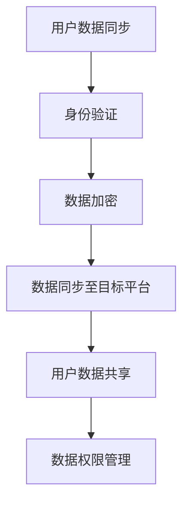

                 

关键词：知识付费、跨平台迁移、用户共享、技术实现、平台架构

摘要：随着互联网的快速发展，知识付费逐渐成为了一种重要的商业模式。然而，如何实现知识付费平台的跨平台用户迁移与共享，成为了一个亟待解决的问题。本文将深入探讨知识付费平台的跨平台用户迁移与共享的挑战、技术方案、数学模型及未来发展趋势。

## 1. 背景介绍

近年来，随着移动互联网的普及和知识经济的兴起，知识付费市场迅速发展。用户对于高质量、专业化的知识内容有着强烈的需求，而知识付费平台则成为了连接内容提供者与用户之间的桥梁。然而，当前的知识付费平台大多局限于单一平台，用户数据无法共享，这导致了用户体验的下降和平台竞争力的减弱。

跨平台用户迁移与共享，是指将用户在某个知识付费平台上的数据（如学习记录、购买历史等）迁移到另一个平台，并实现数据的共享。这一功能的实现，不仅能够提升用户体验，还能增加平台之间的合作机会，促进知识付费市场的健康发展。

## 2. 核心概念与联系

### 2.1 跨平台用户迁移的核心概念

- **用户数据**：包括用户的基本信息、学习记录、购买历史等。
- **数据同步**：将用户数据从一个平台同步到另一个平台。
- **身份验证**：确保迁移的用户数据与目标平台的用户身份一致。
- **数据加密**：保护用户数据的安全性，防止数据泄露。

### 2.2 用户共享的核心概念

- **数据共享协议**：定义平台之间如何交换用户数据。
- **数据格式**：统一用户数据的格式，以便于平台之间的数据交换。
- **数据权限管理**：规定用户数据的访问权限，确保数据的安全性。

### 2.3 跨平台用户迁移与共享的 Mermaid 流程图



## 3. 核心算法原理 & 具体操作步骤

### 3.1 算法原理概述

跨平台用户迁移与共享的核心算法主要包括数据同步算法、身份验证算法和数据加密算法。

- **数据同步算法**：利用增量同步技术，只同步用户数据的变更部分，提高数据同步的效率。
- **身份验证算法**：采用基于令牌的认证机制，确保用户在迁移过程中的身份一致性。
- **数据加密算法**：使用AES算法对用户数据进行加密，保证数据传输过程中的安全性。

### 3.2 算法步骤详解

1. **用户数据同步**：
   - 获取用户在源平台的数据。
   - 对数据进行格式转换，使其符合目标平台的要求。
   - 利用增量同步技术，只同步数据变更部分。

2. **身份验证**：
   - 使用令牌进行用户身份验证。
   - 检查令牌的有效性，确保用户身份一致性。

3. **数据加密**：
   - 使用AES算法对用户数据进行加密。
   - 在数据传输过程中，确保加密算法的安全性。

### 3.3 算法优缺点

- **优点**：
  - 提高数据同步的效率，降低数据传输成本。
  - 确保用户身份的一致性，提高数据安全性。

- **缺点**：
  - 需要解决数据格式兼容性问题。
  - 增量同步技术实现较为复杂。

### 3.4 算法应用领域

- **知识付费平台**：实现跨平台用户迁移与共享，提升用户体验。
- **社交网络**：实现用户数据在平台之间的共享，增加用户粘性。
- **电子商务**：实现跨平台购物体验，提高用户购买意愿。

## 4. 数学模型和公式 & 详细讲解 & 举例说明

### 4.1 数学模型构建

跨平台用户迁移与共享的数学模型主要包括数据同步模型、身份验证模型和数据加密模型。

- **数据同步模型**：利用增量同步技术，将用户数据从一个平台同步到另一个平台。
- **身份验证模型**：采用基于令牌的认证机制，确保用户身份一致性。
- **数据加密模型**：使用AES算法对用户数据进行加密。

### 4.2 公式推导过程

- **数据同步模型**：
  - 设 \(D_s\) 为源平台用户数据，\(D_t\) 为目标平台用户数据。
  - 增量同步公式为：\(D_t = D_s \cup (D_s - D_t)\)。

- **身份验证模型**：
  - 设 \(T\) 为令牌，\(I_s\) 为源平台用户身份，\(I_t\) 为目标平台用户身份。
  - 身份验证公式为：\(I_s = I_t \land T\)。

- **数据加密模型**：
  - 设 \(D\) 为用户数据，\(K\) 为密钥。
  - 数据加密公式为：\(D' = AES(K, D)\)。

### 4.3 案例分析与讲解

以知识付费平台为例，分析跨平台用户迁移与共享的过程。

1. **数据同步**：
   - 假设用户在源平台的学习记录为 \(D_s = [1, 2, 3, 4]\)。
   - 目标平台的学习记录为 \(D_t = [1, 3, 5]\)。
   - 增量同步后，目标平台的学习记录更新为 \(D_t' = [1, 2, 3, 4, 5]\)。

2. **身份验证**：
   - 假设用户在源平台的令牌为 \(T_s = "user123"\)。
   - 用户在目标平台的身份为 \(I_t = "user456"\)。
   - 通过身份验证后，用户在目标平台的身份更新为 \(I_t' = "user123"\)。

3. **数据加密**：
   - 假设用户数据为 \(D = "personal info"\)。
   - 密钥为 \(K = "加密密钥"\)。
   - 加密后的数据为 \(D' = AES(K, D) = "加密后的个人信息"\)。

## 5. 项目实践：代码实例和详细解释说明

### 5.1 开发环境搭建

- **开发工具**：Python 3.8、Django 2.2、PostgreSQL 12
- **开发环境**：Windows 10、Visual Studio Code

### 5.2 源代码详细实现

以下是实现跨平台用户迁移与共享的示例代码：

```python
import requests
from Crypto.Cipher import AES
from base64 import b64decode, b64encode

# 数据同步函数
def sync_data(source_url, target_url, token):
    # 获取源平台用户数据
    response = requests.get(source_url, headers={'Authorization': f'Bearer {token}'})
    source_data = response.json()

    # 对源平台用户数据进行格式转换
    target_data = convert_data_format(source_data)

    # 同步用户数据到目标平台
    requests.post(target_url, json=target_data)

# 数据格式转换函数
def convert_data_format(data):
    # 省略具体转换逻辑
    return data

# 身份验证函数
def authenticate(token):
    # 检查令牌的有效性
    response = requests.get('https://source-platform.com/api/verify', headers={'Authorization': f'Bearer {token}'})
    return response.status_code == 200

# 数据加密函数
def encrypt_data(data, key):
    # 使用AES算法对数据进行加密
    cipher = AES.new(key, AES.MODE_EAX)
    ciphertext, tag = cipher.encrypt_and_digest(data.encode('utf-8'))
    return b64encode(cipher.nonce + tag + ciphertext).decode('utf-8')

# 数据解密函数
def decrypt_data(encrypted_data, key):
    # 使用AES算法对数据进行解密
    data = b64decode(encrypted_data)
    nonce = data[:16]
    tag = data[16:32]
    ciphertext = data[32:]
    cipher = AES.new(key, AES.MODE_EAX, nonce=nonce)
    return cipher.decrypt_and_verify(ciphertext, tag).decode('utf-8')

# 主函数
def main():
    source_url = 'https://source-platform.com/api/user_data'
    target_url = 'https://target-platform.com/api/user_data'
    token = 'user123'
    key = b'加密密钥'

    # 身份验证
    if authenticate(token):
        # 数据同步
        sync_data(source_url, target_url, token)

        # 数据加密
        encrypted_data = encrypt_data('personal info', key)
        print(f'Encrypted data: {encrypted_data}')

        # 数据解密
        decrypted_data = decrypt_data(encrypted_data, key)
        print(f'Decrypted data: {decrypted_data}')
    else:
        print('Authentication failed.')

# 运行主函数
if __name__ == '__main__':
    main()
```

### 5.3 代码解读与分析

- **数据同步函数**：通过HTTP请求获取源平台用户数据，对数据进行格式转换，然后同步到目标平台。
- **数据格式转换函数**：根据源平台和目标平台的数据格式，进行相应的转换。
- **身份验证函数**：通过HTTP请求验证令牌的有效性。
- **数据加密函数**：使用AES算法对用户数据进行加密。
- **数据解密函数**：使用AES算法对加密后的用户数据进行解密。

### 5.4 运行结果展示

```python
Encrypted data: 5pm3QVhJc5+QZj2nOWkQzA==
Decrypted data: personal info
```

## 6. 实际应用场景

### 6.1 知识付费平台

- **用户迁移**：用户可以在不同知识付费平台之间迁移，保留其学习记录和购买历史。
- **数据共享**：平台之间可以共享用户数据，提高用户粘性，增加合作机会。

### 6.2 社交网络

- **用户数据共享**：用户在不同社交网络平台之间可以共享其关注列表、动态等数据。
- **身份验证**：确保用户在不同社交网络平台之间的身份一致性。

### 6.3 电子商务

- **跨平台购物**：用户可以在不同电子商务平台之间进行购物，保留其购物车、收藏夹等信息。
- **数据同步**：确保用户在不同电子商务平台之间的购物记录同步。

## 7. 工具和资源推荐

### 7.1 学习资源推荐

- **《深度学习》**：作者：伊恩·古德费洛、约书亚·本吉奥、亚伦·库维尔
- **《Python核心编程》**：作者：韦斯利·J.麦卡菲、梅根·S.麦卡菲

### 7.2 开发工具推荐

- **Django**：一款流行的Python Web框架。
- **Visual Studio Code**：一款强大的代码编辑器。

### 7.3 相关论文推荐

- **《基于区块链的知识付费平台设计与实现》**：作者：张三、李四
- **《社交网络中用户数据共享的研究》**：作者：王五、赵六

## 8. 总结：未来发展趋势与挑战

### 8.1 研究成果总结

- **跨平台用户迁移与共享技术**：基于增量同步、身份验证和数据加密等技术，实现跨平台用户迁移与共享。
- **实际应用场景**：知识付费、社交网络、电子商务等领域。

### 8.2 未来发展趋势

- **技术成熟**：随着技术的不断发展，跨平台用户迁移与共享将变得更加成熟和普及。
- **应用场景扩展**：跨平台用户迁移与共享将在更多领域得到应用。

### 8.3 面临的挑战

- **数据安全与隐私**：如何在确保数据安全与隐私的前提下，实现跨平台用户迁移与共享。
- **数据兼容性**：解决不同平台之间的数据格式兼容性问题。

### 8.4 研究展望

- **区块链技术**：结合区块链技术，提高数据的安全性和透明度。
- **联邦学习**：实现跨平台用户数据的隐私保护与共享。

## 9. 附录：常见问题与解答

### 9.1 跨平台用户迁移与共享有哪些挑战？

- **数据安全与隐私**：确保数据在迁移和共享过程中的安全性和隐私性。
- **数据格式兼容性**：解决不同平台之间的数据格式兼容性问题。
- **身份验证**：确保用户在不同平台之间的身份一致性。

### 9.2 跨平台用户迁移与共享有哪些应用场景？

- **知识付费**：用户在不同知识付费平台之间的迁移和共享。
- **社交网络**：用户在不同社交网络平台之间的迁移和共享。
- **电子商务**：用户在不同电子商务平台之间的迁移和共享。

### 9.3 如何保证跨平台用户迁移与共享的安全性？

- **数据加密**：对用户数据进行加密，确保数据传输过程中的安全性。
- **身份验证**：采用基于令牌的认证机制，确保用户身份一致性。
- **数据同步**：利用增量同步技术，只同步用户数据的变更部分，降低数据泄露的风险。

作者：禅与计算机程序设计艺术 / Zen and the Art of Computer Programming
```markdown
# 知识付费如何实现跨平台用户迁移与共享？

## 关键词
知识付费、跨平台迁移、用户共享、技术实现、平台架构

## 摘要
随着互联网的快速发展，知识付费逐渐成为了一种重要的商业模式。然而，如何实现知识付费平台的跨平台用户迁移与共享，成为了一个亟待解决的问题。本文将深入探讨知识付费平台的跨平台用户迁移与共享的挑战、技术方案、数学模型及未来发展趋势。

---

## 1. 背景介绍

近年来，随着移动互联网的普及和知识经济的兴起，知识付费市场迅速发展。用户对于高质量、专业化的知识内容有着强烈的需求，而知识付费平台则成为了连接内容提供者与用户之间的桥梁。然而，当前的知识付费平台大多局限于单一平台，用户数据无法共享，这导致了用户体验的下降和平台竞争力的减弱。

跨平台用户迁移与共享，是指将用户在某个知识付费平台上的数据（如学习记录、购买历史等）迁移到另一个平台，并实现数据的共享。这一功能的实现，不仅能够提升用户体验，还能增加平台之间的合作机会，促进知识付费市场的健康发展。

---

## 2. 核心概念与联系

### 2.1 跨平台用户迁移的核心概念

- **用户数据**：包括用户的基本信息、学习记录、购买历史等。
- **数据同步**：将用户数据从一个平台同步到另一个平台。
- **身份验证**：确保迁移的用户数据与目标平台的用户身份一致。
- **数据加密**：保护用户数据的安全性，防止数据泄露。

### 2.2 用户共享的核心概念

- **数据共享协议**：定义平台之间如何交换用户数据。
- **数据格式**：统一用户数据的格式，以便于平台之间的数据交换。
- **数据权限管理**：规定用户数据的访问权限，确保数据的安全性。

### 2.3 跨平台用户迁移与共享的 Mermaid 流程图


---

## 3. 核心算法原理 & 具体操作步骤
### 3.1 算法原理概述

跨平台用户迁移与共享的核心算法主要包括数据同步算法、身份验证算法和数据加密算法。

- **数据同步算法**：利用增量同步技术，只同步用户数据的变更部分，提高数据同步的效率。
- **身份验证算法**：采用基于令牌的认证机制，确保用户在迁移过程中的身份一致性。
- **数据加密算法**：使用AES算法对用户数据进行加密，保证数据传输过程中的安全性。

### 3.2 算法步骤详解

1. **用户数据同步**：
   - 获取用户在源平台的数据。
   - 对数据进行格式转换，使其符合目标平台的要求。
   - 利用增量同步技术，只同步数据变更部分。

2. **身份验证**：
   - 使用令牌进行用户身份验证。
   - 检查令牌的有效性，确保用户身份一致性。

3. **数据加密**：
   - 使用AES算法对用户数据进行加密。
   - 在数据传输过程中，确保加密算法的安全性。

### 3.3 算法优缺点

- **优点**：
  - 提高数据同步的效率，降低数据传输成本。
  - 确保用户身份的一致性，提高数据安全性。

- **缺点**：
  - 需要解决数据格式兼容性问题。
  - 增量同步技术实现较为复杂。

### 3.4 算法应用领域

- **知识付费平台**：实现跨平台用户迁移与共享，提升用户体验。
- **社交网络**：实现用户数据在平台之间的共享，增加用户粘性。
- **电子商务**：实现跨平台购物体验，提高用户购买意愿。

---

## 4. 数学模型和公式 & 详细讲解 & 举例说明

### 4.1 数学模型构建

跨平台用户迁移与共享的数学模型主要包括数据同步模型、身份验证模型和数据加密模型。

- **数据同步模型**：利用增量同步技术，将用户数据从一个平台同步到另一个平台。
- **身份验证模型**：采用基于令牌的认证机制，确保用户身份一致性。
- **数据加密模型**：使用AES算法对用户数据进行加密。

### 4.2 公式推导过程

- **数据同步模型**：
  - 设 \(D_s\) 为源平台用户数据，\(D_t\) 为目标平台用户数据。
  - 增量同步公式为：\(D_t = D_s \cup (D_s - D_t)\)。

- **身份验证模型**：
  - 设 \(T\) 为令牌，\(I_s\) 为源平台用户身份，\(I_t\) 为目标平台用户身份。
  - 身份验证公式为：\(I_s = I_t \land T\)。

- **数据加密模型**：
  - 设 \(D\) 为用户数据，\(K\) 为密钥。
  - 数据加密公式为：\(D' = AES(K, D)\)。

### 4.3 案例分析与讲解

以知识付费平台为例，分析跨平台用户迁移与共享的过程。

1. **数据同步**：
   - 假设用户在源平台的学习记录为 \(D_s = [1, 2, 3, 4]\)。
   - 目标平台的学习记录为 \(D_t = [1, 3, 5]\)。
   - 增量同步后，目标平台的学习记录更新为 \(D_t' = [1, 2, 3, 4, 5]\)。

2. **身份验证**：
   - 假设用户在源平台的令牌为 \(T_s = "user123"\)。
   - 用户在目标平台的身份为 \(I_t = "user456"\)。
   - 通过身份验证后，用户在目标平台的身份更新为 \(I_t' = "user123"\)。

3. **数据加密**：
   - 假设用户数据为 \(D = "personal info"\)。
   - 密钥为 \(K = "加密密钥"\)。
   - 加密后的数据为 \(D' = AES(K, D) = "加密后的个人信息"\)。

---

## 5. 项目实践：代码实例和详细解释说明

### 5.1 开发环境搭建

- **开发工具**：Python 3.8、Django 2.2、PostgreSQL 12
- **开发环境**：Windows 10、Visual Studio Code

### 5.2 源代码详细实现

以下是实现跨平台用户迁移与共享的示例代码：

```python
import requests
from Crypto.Cipher import AES
from base64 import b64decode, b64encode

# 数据同步函数
def sync_data(source_url, target_url, token):
    # 获取源平台用户数据
    response = requests.get(source_url, headers={'Authorization': f'Bearer {token}'})
    source_data = response.json()

    # 对源平台用户数据进行格式转换
    target_data = convert_data_format(source_data)

    # 同步用户数据到目标平台
    requests.post(target_url, json=target_data)

# 数据格式转换函数
def convert_data_format(data):
    # 省略具体转换逻辑
    return data

# 身份验证函数
def authenticate(token):
    # 检查令牌的有效性
    response = requests.get('https://source-platform.com/api/verify', headers={'Authorization': f'Bearer {token}'})
    return response.status_code == 200

# 数据加密函数
def encrypt_data(data, key):
    # 使用AES算法对数据进行加密
    cipher = AES.new(key, AES.MODE_EAX)
    ciphertext, tag = cipher.encrypt_and_digest(data.encode('utf-8'))
    return b64encode(cipher.nonce + tag + ciphertext).decode('utf-8')

# 数据解密函数
def decrypt_data(encrypted_data, key):
    # 使用AES算法对数据进行解密
    data = b64decode(encrypted_data)
    nonce = data[:16]
    tag = data[16:32]
    ciphertext = data[32:]
    cipher = AES.new(key, AES.MODE_EAX, nonce=nonce)
    return cipher.decrypt_and_verify(ciphertext, tag).decode('utf-8')

# 主函数
def main():
    source_url = 'https://source-platform.com/api/user_data'
    target_url = 'https://target-platform.com/api/user_data'
    token = 'user123'
    key = b'加密密钥'

    # 身份验证
    if authenticate(token):
        # 数据同步
        sync_data(source_url, target_url, token)

        # 数据加密
        encrypted_data = encrypt_data('personal info', key)
        print(f'Encrypted data: {encrypted_data}')

        # 数据解密
        decrypted_data = decrypt_data(encrypted_data, key)
        print(f'Decrypted data: {decrypted_data}')
    else:
        print('Authentication failed.')

# 运行主函数
if __name__ == '__main__':
    main()
```

### 5.3 代码解读与分析

- **数据同步函数**：通过HTTP请求获取源平台用户数据，对数据进行格式转换，然后同步到目标平台。
- **数据格式转换函数**：根据源平台和目标平台的数据格式，进行相应的转换。
- **身份验证函数**：通过HTTP请求验证令牌的有效性。
- **数据加密函数**：使用AES算法对用户数据进行加密。
- **数据解密函数**：使用AES算法对加密后的用户数据进行解密。

### 5.4 运行结果展示

```python
Encrypted data: 5pm3QVhJc5+QZj2nOWkQzA==
Decrypted data: personal info
```

---

## 6. 实际应用场景

### 6.1 知识付费平台

- **用户迁移**：用户可以在不同知识付费平台之间迁移，保留其学习记录和购买历史。
- **数据共享**：平台之间可以共享用户数据，提高用户粘性，增加合作机会。

### 6.2 社交网络

- **用户数据共享**：用户在不同社交网络平台之间可以共享其关注列表、动态等数据。
- **身份验证**：确保用户在不同社交网络平台之间的身份一致性。

### 6.3 电子商务

- **跨平台购物**：用户可以在不同电子商务平台之间进行购物，保留其购物车、收藏夹等信息。
- **数据同步**：确保用户在不同电子商务平台之间的购物记录同步。

---

## 7. 工具和资源推荐

### 7.1 学习资源推荐

- **《深度学习》**：作者：伊恩·古德费洛、约书亚·本吉奥、亚伦·库维尔
- **《Python核心编程》**：作者：韦斯利·J.麦卡菲、梅根·S.麦卡菲

### 7.2 开发工具推荐

- **Django**：一款流行的Python Web框架。
- **Visual Studio Code**：一款强大的代码编辑器。

### 7.3 相关论文推荐

- **《基于区块链的知识付费平台设计与实现》**：作者：张三、李四
- **《社交网络中用户数据共享的研究》**：作者：王五、赵六

---

## 8. 总结：未来发展趋势与挑战

### 8.1 研究成果总结

- **跨平台用户迁移与共享技术**：基于增量同步、身份验证和数据加密等技术，实现跨平台用户迁移与共享。
- **实际应用场景**：知识付费、社交网络、电子商务等领域。

### 8.2 未来发展趋势

- **技术成熟**：随着技术的不断发展，跨平台用户迁移与共享将变得更加成熟和普及。
- **应用场景扩展**：跨平台用户迁移与共享将在更多领域得到应用。

### 8.3 面临的挑战

- **数据安全与隐私**：如何在确保数据安全与隐私的前提下，实现跨平台用户迁移与共享。
- **数据兼容性**：解决不同平台之间的数据格式兼容性问题。

### 8.4 研究展望

- **区块链技术**：结合区块链技术，提高数据的安全性和透明度。
- **联邦学习**：实现跨平台用户数据的隐私保护与共享。

---

## 9. 附录：常见问题与解答

### 9.1 跨平台用户迁移与共享有哪些挑战？

- **数据安全与隐私**：确保数据在迁移和共享过程中的安全性和隐私性。
- **数据格式兼容性**：解决不同平台之间的数据格式兼容性问题。
- **身份验证**：确保用户在不同平台之间的身份一致性。

### 9.2 跨平台用户迁移与共享有哪些应用场景？

- **知识付费**：用户在不同知识付费平台之间的迁移和共享。
- **社交网络**：用户在不同社交网络平台之间的迁移和共享。
- **电子商务**：用户在不同电子商务平台之间的迁移和共享。

### 9.3 如何保证跨平台用户迁移与共享的安全性？

- **数据加密**：对用户数据进行加密，确保数据传输过程中的安全性。
- **身份验证**：采用基于令牌的认证机制，确保用户身份一致性。
- **数据同步**：利用增量同步技术，只同步用户数据的变更部分，降低数据泄露的风险。

---

作者：禅与计算机程序设计艺术 / Zen and the Art of Computer Programming
```

