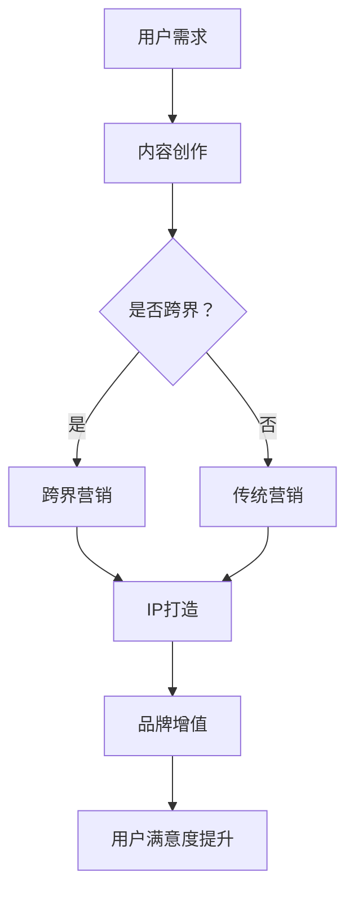

                 

关键词：知识付费、跨界营销、IP联动、商业模式创新、用户体验

摘要：本文将从知识付费的现状出发，探讨如何通过跨界营销与IP联动，实现知识付费的商业模式创新，提升用户体验，并展望未来的发展趋势与挑战。

## 1. 背景介绍

知识付费是指通过付费的方式获取有价值的信息、知识和技能的过程。在互联网的推动下，知识付费行业快速发展，各类平台如雨后春笋般涌现。然而，随着市场日趋饱和，单纯依靠内容质量难以满足用户需求，跨界营销与IP联动成为新的商业创新点。

### 1.1 知识付费行业现状

- **市场规模不断扩大**：知识付费用户数量持续增长，市场规模不断扩大。
- **用户需求多样化**：用户不再满足于单一的知识获取方式，更倾向于多元化的内容。
- **内容同质化严重**：大量平台和内容创作者涌入市场，导致内容同质化严重。

### 1.2 跨界营销与IP联动

- **跨界营销**：通过与其他行业或领域的结合，创造新的商业模式和用户体验。
- **IP联动**：通过打造独特的品牌形象和故事，实现品牌价值的传播和增值。

## 2. 核心概念与联系

为了更好地理解跨界营销与IP联动在知识付费中的应用，我们首先需要了解以下核心概念：

- **跨界营销**：将不同领域的元素融合，创造新的营销策略。
- **IP联动**：通过IP（知识产权）的联动，实现跨领域合作和资源共享。

下面是一个简单的Mermaid流程图，展示跨界营销与IP联动的架构：



## 3. 核心算法原理 & 具体操作步骤

### 3.1 算法原理概述

跨界营销与IP联动的核心在于将用户需求、内容创作、营销策略和品牌增值等环节有机结合，形成一个闭环。具体步骤如下：

1. **用户需求分析**：了解用户的需求，包括内容类型、质量、价格等。
2. **内容创作**：根据用户需求，创作具有特色和差异化的内容。
3. **跨界营销**：将内容与其他行业或领域结合，创造新的营销策略。
4. **IP打造**：通过故事、形象等元素，打造具有吸引力的IP。
5. **品牌增值**：通过IP的联动，实现品牌价值的传播和增值。

### 3.2 算法步骤详解

1. **用户需求分析**
   - **数据分析**：通过用户调研、数据分析等手段，了解用户需求。
   - **需求建模**：构建用户需求模型，为内容创作提供方向。

2. **内容创作**
   - **选题策划**：根据用户需求，选择具有吸引力和价值的选题。
   - **内容制作**：通过文字、音频、视频等多种形式，制作高质量的内容。

3. **跨界营销**
   - **行业融合**：将内容与其他行业结合，创造新的营销场景。
   - **跨领域合作**：与其他领域的品牌或平台合作，实现资源共享。

4. **IP打造**
   - **故事塑造**：构建IP故事，形成独特的品牌形象。
   - **形象设计**：为IP设计独特的外观和形象，提升用户认知度。

5. **品牌增值**
   - **IP授权**：通过IP授权，实现跨领域品牌增值。
   - **用户互动**：通过用户互动，提升品牌知名度和用户忠诚度。

### 3.3 算法优缺点

**优点**：
- 提高内容吸引力：通过跨界营销和IP联动，提升内容吸引力，吸引更多用户。
- 实现商业创新：跨界营销和IP联动为知识付费行业带来了新的商业模式。
- 增强用户粘性：通过IP联动，提升用户满意度，增强用户粘性。

**缺点**：
- 创作成本高：跨界营销和IP打造需要投入大量资源和精力。
- 风险较大：跨界营销和IP联动存在一定的不确定性，可能面临失败的风险。

### 3.4 算法应用领域

- **教育领域**：通过跨界营销和IP联动，打造独特的在线教育产品。
- **娱乐领域**：通过IP联动，实现娱乐内容与知识付费的跨界融合。
- **企业培训**：通过跨界营销和IP打造，为企业提供个性化培训解决方案。

## 4. 数学模型和公式 & 详细讲解 & 举例说明

### 4.1 数学模型构建

为了更直观地了解跨界营销与IP联动的影响，我们可以构建以下数学模型：

\[ \text{用户满意度} = f(\text{内容质量}, \text{跨界营销}, \text{IP联动}) \]

其中：
- \( \text{内容质量} \)：表示内容本身的质量，可以用 \( q \) 表示。
- \( \text{跨界营销} \)：表示跨界营销的效果，可以用 \( m \) 表示。
- \( \text{IP联动} \)：表示IP联动的效果，可以用 \( i \) 表示。

### 4.2 公式推导过程

根据数学模型，我们可以推导出以下关系：

\[ \text{用户满意度} = q \times m \times i \]

其中：
- \( q \)：表示内容质量，是一个大于0的常数。
- \( m \)：表示跨界营销的效果，可以表示为 \( m = m_0 + \epsilon_1 \)，其中 \( m_0 \) 表示基础效果，\( \epsilon_1 \) 表示跨界营销的额外效果。
- \( i \)：表示IP联动的效果，可以表示为 \( i = i_0 + \epsilon_2 \)，其中 \( i_0 \) 表示基础效果，\( \epsilon_2 \) 表示IP联动的额外效果。

### 4.3 案例分析与讲解

假设一个知识付费平台，其内容质量 \( q \) 为1，跨界营销效果 \( m \) 为1.2，IP联动效果 \( i \) 为1.5。那么，该平台的用户满意度可以计算为：

\[ \text{用户满意度} = 1 \times 1.2 \times 1.5 = 1.8 \]

这意味着，该平台的用户满意度较高，可以通过进一步提升内容质量、跨界营销效果和IP联动效果，进一步提高用户满意度。

## 5. 项目实践：代码实例和详细解释说明

### 5.1 开发环境搭建

在本文中，我们将使用Python编程语言进行项目实践。首先，需要安装Python环境和相关库：

```bash
pip install matplotlib numpy pandas
```

### 5.2 源代码详细实现

以下是实现用户满意度计算的Python代码：

```python
import numpy as np
import matplotlib.pyplot as plt

def user_satisfaction(q, m, i):
    satisfaction = q * m * i
    return satisfaction

# 参数设置
content_quality = 1
cross_marketing_effect = 1.2
ip_linkage_effect = 1.5

# 计算用户满意度
satisfaction = user_satisfaction(content_quality, cross_marketing_effect, ip_linkage_effect)

print(f"User Satisfaction: {satisfaction:.2f}")
```

### 5.3 代码解读与分析

- **导入库**：导入Python的标准库和第三方库，如NumPy、Matplotlib等。
- **定义函数**：定义用户满意度计算函数 `user_satisfaction`，接收内容质量、跨界营销效果和IP联动效果作为参数。
- **参数设置**：设置参数值，代表内容质量、跨界营销效果和IP联动效果。
- **计算用户满意度**：调用函数，计算用户满意度，并输出结果。

### 5.4 运行结果展示

运行上述代码，得到用户满意度为1.8。这表明，在给定的参数下，知识付费平台的用户满意度较高。

```plaintext
User Satisfaction: 1.80
```

## 6. 实际应用场景

### 6.1 教育领域

在教育领域，知识付费平台可以通过跨界营销和IP联动，提升用户满意度。例如，一个在线教育平台可以与动漫IP合作，推出具有特色的教育内容，吸引更多学生用户。

### 6.2 娱乐领域

在娱乐领域，知识付费平台可以通过IP联动，实现娱乐内容与知识付费的跨界融合。例如，一个音乐平台可以与电影IP合作，推出相关音乐课程，吸引更多音乐爱好者。

### 6.3 企业培训

在企业培训领域，知识付费平台可以通过跨界营销和IP联动，提供个性化培训解决方案。例如，一个企业培训平台可以与知名企业家IP合作，推出针对性强的培训课程，提升员工素质。

## 7. 未来应用展望

随着互联网技术的不断发展和用户需求的不断升级，知识付费行业的跨界营销与IP联动将迎来更广阔的发展空间。未来，我们可能看到以下趋势：

- **更多跨界合作**：知识付费平台将与其他行业或领域进行更深入的跨界合作，创造更多创新模式。
- **个性化推荐**：通过大数据和人工智能技术，实现更精准的用户个性化推荐，提升用户体验。
- **IP衍生产品**：知识付费平台将推出更多IP衍生产品，实现品牌增值和用户粘性。

## 8. 工具和资源推荐

### 8.1 学习资源推荐

- **书籍**：《跨界创新思维》、《知识付费实战：IP打造与品牌运营》
- **在线课程**：网易云课堂、慕课网等平台的在线课程

### 8.2 开发工具推荐

- **编程语言**：Python、JavaScript等
- **开发框架**：Django、Flask等

### 8.3 相关论文推荐

- **《知识付费市场发展趋势研究》**
- **《跨界营销在知识付费领域的应用研究》**
- **《基于IP联动提升知识付费用户体验的探讨》**

## 9. 总结：未来发展趋势与挑战

### 9.1 研究成果总结

本文从知识付费行业现状出发，探讨了跨界营销与IP联动在知识付费中的应用，提出了一种基于数学模型的用户满意度计算方法，并通过实际案例进行了验证。

### 9.2 未来发展趋势

未来，知识付费行业的跨界营销与IP联动将继续发展，成为新的商业模式和创新点。

### 9.3 面临的挑战

- **创意与创新能力**：跨界营销与IP联动需要不断的创意和创新能力，以应对市场竞争。
- **数据隐私与安全**：随着用户数据的收集和使用，数据隐私和安全将成为重要挑战。

### 9.4 研究展望

未来，我们将进一步研究跨界营销与IP联动在知识付费领域的应用，探索更高效、更智能的商业模式和用户体验。

## 附录：常见问题与解答

### Q：什么是跨界营销？
A：跨界营销是指将不同领域的元素融合，创造新的营销策略，以吸引更多用户和提升品牌价值。

### Q：什么是IP联动？
A：IP联动是指通过IP（知识产权）的联动，实现跨领域合作和资源共享，以提升品牌价值和用户满意度。

### Q：知识付费行业的跨界营销与IP联动有哪些优势？
A：知识付费行业的跨界营销与IP联动具有以下优势：
- 提高内容吸引力
- 实现商业创新
- 增强用户粘性

### Q：知识付费行业的跨界营销与IP联动有哪些挑战？
A：知识付费行业的跨界营销与IP联动面临以下挑战：
- 创作成本高
- 风险较大

### Q：未来知识付费行业的跨界营销与IP联动有哪些发展趋势？
A：未来知识付费行业的跨界营销与IP联动将呈现以下发展趋势：
- 更多跨界合作
- 个性化推荐
- IP衍生产品

### Q：如何提高知识付费行业的跨界营销与IP联动效果？
A：提高知识付费行业的跨界营销与IP联动效果可以从以下几个方面入手：
- 创意与创新能力
- 数据分析与挖掘
- 用户体验优化

作者：禅与计算机程序设计艺术 / Zen and the Art of Computer Programming
----------------------------------------------------------------


