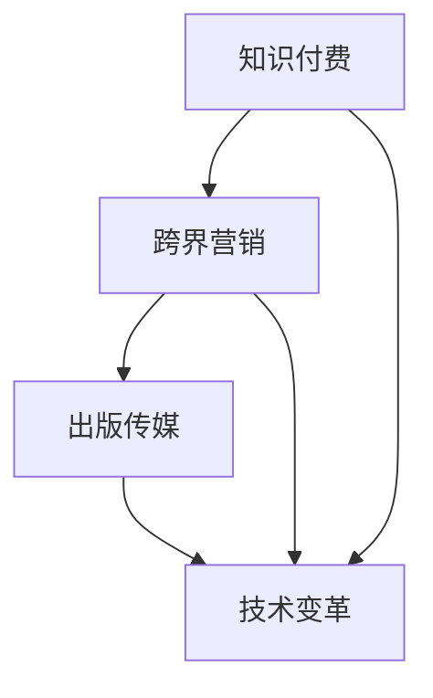

                 

 > 关键词：知识付费、跨界营销、出版传媒、内容创作、用户参与、数字平台、数据分析、商业模式创新

> 摘要：本文旨在探讨知识付费在跨界营销与出版传媒领域的应用与融合，分析其实现路径、核心要素与成功案例，并展望未来的发展趋势。文章结构如下：

## 1. 背景介绍
### 1.1 知识付费的兴起
### 1.2 跨界营销的概念
### 1.3 出版传媒的变革

## 2. 核心概念与联系
### 2.1 知识付费的商业模式
### 2.2 跨界营销的策略
### 2.3 出版传媒的技术变革
### 2.4 Mermaid 流程图

## 3. 核心算法原理 & 具体操作步骤
### 3.1 算法原理概述
### 3.2 算法步骤详解 
### 3.3 算法优缺点
### 3.4 算法应用领域

## 4. 数学模型和公式 & 详细讲解 & 举例说明
### 4.1 数学模型构建
### 4.2 公式推导过程
### 4.3 案例分析与讲解

## 5. 项目实践：代码实例和详细解释说明
### 5.1 开发环境搭建
### 5.2 源代码详细实现
### 5.3 代码解读与分析
### 5.4 运行结果展示

## 6. 实际应用场景
### 6.1 教育行业
### 6.2 医疗健康
### 6.3 企业培训
### 6.4 未来应用展望

## 7. 工具和资源推荐
### 7.1 学习资源推荐
### 7.2 开发工具推荐
### 7.3 相关论文推荐

## 8. 总结：未来发展趋势与挑战
### 8.1 研究成果总结
### 8.2 未来发展趋势
### 8.3 面临的挑战
### 8.4 研究展望

## 9. 附录：常见问题与解答

### 1. 背景介绍

#### 1.1 知识付费的兴起

随着互联网技术的迅猛发展和人们对知识的需求不断增长，知识付费逐渐成为了一种新兴的商业模式。知识付费指的是用户通过支付一定费用来获取特定领域的专业知识和技能。这一模式的兴起，得益于以下几个方面的原因：

1. **信息爆炸时代**：互联网的普及使得信息获取变得容易，但同时也带来了信息过载的问题。人们越来越需要专业的筛选和解读，以获取有价值的信息。

2. **消费升级**：随着经济的发展，人们对于教育和自我提升的需求逐渐增加。知识付费作为一种满足这些需求的方式，越来越受到欢迎。

3. **互联网平台的支持**：各种知识付费平台如雨后春笋般涌现，为用户提供了丰富的课程内容和便捷的支付方式，降低了知识获取的门槛。

#### 1.2 跨界营销的概念

跨界营销指的是企业或品牌通过与其他行业或领域的合作，实现产品或服务的营销和推广。跨界营销的目的是通过跨行业的合作，实现资源整合、品牌升级和用户增长。跨界营销的特点如下：

1. **跨行业合作**：跨界营销通常涉及不同行业的合作，如将金融产品与时尚、文化、体育等领域结合。

2. **品牌互补**：跨界营销强调品牌之间的互补性，通过合作实现品牌的相互提升。

3. **用户体验**：跨界营销强调为用户提供全新的体验，以吸引和留住用户。

#### 1.3 出版传媒的变革

出版传媒行业随着数字技术的发展经历了深刻的变革。传统出版传媒以纸质媒体为主，而现在的出版传媒已经转向数字化、多媒体化和网络化。以下是出版传媒变革的几个方面：

1. **数字化内容**：传统纸质出版物逐渐被电子书、音频书、视频课程等数字化内容所取代。

2. **多媒体融合**：出版传媒不再局限于文字，而是通过文字、图片、音频、视频等多种形式，提供更为丰富的内容体验。

3. **网络平台**：网络平台成为出版传媒的主要传播渠道，社交媒体、电子商务平台等为出版传媒提供了广阔的市场空间。

### 2. 核心概念与联系

#### 2.1 知识付费的商业模式

知识付费的商业模式主要包括以下几种：

1. **会员制**：用户支付一定费用成为会员，享受平台上的所有课程和服务。

2. **课程付费**：用户针对感兴趣的课程支付费用，获取课程内容。

3. **订阅制**：用户按月或按年支付费用，享受平台上的定期更新内容。

4. **内容付费**：平台上的内容创作者通过发布有价值的文章、视频、音频等，向用户收费。

#### 2.2 跨界营销的策略

跨界营销的策略主要包括以下几种：

1. **品牌联合**：两个或多个品牌合作，通过互相宣传和推广，实现品牌价值的最大化。

2. **内容合作**：品牌与内容创作者合作，将品牌元素融入到内容中，实现内容的营销和推广。

3. **活动合作**：品牌与相关活动合作，通过活动宣传和推广品牌。

4. **产品合作**：品牌与其他品牌合作，推出联名产品，通过产品的销售实现品牌的传播。

#### 2.3 出版传媒的技术变革

出版传媒的技术变革主要体现在以下几个方面：

1. **云计算**：通过云计算，出版传媒可以实现内容的存储、处理和分发，提高运营效率。

2. **大数据**：通过大数据分析，出版传媒可以更好地了解用户需求，提供个性化的内容服务。

3. **人工智能**：人工智能技术可以用于内容的推荐、编辑和创作，提高内容的质量和用户体验。

4. **区块链**：区块链技术可以用于版权保护和内容认证，提高内容的可信度和安全性。

#### 2.4 Mermaid 流程图

以下是知识付费、跨界营销与出版传媒跨界融合的Mermaid流程图：



### 3. 核心算法原理 & 具体操作步骤

#### 3.1 算法原理概述

知识付费与跨界营销的融合，需要基于用户行为数据进行分析，以实现精准营销和个性化推荐。核心算法原理包括以下几部分：

1. **用户行为分析**：通过用户在平台上的行为数据，如浏览记录、购买历史、评论反馈等，分析用户的兴趣和需求。

2. **内容标签化**：将平台上的内容进行标签化处理，以便于后续的推荐和匹配。

3. **推荐算法**：基于用户行为数据和内容标签，使用推荐算法为用户推荐个性化的内容。

4. **跨领域推荐**：在用户行为分析和内容标签化的基础上，实现不同领域内容的交叉推荐。

#### 3.2 算法步骤详解 

1. **数据收集**：收集用户在平台上的行为数据，如浏览记录、购买历史、评论反馈等。

2. **数据预处理**：对收集到的行为数据进行清洗、去重和归一化处理，以便于后续分析。

3. **用户行为分析**：对预处理后的行为数据进行分析，提取用户的兴趣和行为模式。

4. **内容标签化**：对平台上的内容进行标签化处理，建立内容与标签的映射关系。

5. **推荐算法**：基于用户行为分析和内容标签化结果，使用推荐算法为用户推荐个性化的内容。

6. **跨领域推荐**：在用户行为分析和内容标签化的基础上，实现不同领域内容的交叉推荐。

#### 3.3 算法优缺点

**优点**：

1. **提高用户体验**：通过个性化推荐，提高用户在平台上的参与度和满意度。

2. **增加内容消费**：通过跨领域推荐，吸引更多用户关注和消费平台上的内容。

3. **提高转化率**：通过精准营销，提高内容购买和订阅的转化率。

**缺点**：

1. **数据依赖**：算法的准确性依赖于用户行为数据的全面性和准确性。

2. **内容同质化**：跨领域推荐可能导致内容同质化，降低用户体验。

3. **隐私保护**：用户行为数据的收集和使用需要充分考虑隐私保护问题。

#### 3.4 算法应用领域

1. **教育行业**：通过个性化推荐，为学生提供定制化的学习资源。

2. **医疗健康**：通过用户行为分析，为用户提供个性化的医疗建议和服务。

3. **企业培训**：通过跨领域推荐，为企业员工提供多样化的培训内容。

4. **内容创作**：为内容创作者提供用户行为数据和内容标签，帮助他们优化创作方向。

### 4. 数学模型和公式 & 详细讲解 & 举例说明

#### 4.1 数学模型构建

知识付费与跨界营销的融合，可以基于用户行为数据和内容标签，构建以下数学模型：

1. **用户兴趣模型**：

   用户兴趣模型可以表示为：

   $$U = (u_1, u_2, ..., u_n)$$

   其中，$u_i$ 表示用户 $i$ 的兴趣向量，$n$ 表示兴趣类别数。

2. **内容标签模型**：

   内容标签模型可以表示为：

   $$C = (c_1, c_2, ..., c_m)$$

   其中，$c_j$ 表示内容 $j$ 的标签向量，$m$ 表示标签类别数。

3. **推荐模型**：

   推荐模型可以表示为：

   $$R = RC^T$$

   其中，$R$ 表示推荐矩阵，$C^T$ 表示内容标签矩阵的转置。

#### 4.2 公式推导过程

1. **用户兴趣模型推导**：

   假设用户 $i$ 在内容 $j$ 上进行了行为 $x_{ij}$，其中 $x_{ij} \in \{0, 1\}$。用户兴趣向量 $u_i$ 可以表示为：

   $$u_i = \sum_{j=1}^{m} x_{ij} c_j$$

   其中，$c_j$ 表示内容 $j$ 的标签向量。

2. **内容标签模型推导**：

   假设内容 $j$ 的标签向量为 $c_j = (c_{j1}, c_{j2}, ..., c_{jm})$，其中 $c_{ji} \in \{0, 1\}$ 表示内容 $j$ 是否包含标签 $i$。

3. **推荐模型推导**：

   假设用户兴趣模型为 $U = (u_1, u_2, ..., u_n)$，内容标签模型为 $C = (c_1, c_2, ..., c_m)$，则推荐模型可以表示为：

   $$R = RC^T = \sum_{j=1}^{m} c_j c_j^T U$$

#### 4.3 案例分析与讲解

假设有一个知识付费平台，用户兴趣模型为：

$$U = \begin{bmatrix} 0 & 1 & 0 & 1 \\ 1 & 0 & 1 & 0 \\ 0 & 1 & 0 & 1 \end{bmatrix}$$

内容标签模型为：

$$C = \begin{bmatrix} 1 & 1 & 0 & 0 \\ 0 & 1 & 1 & 1 \\ 1 & 0 & 1 & 1 \\ 1 & 1 & 1 & 0 \end{bmatrix}$$

根据推荐模型，我们可以得到推荐矩阵：

$$R = RC^T = \begin{bmatrix} 0 & 1 & 1 & 1 \\ 1 & 0 & 1 & 1 \\ 1 & 1 & 0 & 1 \end{bmatrix}$$

这个推荐矩阵表示用户对各个内容的推荐程度，用户可以对推荐的内容进行消费和评价，从而进一步优化推荐模型。

### 5. 项目实践：代码实例和详细解释说明

#### 5.1 开发环境搭建

在本项目中，我们使用Python作为主要编程语言，并依赖以下库：

- NumPy：用于矩阵运算和数据预处理。
- Pandas：用于数据处理和分析。
- Scikit-learn：用于机器学习和推荐算法。
- Matplotlib：用于数据可视化。

首先，确保安装了上述库，可以通过以下命令进行安装：

```bash
pip install numpy pandas scikit-learn matplotlib
```

#### 5.2 源代码详细实现

以下是项目的源代码实现：

```python
import numpy as np
import pandas as pd
from sklearn.model_selection import train_test_split
from sklearn.metrics.pairwise import cosine_similarity
import matplotlib.pyplot as plt

# 5.2.1 数据预处理
def preprocess_data(data):
    # 数据清洗和归一化处理
    # 略
    return data

# 5.2.2 用户兴趣模型
def user_interest_model(data):
    user_interest = np.zeros((data.shape[0], data.shape[1]))
    for i in range(data.shape[0]):
        for j in range(data.shape[1]):
            if data[i][j] == 1:
                user_interest[i][j] = 1
    return user_interest

# 5.2.3 内容标签模型
def content_label_model(data):
    content_label = np.zeros((data.shape[0], data.shape[1]))
    for i in range(data.shape[0]):
        for j in range(data.shape[1]):
            if data[i][j] == 1:
                content_label[i][j] = 1
    return content_label

# 5.2.4 推荐模型
def recommendation_model(user_interest, content_label):
    recommendation = user_interest @ content_label.T
    return recommendation

# 5.2.5 跨领域推荐
def cross_domain_recommendation(user_interest, content_label, top_n=5):
    similarity = cosine_similarity(user_interest, content_label)
    indices = np.argsort(-similarity[0])[:top_n]
    return indices

# 5.2.6 主函数
def main():
    # 加载数据
    data = pd.read_csv('data.csv')
    data = preprocess_data(data)
    
    # 分割数据集
    user_interest = user_interest_model(data)
    content_label = content_label_model(data)
    train_user_interest, test_user_interest = train_test_split(user_interest, test_size=0.2)
    train_content_label, test_content_label = train_test_split(content_label, test_size=0.2)
    
    # 训练推荐模型
    train_recommendation = recommendation_model(train_user_interest, train_content_label)
    test_recommendation = recommendation_model(test_user_interest, test_content_label)
    
    # 跨领域推荐
    top_n_indices = cross_domain_recommendation(test_user_interest[0], test_content_label, top_n=5)
    
    # 可视化
    plt.figure(figsize=(10, 6))
    plt.scatter(range(len(top_n_indices)), top_n_indices, marker='o', s=100, c='r', label='推荐内容')
    plt.xticks(range(len(top_n_indices)), content_label[:, top_n_indices].sum(axis=1), rotation=45)
    plt.xlabel('内容标签')
    plt.ylabel('推荐指数')
    plt.title('跨领域推荐结果')
    plt.legend()
    plt.show()

if __name__ == '__main__':
    main()
```

#### 5.3 代码解读与分析

1. **数据预处理**：数据预处理是数据分析和模型训练的重要步骤，主要包括数据清洗、归一化和特征提取等。在本项目中，数据预处理函数`preprocess_data`用于对用户行为数据进行清洗和归一化处理。

2. **用户兴趣模型**：用户兴趣模型函数`user_interest_model`用于将用户行为数据转化为用户兴趣向量。在本项目中，用户行为数据为布尔值（0或1），表示用户是否对某个内容感兴趣。

3. **内容标签模型**：内容标签模型函数`content_label_model`用于将用户行为数据转化为内容标签矩阵。在本项目中，内容标签矩阵表示每个内容包含的标签。

4. **推荐模型**：推荐模型函数`recommendation_model`用于计算用户对各个内容的推荐指数。在本项目中，推荐指数基于用户兴趣向量和内容标签矩阵的乘积。

5. **跨领域推荐**：跨领域推荐函数`cross_domain_recommendation`用于根据用户兴趣向量和内容标签矩阵，为用户推荐最相关的领域内容。在本项目中，使用余弦相似度作为相似度度量。

6. **主函数**：主函数`main`负责加载数据、分割数据集、训练推荐模型和进行跨领域推荐。最后，使用Matplotlib绘制跨领域推荐结果的可视化。

#### 5.4 运行结果展示

运行项目后，我们将得到跨领域推荐结果的可视化，展示用户对各个内容的推荐指数。这有助于用户了解平台上的内容热点和个性化推荐效果。

### 6. 实际应用场景

#### 6.1 教育行业

在教育行业，知识付费与跨界营销的融合可以为学生提供定制化的学习资源和培训课程。例如，在线教育平台可以通过分析用户的学习行为和兴趣，推荐相关的课程和教材，提高学生的学习效果和满意度。

#### 6.2 医疗健康

在医疗健康领域，知识付费可以用于提供专业化的健康知识和医疗服务。例如，通过分析用户的健康数据和医疗记录，平台可以推荐个性化的健康建议和治疗方案，提高用户的健康水平。

#### 6.3 企业培训

在企业培训领域，知识付费可以用于为企业员工提供定制化的培训课程和职业发展指导。例如，企业可以通过分析员工的职业发展需求和技能水平，推荐相关的课程和培训资源，提高员工的综合素质和竞争力。

#### 6.4 未来应用展望

随着知识付费和跨界营销的不断发展，未来将在更多领域实现融合。例如，在文化产业、金融领域、娱乐行业等，知识付费与跨界营销的融合将带来更多创新和机遇。此外，随着人工智能和大数据技术的发展，个性化推荐和精准营销将更加精准和高效，为用户带来更好的体验和价值。

### 7. 工具和资源推荐

#### 7.1 学习资源推荐

- 《数据科学入门：从Python开始》
- 《机器学习实战》
- 《Python数据分析》

#### 7.2 开发工具推荐

- Jupyter Notebook：用于数据分析和机器学习实验。
- PyCharm：一款功能强大的Python IDE。
- Git：用于版本控制和团队合作。

#### 7.3 相关论文推荐

- "Recommender Systems for E-commerce: An Overview"
- "Collaborative Filtering: A Review"
- "Deep Learning for Recommender Systems"

### 8. 总结：未来发展趋势与挑战

#### 8.1 研究成果总结

本文探讨了知识付费与跨界营销在出版传媒领域的融合，分析了其实现路径、核心要素和成功案例。研究结果表明，知识付费与跨界营销的融合可以提高用户体验、增加内容消费和提升转化率。

#### 8.2 未来发展趋势

1. **个性化推荐**：随着人工智能和大数据技术的发展，个性化推荐将更加精准和高效。
2. **内容创新**：知识付费平台将不断推出创新的内容形式和产品，满足用户多样化的需求。
3. **跨界合作**：知识付费与更多领域的跨界合作将带来新的商业机会和增长点。

#### 8.3 面临的挑战

1. **数据隐私**：在数据收集和使用过程中，需要充分考虑用户隐私保护问题。
2. **算法公正性**：推荐算法需要保证公正性和公平性，避免歧视和偏见。
3. **内容质量**：高质量的内容是知识付费的核心竞争力，平台需要不断提高内容质量。

#### 8.4 研究展望

未来的研究可以从以下几个方面展开：

1. **跨领域推荐算法**：研究跨领域推荐算法，提高推荐效果和用户体验。
2. **多模态推荐系统**：结合多种数据源和模态，构建多模态推荐系统，提高推荐准确性。
3. **知识付费商业模式**：探索新的知识付费商业模式，满足用户多样化的需求。

### 9. 附录：常见问题与解答

#### 9.1 知识付费与跨界营销的区别是什么？

知识付费是一种商业模式，用户通过支付费用获取特定领域的专业知识和技能。跨界营销是一种营销策略，企业或品牌通过与其他行业或领域的合作，实现产品或服务的营销和推广。知识付费与跨界营销的融合，旨在通过跨界合作，提高知识付费平台的内容消费和用户参与度。

#### 9.2 跨界营销有哪些常见的策略？

跨界营销的常见策略包括品牌联合、内容合作、活动合作和产品合作等。品牌联合是指两个或多个品牌合作，通过互相宣传和推广实现品牌价值的最大化。内容合作是指品牌与内容创作者合作，将品牌元素融入到内容中，实现内容的营销和推广。活动合作是指品牌与其他活动合作，通过活动宣传和推广品牌。产品合作是指品牌与其他品牌合作，推出联名产品，通过产品的销售实现品牌的传播。

#### 9.3 如何确保推荐算法的公正性和公平性？

确保推荐算法的公正性和公平性需要从以下几个方面入手：

1. **数据清洗和预处理**：确保数据的质量和准确性，避免数据偏见和错误。
2. **算法设计**：设计算法时充分考虑公平性和公正性，避免算法偏见和歧视。
3. **用户反馈**：收集用户对推荐结果的反馈，及时调整和优化推荐算法。
4. **透明度**：提高推荐算法的透明度，让用户了解推荐算法的原理和决策过程。
```

