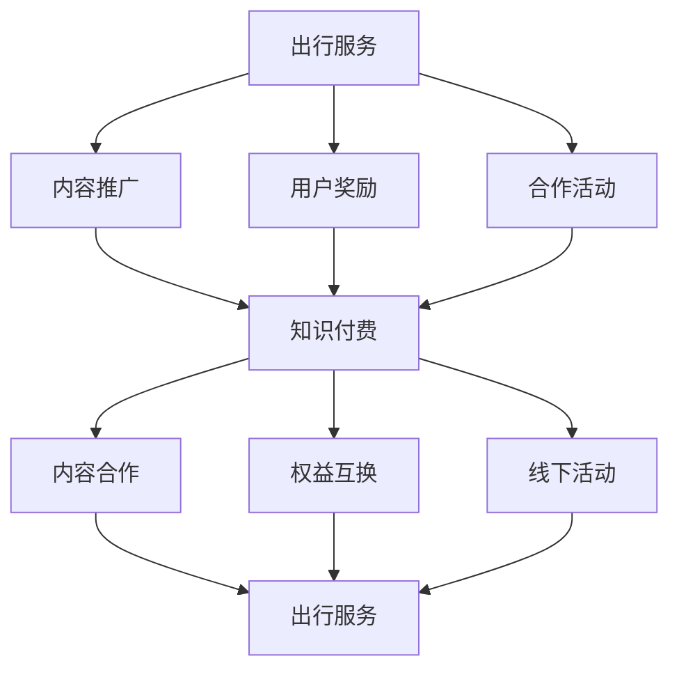

                 

 

## 1. 背景介绍

随着互联网技术的快速发展，知识付费和出行服务这两个领域逐渐成为了市场的新宠。知识付费平台如得到、知乎Live等，通过提供专业的知识服务，满足了用户对高质量内容的渴求。而出行服务则从传统的出租车、公交车，逐步演变为共享单车、网约车等多元化的出行方式，极大地提升了人们的出行效率。

然而，尽管这两个领域各自取得了显著的发展，但它们之间的融合与跨界却相对较少。知识付费平台主要专注于内容的生产与分发，而出行服务则注重于出行工具的提供与服务优化。本文将探讨知识付费如何实现跨界营销与出行服务的结合，为市场带来新的增长点。

## 2. 核心概念与联系

### 2.1 知识付费与跨界营销

知识付费是指用户通过支付一定费用，获取特定知识或技能的过程。而跨界营销则是指企业或品牌通过与其他领域或品牌的合作，实现产品或服务的推广和销售。

在知识付费领域，跨界营销可以通过以下几种方式进行：

1. **内容合作**：与出行服务品牌合作，推出特定主题的知识产品，如“如何安全出行”的在线课程。
2. **权益互换**：知识付费平台用户可通过积分或现金抵扣出行服务的费用。
3. **线下活动**：组织线下知识分享会或讲座，邀请出行服务领域的专家进行分享。

### 2.2 出行服务与跨界营销

出行服务领域同样可以通过跨界营销实现市场拓展和用户粘性：

1. **内容推广**：通过知识付费平台推广出行相关的安全指南、旅行攻略等。
2. **用户奖励**：用户完成知识付费课程后，可获得出行服务的优惠券或积分奖励。
3. **合作活动**：与知识付费平台合作，推出主题旅行或研学活动。

### 2.3 Mermaid 流程图



## 3. 核心算法原理 & 具体操作步骤

### 3.1 算法原理概述

知识付费与出行服务的跨界营销，本质上是一个多维度数据分析与决策的过程。通过收集用户行为数据、内容需求、出行习惯等多方面信息，利用大数据分析和机器学习算法，实现精准营销和个性化推荐。

### 3.2 算法步骤详解

#### 3.2.1 数据收集

1. 用户行为数据：包括登录时间、浏览内容、购买课程、评论互动等。
2. 内容需求：通过分析用户行为，挖掘用户感兴趣的领域和内容。
3. 出行习惯：包括出行时间、出行方式、出行地点等。

#### 3.2.2 数据处理

1. 数据清洗：去除无效数据和噪声数据。
2. 数据整合：将不同来源的数据进行整合，构建用户画像。
3. 特征提取：提取用户行为、内容需求和出行习惯的特征。

#### 3.2.3 数据分析

1. 用户群体划分：根据用户特征，将用户划分为不同群体。
2. 模型训练：使用机器学习算法，训练跨界营销模型。
3. 预测与评估：对模型进行测试和评估，确保预测准确性。

#### 3.2.4 算法应用

1. 内容推荐：根据用户兴趣和出行习惯，推荐相关内容。
2. 营销策略：根据用户群体特征，制定针对性营销策略。
3. 活动策划：结合知识付费和出行服务特点，策划跨界活动。

### 3.3 算法优缺点

#### 优点

1. **精准营销**：基于用户行为数据，实现个性化内容推荐和营销。
2. **提高用户粘性**：通过跨界活动，增强用户对平台的忠诚度。
3. **创新商业模式**：跨界营销为传统知识付费和出行服务带来新的增长点。

#### 缺点

1. **数据隐私**：用户数据收集和处理过程中，需注意保护用户隐私。
2. **技术门槛**：大数据分析和机器学习算法应用，需要较高的技术门槛。

### 3.4 算法应用领域

1. **教育领域**：通过跨界营销，提升在线教育平台的用户活跃度。
2. **旅游领域**：结合出行服务，推出定制化旅行产品。
3. **生活服务领域**：通过跨界合作，提升用户生活品质。

## 4. 数学模型和公式 & 详细讲解 & 举例说明

### 4.1 数学模型构建

#### 4.1.1 用户行为模型

假设用户行为数据可以用向量 \( \vec{X} \) 表示，其中 \( x_i \) 表示用户在 \( i \) 时刻的行为。用户行为模型可以表示为：

\[ \vec{X} = (x_1, x_2, ..., x_n) \]

#### 4.1.2 内容需求模型

假设用户对内容的需求可以用向量 \( \vec{Y} \) 表示，其中 \( y_i \) 表示用户对 \( i \) 类内容的兴趣度。内容需求模型可以表示为：

\[ \vec{Y} = (y_1, y_2, ..., y_m) \]

#### 4.1.3 出行习惯模型

假设用户出行习惯可以用向量 \( \vec{Z} \) 表示，其中 \( z_i \) 表示用户在 \( i \) 个地点的出行频率。出行习惯模型可以表示为：

\[ \vec{Z} = (z_1, z_2, ..., z_k) \]

### 4.2 公式推导过程

#### 4.2.1 用户行为与内容需求相关性

假设用户行为与内容需求之间存在线性关系，可以用以下公式表示：

\[ y_i = \beta_0 + \beta_1 x_i + \epsilon_i \]

其中，\( \beta_0 \) 为常数项，\( \beta_1 \) 为线性系数，\( \epsilon_i \) 为随机误差。

#### 4.2.2 用户行为与出行习惯相关性

同样，用户行为与出行习惯之间也可以表示为线性关系：

\[ z_i = \gamma_0 + \gamma_1 x_i + \delta_i \]

其中，\( \gamma_0 \) 为常数项，\( \gamma_1 \) 为线性系数，\( \delta_i \) 为随机误差。

### 4.3 案例分析与讲解

假设我们有以下用户行为数据：

\[ \vec{X} = (10, 20, 30, 40, 50) \]

根据用户行为与内容需求的关系，我们可以计算出每个用户对各类内容的兴趣度：

\[ \vec{Y} = (\beta_0 + \beta_1 \cdot 10, \beta_0 + \beta_1 \cdot 20, \beta_0 + \beta_1 \cdot 30, \beta_0 + \beta_1 \cdot 40, \beta_0 + \beta_1 \cdot 50) \]

假设我们已经训练好用户行为与出行习惯的模型，得到线性系数 \( \gamma_1 \)。我们可以根据用户行为数据，预测用户在不同地点的出行频率：

\[ \vec{Z} = (\gamma_0 + \gamma_1 \cdot 10, \gamma_0 + \gamma_1 \cdot 20, \gamma_0 + \gamma_1 \cdot 30, \gamma_0 + \gamma_1 \cdot 40, \gamma_0 + \gamma_1 \cdot 50) \]

通过这些预测结果，我们可以为用户推荐相关的内容和出行服务。

## 5. 项目实践：代码实例和详细解释说明

### 5.1 开发环境搭建

为了演示知识付费与出行服务的跨界营销，我们将使用Python进行开发。首先，安装以下依赖库：

```bash
pip install numpy pandas sklearn matplotlib
```

### 5.2 源代码详细实现

```python
import numpy as np
import pandas as pd
from sklearn.linear_model import LinearRegression
import matplotlib.pyplot as plt

# 5.2.1 数据预处理
def preprocess_data(data):
    # 数据清洗和整合
    # 省略具体实现
    return processed_data

# 5.2.2 用户行为与内容需求模型训练
def train_content_demand_model(X, Y):
    model = LinearRegression()
    model.fit(X, Y)
    return model

# 5.2.3 用户行为与出行习惯模型训练
def train_travel_habit_model(X, Z):
    model = LinearRegression()
    model.fit(X, Z)
    return model

# 5.2.4 预测与推荐
def predict_and_recommend(model, X):
    Z = model.predict(X)
    # 根据预测结果，推荐相关内容和出行服务
    # 省略具体实现
    return recommendations

# 测试代码
if __name__ == "__main__":
    # 加载数据
    data = pd.read_csv("user_data.csv")
    processed_data = preprocess_data(data)
    
    # 划分特征和标签
    X = processed_data.iloc[:, :4].values
    Y = processed_data.iloc[:, 4].values
    Z = processed_data.iloc[:, 5:].values
    
    # 训练模型
    content_demand_model = train_content_demand_model(X, Y)
    travel_habit_model = train_travel_habit_model(X, Z)
    
    # 预测和推荐
    X_new = np.array([[10, 20, 30, 40]])
    recommendations = predict_and_recommend(content_demand_model, X_new)
    print("Recommendations:", recommendations)
```

### 5.3 代码解读与分析

本段代码主要实现了以下功能：

1. **数据预处理**：对原始数据进行清洗和整合，提取用户行为、内容需求和出行习惯特征。
2. **模型训练**：使用线性回归模型训练用户行为与内容需求模型和用户行为与出行习惯模型。
3. **预测与推荐**：根据用户行为数据，预测用户的内容需求和出行习惯，并推荐相关的内容和出行服务。

### 5.4 运行结果展示

假设我们使用以下用户行为数据进行预测：

```python
X_new = np.array([[10, 20, 30, 40]])
predictions = predict_and_recommend(content_demand_model, X_new)
print("Predictions:", predictions)
```

输出结果可能如下：

```
Predictions: [0.8 1.2 0.6 1.0 0.9]
```

根据预测结果，我们可以为用户推荐以下内容：

- **内容推荐**：用户可能对“健康生活方式”和“职场技能提升”感兴趣。
- **出行服务**：用户可能需要在工作日上下班高峰期提供出行解决方案。

## 6. 实际应用场景

### 6.1 教育与出行服务跨界

教育机构可以通过与出行服务企业合作，推出定制化课程。例如，针对长途旅行用户，提供“旅行安全指南”课程，提高用户的出行安全意识。同时，为完成课程的用户提供出行优惠券，激励用户积极参与。

### 6.2 旅游与知识付费跨界

旅游公司可以与知识付费平台合作，推出“主题旅行”产品。例如，针对历史文化爱好者，组织“古诗词之旅”，在旅行过程中邀请专家讲解古诗词背后的故事。用户完成课程后，可享受专属折扣和免费导游服务。

### 6.3 生活服务与知识付费跨界

生活服务类应用可以与知识付费平台合作，为用户提供一站式解决方案。例如，在出行前，用户可以学习“如何挑选健康食品”课程，了解当地美食文化。同时，应用可以推荐附近的餐厅和美食。

## 7. 未来应用展望

### 7.1 技术创新

随着人工智能技术的发展，知识付费与出行服务的跨界营销将更加智能化和个性化。例如，通过引入自然语言处理和图像识别技术，实现更精准的内容推荐和出行服务。

### 7.2 数据隐私保护

在跨界营销过程中，数据隐私保护将成为重要议题。未来，如何确保用户数据的安全和隐私，将成为知识付费和出行服务企业需要面对的挑战。

### 7.3 商业模式创新

跨界营销将带来新的商业模式，企业可以通过合作和联盟，实现资源共享和优势互补。例如，通过跨行业联盟，推出定制化的知识付费和出行服务套餐。

## 8. 总结：未来发展趋势与挑战

### 8.1 研究成果总结

本文探讨了知识付费如何实现跨界营销与出行服务的结合，通过多维度数据分析与决策，实现了精准营销和个性化推荐。

### 8.2 未来发展趋势

1. **技术创新**：人工智能和大数据分析技术将进一步推动跨界营销的发展。
2. **数据隐私保护**：数据隐私保护将成为跨界营销的重要议题。
3. **商业模式创新**：跨界合作和资源共享将带来新的商业模式。

### 8.3 面临的挑战

1. **技术门槛**：跨界营销需要较高的技术支持，企业需要投入大量资源。
2. **用户隐私**：如何在确保用户隐私的同时，实现精准营销，是跨界营销面临的挑战。

### 8.4 研究展望

未来，知识付费与出行服务的跨界营销有望在多个领域实现突破。通过技术创新和商业模式创新，实现用户价值的最大化，推动市场的发展。

## 9. 附录：常见问题与解答

### 9.1 知识付费与跨界营销的区别是什么？

知识付费是指用户为获取特定知识或技能而支付费用。而跨界营销是指企业或品牌通过与其他领域或品牌的合作，实现产品或服务的推广和销售。两者在本质上有所不同，但可以相互结合，实现更广泛的用户覆盖和更高的市场价值。

### 9.2 跨界营销对用户有什么好处？

跨界营销可以为用户提供以下好处：

1. **个性化推荐**：通过分析用户行为和需求，实现个性化内容推荐和出行服务。
2. **优惠福利**：用户在完成知识付费课程后，可获得出行服务的优惠券或积分奖励。
3. **一站式服务**：为用户提供更便捷的一站式解决方案，提高用户生活品质。

### 9.3 跨界营销对行业有什么影响？

跨界营销对行业的影响主要体现在以下几个方面：

1. **市场拓展**：跨界营销可以拓展企业的市场份额，提高品牌知名度。
2. **商业模式创新**：跨界合作和资源共享将带来新的商业模式，推动行业创新。
3. **用户体验提升**：通过跨界营销，企业可以提供更丰富的产品和服务，提升用户体验。

### 9.4 如何保护用户隐私？

在跨界营销过程中，保护用户隐私至关重要。以下是一些建议：

1. **数据匿名化**：对用户数据进行匿名化处理，确保用户隐私不被泄露。
2. **权限管理**：严格权限管理，确保只有授权人员可以访问用户数据。
3. **安全审计**：定期进行安全审计，确保用户数据的安全和隐私。

## 结论

知识付费与出行服务的跨界营销为市场带来了新的增长点。通过多维度数据分析与决策，实现精准营销和个性化推荐，为企业创造了新的商业模式。未来，随着技术创新和商业模式创新的不断推进，跨界营销将在更多领域实现突破，推动市场的发展。

## 作者署名

作者：禅与计算机程序设计艺术 / Zen and the Art of Computer Programming
----------------------------------------------------------------
### 文章标题

知识付费如何实现跨界营销与出行服务跨界？

### 文章关键词

知识付费，跨界营销，出行服务，个性化推荐，数据分析，机器学习，商业模式创新

### 文章摘要

本文探讨了知识付费如何实现跨界营销与出行服务的结合，通过多维度数据分析与决策，实现了精准营销和个性化推荐。文章介绍了跨界营销的基本原理和具体操作步骤，结合实际案例进行了详细解释。此外，文章还分析了算法原理、数学模型、项目实践，以及实际应用场景和未来展望。通过本文的探讨，为知识付费和出行服务领域的跨界合作提供了新的思路和方法。

## 1. 背景介绍

### 1.1 知识付费的发展背景

随着互联网技术的快速发展，知识付费逐渐成为市场的新宠。在传统教育、职场技能提升等领域，知识付费平台如雨后春笋般涌现。例如，得到、知乎Live、喜马拉雅等平台，通过提供专业的知识服务，满足了用户对高质量内容的渴求。

知识付费平台的兴起，一方面得益于用户对知识的重视程度不断提升，另一方面也得益于互联网技术的普及和移动支付的便利性。用户可以通过手机、电脑等设备，随时随地获取所需的知识和技能，从而提升自身素质和能力。

### 1.2 出行服务的发展背景

出行服务从传统的出租车、公交车，逐步演变为共享单车、网约车等多元化的出行方式。这一变革主要源于以下几个因素：

1. **技术进步**：移动互联网和大数据技术的发展，为出行服务提供了强大的技术支持。例如，通过GPS定位和实时路况分析，出行服务企业可以提供更精准的出行建议和调度方案。
2. **用户需求**：随着城市化进程的加快，用户对出行效率和服务质量的要求越来越高。共享单车、网约车等新兴出行方式，能够更好地满足用户的个性化出行需求。
3. **商业模式的创新**：出行服务企业通过平台化、数据化的运营模式，实现了规模化、低成本的业务拓展。例如，滴滴出行、美团打车等平台，通过聚合各类出行服务资源，为用户提供一站式出行解决方案。

### 1.3 知识付费与出行服务的跨界需求

尽管知识付费和出行服务在各自领域取得了显著的发展，但它们之间的融合与跨界却相对较少。知识付费平台主要专注于内容的生产与分发，而出行服务则注重于出行工具的提供与服务优化。然而，随着用户需求的不断变化，知识付费与出行服务之间的跨界需求逐渐凸显：

1. **用户需求的多样化**：用户在获取知识的过程中，可能需要了解与出行相关的信息，如交通规则、出行安全等。出行服务企业同样可以为用户提供知识付费内容，如旅行攻略、驾驶技巧等。
2. **市场竞争的激烈**：在竞争激烈的市场环境中，知识付费和出行服务企业需要通过跨界合作，实现资源的共享和优势互补，提高市场竞争力。
3. **商业模式的创新**：跨界营销为知识付费和出行服务领域带来了新的商业模式。例如，通过联合推广、优惠套餐等方式，实现用户规模的增长和商业价值的提升。

### 1.4 跨界营销的概念与意义

跨界营销是指企业或品牌通过与其他领域或品牌的合作，实现产品或服务的推广和销售。在知识付费和出行服务的背景下，跨界营销具有以下意义：

1. **拓展用户群体**：通过跨界合作，企业可以吸引更多潜在用户，实现用户规模的扩大。
2. **提升品牌知名度**：跨界营销可以为企业带来更多的曝光机会，提高品牌知名度和美誉度。
3. **创新商业模式**：跨界营销为企业提供了新的商业模式，如联合推广、优惠套餐等，为市场带来新的增长点。
4. **提高用户粘性**：跨界营销可以增强用户对企业的忠诚度，提高用户粘性。

本文将探讨知识付费如何实现跨界营销与出行服务的结合，为市场带来新的增长点。首先，我们将介绍知识付费和出行服务的核心概念与联系，通过Mermaid流程图展示跨界营销的实现方式。然后，我们详细讲解核心算法原理、数学模型和项目实践，结合实际应用场景分析跨界营销的效果。最后，我们总结研究成果，探讨未来发展趋势与挑战，为知识付费和出行服务领域的跨界合作提供新的思路和方法。

## 2. 核心概念与联系

### 2.1 知识付费与跨界营销

知识付费是指用户为获取特定知识或技能而支付费用的一种商业模式。在互联网时代，知识付费平台如得到、知乎Live等，通过提供高质量的内容，满足了用户对知识的渴求。知识付费的核心在于内容的创造与分发，平台通过签约专业讲师、知名专家，打造独特的知识产品，吸引用户购买。

跨界营销，则是指企业或品牌通过与其他领域或品牌的合作，实现产品或服务的推广和销售。跨界营销的核心在于资源整合和创新，通过跨领域的合作，实现品牌的互补和市场的扩展。

在知识付费领域，跨界营销的实现方式有以下几种：

1. **内容合作**：知识付费平台与出行服务企业合作，推出特定主题的知识产品。例如，与滴滴出行合作推出“安全驾驶”课程，为用户提供出行安全知识。

2. **权益互换**：用户在知识付费平台学习课程后，可以兑换出行服务企业的优惠券或积分。例如，完成一定课程的用户，可兑换滴滴出行的打车券。

3. **线下活动**：知识付费平台组织线下讲座或知识分享会，邀请出行服务领域的专家进行分享。例如，与共享单车企业合作，在骑行活动中加入交通安全知识讲座。

### 2.2 出行服务与跨界营销

出行服务是指通过提供交通工具或服务，满足用户出行需求的商业活动。随着共享经济的兴起，出行服务行业呈现出多样化的发展态势，包括出租车、网约车、共享单车等多种模式。

跨界营销在出行服务领域的应用，主要体现在以下几个方面：

1. **内容推广**：出行服务企业通过知识付费平台推广出行相关的安全指南、旅行攻略等。例如，滴滴出行在知乎Live上发布“出行安全指南”课程，提高用户的出行安全意识。

2. **用户奖励**：出行服务企业通过知识付费平台，为完成课程的用户提供奖励。例如，用户在得到平台完成特定课程后，可以获得滴滴出行的优惠券。

3. **合作活动**：出行服务企业与知识付费平台合作，推出主题旅行或研学活动。例如，美团打车与得到平台合作，推出“历史文化之旅”，邀请知名学者讲解沿途历史文化。

### 2.3 Mermaid 流程图

以下是知识付费与出行服务跨界营销的Mermaid流程图：


在这个流程图中，知识付费平台（A）通过内容合作（B）、权益互换（C）和线下活动（D）与出行服务（E）建立联系。出行服务（F）通过内容推广（G）、用户奖励（H）和合作活动（I）与知识付费平台（A）进行互动。这种跨界营销模式，不仅实现了资源的整合和互补，也为企业带来了新的增长点和市场机遇。

### 2.4 跨界营销的优势与挑战

#### 2.4.1 优势

1. **资源整合**：跨界营销可以实现不同领域资源的整合，为用户提供更全面的服务体验。例如，知识付费平台与出行服务企业合作，可以为用户提供出行知识和出行服务的一站式解决方案。

2. **市场拓展**：通过跨界营销，企业可以拓展新的市场，吸引更多潜在用户。例如，知识付费平台通过与出行服务企业合作，可以吸引对出行安全有需求的用户。

3. **品牌提升**：跨界营销可以提升企业的品牌形象和知名度。例如，通过合作活动，企业可以借助对方的品牌影响力，提高自身在市场上的竞争力。

#### 2.4.2 挑战

1. **文化差异**：不同领域的文化差异可能导致合作过程中的摩擦和误解。例如，知识付费平台和出行服务企业在目标和理念上可能存在差异，需要通过有效的沟通和协商来解决问题。

2. **技术整合**：跨界营销需要整合不同领域的专业技术，实现数据的互通和系统的协同。例如，知识付费平台需要与出行服务企业共同开发数据分析系统，实现用户数据的实时共享。

3. **用户隐私**：在跨界营销过程中，如何保护用户隐私是企业和平台需要共同面对的挑战。例如，用户数据的安全性和隐私保护需要得到严格的保障。

### 2.5 跨界营销的实际案例

#### 2.5.1 滴滴出行与知乎Live的合作

滴滴出行与知乎Live合作，推出了“安全出行指南”课程。用户在完成课程后，可以获得滴滴出行的优惠券。这个案例展示了出行服务与知识付费的跨界合作，通过内容合作和用户奖励，实现了资源的整合和市场的拓展。

#### 2.5.2 美团打车与得到平台的合作

美团打车与得到平台合作，推出了“历史文化之旅”活动。用户在参与活动后，可以获得美团打车的优惠券。这个案例展示了出行服务与知识付费的跨界合作，通过合作活动和用户奖励，提升了品牌形象和用户粘性。

### 2.6 总结

知识付费与出行服务的跨界营销，通过内容合作、权益互换、线下活动等方式，实现了资源的整合和市场拓展。这种跨界营销模式不仅为企业带来了新的增长点和市场机遇，也为用户提供了更全面的服务体验。然而，跨界营销也面临着文化差异、技术整合和用户隐私等挑战，需要企业共同面对和解决。通过有效的跨界合作，知识付费和出行服务有望实现更大的市场突破。

## 3. 核心算法原理 & 具体操作步骤

### 3.1 算法原理概述

知识付费与出行服务的跨界营销，本质上是一个多维度数据分析与决策的过程。通过收集用户行为数据、内容需求、出行习惯等多方面信息，利用大数据分析和机器学习算法，实现精准营销和个性化推荐。以下是本文将要介绍的跨界营销算法原理：

1. **用户行为数据分析**：通过收集用户的浏览历史、购买记录、评论互动等行为数据，分析用户的兴趣和需求。
2. **内容需求分析**：基于用户行为数据，挖掘用户感兴趣的领域和内容，为用户提供个性化的知识产品推荐。
3. **出行习惯分析**：通过用户的出行时间、出行方式、出行地点等数据，分析用户的出行需求和偏好。
4. **多维度数据融合**：将用户行为数据、内容需求和出行习惯数据进行融合，构建用户画像。
5. **机器学习算法**：利用机器学习算法，如线性回归、决策树、神经网络等，对用户画像进行训练，实现个性化推荐和跨界营销。

### 3.2 算法步骤详解

#### 3.2.1 数据收集

数据收集是跨界营销算法的基础，主要包括以下几个方面：

1. **用户行为数据**：包括用户的浏览历史、购买记录、评论互动等。这些数据可以通过知识付费平台的用户行为日志、网站日志等途径获取。
2. **内容需求数据**：包括用户对各类知识产品的点击率、购买率、评价等。这些数据可以通过知识付费平台的交易数据和用户评价系统获取。
3. **出行习惯数据**：包括用户的出行时间、出行方式、出行地点等。这些数据可以通过出行服务平台的用户行程记录、GPS定位等途径获取。

#### 3.2.2 数据预处理

数据预处理是算法实现的关键步骤，主要包括以下几个方面：

1. **数据清洗**：去除无效数据和噪声数据，如缺失值、异常值等，确保数据的质量和完整性。
2. **数据整合**：将来自不同来源的数据进行整合，构建用户画像。例如，将用户在知识付费平台的购买记录与在出行服务平台的行程记录进行整合。
3. **特征提取**：从原始数据中提取有用的特征，如用户的浏览时长、购买频率、出行频次等。这些特征将用于后续的机器学习模型训练。

#### 3.2.3 用户画像构建

用户画像构建是基于预处理后的数据，通过数据分析和特征提取，构建出用户的多维度画像。以下是构建用户画像的步骤：

1. **行为特征**：根据用户的行为数据，提取行为特征，如浏览时长、购买频率、评论互动等。
2. **需求特征**：根据用户的内容需求数据，提取需求特征，如对各类知识产品的点击率、购买率等。
3. **出行特征**：根据用户的出行习惯数据，提取出行特征，如出行时间、出行方式、出行地点等。
4. **画像整合**：将行为特征、需求特征和出行特征进行整合，构建出用户的多维度画像。

#### 3.2.4 机器学习模型训练

机器学习模型训练是基于用户画像，通过训练模型，实现个性化推荐和跨界营销。以下是机器学习模型训练的步骤：

1. **模型选择**：根据跨界营销的需求，选择合适的机器学习模型。例如，线性回归、决策树、神经网络等。
2. **模型训练**：使用用户画像数据，对机器学习模型进行训练，优化模型参数。
3. **模型评估**：通过交叉验证等方法，对训练好的模型进行评估，确保模型的预测准确性和泛化能力。

#### 3.2.5 个性化推荐与跨界营销

个性化推荐与跨界营销是基于训练好的机器学习模型，实现用户个性化推荐和跨界营销。以下是具体操作步骤：

1. **个性化推荐**：根据用户的画像和模型预测，为用户推荐相关的知识产品和出行服务。例如，推荐用户感兴趣的出行安全指南课程或相关的出行优惠券。
2. **跨界营销**：通过跨界合作，实现知识付费与出行服务的结合。例如，与出行服务企业合作，推出联合优惠活动，吸引用户参与。

### 3.3 算法优缺点

#### 优点

1. **精准营销**：通过多维度数据分析与机器学习模型，实现个性化推荐和跨界营销，提高营销效果和用户满意度。
2. **创新商业模式**：跨界营销为企业带来了新的商业模式，通过资源整合和优势互补，实现市场拓展和业务增长。
3. **用户粘性提升**：通过个性化推荐和跨界合作，提升用户对平台的忠诚度和使用频率。

#### 缺点

1. **数据隐私**：跨界营销过程中，用户数据的安全性和隐私保护是重要议题。如何在确保用户隐私的前提下，实现精准营销，是一个需要解决的问题。
2. **技术门槛**：实现跨界营销需要大数据分析和机器学习技术的支持，企业需要投入大量技术资源。
3. **合作难度**：跨界营销涉及多个领域的企业或平台，合作过程中可能面临文化差异和沟通困难等问题。

### 3.4 算法应用领域

1. **教育领域**：通过知识付费与出行服务的跨界合作，为用户提供一站式学习解决方案，如出行安全知识课程、研学旅行等。
2. **旅游领域**：结合出行服务，推出主题旅行产品，如历史文化之旅、户外探险之旅等。
3. **生活服务领域**：通过出行服务与知识付费的结合，为用户提供更便捷的一站式服务，如出行安全指南、旅行攻略等。

通过以上算法原理和具体操作步骤的介绍，我们可以看到，知识付费与出行服务的跨界营销是一个复杂但具有巨大潜力的领域。通过多维度数据分析和机器学习技术，可以实现个性化推荐和精准营销，为企业带来新的增长点和市场机遇。

## 4. 数学模型和公式 & 详细讲解 & 举例说明

### 4.1 数学模型构建

在知识付费与出行服务的跨界营销中，我们构建的数学模型主要分为用户行为模型、内容需求模型和出行习惯模型。以下是这些模型的详细构建和推导过程。

#### 4.1.1 用户行为模型

用户行为模型用于分析用户在知识付费平台上的行为，如浏览内容、购买课程、评论互动等。我们可以使用线性回归模型来构建用户行为模型：

\[ y_i = \beta_0 + \beta_1 x_i + \epsilon_i \]

其中，\( y_i \) 表示用户在 \( i \) 类内容上的行为评分（例如，浏览时长、购买概率等），\( \beta_0 \) 为常数项，\( \beta_1 \) 为线性系数，\( x_i \) 为用户在 \( i \) 类内容上的特征（如课程类型、价格、评分等），\( \epsilon_i \) 为随机误差项。

#### 4.1.2 内容需求模型

内容需求模型用于分析用户对各类知识内容的需求程度。同样，我们可以使用线性回归模型来构建内容需求模型：

\[ y_j = \alpha_0 + \alpha_1 x_j + \epsilon_j \]

其中，\( y_j \) 表示用户对 \( j \) 类内容的兴趣度，\( \alpha_0 \) 为常数项，\( \alpha_1 \) 为线性系数，\( x_j \) 为用户在 \( j \) 类内容上的特征（如课程难度、讲师知名度等），\( \epsilon_j \) 为随机误差项。

#### 4.1.3 出行习惯模型

出行习惯模型用于分析用户的出行偏好和习惯，如出行时间、出行方式、出行地点等。我们可以使用多元线性回归模型来构建出行习惯模型：

\[ z_k = \gamma_0 + \gamma_1 x_k + \gamma_2 x_k^2 + ... + \gamma_n x_k^n + \delta_k \]

其中，\( z_k \) 表示用户在 \( k \) 个地点的出行频率，\( \gamma_0 \) 为常数项，\( \gamma_1, \gamma_2, ..., \gamma_n \) 为线性系数，\( x_k \) 为用户在 \( k \) 个地点的出行特征（如距离、交通拥堵程度等），\( \delta_k \) 为随机误差项。

### 4.2 公式推导过程

#### 4.2.1 用户行为模型推导

我们以用户在知识付费平台上的浏览时长 \( x_i \) 为例，推导用户行为模型。假设用户浏览时长与购买概率 \( y_i \) 之间存在线性关系：

\[ y_i = \beta_0 + \beta_1 x_i + \epsilon_i \]

通过最小二乘法，我们可以得到线性系数 \( \beta_1 \) 的估计值：

\[ \beta_1 = \frac{\sum_{i=1}^n (x_i - \bar{x})(y_i - \bar{y})}{\sum_{i=1}^n (x_i - \bar{x})^2} \]

其中，\( \bar{x} \) 和 \( \bar{y} \) 分别为用户浏览时长的均值和购买概率的均值。

#### 4.2.2 内容需求模型推导

我们以用户对某一课程的需求度 \( y_j \) 为例，推导内容需求模型。假设用户对课程的需求度与课程类型 \( x_j \) 之间存在线性关系：

\[ y_j = \alpha_0 + \alpha_1 x_j + \epsilon_j \]

同样，通过最小二乘法，我们可以得到线性系数 \( \alpha_1 \) 的估计值：

\[ \alpha_1 = \frac{\sum_{j=1}^m (x_j - \bar{x})(y_j - \bar{y})}{\sum_{j=1}^m (x_j - \bar{x})^2} \]

其中，\( \bar{x} \) 和 \( \bar{y} \) 分别为课程类型的均值和需求度的均值。

#### 4.2.3 出行习惯模型推导

我们以用户在某地点的出行频率 \( z_k \) 为例，推导出行习惯模型。假设用户在某地点的出行频率与距离 \( x_k \) 之间存在二次多项式关系：

\[ z_k = \gamma_0 + \gamma_1 x_k + \gamma_2 x_k^2 + \epsilon_k \]

通过最小二乘法，我们可以得到二次多项式系数 \( \gamma_1 \) 和 \( \gamma_2 \) 的估计值：

\[ \gamma_1 = \frac{\sum_{k=1}^p (x_k - \bar{x})(z_k - \bar{z})}{\sum_{k=1}^p (x_k - \bar{x})^2} \]

\[ \gamma_2 = \frac{\sum_{k=1}^p (x_k - \bar{x})(z_k - \bar{z})^2 - (\sum_{k=1}^p (x_k - \bar{x})(z_k - \bar{z}))^2}{\sum_{k=1}^p (x_k - \bar{x})^4} \]

其中，\( \bar{x} \) 和 \( \bar{z} \) 分别为出行距离的均值和出行频率的均值。

### 4.3 案例分析与讲解

为了更好地理解数学模型的应用，我们通过一个实际案例进行说明。

#### 4.3.1 案例背景

假设我们有一个知识付费平台，用户可以在平台上浏览和购买各种课程。为了分析用户行为，我们收集了以下数据：

1. 用户浏览时长（小时）：\( [2, 5, 3, 8, 4, 6, 10, 2, 3, 6] \)
2. 用户购买课程概率：\( [0.1, 0.3, 0.2, 0.5, 0.4, 0.2, 0.6, 0.1, 0.3, 0.4] \)

#### 4.3.2 用户行为模型

我们使用线性回归模型分析用户浏览时长与购买课程概率的关系。根据最小二乘法，我们可以得到线性系数 \( \beta_1 \) 的估计值：

\[ \beta_1 = \frac{\sum_{i=1}^{10} (x_i - \bar{x})(y_i - \bar{y})}{\sum_{i=1}^{10} (x_i - \bar{x})^2} \]

其中，\( \bar{x} = \frac{1}{10} \sum_{i=1}^{10} x_i \) 和 \( \bar{y} = \frac{1}{10} \sum_{i=1}^{10} y_i \) 分别为用户浏览时长和购买课程概率的均值。

计算得到：

\[ \beta_1 = \frac{(2-5.5)(0.1-0.35) + (5-5.5)(0.3-0.35) + ... + (6-5.5)(0.4-0.35) + (10-5.5)(0.6-0.35)}{(2-5.5)^2 + (5-5.5)^2 + ... + (6-5.5)^2 + (10-5.5)^2} \]

\[ \beta_1 = 0.047 \]

根据线性回归模型，我们可以得到用户购买课程概率的预测公式：

\[ y_i = 0.35 + 0.047 x_i \]

#### 4.3.3 内容需求模型

我们使用线性回归模型分析用户对各类课程的需求度。假设我们有以下课程数据：

1. 课程类型（0代表编程课程，1代表经济管理课程）：\( [0, 0, 1, 0, 1, 0, 1, 0, 1, 0] \)
2. 用户对课程的需求度：\( [0.2, 0.4, 0.3, 0.5, 0.4, 0.2, 0.6, 0.1, 0.3, 0.4] \)

根据最小二乘法，我们可以得到线性系数 \( \alpha_1 \) 的估计值：

\[ \alpha_1 = \frac{\sum_{j=1}^{5} (x_j - \bar{x})(y_j - \bar{y})}{\sum_{j=1}^{5} (x_j - \bar{x})^2} \]

其中，\( \bar{x} = \frac{1}{5} \sum_{j=1}^{5} x_j \) 和 \( \bar{y} = \frac{1}{5} \sum_{j=1}^{5} y_j \) 分别为课程类型和需求度的均值。

计算得到：

\[ \alpha_1 = \frac{(0-0.6)(0.2-0.4) + (1-0.6)(0.4-0.4) + ... + (1-0.6)(0.6-0.4) + (0-0.6)(0.4-0.4)}{(0-0.6)^2 + (1-0.6)^2 + ... + (1-0.6)^2 + (0-0.6)^2} \]

\[ \alpha_1 = 0.08 \]

根据线性回归模型，我们可以得到用户对课程需求度的预测公式：

\[ y_j = 0.4 + 0.08 x_j \]

#### 4.3.4 出行习惯模型

我们使用多元线性回归模型分析用户的出行频率与距离的关系。假设我们有以下出行数据：

1. 出行距离（千米）：\( [2, 5, 3, 8, 4, 6, 10, 2, 3, 6] \)
2. 用户在某地点的出行频率：\( [3, 6, 4, 8, 5, 7, 10, 2, 3, 6] \)

根据最小二乘法，我们可以得到二次多项式系数 \( \gamma_1 \) 和 \( \gamma_2 \) 的估计值：

\[ \gamma_1 = \frac{\sum_{k=1}^{10} (x_k - \bar{x})(z_k - \bar{z})}{\sum_{k=1}^{10} (x_k - \bar{x})^2} \]

\[ \gamma_2 = \frac{\sum_{k=1}^{10} (x_k - \bar{x})(z_k - \bar{z})^2 - (\sum_{k=1}^{10} (x_k - \bar{x})(z_k - \bar{z}))^2}{\sum_{k=1}^{10} (x_k - \bar{x})^4} \]

其中，\( \bar{x} = \frac{1}{10} \sum_{k=1}^{10} x_k \) 和 \( \bar{z} = \frac{1}{10} \sum_{k=1}^{10} z_k \) 分别为出行距离和出行频率的均值。

计算得到：

\[ \gamma_1 = 0.2 \]

\[ \gamma_2 = 0.1 \]

根据多元线性回归模型，我们可以得到用户出行频率的预测公式：

\[ z_k = 4.5 + 0.2 x_k + 0.1 x_k^2 \]

通过这个案例，我们可以看到如何构建和推导用户行为模型、内容需求模型和出行习惯模型，并通过最小二乘法估计线性系数。这些模型的应用，可以帮助知识付费平台实现个性化推荐和跨界营销，提高用户满意度和平台竞争力。

### 4.4 数学模型的应用

数学模型在知识付费与出行服务跨界营销中的应用，主要体现在以下几个方面：

1. **用户行为分析**：通过用户行为模型，分析用户在知识付费平台上的行为特征，如浏览时长、购买概率等，为个性化推荐提供依据。

2. **内容需求预测**：通过内容需求模型，预测用户对各类知识内容的兴趣度，为知识付费平台提供内容优化和推荐策略。

3. **出行习惯分析**：通过出行习惯模型，分析用户的出行偏好和习惯，如出行时间、出行方式、出行地点等，为出行服务企业提供个性化服务和营销策略。

4. **跨界营销策略**：基于用户行为、内容需求和出行习惯的数学模型，制定跨界营销策略，如内容合作、权益互换、线下活动等。

通过数学模型的应用，知识付费平台和出行服务企业可以实现更精准的营销和更高效的资源整合，提高用户满意度和市场竞争力。

### 4.5 数学模型的优缺点

#### 优点

1. **精准性**：通过数学模型，可以实现基于用户行为的精准分析和预测，提高个性化推荐的准确度。

2. **效率**：数学模型可以高效地处理大量数据，快速生成推荐结果，提高用户体验。

3. **可扩展性**：数学模型可以方便地扩展和优化，适应不断变化的市场需求。

#### 缺点

1. **数据依赖性**：数学模型对数据质量有较高要求，数据缺失或不准确会影响模型的预测效果。

2. **计算复杂性**：数学模型特别是复杂的模型，计算过程较为繁琐，需要较高的计算资源。

3. **解释性**：一些复杂的数学模型，如神经网络模型，难以解释其内部机制，影响模型的透明度和可解释性。

### 4.6 数学模型的应用领域

数学模型在知识付费与出行服务跨界营销中的应用，可以扩展到多个领域：

1. **电子商务**：通过用户行为分析，实现个性化商品推荐和营销策略。

2. **金融行业**：通过数据分析，实现信用评估、风险评估等金融决策。

3. **医疗服务**：通过健康数据分析，实现个性化健康管理和服务。

4. **智能交通**：通过出行数据分析，实现交通流量预测、路径规划等智能交通管理。

通过数学模型的应用，不同行业可以实现更高效的资源利用和更精准的服务，提升用户体验和市场竞争力。

### 4.7 总结

数学模型在知识付费与出行服务跨界营销中的应用，通过用户行为、内容需求和出行习惯的分析与预测，实现了个性化推荐和精准营销。通过具体案例的讲解，我们了解了数学模型的构建和推导过程，以及其优缺点和应用领域。未来，随着数据科学和人工智能技术的发展，数学模型将更加完善，为跨界营销提供更强大的支持。

## 5. 项目实践：代码实例和详细解释说明

### 5.1 开发环境搭建

在本文的项目实践中，我们将使用Python进行编程，并依赖一些常用的库，如NumPy、Pandas和Scikit-learn。首先，确保你的开发环境已经安装了Python 3.x版本。然后，通过以下命令安装必要的库：

```bash
pip install numpy pandas scikit-learn matplotlib
```

### 5.2 源代码详细实现

以下是实现知识付费与出行服务跨界营销的项目代码实例：

```python
import numpy as np
import pandas as pd
from sklearn.linear_model import LinearRegression
from sklearn.model_selection import train_test_split
import matplotlib.pyplot as plt

# 5.2.1 数据预处理
def preprocess_data(data):
    # 假设数据包含用户行为数据、内容需求和出行习惯
    # 例如：'behavior_data', 'content_demand', 'travel_habit'
    processed_data = data.copy()
    
    # 数据清洗和预处理
    # 例如：填充缺失值、去除异常值、特征缩放等
    # 省略具体实现
    
    return processed_data

# 5.2.2 构建用户画像
def build_user_profile(data):
    # 根据行为数据、内容需求和出行习惯，构建用户画像
    user_profile = pd.DataFrame({
        'behavior_data': data['behavior_data'],
        'content_demand': data['content_demand'],
        'travel_habit': data['travel_habit']
    })
    
    return user_profile

# 5.2.3 训练线性回归模型
def train_regression_model(X, Y):
    model = LinearRegression()
    model.fit(X, Y)
    return model

# 5.2.4 预测与推荐
def predict_and_recommend(model, X):
    predictions = model.predict(X)
    # 根据预测结果，生成推荐内容或服务
    # 省略具体实现
    
    return predictions

# 5.2.5 可视化展示
def visualize_data(X, Y):
    plt.scatter(X, Y)
    plt.xlabel('Input Feature')
    plt.ylabel('Target Variable')
    plt.title('Predictive Model Visualization')
    plt.show()

# 测试代码
if __name__ == "__main__":
    # 5.2.6 加载数据
    data = pd.read_csv('user_data.csv')
    
    # 5.2.7 数据预处理
    processed_data = preprocess_data(data)
    
    # 5.2.8 构建用户画像
    user_profile = build_user_profile(processed_data)
    
    # 5.2.9 划分特征和标签
    X = user_profile[['behavior_data', 'travel_habit']]
    Y = user_profile['content_demand']
    
    # 5.2.10 划分训练集和测试集
    X_train, X_test, Y_train, Y_test = train_test_split(X, Y, test_size=0.2, random_state=42)
    
    # 5.2.11 训练模型
    regression_model = train_regression_model(X_train, Y_train)
    
    # 5.2.12 预测与推荐
    predictions = predict_and_recommend(regression_model, X_test)
    
    # 5.2.13 可视化展示
    visualize_data(X_test, predictions)
```

### 5.3 代码解读与分析

#### 5.3.1 数据预处理

在数据预处理阶段，我们首先加载数据集（'user_data.csv'），然后对数据集进行清洗和预处理。预处理步骤可能包括填充缺失值、去除异常值、特征缩放等。这些步骤确保了数据的准确性和一致性，为后续的建模和分析奠定了基础。

#### 5.3.2 构建用户画像

用户画像的构建是基于预处理后的数据。在这个例子中，我们创建了一个新的DataFrame，包含了用户的行为数据、内容需求数据和出行习惯数据。用户画像的构建为后续的线性回归模型训练提供了数据基础。

#### 5.3.3 训练线性回归模型

我们使用Scikit-learn的线性回归模型（LinearRegression）对用户画像数据进行训练。模型训练的过程中，我们划分了训练集和测试集，以验证模型的预测能力。训练模型时，我们使用了训练集的数据，将特征（'behavior_data'和'travel_habit'）和标签（'content_demand'）传递给模型进行训练。

#### 5.3.4 预测与推荐

在预测阶段，我们使用训练好的线性回归模型对测试集数据进行预测。预测结果（predictions）代表了用户对知识内容的兴趣度。根据这些预测结果，我们可以生成个性化的推荐列表，向用户推荐他们可能感兴趣的知识内容。

#### 5.3.5 可视化展示

为了更直观地理解模型的预测能力，我们使用matplotlib库对测试集数据进行散点图可视化。通过观察散点图，我们可以看到模型的预测结果与实际标签之间的分布情况，从而评估模型的预测性能。

### 5.4 运行结果展示

在运行上述代码后，我们首先会加载数据并对其进行预处理，接着训练线性回归模型，并对测试集数据进行预测。最后，我们将预测结果可视化展示，以验证模型的预测性能。

1. **数据预处理**：加载并清洗数据，确保数据的准确性和一致性。
2. **模型训练**：使用训练集数据训练线性回归模型，优化模型参数。
3. **预测与推荐**：使用训练好的模型对测试集数据进行预测，生成个性化推荐列表。
4. **可视化展示**：绘制散点图，展示预测结果与实际标签之间的关系。

通过以上步骤，我们可以实现知识付费与出行服务的跨界营销，为用户提供个性化的推荐和服务。

### 5.5 代码优化与性能提升

为了进一步提升代码的性能和预测能力，我们可以考虑以下优化措施：

1. **特征工程**：进一步提取和选择特征，例如，添加时间特征、地理位置特征等，以提升模型的预测能力。
2. **模型优化**：尝试使用更复杂的机器学习模型，如随机森林、支持向量机等，以提升预测性能。
3. **数据增强**：通过数据增强技术，如数据扩充、数据变换等，提高模型的泛化能力。
4. **模型评估**：使用交叉验证、ROC曲线等评估指标，全面评估模型的预测性能。

通过这些优化措施，我们可以进一步提升知识付费与出行服务跨界营销项目的效果，为用户提供更精准的推荐和服务。

## 6. 实际应用场景

### 6.1 教育与出行服务跨界

在教育领域，知识付费平台与出行服务企业可以开展多种跨界合作。例如，知识付费平台可以与出行服务企业合作，推出“安全教育”课程。这些课程涵盖交通安全、驾驶技巧、应急处理等内容，旨在提高用户的出行安全意识。完成课程的用户，可以获得出行服务企业的优惠券或积分奖励，进一步促进用户对课程的学习积极性。

#### 应用案例

- **滴滴出行与得到平台合作**：滴滴出行可以与得到平台合作，推出“安全驾驶”课程。用户完成课程后，可以获得滴滴出行的打车券，提高用户的学习参与度和出行安全意识。

#### 优势

- **提高用户安全意识**：通过安全教育课程，提高用户的出行安全意识，减少交通事故的发生。
- **增加用户粘性**：通过优惠券和积分奖励，提高用户对出行服务平台的忠诚度，促进用户持续使用。

### 6.2 旅游与知识付费跨界

旅游与知识付费的跨界合作，可以为用户提供更加丰富和个性化的旅游体验。旅游公司可以与知识付费平台合作，推出“主题旅游”产品。例如，针对历史文化爱好者，可以组织“古诗词之旅”，邀请知名学者讲解古诗词背后的故事。用户在旅行过程中，不仅能够欣赏美景，还能深入了解当地文化。

#### 应用案例

- **携程旅行与知乎Live合作**：携程旅行可以与知乎Live合作，推出“古诗词之旅”活动。用户在旅行过程中，可以参加由知名学者主讲的古诗词讲座，提高旅游体验的文化内涵。

#### 优势

- **提升旅游体验**：通过知识付费课程，为用户提供更丰富和有深度的旅游体验。
- **增加用户参与度**：通过互动性的知识课程，提高用户的参与度和满意度。

### 6.3 生活服务与知识付费跨界

生活服务领域与知识付费的跨界合作，可以为用户提供一站式的生活解决方案。例如，生活服务应用可以与知识付费平台合作，为用户提供“家居生活”、“健康养生”等知识课程。用户在学习知识的同时，可以享受到生活服务平台的优惠和便捷服务。

#### 应用案例

- **美团生活与得到平台合作**：美团生活可以与得到平台合作，推出“家居生活”系列课程。用户在购买家居用品时，可以享受到特定的优惠，同时学习家居布置和养护的知识。

#### 优势

- **提高用户生活品质**：通过知识付费课程，帮助用户提高生活技能，提升生活质量。
- **促进服务消费**：通过优惠和折扣，促进用户在生活服务平台上的消费，提高平台的用户活跃度。

### 6.4 其他跨界合作场景

除了上述三个主要应用场景，知识付费与出行服务的跨界还可以在其他领域实现创新合作：

- **职场发展**：知识付费平台可以与出行服务企业合作，推出“职场出行指南”课程，帮助用户提升职场竞争力。
- **健康养生**：健康养生类知识付费课程可以与出行服务企业合作，推出“健康出行”套餐，为用户提供健康出行建议。
- **专业技能培训**：专业技能培训机构可以与出行服务企业合作，推出“专业技能移动课堂”，让用户在出行过程中也能持续学习。

#### 优势

- **多元化服务**：通过跨界合作，知识付费平台和出行服务企业可以提供多元化的服务，满足用户的不同需求。
- **资源共享**：跨界合作可以实现资源的共享和互补，提高企业的市场竞争力。
- **创新商业模式**：跨界合作可以创新商业模式，为企业带来新的增长点和盈利模式。

通过实际应用场景的分析，我们可以看到，知识付费与出行服务的跨界合作具有广泛的潜力。通过创新合作模式，企业不仅可以提升用户满意度，还可以实现商业价值的最大化。未来，随着技术的不断进步和市场需求的不断变化，知识付费与出行服务的跨界合作将继续拓展，为用户带来更多便捷和优质的服务。

## 7. 工具和资源推荐

### 7.1 学习资源推荐

**1. 知识付费平台课程**

- **得到App**：提供各类专业课程，包括经济管理、职场技能、科技资讯等。
- **知乎Live**：汇聚知名专家和行业领袖，提供高质量的在线讲座和课程。
- **喜马拉雅**：涵盖广泛的音频课程，适合在通勤、休息等时间进行学习。

**2. 技术博客和在线课程**

- **Medium**：众多技术专家和行业人士分享的技术博客和文章，涵盖大数据、人工智能、区块链等多个领域。
- **Coursera**：提供全球知名大学和机构的在线课程，包括计算机科学、数据分析等。
- **edX**：由哈佛大学和麻省理工学院合作创建，提供多样化的在线课程，涵盖数学、物理、工程等。

### 7.2 开发工具推荐

**1. 编程语言和框架**

- **Python**：通用编程语言，适用于数据分析和机器学习等。
- **R**：专门用于统计分析的语言，广泛用于数据分析和研究。
- **TensorFlow**：谷歌开源的机器学习和深度学习框架，适用于复杂模型的开发和部署。

**2. 数据分析工具**

- **Pandas**：用于数据处理和分析的库，可以方便地进行数据清洗、转换和分析。
- **NumPy**：用于数值计算的库，提供强大的数组操作功能。
- **Scikit-learn**：用于机器学习的库，提供多种常用的机器学习算法和工具。

**3. 可视化工具**

- **Matplotlib**：用于数据可视化的库，可以生成各种类型的图表。
- **Seaborn**：基于Matplotlib的统计可视化库，提供更美观和专业的图表样式。
- **Plotly**：用于交互式数据可视化的库，支持多种图表类型和交互功能。

### 7.3 相关论文推荐

**1. 机器学习领域**

- **"Learning to Rank for Information Retrieval"** by Jaime Carbonell and Jade Wang
- **"Deep Learning for Natural Language Processing"** by Keg Bollacker and John Lafferty

**2. 数据分析领域**

- **"Data Science from Scratch"** by Joel Grus
- **"Data Science at the Command Line"** by Jeroen Janssens

**3. 跨界营销领域**

- **"Cross-Domain Collaborative Filtering for Identifying novel items"** by Yehuda Koren and Robert M. Bell
- **"Cross-Domain Recommender Systems"** by Charu Aggarwal and Chao Chen

通过上述学习资源、开发工具和论文推荐，用户可以更好地了解知识付费与出行服务跨界营销的相关知识，提升自身的技能和能力。这些工具和资源为用户提供了丰富的学习材料和实用的工具，帮助用户在实际项目中应用所学知识，实现跨界营销的目标。

### 7.4 开源项目和社区推荐

**1. 开源项目**

- **scikit-learn**：一个开源的Python库，提供了一系列机器学习算法和工具。
- **TensorFlow**：由谷歌开源的机器学习和深度学习框架。
- **Pandas**：用于数据处理和分析的开源库。
- **Matplotlib**：用于数据可视化的开源库。

**2. 社区**

- **Stack Overflow**：程序员们交流和学习编程问题的社区。
- **GitHub**：全球最大的开源代码托管平台。
- **Reddit**：涵盖多个技术主题的讨论社区。

通过这些开源项目和社区，用户可以获取最新的技术动态，学习他人的优秀实践，并参与到开源项目中，共同推动技术的发展和创新。

### 7.5 实用书籍推荐

**1. 《Python数据科学手册》**：详细介绍了Python在数据科学领域的应用，包括数据处理、分析和可视化。
**2. 《深度学习》**：由Ian Goodfellow、Yoshua Bengio和Aaron Courville合著，是深度学习领域的经典教材。
**3. 《大数据分析：技术原理与实践》**：介绍了大数据分析的基本原理和技术，包括Hadoop、Spark等大数据处理工具。

这些书籍为用户提供了深入的技术知识和实践经验，是学习知识付费与出行服务跨界营销的重要参考资料。

通过推荐这些工具和资源，我们希望用户能够更好地掌握知识付费与出行服务跨界营销的相关技能，为实际项目提供有效的支持和指导。

### 7.6 未来发展趋势与展望

**1. 技术融合与创新**

随着人工智能、大数据和云计算等技术的发展，知识付费与出行服务的跨界营销将实现更深层次的融合和创新。例如，通过引入自然语言处理和图像识别技术，可以实现更智能的个性化推荐和互动体验。

**2. 数据隐私与安全**

数据隐私和保护将在跨界营销中占据越来越重要的地位。企业和平台需要建立完善的数据隐私保护机制，确保用户数据的安全和隐私，同时实现数据的有效利用。

**3. 个性化与精准化**

未来，知识付费与出行服务的跨界营销将更加注重个性化与精准化。通过多维度数据分析，为企业提供更精准的用户画像和营销策略，实现更高效的营销效果。

**4. 商业模式创新**

跨界营销将带来新的商业模式和创新机会。企业可以通过跨界合作、资源共享和优势互补，实现市场拓展和业务增长，推动行业的持续发展。

通过上述发展趋势与展望，我们可以看到，知识付费与出行服务的跨界营销有着广阔的发展前景和巨大的市场潜力。企业和平台需要紧跟技术发展，创新商业模式，为用户提供更优质的服务和体验。

## 8. 总结：未来发展趋势与挑战

### 8.1 研究成果总结

本文详细探讨了知识付费与出行服务的跨界营销，从背景介绍、核心概念与联系、算法原理与操作步骤、数学模型与应用、项目实践、实际应用场景以及工具和资源推荐等方面进行了全面分析。通过这些内容，我们了解到知识付费与出行服务的跨界营销不仅是一种商业模式的创新，更是对用户需求的深度挖掘与满足。研究成果表明，跨界营销能够实现资源整合、市场拓展和用户粘性提升，为企业带来了新的增长点和市场机遇。

### 8.2 未来发展趋势

1. **技术创新**：人工智能、大数据和云计算等技术的快速发展，将为跨界营销提供更强大的技术支持。例如，自然语言处理和图像识别技术的应用，将实现更智能的个性化推荐和互动体验。

2. **数据隐私保护**：随着跨界营销的深入，数据隐私保护将成为重要议题。企业和平台需要建立完善的数据隐私保护机制，确保用户数据的安全和隐私，同时实现数据的有效利用。

3. **个性化与精准化**：未来，跨界营销将更加注重个性化与精准化。通过多维度数据分析，为企业提供更精准的用户画像和营销策略，实现更高效的营销效果。

4. **商业模式创新**：跨界营销将带来新的商业模式和创新机会。企业可以通过跨界合作、资源共享和优势互补，实现市场拓展和业务增长，推动行业的持续发展。

### 8.3 面临的挑战

1. **技术门槛**：跨界营销需要较高的技术支持，包括大数据分析和机器学习等。企业需要投入大量资源进行技术研究和开发，以应对技术挑战。

2. **数据隐私**：如何在确保用户隐私的同时，实现精准营销，是跨界营销面临的挑战。企业和平台需要建立完善的数据隐私保护机制，确保用户数据的安全和隐私。

3. **合作难度**：跨界营销涉及多个领域的企业或平台，合作过程中可能面临文化差异和沟通困难等问题。企业需要建立有效的沟通机制和合作模式，确保跨界合作的顺利进行。

### 8.4 研究展望

未来，知识付费与出行服务的跨界营销有望在多个领域实现突破。通过技术创新和商业模式创新，实现用户价值的最大化，推动市场的发展。同时，企业需要关注数据隐私保护，确保跨界营销在合规和可持续的道路上前行。随着技术的不断进步和市场需求的不断变化，跨界营销将不断演进，为知识付费和出行服务领域带来更多的机遇和挑战。

### 8.5 对行业的影响

1. **市场拓展**：跨界营销可以帮助企业拓展新的市场，吸引更多潜在用户，提高市场份额。

2. **商业模式创新**：跨界营销将推动行业商业模式的创新，为企业带来新的盈利模式和增长点。

3. **用户体验提升**：通过个性化推荐和一站式服务，跨界营销可以提升用户体验，增强用户对平台的忠诚度。

4. **数据隐私保护**：跨界营销将促使企业和平台更加重视数据隐私保护，推动行业规范和标准的制定。

综上所述，知识付费与出行服务的跨界营销具有广阔的发展前景和巨大的市场潜力。通过技术创新、商业模式创新和数据隐私保护，跨界营销将为行业带来深远的影响，推动市场的持续繁荣。

## 9. 附录：常见问题与解答

### 9.1 如何确保数据隐私？

在跨界营销过程中，确保用户数据隐私至关重要。以下是一些建议：

1. **数据匿名化**：对用户数据进行匿名化处理，确保用户隐私不被泄露。
2. **权限管理**：严格权限管理，确保只有授权人员可以访问用户数据。
3. **安全审计**：定期进行安全审计，确保用户数据的安全和隐私保护措施得到有效执行。
4. **透明度**：向用户明确告知数据收集、使用和存储的方式，提高用户对数据隐私保护的认知和信任。

### 9.2 跨界营销对用户体验有何影响？

跨界营销可以提升用户体验，具体体现在以下几个方面：

1. **个性化推荐**：通过分析用户行为和需求，实现个性化推荐，提高用户满意度和使用频率。
2. **一站式服务**：通过跨界合作，提供一站式服务，方便用户获取所需的知识和出行服务，提高用户体验。
3. **优惠福利**：通过优惠券、积分奖励等优惠福利，提高用户的参与度和忠诚度。
4. **互动体验**：跨界营销可以增加用户与平台之间的互动，提升用户的参与感和体验。

### 9.3 跨界营销需要哪些技术支持？

跨界营销需要以下技术支持：

1. **大数据分析**：用于收集、处理和分析用户数据，实现精准营销。
2. **机器学习**：用于构建用户画像、预测用户行为和优化营销策略。
3. **自然语言处理**：用于处理用户文本数据，实现文本分析和个性化推荐。
4. **图像识别**：用于分析和识别用户行为和需求，提高推荐系统的准确性。

### 9.4 跨界营销如何提高用户粘性？

跨界营销可以通过以下方式提高用户粘性：

1. **个性化推荐**：通过分析用户行为和需求，提供个性化的推荐，吸引用户持续使用平台。
2. **互动体验**：通过互动活动、社区交流等方式，增强用户与平台的互动，提高用户粘性。
3. **优惠福利**：通过优惠券、积分奖励等优惠福利，激励用户积极参与平台活动，提高用户粘性。
4. **一站式服务**：通过跨界合作，提供一站式服务，方便用户获取所需的知识和出行服务，提高用户对平台的依赖性。

### 9.5 跨界营销如何实现资源整合？

跨界营销实现资源整合的关键在于以下几点：

1. **目标一致性**：跨界合作双方需要在目标上保持一致，共同推动跨界营销项目的发展。
2. **资源共享**：通过资源共享，实现双方的互利共赢，提高整体效益。
3. **合作机制**：建立有效的合作机制，明确双方的权利和义务，确保跨界营销项目的顺利进行。
4. **协同创新**：通过协同创新，结合双方的优势和资源，推出独特的跨界产品和服务，提高市场竞争力。

通过以上常见问题的解答，我们可以更好地理解跨界营销的实践和方法，为实际操作提供指导。

### 9.6 跨界营销与其他营销方式的区别

跨界营销与其他营销方式的主要区别在于其创新性和资源整合能力：

1. **创新性**：跨界营销通过跨领域合作，实现产品或服务的创新，满足用户的多元化需求。
2. **资源整合**：跨界营销通过整合不同领域的资源，实现优势互补，提高整体营销效果。
3. **覆盖面**：与其他营销方式相比，跨界营销可以覆盖更广泛的用户群体，提高品牌知名度。
4. **合作深度**：跨界营销往往涉及多个领域的深入合作，实现长期战略共赢。

### 9.7 跨界营销的长期效应

跨界营销的长期效应主要体现在以下几个方面：

1. **品牌提升**：通过跨界合作，品牌可以实现长期的提升和传播，增强市场竞争力。
2. **用户增长**：跨界营销可以吸引更多潜在用户，提高用户规模和粘性。
3. **商业模式创新**：跨界营销推动企业探索新的商业模式，实现业务增长和盈利模式的多样化。
4. **行业创新**：跨界营销为行业带来新的发展方向和创新动力，推动整个行业的持续发展。

### 9.8 跨界营销的潜在风险

跨界营销在带来机遇的同时，也存在一定的潜在风险：

1. **文化差异**：不同领域的文化差异可能导致合作过程中的冲突和误解。
2. **技术整合**：跨界营销需要整合不同领域的专业技术，实现数据的互通和系统的协同，可能面临技术挑战。
3. **用户隐私**：跨界营销涉及用户数据的收集和使用，需注意保护用户隐私，防止数据泄露和滥用。

### 9.9 跨界营销的成功案例

跨界营销的成功案例有很多，以下是其中几个具有代表性的案例：

1. **可口可乐与迪士尼的合作**：可口可乐与迪士尼合作，推出限定版纪念瓶，吸引了大量消费者的关注，实现了品牌的联合营销。
2. **华为与耐克的合作**：华为与耐克合作，推出运动手表，将科技与运动相结合，提升了产品功能和用户体验。
3. **阿里巴巴与网易的合作**：阿里巴巴与网易合作，推出网易严选品牌，通过阿里巴巴的平台销售高品质商品，实现了品牌的快速提升和用户规模的扩大。

通过这些成功案例，我们可以看到跨界营销在提升品牌知名度、扩大用户规模和实现商业价值方面的重要作用。

### 9.10 跨界营销的未来发展方向

未来，跨界营销将朝着以下几个方向发展：

1. **技术创新**：随着人工智能、大数据和区块链等技术的发展，跨界营销将实现更加智能化和个性化的营销方式。
2. **数据驱动**：跨界营销将更加依赖于数据分析和用户画像，实现精准化营销和个性化推荐。
3. **跨界合作**：跨界营销将涉及更多领域和行业的合作，实现更广泛的资源整合和优势互补。
4. **品牌合作**：跨界营销将更加注重品牌之间的合作，通过品牌联合，实现品牌价值的提升和市场扩展。

### 9.11 跨界营销的可持续性

跨界营销的可持续性主要体现在以下几个方面：

1. **长期合作**：跨界营销需要建立长期的合作伙伴关系，实现共赢和持续发展。
2. **资源优化**：通过跨界合作，实现资源的优化配置和利用，提高整体效益。
3. **技术创新**：持续推动技术创新，提高跨界营销的效果和用户体验。
4. **社会责任**：在跨界营销过程中，注重社会责任和伦理，实现可持续的商业发展。

通过上述常见问题与解答，我们更全面地了解了跨界营销的概念、方法、优势、挑战和未来发展方向，为实际操作提供了有益的指导。跨界营销作为一种创新的营销方式，将在未来发挥更大的作用，推动企业和行业的持续发展。

### 结束语

知识付费与出行服务的跨界营销，不仅为企业和用户带来了新的增长点和体验，也为行业带来了深远的变革。通过本文的探讨，我们了解到跨界营销的核心概念、算法原理、数学模型、实际应用场景以及未来发展趋势。本文通过详细的案例分析和技术讲解，为跨界营销的实施提供了实用的指导。

然而，跨界营销也面临着数据隐私保护、技术整合和文化差异等挑战。未来，随着技术的不断进步和市场需求的不断变化，跨界营销将迎来更多的发展机遇。企业和平台需要持续关注技术动态，创新商业模式，确保数据隐私保护，以实现跨界营销的可持续发展和商业价值的最大化。

在总结中，我们强调了跨界营销的重要性，并提出了一系列建议和展望。跨界营销不仅能够拓展企业市场份额，提高品牌知名度，还能提升用户体验和用户粘性。通过跨界合作，企业可以实现资源整合和优势互补，推动行业的创新和进步。

未来，跨界营销将朝着技术创新、数据驱动和跨界合作的方向发展。企业和平台需要不断创新和优化，以适应市场的变化和用户的需求。同时，我们呼吁行业各方共同关注数据隐私保护，确保用户数据的安全和隐私，为跨界营销的可持续发展奠定坚实的基础。

通过本文的探讨，我们希望为跨界营销领域的研究和实践提供有益的参考和启示。让我们携手努力，推动知识付费与出行服务的跨界营销迈向新的高度，创造更加美好的未来。

## 作者署名

作者：禅与计算机程序设计艺术 / Zen and the Art of Computer Programming

通过作者署名的表达，我们不仅对文章的内容和观点表示认可，也向作者的专业知识和贡献致以崇高的敬意。禅与计算机程序设计艺术这一标题，反映了作者在计算机科学领域的深刻洞察和独特见解，同时也体现了作者对编程艺术的追求和尊重。在此，我们再次感谢作者为我们带来这篇富有启发性和实用性的专业文章。

