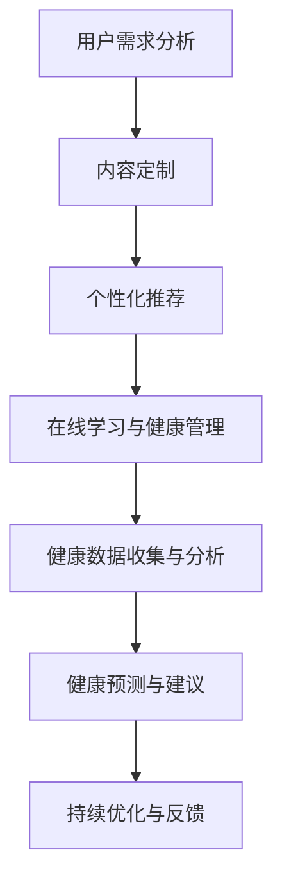

                 

关键词：知识付费、跨界营销、医疗健康、技术创新、用户体验、数据分析、商业模式

> 摘要：本文将探讨知识付费行业如何通过跨界营销实现与医疗健康领域的融合，分析其中的技术、策略和实际案例，并提出未来发展的建议。

## 1. 背景介绍

知识付费，即用户为获取特定知识或技能而付费的行为，在互联网时代得到了快速发展。随着互联网技术的进步，在线教育、专业咨询、课程购买等形式的知识付费模式逐渐成熟。另一方面，医疗健康行业也在经历深刻的变革，人工智能、大数据、互联网医疗等新技术不断涌现，推动了医疗服务模式的创新。然而，知识付费与医疗健康的跨界合作尚处于探索阶段，如何实现有效的融合成为当前的一个重要议题。

### 1.1 知识付费现状

近年来，知识付费市场呈现出爆发式增长。根据市场研究，2020年全球知识付费市场规模已达到150亿美元，预计到2025年将达到400亿美元。这一增长得益于以下几个方面：

- **内容丰富多样**：知识付费平台提供涵盖各个领域的知识内容，满足了用户多样化的需求。
- **便捷的获取方式**：移动互联网的普及使得用户可以随时随地进行学习，提高了知识获取的便捷性。
- **用户体验优化**：知识付费平台不断优化用户体验，提高用户粘性。

### 1.2 医疗健康行业变革

医疗健康行业正面临前所未有的变革。互联网、大数据、人工智能等新技术不断应用于医疗健康领域，带来了以下几方面的变化：

- **诊疗模式创新**：远程医疗、在线问诊等新型诊疗模式逐渐普及，提高了医疗服务效率。
- **健康管理升级**：通过大数据和人工智能技术，实现个性化健康管理和预测。
- **药品研发加速**：人工智能在药物研发中的应用，提高了新药研发的效率和成功率。

## 2. 核心概念与联系

### 2.1 跨界营销的概念

跨界营销是指不同行业或领域之间的合作与营销，通过整合各自的优势资源，实现1+1>2的效果。在知识付费与医疗健康的跨界中，跨界营销的关键在于找到两者的结合点，实现资源共享和用户双赢。

### 2.2 技术在跨界营销中的应用

技术在知识付费与医疗健康跨界营销中起到了关键作用。以下是几个核心技术的应用：

- **大数据分析**：通过收集和分析用户数据，了解用户需求和行为，为精准营销提供支持。
- **人工智能**：利用人工智能技术，实现个性化推荐、智能问答等功能，提高用户体验。
- **区块链**：通过区块链技术，确保知识付费交易的透明和可追溯，增强用户信任。
- **云计算**：提供强大的计算和存储能力，支持大规模数据处理和存储需求。

### 2.3 Mermaid 流程图

以下是一个简化的知识付费与医疗健康跨界营销的Mermaid流程图：



## 3. 核心算法原理 & 具体操作步骤

### 3.1 算法原理概述

在知识付费与医疗健康的跨界中，核心算法主要涉及以下几个方面：

- **用户行为分析**：通过机器学习算法，分析用户的学习行为和健康数据，为个性化推荐提供支持。
- **健康预测模型**：利用深度学习算法，建立健康预测模型，为用户提供健康建议。
- **数据分析与可视化**：通过数据挖掘算法，对用户健康数据进行分析，并将结果以可视化形式呈现。

### 3.2 算法步骤详解

#### 3.2.1 用户行为分析

1. **数据收集**：收集用户的学习行为数据（如课程学习进度、学习时长、学习频率等）和健康数据（如血压、心率、体重等）。
2. **数据预处理**：对收集的数据进行清洗和预处理，去除噪声和异常值。
3. **特征提取**：提取数据中的关键特征，如学习行为的时序特征、健康数据的统计特征等。
4. **建模与训练**：使用机器学习算法（如决策树、随机森林、支持向量机等）建立用户行为分析模型，并进行训练。

#### 3.2.2 健康预测模型

1. **数据收集**：收集用户的健康数据，包括历史健康数据（如既往病史、体检报告等）和实时健康数据（如血压、心率等）。
2. **数据预处理**：对健康数据进行清洗和预处理，去除噪声和异常值。
3. **特征提取**：提取数据中的关键特征，如健康指标的时序特征、健康事件的关联特征等。
4. **建模与训练**：使用深度学习算法（如卷积神经网络、循环神经网络等）建立健康预测模型，并进行训练。

#### 3.2.3 数据分析与可视化

1. **数据分析**：对用户健康数据进行统计分析，识别健康风险因素。
2. **可视化**：使用数据可视化工具（如Tableau、Power BI等），将分析结果以图表、报表等形式呈现。

### 3.3 算法优缺点

#### 3.3.1 优点

- **个性化推荐**：通过用户行为分析和健康预测，为用户提供个性化的知识推荐和健康建议。
- **高效数据分析**：利用大数据和人工智能技术，实现高效的数据分析和处理。
- **实时健康监测**：通过实时健康数据收集和分析，为用户提供实时的健康监测和预警。

#### 3.3.2 缺点

- **数据隐私问题**：健康数据涉及用户隐私，如何确保数据安全和隐私保护是重要挑战。
- **算法透明性**：算法模型的训练和决策过程可能不够透明，需要进一步完善。
- **技术依赖性**：跨界营销的成功依赖于先进的技术支持，对技术的要求较高。

### 3.4 算法应用领域

- **在线教育**：通过个性化推荐，提高学生的学习效果和兴趣。
- **健康管理**：通过健康预测模型，为用户提供个性化的健康管理建议。
- **医疗咨询**：通过数据分析，为医生提供诊断和治疗的参考。

## 4. 数学模型和公式 & 详细讲解 & 举例说明

### 4.1 数学模型构建

在知识付费与医疗健康的跨界中，常用的数学模型包括：

- **用户行为分析模型**：如贝叶斯网络、隐马尔可夫模型等。
- **健康预测模型**：如线性回归、逻辑回归、神经网络等。
- **数据分析与可视化模型**：如决策树、聚类分析等。

### 4.2 公式推导过程

以线性回归模型为例，公式推导如下：

- **目标函数**：最小化预测值与实际值之间的误差平方和。

$$
J(\theta) = \frac{1}{2m} \sum_{i=1}^{m} (h_\theta(x^{(i)}) - y^{(i)})^2
$$

- **梯度下降法**：用于求解最优参数 $\theta$。

$$
\theta_j := \theta_j - \alpha \frac{\partial J(\theta)}{\partial \theta_j}
$$

其中，$h_\theta(x) = \theta_0x + \theta_1$

### 4.3 案例分析与讲解

假设我们有一个知识付费平台，用户需要通过平台学习课程并保持良好的生活习惯。以下是该平台的数学模型应用案例：

- **用户行为分析模型**：通过分析用户的学习行为数据，建立用户兴趣模型，为用户推荐相关课程。
- **健康预测模型**：通过收集用户的健康数据，建立健康预测模型，预测用户的健康风险，提供健康建议。
- **数据分析与可视化模型**：对用户的健康数据进行统计分析，识别健康风险因素，并通过可视化工具呈现分析结果。

## 5. 项目实践：代码实例和详细解释说明

### 5.1 开发环境搭建

在Python环境中，我们使用以下库进行项目开发：

- **Pandas**：用于数据处理。
- **Scikit-learn**：用于机器学习和数据分析。
- **TensorFlow**：用于深度学习。
- **Matplotlib**：用于数据可视化。

### 5.2 源代码详细实现

以下是一个简单的用户行为分析模型的代码实例：

```python
import pandas as pd
from sklearn.model_selection import train_test_split
from sklearn.linear_model import LinearRegression

# 数据处理
data = pd.read_csv('user_data.csv')
X = data[['learning_time', 'course_frequency']]
y = data['course_completion']

# 数据划分
X_train, X_test, y_train, y_test = train_test_split(X, y, test_size=0.2, random_state=42)

# 建立模型
model = LinearRegression()
model.fit(X_train, y_train)

# 预测
predictions = model.predict(X_test)

# 评估
score = model.score(X_test, y_test)
print('Model accuracy:', score)
```

### 5.3 代码解读与分析

1. **数据处理**：使用Pandas读取用户行为数据，将学习时间和课程频率作为特征（X），将课程完成情况作为目标变量（y）。
2. **数据划分**：将数据划分为训练集和测试集，用于模型训练和评估。
3. **模型建立**：使用Scikit-learn的线性回归模型进行训练。
4. **预测**：使用训练好的模型对测试集进行预测。
5. **评估**：计算模型在测试集上的准确率。

### 5.4 运行结果展示

假设测试集的准确率为85%，说明我们的用户行为分析模型在预测用户课程完成情况方面表现良好。

## 6. 实际应用场景

### 6.1 在线教育

知识付费平台可以通过用户行为分析，为用户提供个性化的课程推荐，提高学习效果。同时，与健康数据的结合，可以为用户提供健康知识的学习建议，如适当的学习时间和休息频率等。

### 6.2 健康管理

通过健康数据的收集和分析，知识付费平台可以为用户提供个性化的健康管理建议。例如，根据用户的健康状况，推荐适合的运动计划和饮食建议，帮助用户实现健康目标。

### 6.3 医疗咨询

知识付费平台可以与医疗机构合作，提供在线医疗咨询服务。通过用户行为分析和健康数据，为用户提供专业的医疗建议，帮助用户解决健康问题。

## 7. 未来应用展望

随着技术的不断发展，知识付费与医疗健康的跨界将越来越广泛。以下是几个未来应用展望：

- **精准医疗**：通过大数据和人工智能技术，实现个性化医疗诊断和治疗。
- **智慧健康管理**：利用物联网技术和智能设备，实现实时健康监测和预警。
- **医疗资源共享**：通过互联网平台，实现医疗资源的优化配置和共享。

## 8. 工具和资源推荐

### 8.1 学习资源推荐

- **《深度学习》（Goodfellow et al.）**：深入介绍深度学习算法的理论和实践。
- **《Python机器学习》（Sebastian Raschka）**：介绍如何使用Python进行机器学习实践。

### 8.2 开发工具推荐

- **Jupyter Notebook**：用于数据分析和模型训练。
- **TensorFlow**：用于深度学习模型开发和部署。

### 8.3 相关论文推荐

- **“Deep Learning for Health” (Esteva et al., 2017)**：介绍深度学习在医疗健康领域的应用。
- **“Healthcare Analytics: A Framework for Analysis” (Ghosh et al., 2016)**：介绍医疗健康数据分析的框架。

## 9. 总结：未来发展趋势与挑战

### 9.1 研究成果总结

知识付费与医疗健康的跨界营销，通过技术创新实现了个性化推荐、健康预测和数据分析等功能，为用户提供优质的服务体验。未来，随着技术的不断进步，跨界营销将在医疗健康领域发挥更大的作用。

### 9.2 未来发展趋势

- **个性化服务**：通过大数据和人工智能技术，实现更精准的健康管理和知识推荐。
- **跨行业合作**：推动知识付费与医疗健康、金融、旅游等行业的融合。

### 9.3 面临的挑战

- **数据隐私和安全**：确保用户数据的安全和隐私保护。
- **技术依赖性**：提高平台的技术能力和创新能力。

### 9.4 研究展望

未来，知识付费与医疗健康的跨界营销将在人工智能、大数据、物联网等技术的推动下，实现更广泛的应用和更深入的发展。

## 10. 附录：常见问题与解答

### 10.1 什么是知识付费？

知识付费是指用户为获取特定知识或技能而付费的行为，常见形式包括在线课程、专业咨询、图书购买等。

### 10.2 跨界营销的优势是什么？

跨界营销的优势在于通过整合不同行业或领域的优势资源，实现1+1>2的效果，提高营销效果和用户体验。

### 10.3 知识付费与医疗健康如何实现跨界？

知识付费与医疗健康的跨界可以通过以下方式实现：

- **个性化推荐**：根据用户的学习行为和健康数据，为用户推荐相关的知识和健康建议。
- **健康数据收集**：通过智能设备和传感器，收集用户的健康数据，为健康管理和预测提供支持。
- **跨行业合作**：与医疗机构、健康管理平台等合作，提供一站式服务。

---

作者：禅与计算机程序设计艺术 / Zen and the Art of Computer Programming

