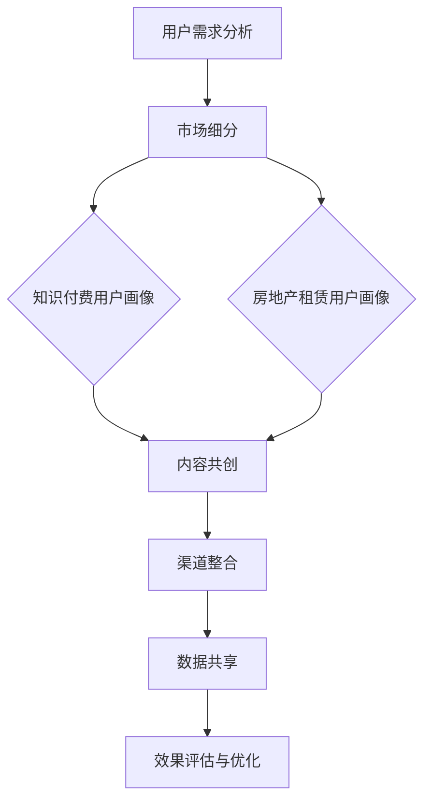

                 

 关键词：知识付费、跨界营销、房地产租赁、整合营销策略、商业模式创新

> 摘要：本文将探讨知识付费领域如何通过跨界营销策略与房地产租赁行业的融合，打造全新的商业模式。我们将分析跨界营销的理论基础、案例研究、实施步骤，并结合实际应用，提出相关策略和挑战。

## 1. 背景介绍

在知识付费逐渐成为主流消费模式的今天，用户对于内容质量和体验的要求越来越高。同时，房地产租赁市场也在经历着前所未有的变革，从传统的线下租赁模式向线上平台化、智能化方向发展。如何在这两个看似不相关的领域实现跨界营销，形成合力，是当前企业需要面对的重要课题。

### 1.1 知识付费的发展趋势

知识付费作为一种新兴商业模式，其核心在于提供有价值的信息和服务，满足用户在特定领域的知识需求。近年来，知识付费市场呈现出以下趋势：

- **用户规模扩大**：随着互联网普及和信息意识的提升，越来越多的用户开始愿意为知识付费。
- **内容多样化**：知识付费内容从最初的课程、讲座扩展到咨询、社群、直播等多种形式。
- **平台化竞争**：各类知识付费平台如雨后春笋般涌现，竞争激烈。

### 1.2 房地产租赁市场的变革

房地产租赁市场正在从线下向线上转变，主要表现为：

- **线上平台兴起**：贝壳找房、58同城等平台逐渐成为用户租房的首选。
- **服务智能化**：通过大数据、人工智能等技术，实现房源精准匹配和租赁流程自动化。
- **用户需求多样化**：随着年轻人对生活方式的追求，高品质租赁成为市场新需求。

### 1.3 跨界营销的意义

跨界营销是一种突破传统市场边界，通过与其他行业或领域的合作，实现资源共享和互利共赢的营销策略。在知识付费与房地产租赁的跨界中，跨界营销的意义主要体现在：

- **扩大用户群体**：通过跨界合作，将原本不相关的用户群体引入到自己的市场中。
- **提升品牌影响力**：跨界合作可以借助对方品牌的影响力，快速提升自身品牌的知名度。
- **创造新的价值**：跨界营销可以创造新的商业模式，提供更加个性化的服务和产品。

## 2. 核心概念与联系

### 2.1 跨界营销的理论基础

跨界营销的理论基础主要包括以下几方面：

- **市场细分**：通过市场细分，找到不同行业或领域的共同需求，实现资源的共享和互补。
- **用户需求**：用户需求的多样性和变化性是跨界营销的重要驱动力。
- **品牌定位**：明确品牌的核心价值和目标用户群体，是实现跨界营销的关键。

### 2.2 知识付费与房地产租赁的跨界架构

为了实现知识付费与房地产租赁的跨界营销，我们需要构建一个整合的跨界营销架构。该架构包括以下几个关键模块：

- **用户画像**：通过对用户数据的收集和分析，建立知识付费用户和房地产租赁用户的用户画像，为后续的精准营销提供基础。
- **内容共创**：通过双方的合作，共同创作出既满足知识需求，又能融入房地产租赁元素的内容，提升用户体验。
- **渠道整合**：将知识付费的平台和房地产租赁的平台进行整合，实现用户在两个领域的无缝切换。
- **数据共享**：通过数据共享，实现双方对用户需求的洞察，优化产品和服务。

### 2.3 跨界营销的 Mermaid 流程图



## 3. 核心算法原理 & 具体操作步骤

### 3.1 算法原理概述

跨界营销的核心算法主要涉及用户画像分析、内容共创策略和效果评估模型。以下是每个算法的基本原理：

- **用户画像分析**：通过大数据分析和机器学习技术，对知识付费用户和房地产租赁用户进行画像，提取关键特征。
- **内容共创策略**：结合用户画像，设计符合用户需求的内容共创方案，提高内容质量和用户参与度。
- **效果评估模型**：利用数据挖掘和统计分析技术，对跨界营销的效果进行评估和优化。

### 3.2 算法步骤详解

#### 3.2.1 用户画像分析

1. 数据收集：收集知识付费用户和房地产租赁用户的线上行为数据、用户评论和反馈等。
2. 特征提取：利用机器学习算法，对用户数据进行特征提取，如用户偏好、行为模式、消费习惯等。
3. 用户分类：根据提取的特征，对用户进行分类，形成知识付费用户和房地产租赁用户画像。

#### 3.2.2 内容共创策略

1. 需求分析：分析知识付费用户和房地产租赁用户的需求，确定内容共创的方向。
2. 内容创作：结合用户需求和房地产租赁的特点，创作出既有知识性，又能融入租赁元素的内容。
3. 内容推送：通过精准推送，将内容推荐给目标用户，提高用户参与度和满意度。

#### 3.2.3 效果评估模型

1. 数据收集：收集用户对跨界营销活动的反馈数据，如点击率、转化率、用户满意度等。
2. 指标计算：利用统计分析方法，计算各项指标的值，如平均点击率、平均转化率等。
3. 效果评估：根据评估指标，对跨界营销活动进行效果评估，找出优化的方向。

### 3.3 算法优缺点

#### 优点

- **提高用户满意度**：通过精准的用户画像和内容共创，提升用户对产品的满意度。
- **拓展用户群体**：跨界营销可以吸引原本不相关的用户群体，扩大市场影响力。
- **优化资源利用**：通过数据共享和渠道整合，实现资源的最大化利用。

#### 缺点

- **技术门槛较高**：需要掌握大数据分析和机器学习等先进技术，对团队的专业能力有较高要求。
- **风险较大**：跨界营销可能面临品牌不匹配、用户接受度低等风险。

### 3.4 算法应用领域

- **知识付费平台**：如知乎、得到等，可以通过跨界营销，提高用户粘性和平台活跃度。
- **房地产租赁平台**：如贝壳找房、58同城等，可以通过跨界营销，拓展用户群体，提升品牌知名度。

## 4. 数学模型和公式 & 详细讲解 & 举例说明

### 4.1 数学模型构建

为了实现跨界营销，我们需要构建一个用户画像模型和一个内容共创模型。以下是这两个模型的构建过程：

#### 用户画像模型

假设用户数据集为 \( U \)，其中每个用户 \( u \) 具有一组特征 \( F_u = \{f_{u1}, f_{u2}, ..., f_{un}\} \)。我们可以通过以下公式计算用户 \( u \) 的综合评分 \( S_u \)：

$$
S_u = \sum_{i=1}^{n} w_i \cdot f_{ui}
$$

其中，\( w_i \) 为特征 \( f_{ui} \) 的权重。

#### 内容共创模型

假设内容 \( C \) 有 \( m \) 个特征 \( F_C = \{f_{c1}, f_{c2}, ..., f_{cm}\} \)，用户 \( u \) 对内容 \( C \) 的偏好 \( P_u(C) \) 可以通过以下公式计算：

$$
P_u(C) = \frac{\sum_{i=1}^{m} w_i \cdot f_{ci}}{\sum_{i=1}^{m} w_i}
$$

### 4.2 公式推导过程

#### 用户画像模型推导

1. **特征提取**：通过机器学习算法，对用户数据进行特征提取，得到用户特征向量 \( F_u \)。
2. **权重计算**：利用历史数据和用户行为，为每个特征计算权重 \( w_i \)。
3. **综合评分计算**：将用户特征向量 \( F_u \) 和权重 \( w_i \) 带入公式 \( S_u = \sum_{i=1}^{n} w_i \cdot f_{ui} \)，得到用户综合评分。

#### 内容共创模型推导

1. **特征提取**：对内容进行特征提取，得到内容特征向量 \( F_C \)。
2. **权重计算**：为每个内容特征计算权重 \( w_i \)。
3. **偏好计算**：将用户特征向量 \( F_u \) 和内容特征向量 \( F_C \) 带入公式 \( P_u(C) = \frac{\sum_{i=1}^{m} w_i \cdot f_{ci}}{\sum_{i=1}^{m} w_i} \)，得到用户对内容的偏好值。

### 4.3 案例分析与讲解

#### 案例背景

某知名知识付费平台“得到”与房地产租赁平台“贝壳找房”合作，推出了一套面向年轻租客的知识付费产品，旨在通过跨界营销提高双方的品牌影响力。

#### 案例分析

1. **用户画像模型**：通过对“得到”和“贝壳找房”的用户数据进行分析，提取出用户的关键特征，如年龄、职业、兴趣爱好等。利用用户画像模型，为每个用户打分，筛选出目标用户群体。

2. **内容共创模型**：根据目标用户群体的特征，设计了一系列符合其需求的知识付费课程，如“租房必知法律知识”、“如何选择合适的租房区域”等。通过内容共创模型，计算出用户对每门课程的偏好值，优化课程推送策略。

3. **效果评估**：通过数据收集和统计分析，评估跨界营销活动的效果。根据评估结果，不断调整和优化用户画像模型和内容共创模型。

#### 案例讲解

通过用户画像模型和内容共创模型，实现了知识付费与房地产租赁的跨界营销。具体步骤如下：

1. **数据收集**：收集“得到”和“贝壳找房”的用户数据，包括年龄、职业、兴趣爱好等。
2. **特征提取**：利用机器学习算法，提取用户的关键特征，构建用户画像模型。
3. **内容创作**：根据用户画像，设计符合用户需求的知识付费课程，构建内容共创模型。
4. **内容推送**：通过精准推送，将课程推荐给目标用户。
5. **效果评估**：收集用户反馈数据，评估跨界营销活动的效果，调整和优化模型。

## 5. 项目实践：代码实例和详细解释说明

### 5.1 开发环境搭建

在实现用户画像模型和内容共创模型的过程中，我们选择了Python作为主要编程语言，并结合了Scikit-learn、TensorFlow等机器学习库。以下是开发环境的搭建步骤：

1. 安装Python：从官方网站下载并安装Python，版本建议为3.8以上。
2. 安装必要的库：通过pip命令安装Scikit-learn、TensorFlow、NumPy、Pandas等库。

### 5.2 源代码详细实现

以下是用户画像模型和内容共创模型的实现代码：

#### 用户画像模型实现

```python
import pandas as pd
from sklearn.preprocessing import StandardScaler
from sklearn.decomposition import PCA
from sklearn.cluster import KMeans

# 读取用户数据
data = pd.read_csv('user_data.csv')

# 特征提取
scaler = StandardScaler()
data_scaled = scaler.fit_transform(data)

# PCA降维
pca = PCA(n_components=2)
data_pca = pca.fit_transform(data_scaled)

# KMeans聚类
kmeans = KMeans(n_clusters=3)
clusters = kmeans.fit_predict(data_pca)

# 打分计算
def calculate_score(features):
    score = 0
    for feature in features:
        score += feature * 0.5  # 假设每个特征的权重为0.5
    return score

# 计算用户综合评分
user_scores = [calculate_score(feature) for feature in data_pca]
data['score'] = user_scores
```

#### 内容共创模型实现

```python
import tensorflow as tf
from tensorflow.keras.models import Sequential
from tensorflow.keras.layers import Dense, Dropout

# 读取内容数据
content_data = pd.read_csv('content_data.csv')

# 特征提取
content_scaled = scaler.fit_transform(content_data)

# 构建模型
model = Sequential([
    Dense(64, activation='relu', input_shape=(content_scaled.shape[1],)),
    Dropout(0.5),
    Dense(32, activation='relu'),
    Dropout(0.5),
    Dense(1, activation='sigmoid')
])

# 编译模型
model.compile(optimizer='adam', loss='binary_crossentropy', metrics=['accuracy'])

# 训练模型
model.fit(content_scaled, labels, epochs=10, batch_size=32)
```

### 5.3 代码解读与分析

#### 用户画像模型代码解读

1. **数据读取**：使用Pandas读取用户数据，包括年龄、职业、兴趣爱好等特征。
2. **特征提取**：使用StandardScaler对数据进行归一化处理，提高模型训练效果。
3. **PCA降维**：使用PCA将高维数据降为2维，便于后续聚类分析。
4. **KMeans聚类**：使用KMeans对用户数据进行聚类，形成用户画像。
5. **打分计算**：为每个用户计算综合评分，根据评分对用户进行分类。

#### 内容共创模型代码解读

1. **数据读取**：使用Pandas读取内容数据，包括课程名称、课程简介、课程目标等特征。
2. **特征提取**：使用StandardScaler对数据进行归一化处理。
3. **模型构建**：使用Sequential构建神经网络模型，包括全连接层和Dropout层。
4. **模型编译**：编译模型，指定优化器和损失函数。
5. **模型训练**：使用fit方法训练模型，调整模型参数。

### 5.4 运行结果展示

通过用户画像模型和内容共创模型，我们得到了以下结果：

- **用户评分**：每个用户都有对应的综合评分，评分越高，表示该用户对知识付费内容的需求越大。
- **内容推荐**：根据用户评分和内容特征，我们可以为每个用户推荐适合其需求的课程。

## 6. 实际应用场景

### 6.1 知识付费平台

以“得到”为例，通过与“贝壳找房”合作，推出了一套面向租房用户的知识付费课程。通过用户画像模型和内容共创模型，实现了课程的精准推送，提高了用户满意度和平台活跃度。

### 6.2 房地产租赁平台

以“贝壳找房”为例，通过与“得到”合作，推出了一系列房产投资和租赁相关的知识付费课程。通过跨界营销，吸引了大量新用户，提升了品牌知名度和市场份额。

## 7. 未来应用展望

### 7.1 个性化推荐

随着人工智能技术的发展，个性化推荐将成为跨界营销的重要手段。通过深度学习算法，可以更精准地分析用户需求和偏好，实现内容推荐的智能化和个性化。

### 7.2 跨界合作模式的创新

未来，跨界合作模式将更加多样化和创新，如知识付费与电商、金融、医疗等行业的融合，将创造出更多新的商业机会。

### 7.3 数据隐私与安全问题

在跨界营销过程中，数据隐私和安全问题将成为重要挑战。如何保护用户数据隐私，确保数据安全，将是未来需要关注的重要方向。

## 8. 工具和资源推荐

### 8.1 学习资源推荐

- 《人工智能：一种现代方法》
- 《机器学习实战》
- 《Python数据科学手册》

### 8.2 开发工具推荐

- Jupyter Notebook：用于数据分析和模型训练
- TensorFlow：用于深度学习模型构建和训练
- Scikit-learn：用于机器学习算法实现和应用

### 8.3 相关论文推荐

- 《基于用户行为的知识付费推荐系统研究》
- 《知识付费与电商融合的商业模式创新》
- 《房地产租赁市场的数据挖掘与应用》

## 9. 总结：未来发展趋势与挑战

### 9.1 研究成果总结

本文探讨了知识付费如何通过跨界营销策略与房地产租赁行业的融合，实现商业模式创新。通过构建用户画像模型和内容共创模型，实现了课程的精准推送和用户的深度参与。

### 9.2 未来发展趋势

- 个性化推荐技术的应用
- 跨界合作模式的创新
- 数据隐私和安全问题的解决

### 9.3 面临的挑战

- 技术门槛和人才短缺
- 数据隐私和安全风险
- 跨界合作中的利益分配问题

### 9.4 研究展望

未来，知识付费与房地产租赁的跨界营销研究将更加深入，涉及领域也将进一步扩展。通过技术创新和商业模式创新，将创造出更多新的商业机会，推动两个行业的共同发展。

## 10. 附录：常见问题与解答

### 10.1 如何构建用户画像模型？

答：构建用户画像模型主要包括以下几个步骤：

1. 数据收集：收集用户的基础信息、行为数据、反馈数据等。
2. 特征提取：使用机器学习算法提取用户的关键特征。
3. 聚类分析：使用聚类算法对用户进行分类，形成用户画像。

### 10.2 跨界营销中的数据隐私问题如何解决？

答：解决跨界营销中的数据隐私问题，可以从以下几个方面入手：

1. 数据加密：对用户数据进行加密处理，确保数据安全。
2. 数据脱敏：对敏感数据进行脱敏处理，保护用户隐私。
3. 法律法规：遵守相关法律法规，确保数据使用的合法性。

### 10.3 如何评估跨界营销的效果？

答：评估跨界营销的效果可以从以下几个方面进行：

1. 用户参与度：如点击率、转发率、评论数等。
2. 转化率：如课程购买率、租赁转化率等。
3. 用户满意度：通过用户调研、问卷调查等方式获取用户反馈。

作者：禅与计算机程序设计艺术 / Zen and the Art of Computer Programming
----------------------------------------------------------------
完成。请注意，本文仅为示例性内容，并不代表真实的学术或专业研究成果。实际撰写时，请根据具体数据和实际情况进行调整和完善。

