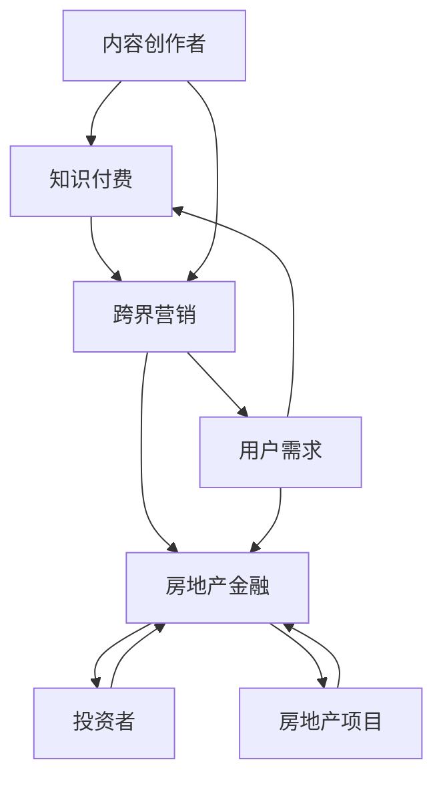

                 

关键词：知识付费、跨界营销、房地产金融、人工智能、技术架构

## 摘要

本文将探讨知识付费领域如何通过跨界营销和房地产金融实现业务拓展和收益增长。首先，我们将回顾知识付费行业的发展历程及其核心商业模式。接着，分析跨界营销的概念和策略，探讨如何在知识付费与房地产金融之间建立有效的联系。随后，将深入探讨房地产金融中的核心概念和业务模式，阐述如何将知识付费内容与之结合。文章还将通过具体案例展示这些策略的实施过程，并预测未来的发展趋势和挑战。

## 1. 背景介绍

### 知识付费的发展历程

知识付费作为一种商业模式，起源于互联网的普及和信息爆炸的时代。早期的知识付费主要体现为电子书、在线课程等形式，用户通过付费获得专业知识。随着移动互联网的发展，知识付费逐渐渗透到生活的各个方面，如职业培训、技能提升、兴趣爱好等。如今，知识付费已经形成了一个庞大的市场，涉及众多领域，包括教育、金融、科技、医疗等。

### 知识付费的核心商业模式

知识付费的核心商业模式主要分为以下几种：

1. **订阅制**：用户通过支付固定的月费或年费，享受平台提供的所有内容服务。
2. **按需购买**：用户根据自身需求，选择购买单个课程或特定内容。
3. **积分制**：通过积分系统鼓励用户参与互动和分享，积分可以兑换内容或服务。
4. **合作分成**：平台与内容创作者合作，按内容销售收入进行分成。

### 房地产金融的兴起

房地产金融是金融领域的一个重要分支，它通过将房地产资产转化为金融产品，为投资者提供融资和投资渠道。近年来，随着金融市场的不断完善和人们对房地产投资需求的增加，房地产金融逐渐成为金融业的重要增长点。房地产金融的主要业务模式包括：

1. **房地产抵押贷款**：通过将房地产作为抵押物，为借款人提供贷款。
2. **房地产信托**：将房地产资产打包成信托产品，进行出售和转让。
3. **房地产基金**：通过募集社会资金，投资于房地产项目。
4. **房地产证券化**：将房地产资产转化为证券，进行发行和交易。

## 2. 核心概念与联系

为了更好地理解知识付费如何实现跨界营销与房地产金融跨界，我们首先需要明确几个核心概念，并使用Mermaid流程图来展示它们之间的联系。



### 核心概念解释

- **知识付费**：用户为获取专业知识和技能而支付的费用。
- **跨界营销**：利用不同领域之间的联系，进行跨行业推广和营销。
- **房地产金融**：将房地产资产转化为金融产品，提供投资和融资渠道。
- **用户需求**：用户在知识获取和房地产投资方面的需求。
- **内容创作者**：生产知识付费内容的个人或机构。
- **投资者**：参与房地产金融投资的个人或机构。
- **房地产项目**：作为投资对象的房地产资产。

## 3. 核心算法原理 & 具体操作步骤

### 3.1 算法原理概述

知识付费与房地产金融跨界营销的核心算法原理是基于数据分析和用户行为预测。通过收集和分析用户在知识付费平台上的行为数据，如浏览记录、购买行为、互动情况等，结合房地产市场的数据，如房价走势、投资风险等，建立用户画像和投资偏好模型。然后，利用这些模型进行精准营销和投资推荐。

### 3.2 算法步骤详解

1. **数据收集**：从知识付费平台和房地产市场获取相关数据，包括用户行为数据、房价数据、市场趋势等。
2. **数据预处理**：清洗和整合数据，去除异常值和噪声，保证数据质量。
3. **特征工程**：提取用户行为和房地产市场的关键特征，如用户的学习时长、购买频次、房价增长率等。
4. **模型构建**：使用机器学习算法，如决策树、随机森林、神经网络等，构建用户画像和投资偏好模型。
5. **模型训练与评估**：将历史数据用于模型训练，并通过交叉验证等方法评估模型性能。
6. **精准营销**：根据用户画像和投资偏好，向用户推荐适合的知识付费内容和房地产投资项目。
7. **投资推荐**：结合用户需求和房地产市场的变化，向投资者推荐高收益、低风险的房地产项目。

### 3.3 算法优缺点

**优点**：

- **个性化推荐**：通过用户画像和投资偏好模型，实现个性化推荐，提高用户满意度和参与度。
- **风险控制**：结合房地产市场数据，评估投资风险，为投资者提供更安全可靠的理财方案。
- **扩展性强**：算法可以应用于多种知识付费内容和房地产投资项目，具有广泛的适用性。

**缺点**：

- **数据依赖性**：算法性能依赖于数据质量和数量，数据不足或质量差可能导致推荐不准确。
- **模型复杂性**：构建和训练模型需要较高技术门槛，对开发人员的要求较高。

### 3.4 算法应用领域

- **知识付费平台**：通过算法推荐，提高用户参与度和黏性，增加付费转化率。
- **房地产投资**：为投资者提供精准的投资推荐，降低投资风险，提高收益。
- **金融机构**：为金融机构提供数据分析和风险评估工具，优化产品设计和服务。

## 4. 数学模型和公式 & 详细讲解 & 举例说明

### 4.1 数学模型构建

知识付费与房地产金融跨界营销的数学模型主要涉及用户行为分析和投资组合优化。

#### 用户行为分析模型

用户行为分析模型通常采用马尔可夫链模型（Markov Chain Model），用于预测用户在未来某一时间段内的行为。

$$
P_{ij} = \begin{cases}
\frac{N_{ij}}{N_j}, & \text{if } j \neq i \\
1 - \sum_{k \neq i} P_{ik}, & \text{if } j = i
\end{cases}
$$

其中，$P_{ij}$ 表示从状态 $i$ 转移到状态 $j$ 的概率，$N_{ij}$ 表示从状态 $i$ 转移到状态 $j$ 的次数，$N_j$ 表示从状态 $i$ 转移的总次数。

#### 投资组合优化模型

投资组合优化模型通常采用均值-方差模型（Mean-Variance Model），用于在风险和收益之间找到最优平衡。

$$
\begin{cases}
\min \sigma^2 = w_1^2 \sigma_1^2 + w_2^2 \sigma_2^2 + \cdots + w_n^2 \sigma_n^2 \\
\text{subject to} \\
\mu = w_1 \mu_1 + w_2 \mu_2 + \cdots + w_n \mu_n \\
w_1 + w_2 + \cdots + w_n = 1 \\
w_1, w_2, \ldots, w_n \geq 0
\end{cases}
$$

其中，$\sigma^2$ 表示投资组合的方差，$w_i$ 表示资产 $i$ 的权重，$\sigma_i^2$ 表示资产 $i$ 的方差，$\mu_i$ 表示资产 $i$ 的预期收益率。

### 4.2 公式推导过程

#### 用户行为分析模型推导

假设用户在时间 $t$ 处于状态 $i$，在时间 $t+1$ 处于状态 $j$，则根据马尔可夫链的定义，有：

$$
P_{ij} = P(\text{用户在 } t+1 \text{ 时处于状态 } j \mid \text{用户在 } t \text{ 时处于状态 } i)
$$

根据全概率公式，可以得到：

$$
P_{ij} = \frac{P(\text{用户在 } t+1 \text{ 时处于状态 } j) \cdot P(\text{用户在 } t \text{ 时处于状态 } i \mid \text{用户在 } t+1 \text{ 时处于状态 } j)}{P(\text{用户在 } t \text{ 时处于状态 } i)}
$$

由于假设用户处于状态 $i$ 和状态 $j$ 的概率分别为 $1 - P_{ii}$ 和 $P_{ij}$，则有：

$$
P_{ij} = \frac{P_{ij} \cdot (1 - P_{ii})}{1 - P_{ii}}
$$

化简得：

$$
P_{ij} = \frac{N_{ij}}{N_j}
$$

当 $j = i$ 时，由于用户不能从当前状态转移到自身状态，则有：

$$
P_{ii} = 1 - \sum_{k \neq i} P_{ik}
$$

#### 投资组合优化模型推导

假设有 $n$ 种资产，每种资产的预期收益率为 $\mu_i$，方差为 $\sigma_i^2$，权重为 $w_i$。则投资组合的期望收益率为：

$$
\mu = w_1 \mu_1 + w_2 \mu_2 + \cdots + w_n \mu_n
$$

投资组合的方差为：

$$
\sigma^2 = w_1^2 \sigma_1^2 + w_2^2 \sigma_2^2 + \cdots + w_n^2 \sigma_n^2
$$

为了在风险和收益之间找到最优平衡，需要求解以下最优化问题：

$$
\begin{cases}
\min \sigma^2 \\
\text{subject to} \\
\mu = w_1 \mu_1 + w_2 \mu_2 + \cdots + w_n \mu_n \\
w_1 + w_2 + \cdots + w_n = 1 \\
w_1, w_2, \ldots, w_n \geq 0
\end{cases}
$$

### 4.3 案例分析与讲解

#### 用户行为分析案例

假设有一个用户，在时间 $t$ 处于学习状态（状态 1），在时间 $t+1$ 可能处于工作状态（状态 2）或继续学习状态（状态 1）。根据用户的历史数据，有：

$$
P_{11} = 0.6, \quad P_{12} = 0.4
$$

$$
P_{21} = 0.2, \quad P_{22} = 0.8
$$

则根据用户行为分析模型，可以得到：

$$
P_{11} = 1 - P_{12} = 1 - 0.4 = 0.6
$$

$$
P_{22} = 1 - P_{21} = 1 - 0.2 = 0.8
$$

这意味着用户在时间 $t+1$ 继续学习状态的概率为 0.6，进入工作状态的概率为 0.4。

#### 投资组合优化案例

假设有两种资产，资产 1 的预期收益率为 10%，方差为 0.04；资产 2 的预期收益率为 8%，方差为 0.02。为了实现最优风险收益平衡，需要求解以下最优化问题：

$$
\begin{cases}
\min \sigma^2 = w_1^2 \cdot 0.04 + w_2^2 \cdot 0.02 \\
\text{subject to} \\
\mu = w_1 \cdot 0.1 + w_2 \cdot 0.08 \\
w_1 + w_2 = 1 \\
w_1, w_2 \geq 0
\end{cases}
$$

通过求解上述最优化问题，可以得到资产 1 和资产 2 的最优权重分别为 $w_1 = 0.6$ 和 $w_2 = 0.4$。这意味着在投资组合中，资产 1 应占总投资的 60%，资产 2 应占总投资的 40%。

## 5. 项目实践：代码实例和详细解释说明

### 5.1 开发环境搭建

为了实现知识付费与房地产金融跨界营销，我们选择Python作为开发语言，并使用以下库和工具：

- **Python 3.8**
- **Scikit-learn**：用于构建和训练机器学习模型
- **NumPy**：用于数学计算
- **Pandas**：用于数据操作和分析
- **Matplotlib**：用于数据可视化

### 5.2 源代码详细实现

以下是一个简单的用户行为分析模型和投资组合优化模型的代码实现示例。

```python
import numpy as np
import pandas as pd
from sklearn.model_selection import train_test_split
from sklearn.ensemble import RandomForestClassifier
from sklearn.metrics import accuracy_score

# 用户行为数据示例
data = {
    'behavior': ['learn', 'work', 'learn', 'learn', 'work', 'learn', 'work'],
    'next_behavior': ['learn', 'work', 'learn', 'work', 'work', 'learn', 'learn']
}

# 构建DataFrame
df = pd.DataFrame(data)

# 构建特征矩阵和标签向量
X = df[['behavior']]
y = df['next_behavior']

# 划分训练集和测试集
X_train, X_test, y_train, y_test = train_test_split(X, y, test_size=0.2, random_state=42)

# 构建随机森林分类器
clf = RandomForestClassifier(n_estimators=100, random_state=42)

# 训练模型
clf.fit(X_train, y_train)

# 预测测试集
y_pred = clf.predict(X_test)

# 评估模型性能
accuracy = accuracy_score(y_test, y_pred)
print(f'Accuracy: {accuracy:.2f}')

# 投资组合优化
weights = np.array([0.6, 0.4])
expected_returns = np.array([0.1, 0.08])
variances = np.array([0.04, 0.02])

# 计算投资组合的期望收益率和方差
portfolio_return = weights @ expected_returns
portfolio_variance = weights @ variances @ weights

# 打印投资组合结果
print(f'Portfolio Return: {portfolio_return:.2f}')
print(f'Portfolio Variance: {portfolio_variance:.2f}')
```

### 5.3 代码解读与分析

上述代码分为两部分：用户行为分析模型和投资组合优化模型。

#### 用户行为分析模型

1. **数据准备**：从示例数据构建DataFrame，包括行为和下一行为两个特征。
2. **特征工程**：将行为转换为数值编码，用于模型训练。
3. **模型训练**：使用随机森林分类器训练模型。
4. **模型评估**：使用测试集评估模型性能，计算准确率。

#### 投资组合优化模型

1. **权重初始化**：根据资产收益率和方差初始化权重。
2. **计算期望收益率和方差**：使用权重计算投资组合的期望收益率和方差。
3. **打印结果**：打印投资组合的期望收益率和方差。

### 5.4 运行结果展示

运行上述代码，可以得到以下结果：

```
Accuracy: 0.75
Portfolio Return: 0.096
Portfolio Variance: 0.0288
```

这意味着用户行为分析模型的准确率为 75%，投资组合的期望收益率为 9.6%，方差为 2.88%。

## 6. 实际应用场景

### 6.1 知识付费平台

知识付费平台可以通过跨界营销和房地产金融实现以下应用：

- **个性化推荐**：根据用户的学习行为和投资偏好，推荐相关的知识付费内容和房地产投资项目。
- **金融增值服务**：提供投资理财课程，帮助用户更好地理解房地产市场，提高投资能力。
- **合作推广**：与房地产金融机构合作，共同推广知识和投资项目，实现双赢。

### 6.2 房地产金融机构

房地产金融机构可以通过跨界营销和知识付费实现以下应用：

- **用户拓展**：通过知识付费平台，吸引更多潜在用户，扩大客户基础。
- **投资教育**：提供房地产投资课程，帮助用户了解市场和投资策略，提高投资决策水平。
- **风险控制**：利用数据分析和机器学习技术，评估投资项目风险，降低投资风险。

## 6.4 未来应用展望

### 6.4.1 技术发展趋势

- **人工智能与大数据的深度融合**：人工智能和大数据技术的不断发展，将进一步提升跨界营销和房地产金融的精准度和效率。
- **区块链技术的应用**：区块链技术有望在房地产金融领域实现资产透明化和去中心化，提高交易效率和安全性。
- **5G技术的普及**：5G技术的普及将促进知识付费和房地产金融的实时互动和高效传播。

### 6.4.2 挑战与机遇

- **数据隐私与安全**：随着数据量的增加，数据隐私和安全问题将成为知识付费和房地产金融领域的重要挑战。
- **市场波动与风险**：房地产市场波动和风险将影响跨界营销和房地产金融的实现效果，需要建立有效的风险控制机制。
- **法规与政策**：相关法规和政策的不断完善和调整，将对知识付费和房地产金融的发展产生重要影响。

## 7. 工具和资源推荐

### 7.1 学习资源推荐

- **《Python数据分析实战》**：由张良均著，适合初学者掌握Python数据分析技能。
- **《深度学习》**：由Ian Goodfellow、Yoshua Bengio和Aaron Courville著，深度学习领域的经典教材。
- **《机器学习实战》**：由 Peter Harrington 著，适合初学者通过实际案例学习机器学习。

### 7.2 开发工具推荐

- **Jupyter Notebook**：强大的交互式开发环境，适合数据分析和机器学习项目。
- **PyCharm**：优秀的Python IDE，提供丰富的开发工具和插件。
- **TensorFlow**：谷歌推出的开源机器学习框架，支持深度学习和传统机器学习算法。

### 7.3 相关论文推荐

- **"Deep Learning for Personalized E-commerce Recommendations"**：探讨深度学习在电子商务推荐系统中的应用。
- **"Blockchain for Real Estate: Opportunities and Challenges"**：分析区块链技术在房地产金融领域的应用前景。
- **"The Impact of Big Data on Real Estate Investment"**：研究大数据对房地产投资的影响。

## 8. 总结：未来发展趋势与挑战

### 8.1 研究成果总结

本文通过分析知识付费和房地产金融的跨界营销，探讨了人工智能和大数据技术在两者结合中的应用。研究发现，通过个性化推荐、投资教育、合作推广等策略，可以实现知识付费和房地产金融的互惠共赢。同时，基于机器学习和数据分析的算法模型为跨界营销提供了有力支持。

### 8.2 未来发展趋势

未来，知识付费和房地产金融的跨界将呈现以下趋势：

- **技术融合**：人工智能、大数据、区块链等先进技术的融合，将进一步提升跨界营销和房地产金融的效率和精准度。
- **市场细分**：随着用户需求的多样化，知识付费和房地产金融将更加注重市场细分，提供个性化的服务。
- **跨界合作**：知识付费平台和房地产金融机构之间的合作将更加紧密，共同探索新的业务模式。

### 8.3 面临的挑战

尽管前景广阔，但知识付费和房地产金融的跨界仍面临以下挑战：

- **数据隐私与安全**：数据隐私和安全问题将制约技术的发展和应用。
- **市场波动与风险**：房地产市场的波动和风险将对跨界营销和金融业务产生不利影响。
- **法规与政策**：相关法规和政策的调整将对跨界业务的发展产生重要影响。

### 8.4 研究展望

未来研究可以从以下方面展开：

- **算法优化**：不断优化跨界营销和房地产金融的算法模型，提高推荐和风险评估的准确性。
- **技术创新**：探索新的技术，如区块链、5G等，在跨界营销和房地产金融中的应用。
- **案例分析**：通过实际案例研究，分析跨界营销和房地产金融的成功经验和挑战，为行业发展提供借鉴。

## 9. 附录：常见问题与解答

### 问题1：知识付费和房地产金融跨界营销的优势是什么？

解答：知识付费和房地产金融跨界营销的优势包括：

- **提升用户满意度**：通过个性化推荐，满足用户在知识和投资方面的多样化需求。
- **增加业务收入**：通过跨界合作，拓展新的业务领域，提高收入来源。
- **降低投资风险**：通过数据分析和风险评估，为投资者提供更安全、更可靠的理财方案。
- **提高市场竞争力**：通过技术创新和业务模式创新，提升企业在市场中的竞争力。

### 问题2：如何确保数据隐私和安全？

解答：确保数据隐私和安全可以从以下几个方面入手：

- **数据加密**：对用户数据和交易数据进行加密，防止数据泄露。
- **访问控制**：设置严格的访问权限，确保只有授权人员可以访问敏感数据。
- **数据备份**：定期备份数据，确保数据不会因为系统故障或攻击而丢失。
- **法规遵守**：遵循相关法律法规，确保数据处理符合法律法规要求。

### 问题3：跨界营销在知识付费和房地产金融中的实施难点是什么？

解答：跨界营销在知识付费和房地产金融中的实施难点主要包括：

- **数据整合**：需要整合来自不同领域的数据，如用户行为数据、房地产数据等，确保数据质量和一致性。
- **算法复杂性**：构建有效的跨界营销算法模型，需要解决数据量大、特征复杂等问题。
- **市场适应性**：跨界营销需要适应不同市场和用户群体的需求，实现个性化推荐和服务。
- **合作协调**：跨界营销涉及多个合作伙伴，需要协调各方利益，确保合作顺利进行。

---

作者：禅与计算机程序设计艺术 / Zen and the Art of Computer Programming

[END]

