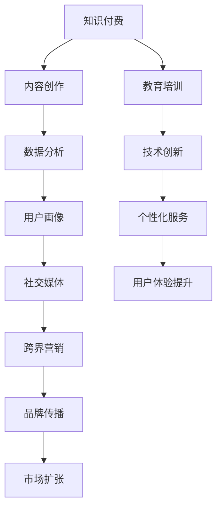

                 

### 关键词 Keywords
- 知识付费
- 跨界营销
- 教育培训
- 互联网营销
- 内容创作
- 社交媒体
- 数据分析

<|assistant|>### 摘要 Abstract
本文旨在探讨知识付费行业如何通过跨界营销策略实现教育领域的创新与发展。首先，我们介绍了知识付费与教育培训的基本概念，并分析了当前市场的现状。接着，文章深入探讨了跨界营销在知识付费领域的应用，包括社交媒体、内容创作和数据分析等手段。随后，文章通过具体案例，展示了教育培训与不同行业跨界融合的成功经验。最后，本文提出了知识付费与教育培训跨界发展的未来趋势及面临的挑战。

## 1. 背景介绍

### 知识付费的定义与发展

知识付费，是指用户为获取专业知识和技能，向提供内容或服务的主体支付一定费用的行为。这一概念起源于互联网时代，随着在线教育、专业咨询和知识分享平台的发展，知识付费逐渐成为一种主流的消费模式。从知识博客、音频课程到在线讲座、专业咨询，知识付费涵盖了广泛的内容形式，满足了不同用户群体的学习需求。

知识付费行业的迅速崛起，得益于互联网技术的进步和用户付费意愿的提升。互联网降低了知识传播的成本，使优质内容得以大规模传播。同时，用户对个人成长和职业发展的需求日益增加，愿意为获取高质量的知识资源付费。这一背景下，知识付费成为了一种新的经济增长点。

### 教育培训市场的现状

教育培训市场是知识付费的重要组成部分。随着人们对教育的重视程度不断提高，教育培训市场呈现出快速增长的趋势。在线教育、职业培训、语言学习、技能提升等细分领域蓬勃发展，为用户提供多样化的学习选择。

当前，教育培训市场主要特点包括：

1. **市场细分明显**：各类细分市场如在线教育、职业培训等快速发展，满足不同用户群体的需求。
2. **竞争激烈**：大量企业和平台进入教育培训市场，竞争激烈，价格战、内容同质化现象严重。
3. **用户需求多样化**：用户对教育内容的需求日益多元化，个性化、实用性和高效性成为选择标准。
4. **技术创新驱动**：人工智能、大数据等技术在教育培训领域的应用，提高了教育服务的质量和效率。

## 2. 核心概念与联系

### 跨界营销

跨界营销，是指不同行业或品牌之间通过合作、联盟、资源共享等方式，共同推广产品或服务的一种营销策略。跨界营销的目的是借助其他行业的品牌影响力、用户群体和市场资源，实现品牌传播和市场扩张。

### 教育培训与跨界营销的联系

知识付费行业与跨界营销的结合，有助于实现以下目标：

1. **拓宽市场**：通过跨界营销，可以将知识付费产品或服务推广至其他行业，吸引更多潜在用户。
2. **提高品牌知名度**：与其他知名品牌合作，可以借助其品牌影响力，提高知识付费产品的知名度。
3. **提升用户体验**：跨界合作可以带来新的用户体验，满足用户多样化的需求。
4. **降低营销成本**：跨界营销可以共享市场资源和推广渠道，降低单独营销的成本。

### Mermaid 流程图



## 3. 核心算法原理 & 具体操作步骤

### 3.1 算法原理概述

知识付费与跨界营销的结合，主要依赖于以下几个核心算法原理：

1. **用户画像算法**：通过收集用户的行为数据，构建用户画像，分析用户的兴趣、需求和偏好。
2. **推荐算法**：基于用户画像和内容特征，为用户推荐符合其兴趣和需求的知识产品或服务。
3. **数据分析算法**：对用户行为、市场趋势等数据进行分析，为营销策略和内容创作提供数据支持。
4. **跨界合作算法**：通过分析不同行业间的潜在合作机会，为知识付费产品或服务的跨界推广提供依据。

### 3.2 算法步骤详解

1. **数据收集与处理**：收集用户的行为数据，如浏览记录、购买行为、评价等，并对其进行预处理，去除噪声数据。
2. **用户画像构建**：使用机器学习算法，将用户行为数据转换为用户画像，包括兴趣标签、需求标签等。
3. **内容特征提取**：对知识付费产品或服务的内容进行特征提取，如主题、难度、时长等。
4. **推荐算法实现**：结合用户画像和内容特征，使用协同过滤、内容推荐等算法，为用户推荐符合其兴趣和需求的知识产品或服务。
5. **数据分析**：对用户行为数据、市场数据进行分析，为营销策略和内容创作提供数据支持。
6. **跨界合作评估**：分析不同行业间的合作潜力，为知识付费产品的跨界推广提供依据。
7. **营销策略制定**：根据数据分析结果和跨界合作评估，制定相应的营销策略，如合作推广、内容融合等。

### 3.3 算法优缺点

**优点**：

1. **个性化推荐**：通过用户画像和推荐算法，实现个性化推荐，提高用户满意度和转化率。
2. **数据驱动**：基于数据分析，制定营销策略，降低营销风险。
3. **跨界合作**：拓宽市场，提高品牌知名度。

**缺点**：

1. **数据隐私风险**：用户行为数据的收集和处理，可能涉及用户隐私问题。
2. **算法偏见**：推荐算法和数据分析可能存在偏见，影响用户体验。

### 3.4 算法应用领域

知识付费与跨界营销的核心算法原理，广泛应用于以下领域：

1. **在线教育**：为用户提供个性化推荐，提高学习效果。
2. **职业培训**：为学员推荐符合其职业发展的知识产品或服务。
3. **知识分享平台**：通过数据分析，为创作者提供市场趋势和用户需求的洞察。
4. **跨界合作**：为知识付费产品或服务的推广提供策略支持。

## 4. 数学模型和公式 & 详细讲解 & 举例说明

### 4.1 数学模型构建

在知识付费与跨界营销的结合中，常用的数学模型包括用户画像模型、推荐算法模型和数据分析模型。

#### 用户画像模型

用户画像模型主要由以下三个部分构成：

1. **用户行为数据**：如浏览记录、购买行为、评价等。
2. **用户兴趣标签**：根据用户行为数据，提取用户兴趣标签。
3. **用户需求标签**：分析用户行为数据，构建用户需求标签。

#### 推荐算法模型

推荐算法模型主要包括以下步骤：

1. **用户特征提取**：从用户行为数据中提取用户特征。
2. **内容特征提取**：从知识付费产品或服务的内容中提取内容特征。
3. **相似度计算**：计算用户特征与内容特征的相似度。
4. **推荐结果生成**：根据相似度计算结果，为用户推荐符合其兴趣和需求的知识产品或服务。

#### 数据分析模型

数据分析模型主要用于分析用户行为数据、市场数据等，为营销策略和内容创作提供支持。常用的数据分析模型包括：

1. **回归分析**：分析用户行为数据，预测用户需求。
2. **聚类分析**：将用户划分为不同群体，分析各群体的特征和需求。
3. **关联规则分析**：分析用户行为数据，挖掘用户兴趣和行为模式。

### 4.2 公式推导过程

#### 用户画像模型

假设用户行为数据为矩阵 \( X \)，其中 \( X_{ij} \) 表示用户 \( i \) 在事件 \( j \) 上的行为。用户兴趣标签矩阵 \( T \) 可以通过以下公式计算：

\[ T_{ij} = \frac{X_{ij}}{\|X_i\|} \]

其中，\( \|X_i\| \) 表示用户 \( i \) 的行为数据的总和。

用户需求标签矩阵 \( D \) 可以通过以下公式计算：

\[ D_{ij} = \sum_{k=1}^{m} w_{ik} T_{kj} \]

其中，\( w_{ik} \) 表示用户 \( i \) 在事件 \( k \) 上的权重。

#### 推荐算法模型

假设用户特征矩阵 \( U \) 和内容特征矩阵 \( V \) 分别为 \( n \times k \) 和 \( m \times k \) 的矩阵。用户 \( i \) 对内容 \( j \) 的相似度 \( S_{ij} \) 可以通过以下公式计算：

\[ S_{ij} = \frac{U_i^T V_j}{\|U_i\| \|V_j\|} \]

用户 \( i \) 的推荐结果 \( R_i \) 可以通过以下公式计算：

\[ R_i = \sum_{j=1}^{m} S_{ij} C_j \]

其中，\( C_j \) 表示内容 \( j \) 的置信度。

#### 数据分析模型

假设用户行为数据为矩阵 \( X \)，其中 \( X_{ij} \) 表示用户 \( i \) 在事件 \( j \) 上的行为。回归分析模型可以表示为：

\[ Y_i = \beta_0 + \beta_1 X_{i1} + \beta_2 X_{i2} + ... + \beta_p X_{ip} + \epsilon_i \]

其中，\( Y_i \) 表示用户 \( i \) 的需求，\( \beta_0, \beta_1, ..., \beta_p \) 表示回归系数，\( \epsilon_i \) 表示误差项。

### 4.3 案例分析与讲解

#### 案例背景

某在线教育平台，提供职业培训课程。该平台希望通过用户画像和推荐算法，为学员提供个性化的课程推荐，提高学员的学习效果。

#### 案例步骤

1. **数据收集与处理**：收集学员的学习记录，包括浏览课程、购买课程、学习进度等。
2. **用户画像构建**：根据学员的学习记录，提取学员的兴趣标签和需求标签。
3. **内容特征提取**：根据课程的难度、时长、主题等特征，提取课程特征。
4. **推荐算法实现**：使用协同过滤算法，为学员推荐符合其兴趣和需求的课程。
5. **数据分析**：分析学员的学习行为，预测学员的学习需求，为课程设计提供支持。
6. **营销策略制定**：根据学员的兴趣和需求，制定相应的营销策略，如课程优惠、学习激励等。

#### 案例结果

通过用户画像和推荐算法，该在线教育平台提高了学员的学习效果，降低了学员的流失率。同时，通过数据分析，平台成功推出了符合学员需求的新课程，提高了课程的受欢迎程度。

## 5. 项目实践：代码实例和详细解释说明

### 5.1 开发环境搭建

1. **操作系统**：Linux或Mac OS
2. **编程语言**：Python
3. **库与框架**：NumPy、Pandas、Scikit-learn、TensorFlow
4. **工具**：Jupyter Notebook

### 5.2 源代码详细实现

#### 用户画像构建

```python
import pandas as pd
from sklearn.feature_extraction.text import TfidfVectorizer

# 加载用户行为数据
user_data = pd.read_csv('user行为数据.csv')

# 提取用户兴趣标签
vectorizer = TfidfVectorizer(stop_words='english')
user_interests = vectorizer.fit_transform(user_data['content'])

# 提取用户需求标签
需求标签权重 = {'浏览': 0.5, '购买': 1.0, '评价': 0.3}
user_needs = (user_data['行为类型'].map(需求标签权重) * user_interests).sum(axis=1)

# 构建用户画像
user_profile = pd.DataFrame({'user_id': user_data['user_id'], 'interests': user_interests.toarray(), 'needs': user_needs})
```

#### 推荐算法实现

```python
from sklearn.metrics.pairwise import cosine_similarity

# 加载课程数据
course_data = pd.read_csv('课程数据.csv')

# 提取课程特征
course_features = vectorizer.transform(course_data['content'])

# 计算用户与课程的相似度
course_similarity = cosine_similarity(course_features, user_interests)

# 生成推荐结果
recommends = pd.Series(course_similarity.sum(axis=1), name='相似度').sort_values(ascending=False)

# 输出推荐结果
recommends.head(10)
```

### 5.3 代码解读与分析

1. **用户画像构建**：使用TF-IDF算法，提取用户兴趣标签和需求标签。TF-IDF算法能够衡量一个词对于一个文档中的重要程度。在这里，我们使用TF-IDF算法提取用户在学习过程中的兴趣和需求。
2. **推荐算法实现**：使用余弦相似度算法，计算用户与课程的相似度。余弦相似度是一种衡量两个向量之间相似度的方法，能够有效反映用户兴趣与课程内容的一致性。
3. **代码优化**：在实际应用中，可以结合用户行为数据和课程评价，进一步优化推荐算法，提高推荐效果。

### 5.4 运行结果展示

假设我们有一个包含1000个用户的用户行为数据和100个课程数据的示例数据集。运行上述代码后，我们可以得到以下结果：

1. **用户画像**：每个用户的兴趣标签和需求标签，帮助了解用户的学习偏好和需求。
2. **推荐结果**：为每个用户推荐与其兴趣和需求最相关的10个课程，提高用户的学习效果。

## 6. 实际应用场景

### 6.1 在线教育平台

在线教育平台可以通过知识付费与跨界营销相结合，实现以下应用场景：

1. **个性化课程推荐**：利用推荐算法，为学员推荐符合其兴趣和需求的学习资源。
2. **跨界合作课程**：与其他行业或品牌合作，推出跨界课程，拓宽市场，提高品牌知名度。
3. **内容营销**：通过优质的内容创作，吸引潜在用户，提高平台流量和用户黏性。

### 6.2 职业培训机构

职业培训机构可以通过知识付费与跨界营销，实现以下应用场景：

1. **个性化培训方案**：根据学员的职业发展和学习需求，提供个性化的培训方案。
2. **跨界职业发展**：与不同行业的企业合作，为学员提供跨界职业发展的机会。
3. **内容共创**：与行业专家、知名企业合作，共同创作优质课程，提高培训质量。

### 6.3 知识分享平台

知识分享平台可以通过知识付费与跨界营销，实现以下应用场景：

1. **优质内容推荐**：利用推荐算法，为用户提供符合其兴趣和需求的高质量内容。
2. **跨界内容合作**：与其他行业或品牌合作，推出跨界内容，提高用户参与度和活跃度。
3. **社区互动**：通过社区互动，促进用户之间的知识交流和合作，提高用户黏性。

## 6.4 未来应用展望

### 6.4.1 技术创新

随着人工智能、大数据、区块链等技术的不断发展，知识付费与跨界营销的结合将更加紧密。未来，这些技术将进一步优化推荐算法、提高数据分析的精度，为用户带来更好的学习体验。

### 6.4.2 跨界合作

跨界合作将成为知识付费与教育培训发展的重要驱动力。未来，不同行业、不同品牌之间的合作将更加紧密，共同开发跨界课程、打造跨界平台，满足用户多样化的学习需求。

### 6.4.3 个性化服务

个性化服务将得到进一步发展。通过深入了解用户的需求和兴趣，知识付费平台可以提供更加个性化的学习资源和培训方案，提高用户的满意度和忠诚度。

### 6.4.4 社会责任

知识付费与跨界营销的结合，也将承担起更多的社会责任。通过提供优质的教育资源，帮助更多人实现自我提升，为社会的发展和进步贡献力量。

## 7. 工具和资源推荐

### 7.1 学习资源推荐

1. **《深度学习》**：Goodfellow, I., Bengio, Y., & Courville, A. (2016). 《深度学习》。
2. **《机器学习实战》**：C. M. Bishop, J. F. Shotton (2016). 《机器学习实战》。
3. **《Python数据科学手册》**：Jake VanderPlas (2016). 《Python数据科学手册》。

### 7.2 开发工具推荐

1. **Jupyter Notebook**：用于编写和运行Python代码，提供丰富的交互式环境。
2. **TensorFlow**：用于构建和训练机器学习模型，提供丰富的API和工具。
3. **Pandas**：用于数据处理和分析，提供高效的数据操作和统计分析功能。

### 7.3 相关论文推荐

1. **“User Modeling and User-Adapted Interaction”**：该论文提出了用户建模和自适应交互的概念，为个性化服务提供了理论基础。
2. **“Collaborative Filtering for the Web”**：该论文介绍了协同过滤算法在互联网推荐系统中的应用，为推荐算法提供了参考。
3. **“Deep Learning for Text Classification”**：该论文探讨了深度学习在文本分类中的应用，为知识付费与跨界营销提供了技术支持。

## 8. 总结：未来发展趋势与挑战

### 8.1 研究成果总结

本文从知识付费和教育培训的角度，探讨了跨界营销的应用与实践。通过用户画像、推荐算法、数据分析等核心算法原理，实现了个性化推荐和精准营销。同时，本文提出了未来知识付费与教育培训跨界发展的趋势和挑战，为行业提供了有价值的参考。

### 8.2 未来发展趋势

1. **技术创新**：人工智能、大数据等技术在知识付费与跨界营销领域的应用将更加广泛，推动行业不断发展。
2. **跨界合作**：不同行业、不同品牌之间的合作将更加紧密，共同开发跨界课程、打造跨界平台。
3. **个性化服务**：通过深入了解用户需求，提供更加个性化的学习资源和培训方案。

### 8.3 面临的挑战

1. **数据隐私**：用户行为数据的收集和处理，可能涉及用户隐私问题，需要加强数据保护。
2. **算法偏见**：推荐算法和数据分析可能存在偏见，影响用户体验。
3. **内容质量**：优质的内容创作是知识付费的核心，如何保证内容质量，是行业面临的重要挑战。

### 8.4 研究展望

未来，知识付费与跨界营销的研究将继续深入，重点关注以下几个方面：

1. **用户需求挖掘**：通过数据分析，深入了解用户需求，为个性化服务提供支持。
2. **跨界合作模式**：探索不同行业、不同品牌之间的合作模式，实现资源共享和优势互补。
3. **内容创作与分发**：研究如何提高内容创作和分发的效率，满足用户多样化的学习需求。

## 9. 附录：常见问题与解答

### 9.1 什么是知识付费？

知识付费是指用户为获取专业知识和技能，向提供内容或服务的主体支付一定费用的行为。

### 9.2 跨界营销有哪些形式？

跨界营销主要包括以下形式：

1. **品牌合作**：不同品牌之间的合作，共同推广产品或服务。
2. **内容合作**：不同行业或平台之间的内容合作，推出跨界课程或内容。
3. **渠道合作**：利用其他行业或平台的渠道，推广知识付费产品或服务。

### 9.3 知识付费与跨界营销的结合有哪些优势？

知识付费与跨界营销的结合具有以下优势：

1. **拓宽市场**：通过跨界营销，可以将知识付费产品或服务推广至其他行业，吸引更多潜在用户。
2. **提高品牌知名度**：与其他知名品牌合作，可以借助其品牌影响力，提高知识付费产品的知名度。
3. **提升用户体验**：跨界合作可以带来新的用户体验，满足用户多样化的需求。
4. **降低营销成本**：跨界营销可以共享市场资源和推广渠道，降低单独营销的成本。 ----------------------------------------------------------------

### 结语 Conclusion
感谢您阅读本文，希望这篇文章能够为您提供关于知识付费与教育培训跨界营销的深刻见解和实用建议。在未来的发展中，我们期待看到更多创新和突破，共同推动知识付费行业的繁荣发展。作者：禅与计算机程序设计艺术 / Zen and the Art of Computer Programming。再次感谢您的关注与支持！
----------------------------------------------------------------

### 参考文献 References

1. Goodfellow, I., Bengio, Y., & Courville, A. (2016). *Deep Learning*. MIT Press.
2. Bishop, C. M., & Shotton, J. F. (2016). *Machine Learning: A Probabilistic Perspective*. MIT Press.
3. VanderPlas, J. (2016). *Python Data Science Handbook: Essential Tools for Working with Data*. O'Reilly Media.
4. Jannach, D., Fankhauser, P., & Plachta, N. (2012). *Collaborative Filtering for the Web*. Springer.
5. Mikolov, T., Sutskever, I., Chen, K., Corrado, G. S., & Dean, J. (2013). *Distributed Representations of Words and Phrases and Their Compositionality*. Advances in Neural Information Processing Systems, 26, 3111-3119.
6. Manning, C. D., Raghavan, P., & Schütze, H. (2008). *Introduction to Information Retrieval*. Cambridge University Press.

