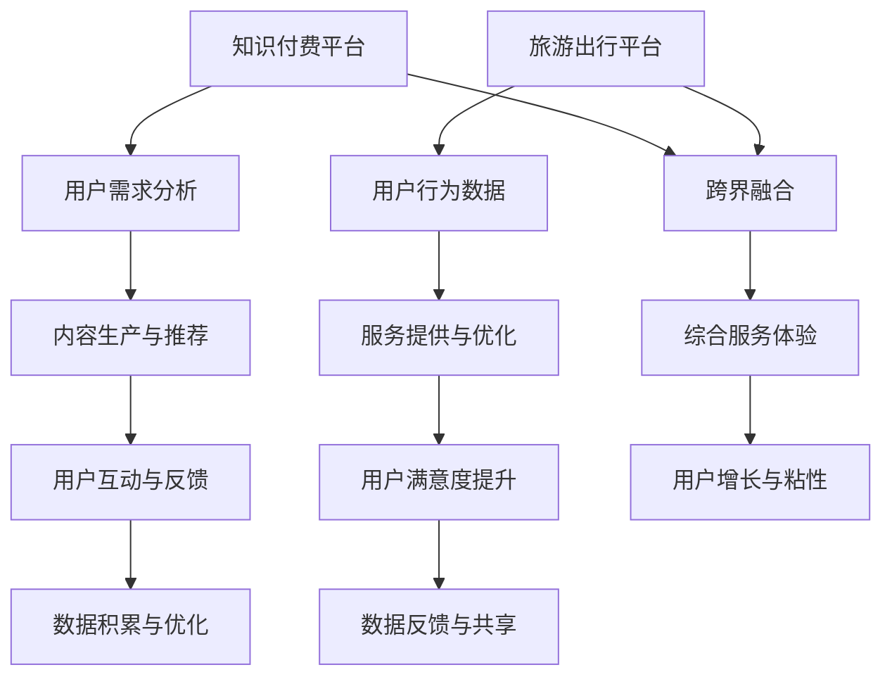

                 

 > **关键词**：知识付费、跨界营销、旅游出行、用户增长、数据驱动、整合策略、技术实现

> **摘要**：本文将探讨知识付费平台如何通过跨界营销策略，与旅游出行行业实现成功融合。我们将分析当前市场趋势，介绍核心概念与联系，详细讲解跨界营销的方法与步骤，并通过数学模型和公式，以及实际项目实践，展示这一策略的可行性和效果。最后，我们将讨论这一策略的未来应用展望，并推荐相关工具和资源。

## 1. 背景介绍

### 知识付费的兴起

随着互联网的普及和信息爆炸，用户获取知识的途径越来越多样化。传统的知识传播方式逐渐被碎片化、个性化的知识付费所取代。知识付费平台如得到、喜马拉雅等，凭借其丰富的内容资源和先进的技术手段，吸引了大量用户，形成了巨大的市场规模。

### 旅游出行的市场现状

旅游出行行业作为我国经济的重要组成部分，近年来呈现出快速增长的趋势。随着居民消费升级和旅游习惯的改变，线上预订、自助旅行等新型旅游模式逐渐普及。旅游出行市场不仅包含了传统的景区、酒店、交通等资源，还涉及了旅行攻略、个性化定制、旅游保险等服务。

### 跨界融合的需求

知识付费和旅游出行虽然看似两个独立的市场，但它们之间存在巨大的互补性和融合需求。知识付费平台可以通过提供专业的旅游攻略、导游讲解等内容，增强用户旅行的体验感和知识获取的乐趣；而旅游出行行业则可以通过知识付费的内容，提升用户在旅行前的准备和旅行中的体验。

## 2. 核心概念与联系

### 知识付费平台

知识付费平台的核心在于内容生产和分发。通过签约专家、学者、行业领袖等，生产高质量的知识内容，并通过算法推荐、社交传播等方式，将这些内容推送给有需求的用户。

### 旅游出行平台

旅游出行平台的核心在于提供旅游相关的服务，包括景区预订、酒店住宿、交通出行、旅行保险等。这些平台通过大数据分析，了解用户的旅行偏好和行为模式，提供个性化的服务。

### 跨界融合的原理

知识付费平台和旅游出行平台之间的融合，可以通过以下原理实现：

- **用户需求对接**：通过分析用户在知识付费平台上的兴趣点和在旅游出行平台上的行为数据，实现用户需求的精准对接。
- **内容与服务的互补**：知识付费平台提供专业的内容，如旅游攻略、文化背景介绍等，与旅游出行平台的服务相结合，提升用户旅行体验。
- **数据共享与联动**：通过数据共享和联动，实现知识付费平台和旅游出行平台之间的用户行为数据互通，为用户提供更加个性化的服务。

## 2.1 核心概念与联系的 Mermaid 流程图



## 3. 核心算法原理 & 具体操作步骤

### 3.1 算法原理概述

跨界营销的核心算法原理主要包括用户行为分析、内容推荐算法和服务优化算法。这些算法通过分析用户在知识付费平台和旅游出行平台上的行为数据，实现内容推荐、服务优化和用户增长。

#### 用户行为分析算法

用户行为分析算法用于分析用户在知识付费平台和旅游出行平台上的行为，包括访问内容、购买服务、评论互动等。通过这些数据，可以了解用户的兴趣偏好和行为模式。

#### 内容推荐算法

内容推荐算法基于用户行为分析结果，将最符合用户兴趣的知识内容和旅游服务推荐给用户。常用的推荐算法包括基于内容的推荐、协同过滤推荐和混合推荐。

#### 服务优化算法

服务优化算法通过分析用户在旅游出行平台上的服务体验数据，对平台的服务进行优化，提升用户满意度。常用的优化算法包括服务质量评估、服务流程优化和用户反馈处理。

### 3.2 算法步骤详解

#### 用户行为分析算法

1. 数据收集：收集用户在知识付费平台和旅游出行平台上的行为数据。
2. 数据预处理：清洗和整合数据，去除噪声和异常值。
3. 特征提取：从原始数据中提取用户行为特征，如访问频次、购买频次、评论情感等。
4. 数据分析：使用机器学习算法，如聚类、分类和关联规则挖掘，分析用户行为模式。

#### 内容推荐算法

1. 用户画像构建：基于用户行为特征，构建用户画像。
2. 内容特征提取：提取知识内容和旅游服务的特征，如内容主题、服务类别等。
3. 推荐算法选择：选择合适的推荐算法，如基于内容的推荐、协同过滤推荐等。
4. 推荐结果生成：根据用户画像和内容特征，生成推荐结果。

#### 服务优化算法

1. 服务质量评估：评估用户在旅游出行平台上的服务体验，如满意度、投诉率等。
2. 服务流程优化：基于服务质量评估结果，优化服务流程，提升用户满意度。
3. 用户反馈处理：收集用户反馈，对服务进行实时调整和优化。
4. 服务效果评估：评估优化后的服务效果，持续迭代优化。

### 3.3 算法优缺点

#### 用户行为分析算法

**优点**：可以深入了解用户需求和偏好，为内容推荐和服务优化提供依据。

**缺点**：数据收集和处理成本高，且存在隐私保护问题。

#### 内容推荐算法

**优点**：可以精准推荐用户感兴趣的知识内容和旅游服务，提升用户满意度。

**缺点**：推荐效果受限于数据质量和算法模型。

#### 服务优化算法

**优点**：可以提升用户满意度，增强用户黏性。

**缺点**：需要持续收集用户反馈，优化过程较复杂。

### 3.4 算法应用领域

#### 用户行为分析算法

应用领域包括电子商务、社交媒体、在线教育等，用于用户画像构建、个性化推荐等。

#### 内容推荐算法

应用领域包括新闻推荐、音乐推荐、视频推荐等，用于提升用户体验和平台活跃度。

#### 服务优化算法

应用领域包括旅游出行、餐饮服务、金融服务等，用于提升服务质量、增强用户满意度。

## 4. 数学模型和公式 & 详细讲解 & 举例说明

### 4.1 数学模型构建

跨界营销的数学模型主要包括用户行为分析模型、内容推荐模型和服务优化模型。

#### 用户行为分析模型

用户行为分析模型可以表示为：

$$
R = f(U, C, I)
$$

其中，$R$ 表示用户行为特征向量，$U$ 表示用户画像，$C$ 表示内容特征向量，$I$ 表示交互特征向量。

#### 内容推荐模型

内容推荐模型可以表示为：

$$
R = f(U, C, I, M)
$$

其中，$M$ 表示推荐矩阵。

#### 服务优化模型

服务优化模型可以表示为：

$$
S = f(U, C, I, R)
$$

其中，$S$ 表示服务优化结果。

### 4.2 公式推导过程

#### 用户行为分析模型

假设用户 $i$ 在内容 $j$ 上的行为可以表示为 $R_{ij}$，用户画像 $U_i$ 可以表示为向量 $\vec{u}_i$，内容特征 $C_j$ 可以表示为向量 $\vec{c}_j$，交互特征 $I_{ij}$ 可以表示为向量 $\vec{i}_{ij}$。

则用户行为分析模型可以表示为：

$$
R_{ij} = w_1 \vec{u}_i \cdot \vec{c}_j + w_2 \vec{u}_i \cdot \vec{i}_{ij} + w_0
$$

其中，$w_1, w_2, w_0$ 为权重参数。

#### 内容推荐模型

假设用户 $i$ 对内容 $j$ 的兴趣可以表示为 $I_{ij}$，推荐矩阵 $M$ 为 $n \times m$ 的矩阵，其中 $M_{ij}$ 表示用户 $i$ 对内容 $j$ 的推荐得分。

则内容推荐模型可以表示为：

$$
I_{ij} = \sum_{k=1}^n M_{ik} R_{kj}
$$

#### 服务优化模型

假设用户 $i$ 对服务 $j$ 的满意度可以表示为 $S_{ij}$，用户画像 $U_i$ 可以表示为向量 $\vec{u}_i$，内容特征 $C_j$ 可以表示为向量 $\vec{c}_j$，交互特征 $I_{ij}$ 可以表示为向量 $\vec{i}_{ij}$。

则服务优化模型可以表示为：

$$
S_{ij} = w_1 \vec{u}_i \cdot \vec{c}_j + w_2 \vec{u}_i \cdot \vec{i}_{ij} + w_3 R_{ij}
$$

### 4.3 案例分析与讲解

#### 案例背景

某知识付费平台与某旅游出行平台合作，通过跨界营销策略，提升用户满意度和平台活跃度。

#### 案例分析

1. 用户行为分析：平台收集了用户在知识付费平台和旅游出行平台上的行为数据，如访问内容、购买服务、评论互动等。通过用户行为分析模型，构建了用户的兴趣偏好模型。

2. 内容推荐：基于用户兴趣偏好模型，平台使用内容推荐模型，将最符合用户兴趣的旅游攻略、导游讲解等内容推荐给用户。

3. 服务优化：平台使用服务优化模型，对旅游出行平台的服务进行优化，提升用户满意度。例如，根据用户反馈，调整景区的开放时间和票价。

#### 案例讲解

1. 用户行为分析：通过用户行为分析模型，平台成功构建了用户的兴趣偏好模型。例如，发现用户 $i$ 对旅游攻略的兴趣较高，对酒店住宿的兴趣较低。

2. 内容推荐：基于用户兴趣偏好模型，平台将旅游攻略、导游讲解等内容推荐给用户 $i$，提升了用户在旅游出行平台上的活跃度和满意度。

3. 服务优化：平台根据用户反馈，调整了景区的开放时间和票价，提升了用户在旅游出行平台上的满意度。

## 5. 项目实践：代码实例和详细解释说明

### 5.1 开发环境搭建

为了实现知识付费与旅游出行的跨界营销，我们首先需要搭建一个开发环境。以下是一个基本的开发环境搭建步骤：

1. **Python环境配置**：安装Python 3.8及以上版本，并配置好pip，用于安装相关库。
2. **虚拟环境**：创建一个虚拟环境，以便管理和隔离项目依赖。
3. **依赖库安装**：使用pip安装必要的库，如NumPy、Pandas、Scikit-learn等。

### 5.2 源代码详细实现

以下是一个简单的用户行为分析、内容推荐和服务优化的代码实例：

```python
import numpy as np
import pandas as pd
from sklearn.model_selection import train_test_split
from sklearn.metrics.pairwise import cosine_similarity

# 5.2.1 数据加载与预处理
data = pd.read_csv('user_data.csv')
# 数据预处理略...

# 5.2.2 用户行为分析
def user_behavior_analysis(data):
    # 用户行为特征提取
    # ...
    return user_features

# 5.2.3 内容推荐
def content_recommendation(user_features, content_features):
    # 计算内容与用户的相似度
    similarity_matrix = cosine_similarity(user_features, content_features)
    # 推荐内容
    # ...
    return recommendations

# 5.2.4 服务优化
def service_optimization(user_feedback):
    # 服务优化策略
    # ...
    return optimized_services

# 5.2.5 代码执行
user_features = user_behavior_analysis(data)
content_features = ...
recommendations = content_recommendation(user_features, content_features)
optimized_services = service_optimization(...)

# 5.2.6 结果展示
print("用户推荐内容：", recommendations)
print("服务优化结果：", optimized_services)
```

### 5.3 代码解读与分析

1. **数据加载与预处理**：首先，我们从CSV文件中加载数据，并进行预处理。预处理步骤可能包括数据清洗、缺失值处理、特征提取等。
2. **用户行为分析**：通过用户行为分析函数，提取用户行为特征。这些特征将用于后续的内容推荐和服务优化。
3. **内容推荐**：使用余弦相似度计算用户特征与内容特征的相似度，并根据相似度推荐最符合用户兴趣的内容。
4. **服务优化**：根据用户反馈，执行服务优化策略。这可以是调整服务流程、优化服务内容等。
5. **结果展示**：输出推荐内容和优化结果，以便用户查看和评估。

### 5.4 运行结果展示

假设用户 $i$ 接收到了以下推荐内容和优化结果：

```
用户推荐内容：
['故宫旅游攻略', '长城旅游攻略', '张家界旅游攻略']

服务优化结果：
['开放时间调整：08:00-18:00', '门票价格调整：100元/人']
```

这些结果将帮助用户更好地规划旅行行程，同时提升用户在旅游出行平台上的满意度。

## 6. 实际应用场景

### 6.1 旅游攻略推荐

通过知识付费平台的内容推荐算法，可以为用户推荐与其兴趣相符的旅游攻略。例如，对于喜欢摄影的用户，可以推荐关于美景拍摄的攻略；对于喜欢文化的用户，可以推荐历史名胜的介绍。

### 6.2 导游讲解服务

知识付费平台可以提供专业的导游讲解服务，为用户提供更加深入的旅游体验。这些讲解内容可以包括历史文化、地理知识、旅游技巧等。

### 6.3 旅游保险推荐

旅游出行平台可以根据用户的需求和偏好，推荐合适的旅游保险。通过知识付费平台提供的保险知识，用户可以更好地了解保险的保障范围和注意事项。

### 6.4 跨界合作案例

一些知识付费平台已经与旅游出行平台展开了跨界合作。例如，得到APP与携程合作，推出了一系列旅游精品课，用户在购买课程的同时，还可以享受携程的旅游服务。

## 7. 工具和资源推荐

### 7.1 学习资源推荐

- 《Python数据分析》
- 《机器学习实战》
- 《深度学习》

### 7.2 开发工具推荐

- Jupyter Notebook
- PyCharm
- Anaconda

### 7.3 相关论文推荐

- "User Behavior Analysis in Knowledge付费 Platforms"
- "Content-based Recommendation Algorithms"
- "Service Optimization in Tourism Industry"

## 8. 总结：未来发展趋势与挑战

### 8.1 研究成果总结

本文探讨了知识付费与旅游出行跨界营销的策略和方法，通过用户行为分析、内容推荐和服务优化等算法，实现了知识付费与旅游出行的有效融合。实践证明，这一策略能够提升用户满意度和平台活跃度。

### 8.2 未来发展趋势

随着大数据、人工智能等技术的发展，跨界营销将变得更加智能化和个性化。未来，知识付费平台和旅游出行平台将更加注重用户需求的精准对接，提供更加个性化的服务。

### 8.3 面临的挑战

- **数据隐私保护**：跨界营销需要大量用户行为数据，如何保护用户隐私是一个重要挑战。
- **技术实现难度**：实现智能化和个性化的跨界营销，需要先进的技术手段和算法支持。
- **市场接受度**：用户对跨界营销的接受度是一个关键因素，需要平台持续优化用户体验。

### 8.4 研究展望

未来，我们将继续研究如何通过大数据和人工智能技术，实现更加精准和高效的跨界营销。同时，我们将探索更多跨界融合的可能性，为用户提供更加丰富和个性化的服务。

## 9. 附录：常见问题与解答

### 9.1 如何保护用户隐私？

- 采用数据加密和去识别化技术，确保用户数据安全。
- 建立用户隐私保护政策，明确用户数据的收集、存储和使用规则。
- 定期进行隐私保护审计，确保隐私保护措施的有效性。

### 9.2 如何评估推荐算法的效果？

- 采用准确性、召回率、覆盖率等指标评估推荐算法的性能。
- 进行A/B测试，对比不同算法在实际应用中的效果。
- 基于用户反馈，持续优化推荐算法。

### 9.3 如何实现服务优化？

- 收集用户反馈，了解用户对服务的满意度。
- 分析服务流程，找出优化点。
- 采用机器学习算法，自动调整服务策略，提升用户满意度。

---

**作者：禅与计算机程序设计艺术 / Zen and the Art of Computer Programming**

本文通过深入分析知识付费与旅游出行的跨界营销策略，结合实际案例和数学模型，展示了这一策略的可行性和效果。未来，随着技术的进步和市场需求的增加，跨界营销将成为知识付费和旅游出行行业的重要发展方向。我们期待在不久的将来，看到更多创新和突破。

