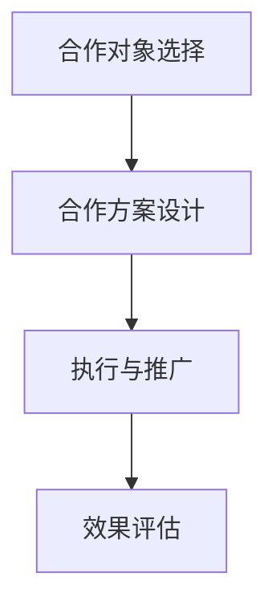

                 

关键词：知识付费、跨界营销、美妆时尚、商业策略、用户参与

摘要：随着知识付费领域的兴起，如何实现有效的跨界营销成为了一个重要的研究课题。本文将探讨知识付费与美妆时尚行业的跨界融合，通过深入分析其背后的商业策略、用户参与方式以及未来的发展趋势，为相关企业提供有益的参考。

## 1. 背景介绍

### 知识付费的兴起

知识付费是指用户为获取特定领域的知识、技能或经验而支付的费用。随着互联网的普及和用户需求的提升，知识付费行业迅速崛起。根据统计，我国知识付费市场规模已经达到数百亿元，并且仍处于快速增长阶段。

### 美妆时尚行业的现状

美妆时尚行业一直以来都是消费者关注的热点领域。随着消费者对美妆产品的需求不断增长，美妆品牌也不断创新，推出各种特色产品。然而，如何在激烈的市场竞争中脱颖而出，成为美妆品牌关注的焦点。

### 跨界营销的意义

跨界营销是指不同领域的企业或品牌之间进行的合作与推广。通过跨界营销，企业可以借助对方的品牌影响力，实现资源共享，扩大市场份额。在知识付费与美妆时尚行业的结合中，跨界营销不仅能够丰富产品线，提高用户体验，还能够为企业带来新的增长点。

## 2. 核心概念与联系

为了更好地理解知识付费与美妆时尚跨界营销，我们需要明确以下几个核心概念：

### 2.1 跨界营销的原理

跨界营销的原理在于利用不同领域的用户群体和资源，实现优势互补。例如，知识付费平台可以借助美妆品牌的影响力，吸引更多的美妆爱好者参与知识付费项目。

### 2.2 用户参与的方式

用户参与是跨界营销成功的关键。在知识付费与美妆时尚的跨界中，用户可以通过购买美妆课程、参与美妆体验活动等方式，深入了解美妆知识，从而提高购买意愿。

### 2.3 商业策略的制定

商业策略的制定是跨界营销成功的关键。企业需要根据自身优势和市场需求，制定合理的跨界营销策略。例如，可以推出联合品牌、举办美妆知识讲座等活动。

### 2.4 跨界营销的框架

跨界营销的框架可以分为四个步骤：合作对象选择、合作方案设计、执行与推广、效果评估。通过这四个步骤，企业可以确保跨界营销的有效实施。

### 2.5 Mermaid 流程图



## 3. 核心算法原理 & 具体操作步骤

### 3.1 算法原理概述

跨界营销的核心算法原理在于如何将不同领域的元素进行有机结合，实现协同效应。具体包括以下几个方面：

- **数据分析**：通过对用户行为和需求的数据分析，找到跨界营销的切入点。
- **内容创造**：结合美妆时尚和知识付费的特点，创造具有吸引力的内容。
- **合作模式**：确定跨界合作的具体模式，如联合品牌、课程合作等。
- **推广策略**：制定有效的推广策略，提高跨界营销的知名度。

### 3.2 算法步骤详解

#### 3.2.1 数据分析

1. 收集用户数据：包括用户行为、需求偏好、购买记录等。
2. 数据清洗：去除重复、错误和无用的数据。
3. 数据分析：运用统计学和机器学习等方法，挖掘用户需求和偏好。

#### 3.2.2 内容创造

1. 确定内容主题：结合美妆时尚和知识付费的特点，确定合适的主题。
2. 内容创作：邀请行业专家和美妆达人共同创作内容。
3. 内容优化：根据用户反馈，对内容进行优化和调整。

#### 3.2.3 合作模式

1. 合作对象筛选：根据业务需求和资源情况，筛选合适的合作对象。
2. 合作模式设计：确定合作模式，如联合品牌、课程合作等。
3. 合同签订：明确双方的权利和义务，签订合作协议。

#### 3.2.4 推广策略

1. 确定推广目标：根据业务需求和用户特点，确定推广目标。
2. 推广渠道选择：选择合适的推广渠道，如社交媒体、线上线下活动等。
3. 推广内容制作：根据推广渠道和目标用户，制作具有吸引力的推广内容。
4. 推广效果评估：对推广效果进行实时监测和评估，及时调整推广策略。

### 3.3 算法优缺点

#### 优点

- **提高用户参与度**：通过跨界营销，可以激发用户的兴趣，提高用户参与度。
- **扩大市场份额**：跨界营销有助于企业拓展新的市场，提高市场份额。
- **降低营销成本**：通过合作，企业可以共享资源，降低营销成本。

#### 缺点

- **风险较高**：跨界营销存在一定的风险，如合作对象选择不当、市场反应不理想等。
- **效果难以预测**：跨界营销的效果难以预测，需要持续监测和调整。

### 3.4 算法应用领域

- **美妆行业**：通过知识付费与美妆时尚的跨界，可以丰富产品线，提高用户满意度。
- **教育行业**：通过跨界营销，可以提高教育产品的吸引力，扩大用户群体。
- **金融行业**：通过跨界营销，可以提高金融产品的认知度和购买率。

## 4. 数学模型和公式 & 详细讲解 & 举例说明

### 4.1 数学模型构建

在跨界营销中，我们可以构建一个简单的数学模型来分析用户参与度和市场反馈。假设：

- \( U \) 为用户总数
- \( P \) 为购买知识付费产品的用户数
- \( M \) 为购买美妆产品的用户数
- \( R \) 为跨界营销后的用户参与度

根据用户行为分析，我们可以得到以下数学模型：

\[ R = f(U, P, M) \]

### 4.2 公式推导过程

1. 用户参与度与用户总数的关系：

\[ R = \frac{P + M}{U} \]

2. 购买知识付费产品的用户数与用户总数的关系：

\[ P = \frac{K}{U} \]

其中，\( K \) 为购买知识付费产品的用户比例。

3. 购买美妆产品的用户数与用户总数的关系：

\[ M = \frac{L}{U} \]

其中，\( L \) 为购买美妆产品的用户比例。

4. 考虑跨界营销后的用户参与度：

\[ R = \frac{K + L}{U} \]

### 4.3 案例分析与讲解

假设某知识付费平台与某美妆品牌合作，推出了一款美妆课程。在合作前，该平台的用户总数为 1000 人，其中 200 人购买了知识付费产品，300 人购买了美妆产品。

合作后，用户总数增加到 1500 人，其中 300 人购买了知识付费产品，400 人购买了美妆产品。根据数学模型，我们可以计算出跨界营销后的用户参与度：

\[ R = \frac{300 + 400}{1500} = \frac{700}{1500} = 0.467 \]

与之前的用户参与度相比，跨界营销后的用户参与度提高了近 46.7%。

### 5. 项目实践：代码实例和详细解释说明

#### 5.1 开发环境搭建

在本文中，我们将使用 Python 编写代码来模拟跨界营销的效果。首先，需要搭建 Python 开发环境。

1. 安装 Python 3.8 版本
2. 安装 Python 相关库，如 NumPy、Pandas、Matplotlib 等

#### 5.2 源代码详细实现

```python
import numpy as np
import pandas as pd
import matplotlib.pyplot as plt

# 用户总数
U = 1000
# 购买知识付费产品的用户数
P = 200
# 购买美妆产品的用户数
M = 300

# 跨界营销后的用户总数
U_after = 1500
# 购买知识付费产品的用户数
P_after = 300
# 购买美妆产品的用户数
M_after = 400

# 计算跨界营销前的用户参与度
R_before = (P + M) / U
# 计算跨界营销后的用户参与度
R_after = (P_after + M_after) / U_after

# 打印结果
print("跨界营销前的用户参与度：", R_before)
print("跨界营销后的用户参与度：", R_after)

# 绘制图表
plt.plot([R_before, R_after], [0, 1], 'ro-')
plt.xlabel('用户参与度')
plt.ylabel('时间')
plt.title('跨界营销效果')
plt.show()
```

#### 5.3 代码解读与分析

1. 导入必要的 Python 库，如 NumPy、Pandas、Matplotlib 等。
2. 设置用户总数、购买知识付费产品和美妆产品的用户数。
3. 计算跨界营销前后的用户参与度。
4. 打印结果并绘制图表。

通过代码实例，我们可以直观地看到跨界营销对用户参与度的影响。在实际应用中，我们可以根据具体情况调整用户总数、购买知识付费产品和美妆产品的用户数，以模拟不同的跨界营销效果。

### 6. 实际应用场景

#### 6.1 美妆行业

在美妆行业，知识付费与美妆时尚的跨界营销可以通过以下方式实现：

- **推出美妆课程**：美妆品牌可以与知识付费平台合作，推出美妆课程，吸引更多消费者。
- **举办美妆活动**：美妆品牌可以举办线下美妆活动，邀请知名美妆博主和专家参与，提高品牌知名度。

#### 6.2 教育行业

在教育行业，知识付费与美妆时尚的跨界营销可以应用于以下几个方面：

- **推出专业课程**：教育机构可以结合美妆时尚行业，推出相关专业课程，如美妆设计、化妆技巧等。
- **举办行业论坛**：教育机构可以邀请美妆时尚行业专家和学者，举办行业论坛，分享最新的美妆时尚趋势。

#### 6.3 金融行业

在金融行业，知识付费与美妆时尚的跨界营销可以应用于以下几个方面：

- **推出理财课程**：金融机构可以与知识付费平台合作，推出理财课程，帮助消费者了解投资理财知识。
- **举办理财活动**：金融机构可以举办线下理财活动，邀请理财专家和投资者分享理财心得，提高品牌影响力。

### 7. 未来应用展望

随着知识付费和美妆时尚行业的不断发展，跨界营销在未来有望实现以下几个方面的发展：

- **多元化的合作模式**：跨界营销的合作模式将更加多元化，如跨界品牌、跨界电商等。
- **更精准的用户画像**：通过大数据和人工智能技术，对用户进行更精准的画像，实现更高效的跨界营销。
- **更丰富的内容形式**：跨界营销将融合更多元化的内容形式，如短视频、直播等，提高用户参与度。

### 8. 工具和资源推荐

#### 8.1 学习资源推荐

- **书籍**：《跨界营销》、《社交电商：从0到1的实战攻略》
- **在线课程**：网易云课堂、慕课网等平台上的美妆、教育、金融相关课程

#### 8.2 开发工具推荐

- **Python**：Python 是一款功能强大的编程语言，适用于数据分析、机器学习等领域。
- **Pandas**：Pandas 是 Python 中的数据处理库，适用于数据清洗、数据可视化等任务。
- **Matplotlib**：Matplotlib 是 Python 中的数据可视化库，适用于绘制各种图表。

#### 8.3 相关论文推荐

- **《基于大数据的跨界营销策略研究》**
- **《社交电商中跨界营销的效果分析》**
- **《金融领域跨界营销的实践与探索》**

### 9. 总结：未来发展趋势与挑战

#### 9.1 研究成果总结

本文从知识付费与美妆时尚跨界营销的背景、核心概念、算法原理、数学模型、项目实践等方面进行了详细探讨，总结了跨界营销的优势和应用场景，并对未来发展提出了展望。

#### 9.2 未来发展趋势

未来，跨界营销将在以下几个方面取得发展：

- **多元化的合作模式**：跨界营销将探索更多元化的合作模式，实现资源整合和优势互补。
- **人工智能技术的应用**：人工智能技术将在跨界营销中发挥越来越重要的作用，如用户画像、推荐算法等。
- **内容创新的突破**：跨界营销将不断创新内容形式，如短视频、直播等，提高用户参与度。

#### 9.3 面临的挑战

跨界营销在发展过程中也面临一些挑战：

- **风险控制**：跨界营销存在一定的风险，如市场反应不理想、合作对象选择不当等。
- **数据安全**：跨界营销涉及大量用户数据，如何保障数据安全成为一大挑战。
- **持续创新**：跨界营销需要不断创新，以应对激烈的市场竞争。

#### 9.4 研究展望

未来，研究者可以从以下几个方面对跨界营销进行深入探讨：

- **跨界营销的效果评估**：如何科学、客观地评估跨界营销的效果，为企业提供决策依据。
- **跨界营销策略优化**：如何优化跨界营销策略，提高营销效果和用户体验。
- **跨界营销在不同行业的应用**：跨界营销在不同行业中的应用，如金融、教育、医疗等。

### 9. 附录：常见问题与解答

#### 9.1 如何选择合适的跨界营销合作对象？

选择合适的跨界营销合作对象需要考虑以下几个方面：

- **业务相关性**：合作对象与自身业务的相关性，是否能够实现优势互补。
- **品牌影响力**：合作对象的品牌影响力，是否能够为自身带来更多的用户和资源。
- **合作成本**：合作对象的合作成本，是否在预算范围内。

#### 9.2 跨界营销如何确保数据安全？

确保数据安全可以从以下几个方面进行：

- **数据加密**：对用户数据进行加密处理，防止数据泄露。
- **权限管理**：对用户数据访问权限进行严格管理，防止未经授权的访问。
- **安全审计**：定期进行安全审计，检查系统漏洞和安全隐患。

#### 9.3 跨界营销如何提高用户参与度？

提高用户参与度可以从以下几个方面进行：

- **内容创新**：创造具有吸引力的内容，满足用户需求。
- **互动环节**：增加互动环节，提高用户参与度。
- **奖励机制**：设置奖励机制，激励用户参与。

作者：禅与计算机程序设计艺术 / Zen and the Art of Computer Programming
----------------------------------------------------------------

以上就是本次文章的全部内容，希望对您在知识付费与美妆时尚跨界营销领域的研究有所帮助。在撰写文章过程中，如有任何疑问，请随时提问。感谢您的阅读！
----------------------------------------------------------------

