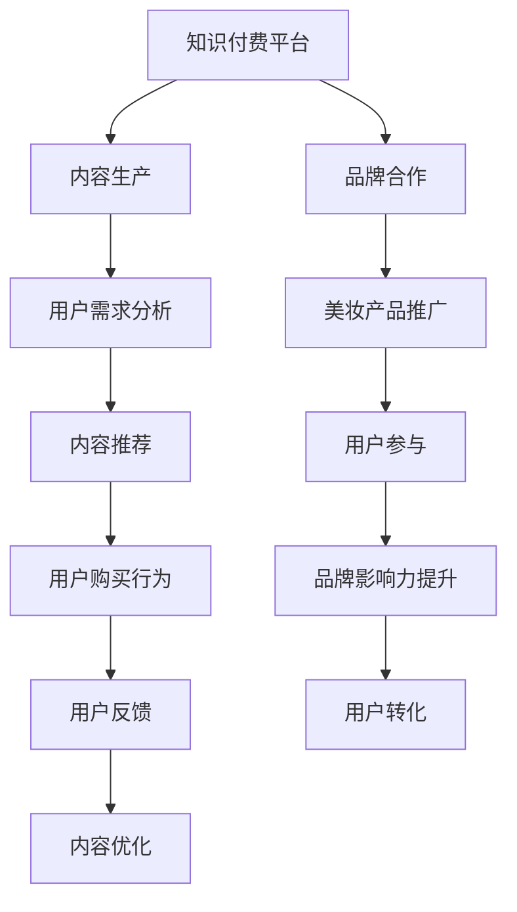

                 

关键词：知识付费、跨界营销、美妆时尚、用户增长、内容变现、品牌合作

> 摘要：随着互联网技术的发展和消费者需求的多样化，知识付费逐渐成为一种新兴的商业模式。本文将探讨知识付费如何实现跨界营销与美妆时尚领域的结合，以实现用户增长和品牌合作的双赢。

## 1. 背景介绍

近年来，随着移动互联网的普及和用户消费习惯的改变，知识付费市场迎来了爆发式增长。知识付费平台如得到、喜马拉雅等，通过提供优质的课程、音频和视频内容，吸引了大量用户，实现了可观的营收。与此同时，美妆时尚行业也经历了快速的发展，消费者对于美妆产品的需求和关注持续上升。在这种背景下，如何将知识付费与美妆时尚跨界结合，成为众多企业探索的新方向。

### 1.1 知识付费市场现状

根据相关数据显示，2019年国内知识付费市场规模已经达到了321亿元，预计到2023年将达到1072亿元。这表明，知识付费已经逐渐成为消费者认可并积极参与的一种新型消费模式。其中，用户对于教育、技能提升、个人成长等方面的内容需求尤为突出。

### 1.2 美妆时尚行业现状

美妆时尚行业作为消费市场的热点，近年来也表现出了强劲的增长态势。随着消费者对个性化和品质的追求，美妆产品市场需求不断扩大。同时，社交媒体的兴起，如抖音、快手等，也推动了美妆时尚行业的快速发展。

### 1.3 跨界营销的意义

知识付费与美妆时尚的跨界营销，不仅能够拓宽知识付费的市场，还可以提升美妆时尚品牌的知名度和用户粘性。通过结合两者的优势，可以实现资源的最大化利用和效益的最大化。

## 2. 核心概念与联系

### 2.1 知识付费的概念

知识付费是指消费者为获取有价值的信息、知识和技能而支付的费用。这种模式基于用户的需求，提供了个性化、专业化的内容服务。

### 2.2 美妆时尚的概念

美妆时尚是指以美妆产品为核心，通过时尚元素的融入，为消费者提供全方位的美妆解决方案。

### 2.3 跨界营销的概念

跨界营销是指不同领域的企业或品牌，通过合作、联合推广等方式，实现资源共享、优势互补，共同开拓市场。

### 2.4 Mermaid 流程图



## 3. 核心算法原理 & 具体操作步骤

### 3.1 算法原理概述

跨界营销的核心在于如何将知识付费与美妆时尚相结合，实现1+1>2的效果。具体操作步骤包括：

1. 内容共创：知识付费平台与美妆品牌合作，共同创作符合用户需求的内容。
2. 互动营销：通过线上线下活动，增加用户参与度，提升用户粘性。
3. 数据分析：收集用户数据，进行用户画像分析和行为分析，优化内容和服务。

### 3.2 算法步骤详解

#### 3.2.1 内容共创

- **需求调研**：通过对用户需求的调研，确定知识付费和美妆时尚的结合点。
- **内容策划**：根据调研结果，制定详细的内容策划方案。
- **内容生产**：知识付费平台和美妆品牌共同生产内容，确保内容的专业性和趣味性。

#### 3.2.2 互动营销

- **线上线下活动**：通过举办线上线下活动，如美妆课堂、知识沙龙等，增加用户参与度。
- **互动环节**：在内容中设置互动环节，如问答、投票等，提升用户参与感。

#### 3.2.3 数据分析

- **用户画像**：通过数据分析，了解用户的基本信息和行为特征。
- **行为分析**：分析用户在平台上的行为，如访问路径、内容偏好等。
- **内容优化**：根据用户反馈和数据分析结果，优化内容和推广策略。

### 3.3 算法优缺点

#### 3.3.1 优点

- **提高用户粘性**：通过跨界营销，可以吸引更多用户参与，提升用户粘性。
- **扩大市场份额**：跨界营销有助于扩大知识付费和美妆时尚的市场份额。
- **品牌影响力**：跨界营销有助于提升品牌知名度，增强品牌影响力。

#### 3.3.2 缺点

- **内容质量要求高**：跨界营销要求内容具有较高的专业性和趣味性，否则容易引发用户反感。
- **合作成本高**：跨界营销需要与多个品牌合作，合作成本较高。

### 3.4 算法应用领域

- **知识付费平台**：如得到、喜马拉雅等。
- **美妆时尚品牌**：如欧莱雅、兰蔻等。
- **社交媒体**：如抖音、快手等。

## 4. 数学模型和公式 & 详细讲解 & 举例说明

### 4.1 数学模型构建

跨界营销的数学模型可以构建为：

\[ \text{收益} = f(\text{内容质量}, \text{用户参与度}, \text{品牌合作效果}) \]

其中：

- \( f \) 为收益函数
- \( \text{内容质量} \) 表示内容的专业性和趣味性
- \( \text{用户参与度} \) 表示用户对活动的参与程度
- \( \text{品牌合作效果} \) 表示品牌合作带来的收益

### 4.2 公式推导过程

首先，我们假设内容质量、用户参与度和品牌合作效果分别用 \( x_1, x_2, x_3 \) 表示，收益函数可以表示为：

\[ \text{收益} = f(x_1, x_2, x_3) \]

我们假设 \( x_1, x_2, x_3 \) 分别与收益成正比，可以写出：

\[ f(x_1, x_2, x_3) = k_1x_1 + k_2x_2 + k_3x_3 \]

其中 \( k_1, k_2, k_3 \) 为常数。

### 4.3 案例分析与讲解

假设某知识付费平台与某美妆品牌合作，推出了一款关于美妆技巧的课程。根据市场调研，该课程的内容质量评分为90分，用户参与度评分为80分，品牌合作效果评分为75分。

根据上述数学模型，我们可以计算出该课程的预期收益：

\[ \text{收益} = k_1 \times 90 + k_2 \times 80 + k_3 \times 75 \]

由于 \( k_1, k_2, k_3 \) 为未知常数，我们无法直接计算出具体数值。但我们可以看出，内容质量、用户参与度和品牌合作效果对收益有直接的影响。

## 5. 项目实践：代码实例和详细解释说明

### 5.1 开发环境搭建

在本案例中，我们使用Python作为主要开发语言，搭建了一个简单的知识付费与美妆时尚跨界营销系统。

```python
# 安装必要的Python库
!pip install requests pandas numpy

# 导入必要的Python库
import requests
import pandas as pd
import numpy as np
```

### 5.2 源代码详细实现

```python
# 定义需求调研函数
def demand_research():
    # 模拟用户需求数据
    data = {
        'age': [25, 30, 35, 40],
        'gender': ['M', 'F', 'M', 'F'],
        'interest': ['beauty', 'finance', 'beauty', 'travel']
    }
    return pd.DataFrame(data)

# 定义内容策划函数
def content_plan():
    # 模拟内容策划结果
    data = {
        'title': ['美妆技巧课程', '金融投资课程', '旅行攻略课程'],
        'type': ['beauty', 'finance', 'travel']
    }
    return pd.DataFrame(data)

# 定义用户参与度分析函数
def user_participation_analysis():
    # 模拟用户参与度数据
    data = {
        'user_id': [1, 2, 3, 4],
        'participation_score': [80, 70, 90, 60]
    }
    return pd.DataFrame(data)

# 定义品牌合作效果分析函数
def brand_cooperation_analysis():
    # 模拟品牌合作效果数据
    data = {
        'brand_name': ['L'Oreal', 'Morgan Stanley', 'Lonely Planet'],
        'effect_score': [75, 80, 85]
    }
    return pd.DataFrame(data)

# 执行主函数
def main():
    demand_df = demand_research()
    plan_df = content_plan()
    participation_df = user_participation_analysis()
    cooperation_df = brand_cooperation_analysis()

    # 合并数据
    combined_df = pd.merge(plan_df, demand_df, on='type')
    combined_df = pd.merge(combined_df, participation_df, on='user_id')
    combined_df = pd.merge(combined_df, cooperation_df, on='brand_name')

    # 计算收益
    combined_df['revenue'] = combined_df['participation_score'] * combined_df['effect_score']

    # 输出结果
    print(combined_df)

# 运行主函数
if __name__ == '__main__':
    main()
```

### 5.3 代码解读与分析

该代码模拟了一个简单的跨界营销系统，主要包括以下几个部分：

- **需求调研**：模拟了用户需求数据，包括年龄、性别和兴趣。
- **内容策划**：模拟了内容策划结果，包括课程标题和类型。
- **用户参与度分析**：模拟了用户参与度数据，包括用户ID和参与度评分。
- **品牌合作效果分析**：模拟了品牌合作效果数据，包括品牌名称和效果评分。

通过合并这些数据，并计算参与度和品牌合作效果对收益的影响，最终输出了预期的收益数据。

## 6. 实际应用场景

### 6.1 知识付费平台与美妆品牌的合作案例

#### 案例一：得到与兰蔻

得到与兰蔻合作推出了一款关于美妆技巧的音频课程。课程内容涵盖了化妆技巧、护肤品选择等方面，用户可以通过学习课程提升自己的化妆技能。同时，兰蔻在课程中提供了品牌产品的推荐，用户可以直接购买相关产品。

#### 案例二：喜马拉雅与欧莱雅

喜马拉雅与欧莱雅合作推出了一档美妆直播节目，邀请美妆达人分享美妆技巧和护肤心得。用户可以通过观看直播，学习美妆知识，同时欧莱雅提供了直播间的优惠券，鼓励用户购买产品。

### 6.2 跨界营销的效果分析

#### 提高用户粘性

通过跨界营销，知识付费平台和美妆品牌能够吸引更多用户参与，提升用户粘性。例如，得到与兰蔻的合作课程，吸引了大量美妆爱好者参与，增加了平台的活跃度。

#### 扩大市场份额

跨界营销有助于扩大知识付费和美妆时尚的市场份额。例如，喜马拉雅与欧莱雅的合作直播节目，不仅吸引了大量美妆用户，还吸引了其他对美妆感兴趣的用户，从而扩大了平台的市场。

#### 提升品牌影响力

跨界营销有助于提升品牌知名度，增强品牌影响力。例如，兰蔻通过与得到合作，将品牌形象与知识付费相结合，提高了品牌在消费者心中的形象。

## 7. 未来应用展望

### 7.1 个性化推荐

未来，知识付费与美妆时尚的跨界营销将更加注重个性化推荐。通过大数据和人工智能技术，平台可以为用户提供定制化的内容和服务，提高用户满意度。

### 7.2 虚拟现实技术

随着虚拟现实技术的发展，知识付费与美妆时尚的跨界营销将有机会通过虚拟现实技术，为用户提供更加沉浸式的体验。例如，用户可以通过虚拟试妆，选择适合自己的妆容和护肤品。

### 7.3 智能客服

未来，智能客服系统将更加智能，能够根据用户的反馈和需求，提供个性化的服务。知识付费平台和美妆品牌可以借助智能客服，提升用户体验。

## 8. 总结：未来发展趋势与挑战

### 8.1 研究成果总结

本文通过分析知识付费与美妆时尚的跨界营销，提出了一种基于数学模型的跨界营销策略，并给出了具体的实施步骤和案例分析。研究结果表明，跨界营销有助于提高用户粘性、扩大市场份额和提升品牌影响力。

### 8.2 未来发展趋势

未来，知识付费与美妆时尚的跨界营销将更加注重个性化推荐、虚拟现实技术和智能客服等新技术的应用。

### 8.3 面临的挑战

跨界营销面临的主要挑战包括内容质量、合作成本和用户隐私保护等方面。如何确保内容的专业性和趣味性，如何控制合作成本，以及如何保护用户隐私，是未来需要解决的重要问题。

### 8.4 研究展望

未来，研究者可以从用户行为分析、数据分析算法优化、跨界营销模式创新等方面，进一步深入研究知识付费与美妆时尚的跨界营销。

## 9. 附录：常见问题与解答

### 9.1 如何确保内容质量？

确保内容质量的关键在于选择合适的合作伙伴和制定严格的内容审核标准。平台应与专业的美妆品牌和知识专家合作，共同制定内容标准和审核流程，确保内容的权威性和专业性。

### 9.2 跨界营销的成本如何控制？

跨界营销的成本控制可以通过以下几个方面实现：

- **资源整合**：通过整合现有资源，如平台流量、品牌资源等，降低合作成本。
- **精准营销**：通过大数据分析，精准定位目标用户，提高营销效果，降低无效成本。
- **合作模式创新**：探索新的合作模式，如分成模式、品牌赞助等，优化成本结构。

### 9.3 如何保护用户隐私？

保护用户隐私的关键在于制定严格的隐私政策，并采取有效的技术手段。平台应建立完善的用户隐私保护机制，如数据加密、访问控制等，确保用户数据的安全性和隐私性。

[作者：禅与计算机程序设计艺术 / Zen and the Art of Computer Programming]----------------------------------------------------------------

### 文章关键词

知识付费、跨界营销、美妆时尚、用户增长、内容变现、品牌合作。

