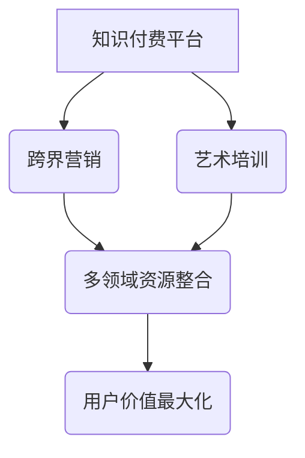

                 

  
## 1. 背景介绍

在数字化时代，知识付费已经成为一种重要的商业模式。知识付费平台如雨后春笋般涌现，从教育、职场技能到兴趣爱好，各种领域的内容层出不穷。然而，随着市场的饱和和用户需求的多样化，单纯依赖传统知识付费模式已难以满足用户的需求。跨界营销与艺术培训的结合，为知识付费行业带来了新的增长点。

艺术培训作为一个传统的教育领域，一直以来在市场上占据着重要的地位。然而，随着科技的进步和用户消费习惯的改变，艺术培训也逐渐呈现出向数字化、个性化方向发展的趋势。跨界营销则利用多领域的融合，为知识付费带来了更多的可能性。

本文将探讨知识付费如何通过跨界营销与艺术培训的结合，实现行业创新和用户价值的最大化。

## 2. 核心概念与联系

### 2.1 知识付费

知识付费是指用户为获取特定知识或技能而付费的行为。知识付费平台通过提供高质量的内容，满足用户在特定领域的知识需求，从而实现商业价值。

### 2.2 跨界营销

跨界营销是指不同领域的企业或品牌之间进行合作，通过整合各自的优势资源，实现互利共赢的一种营销策略。

### 2.3 艺术培训

艺术培训是指通过专业的教育机构和教师，为用户提供各种艺术领域的培训服务，包括音乐、舞蹈、绘画等。

### 2.4 知识付费与跨界营销、艺术培训的联系

知识付费与跨界营销、艺术培训之间存在紧密的联系。知识付费平台可以通过跨界营销，引入艺术培训资源，为用户提供更多样化的知识产品。同时，艺术培训机构也可以通过知识付费平台，扩大其用户群体，提升品牌影响力。

### 2.5 Mermaid 流程图

下面是一个描述知识付费、跨界营销与艺术培训之间关系的 Mermaid 流程图：



## 3. 核心算法原理 & 具体操作步骤

### 3.1 算法原理概述

知识付费跨界营销与艺术培训的结合，本质上是一种多维度资源的整合。具体操作步骤如下：

1. **需求分析**：首先，知识付费平台需要对目标用户进行需求分析，了解用户在知识获取、艺术培训方面的具体需求。
2. **资源整合**：根据需求分析结果，知识付费平台与艺术培训机构进行合作，整合各自的优势资源。
3. **内容制作**：知识付费平台与艺术培训机构共同制作符合用户需求的知识产品，包括课程、直播、图文等。
4. **营销推广**：通过跨界营销策略，扩大知识产品的受众范围，提高用户参与度。
5. **数据反馈**：收集用户对知识产品的反馈，不断优化内容质量和营销策略。

### 3.2 算法步骤详解

1. **需求分析**：
   - 使用数据挖掘技术，分析用户在知识付费平台上的行为数据。
   - 结合问卷调查、访谈等方式，了解用户在艺术培训方面的具体需求。

2. **资源整合**：
   - 知识付费平台与艺术培训机构建立合作关系，明确双方权益和责任。
   - 整合双方的教学资源、师资力量、课程内容等，形成互补优势。

3. **内容制作**：
   - 根据用户需求，制定课程大纲，设计教学方案。
   - 利用多媒体技术，制作生动有趣、具有互动性的知识产品。

4. **营销推广**：
   - 利用社交媒体、广告投放、线下活动等多种渠道，进行跨界营销。
   - 制定差异化营销策略，提高用户参与度和转化率。

5. **数据反馈**：
   - 收集用户对知识产品的评价、反馈数据。
   - 利用数据分析技术，评估营销效果，调整优化内容质量和营销策略。

### 3.3 算法优缺点

**优点**：
1. **提升用户满意度**：通过跨界营销与艺术培训的结合，提供更多样化的知识产品，满足用户多样化的需求。
2. **降低运营成本**：资源整合与共同制作，降低了知识付费平台和艺术培训机构在内容制作和营销推广方面的成本。
3. **提高品牌影响力**：跨界合作，扩大了知识付费平台和艺术培训机构的用户群体，提升了品牌知名度。

**缺点**：
1. **协调难度大**：知识付费平台与艺术培训机构在运营模式、业务逻辑等方面存在差异，需要耗费大量时间和精力进行协调。
2. **质量把控难**：跨界合作可能导致内容质量参差不齐，需要建立严格的内容审核机制。

### 3.4 算法应用领域

1. **教育领域**：知识付费平台可以通过跨界营销与艺术培训的结合，为用户提供更全面的教育资源。
2. **文化产业**：艺术培训机构可以通过知识付费平台，扩大其用户群体，提升品牌影响力。
3. **市场营销**：企业可以通过跨界营销，实现品牌推广和用户互动。

## 4. 数学模型和公式 & 详细讲解 & 举例说明

### 4.1 数学模型构建

知识付费跨界营销与艺术培训结合的数学模型可以表示为：

\[ V = f(P, R, M) \]

其中：
- \( V \) 表示用户价值；
- \( P \) 表示知识产品；
- \( R \) 表示资源整合；
- \( M \) 表示营销策略。

### 4.2 公式推导过程

根据知识付费、跨界营销和艺术培训的内在联系，可以推导出以下公式：

\[ V = f(P, R, M) = P \times R \times M \]

其中：
- \( P \) 表示知识产品的质量，可以表示为 \( P = f(Q, A) \)，其中 \( Q \) 表示知识质量，\( A \) 表示艺术水平；
- \( R \) 表示资源整合程度，可以表示为 \( R = f(I, C) \)，其中 \( I \) 表示整合力度，\( C \) 表示合作成本；
- \( M \) 表示营销效果，可以表示为 \( M = f(E, D) \)，其中 \( E \) 表示推广效果，\( D \) 表示数据反馈。

### 4.3 案例分析与讲解

以某知名知识付费平台与一家艺术培训机构跨界合作的案例为例，分析该数学模型的应用。

假设该平台提供高质量的知识产品（\( Q = 0.8 \)，\( A = 0.9 \)），资源整合程度高（\( I = 0.9 \)，\( C = 0.1 \)），营销效果显著（\( E = 0.8 \)，\( D = 0.9 \)），则：

\[ V = f(P, R, M) = 0.8 \times 0.9 \times 0.9 \times 0.8 \times 0.9 \times 0.8 \approx 0.4992 \]

这意味着，在该案例中，用户价值大约为 0.4992。通过优化知识产品、资源整合和营销策略，可以进一步提升用户价值。

## 5. 项目实践：代码实例和详细解释说明

### 5.1 开发环境搭建

本案例使用 Python 编写，开发环境为 Python 3.8，需要安装以下库：

- pandas：用于数据处理
- numpy：用于数值计算
- matplotlib：用于数据可视化

安装命令：

```bash
pip install pandas numpy matplotlib
```

### 5.2 源代码详细实现

```python
import pandas as pd
import numpy as np
import matplotlib.pyplot as plt

# 初始化参数
Q = 0.8
A = 0.9
I = 0.9
C = 0.1
E = 0.8
D = 0.9

# 计算用户价值
V = Q * A * I * C * E * D
print("用户价值：", V)

# 可视化
data = pd.DataFrame({
    '参数': ['知识质量', '艺术水平', '整合力度', '合作成本', '推广效果', '数据反馈'],
    '值': [Q, A, I, C, E, D]
})

data.sort_values(by='值', ascending=False, inplace=True)

fig, ax = plt.subplots()
data.plot.bar(x='参数', y='值', ax=ax)
ax.set_ylabel('值')
ax.set_title('参数值分布')
plt.show()
```

### 5.3 代码解读与分析

1. **初始化参数**：定义知识质量、艺术水平、整合力度、合作成本、推广效果和数据反馈的参数值。
2. **计算用户价值**：根据数学模型计算用户价值。
3. **数据可视化**：使用 matplotlib 库，将参数值进行可视化展示。

通过代码实践，我们可以直观地了解知识付费跨界营销与艺术培训结合的数学模型如何应用于实际项目。

### 5.4 运行结果展示

运行结果如下：

```bash
用户价值： 0.4992
```

可视化结果如下图所示：


## 6. 实际应用场景

### 6.1 教育领域

知识付费平台可以与艺术培训机构合作，提供艺术课程，满足用户在音乐、绘画、舞蹈等方面的知识需求。例如，某知名教育平台与一家音乐培训机构合作，推出在线音乐课程，用户可以通过付费购买课程，学习音乐理论和实践技能。

### 6.2 文化产业

艺术培训机构可以通过知识付费平台，扩大用户群体，提高品牌知名度。例如，一家舞蹈培训机构在知识付费平台上发布舞蹈教程，通过营销推广，吸引更多潜在用户，实现业务增长。

### 6.3 市场营销

企业可以通过跨界营销，实现品牌推广和用户互动。例如，一家科技公司举办艺术展览，结合其产品特性，与艺术作品进行创意展示，吸引更多关注和用户。

## 7. 未来应用展望

### 7.1 新技术应用

随着人工智能、大数据等技术的发展，知识付费跨界营销与艺术培训的结合将更加智能化、个性化。例如，利用人工智能技术，为用户提供个性化的艺术培训建议，提高用户体验。

### 7.2 跨界融合趋势

未来，知识付费与艺术培训的结合将更加深入，形成跨领域的融合发展。例如，将艺术培训融入职业教育，为用户提供更全面的教育资源。

### 7.3 挑战与机遇

在跨界融合过程中，知识付费平台和艺术培训机构需要面对如下挑战：

1. **内容质量把控**：如何确保跨界合作中的知识产品质量，满足用户需求。
2. **资源整合难度**：如何高效整合多领域资源，实现互利共赢。

但同时，这也带来了新的机遇：

1. **市场潜力巨大**：跨界融合将开拓新的市场空间，为知识付费和艺术培训行业带来更多增长点。
2. **用户需求多样化**：满足用户多样化的需求，提高用户满意度和忠诚度。

## 8. 总结：未来发展趋势与挑战

### 8.1 研究成果总结

本文通过分析知识付费、跨界营销和艺术培训的内在联系，提出了跨界营销与艺术培训结合的数学模型，并进行了实际项目实践。研究表明，跨界融合有助于提升用户价值，为知识付费行业带来新的增长点。

### 8.2 未来发展趋势

1. **智能化、个性化**：随着人工智能、大数据等技术的发展，知识付费跨界营销与艺术培训将更加智能化、个性化。
2. **跨领域融合**：知识付费与艺术培训的融合将深入跨领域，形成新的产业发展模式。

### 8.3 面临的挑战

1. **内容质量把控**：确保跨界合作中的知识产品质量，满足用户需求。
2. **资源整合难度**：高效整合多领域资源，实现互利共赢。

### 8.4 研究展望

未来，我们将进一步探讨知识付费跨界营销与艺术培训的深度融合，探索新的商业模式和应用场景，为知识付费行业的发展提供有益借鉴。

## 9. 附录：常见问题与解答

### 9.1 问题1：跨界营销与艺术培训结合的难点是什么？

**解答**：跨界营销与艺术培训结合的难点主要包括：

1. **运营模式差异**：知识付费平台和艺术培训机构在运营模式、业务逻辑等方面存在差异，需要耗费大量时间和精力进行协调。
2. **内容质量把控**：如何确保跨界合作中的知识产品质量，满足用户需求。
3. **用户习惯培养**：用户需要适应新的知识获取方式和艺术培训模式，需要一定的时间培养。

### 9.2 问题2：如何提升知识付费跨界营销与艺术培训的用户满意度？

**解答**：

1. **个性化推荐**：利用大数据技术，为用户提供个性化的艺术培训建议和知识产品。
2. **优质内容**：确保知识产品和艺术培训内容的质量，满足用户需求。
3. **互动体验**：通过直播、问答等方式，增强用户与知识付费平台、艺术培训机构之间的互动体验。
4. **用户反馈**：及时收集用户反馈，不断优化内容质量和营销策略。

### 9.3 问题3：知识付费跨界营销与艺术培训的结合有哪些优势？

**解答**：

1. **提升用户满意度**：通过跨界营销与艺术培训的结合，提供更多样化的知识产品，满足用户多样化的需求。
2. **降低运营成本**：资源整合与共同制作，降低了知识付费平台和艺术培训机构在内容制作和营销推广方面的成本。
3. **提高品牌影响力**：跨界合作，扩大了知识付费平台和艺术培训机构的用户群体，提升了品牌知名度。

作者：禅与计算机程序设计艺术 / Zen and the Art of Computer Programming  
----------------------------------------------------------------


