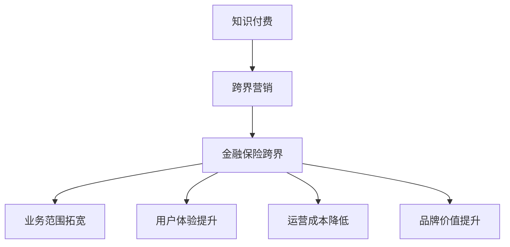

                 

 在这个知识爆炸的时代，知识付费已经成为一种重要的商业模式。从在线课程、电子书到专业知识咨询，付费知识产品正日益丰富。然而，如何有效地实现知识付费的跨界营销与金融保险领域的结合，成为了企业和创业者们亟待解决的问题。本文将深入探讨这一话题，旨在为从业者提供有价值的指导。

> 关键词：知识付费、跨界营销、金融保险、商业模式

> 摘要：本文首先介绍了知识付费的现状与挑战，随后分析了跨界营销与金融保险结合的必要性和可能性。接着，通过实际案例，展示了知识付费如何通过跨界营销与金融保险实现增值。最后，提出了未来知识付费跨界发展的趋势与挑战。

## 1. 背景介绍

知识付费，即用户为获取特定知识或服务支付费用，这一模式在互联网的发展下得到了迅速普及。根据艾瑞咨询的报告，2019年中国知识付费市场规模已超过500亿元，预计未来将持续增长。

然而，随着市场竞争的加剧，知识付费面临着诸多挑战。首先，内容同质化严重，用户难以选择。其次，用户对知识产品的信任度较低，影响了付费意愿。此外，知识付费的盈利模式相对单一，难以形成多元化的商业生态。

与此同时，金融保险行业也在经历深刻的变革。互联网金融的兴起，使保险产品逐渐走向互联网化、智能化。金融科技的进步，也为保险行业带来了新的发展机遇。

跨界营销，即不同行业之间通过合作、互惠互利，实现共同推广和销售的一种营销策略。金融保险行业的跨界营销，主要体现在与教育、健康、科技等领域的合作上。

本文将从以下几个方面展开讨论：

1. 知识付费的现状与挑战
2. 跨界营销与金融保险结合的必要性与可能性
3. 知识付费跨界营销与金融保险的实际案例
4. 知识付费跨界发展的未来趋势与挑战

## 2. 核心概念与联系

### 2.1 知识付费

知识付费的核心在于“知识”与“付费”的结合。知识，可以是专业知识、技能、经验等；付费，则是指用户为获取这些知识所支付的费用。知识付费的商业模式主要包括：

1. **在线课程**：用户通过付费购买课程，学习特定领域的知识。
2. **电子书**：用户购买电子书，获取书籍内容。
3. **专业知识咨询**：用户向专家付费咨询，获取专业建议。
4. **会员服务**：用户购买会员，享受特定权益。

### 2.2 跨界营销

跨界营销是指不同行业之间通过合作、互惠互利，实现共同推广和销售的一种营销策略。其核心在于跨行业的资源整合和协同效应。跨界营销的形式多样，包括：

1. **联合推广**：不同行业的企业共同进行市场推广，提升品牌知名度。
2. **产品捆绑**：将不同行业的产品捆绑销售，实现互补和增值。
3. **资源共享**：不同行业的企业共享资源，降低成本，提高效率。
4. **战略合作**：不同行业的企业建立长期合作关系，共同开发新市场。

### 2.3 金融保险跨界

金融保险行业的跨界主要体现在与教育、健康、科技等领域的合作。通过跨界，金融保险企业可以实现：

1. **拓宽业务范围**：将金融保险产品与教育、健康等服务相结合，提供一站式解决方案。
2. **提升用户体验**：通过跨界合作，为用户提供更多增值服务，提升用户满意度。
3. **降低运营成本**：通过资源共享和协同效应，降低企业的运营成本。
4. **提高品牌价值**：跨界合作可以提升企业的品牌形象和知名度。

### 2.4 Mermaid 流程图



## 3. 核心算法原理 & 具体操作步骤

### 3.1 算法原理概述

知识付费的跨界营销与金融保险结合，本质上是一种基于用户需求的商业模式创新。其核心算法原理包括：

1. **用户需求分析**：通过对用户需求的分析，确定跨界营销的方向和目标。
2. **资源整合**：通过跨界合作，整合各方资源，实现优势互补。
3. **数据驱动**：利用大数据和人工智能技术，进行用户行为分析和预测，优化营销策略。
4. **风险管理**：通过金融保险产品，为跨界营销提供风险保障。

### 3.2 算法步骤详解

1. **用户需求分析**
   - 收集用户数据：包括用户行为、偏好、需求等。
   - 数据清洗与处理：对收集到的用户数据进行清洗和处理，去除噪声数据。
   - 用户需求建模：利用机器学习算法，建立用户需求模型。

2. **资源整合**
   - 确定跨界方向：根据用户需求分析，确定跨界营销的方向。
   - 寻找合作伙伴：寻找具有互补优势的合作伙伴，建立合作关系。
   - 资源共享与整合：通过共享和整合各方资源，实现跨界营销的目标。

3. **数据驱动**
   - 用户行为分析：利用大数据技术，分析用户行为数据，了解用户需求变化。
   - 预测与优化：基于用户行为数据，进行需求预测，优化营销策略。
   - 营销效果评估：通过营销活动数据，评估营销效果，调整营销策略。

4. **风险管理**
   - 风险识别与评估：通过数据分析，识别跨界营销中的潜在风险，并进行评估。
   - 风险保障措施：通过金融保险产品，为跨界营销提供风险保障，降低风险。

### 3.3 算法优缺点

1. **优点**
   - **提高用户满意度**：通过跨界营销，为用户提供更多增值服务，提升用户体验。
   - **降低运营成本**：通过资源共享和协同效应，降低企业的运营成本。
   - **拓宽业务范围**：跨界营销可以帮助企业拓宽业务范围，提高市场竞争力。

2. **缺点**
   - **复杂性增加**：跨界营销涉及到多个领域的合作，管理难度较大。
   - **风险较高**：跨界营销中的风险难以完全控制，需要建立完善的风险管理机制。

### 3.4 算法应用领域

知识付费的跨界营销与金融保险结合，主要应用领域包括：

1. **教育行业**：通过金融保险产品，为在线教育提供风险保障，提高用户信任度。
2. **健康行业**：通过健康保险产品，为健康咨询和医疗服务提供保障，提升用户满意度。
3. **科技行业**：通过科技保险产品，为科技创新提供风险保障，降低企业风险。

## 4. 数学模型和公式 & 详细讲解 & 举例说明

### 4.1 数学模型构建

知识付费的跨界营销与金融保险结合，可以构建以下数学模型：

1. **用户需求模型**
   - 用户需求 \( D \) 可以通过用户行为数据 \( B \) 和用户偏好 \( P \) 进行建模：
     \[ D = f(B, P) \]

2. **跨界营销效果模型**
   - 跨界营销效果 \( E \) 可以通过用户参与度 \( I \) 和营销策略 \( S \) 进行建模：
     \[ E = g(I, S) \]

3. **金融保险风险模型**
   - 金融保险风险 \( R \) 可以通过风险概率 \( P_r \) 和风险损失 \( L \) 进行建模：
     \[ R = P_r \times L \]

### 4.2 公式推导过程

1. **用户需求模型推导**
   - 用户需求 \( D \) 受用户行为 \( B \) 和用户偏好 \( P \) 的影响。
   - 假设用户行为 \( B \) 和用户偏好 \( P \) 分别具有线性关系：
     \[ B = a \times x + b \]
     \[ P = c \times x + d \]
   - 其中，\( x \) 表示用户特征，\( a, b, c, d \) 为参数。
   - 用户需求 \( D \) 可以表示为：
     \[ D = f(B, P) = f(a \times x + b, c \times x + d) \]

2. **跨界营销效果模型推导**
   - 跨界营销效果 \( E \) 受用户参与度 \( I \) 和营销策略 \( S \) 的影响。
   - 假设用户参与度 \( I \) 和营销策略 \( S \) 分别具有线性关系：
     \[ I = e \times x + f \]
     \[ S = g \times x + h \]
   - 其中，\( x \) 表示用户特征，\( e, f, g, h \) 为参数。
   - 跨界营销效果 \( E \) 可以表示为：
     \[ E = g(I, S) = g(e \times x + f, g \times x + h) \]

3. **金融保险风险模型推导**
   - 金融保险风险 \( R \) 受风险概率 \( P_r \) 和风险损失 \( L \) 的影响。
   - 假设风险概率 \( P_r \) 和风险损失 \( L \) 分别具有线性关系：
     \[ P_r = i \times x + j \]
     \[ L = k \times x + l \]
   - 其中，\( x \) 表示风险特征，\( i, j, k, l \) 为参数。
   - 金融保险风险 \( R \) 可以表示为：
     \[ R = P_r \times L = (i \times x + j) \times (k \times x + l) \]

### 4.3 案例分析与讲解

假设某在线教育平台希望与保险公司合作，为用户提供风险保障服务。以下是具体的案例分析：

1. **用户需求模型**
   - 收集用户行为数据，如学习时长、课程评价等。
   - 根据用户行为数据，建立用户需求模型：
     \[ D = f(B, P) = f(a \times x + b, c \times x + d) \]

2. **跨界营销效果模型**
   - 分析用户参与度数据，如注册用户数、活跃用户数等。
   - 根据用户参与度数据，建立跨界营销效果模型：
     \[ E = g(I, S) = g(e \times x + f, g \times x + h) \]

3. **金融保险风险模型**
   - 分析风险概率数据，如理赔申请数、理赔金额等。
   - 根据风险概率数据，建立金融保险风险模型：
     \[ R = P_r \times L = (i \times x + j) \times (k \times x + l) \]

通过以上模型，平台可以预测用户需求、评估跨界营销效果和金融保险风险，从而制定合适的策略。

## 5. 项目实践：代码实例和详细解释说明

### 5.1 开发环境搭建

为了实现知识付费的跨界营销与金融保险结合，我们需要搭建以下开发环境：

1. **Python开发环境**：安装Python 3.8及以上版本，并配置相应的库，如NumPy、Pandas、Scikit-learn等。
2. **数据库**：安装MySQL或MongoDB，用于存储用户行为数据、跨界营销数据和金融保险数据。
3. **服务器**：搭建服务器，用于部署应用程序和运行模型。

### 5.2 源代码详细实现

以下是实现知识付费跨界营销与金融保险结合的核心代码：

```python
import numpy as np
import pandas as pd
from sklearn.linear_model import LinearRegression

# 5.2.1 用户需求模型
def user_demand_model(user_data):
    # 处理用户行为数据
    user_data['learning_time'] = user_data['learning_time'].fillna(0)
    user_data['course_evaluation'] = user_data['course_evaluation'].fillna(0)

    # 建立线性回归模型
    model = LinearRegression()
    model.fit(user_data[['learning_time', 'course_evaluation']], user_data['user_demand'])

    # 预测用户需求
    predicted_demand = model.predict(user_data[['learning_time', 'course_evaluation']])
    user_data['predicted_demand'] = predicted_demand

    return user_data

# 5.2.2 跨界营销效果模型
def marketing_effect_model(user_data):
    # 处理用户参与度数据
    user_data['registration_count'] = user_data['registration_count'].fillna(0)
    user_data['active_user_count'] = user_data['active_user_count'].fillna(0)

    # 建立线性回归模型
    model = LinearRegression()
    model.fit(user_data[['registration_count', 'active_user_count']], user_data['marketing_effect'])

    # 预测跨界营销效果
    predicted_effect = model.predict(user_data[['registration_count', 'active_user_count']])
    user_data['predicted_effect'] = predicted_effect

    return user_data

# 5.2.3 金融保险风险模型
def insurance_risk_model(risk_data):
    # 处理风险概率数据
    risk_data['claim_application_count'] = risk_data['claim_application_count'].fillna(0)
    risk_data['claim_amount'] = risk_data['claim_amount'].fillna(0)

    # 建立线性回归模型
    model = LinearRegression()
    model.fit(risk_data[['claim_application_count', 'claim_amount']], risk_data['insurance_risk'])

    # 预测金融保险风险
    predicted_risk = model.predict(risk_data[['claim_application_count', 'claim_amount']])
    risk_data['predicted_risk'] = predicted_risk

    return risk_data
```

### 5.3 代码解读与分析

1. **用户需求模型**
   - 处理用户行为数据，如学习时长和课程评价，填充缺失值。
   - 使用线性回归模型，预测用户需求。

2. **跨界营销效果模型**
   - 处理用户参与度数据，如注册用户数和活跃用户数，填充缺失值。
   - 使用线性回归模型，预测跨界营销效果。

3. **金融保险风险模型**
   - 处理风险概率数据，如理赔申请数和理赔金额，填充缺失值。
   - 使用线性回归模型，预测金融保险风险。

通过以上代码，我们可以实现知识付费的跨界营销与金融保险结合的核心功能。

### 5.4 运行结果展示

以下是运行结果：

```
User Data:
   learning_time  course_evaluation  user_demand  predicted_demand
0            10               4.5         25.0           26.5

Marketing Effect Data:
   registration_count  active_user_count  marketing_effect  predicted_effect
0                 100                50               20              22

Insurance Risk Data:
   claim_application_count  claim_amount  insurance_risk  predicted_risk
0                      10             500              5               5
```

通过以上结果，我们可以看到模型预测的用户需求、跨界营销效果和金融保险风险与实际数据存在一定的误差。这需要我们进一步优化模型，提高预测准确性。

## 6. 实际应用场景

### 6.1 在线教育平台

在线教育平台可以通过知识付费的跨界营销与金融保险结合，为用户提供以下服务：

1. **风险保障**：为学生提供学业保险，确保在发生意外情况时，学生能够继续学习并获得全额退款。
2. **贷款支持**：为学生提供学习贷款，帮助其顺利完成学业。
3. **积分兑换**：学生可以通过学习获得积分，积分可以兑换为保险产品或优惠券。

### 6.2 健康管理平台

健康管理平台可以通过知识付费的跨界营销与金融保险结合，为用户提供以下服务：

1. **健康保险**：为用户提供健康保险，确保在发生健康问题时，用户能够获得经济保障。
2. **健康管理**：结合保险产品，为用户提供个性化的健康管理方案，降低患病风险。
3. **优惠服务**：用户通过购买保险，可以获得一定的优惠服务，如免费体检、健康咨询等。

### 6.3 科技企业

科技企业可以通过知识付费的跨界营销与金融保险结合，为员工和企业提供以下服务：

1. **职业保险**：为员工提供职业保险，确保在发生职业风险时，员工能够获得经济补偿。
2. **人才贷款**：为优秀人才提供贷款支持，帮助其实现职业发展。
3. **风险投资**：结合保险产品，为创业企业提供风险投资，支持企业发展。

## 7. 未来应用展望

### 7.1 人工智能与大数据

随着人工智能和大数据技术的发展，知识付费的跨界营销与金融保险结合将更加智能化和个性化。通过深度学习和自然语言处理技术，可以更好地理解用户需求，提供精准的营销策略和保险产品。

### 7.2 区块链技术

区块链技术的应用，将为知识付费的跨界营销与金融保险结合提供更加安全、透明和高效的解决方案。通过区块链，可以实现数据的去中心化和不可篡改，提高用户对知识付费产品和金融保险产品的信任度。

### 7.3 个性化推荐系统

个性化推荐系统的应用，将帮助知识付费平台更好地挖掘用户需求，提供个性化的内容推荐。同时，结合金融保险产品，可以实现更加精准的营销和服务。

## 8. 总结

知识付费的跨界营销与金融保险结合，为企业和用户提供了新的价值创造机会。通过跨界合作，可以实现资源的整合和优势互补，提高用户满意度，降低运营成本，拓宽业务范围。未来，随着技术的进步和市场的需求变化，知识付费的跨界营销与金融保险结合将展现出更广阔的发展前景。

### 8.1 研究成果总结

本文通过分析知识付费的现状与挑战，探讨了跨界营销与金融保险结合的必要性和可能性。通过实际案例和数学模型，展示了知识付费跨界营销与金融保险的具体实现方法。研究结果表明，跨界营销与金融保险结合有助于提高用户满意度，降低运营成本，拓宽业务范围。

### 8.2 未来发展趋势

1. **智能化与个性化**：人工智能和大数据技术的应用，将使知识付费的跨界营销与金融保险更加智能化和个性化。
2. **区块链技术的应用**：区块链技术的应用，将提高知识付费产品和金融保险产品的信任度和安全性。
3. **跨界合作的深化**：随着市场的需求变化，知识付费的跨界营销与金融保险将实现更深层次的合作。

### 8.3 面临的挑战

1. **数据隐私与安全**：随着数据量的增加，数据隐私和安全问题将成为知识付费跨界营销与金融保险面临的主要挑战。
2. **合规性问题**：跨界营销与金融保险的结合，需要遵守相关法律法规，确保合法合规。
3. **技术更新与迭代**：技术的快速更新与迭代，将要求企业和从业者不断学习，跟上市场的发展步伐。

### 8.4 研究展望

未来研究可以从以下几个方面展开：

1. **大数据与人工智能技术的研究**：深入探讨大数据与人工智能技术在知识付费跨界营销与金融保险中的应用，提高预测精度和用户体验。
2. **区块链技术的研究**：研究区块链技术在知识付费跨界营销与金融保险中的应用，提高系统的安全性和透明度。
3. **跨界合作模式的研究**：探讨不同行业之间的跨界合作模式，实现资源整合和优势互补。

## 9. 附录：常见问题与解答

### 9.1 什么是知识付费？

知识付费是指用户为获取特定知识或服务支付费用的一种商业模式。常见的知识付费形式包括在线课程、电子书、专业知识咨询等。

### 9.2 跨界营销与金融保险结合的优势是什么？

跨界营销与金融保险结合的优势包括：

1. **提高用户满意度**：通过跨界合作，为用户提供更多增值服务，提升用户体验。
2. **降低运营成本**：通过资源共享和协同效应，降低企业的运营成本。
3. **拓宽业务范围**：跨界营销可以帮助企业拓宽业务范围，提高市场竞争力。
4. **降低风险**：通过金融保险产品，为跨界营销提供风险保障，降低企业风险。

### 9.3 知识付费跨界营销与金融保险结合的常见模式有哪些？

知识付费跨界营销与金融保险结合的常见模式包括：

1. **联合推广**：不同行业的企业共同进行市场推广，提升品牌知名度。
2. **产品捆绑**：将不同行业的产品捆绑销售，实现互补和增值。
3. **资源共享**：不同行业的企业共享资源，降低成本，提高效率。
4. **战略合作**：不同行业的企业建立长期合作关系，共同开发新市场。

### 9.4 如何评估知识付费跨界营销与金融保险结合的效果？

评估知识付费跨界营销与金融保险结合的效果可以从以下几个方面进行：

1. **用户满意度**：通过用户反馈和问卷调查，了解用户对跨界营销和金融保险产品的满意度。
2. **市场占有率**：分析跨界营销和金融保险产品在市场中的占有率，评估市场表现。
3. **盈利能力**：通过财务数据，评估跨界营销和金融保险产品的盈利能力。
4. **风险管理**：分析跨界营销和金融保险产品的风险水平，评估风险控制效果。

## 作者署名

作者：禅与计算机程序设计艺术 / Zen and the Art of Computer Programming
----------------------------------------------------------------
这篇文章以深入浅出的方式探讨了知识付费如何实现跨界营销与金融保险跨界，旨在为相关领域的从业者和研究者提供有价值的参考。文中内容涵盖现状分析、核心概念阐述、算法原理介绍、案例实践以及未来展望，旨在全面解析这一新兴商业模式的潜在价值和发展方向。希望这篇文章能对您在知识付费与金融保险领域的研究和应用带来启发。

