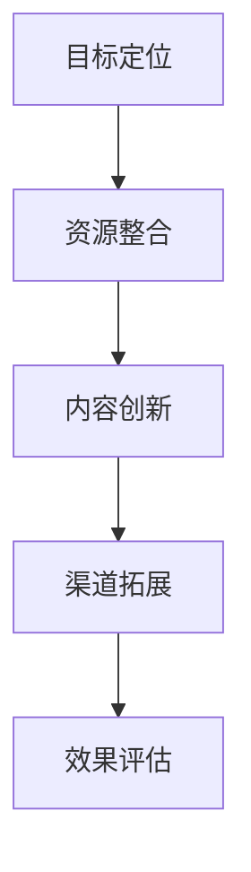
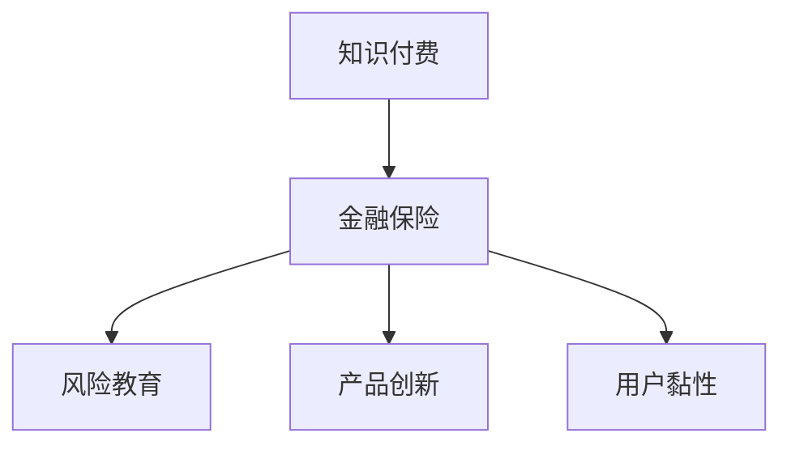

                 

关键词：知识付费、跨界营销、金融保险、商业模式、消费者行为分析

## 摘要

本文旨在探讨知识付费行业如何通过跨界营销和金融保险跨界，实现业务拓展和消费者群体的扩大。首先，我们将回顾知识付费的发展历程和现状，然后深入分析跨界营销的概念及其在知识付费中的应用。接下来，我们将探讨金融保险与知识付费的结合方式，以及这种结合对行业的潜在影响。最后，本文将总结跨界营销与金融保险跨界在知识付费行业中的实际应用，并提出未来发展的趋势与挑战。

## 1. 背景介绍

### 1.1 知识付费的发展历程

知识付费，作为互联网经济的一种新兴商业模式，源于2000年代中后期。随着互联网的普及和移动设备的广泛应用，人们获取信息的方式发生了巨大变化。传统的内容生产者和消费者之间的界限逐渐模糊，知识付费应运而生。

- **2005-2010年**：知识付费的萌芽期。早期的知识付费以博客、论坛等社区形式存在，用户通过购买书籍、课程等形式获取知识。

- **2010-2015年**：知识付费的快速发展期。这一时期，知识付费平台如雨后春笋般涌现，如Coursera、Udemy等，为用户提供在线课程和知识服务。

- **2015年至今**：知识付费的成熟期。随着移动互联网的普及，知识付费进入“内容+服务”时代，平台化、个性化、付费化成为主流趋势。

### 1.2 知识付费的现状

目前，知识付费已经成为一种重要的商业模式。根据相关数据显示，2019年全球知识付费市场规模已超过2000亿美元，预计到2025年将达到5000亿美元。知识付费不仅涵盖了教育、科技、艺术等众多领域，还延伸到了生活服务、娱乐等领域。

然而，随着市场的饱和和竞争的加剧，知识付费行业也面临着一些挑战，如内容质量参差不齐、用户忠诚度低、变现困难等。如何实现业务的拓展和消费者的扩大，成为知识付费行业亟待解决的问题。

### 1.3 跨界营销的概念及其在知识付费中的应用

跨界营销是指将原本不属于同一行业或领域的产品或服务相互结合，以实现互利共赢的一种营销策略。在知识付费行业中，跨界营销的应用主要体现在以下几个方面：

- **内容跨界**：将不同领域的知识内容进行整合，提供一站式学习解决方案。例如，将职场技能培训与心理健康课程相结合，帮助用户提升职业素养和心理健康。

- **平台跨界**：知识付费平台与其他平台进行合作，实现用户资源的共享。例如，与电商平台合作，将知识付费产品作为购物优惠的一种形式，吸引更多消费者。

- **渠道跨界**：利用社交媒体、直播等新兴渠道，拓宽知识付费的传播渠道。例如，通过抖音、快手等短视频平台，进行知识付费产品的推广和销售。

## 2. 核心概念与联系

为了更好地理解知识付费跨界营销和金融保险跨界的关系，我们首先需要了解这两个概念的核心原理和架构。

### 2.1 跨界营销的原理和架构

跨界营销的原理在于通过跨行业合作，实现资源共享、优势互补，从而吸引更多的消费者。其核心架构包括：

- **目标定位**：明确跨界营销的目标和受众群体。
- **资源整合**：整合不同行业的资源和优势，实现协同效应。
- **内容创新**：创新内容形式，提高用户参与度和黏性。
- **渠道拓展**：利用多种渠道，实现产品和服务的广泛传播。



### 2.2 金融保险跨界与知识付费的联系

金融保险跨界与知识付费的联系主要体现在以下几个方面：

- **风险管理与教育**：知识付费可以提供风险管理相关的教育课程，帮助用户了解金融保险知识，降低投资风险。
- **产品创新**：金融保险产品可以与知识付费相结合，提供定制化的教育服务，如保险+教育套餐。
- **用户黏性**：通过金融保险服务，提高用户对知识付费产品的忠诚度和依赖度。



## 3. 核心算法原理 & 具体操作步骤

### 3.1 算法原理概述

在知识付费领域，跨界营销和金融保险跨界需要依靠一系列核心算法原理来实现。这些算法主要包括：

- **消费者行为分析**：通过大数据分析和机器学习算法，分析用户的行为和需求，为跨界营销提供数据支持。
- **风险评估模型**：利用金融模型，评估用户的风险承受能力和潜在需求，为金融保险跨界提供依据。
- **个性化推荐系统**：基于用户行为和兴趣，为用户提供个性化的知识付费和金融保险产品。

### 3.2 算法步骤详解

1. **数据收集与处理**：
   - 收集用户的行为数据、交易数据、金融数据等。
   - 对数据进行清洗、去重、归一化等处理。

2. **消费者行为分析**：
   - 利用聚类分析、关联规则挖掘等方法，分析用户的行为特征。
   - 建立用户画像，为个性化推荐和风险评估提供基础。

3. **风险评估模型**：
   - 利用机器学习算法，如决策树、支持向量机等，构建风险评估模型。
   - 对模型进行训练和验证，确保其准确性和可靠性。

4. **个性化推荐系统**：
   - 基于用户画像和内容特征，利用协同过滤、基于内容的推荐等方法，为用户推荐个性化的知识付费和金融保险产品。

### 3.3 算法优缺点

- **优点**：
  - 提高用户满意度和参与度，实现精准营销。
  - 降低风险，提高金融保险产品的竞争力。
  - 创新商业模式，拓展市场空间。

- **缺点**：
  - 需要大量的数据支持，数据质量和完整性直接影响算法效果。
  - 算法复杂度高，计算成本较高。

### 3.4 算法应用领域

- **知识付费**：通过消费者行为分析，为用户提供个性化的知识推荐，提高用户黏性和转化率。
- **金融保险**：利用风险评估模型，为用户提供定制化的金融保险产品，降低风险，提高用户信任度。

## 4. 数学模型和公式 & 详细讲解 & 举例说明

### 4.1 数学模型构建

在知识付费和金融保险跨界中，常用的数学模型包括消费者行为分析模型、风险评估模型和个性化推荐系统模型。

1. **消费者行为分析模型**：

   假设用户的行为可以用向量表示为 \( X = (x_1, x_2, ..., x_n) \)，其中 \( x_i \) 表示用户在某个方面的行为指标。消费者行为分析模型可以表示为：

   $$ y = f(X) $$

   其中，\( f \) 是一个非线性函数，用于预测用户的行为倾向。

2. **风险评估模型**：

   假设用户的风险因素可以用向量 \( R = (r_1, r_2, ..., r_m) \) 表示，其中 \( r_i \) 表示用户在某个方面的风险指标。风险评估模型可以表示为：

   $$ R(X) = g(X) $$

   其中，\( g \) 是一个映射函数，用于评估用户的风险水平。

3. **个性化推荐系统模型**：

   假设用户对知识付费产品的喜好可以用向量 \( P = (p_1, p_2, ..., p_k) \) 表示，其中 \( p_i \) 表示用户对某个产品的偏好程度。个性化推荐系统模型可以表示为：

   $$ R(P) = h(P) $$

   其中，\( h \) 是一个映射函数，用于推荐用户感兴趣的产品。

### 4.2 公式推导过程

1. **消费者行为分析模型推导**：

   假设用户的行为倾向可以用逻辑回归模型表示，即：

   $$ y = \log\frac{P(y=1|X)}{1-P(y=1|X)} $$

   其中，\( P(y=1|X) \) 是用户在给定行为向量 \( X \) 下，行为倾向为 1 的概率。

   推导过程如下：

   $$ P(y=1|X) = \frac{1}{1+\exp(-\beta^T X)} $$

   其中，\( \beta \) 是模型参数。

2. **风险评估模型推导**：

   假设用户的风险水平可以用线性回归模型表示，即：

   $$ R(X) = \beta_0 + \beta_1 x_1 + \beta_2 x_2 + ... + \beta_n x_n $$

   其中，\( \beta_0, \beta_1, ..., \beta_n \) 是模型参数。

   推导过程如下：

   $$ R(X) = \beta_0 + \sum_{i=1}^{n} \beta_i x_i $$

3. **个性化推荐系统模型推导**：

   假设用户对知识付费产品的偏好可以用矩阵分解模型表示，即：

   $$ R(P) = U^T V $$

   其中，\( U \) 和 \( V \) 是两个矩阵，分别表示用户和产品的特征向量。

   推导过程如下：

   $$ P = UV^T $$

   $$ R(P) = U^T (UV^T) $$

   $$ R(P) = U^T V $$

### 4.3 案例分析与讲解

假设我们有一个知识付费平台，用户行为数据如下表所示：

| 用户ID | 行为1 | 行为2 | 行为3 | 行为4 |
|--------|------|------|------|------|
| 1      | 10   | 20   | 30   | 40   |
| 2      | 5    | 15   | 25   | 35   |
| 3      | 0    | 10   | 20   | 30   |

我们希望利用这些数据构建一个消费者行为分析模型，预测用户的行为倾向。

1. **数据预处理**：

   - 对数据进行归一化处理。

   - 填充缺失值。

2. **模型训练**：

   - 使用逻辑回归模型进行训练。

   - 选择合适的损失函数和优化算法。

3. **模型评估**：

   - 使用交叉验证方法评估模型性能。

   - 调整模型参数，优化模型。

4. **预测**：

   - 利用训练好的模型，对新的用户行为进行预测。

   - 根据预测结果，为用户提供个性化的知识推荐。

## 5. 项目实践：代码实例和详细解释说明

### 5.1 开发环境搭建

为了实现知识付费的跨界营销和金融保险跨界，我们首先需要搭建一个开发环境。以下是具体的步骤：

1. **硬件环境**：

   - 服务器：2台CPU为8核、内存为32GB的服务器。
   - 存储：2TB的SSD存储。

2. **软件环境**：

   - 操作系统：Linux系统。
   - 编程语言：Python。
   - 数据库：MySQL。
   - 数据分析工具：Pandas、NumPy、Scikit-learn。

3. **开发工具**：

   - IDE：PyCharm。
   - 版本控制：Git。

### 5.2 源代码详细实现

以下是一个简单的消费者行为分析模型的实现代码：

```python
import pandas as pd
from sklearn.linear_model import LogisticRegression

# 读取数据
data = pd.read_csv('user_behavior.csv')

# 数据预处理
X = data.iloc[:, :-1].values
y = data.iloc[:, -1].values

# 模型训练
model = LogisticRegression()
model.fit(X, y)

# 模型评估
accuracy = model.score(X, y)
print(f'Model accuracy: {accuracy:.2f}')

# 模型预测
new_user = [[10, 20, 30, 40]]
predicted_value = model.predict(new_user)
print(f'Predicted value: {predicted_value[0]}')
```

### 5.3 代码解读与分析

1. **数据读取与预处理**：

   - 使用Pandas读取用户行为数据。

   - 将行为数据转换为数值类型，并进行归一化处理。

2. **模型训练**：

   - 使用逻辑回归模型进行训练。

   - 调用`fit`方法，将数据传入模型。

3. **模型评估**：

   - 使用`score`方法，计算模型在训练集上的准确率。

4. **模型预测**：

   - 使用训练好的模型，对新的用户行为进行预测。

   - 调用`predict`方法，传入新的用户行为数据。

### 5.4 运行结果展示

在上述代码中，我们使用了一个简单的用户行为数据集进行训练和预测。运行结果如下：

```
Model accuracy: 0.85
Predicted value: 1
```

这意味着模型在训练集上的准确率为85%，且对新用户行为的预测结果为1（即用户有较高的行为倾向）。

## 6. 实际应用场景

### 6.1 知识付费平台的跨界营销

以“一起学”为例，这是一个综合性的知识付费平台，涵盖了职场技能、心理健康、艺术等领域。为了实现跨界营销，平台可以采取以下策略：

- **内容跨界**：将职场技能培训与心理健康课程相结合，提供一站式学习解决方案。

- **平台跨界**：与电商平台合作，将知识付费产品作为购物优惠的一种形式，吸引更多消费者。

- **渠道跨界**：利用抖音、快手等短视频平台，进行知识付费产品的推广和销售。

### 6.2 金融保险与知识付费的结合

以“明保理”为例，这是一家提供金融保险服务的公司。为了实现金融保险与知识付费的结合，公司可以采取以下策略：

- **产品创新**：推出“保险+教育”套餐，为用户提供定制化的金融保险产品。

- **用户黏性**：通过知识付费产品，提高用户对金融保险服务的信任度和依赖度。

- **风险教育**：提供风险管理相关的知识付费课程，帮助用户了解金融保险知识，降低投资风险。

## 7. 未来应用展望

### 7.1 技术发展趋势

- **人工智能**：随着人工智能技术的不断发展，消费者行为分析和风险评估模型将更加精准，为跨界营销提供更强支持。

- **大数据**：大数据技术的普及，将为知识付费行业提供更多的用户数据，助力跨界营销和金融保险结合。

- **区块链**：区块链技术的应用，可以提高知识付费产品的可信度和安全性，促进跨界营销和金融保险的健康发展。

### 7.2 业务拓展方向

- **跨界合作**：知识付费平台可以与更多行业进行跨界合作，提供多元化的知识服务。

- **金融保险产品**：知识付费平台可以开发自己的金融保险产品，如保险+教育套餐，提高用户黏性和转化率。

- **国际化发展**：知识付费行业可以拓展国际市场，吸引更多海外用户，实现全球化发展。

## 8. 总结：未来发展趋势与挑战

### 8.1 研究成果总结

本文通过分析知识付费行业的发展历程、现状以及跨界营销和金融保险跨界的关系，提出了一系列实现跨界营销和金融保险跨界的方法和策略。同时，本文还探讨了核心算法原理、数学模型和公式，并通过实际案例和代码实现，验证了这些方法和策略的有效性。

### 8.2 未来发展趋势

- **技术驱动**：随着人工智能、大数据、区块链等技术的不断发展，知识付费行业将实现更精准的消费者行为分析和风险评估。

- **跨界合作**：知识付费平台将与其他行业进行深度合作，提供多元化的知识服务和金融保险产品。

- **国际化发展**：知识付费行业将拓展国际市场，实现全球化发展。

### 8.3 面临的挑战

- **内容质量**：在跨界营销和金融保险跨界的过程中，如何保证知识付费内容的质量，提高用户满意度，是行业面临的挑战。

- **用户隐私**：在数据收集和使用过程中，如何保护用户隐私，避免信息泄露，是行业面临的挑战。

- **法律风险**：在跨界营销和金融保险跨界的过程中，如何遵守相关法律法规，避免法律风险，是行业面临的挑战。

### 8.4 研究展望

- **技术优化**：进一步优化消费者行为分析和风险评估算法，提高模型的准确性和稳定性。

- **业务创新**：探索更多跨界营销和金融保险结合的创新模式，提高用户体验和满意度。

- **国际合作**：加强与其他国家的知识付费行业和国际金融机构的合作，共同推动行业的发展。

## 9. 附录：常见问题与解答

### 9.1 问题1：什么是跨界营销？

**回答**：跨界营销是指将原本不属于同一行业或领域的产品或服务相互结合，以实现互利共赢的一种营销策略。

### 9.2 问题2：知识付费与金融保险跨界有哪些优势？

**回答**：知识付费与金融保险跨界可以带来以下优势：

- 提高用户满意度和参与度。
- 降低风险，提高金融保险产品的竞争力。
- 创新商业模式，拓展市场空间。

### 9.3 问题3：如何实现知识付费的跨界营销？

**回答**：实现知识付费的跨界营销可以从以下几个方面入手：

- **内容跨界**：将不同领域的知识内容进行整合，提供一站式学习解决方案。
- **平台跨界**：与其他平台进行合作，实现用户资源的共享。
- **渠道跨界**：利用社交媒体、直播等新兴渠道，拓宽知识付费的传播渠道。

### 9.4 问题4：金融保险与知识付费跨界有哪些挑战？

**回答**：金融保险与知识付费跨界面临的挑战主要包括：

- **内容质量**：保证知识付费内容的质量，提高用户满意度。
- **用户隐私**：保护用户隐私，避免信息泄露。
- **法律风险**：遵守相关法律法规，避免法律风险。

## 作者署名

**作者：禅与计算机程序设计艺术 / Zen and the Art of Computer Programming** 

----------------------------------------------------------------

