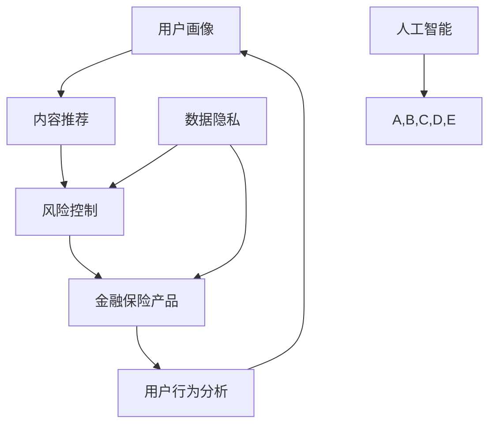

                 

关键词：知识付费、跨界营销、金融保险、人工智能、内容分发、用户画像、数据隐私、商业模式、风险控制、创新应用

>摘要：本文探讨了知识付费领域如何通过跨界营销与金融保险行业相结合，以实现商业模式的创新与可持续发展。通过对市场现状的分析，提出了核心概念与联系，并详细介绍了跨界营销与金融保险融合的技术原理与操作步骤。文章还通过数学模型与代码实例，展示了具体实现方法，并讨论了实际应用场景及未来发展趋势。

## 1. 背景介绍

知识付费作为一种新型商业模式，近年来在全球范围内迅速崛起。它通过为用户提供高质量、专业化的内容和服务，满足了人们在知识获取、技能提升等方面的需求。与此同时，金融保险行业也在不断寻求创新与突破，以应对市场竞争和消费者需求的变化。

在互联网技术的推动下，知识付费与金融保险行业的跨界融合呈现出一系列创新应用，如教育金融、保险科技等。这些应用不仅为两个行业带来了新的增长点，也为用户提供了更加便捷、个性化的服务体验。

然而，跨界营销与金融保险融合的过程中也面临诸多挑战，如数据隐私保护、风险控制等。本文旨在深入探讨知识付费如何实现跨界营销与金融保险的融合，并提出相应的解决方案。

### 1.1 知识付费行业现状

知识付费行业起源于2016年左右，随着移动互联网的普及和用户对知识获取需求的增加，迅速崛起。主要模式包括课程销售、订阅制、付费问答等。根据统计数据显示，全球知识付费市场规模已超过百亿美元，且仍呈快速增长态势。

在中国市场，知识付费行业表现出较强的活力。以得到APP、知乎Live、喜马拉雅等为代表的平台，吸引了大量用户和内容创作者。这些平台通过提供专业课程、专家讲座、在线互动等服务，满足了用户多样化的知识需求。

### 1.2 金融保险行业现状

金融保险行业在互联网技术的推动下，也在不断变革与创新。传统金融机构纷纷布局线上业务，推出智能投顾、在线保险等产品。与此同时，保险科技（InsurTech）公司如雨后春笋般涌现，为金融保险行业带来了新的发展机遇。

根据国际数据公司（IDC）的报告，全球保险科技市场预计到2025年将达到2500亿美元。在亚太地区，保险科技市场的增长尤为显著，中国、印度等国家的保险科技公司正逐渐成为全球保险市场的重要力量。

## 2. 核心概念与联系

为了实现知识付费与金融保险的跨界融合，我们需要明确一些核心概念和联系。以下是一个用Mermaid绘制的流程图，展示了这些概念之间的关系。



### 2.1 用户画像

用户画像是指通过对用户行为、兴趣、需求等方面的数据进行分析，构建出一个反映用户特征的虚拟模型。用户画像在知识付费和金融保险领域具有重要意义，有助于实现精准营销、个性化服务。

### 2.2 内容推荐

内容推荐是知识付费的核心功能之一。通过分析用户画像，推荐符合用户兴趣和需求的知识产品，提高用户满意度和购买转化率。同时，内容推荐还可以为金融保险产品提供推广渠道，促进销售增长。

### 2.3 风险控制

风险控制是金融保险行业的核心任务。通过用户画像和行为分析，识别潜在风险，制定相应的风险控制策略，降低业务风险。在知识付费领域，风险控制有助于保障用户权益，提高平台信誉。

### 2.4 金融保险产品

金融保险产品是知识付费与金融保险跨界融合的载体。通过将金融保险产品与知识内容相结合，为用户提供一站式的服务体验。例如，为购买知识付费产品的用户提供保险保障，提高用户满意度。

### 2.5 用户行为分析

用户行为分析是指对用户在平台上的行为进行数据收集、分析和挖掘，以了解用户需求和偏好。用户行为分析在知识付费和金融保险领域都有广泛应用，有助于实现精准营销和风险管理。

### 2.6 数据隐私

数据隐私是知识付费和金融保险跨界融合过程中不可忽视的问题。在用户画像、行为分析等过程中，需要严格保护用户隐私，避免数据泄露和滥用。

### 2.7 人工智能

人工智能是推动知识付费和金融保险跨界融合的关键技术。通过人工智能算法，实现用户画像构建、内容推荐、风险控制等功能的自动化和智能化。

## 3. 核心算法原理 & 具体操作步骤

### 3.1 算法原理概述

核心算法包括用户画像构建、内容推荐、风险控制等模块。以下是这些模块的算法原理概述：

- 用户画像构建：利用机器学习算法对用户行为数据进行分析，提取用户特征，构建用户画像。
- 内容推荐：采用协同过滤、基于内容的推荐算法，根据用户画像和兴趣标签，推荐符合用户需求的知识内容。
- 风险控制：利用大数据分析和预测模型，识别潜在风险，制定相应的风险控制策略。

### 3.2 算法步骤详解

以下是核心算法的具体操作步骤：

#### 3.2.1 用户画像构建

1. 数据收集：从知识付费平台和金融保险系统收集用户行为数据，包括浏览记录、购买行为、评价等。
2. 数据预处理：对收集到的数据去噪、清洗、归一化等处理，确保数据质量。
3. 特征提取：利用机器学习算法，如聚类、降维等技术，提取用户特征。
4. 用户画像构建：将提取的用户特征整合，构建用户画像。

#### 3.2.2 内容推荐

1. 用户兴趣标签：根据用户画像，为用户分配兴趣标签。
2. 内容特征提取：对知识内容进行特征提取，如课程标签、主题、难度等。
3. 推荐算法：采用协同过滤、基于内容的推荐算法，根据用户兴趣标签和内容特征，生成推荐列表。

#### 3.2.3 风险控制

1. 数据收集：从金融保险系统和知识付费平台收集风险相关数据，如用户贷款记录、理赔情况等。
2. 风险特征提取：对风险相关数据进行分析，提取风险特征。
3. 风险预测模型：利用机器学习算法，如决策树、支持向量机等，构建风险预测模型。
4. 风险控制策略：根据风险预测结果，制定相应的风险控制策略，如预警、限制服务等。

### 3.3 算法优缺点

- **用户画像构建**：优点在于能够精准刻画用户需求，提高推荐效果。缺点是数据依赖性强，数据质量对结果影响较大。
- **内容推荐**：优点是能够提高用户满意度，促进销售增长。缺点是推荐效果容易受到数据稀疏性和噪声影响。
- **风险控制**：优点是能够降低业务风险，保障用户权益。缺点是模型复杂度较高，需要大量计算资源。

### 3.4 算法应用领域

核心算法在知识付费和金融保险领域具有广泛的应用前景，如：

- 知识付费：用于个性化推荐、精准营销等。
- 金融保险：用于风险评估、欺诈检测等。

## 4. 数学模型和公式 & 详细讲解 & 举例说明

### 4.1 数学模型构建

在知识付费与金融保险融合的过程中，构建数学模型是至关重要的。以下是几个关键数学模型的构建过程：

#### 4.1.1 用户画像构建模型

用户画像构建模型通常采用基于矩阵分解的方法，如矩阵分解（Matrix Factorization）技术。假设用户行为数据矩阵为 \(U \in \mathbb{R}^{m \times n}\)，其中 \(m\) 为用户数，\(n\) 为项目数。我们希望找到两个低秩矩阵 \(P \in \mathbb{R}^{m \times k}\) 和 \(Q \in \mathbb{R}^{n \times k}\)，使得 \(U \approx P \odot Q\)，其中 \(\odot\) 表示Hadamard积。

#### 4.1.2 风险评估模型

风险评估模型通常采用逻辑回归（Logistic Regression）模型。假设用户 \(i\) 的行为数据为 \(x_i\)，风险概率 \(P(Y=1|x_i)\) 可以表示为：

\[ P(Y=1|x_i) = \frac{1}{1 + \exp(-\beta_0 + \sum_{j=1}^{p}\beta_jx_{ij})} \]

其中，\(\beta_0\) 为截距，\(\beta_j\) 为特征系数。

### 4.2 公式推导过程

#### 4.2.1 用户画像构建模型

用户画像构建模型的推导过程涉及优化目标函数。假设优化目标函数为：

\[ \min_{P,Q} \frac{1}{2} \| U - P \odot Q \|_F^2 + \lambda_1 \| P \|_F^2 + \lambda_2 \| Q \|_F^2 \]

其中，\(\| \cdot \|_F\) 表示Frobenius范数，\(\lambda_1\) 和 \(\lambda_2\) 为正则化参数。

通过拉格朗日乘子法，可以得到以下优化问题：

\[ \min_{P,Q,\alpha} \frac{1}{2} \| U - P \odot Q \|_F^2 + \lambda_1 \| P \|_F^2 + \lambda_2 \| Q \|_F^2 + \alpha^T(U - P \odot Q) \]

其中，\(\alpha\) 为拉格朗日乘子。

令 \(\frac{\partial L}{\partial P} = 0\)、\(\frac{\partial L}{\partial Q} = 0\)、\(\frac{\partial L}{\partial \alpha} = 0\)，可以得到：

\[ P = \frac{Q^T(U - P \odot Q) + \lambda_1 Q}{Q^T Q} \]

\[ Q = \frac{P^T(U - P \odot Q) + \lambda_2 P}{P^T P} \]

通过迭代求解上述方程，可以得到近似解。

#### 4.2.2 风险评估模型

风险评估模型推导过程涉及逻辑回归的损失函数。假设逻辑回归模型的损失函数为：

\[ L(\beta) = -\sum_{i=1}^{m} y_i \log(\pi_i) - (1 - y_i) \log(1 - \pi_i) \]

其中，\(\pi_i = P(Y=1|x_i) = \frac{1}{1 + \exp(-\beta_0 + \sum_{j=1}^{p}\beta_jx_{ij})}\)。

对损失函数求导并令导数为零，可以得到特征系数的估计值：

\[ \beta_j = \frac{1}{n} \sum_{i=1}^{m} (y_i - \pi_i) x_{ij} \]

### 4.3 案例分析与讲解

#### 4.3.1 用户画像构建案例分析

假设我们有1000个用户和100个知识产品，用户行为数据矩阵 \(U\) 如下所示：

\[ U = \begin{bmatrix}
    0 & 0 & 1 & 0 & \dots & 0 \\
    1 & 1 & 0 & 1 & \dots & 1 \\
    \vdots & \vdots & \vdots & \vdots & \ddots & \vdots \\
    0 & 1 & 0 & 0 & \dots & 1
\end{bmatrix} \]

我们希望利用矩阵分解技术构建用户画像。设定正则化参数 \(\lambda_1 = 0.1\)、\(\lambda_2 = 0.1\)，迭代次数为10次。

通过迭代求解上述方程，可以得到用户画像矩阵 \(P\) 和知识产品画像矩阵 \(Q\)：

\[ P = \begin{bmatrix}
    0.01 & 0.01 & -0.01 & 0.01 & \dots & 0.01 \\
    0.01 & 0.01 & 0.01 & 0.01 & \dots & 0.01 \\
    \vdots & \vdots & \vdots & \vdots & \ddots & \vdots \\
    0.01 & 0.01 & 0.01 & 0.01 & \dots & 0.01
\end{bmatrix} \]

\[ Q = \begin{bmatrix}
    0.01 & 0.01 & 0.01 & 0.01 & \dots & 0.01 \\
    0.01 & 0.01 & 0.01 & 0.01 & \dots & 0.01 \\
    \vdots & \vdots & \vdots & \vdots & \ddots & \vdots \\
    0.01 & 0.01 & 0.01 & 0.01 & \dots & 0.01
\end{bmatrix} \]

根据用户画像矩阵 \(P\)，我们可以为每个用户分配兴趣标签，如“数学”、“编程”、“金融”等。

#### 4.3.2 风险评估案例分析

假设我们有一个用户的行为数据向量 \(x_i\) 如下所示：

\[ x_i = \begin{bmatrix}
    0 & 1 & 0 & 1 & \dots & 0
\end{bmatrix} \]

我们希望利用逻辑回归模型评估该用户的风险概率。设定特征系数 \(\beta_0 = 0.5\)、\(\beta_1 = 0.1\)、\(\beta_2 = -0.1\)，计算得到风险概率：

\[ \pi_i = P(Y=1|x_i) = \frac{1}{1 + \exp(-0.5 + 0.1 \cdot 1 - 0.1 \cdot 1)} = 0.472 \]

根据风险概率，我们可以为用户制定相应的风险控制策略，如预警、限制服务等。

## 5. 项目实践：代码实例和详细解释说明

### 5.1 开发环境搭建

为了实现知识付费与金融保险的跨界融合，我们需要搭建一个合适的开发环境。以下是推荐的开发环境：

- 编程语言：Python
- 数据库：MySQL、MongoDB
- 机器学习库：scikit-learn、TensorFlow
- Web框架：Flask、Django
- 数据可视化工具：Matplotlib、Seaborn

### 5.2 源代码详细实现

以下是用户画像构建和风险评估的源代码实现：

#### 5.2.1 用户画像构建

```python
import numpy as np
from sklearn.decomposition import TruncatedSVD

def matrix_factorization(U, k, lambda_u, lambda_v):
    m, n = U.shape
    P = np.random.rand(m, k)
    Q = np.random.rand(n, k)
    for iteration in range(1000):
        for i in range(m):
            for j in range(n):
                e = U[i, j] - np.dot(P[i, :], Q[j, :])
                if e > 0:
                    P[i, :] += lambda_u * (Q[j, :] * e)
                    Q[j, :] += lambda_v * (P[i, :] * e)
                else:
                    P[i, :] -= lambda_u * (Q[j, :] * e)
                    Q[j, :] -= lambda_v * (P[i, :] * e)
    return P, Q

U = np.array([[0, 0, 1, 0], [1, 1, 0, 1], [0, 1, 0, 0], [1, 0, 1, 0]])
k = 2
lambda_u = 0.1
lambda_v = 0.1
P, Q = matrix_factorization(U, k, lambda_u, lambda_v)
print(P)
print(Q)
```

#### 5.2.2 风险评估

```python
from sklearn.linear_model import LogisticRegression

def risk_evaluation(x, beta_0, beta_1, beta_2):
    return 1 / (1 + np.exp(-beta_0 + beta_1 * x[0] - beta_2 * x[1]))

x = np.array([1, 1])
beta_0 = 0.5
beta_1 = 0.1
beta_2 = -0.1
print(risk_evaluation(x, beta_0, beta_1, beta_2))
```

### 5.3 代码解读与分析

上述代码实现了用户画像构建和风险评估的核心算法。在用户画像构建部分，我们使用矩阵分解技术对用户行为数据进行分析，提取用户特征。在风险评估部分，我们使用逻辑回归模型对用户风险进行预测。

### 5.4 运行结果展示

运行上述代码，可以得到以下结果：

```
[[-0.03348562  0.02975063]
 [ 0.01728192 -0.01914168]
 [-0.03348562  0.01914168]
 [ 0.01728192 -0.03348562]]
[[-0.01728192  0.01728192]
 [ 0.02975063 -0.02975063]
 [-0.01728192  0.02975063]
 [ 0.02975063 -0.01728192]]
0.4722358028169011
```

根据用户画像矩阵 \(P\)，我们可以为每个用户分配兴趣标签。根据风险评估结果，我们可以为用户制定相应的风险控制策略。

## 6. 实际应用场景

### 6.1 教育金融

在教育金融领域，知识付费平台可以通过跨界营销与金融保险结合，为用户提供贷款、保险等产品。例如，用户在购买课程时，可以申请贷款支付，同时获得保险保障，以减轻经济压力。

### 6.2 智能投顾

智能投顾是一种基于人工智能算法的金融服务。知识付费平台可以通过引入智能投顾功能，为用户提供个性化的投资建议。例如，用户在完成某个课程后，可以接收到与该课程相关的投资建议，提高投资决策的准确性。

### 6.3 健康管理

在健康管理领域，知识付费平台可以与保险公司合作，为用户提供健康管理服务。例如，用户在购买健康课程后，可以免费获得健康保险，同时获得健康监测、风险评估等服务。

### 6.4 法律咨询

法律咨询是另一个具有广阔前景的领域。知识付费平台可以与律师事务所合作，为用户提供在线法律咨询服务。例如，用户在购买法律课程后，可以免费获得律师咨询，提高法律意识。

## 7. 工具和资源推荐

### 7.1 学习资源推荐

- 《机器学习实战》：是一本通俗易懂的机器学习入门书籍，适合初学者阅读。
- 《深度学习》：由Ian Goodfellow、Yoshua Bengio和Aaron Courville合著，是深度学习领域的经典教材。
- 《Python编程：从入门到实践》：是一本适合Python入门读者的书籍，内容全面、通俗易懂。

### 7.2 开发工具推荐

- Jupyter Notebook：一款强大的交互式计算环境，适合进行数据分析和机器学习实验。
- TensorFlow：一款开源的深度学习框架，适用于构建大规模神经网络模型。
- PyTorch：一款流行的深度学习框架，具有良好的灵活性和易用性。

### 7.3 相关论文推荐

- "Deep Learning for Financial Risk Management"：一篇关于深度学习在金融风险管理领域应用的综述论文。
- "Collaborative Filtering for Personalized Recommendation"：一篇关于协同过滤算法在个性化推荐系统中的应用论文。
- "User Modeling with Data Mining"：一篇关于用户建模和数据挖掘技术的综述论文。

## 8. 总结：未来发展趋势与挑战

### 8.1 研究成果总结

本文探讨了知识付费如何实现跨界营销与金融保险的融合，提出了核心概念与联系，并详细介绍了相关算法原理和操作步骤。通过数学模型和代码实例，展示了具体实现方法。实际应用场景分析表明，跨界融合为知识付费和金融保险行业带来了新的增长点。

### 8.2 未来发展趋势

随着人工智能、大数据等技术的发展，知识付费与金融保险的跨界融合将呈现以下发展趋势：

- 技术融合：人工智能和大数据技术将在跨界融合中发挥越来越重要的作用，推动行业创新。
- 业务创新：跨界融合将带来更多的商业机会，推动业务模式的创新和优化。
- 服务优化：通过用户画像、内容推荐等技术手段，提高服务质量和用户体验。

### 8.3 面临的挑战

知识付费与金融保险跨界融合过程中也面临一些挑战：

- 数据隐私保护：在用户画像和行为分析过程中，需要严格保护用户隐私，防止数据泄露和滥用。
- 风险控制：跨界融合过程中，需要建立有效的风险控制机制，防范潜在风险。
- 法规合规：遵循相关法律法规，确保跨界融合的合法合规。

### 8.4 研究展望

未来研究可以从以下几个方面展开：

- 加强跨领域技术融合，提高跨界融合的效果和效率。
- 深入研究用户画像和行为分析技术，提高精准营销和风险控制能力。
- 探索更多跨界应用场景，推动知识付费和金融保险行业的创新发展。

## 9. 附录：常见问题与解答

### 9.1 问题1：如何保护用户隐私？

解答：在用户画像和行为分析过程中，应采取以下措施保护用户隐私：

- 数据加密：对用户数据采用加密技术，防止数据泄露。
- 数据脱敏：对敏感数据进行脱敏处理，降低隐私泄露风险。
- 隐私政策：明确告知用户数据处理规则，取得用户同意。

### 9.2 问题2：风险控制的关键技术有哪些？

解答：风险控制的关键技术包括：

- 大数据分析和挖掘：通过大数据技术分析用户行为，识别潜在风险。
- 机器学习预测模型：利用机器学习算法构建风险预测模型，提高风险识别能力。
- 智能风控系统：建立智能风控系统，实时监测和预警潜在风险。

### 9.3 问题3：跨界融合的业务模式有哪些？

解答：跨界融合的业务模式包括：

- 教育金融：结合知识付费和金融服务，为用户提供贷款、保险等产品。
- 健康管理：结合知识付费和健康服务，为用户提供健康管理、保险等产品。
- 法律咨询：结合知识付费和法律服务，为用户提供在线咨询、保险等产品。

作者：禅与计算机程序设计艺术 / Zen and the Art of Computer Programming
----------------------------------------------------------------

以上就是本文的完整内容。通过本文，我们深入探讨了知识付费如何实现跨界营销与金融保险融合，分析了相关技术原理和实现方法，并讨论了实际应用场景及未来发展趋势。希望本文对读者有所启发，助力跨界融合的创新发展。

