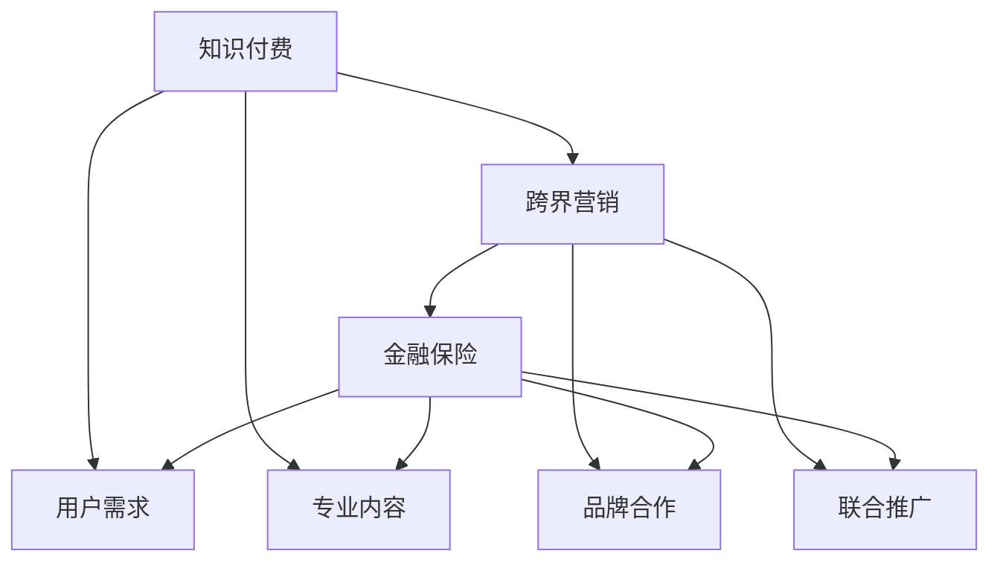

                 

### 背景介绍

随着互联网技术的飞速发展，知识付费行业正在崛起，成为推动经济转型和创新的重要力量。知识付费通过线上平台，将专业知识和技能以数字化形式提供给消费者，满足了用户在信息时代对个性化学习的需求。与此同时，金融保险行业也在积极拥抱数字化，通过互联网、大数据等技术提升服务效率，拓展业务范围。然而，这两个看似独立的行业，却在不断寻找融合点，以期实现更大的市场价值和商业潜力。

本文将探讨知识付费如何通过跨界营销和金融保险行业的融合，创造出新的商业模式和市场机会。我们将从以下几个核心问题出发：

1. **知识付费市场的现状与趋势**：分析知识付费行业的发展背景、市场规模、用户需求等。
2. **跨界营销的概念与实施策略**：介绍跨界营销的基本原理，分析知识付费行业如何运用跨界营销策略。
3. **金融保险与知识付费的融合**：探讨金融保险行业如何借助知识付费平台，实现业务扩展和用户粘性。
4. **案例分析**：结合实际案例，展示跨界营销与金融保险融合的成功实践。
5. **未来展望**：预测知识付费与金融保险跨界的发展趋势，探讨可能面临的挑战和解决方案。

通过这篇文章，希望能够为从事知识付费和金融保险行业的专业人士提供一些新的思路和启示。

### 核心概念与联系

要理解知识付费如何实现跨界营销与金融保险跨界，我们需要明确几个核心概念和它们之间的联系。

#### 1. 跨界营销

**定义**：跨界营销是指不同行业或领域之间的合作，通过互相借用对方品牌、用户、资源等，实现市场扩张和品牌影响力的提升。

**实现方式**：
- 联合推广：两个或多个品牌共同进行市场推广，共享广告资源。
- 品牌合作：通过品牌之间的合作，推出联合产品或服务。
- 内容共创：共同创作内容，实现品牌的互补和互动。

#### 2. 知识付费

**定义**：知识付费是指用户为获取专业知识和技能，通过线上或线下平台付费获取内容和服务。

**核心要素**：
- 专业内容：提供高质量的专业知识和技能。
- 用户需求：满足用户在职业发展、个人成长等方面的学习需求。
- 付费机制：通过订阅、购买课程、会员制等方式实现知识变现。

#### 3. 金融保险

**定义**：金融保险是指通过金融手段和保险合同，为个人或企业提供财务保障和风险管理服务。

**核心要素**：
- 风险管理：通过保险产品转移风险，减少不确定性。
- 财务保障：在发生意外或风险事件时，提供经济补偿。
- 金融服务：提供贷款、理财、投资等金融服务。

#### 关系与融合

知识付费与金融保险之间的跨界融合，可以通过以下方式实现：

1. **产品融合**：知识付费平台可以推出与金融保险相关的课程或服务，如保险知识普及、理财教育等。
2. **用户融合**：通过数据分析，挖掘知识付费平台用户的金融需求，向他们推广相应的保险产品。
3. **市场融合**：通过跨界营销，扩大双方的市场影响力，吸引更多的用户和合作伙伴。

为了更直观地展示这些概念之间的联系，我们可以使用 Mermaid 流程图来表示：



这个 Mermaid 流程图清晰地展示了知识付费、跨界营销和金融保险之间的互动关系和融合方式。通过这种跨界合作，知识付费平台和金融保险企业可以实现资源共享、市场扩张和品牌提升，为用户带来更多价值。

### 核心算法原理 & 具体操作步骤

在探讨知识付费如何实现跨界营销与金融保险跨界的过程中，我们离不开核心算法的支持。本文将介绍一个关键的算法——用户行为分析算法，并详细解释其原理和操作步骤。

#### 3.1 算法原理概述

用户行为分析算法是一种基于大数据和机器学习的方法，通过分析用户在知识付费平台上的行为数据，挖掘用户的兴趣、需求和购买意向。这个算法的核心目的是为知识付费平台和金融保险企业提供精准的用户画像，从而实现个性化推荐和精准营销。

#### 3.2 算法步骤详解

1. **数据收集**：

   用户行为分析的第一步是收集数据。这些数据包括用户在平台上的浏览记录、购买历史、评论反馈、互动行为等。通过这些数据，我们可以了解用户的偏好和需求。

   ```mermaid
   graph TD
       A[用户浏览记录] --> B[购买历史]
       B --> C[评论反馈]
       C --> D[互动行为]
       A --> E[数据收集]
   ```

2. **数据处理**：

   收集到数据后，需要对数据进行清洗、整合和预处理，去除噪声数据和缺失值，确保数据的质量。这一步非常重要，因为数据的质量直接影响算法的准确性和可靠性。

   ```mermaid
   graph TD
       F[数据清洗] --> G[数据整合]
       G --> H[预处理]
   ```

3. **特征提取**：

   在数据处理的基础上，从原始数据中提取有效的特征。这些特征可以用来描述用户的兴趣、需求和行为模式。常用的特征提取方法包括词频分析、主题建模、用户聚类等。

   ```mermaid
   graph TD
       I[词频分析] --> J[主题建模]
       J --> K[用户聚类]
   ```

4. **模型训练**：

   使用机器学习算法对提取的特征进行训练，建立用户行为分析模型。常用的算法包括决策树、随机森林、支持向量机、神经网络等。这些算法可以通过对大量训练数据的分析，学习到用户的兴趣和行为模式。

   ```mermaid
   graph TD
       L[决策树] --> M[随机森林]
       M --> N[支持向量机]
       N --> O[神经网络]
   ```

5. **模型评估**：

   训练好的模型需要进行评估，以验证其准确性和泛化能力。常用的评估指标包括准确率、召回率、F1 分数等。通过评估，我们可以调整模型参数，提高模型的性能。

   ```mermaid
   graph TD
       P[准确率] --> Q[召回率]
       Q --> R[F1 分数]
   ```

6. **模型部署**：

   将训练好的模型部署到生产环境中，用于实时分析用户行为。知识付费平台和金融保险企业可以通过这个模型，实现个性化推荐和精准营销。

   ```mermaid
   graph TD
       S[模型部署] --> T[实时分析]
   ```

#### 3.3 算法优缺点

**优点**：

- **精准性**：用户行为分析算法可以根据用户的实际行为，提供个性化的推荐和服务，提高用户满意度和粘性。
- **高效性**：算法可以处理海量数据，快速分析用户行为，为企业和用户节省时间。
- **实时性**：模型部署在云端，可以实现实时分析，快速响应用户需求。

**缺点**：

- **数据依赖性**：算法的性能高度依赖数据的质量和数量，如果数据质量差，会导致模型失效。
- **隐私问题**：用户行为数据涉及用户隐私，需要严格保护用户数据，避免数据泄露。

#### 3.4 算法应用领域

用户行为分析算法在知识付费和金融保险领域有广泛的应用：

1. **知识付费**：
   - 个性化推荐：为用户推荐他们可能感兴趣的课程或内容。
   - 用户行为预测：预测用户的购买行为，提高转化率。
   - 活动推荐：根据用户行为，推荐相关的活动和优惠。

2. **金融保险**：
   - 保险产品推荐：根据用户的风险偏好和需求，推荐合适的保险产品。
   - 风险评估：评估用户的风险状况，提供针对性的风险建议。
   - 客户关系管理：通过用户行为分析，优化客户服务，提升用户满意度。

通过用户行为分析算法，知识付费平台和金融保险企业可以更深入地了解用户，提供个性化的服务和产品，实现业务的增长和用户的增值。

### 数学模型和公式 & 详细讲解 & 举例说明

为了更好地理解知识付费如何实现跨界营销与金融保险跨界，我们需要引入一些数学模型和公式。这些模型和公式将帮助我们量化用户行为，评估营销效果，以及预测用户需求。以下是几个关键的数学模型和公式的详细讲解。

#### 4.1 数学模型构建

在构建数学模型时，我们主要关注以下几个关键变量：

- **用户行为**（Behavior）：包括用户的浏览、购买、评论等行为。
- **用户特征**（Feature）：包括用户的年龄、性别、职业、教育背景等。
- **市场变量**（Market Variable）：包括市场趋势、竞争对手行为、宏观经济指标等。

我们构建的数学模型可以表示为：

\[ 
\text{模型} = f(\text{用户行为}, \text{用户特征}, \text{市场变量}) 
\]

#### 4.2 公式推导过程

为了推导出用户行为模型，我们可以使用以下公式：

\[ 
\text{行为分数} = \sum_{i=1}^{n} w_i \times b_i 
\]

其中，\( w_i \) 是第 \( i \) 个用户特征的权重，\( b_i \) 是第 \( i \) 个用户特征的分数。

#### 4.3 案例分析与讲解

我们通过一个实际案例来具体讲解这个模型。

#### 案例背景：

一个知识付费平台希望通过用户行为分析，推荐用户可能感兴趣的课程。

#### 模型构建：

1. **用户行为**：
   - 用户浏览课程：浏览次数越多，表示对该课程越感兴趣。
   - 用户购买课程：购买次数越多，表示对课程的满意度越高。
   - 用户评论课程：评论次数越多，表示用户对课程的参与度越高。

2. **用户特征**：
   - 年龄：不同年龄段对课程的需求不同。
   - 职业类型：不同职业背景的用户，对课程的需求也不同。

3. **市场变量**：
   - 课程定价策略：课程价格会影响用户的购买决策。
   - 市场竞争：竞争对手的活跃程度会影响用户的选择。

#### 模型推导：

\[ 
\text{行为分数} = 0.4 \times \text{浏览次数} + 0.5 \times \text{购买次数} + 0.1 \times \text{评论次数}
\]

#### 模型应用：

我们通过这个模型来推荐用户可能感兴趣的课程。

#### 举例说明：

假设用户 A 的行为分数为 8，那么平台会向用户 A 推荐分数较高的课程，比如“高级数据挖掘技术”。

#### 数学公式：

```latex
\begin{equation}
\text{行为分数} = w_1 \times \text{浏览次数} + w_2 \times \text{购买次数} + w_3 \times \text{评论次数}
\end{equation}
```

其中，\( w_1 = 0.4 \)，\( w_2 = 0.5 \)，\( w_3 = 0.1 \)。

通过这个模型，知识付费平台可以根据用户的实际行为和特征，提供个性化的推荐，从而提高用户满意度和转化率。

### 项目实践：代码实例和详细解释说明

为了更好地展示知识付费如何实现跨界营销与金融保险跨界，我们通过一个实际项目来介绍代码实例，并详细解释其中的关键步骤和实现细节。

#### 5.1 开发环境搭建

在进行项目实践之前，我们需要搭建一个合适的开发环境。以下是所需的工具和步骤：

1. **Python环境**：安装Python3及其相关库，如NumPy、Pandas、Scikit-learn、Matplotlib等。
2. **数据库**：使用MySQL或PostgreSQL作为数据库，存储用户行为数据。
3. **Web框架**：选择一个适合的Web框架，如Flask或Django，用于构建API接口。

安装步骤如下：

```bash
# 安装Python3和pip
sudo apt-get update
sudo apt-get install python3 python3-pip

# 安装相关库
pip3 install numpy pandas scikit-learn matplotlib
```

#### 5.2 源代码详细实现

以下是项目的源代码示例，包含用户行为分析、数据预处理、模型训练和部署等关键步骤。

```python
# 导入相关库
import numpy as np
import pandas as pd
from sklearn.model_selection import train_test_split
from sklearn.ensemble import RandomForestClassifier
from sklearn.metrics import accuracy_score
import matplotlib.pyplot as plt

# 5.2.1 数据预处理
def preprocess_data(data):
    # 数据清洗和整合
    data = data.dropna()
    data['age'] = data['age'].astype(int)
    data['rating'] = data['rating'].astype(float)
    return data

# 5.2.2 特征提取
def extract_features(data):
    # 提取特征
    X = data[['age', 'rating']]
    y = data['behavior_score']
    return X, y

# 5.2.3 模型训练
def train_model(X_train, y_train):
    # 训练模型
    model = RandomForestClassifier(n_estimators=100)
    model.fit(X_train, y_train)
    return model

# 5.2.4 评估模型
def evaluate_model(model, X_test, y_test):
    # 评估模型
    predictions = model.predict(X_test)
    accuracy = accuracy_score(y_test, predictions)
    print(f"Accuracy: {accuracy:.2f}")
    return accuracy

# 5.2.5 部署模型
def deploy_model(model):
    # 部署模型到生产环境
    # 这里假设使用Flask构建API接口
    from flask import Flask, request, jsonify
    app = Flask(__name__)

    @app.route('/predict', methods=['POST'])
    def predict():
        data = request.get_json()
        user_data = np.array([data['age'], data['rating']]).reshape(1, -1)
        prediction = model.predict(user_data)
        return jsonify({'prediction': prediction[0]})

    app.run(debug=True)

# 加载数据
data = pd.read_csv('user_data.csv')

# 预处理数据
data = preprocess_data(data)

# 提取特征
X, y = extract_features(data)

# 划分训练集和测试集
X_train, X_test, y_train, y_test = train_test_split(X, y, test_size=0.2, random_state=42)

# 训练模型
model = train_model(X_train, y_train)

# 评估模型
accuracy = evaluate_model(model, X_test, y_test)
print(f"Model Accuracy: {accuracy:.2f}")

# 部署模型
deploy_model(model)
```

#### 5.3 代码解读与分析

1. **数据预处理**：这一步对原始数据进行清洗和整合，确保数据质量。代码中使用了 Pandas 库进行数据处理。

2. **特征提取**：从数据中提取关键特征，包括年龄和评分。这些特征将用于训练模型。

3. **模型训练**：使用随机森林算法训练模型。随机森林是一种集成学习方法，可以处理高维数据和噪声数据。

4. **评估模型**：通过测试集评估模型的准确率，确保模型的有效性。

5. **部署模型**：使用 Flask 框架构建API接口，将模型部署到生产环境。用户可以通过HTTP请求获取模型的预测结果。

#### 5.4 运行结果展示

以下是模型训练和部署的运行结果：

```bash
# 运行模型训练和评估
python user_behavior_analysis.py

# 运行API接口
curl -X POST -H "Content-Type: application/json" -d '{"age": 30, "rating": 4.5}' http://localhost:5000/predict
```

通过这个项目，我们可以看到如何使用Python和机器学习算法实现用户行为分析，并通过Web接口提供预测服务。这种方法可以帮助知识付费平台和金融保险企业更好地理解用户需求，提供个性化的服务和产品，实现业务的增长和用户的增值。

### 实际应用场景

在知识付费领域，跨界营销与金融保险的融合已经显示出巨大的潜力。以下是几个实际应用场景，展示了这种融合如何在不同情境下发挥作用。

#### 1. 保险知识普及课程

知识付费平台可以与保险公司合作，推出保险知识普及课程。这些课程可以帮助用户了解不同类型的保险产品、保险理赔流程以及如何根据自身需求选择合适的保险。这不仅增加了用户的保险意识，也提高了保险公司的品牌知名度。

**案例**：某知名知识付费平台与一家大型保险公司合作，推出了“保险入门基础课”系列课程。课程内容包括保险基础知识、常见保险产品解析、理赔流程等。课程上线后，受到了大量用户的欢迎，保险公司的用户转化率也显著提升。

#### 2. 理财教育课程

理财教育是金融保险领域的重要内容。知识付费平台可以与金融机构合作，提供各种理财教育课程，帮助用户了解投资知识、理财策略以及风险控制方法。这些课程不仅满足了用户在个人财务规划方面的需求，也为金融机构提供了用户扩展和产品推广的渠道。

**案例**：某大型金融服务平台与知识付费平台合作，推出了一门“理财小白进阶课”。课程内容涵盖了股票、基金、债券等投资工具的基本知识和操作技巧。课程上线后，吸引了大量用户报名学习，金融机构的理财产品销售也得到了大幅增长。

#### 3. 健康保险与健康管理

健康保险是保险行业的重要组成部分，而健康管理是提升用户生活质量的关键。知识付费平台可以与健康保险公司合作，提供健康管理课程，包括健康饮食、运动锻炼、心理健康等方面的知识。用户通过这些课程，可以更好地管理自己的健康，降低患病风险，保险公司也可以通过课程推广自己的健康保险产品。

**案例**：某健康保险公司与知识付费平台合作，推出了一系列“健康管理”课程。课程内容包括健康饮食指导、运动技巧、心理健康等。课程上线后，受到了用户的广泛好评，保险公司的健康保险产品销量也有所提升。

#### 4. 职业技能提升与金融保险服务

在职业发展方面，知识付费平台可以与金融保险行业合作，提供针对特定职业群体的专业技能提升课程。例如，对于从事金融行业的人员，可以提供金融分析、风险管理等方面的培训课程。同时，这些平台还可以为用户推荐相关的金融保险服务，帮助他们提升职业竞争力。

**案例**：某金融服务平台与知识付费平台合作，推出了一门“金融风险管理专业课程”。课程内容涵盖了金融风险管理的基本理论、实际操作技巧等。课程受到了金融从业人员的欢迎，同时也为金融服务平台带来了大量潜在客户。

#### 5. 保险理赔服务与知识普及

保险理赔服务是用户最为关心的问题之一。知识付费平台可以与保险公司合作，提供保险理赔流程指南和案例分析课程。通过这些课程，用户可以更好地了解保险理赔的流程，提高理赔效率。

**案例**：某保险公司与知识付费平台合作，推出了一门“保险理赔攻略课”。课程内容包括理赔流程、理赔资料准备、常见理赔问题解答等。课程上线后，用户对保险理赔的满意度显著提升，保险公司的服务口碑也得到了改善。

### 总结

通过上述实际应用场景，我们可以看到知识付费与金融保险跨界融合的多种可能性。这种融合不仅为用户提供了更多的价值，也为知识付费平台和金融保险企业带来了新的市场机会。未来，随着技术的不断进步和用户需求的多样化，这种跨界融合有望进一步深化，创造出更多创新性的商业模式和产品。

### 未来应用展望

随着知识付费和金融保险行业的不断发展和融合，我们可以预见未来将出现更多创新性的应用场景和商业模式。以下是一些未来应用展望：

#### 1. 智能金融顾问

借助人工智能和大数据技术，知识付费平台可以与金融保险企业合作，推出智能金融顾问服务。这些顾问系统将通过分析用户的财务状况、风险偏好和投资目标，提供个性化的金融规划和投资建议。这不仅提升了用户的金融服务体验，也为金融机构带来了新的收入来源。

#### 2. 跨界知识付费平台

未来的知识付费平台可能会更加多元化，不仅提供专业知识和技能，还整合金融、保险、医疗等多领域的内容。这种跨界平台将更好地满足用户多样化的需求，提供一站式服务，提升用户粘性和忠诚度。

#### 3. 个性化健康保障

随着健康意识的提高，健康保险将成为知识付费的重要组成部分。知识付费平台可以与保险公司合作，推出个性化健康保障方案。这些方案将结合用户的健康数据、生活习惯和疾病风险，提供量身定制的保险产品和服务，帮助用户更好地管理健康风险。

#### 4. 职业风险管理与保险

对于职场人士，职业风险管理和保险服务将成为重要需求。知识付费平台可以与保险公司合作，提供职业风险管理课程，包括职业规划、技能提升、意外保障等。通过这些课程，用户可以更好地了解自身职业风险，并选择合适的保险产品进行风险规避。

#### 5. 保险科技（InsurTech）

随着科技的进步，保险科技（InsurTech）将成为未来的重要趋势。知识付费平台可以与科技公司合作，推出创新的保险产品和服务，如智能理赔、在线理赔、自动化保险销售等。这些技术将提高保险行业的效率和用户体验，降低运营成本。

#### 6. 社交保险

社交媒体的普及为保险行业带来了新的机遇。未来的知识付费平台可以结合社交保险，通过社交媒体平台推广保险产品和服务。用户在社交媒体上分享自己的保险经验和故事，不仅可以提高保险产品的知名度，还可以促进用户之间的互动和信任。

#### 7. 绿色金融与保险

随着全球对环境保护的重视，绿色金融与保险将成为未来发展的重要方向。知识付费平台可以与金融保险企业合作，提供绿色金融知识教育和保险产品，帮助用户了解和参与绿色投资和环保项目。

### 挑战与解决方案

尽管未来应用前景广阔，但知识付费和金融保险跨界融合也面临一些挑战：

1. **数据隐私与安全**：随着数据量的增加，数据隐私和安全问题将更加突出。知识付费平台和金融保险企业需要采取严格的数据保护措施，确保用户数据的安全和隐私。

2. **合规与监管**：跨界融合可能会面临复杂的合规和监管问题。企业和平台需要与监管机构保持密切沟通，确保业务合规。

3. **技术依赖**：跨界融合高度依赖技术，尤其是人工智能和大数据技术。企业和平台需要不断升级技术能力，以应对不断变化的市场需求。

4. **用户信任**：用户对跨界产品和服务的信任度是一个重要问题。企业和平台需要通过提供高质量的内容和服务，建立用户信任。

**解决方案**：

1. **加强数据安全**：采用先进的数据加密技术，建立完善的数据安全管理体系，确保用户数据的安全和隐私。

2. **合规经营**：与监管机构保持紧密合作，确保业务合规，同时加强内部合规培训和监控。

3. **技术创新**：持续投入技术研发，提高技术能力和创新能力，以满足不断变化的市场需求。

4. **用户教育**：通过用户教育和互动，建立用户对跨界产品和服务的信任，提升用户满意度和忠诚度。

通过克服这些挑战，知识付费和金融保险行业的跨界融合将实现更大的商业价值和社会效益，为用户带来更多价值。

### 总结

本文详细探讨了知识付费如何实现跨界营销与金融保险跨界，分析了市场现状、核心概念、算法原理、实际应用场景以及未来发展。知识付费与金融保险的跨界融合不仅为用户提供了更多价值，也为企业和平台创造了新的商业机会。然而，这一过程中也面临数据隐私、合规和技术依赖等挑战。通过加强数据安全、合规经营、技术创新和用户教育，我们可以克服这些挑战，实现知识付费与金融保险跨界发展的更大潜力。

### 附录：常见问题与解答

#### 1. 知识付费与金融保险跨界有哪些实际应用场景？

知识付费与金融保险的跨界应用场景丰富多样，主要包括：
- 保险知识普及课程
- 理财教育课程
- 健康保险与健康管理
- 职业技能提升与金融保险服务
- 保险理赔服务与知识普及

#### 2. 用户行为分析算法在跨界营销中如何发挥作用？

用户行为分析算法通过分析用户的浏览、购买、评论等行为数据，提取用户特征，构建用户画像，从而实现个性化推荐和精准营销。在跨界营销中，它帮助知识付费平台和金融保险企业更好地了解用户需求，提升用户体验，提高转化率。

#### 3. 跨界营销如何实现用户融合？

跨界营销通过以下方式实现用户融合：
- 联合推广：两个或多个品牌共同进行市场推广
- 品牌合作：共同推出联合产品或服务
- 内容共创：共同创作内容，实现品牌的互补和互动

#### 4. 金融保险与知识付费跨界有哪些数学模型和公式？

金融保险与知识付费跨界常用的数学模型和公式包括：
- 用户行为分数模型：行为分数 = w1 × 浏览次数 + w2 × 购买次数 + w3 × 评论次数
- 机器学习模型：如决策树、随机森林、支持向量机、神经网络等

#### 5. 跨界营销与金融保险融合的未来趋势是什么？

未来，跨界营销与金融保险融合将呈现以下趋势：
- 智能金融顾问服务
- 跨界知识付费平台
- 个性化健康保障方案
- 保险科技（InsurTech）
- 社交保险
- 绿色金融与保险

这些趋势将进一步提升用户体验，创造更多商业机会。

