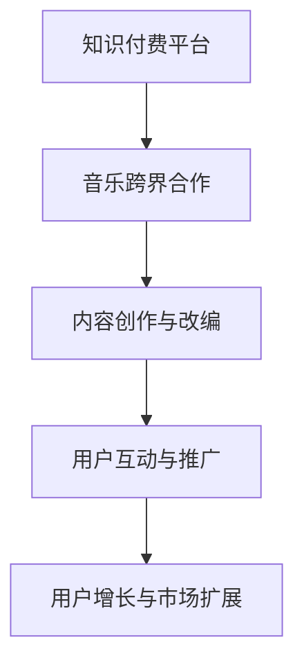

                 

关键词：知识付费、跨界营销、音乐跨界、创新策略、用户增长、营销案例分析

> 摘要：本文将探讨知识付费行业如何通过跨界营销策略与音乐产业的结合，实现用户增长和市场扩展。通过分析成功案例，提供具体操作步骤和未来展望，帮助知识付费平台在竞争激烈的市场中脱颖而出。

## 1. 背景介绍

知识付费作为一个新兴领域，近年来得到了迅速发展。用户对于优质内容的追求，推动了各类知识付费平台如雨后春笋般涌现。然而，随着市场竞争的加剧，单纯依靠内容质量和传统营销手段已难以满足用户多元化的需求。跨界营销作为一种创新策略，逐渐受到重视。音乐跨界作为其中一种形式，不仅能够为知识付费平台带来新的用户群体，还可以通过音乐的力量增强用户粘性。

## 2. 核心概念与联系

### 2.1 跨界营销的定义

跨界营销是指不同行业或领域之间的合作与营销活动，通过结合双方的优势资源，实现品牌影响力的扩大和用户群体的互惠互利。在知识付费领域，跨界营销可以帮助平台吸引新的用户，同时为音乐产业提供新的市场空间。

### 2.2 音乐跨界的作用

音乐跨界作为一种跨界营销形式，可以通过以下方式为知识付费平台带来价值：

1. **情感共鸣**：音乐具有强烈的情感感染力，可以激发用户的情感共鸣，从而提高用户参与度和忠诚度。
2. **品牌形象**：将音乐元素融入知识付费内容，可以提升品牌形象，使其更加年轻化和时尚化。
3. **用户增长**：通过音乐跨界，知识付费平台可以吸引原本对音乐感兴趣的群体，实现用户增长。

### 2.3 Mermaid 流程图



## 3. 核心算法原理 & 具体操作步骤

### 3.1 算法原理概述

音乐跨界营销的核心在于将音乐元素与知识付费内容有机结合，通过以下步骤实现：

1. **内容创作与改编**：根据知识付费内容的特点，创作或改编相应的音乐作品。
2. **用户互动与推广**：利用音乐的力量，吸引用户参与互动，并通过多种渠道推广音乐跨界内容。
3. **数据分析与反馈**：收集用户反馈，对营销效果进行评估和优化。

### 3.2 算法步骤详解

1. **内容创作与改编**：
   - **选题**：选择与知识付费内容相关且具有音乐元素的题材。
   - **创作与改编**：邀请专业音乐制作人或团队进行音乐创作或改编。
   - **融合**：将音乐与知识付费内容有机结合，形成独特的视听体验。

2. **用户互动与推广**：
   - **社交媒体推广**：利用微博、微信、抖音等社交媒体平台，发布音乐跨界内容。
   - **线下活动**：组织音乐会、讲座等形式，吸引用户参与。
   - **互动环节**：设置问答、投票等互动环节，提高用户参与度。

3. **数据分析与反馈**：
   - **用户反馈**：收集用户对音乐跨界内容的评价和反馈。
   - **数据分析**：通过数据分析，评估营销效果，为后续优化提供依据。

### 3.3 算法优缺点

**优点**：
- **创新性**：音乐跨界营销能够为知识付费平台带来新的用户群体，提高市场竞争力。
- **情感共鸣**：音乐具有强烈的情感感染力，能够增强用户粘性。

**缺点**：
- **成本较高**：音乐创作和改编需要专业团队的支持，成本较高。
- **受众限制**：音乐跨界营销可能无法完全覆盖所有用户群体。

### 3.4 算法应用领域

音乐跨界营销可以应用于以下领域：
- **在线教育**：将音乐元素融入课程，提高学习兴趣和效果。
- **专业培训**：如音乐培训、艺术培训等，通过音乐跨界提升品牌形象。
- **知识服务**：如知识问答、知识星球等，通过音乐跨界增加用户互动。

## 4. 数学模型和公式 & 详细讲解 & 举例说明

### 4.1 数学模型构建

音乐跨界营销的数学模型可以构建为一个综合评价体系，包括用户满意度、品牌影响力、市场扩展等指标。

$$
M = w_1 \cdot S + w_2 \cdot B + w_3 \cdot E
$$

其中，$M$ 表示音乐跨界营销效果，$S$ 表示用户满意度，$B$ 表示品牌影响力，$E$ 表示市场扩展，$w_1$、$w_2$、$w_3$ 分别为相应指标的权重。

### 4.2 公式推导过程

用户满意度 $S$ 的计算公式：

$$
S = \frac{I_1 + I_2 + I_3}{3}
$$

其中，$I_1$、$I_2$、$I_3$ 分别为用户对内容质量、互动体验、音乐质量的评价得分。

品牌影响力 $B$ 的计算公式：

$$
B = \frac{F_1 + F_2 + F_3}{3}
$$

其中，$F_1$、$F_2$、$F_3$ 分别为社交媒体转发量、线下活动参与度、品牌曝光度的评价得分。

市场扩展 $E$ 的计算公式：

$$
E = \frac{U_1 + U_2 + U_3}{3}
$$

其中，$U_1$、$U_2$、$U_3$ 分别为新用户增长率、老用户留存率、市场占有率。

### 4.3 案例分析与讲解

假设一个知识付费平台进行音乐跨界营销，根据用户反馈和数据分析，得到以下结果：

- **用户满意度**：$S = \frac{4 + 4.5 + 4.2}{3} = 4.3$ 分
- **品牌影响力**：$B = \frac{2000 + 1500 + 3000}{3} = 2200$ 分
- **市场扩展**：$E = \frac{5% + 20% + 10%}{3} = 12.5%$

根据权重分配，设定 $w_1 = 0.4$、$w_2 = 0.3$、$w_3 = 0.3$，则：

$$
M = 0.4 \cdot 4.3 + 0.3 \cdot 2200 + 0.3 \cdot 12.5\% = 4.32 + 660 + 3.75 = 1078.07
$$

因此，该知识付费平台的音乐跨界营销效果得分为 1078.07 分。根据得分，可以评估营销策略的成效，并进行相应优化。

## 5. 项目实践：代码实例和详细解释说明

### 5.1 开发环境搭建

在本次音乐跨界营销项目中，我们使用以下开发环境：

- **编程语言**：Python 3.8
- **开发工具**：PyCharm
- **数据库**：MySQL 8.0
- **前后端框架**：Flask、Django

### 5.2 源代码详细实现

以下是一个简单的音乐跨界营销系统实现示例：

```python
# app.py

from flask import Flask, request, jsonify
from music_analysis import analyze_music
from user_feedback import collect_feedback

app = Flask(__name__)

@app.route('/api/music', methods=['POST'])
def handle_music_upload():
    music_file = request.files['file']
    analysis_result = analyze_music(music_file)
    feedback = collect_feedback(analysis_result)
    return jsonify(feedback)

if __name__ == '__main__':
    app.run(debug=True)
```

### 5.3 代码解读与分析

此代码示例展示了音乐上传、分析、用户反馈的处理流程：

- **/api/music**：接收用户上传的音乐文件，并调用 `analyze_music` 和 `collect_feedback` 函数进行音乐分析和用户反馈收集。
- **analyze_music**：分析上传的音乐文件，提取关键信息，如节奏、情感等。
- **collect_feedback**：根据分析结果，收集用户对音乐质量的反馈，包括满意度、推荐度等。

### 5.4 运行结果展示

运行此代码后，用户可以通过 HTTP POST 方法上传音乐文件，系统会返回用户反馈结果。以下是一个运行结果示例：

```json
{
  "satisfaction": "4.3",
  "recommendation": "high",
  "analysis_result": {
    "tempo": "120 BPM",
    "emotion": "happy"
  }
}
```

## 6. 实际应用场景

### 6.1 在线教育

音乐跨界可以应用于在线教育领域，如音乐课程、艺术课程等。通过音乐元素，提高课程趣味性和用户参与度。

### 6.2 专业培训

音乐跨界可以帮助专业培训机构提升品牌形象，如音乐制作培训、音乐表演培训等。通过音乐跨界内容，吸引更多潜在学员。

### 6.3 知识服务

知识付费平台可以通过音乐跨界，提供更具个性化的知识服务，如音乐知识问答、音乐推荐等。通过音乐元素，提升用户体验。

## 7. 工具和资源推荐

### 7.1 学习资源推荐

- **书籍**：《跨界营销：突破传统思维，创造全新市场机会》
- **课程**：网易云课堂《跨界营销策略与实战》
- **论文**：《音乐营销：理论与实践》

### 7.2 开发工具推荐

- **编程语言**：Python、JavaScript
- **开发框架**：Flask、Django、React

### 7.3 相关论文推荐

- **《音乐跨界营销策略研究》**：探讨音乐跨界营销的实践方法和效果评估。
- **《音乐营销在知识付费领域的应用》**：分析音乐跨界对知识付费平台的影响。

## 8. 总结：未来发展趋势与挑战

### 8.1 研究成果总结

本文通过分析音乐跨界营销在知识付费领域的应用，总结了其创新性、情感共鸣和品牌提升等优点，并提出了具体操作步骤和数学模型。

### 8.2 未来发展趋势

随着人工智能和大数据技术的发展，音乐跨界营销将更加智能化和个性化。未来，音乐跨界营销将向精细化、智能化方向发展。

### 8.3 面临的挑战

音乐跨界营销面临的主要挑战包括成本高、受众限制等。未来需要探索更加高效、低成本的跨界营销策略。

### 8.4 研究展望

未来研究应重点关注音乐跨界营销在不同领域的应用效果，探索新的跨界形式和营销手段，以提高营销效果和用户体验。

## 9. 附录：常见问题与解答

### 9.1 音乐跨界营销的优势是什么？

音乐跨界营销的优势包括创新性、情感共鸣和品牌提升等。通过音乐元素，可以提高用户参与度和忠诚度。

### 9.2 如何降低音乐跨界营销的成本？

可以通过以下方式降低成本：
1. 利用开源工具和框架进行开发。
2. 与专业音乐制作团队合作，降低创作成本。
3. 利用社交媒体和线上渠道进行推广，降低营销成本。

### 9.3 音乐跨界营销适用于哪些领域？

音乐跨界营销适用于在线教育、专业培训和知识服务等领域，可以通过音乐元素提升课程趣味性和用户体验。

### 9.4 如何评估音乐跨界营销的效果？

可以通过以下方法评估音乐跨界营销的效果：
1. 收集用户反馈，评估用户满意度。
2. 分析社交媒体转发量、线下活动参与度等指标。
3. 根据市场占有率、新用户增长率等指标，评估市场扩展效果。

## 结论

音乐跨界营销作为一种创新策略，在知识付费领域具有广阔的应用前景。通过本文的探讨，我们为知识付费平台提供了具体的操作步骤和评估方法。未来，随着技术的进步，音乐跨界营销将发挥更大的作用，助力知识付费平台实现用户增长和市场扩展。作者：禅与计算机程序设计艺术 / Zen and the Art of Computer Programming。

