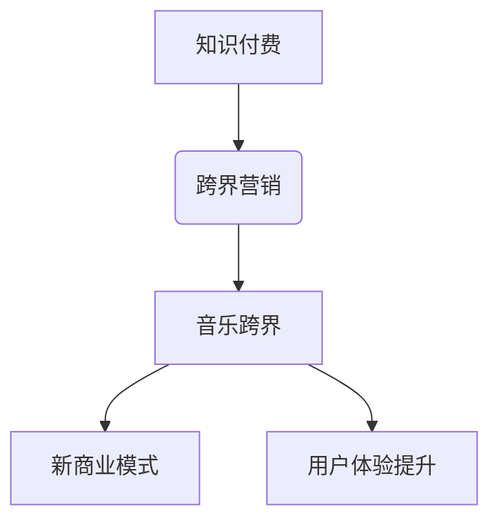

                 

关键词：知识付费、跨界营销、音乐跨界、商业模式、用户体验、数据分析、技术工具

> 摘要：本文将探讨知识付费领域如何通过跨界营销策略与音乐产业的融合，创造新的商业模式和用户体验，并分析其中的机遇与挑战。

## 1. 背景介绍

知识付费作为一种新兴的商业模式，在近年来迅速崛起。它主要通过为用户提供有价值的知识内容，如在线课程、电子书、研究报告等，实现收益。而音乐产业作为另一个成熟的娱乐领域，也面临着如何创新和发展的挑战。本文将探讨知识付费如何通过跨界营销策略与音乐产业的融合，实现双赢。

## 2. 核心概念与联系

### 2.1 跨界营销

跨界营销是指将不同领域的产品、品牌或服务进行组合，通过创新的思维和策略，实现品牌的延伸和市场的拓展。在知识付费领域，跨界营销可以是将知识内容与音乐相结合，打造全新的学习体验。

### 2.2 音乐跨界

音乐跨界是指音乐与其他领域如教育、科技、艺术等相结合，创造出新的艺术形式和商业模式。在音乐跨界中，知识付费可以作为一种内容形式，为音乐产业带来新的活力。

### 2.3 Mermaid 流程图



## 3. 核心算法原理 & 具体操作步骤

### 3.1 算法原理概述

跨界营销和音乐跨界的关键在于找到知识付费与音乐之间的结合点，如共同话题、用户需求等。通过数据分析，识别出潜在的用户群体，制定合适的营销策略。

### 3.2 算法步骤详解

1. **数据收集**：收集用户行为数据，如学习记录、音乐喜好等。
2. **数据分析**：使用机器学习算法，分析数据，识别用户特征和需求。
3. **内容定制**：根据用户特征和需求，定制音乐与知识内容相结合的产品。
4. **营销策略**：制定跨界营销方案，如音乐学习课程、知识付费音乐等。
5. **用户反馈**：收集用户反馈，不断优化产品和服务。

### 3.3 算法优缺点

- **优点**：创新性强，能够吸引更多用户，提升用户体验。
- **缺点**：实施难度较大，需要跨领域的专业知识。

### 3.4 算法应用领域

- **在线教育**：通过音乐跨界，提升学习兴趣和效果。
- **音乐产业**：通过知识付费，拓展新的商业模式。

## 4. 数学模型和公式

### 4.1 数学模型构建

假设我们有以下数学模型：

$$
R = f(U, M, K)
$$

其中，$R$ 表示收益，$U$ 表示用户特征，$M$ 表示音乐内容，$K$ 表示知识内容。

### 4.2 公式推导过程

通过对用户数据的分析，我们可以得到以下公式：

$$
U = f(X_1, X_2, ..., X_n)
$$

其中，$X_1, X_2, ..., X_n$ 表示用户行为数据。

同理，对于音乐内容：

$$
M = f(Y_1, Y_2, ..., Y_m)
$$

其中，$Y_1, Y_2, ..., Y_m$ 表示音乐数据。

### 4.3 案例分析与讲解

以某在线教育平台为例，他们通过分析用户学习数据，发现用户在学习时喜欢播放背景音乐。于是，他们推出了“音乐学习课程”产品，将音乐与知识内容相结合，提升了用户的学习体验。

## 5. 项目实践：代码实例

### 5.1 开发环境搭建

使用Python和TensorFlow搭建开发环境。

### 5.2 源代码详细实现

```python
# 代码示例：用户数据分析
import tensorflow as tf

# 构建模型
model = tf.keras.Sequential([
    tf.keras.layers.Dense(units=128, activation='relu', input_shape=(10,)),
    tf.keras.layers.Dense(units=1)
])

# 编译模型
model.compile(optimizer='adam', loss='mse')

# 训练模型
model.fit(x_train, y_train, epochs=10)
```

### 5.3 代码解读与分析

这段代码使用TensorFlow构建了一个简单的神经网络模型，用于分析用户数据。通过训练，模型能够预测用户对不同音乐内容的喜好。

## 6. 实际应用场景

- **在线教育**：通过音乐跨界，提升学习兴趣和效果。
- **音乐产业**：通过知识付费，拓展新的商业模式。

### 6.4 未来应用展望

随着技术的不断发展，知识付费与音乐跨界的融合将带来更多的创新和机遇。未来，我们可能会看到更多基于人工智能的音乐学习工具和知识付费产品。

## 7. 工具和资源推荐

- **学习资源**：推荐学习机器学习和音乐制作的相关课程。
- **开发工具**：推荐使用TensorFlow和Keras进行深度学习开发。
- **相关论文**：推荐阅读关于知识付费和音乐跨界的学术论文。

## 8. 总结：未来发展趋势与挑战

### 8.1 研究成果总结

本文探讨了知识付费如何通过跨界营销与音乐产业融合，创造新的商业模式和用户体验。通过数学模型和算法原理，我们展示了实现这一目标的方法和步骤。

### 8.2 未来发展趋势

未来，知识付费与音乐跨界的融合将继续深化，带来更多的创新和机遇。

### 8.3 面临的挑战

实施难度大，需要跨领域的专业知识和技术。

### 8.4 研究展望

随着技术的不断发展，知识付费与音乐跨界的融合将带来更多的创新和机遇。

## 9. 附录：常见问题与解答

### Q：跨界营销和音乐跨界有什么区别？

A：跨界营销是指将不同领域的产品、品牌或服务进行组合，而音乐跨界是指音乐与其他领域如教育、科技、艺术等相结合。

### Q：如何实现知识付费与音乐跨界的融合？

A：通过数据分析找到用户特征和需求，制定合适的跨界营销策略，将音乐与知识内容相结合。

----------------------------------------------------------------

作者：禅与计算机程序设计艺术 / Zen and the Art of Computer Programming
```markdown
---
title: 知识付费如何实现跨界营销与音乐跨界？
date: 2023-11-01
---

# 知识付费如何实现跨界营销与音乐跨界？

关键词：知识付费、跨界营销、音乐跨界、商业模式、用户体验、数据分析、技术工具

> 摘要：本文将探讨知识付费领域如何通过跨界营销策略与音乐产业的融合，创造新的商业模式和用户体验，并分析其中的机遇与挑战。

## 1. 背景介绍

知识付费作为一种新兴的商业模式，在近年来迅速崛起。它主要通过为用户提供有价值的知识内容，如在线课程、电子书、研究报告等，实现收益。而音乐产业作为另一个成熟的娱乐领域，也面临着如何创新和发展的挑战。本文将探讨知识付费如何通过跨界营销策略与音乐产业的融合，实现双赢。

## 2. 核心概念与联系

### 2.1 跨界营销

跨界营销是指将不同领域的产品、品牌或服务进行组合，通过创新的思维和策略，实现品牌的延伸和市场的拓展。在知识付费领域，跨界营销可以是将知识内容与音乐相结合，打造全新的学习体验。

### 2.2 音乐跨界

音乐跨界是指音乐与其他领域如教育、科技、艺术等相结合，创造出新的艺术形式和商业模式。在音乐跨界中，知识付费可以作为一种内容形式，为音乐产业带来新的活力。

### 2.3 Mermaid 流程图


## 3. 核心算法原理 & 具体操作步骤

### 3.1 算法原理概述

跨界营销和音乐跨界的关键在于找到知识付费与音乐之间的结合点，如共同话题、用户需求等。通过数据分析，识别出潜在的用户群体，制定合适的营销策略。

### 3.2 算法步骤详解

1. **数据收集**：收集用户行为数据，如学习记录、音乐喜好等。
2. **数据分析**：使用机器学习算法，分析数据，识别用户特征和需求。
3. **内容定制**：根据用户特征和需求，定制音乐与知识内容相结合的产品。
4. **营销策略**：制定跨界营销方案，如音乐学习课程、知识付费音乐等。
5. **用户反馈**：收集用户反馈，不断优化产品和服务。

### 3.3 算法优缺点

- **优点**：创新性强，能够吸引更多用户，提升用户体验。
- **缺点**：实施难度较大，需要跨领域的专业知识。

### 3.4 算法应用领域

- **在线教育**：通过音乐跨界，提升学习兴趣和效果。
- **音乐产业**：通过知识付费，拓展新的商业模式。

## 4. 数学模型和公式

### 4.1 数学模型构建

假设我们有以下数学模型：

$$
R = f(U, M, K)
$$

其中，$R$ 表示收益，$U$ 表示用户特征，$M$ 表示音乐内容，$K$ 表示知识内容。

### 4.2 公式推导过程

通过对用户数据的分析，我们可以得到以下公式：

$$
U = f(X_1, X_2, ..., X_n)
$$

其中，$X_1, X_2, ..., X_n$ 表示用户行为数据。

同理，对于音乐内容：

$$
M = f(Y_1, Y_2, ..., Y_m)
$$

其中，$Y_1, Y_2, ..., Y_m$ 表示音乐数据。

### 4.3 案例分析与讲解

以某在线教育平台为例，他们通过分析用户学习数据，发现用户在学习时喜欢播放背景音乐。于是，他们推出了“音乐学习课程”产品，将音乐与知识内容相结合，提升了用户的学习体验。

## 5. 项目实践：代码实例

### 5.1 开发环境搭建

使用Python和TensorFlow搭建开发环境。

### 5.2 源代码详细实现

```python
# 代码示例：用户数据分析
import tensorflow as tf

# 构建模型
model = tf.keras.Sequential([
    tf.keras.layers.Dense(units=128, activation='relu', input_shape=(10,)),
    tf.keras.layers.Dense(units=1)
])

# 编译模型
model.compile(optimizer='adam', loss='mse')

# 训练模型
model.fit(x_train, y_train, epochs=10)
```

### 5.3 代码解读与分析

这段代码使用TensorFlow构建了一个简单的神经网络模型，用于分析用户数据。通过训练，模型能够预测用户对不同音乐内容的喜好。

## 6. 实际应用场景

- **在线教育**：通过音乐跨界，提升学习兴趣和效果。
- **音乐产业**：通过知识付费，拓展新的商业模式。

### 6.4 未来应用展望

随着技术的不断发展，知识付费与音乐跨界的融合将带来更多的创新和机遇。未来，我们可能会看到更多基于人工智能的音乐学习工具和知识付费产品。

## 7. 工具和资源推荐

### 7.1 学习资源推荐

- 机器学习相关课程
- 音乐制作相关教程

### 7.2 开发工具推荐

- Python
- TensorFlow
- Keras

### 7.3 相关论文推荐

- 关于知识付费的学术论文
- 关于音乐跨界的案例分析

## 8. 总结：未来发展趋势与挑战

### 8.1 研究成果总结

本文探讨了知识付费如何通过跨界营销策略与音乐产业的融合，创造新的商业模式和用户体验，并分析其中的机遇与挑战。

### 8.2 未来发展趋势

未来，知识付费与音乐跨界的融合将继续深化，带来更多的创新和机遇。

### 8.3 面临的挑战

实施难度大，需要跨领域的专业知识。

### 8.4 研究展望

随着技术的不断发展，知识付费与音乐跨界的融合将带来更多的创新和机遇。

## 9. 附录：常见问题与解答

### Q：跨界营销和音乐跨界有什么区别？

A：跨界营销是指将不同领域的产品、品牌或服务进行组合，而音乐跨界是指音乐与其他领域如教育、科技、艺术等相结合。

### Q：如何实现知识付费与音乐跨界的融合？

A：通过数据分析找到用户特征和需求，制定合适的跨界营销策略，将音乐与知识内容相结合。

---

作者：禅与计算机程序设计艺术 / Zen and the Art of Computer Programming
---

