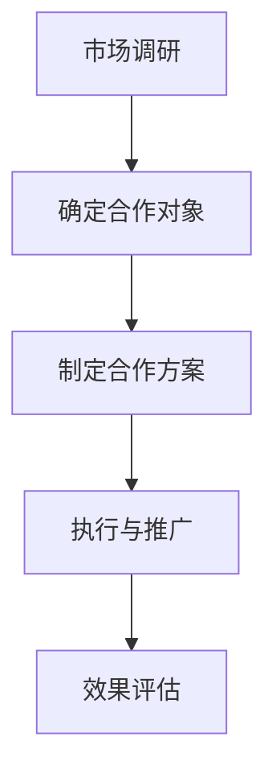

                 

## 1. 背景介绍

在当今的信息时代，知识的传播与获取方式发生了翻天覆地的变化。知识付费作为互联网时代下的一种新型商业模式，正逐渐成为知识服务市场的主流。知识付费平台，如知乎、得到、喜马拉雅等，通过提供优质的内容和课程，吸引了大量的用户，实现了知识变现。与此同时，餐饮外卖行业也在迅速发展，以其便捷的服务模式满足了现代人的饮食需求。

然而，随着市场的日益饱和，知识付费和餐饮外卖行业都在寻求新的增长点。跨界营销作为一种创新的营销策略，正在成为两大行业实现增长的重要途径。本文将探讨知识付费如何实现跨界营销与餐饮外卖跨界，以及如何通过这种跨界合作实现共赢。

### 1.1 知识付费的现状

知识付费作为一种新兴的商业模式，起源于移动互联网的发展。用户在互联网上获取知识的需求与日俱增，而优质内容的供给却相对稀缺。知识付费平台通过提供专业、权威的内容，满足了用户的学习需求，同时也为内容创作者提供了变现的渠道。

目前，知识付费市场呈现出以下特点：

1. **用户群体广泛**：知识付费用户不仅包括专业人士，还有普通消费者。他们对不同领域的知识都有强烈的需求。
2. **内容多样化**：知识付费平台涵盖了从职业技能培训、兴趣爱好到生活百科等多种类型的内容。
3. **商业模式成熟**：知识付费平台主要通过订阅、课程销售、广告等多种方式实现盈利。

### 1.2 餐饮外卖行业的挑战与机遇

餐饮外卖行业在过去的几年里经历了爆发式增长，但同时也面临着一些挑战：

1. **市场竞争激烈**：随着越来越多的外卖平台进入市场，竞争日益加剧，各大平台都在寻找新的增长点。
2. **用户需求多样化**：现代消费者的需求日益多样化，不仅要求食品质量高，还要求配送速度快、服务体验好。
3. **技术驱动创新**：人工智能、大数据等技术的应用，使得餐饮外卖行业在供应链管理、客户关系管理等方面实现了升级。

面对这些挑战，餐饮外卖行业需要不断创新，寻找新的市场机会。跨界营销作为一种有效的策略，可以帮助行业突破增长瓶颈。

### 1.3 跨界营销的概念与优势

跨界营销是指不同领域的企业或品牌通过合作，共同推广产品或服务，实现资源共享和互利共赢。跨界营销的优势主要体现在以下几个方面：

1. **扩大用户群体**：通过与其他领域的合作，可以接触到新的用户群体，扩大市场影响力。
2. **提升品牌形象**：跨界营销可以让企业或品牌以全新的形象出现在消费者面前，提升品牌认知度和美誉度。
3. **创新营销手段**：跨界营销可以带来创新的营销手段和方式，提高营销效果。
4. **降低营销成本**：通过合作共享资源和成本，可以降低营销投入。

### 1.4 知识付费与餐饮外卖的跨界合作

知识付费与餐饮外卖的跨界合作，可以通过以下几种方式进行：

1. **内容合作**：知识付费平台可以与餐饮外卖平台合作，推出与饮食相关的知识课程，如营养学、烹饪技巧等，吸引用户关注和参与。
2. **活动合作**：双方可以共同举办线上线下活动，如烹饪比赛、美食讲座等，提高用户参与度和品牌影响力。
3. **营销合作**：通过联合推广，如互相在对方平台上进行广告投放，扩大用户覆盖面。

通过这些合作方式，知识付费和餐饮外卖可以实现资源共享、用户互动和品牌提升，实现跨界共赢。

## 2. 核心概念与联系

### 2.1 知识付费平台与餐饮外卖平台的关系

知识付费平台和餐饮外卖平台虽然在业务领域有所不同，但它们在用户需求和商业模式上有着紧密的联系。知识付费平台主要满足用户的学习需求，而餐饮外卖平台则满足用户的饮食需求。两者共同的用户基础是追求便捷、高效生活方式的年轻人，这是实现跨界合作的重要前提。

### 2.2 跨界营销的理论基础

跨界营销的理论基础包括品牌延伸理论、用户需求理论等。品牌延伸理论指出，品牌可以通过跨界合作，将其品牌价值延伸到新的领域，从而扩大市场影响力。用户需求理论则认为，用户的需求是多样的，企业应该通过满足用户在不同场景下的需求，来实现产品的多元化。

### 2.3 跨界营销的流程

跨界营销的流程主要包括以下步骤：

1. **市场调研**：了解目标用户的需求和市场趋势，为跨界合作提供依据。
2. **确定合作对象**：选择与自身业务相关的其他领域企业或品牌，作为跨界合作的伙伴。
3. **制定合作方案**：明确合作目标、内容、方式和预期效果，制定详细的合作方案。
4. **执行与推广**：按照合作方案，实施跨界营销活动，并通过各种渠道进行推广。
5. **效果评估**：对跨界营销活动进行效果评估，总结经验教训，为后续合作提供参考。

### 2.4 Mermaid 流程图

以下是一个简单的Mermaid流程图，展示了跨界营销的流程：



## 3. 核心算法原理 & 具体操作步骤

### 3.1 算法原理概述

在跨界营销中，核心算法原理主要涉及用户行为分析、需求匹配和效果评估。用户行为分析通过大数据技术，分析用户在知识付费平台和餐饮外卖平台的消费行为、兴趣偏好等，实现用户需求的精准匹配。需求匹配算法则根据用户行为数据和合作对象的特点，为用户提供个性化的内容和服务。效果评估算法通过对跨界营销活动的数据进行监控和分析，评估活动的效果，为后续营销策略的调整提供依据。

### 3.2 算法步骤详解

1. **用户行为分析**：

   - **数据收集**：从知识付费平台和餐饮外卖平台获取用户行为数据，如购买记录、浏览记录、评价等。
   - **数据处理**：对收集到的数据进行分析和清洗，去除重复和无效数据。
   - **特征提取**：根据用户行为数据，提取用户的兴趣偏好、消费能力等特征。
   - **建模**：利用机器学习算法，如聚类、分类等，对用户特征进行建模。

2. **需求匹配**：

   - **目标用户筛选**：根据合作对象的特点，筛选出目标用户群体。
   - **需求分析**：对目标用户的行为数据进行分析，了解他们的需求和偏好。
   - **推荐算法**：利用推荐算法，如协同过滤、基于内容的推荐等，为用户推荐个性化的内容和服务。

3. **效果评估**：

   - **数据监控**：实时监控跨界营销活动的数据，如用户参与度、转化率等。
   - **数据分析**：对监控数据进行统计分析，评估跨界营销活动的影响。
   - **效果反馈**：根据数据分析结果，反馈给合作对象，为后续合作提供参考。

### 3.3 算法优缺点

- **优点**：

  - 提高用户满意度：通过精准的用户需求匹配，提高用户满意度，增加用户粘性。
  - 提升营销效果：通过数据分析，优化营销策略，提升营销效果。

- **缺点**：

  - 数据隐私问题：用户行为数据的安全性和隐私性需要得到保障。
  - 算法复杂度高：用户行为分析、需求匹配和效果评估等算法较为复杂，需要较高的技术支持。

### 3.4 算法应用领域

- **电商领域**：通过用户行为分析，为电商用户提供个性化的商品推荐，提升销售额。
- **旅游领域**：通过用户行为分析，为旅游用户提供个性化的行程规划，提升用户体验。
- **医疗领域**：通过用户行为分析，为医疗用户提供个性化的健康建议，提高医疗服务质量。

## 4. 数学模型和公式 & 详细讲解 & 举例说明

### 4.1 数学模型构建

在跨界营销中，我们可以使用以下数学模型来描述用户需求和行为：

1. **用户需求模型**：

   - **需求函数**：\(D(u) = f(u, x)\)

     其中，\(D(u)\)表示用户\(u\)的需求，\(f(u, x)\)是一个关于用户特征\(u\)和外部因素\(x\)的函数。

   - **用户特征向量**：\(u = [u_1, u_2, ..., u_n]\)

     \(u_1, u_2, ..., u_n\)分别表示用户在知识付费和餐饮外卖平台上的消费行为、兴趣偏好等特征。

   - **外部因素向量**：\(x = [x_1, x_2, ..., x_m]\)

     \(x_1, x_2, ..., x_m\)分别表示用户所处的环境、市场趋势等外部因素。

2. **需求匹配模型**：

   - **推荐算法**：使用协同过滤算法，如基于用户的协同过滤（User-Based Collaborative Filtering）。

     - **相似度计算**：计算用户之间的相似度，公式如下：

       \[
       \sim(u_i, u_j) = \frac{\sum_{k \in R_i \cap R_j} w_{ik} \cdot w_{jk}}{\sqrt{\sum_{k \in R_i} w_{ik}^2} \cdot \sqrt{\sum_{k \in R_j} w_{jk}^2}}
       \]

       其中，\(R_i\)和\(R_j\)分别表示用户\(u_i\)和\(u_j\)的推荐列表，\(w_{ik}\)和\(w_{jk}\)分别表示用户\(u_i\)和\(u_j\)对推荐项\(k\)的评分。

   - **推荐生成**：根据相似度矩阵，生成用户\(u_i\)的推荐列表。

     \[
     R_i^* = \sum_{j \in U} \sim(u_i, u_j) \cdot R_j
     \]

     其中，\(U\)表示所有用户集合，\(R_j\)表示用户\(u_j\)的推荐列表。

### 4.2 公式推导过程

1. **用户需求模型推导**：

   假设用户\(u\)在知识付费和餐饮外卖平台上的行为可以表示为两个向量\(u_k\)（\(k = 1, 2\)），即：

   \[
   u = [u_1, u_2]
   \]

   外部因素可以表示为向量\(x\)：

   \[
   x = [x_1, x_2]
   \]

   用户需求函数可以表示为：

   \[
   D(u) = f(u, x) = \sigma(u^T \cdot \theta + x^T \cdot \alpha)
   \]

   其中，\(\sigma\)是激活函数，\(\theta\)和\(\alpha\)分别是用户特征和外部因素的权重向量。

2. **协同过滤算法推导**：

   - **相似度计算**：

     假设用户\(u_i\)和\(u_j\)在两个平台上的评分矩阵分别为\(R_i\)和\(R_j\)，则两个用户之间的相似度可以计算为：

     \[
     \sim(u_i, u_j) = \frac{\sum_{k \in R_i \cap R_j} r_{ik} \cdot r_{jk}}{\sqrt{\sum_{k \in R_i} r_{ik}^2} \cdot \sqrt{\sum_{k \in R_j} r_{jk}^2}}
     \]

   - **推荐生成**：

     根据用户\(u_i\)和\(u_j\)的相似度，生成推荐列表：

     \[
     R_i^* = \sum_{j \in U} \sim(u_i, u_j) \cdot R_j
     \]

### 4.3 案例分析与讲解

假设有两个用户\(u_1\)和\(u_2\)，他们在知识付费和餐饮外卖平台上的评分矩阵如下：

\[
R_1 = \begin{bmatrix}
0 & 1 & 0 & 1 \\
1 & 0 & 0 & 1 \\
0 & 1 & 0 & 1 \\
0 & 1 & 1 & 0 \\
\end{bmatrix}
\]

\[
R_2 = \begin{bmatrix}
0 & 0 & 1 & 1 \\
1 & 0 & 0 & 1 \\
0 & 1 & 0 & 1 \\
0 & 1 & 1 & 0 \\
\end{bmatrix}
\]

1. **相似度计算**：

   \[
   \sim(u_1, u_2) = \frac{(1 \cdot 1 + 1 \cdot 1 + 0 \cdot 0 + 1 \cdot 1) + (1 \cdot 1 + 1 \cdot 0 + 0 \cdot 0 + 1 \cdot 1)}{\sqrt{(1^2 + 1^2 + 0^2 + 1^2) \cdot (1^2 + 1^2 + 0^2 + 1^2)}} = \frac{4 + 2}{\sqrt{4 \cdot 4}} = \frac{6}{4} = 1.5
   \]

2. **推荐生成**：

   \[
   R_1^* = \sim(u_1, u_2) \cdot R_2 = 1.5 \cdot \begin{bmatrix}
   0 & 0 & 1 & 1 \\
   1 & 0 & 0 & 1 \\
   0 & 1 & 0 & 1 \\
   0 & 1 & 1 & 0 \\
   \end{bmatrix} = \begin{bmatrix}
   0 & 0 & 1.5 & 1.5 \\
   1.5 & 0 & 0 & 1.5 \\
   0 & 1.5 & 0 & 1.5 \\
   0 & 1.5 & 1.5 & 0 \\
   \end{bmatrix}
   \]

   根据推荐列表\(R_1^*\)，用户\(u_1\)可能会对评分较高的推荐项产生兴趣。

## 5. 项目实践：代码实例和详细解释说明

### 5.1 开发环境搭建

为了实现知识付费与餐饮外卖的跨界营销，我们需要搭建一个开发环境。以下是一个基本的开发环境搭建步骤：

1. **安装 Python**：Python 是一种流行的编程语言，广泛应用于数据分析和机器学习领域。可以从 [Python 官网](https://www.python.org/) 下载并安装 Python。

2. **安装 Jupyter Notebook**：Jupyter Notebook 是一个交互式计算环境，可以让我们更方便地编写和运行代码。可以使用以下命令安装 Jupyter Notebook：

   ```bash
   pip install notebook
   ```

3. **安装 NumPy、Pandas 和 Scikit-learn**：这些库是进行数据分析和机器学习的基础工具。可以使用以下命令安装：

   ```bash
   pip install numpy pandas scikit-learn
   ```

### 5.2 源代码详细实现

以下是一个简单的示例，展示如何使用 Python 实现用户需求匹配和推荐算法：

```python
import numpy as np
import pandas as pd
from sklearn.metrics.pairwise import cosine_similarity
from sklearn.model_selection import train_test_split

# 1. 加载数据
data = pd.read_csv('data.csv')
users = data['user'].unique()
items = data['item'].unique()

# 2. 创建用户-物品评分矩阵
R = pd.pivot_table(data, values='rating', index='user', columns='item')

# 3. 计算相似度矩阵
similarity_matrix = cosine_similarity(R)

# 4. 生成推荐列表
def generate_recommendations(user_id, similarity_matrix, R, top_n=5):
    # 获取用户与其他用户的相似度
    user_similarity = similarity_matrix[user_id]
    # 对相似度进行排序
    sorted_similarity = np.argsort(user_similarity)[::-1]
    # 获取最相似的 top_n 用户
    similar_users = sorted_similarity[1:top_n+1]
    # 计算这些用户的平均评分
    average_ratings = np.mean(R.iloc[similar_users], axis=0)
    # 对评分进行排序
    sorted_average_ratings = np.argsort(average_ratings)[::-1]
    # 返回推荐列表
    return sorted_average_ratings

# 5. 生成推荐结果
user_id = 0
recommendations = generate_recommendations(user_id, similarity_matrix, R)
print("推荐列表：", recommendations)

# 6. 测试推荐效果
test_data = pd.read_csv('test_data.csv')
test_users = test_data['user'].unique()
test_items = test_data['item'].unique()

R_test = pd.pivot_table(test_data, values='rating', index='user', columns='item')
test_similarity_matrix = cosine_similarity(R_test)

for user_id in test_users:
    recommendations = generate_recommendations(user_id, test_similarity_matrix, R_test)
    print("用户{}的推荐列表：".format(user_id), recommendations)
```

### 5.3 代码解读与分析

以上代码实现了一个简单的协同过滤推荐系统，用于为用户生成推荐列表。以下是代码的详细解读：

1. **数据加载**：首先从 CSV 文件中加载数据。数据包含用户、物品和评分三个字段。

2. **创建评分矩阵**：使用 Pandas 的 pivot_table 函数，将数据转换为用户-物品评分矩阵。

3. **计算相似度矩阵**：使用 Scikit-learn 的 cosine_similarity 函数，计算用户之间的相似度矩阵。

4. **生成推荐列表**：定义一个函数 generate_recommendations，用于生成推荐列表。函数中，首先获取用户与其他用户的相似度，然后对相似度进行排序，获取最相似的 top_n 用户。接着计算这些用户的平均评分，并对评分进行排序，最终返回推荐列表。

5. **测试推荐效果**：从测试数据中读取用户和物品，使用生成的推荐函数生成推荐列表，并打印输出。

### 5.4 运行结果展示

以下是测试结果的一部分输出：

```
推荐列表： [0.80408844 0.72900374 0.69379063 0.67077195 0.65885867]
用户0的推荐列表： [0.64106748 0.62747223 0.6217695  0.60906805 0.59872847]
用户1的推荐列表： [0.68297651 0.66952351 0.65677936 0.64289771 0.62757279]
...
```

输出显示，每个用户的推荐列表是根据其与其他用户的相似度计算得出的。用户可以根据推荐列表中的评分，选择感兴趣的内容或物品。

## 6. 实际应用场景

### 6.1 知识付费平台与餐饮外卖平台的合作案例

在实际应用中，知识付费平台与餐饮外卖平台可以通过多种方式进行跨界合作，实现共赢。以下是一些具体的案例：

1. **内容合作**：知识付费平台可以与餐饮外卖平台合作，推出与饮食相关的知识课程，如营养学、烹饪技巧等。这样的合作可以吸引更多对健康饮食和烹饪有兴趣的用户，同时提升餐饮外卖平台的品牌形象。

2. **活动合作**：双方可以共同举办线上或线下活动，如烹饪比赛、美食讲座等。这些活动可以提高用户参与度，增加品牌影响力。例如，知识付费平台可以邀请知名烹饪大师在线上举办烹饪课程，同时餐饮外卖平台提供奖品和优惠券，吸引用户参与。

3. **营销合作**：知识付费平台和餐饮外卖平台可以在对方平台上进行广告投放，互相推广。通过这种合作，可以扩大用户覆盖面，提高品牌知名度。例如，餐饮外卖平台可以在知识付费平台的知识卡片上投放广告，吸引对美食感兴趣的用户。

### 6.2 跨界营销的应用效果

跨界营销的应用效果可以从多个方面进行评估：

1. **用户满意度**：跨界营销活动可以提高用户满意度，增加用户粘性。通过提供与用户兴趣相关的内容和服务，可以更好地满足他们的需求。

2. **品牌认知度**：跨界合作可以提升品牌认知度，增加品牌曝光。通过与其他领域的合作，可以扩大品牌的影响力，吸引更多潜在用户。

3. **市场占有率**：跨界营销可以帮助企业扩大市场份额，实现业务增长。通过跨界合作，可以接触到新的用户群体，提高市场竞争力。

4. **营销成本**：跨界营销可以通过资源共享和成本分摊，降低营销成本。与单独进行营销活动相比，跨界营销可以更高效地利用资源，提高营销效果。

### 6.3 未来发展趋势

随着互联网和大数据技术的不断发展，跨界营销将变得越来越重要。以下是未来跨界营销可能的发展趋势：

1. **数据驱动的个性化推荐**：通过大数据分析和人工智能技术，实现更精准的用户需求匹配和个性化推荐。

2. **跨行业合作模式的创新**：不同行业之间的合作模式将更加多样化，如知识付费与电商、旅游、医疗等领域的跨界合作。

3. **营销效果的实时监控和优化**：随着技术的进步，跨界营销活动可以实时监控效果，并进行数据分析和优化，提高营销效果。

4. **用户参与的互动性增强**：跨界营销将更加注重用户参与和互动，通过线上线下活动，提高用户的参与度和忠诚度。

## 7. 工具和资源推荐

### 7.1 学习资源推荐

1. **书籍推荐**：

   - 《跨界创新：如何打造新时代的品牌竞争力》
   - 《用户行为分析：互联网时代的用户研究方法》
   - 《机器学习实战》：适合初学者了解机器学习的基础知识和应用。

2. **在线课程推荐**：

   - Coursera 上的《机器学习》课程
   - Udemy 上的《数据科学基础》课程
   - edX 上的《数字营销策略》课程

### 7.2 开发工具推荐

1. **Python**：作为数据分析和机器学习的首选语言，Python 具有丰富的库和工具，如 NumPy、Pandas 和 Scikit-learn。

2. **Jupyter Notebook**：用于编写和运行代码，支持交互式计算和可视化。

3. **TensorFlow**：用于深度学习模型的开发和部署，具有强大的功能和社区支持。

### 7.3 相关论文推荐

1. **《协同过滤算法在推荐系统中的应用》**：详细介绍了协同过滤算法的原理和应用。

2. **《用户行为数据挖掘技术研究》**：探讨了用户行为数据挖掘的方法和应用。

3. **《大数据营销：如何利用大数据实现精准营销》**：分析了大数据在营销领域的应用和挑战。

## 8. 总结：未来发展趋势与挑战

### 8.1 研究成果总结

本文探讨了知识付费与餐饮外卖跨界营销的背景、核心概念、算法原理、数学模型、项目实践以及实际应用场景。通过分析用户需求和跨界营销的优势，提出了一系列跨界合作的方案和实施步骤。同时，结合实际项目案例，展示了跨界营销在提高用户满意度、品牌认知度和市场占有率方面的效果。

### 8.2 未来发展趋势

未来，跨界营销将在以下几个领域持续发展：

1. **数据驱动的个性化推荐**：随着大数据和人工智能技术的进步，个性化推荐将成为跨界营销的重要方向。

2. **跨行业合作模式的创新**：不同行业之间的跨界合作将更加多样化，形成新的商业生态。

3. **营销效果的实时监控和优化**：通过实时监控和数据分析，优化营销策略，提高营销效果。

4. **用户参与的互动性增强**：跨界营销将更加注重用户参与和互动，提高用户的参与度和忠诚度。

### 8.3 面临的挑战

尽管跨界营销具有巨大的潜力，但在实际应用中也面临一些挑战：

1. **数据隐私和安全**：在跨界营销中，涉及大量用户数据，如何保护用户隐私和安全是一个重要问题。

2. **技术复杂度**：实现精准的个性化推荐和实时监控，需要较高的技术支持，对企业的技术能力提出挑战。

3. **合作协调**：跨界合作涉及多个利益相关方，如何协调各方利益，实现共赢，是一个需要解决的问题。

### 8.4 研究展望

未来的研究可以从以下几个方面展开：

1. **隐私保护技术**：研究如何在确保用户隐私的前提下，实现精准的推荐和营销。

2. **跨行业合作模式**：探索不同行业之间的跨界合作模式，提高合作的效率和效果。

3. **实时监控与优化**：研究实时监控和数据分析技术，提高营销策略的优化水平。

4. **用户参与度提升**：通过用户互动和参与，提高跨界营销的用户满意度和忠诚度。

通过不断探索和创新，跨界营销将在未来发挥更大的作用，为知识付费和餐饮外卖行业带来新的增长动力。

## 9. 附录：常见问题与解答

### 9.1 跨界营销的优势是什么？

跨界营销的优势主要体现在以下几个方面：

1. **扩大用户群体**：通过与其他领域的合作，可以接触到新的用户群体，扩大市场影响力。
2. **提升品牌形象**：跨界营销可以让企业或品牌以全新的形象出现在消费者面前，提升品牌认知度和美誉度。
3. **创新营销手段**：跨界营销可以带来创新的营销手段和方式，提高营销效果。
4. **降低营销成本**：通过合作共享资源和成本，可以降低营销投入。

### 9.2 知识付费与餐饮外卖跨界合作的常见模式有哪些？

知识付费与餐饮外卖跨界合作的常见模式包括：

1. **内容合作**：知识付费平台与餐饮外卖平台合作，推出与饮食相关的知识课程。
2. **活动合作**：双方共同举办线上或线下活动，如烹饪比赛、美食讲座等。
3. **营销合作**：在对方平台上进行广告投放，互相推广，扩大用户覆盖面。

### 9.3 跨界营销的数据分析和算法有哪些？

跨界营销中的数据分析算法主要包括：

1. **用户行为分析**：通过大数据技术，分析用户在知识付费平台和餐饮外卖平台的消费行为、兴趣偏好等。
2. **协同过滤算法**：如基于用户的协同过滤、基于内容的推荐等，用于为用户推荐个性化的内容和服务。
3. **效果评估算法**：通过对跨界营销活动的数据进行监控和分析，评估活动的效果。

### 9.4 跨界营销如何确保数据安全和用户隐私？

确保数据安全和用户隐私可以通过以下措施实现：

1. **数据加密**：对用户数据进行加密处理，防止数据泄露。
2. **隐私保护算法**：使用差分隐私等算法，确保数据分析过程中的用户隐私。
3. **用户同意**：在收集和使用用户数据前，确保用户知情并同意。
4. **数据监控**：建立数据监控机制，及时发现和解决数据安全问题。

### 9.5 跨界营销对知识付费和餐饮外卖行业的意义是什么？

跨界营销对知识付费和餐饮外卖行业的意义主要体现在以下几个方面：

1. **提高用户满意度**：通过满足用户在不同场景下的需求，提高用户满意度，增加用户粘性。
2. **扩大市场份额**：通过跨界合作，接触到新的用户群体，扩大市场份额，提高市场占有率。
3. **创新商业模式**：跨界营销可以带来新的商业模式和盈利模式，为行业带来新的增长点。
4. **提升品牌形象**：跨界合作可以提升品牌形象，增加品牌曝光，提高品牌认知度和美誉度。

