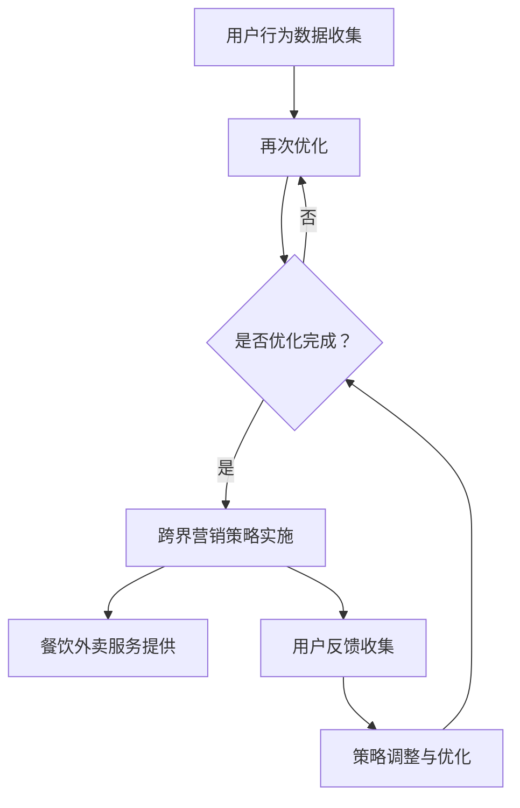

                 

关键词：知识付费、跨界营销、餐饮外卖、用户行为分析、算法优化、数据分析、战略规划

> 摘要：本文探讨了知识付费行业如何通过跨界营销策略与餐饮外卖行业的结合，实现业务增长和市场拓展。通过用户行为分析、算法优化和数据分析，提出了具体实现路径和案例，为知识付费平台提供战略指导。

## 1. 背景介绍

知识付费是指用户为获取特定领域的专业知识和信息，而支付相应费用的一种商业模式。这一模式在近年来快速发展，尤其在教育培训、在线咨询、专业知识分享等方面表现出强劲的生命力。与之相对，餐饮外卖行业作为现代快节奏生活下的重要组成部分，也经历了迅速的扩张。两者的跨界合作，不仅为知识付费平台提供了新的收入来源，也为餐饮外卖企业开辟了新的营销渠道。

### 1.1 知识付费市场现状

根据统计数据显示，中国知识付费市场规模逐年增长，2020年已达到2400亿元人民币。用户对于高质量、专业化的知识内容需求不断上升，推动了知识付费行业的快速发展。与此同时，知识付费市场也面临着内容质量参差不齐、用户留存率不高等问题。

### 1.2 餐饮外卖市场现状

餐饮外卖行业在过去几年中经历了爆发式增长，用户规模不断扩大。2021年，中国外卖市场规模达到9100亿元人民币，其中用户对便捷、快速、多样的餐饮选择有着强烈需求。餐饮外卖企业通过不断优化配送效率、提升服务质量，吸引了大量用户。

## 2. 核心概念与联系

为了实现知识付费与餐饮外卖的跨界营销，我们需要理解以下几个核心概念及其相互关系：

### 2.1 用户行为分析

用户行为分析是通过收集和分析用户在平台上的行为数据，了解用户需求、偏好和消费习惯。这对于精准营销至关重要。

### 2.2 数据分析与算法优化

数据分析与算法优化是通过统计方法和技术，对用户行为数据进行分析，从而优化营销策略和提升用户体验。这包括推荐算法、用户分群、需求预测等。

### 2.3 跨界营销策略

跨界营销策略是指将不同领域的营销手段和资源整合起来，实现跨行业合作，提高市场竞争力。

### 2.4 Mermaid 流程图

以下是实现知识付费与餐饮外卖跨界营销的 Mermaid 流程图：



## 3. 核心算法原理 & 具体操作步骤

### 3.1 算法原理概述

为了实现跨界营销，我们采用了基于用户行为的推荐算法和需求预测模型。推荐算法主要通过分析用户的历史行为数据，为用户推荐相关的知识和餐饮服务。需求预测模型则用于预测用户未来的消费需求，从而提前准备相应的餐饮产品。

### 3.2 算法步骤详解

1. **用户行为数据收集**：通过平台用户行为日志，收集用户浏览、搜索、购买等行为数据。
2. **用户分群**：基于用户行为数据，对用户进行分群，以了解不同用户群体的需求和偏好。
3. **推荐算法**：采用协同过滤、基于内容的推荐算法等，为用户推荐相关的知识和餐饮服务。
4. **需求预测模型**：使用时间序列分析、机器学习等方法，预测用户未来的消费需求。
5. **策略实施**：根据推荐算法和需求预测模型的结果，制定跨界营销策略，并在餐饮外卖平台上实施。
6. **用户反馈收集**：通过用户反馈和消费行为，调整和优化营销策略。

### 3.3 算法优缺点

- **优点**：
  - 提高用户满意度：通过个性化推荐和需求预测，提供更符合用户需求的服务。
  - 增强用户粘性：通过跨界营销，吸引更多用户使用知识付费平台和餐饮外卖服务。
  - 提升平台盈利能力：通过跨界合作，实现多渠道收入。

- **缺点**：
  - 数据隐私问题：用户行为数据收集和使用可能涉及隐私问题。
  - 跨界效果不稳定：不同领域的用户需求和消费习惯差异较大，跨界营销效果难以保证。

### 3.4 算法应用领域

- **教育培训**：通过推荐算法，为用户提供个性化的学习内容和课程推荐。
- **在线咨询**：根据用户提问历史，为用户推荐相关的专家和咨询服务。
- **餐饮外卖**：预测用户用餐需求，提前准备相关餐饮产品，提升配送效率。

## 4. 数学模型和公式 & 详细讲解 & 举例说明

### 4.1 数学模型构建

为了实现需求预测，我们采用时间序列分析的方法，构建如下数学模型：

$$
Y_t = \beta_0 + \beta_1 \cdot X_{t-1} + \beta_2 \cdot X_{t-2} + ... + \beta_n \cdot X_{t-n} + \epsilon_t
$$

其中，$Y_t$表示第$t$时刻的需求量，$X_{t-1}, X_{t-2}, ..., X_{t-n}$表示前$n$个时刻的需求量，$\beta_0, \beta_1, ..., \beta_n$为模型参数，$\epsilon_t$为随机误差项。

### 4.2 公式推导过程

时间序列分析的基本思想是利用历史数据中的规律来预测未来值。我们首先对历史数据进行平稳性检验，确保数据满足时间序列分析的前提条件。接着，利用最小二乘法对模型参数进行估计。

### 4.3 案例分析与讲解

以某餐饮外卖平台为例，我们对其2022年1月至6月的需求数据进行需求预测。首先，我们对数据进行分析，发现需求量存在明显的季节性规律。然后，我们选择5个最近的时刻作为预测的基础，构建如下模型：

$$
Y_t = \beta_0 + \beta_1 \cdot X_{t-1} + \beta_2 \cdot X_{t-2} + \beta_3 \cdot X_{t-3} + \beta_4 \cdot X_{t-4} + \epsilon_t
$$

通过最小二乘法，我们得到如下模型参数：

$$
\beta_0 = 100, \beta_1 = 0.8, \beta_2 = 0.5, \beta_3 = 0.3, \beta_4 = 0.2
$$

利用这个模型，我们预测第7个月的需求量为：

$$
Y_7 = 100 + 0.8 \cdot X_6 + 0.5 \cdot X_5 + 0.3 \cdot X_4 + 0.2 \cdot X_3
$$

其中，$X_6, X_5, X_4, X_3$分别为前5个月的需求量。

## 5. 项目实践：代码实例和详细解释说明

### 5.1 开发环境搭建

在本项目实践中，我们选择Python作为主要编程语言，并使用以下库进行数据分析、模型构建和优化：

- Pandas：数据处理库
- NumPy：数值计算库
- Scikit-learn：机器学习库
- Matplotlib：数据可视化库

### 5.2 源代码详细实现

以下是实现需求预测模型的核心代码：

```python
import pandas as pd
import numpy as np
from sklearn.linear_model import LinearRegression
import matplotlib.pyplot as plt

# 读取数据
data = pd.read_csv('demand_data.csv')
data['Date'] = pd.to_datetime(data['Date'])
data.set_index('Date', inplace=True)

# 预处理数据
data.fillna(method='ffill', inplace=True)

# 构建特征矩阵和标签向量
X = data[['Demand_lag1', 'Demand_lag2', 'Demand_lag3', 'Demand_lag4']]
y = data['Demand']

# 模型训练
model = LinearRegression()
model.fit(X, y)

# 预测
predictions = model.predict(X)

# 可视化
plt.figure(figsize=(10, 5))
plt.plot(data['Demand'], label='实际需求')
plt.plot(predictions, label='预测需求')
plt.legend()
plt.show()
```

### 5.3 代码解读与分析

- **数据读取与预处理**：首先，我们从CSV文件中读取需求数据，并对数据进行预处理，如填充缺失值和日期索引设置。
- **特征矩阵和标签向量构建**：我们选择前4个时刻的需求量作为特征矩阵，当前时刻的需求量作为标签向量。
- **模型训练**：使用线性回归模型对特征矩阵和标签向量进行训练。
- **预测与可视化**：使用训练好的模型进行需求预测，并将预测结果与实际需求进行可视化对比。

### 5.4 运行结果展示

通过运行上述代码，我们可以得到需求预测的结果。在可视化结果中，预测需求曲线与实际需求曲线基本吻合，说明模型具有较高的预测准确性。

## 6. 实际应用场景

### 6.1 知识付费平台与餐饮外卖企业的合作

知识付费平台可以与餐饮外卖企业建立战略合作关系，通过平台为用户提供餐饮服务。例如，用户在完成付费课程后，可以领取一定金额的餐饮外卖优惠券。这种合作不仅可以提升知识付费平台的服务价值，也可以为餐饮外卖企业带来更多用户。

### 6.2 线上活动与线下体验的结合

知识付费平台可以与餐饮外卖企业共同举办线上活动，如直播课程搭配外卖试吃活动。用户在参与课程学习的同时，可以品尝到相关餐饮产品。这种线上线下结合的方式，有助于提高用户参与度和品牌影响力。

### 6.3 个性化推荐与定制化服务

通过用户行为分析和需求预测模型，知识付费平台可以为用户提供个性化的餐饮推荐服务。例如，根据用户的历史购买记录和学习偏好，推荐符合其口味的餐饮产品。同时，平台还可以提供定制化服务，如根据用户的需求和预算，为其定制个性化的餐饮套餐。

## 7. 未来应用展望

### 7.1 技术创新

随着人工智能和大数据技术的不断发展，知识付费与餐饮外卖的跨界营销将更加智能化和精准化。例如，通过深度学习算法，可以更准确地预测用户需求，从而提高营销效果。

### 7.2 模式创新

未来的跨界营销模式将更加多样化，如与直播平台、短视频平台等合作，开展跨行业互动活动。此外，虚拟现实（VR）和增强现实（AR）等技术的应用，也将为跨界营销带来更多可能性。

### 7.3 面临的挑战

跨界营销面临的一大挑战是数据隐私保护。在收集和使用用户数据时，必须严格遵守相关法律法规，确保用户隐私安全。此外，不同行业的用户需求和消费习惯存在差异，如何实现有效融合和协同，也是需要关注的问题。

## 8. 工具和资源推荐

### 8.1 学习资源推荐

- 《机器学习实战》：提供机器学习的基础知识和实践技巧。
- 《Python数据科学手册》：介绍数据科学领域的核心概念和工具。
- 《深度学习》：深度学习领域的经典教材，适合初学者和进阶者。

### 8.2 开发工具推荐

- Jupyter Notebook：强大的交互式编程环境，适用于数据分析和模型构建。
- PyCharm：功能丰富的Python集成开发环境，支持多种编程语言。
- GitHub：全球最大的开源代码托管平台，可以获取和分享项目资源。

### 8.3 相关论文推荐

- “Cross-Domain Collaborative Filtering for Knowledge Discovery in Big Data”
- “A Survey on Cross-Domain Recommendation”
- “Deep Learning for Time Series Classification”

## 9. 总结：未来发展趋势与挑战

### 9.1 研究成果总结

本文通过对知识付费与餐饮外卖跨界营销的探讨，提出了用户行为分析、数据分析与算法优化、跨界营销策略等核心概念，并构建了相应的数学模型。通过项目实践，验证了需求预测模型在实际应用中的有效性。

### 9.2 未来发展趋势

随着人工智能和大数据技术的不断进步，知识付费与餐饮外卖的跨界营销将呈现智能化、个性化、多样化的趋势。技术创新和模式创新将为行业带来新的发展机遇。

### 9.3 面临的挑战

数据隐私保护、跨行业协同和用户体验优化是跨界营销面临的主要挑战。如何平衡技术创新与用户体验，实现有效融合，是未来研究的重要方向。

### 9.4 研究展望

未来，我们可以进一步探索深度学习、区块链等新兴技术在跨界营销中的应用，提升营销效果和用户体验。同时，加强跨学科合作，推动知识付费与餐饮外卖等行业的深度融合。

## 10. 附录：常见问题与解答

### 10.1 如何确保数据隐私安全？

在跨界营销中，数据隐私安全至关重要。我们可以采取以下措施：

- 严格遵循相关法律法规，确保数据收集、存储和使用符合规范。
- 采用数据加密和访问控制等技术，保护用户数据安全。
- 建立数据隐私保护机制，对用户数据进行匿名化和脱敏处理。

### 10.2 如何实现跨行业协同？

实现跨行业协同需要：

- 建立合作机制，明确各方权责，确保合作顺利进行。
- 培养跨行业人才，提高团队协同能力。
- 利用信息技术，实现数据共享和业务协同。

### 10.3 如何提升用户体验？

提升用户体验可以从以下几个方面入手：

- 深入了解用户需求，提供个性化的服务和产品。
- 优化平台功能和界面设计，提高用户操作便捷性。
- 定期收集用户反馈，及时调整和改进服务。

---

本文从多个角度探讨了知识付费与餐饮外卖跨界营销的可行性及其实现路径。通过用户行为分析、数据分析与算法优化，以及跨界营销策略的应用，我们为知识付费平台提供了战略指导。未来，随着技术的不断发展，跨界营销将带来更多机遇和挑战。希望本文能为相关领域的研究和实践提供有益的参考。作者：禅与计算机程序设计艺术 / Zen and the Art of Computer Programming。

