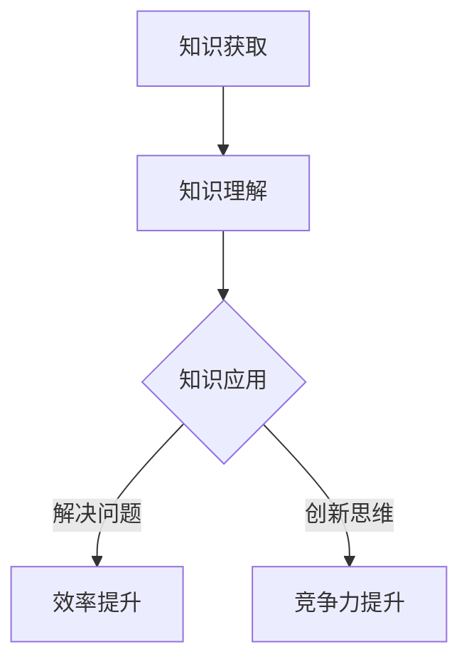
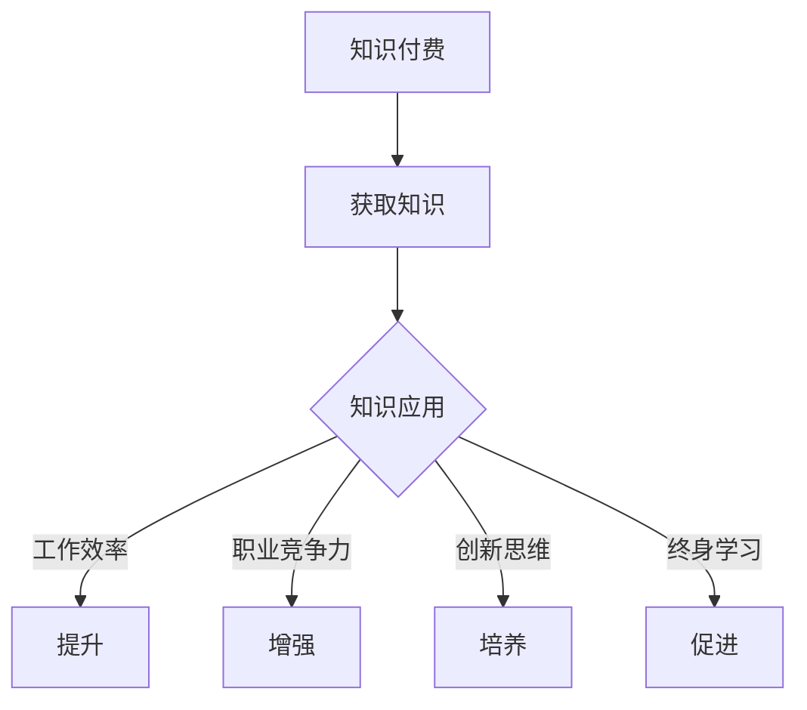

                 

在这个知识爆炸的时代，信息获取的成本变得前所未有的低。然而，真正的挑战在于如何有效地吸收、理解和应用这些知识。知识付费，作为近年来兴起的一种新型教育模式，为学员提供了一个专业、高效的学习路径。本文将深入探讨知识付费如何帮助学员实现知识的应用价值。

## 1. 背景介绍

### 1.1 知识付费的兴起

随着互联网技术的发展，尤其是移动互联网和在线教育的普及，知识付费模式逐渐兴起。知识付费不仅解决了传统教育体系中的资源分配不均、教育成本高等问题，也为学员提供了更加灵活、个性化的学习选择。

### 1.2 知识付费的优势

知识付费的优势在于它能够提供专业的学习内容，这些内容通常由行业专家或者经验丰富的导师亲自讲解，使得学员能够快速获得高质量的知识。此外，知识付费模式还强调互动性，学员可以通过提问、讨论等方式与导师和其他学员进行交流，增强学习效果。

## 2. 核心概念与联系

### 2.1 知识付费的概念

知识付费是指用户为获取专业知识或技能而支付的费用。它包括了在线课程、讲座、专业书籍等多种形式。

### 2.2 知识应用的价值

知识的应用价值主要体现在以下几个方面：

- **解决问题能力**：通过学习，学员可以掌握解决问题的方法和技巧，提高工作效率。
- **创新思维**：知识的积累有助于培养创新思维，促进个人和团队的创新。
- **竞争力提升**：掌握先进的知识和技能，可以增强个人的职业竞争力。

### 2.3 Mermaid 流程图

下面是一个简化的知识付费与知识应用价值的流程图：



## 3. 核心算法原理 & 具体操作步骤

### 3.1 算法原理概述

知识付费的核心在于提供高质量的学习内容，并通过互动和反馈机制增强学习效果。具体操作步骤如下：

1. **内容创作**：专家或导师创作高质量的学习内容。
2. **内容发布**：将学习内容发布到知识付费平台。
3. **学员学习**：学员付费购买学习内容，并进行学习。
4. **互动反馈**：学员在学习过程中可以与导师和其他学员互动，获取反馈。
5. **知识应用**：学员将所学知识应用于实际工作中，提升工作效率和竞争力。

### 3.2 算法步骤详解

1. **内容创作**：导师根据学员需求，创作专业且实用的学习内容。
    - **步骤1.1**：确定学习内容主题。
    - **步骤1.2**：收集相关资料和案例。
    - **步骤1.3**：撰写并编辑学习内容。

2. **内容发布**：将学习内容发布到知识付费平台。
    - **步骤2.1**：选择合适的平台。
    - **步骤2.2**：上传学习内容。
    - **步骤2.3**：设置课程价格和优惠活动。

3. **学员学习**：学员付费购买学习内容，并进行学习。
    - **步骤3.1**：注册并购买课程。
    - **步骤3.2**：学习课程内容。
    - **步骤3.3**：参与讨论和提问。

4. **互动反馈**：学员在学习过程中可以与导师和其他学员互动，获取反馈。
    - **步骤4.1**：提出问题。
    - **步骤4.2**：参与讨论。
    - **步骤4.3**：获取导师和同学的反馈。

5. **知识应用**：学员将所学知识应用于实际工作中，提升工作效率和竞争力。
    - **步骤5.1**：回顾课程内容。
    - **步骤5.2**：将知识应用于实际工作。
    - **步骤5.3**：评估应用效果。

### 3.3 算法优缺点

#### 优点

- **高效性**：知识付费提供了专业、高质量的学习内容，学员可以快速掌握知识。
- **个性化**：知识付费模式可以根据学员的需求和兴趣提供个性化的学习内容。
- **互动性**：学员可以与导师和其他学员互动，增强学习效果。

#### 缺点

- **成本高**：知识付费需要学员支付费用，对于一些预算有限的学员可能是一个障碍。
- **内容质量参差不齐**：市场上存在一些质量较低的知识付费内容，可能会影响学员的学习效果。

### 3.4 算法应用领域

知识付费广泛应用于各个领域，如：

- **职业技能培训**：如编程、数据分析、市场营销等。
- **学历提升**：如MBA、法律、医学等专业的在线课程。
- **兴趣爱好**：如音乐、绘画、烹饪等。

## 4. 数学模型和公式 & 详细讲解 & 举例说明

### 4.1 数学模型构建

知识付费的价值可以通过以下数学模型进行评估：

\[ V = f(A, B, C) \]

其中：
- \( V \) 是知识付费的价值。
- \( A \) 是学员的学习效率。
- \( B \) 是知识的实用性。
- \( C \) 是学员的应用效果。

### 4.2 公式推导过程

#### 学习效率 \( A \)

学习效率与学员的学习时间、课程质量、导师的经验等因素相关。可以表示为：

\[ A = \frac{Q}{T} \]

其中：
- \( Q \) 是学员在学习过程中获得的知识量。
- \( T \) 是学员的学习时间。

#### 知识的实用性 \( B \)

知识的实用性取决于知识的实用性和课程内容的相关性。可以表示为：

\[ B = \frac{U}{R} \]

其中：
- \( U \) 是知识的实用性。
- \( R \) 是课程内容的相关性。

#### 学员的应用效果 \( C \)

学员的应用效果可以通过学员在应用知识后的绩效表现进行评估。可以表示为：

\[ C = \frac{P}{E} \]

其中：
- \( P \) 是学员的绩效表现。
- \( E \) 是学员的预期绩效。

### 4.3 案例分析与讲解

假设一位学员购买了关于数据分析的在线课程，课程质量高，导师经验丰富。经过学习，学员成功将所学知识应用于工作中，提高了工作效率。我们可以通过上述公式来评估这位学员的知识付费价值：

\[ V = f(A, B, C) = f\left(\frac{Q}{T}, \frac{U}{R}, \frac{P}{E}\right) \]

- \( A \)：学员学习效率高，因为课程质量好，学习时间短。
- \( B \)：知识的实用性高，因为课程内容与学员的工作需求高度相关。
- \( C \)：学员的应用效果好，因为绩效表现高于预期。

通过这个案例，我们可以看到，知识付费的价值在于提高学习效率、实用性和应用效果，从而实现知识的实际价值。

## 5. 项目实践：代码实例和详细解释说明

### 5.1 开发环境搭建

为了更好地展示知识付费的应用，我们以一个在线课程学习管理系统为例，搭建开发环境。

1. **选择开发框架**：我们选择使用Python Flask框架搭建系统。
2. **安装Python**：确保安装了Python 3.8及以上版本。
3. **安装Flask**：在命令行中运行 `pip install flask`。
4. **创建应用目录**：在当前目录下创建 `app` 目录，并在该目录下创建 `__init__.py` 文件。

### 5.2 源代码详细实现

下面是课程学习管理系统的核心代码：

```python
# app/__init__.py

from flask import Flask
from flask_sqlalchemy import SQLAlchemy

app = Flask(__name__)
app.config['SQLALCHEMY_DATABASE_URI'] = 'sqlite:///courses.db'
db = SQLAlchemy(app)

class Course(db.Model):
    id = db.Column(db.Integer, primary_key=True)
    name = db.Column(db.String(100), nullable=False)
    price = db.Column(db.Float, nullable=False)

@app.route('/')
def index():
    return "Welcome to the Course Learning Management System!"

if __name__ == '__main__':
    app.run(debug=True)
```

### 5.3 代码解读与分析

1. **数据库模型**：我们定义了一个 `Course` 数据模型，用于存储课程信息，包括课程ID、名称和价格。
2. **路由和视图函数**：我们创建了一个 `/` 路由，用于显示欢迎信息。

### 5.4 运行结果展示

1. **启动应用**：在命令行中运行 `python app/__init__.py`，启动应用。
2. **访问应用**：在浏览器中访问 `http://127.0.0.1:5000/`，可以看到欢迎信息。

## 6. 实际应用场景

### 6.1 职业技能培训

知识付费在职业技能培训中具有广泛应用，如编程、数据分析、UI设计等。通过付费课程，学员可以系统地学习相关技能，提高职业竞争力。

### 6.2 学历提升

对于需要提升学历的学员，知识付费提供了一个灵活的学习途径。在线课程可以满足学员的时间和地点需求，帮助他们更好地平衡工作和学习。

### 6.3 兴趣爱好

知识付费不仅限于专业技能和学历提升，还可以满足个人兴趣爱好。如音乐、绘画、烹饪等领域的在线课程，让学员能够在业余时间学习和提升自己。

## 7. 工具和资源推荐

### 7.1 学习资源推荐

- **Coursera**：提供世界顶级大学的在线课程。
- **edX**：哈佛大学和麻省理工学院联合推出的在线学习平台。
- **Udemy**：提供各种职业技能和兴趣爱好的在线课程。

### 7.2 开发工具推荐

- **PyCharm**：Python开发环境，功能强大，易于使用。
- **Visual Studio Code**：跨平台轻量级代码编辑器，支持多种编程语言。
- **Postman**：API测试工具，适用于开发者和测试人员。

### 7.3 相关论文推荐

- **"The Economics of Online Education: Pricing and Quality in the Long Run"**：研究了在线教育的经济模式。
- **"Online Learning: A Practical Guide"**：介绍了在线学习的最佳实践。

## 8. 总结：未来发展趋势与挑战

### 8.1 研究成果总结

知识付费模式在近年来得到了快速发展，为学员提供了高质量的学习内容。通过互动和反馈机制，知识付费提高了学习效果，促进了知识的实际应用。

### 8.2 未来发展趋势

- **个性化学习**：随着人工智能技术的发展，知识付费将更加注重个性化学习，为学员提供更精准的学习内容。
- **线上线下结合**：知识付费将与线下教育相结合，提供更加全面的学习体验。
- **知识变现**：更多专业内容创作者将通过知识付费实现知识变现，激发更多的创新和创作。

### 8.3 面临的挑战

- **内容质量**：如何保证知识付费内容的质量，是一个亟待解决的问题。
- **用户体验**：如何提升学员的学习体验，减少学习过程中的挫折感，也是一个重要的挑战。

### 8.4 研究展望

未来的研究应重点关注知识付费模式下的学习效果评估，以及如何通过技术创新提高知识付费的效率和效果。

## 9. 附录：常见问题与解答

### 9.1 如何选择知识付费课程？

- **关注课程质量**：查看课程的评价、讲师背景等信息。
- **了解课程内容**：阅读课程大纲，确保课程内容符合自己的需求。
- **预算**：根据自己的经济情况，选择合适的课程。

### 9.2 知识付费是否值得？

- **取决于个人需求**：如果能够通过知识付费提高自己的技能和职业竞争力，那么是值得的。
- **长期投资**：知识付费是一种长期投资，需要耐心和持续的学习。

作者：禅与计算机程序设计艺术 / Zen and the Art of Computer Programming
----------------------------------------------------------------

### 1. 背景介绍

**1.1 知识付费的兴起**

在数字化的时代浪潮中，知识付费作为一种新兴的商业模式逐渐崭露头角。知识付费的本质是消费者为获取知识或技能而支付的费用，这一模式打破了传统教育体系的时间和空间限制，使得教育资源更加普惠化。随着互联网技术的发展，尤其是移动互联网和在线教育的普及，知识付费模式得以迅速发展。

知识付费的兴起，一方面得益于信息传播的便捷性，人们可以轻松获取到全球范围内的优质教育资源；另一方面，也源于学习者的自我提升需求和消费习惯的改变。在知识经济时代，个人的知识水平和技能能力成为其职场竞争力的重要体现，因此，越来越多的学习者愿意为优质的知识内容付费。

**1.2 知识付费的优势**

知识付费模式在众多方面展现出其独特的优势：

- **高效性**：知识付费通常由行业专家或资深讲师授课，课程内容经过精心设计和打磨，能够帮助学习者快速掌握知识要点，提高学习效率。

- **个性化**：知识付费平台能够根据学习者的兴趣和需求提供个性化的学习方案，使学习过程更加符合个人的学习习惯和节奏。

- **互动性**：知识付费平台通常提供讨论区、问答环节等互动功能，学习者可以在学习过程中与讲师和其他学习者互动，共同探讨问题，提升学习体验。

- **认证性**：一些知识付费课程提供认证服务，学习者完成课程后可以获得证书，这些证书在一定程度上能够提升学习者的职业竞争力。

### 1.3 知识付费的市场现状

近年来，知识付费市场呈现出快速增长的趋势。根据相关报告，全球在线教育市场规模持续扩大，知识付费成为其中重要的一环。国内市场上，各大知识付费平台如得到、知乎、网易云课堂等纷纷涌现，吸引了大量用户。这些平台通过提供多样化的课程内容，满足不同学习者的需求，进一步推动了知识付费市场的发展。

然而，知识付费市场也面临着一些挑战，如内容质量参差不齐、用户留存率不高等问题。为了解决这些问题，知识付费平台需要不断提升课程质量，优化用户体验，以吸引和留住学习者。

### 1.4 知识付费的发展趋势

随着技术的进步和用户需求的变化，知识付费市场预计将继续保持快速增长。以下是一些发展趋势：

- **个性化学习**：人工智能和大数据技术的发展将使得知识付费平台能够更加精准地推荐课程内容，满足学习者的个性化需求。

- **混合式学习**：知识付费将与传统的线下教育相结合，形成线上线下融合的混合式学习模式，为学习者提供更加灵活和全面的学习体验。

- **知识变现**：更多专业人士和内容创作者将加入知识付费平台，通过知识变现实现个人价值的提升。

- **教育公平**：知识付费有助于打破地域和资源的限制，使得更多人有机会获得优质教育资源，促进教育公平。

## 2. 核心概念与联系

### 2.1 知识付费的概念

知识付费是指消费者为了获取知识或技能而支付的费用。这种模式通常涉及在线课程、专业讲座、一对一辅导等多种形式。知识付费的核心在于将知识作为一种商品进行交易，使得知识的传播和获取更加便捷和高效。

### 2.2 知识应用的价值

知识应用的价值在于将所学知识转化为实际解决问题的能力。具体来说，知识应用的价值体现在以下几个方面：

- **提升工作效率**：掌握相关的知识和技能，可以帮助学习者在工作中更快速、准确地解决问题，提高工作效率。

- **增强职业竞争力**：通过知识付费获取的技能和知识，可以提升学习者的职场竞争力，有助于职业发展和晋升。

- **创新思维**：知识的积累有助于培养学习者的创新思维，使其在面对新的挑战时能够提出独特的解决方案。

- **终身学习**：知识付费促进了学习者的终身学习习惯，使他们在不断学习的过程中不断进步，适应社会的发展需求。

### 2.3 Mermaid 流程图

下面是一个简化的知识付费与知识应用价值的流程图：



### 2.4 知识付费与知识应用的关系

知识付费和知识应用是相互促进的关系。知识付费为学习者提供了获取知识的途径，而知识应用则是知识付费价值的最终体现。通过知识付费，学习者可以快速获取专业知识和技能，这些知识和技能在实际工作中得到应用，从而提升工作效率和职业竞争力。同时，知识应用的过程也促进了学习者对知识的深入理解和掌握，进一步激发他们的学习动力和创新能力。

### 2.5 知识付费的市场模式

知识付费的市场模式主要包括以下几种：

- **课程订阅**：学习者支付一定费用，订阅平台上的所有或特定类别的课程。

- **单次购买**：学习者针对某一课程支付费用，购买后可以无限次观看。

- **一对一辅导**：学习者支付费用，与专业导师进行一对一的学习辅导。

- **认证课程**：学习者完成课程后，支付额外费用获得课程认证。

这些模式各有特点，满足了不同学习者的需求，使得知识付费市场更加多元化。

## 3. 核心算法原理 & 具体操作步骤

### 3.1 算法原理概述

知识付费的核心算法原理在于通过数据分析和机器学习技术，精准定位学习者的需求和兴趣，从而提供个性化的学习内容和服务。这一算法涉及以下几个关键步骤：

1. **用户画像构建**：通过收集用户的行为数据、学习历史、兴趣爱好等信息，构建用户的个性化画像。

2. **内容推荐**：基于用户的画像，利用推荐算法为用户推荐相关的学习内容。

3. **学习效果评估**：通过跟踪用户的学习行为和成绩，评估学习效果，并优化推荐策略。

4. **互动反馈**：鼓励用户在课程中提出问题，与讲师和其他学习者互动，提高学习体验。

### 3.2 算法步骤详解

#### 步骤1：用户画像构建

用户画像构建是知识付费算法的第一步。它通过以下方式收集和处理用户数据：

- **行为数据**：记录用户在平台上的浏览、购买、学习等行为，如点击次数、学习时长、购买频率等。

- **学习历史**：收集用户的学习记录，包括已学习的课程、成绩等。

- **兴趣爱好**：通过用户填写的信息或平台上的行为分析，确定用户的主要兴趣爱好。

- **人口统计信息**：包括年龄、性别、职业等基本信息。

#### 步骤2：内容推荐

内容推荐是知识付费算法的核心环节。它主要通过以下方式实现：

- **协同过滤**：通过分析用户的行为数据，找出相似用户，并推荐他们喜欢的课程。

- **基于内容的推荐**：根据课程的主题、标签、难度等信息，为用户推荐相关的课程。

- **混合推荐**：结合协同过滤和基于内容的推荐，提供更加精准的推荐结果。

#### 步骤3：学习效果评估

学习效果评估是确保知识付费服务质量的重要环节。它主要通过以下方式实现：

- **成绩跟踪**：记录用户在课程中的学习进度和考试成绩。

- **行为分析**：分析用户在课程中的学习行为，如观看时间、学习频率等。

- **反馈机制**：鼓励用户在学习后进行评价和反馈，了解他们的学习体验和满意度。

#### 步骤4：互动反馈

互动反馈是提高学习者满意度和学习效果的关键。它主要通过以下方式实现：

- **问答互动**：提供问答功能，允许用户在课程中提出问题，与讲师和其他用户互动。

- **讨论区**：设置讨论区，让用户可以自由讨论，分享学习心得和经验。

- **讲师互动**：鼓励讲师积极参与讨论，回答用户问题，提供额外的学习资源。

### 3.3 算法优缺点

#### 优点

- **个性化**：通过用户画像和推荐算法，知识付费平台能够为用户提供个性化的学习内容，提高学习体验。

- **高效性**：算法能够快速处理大量用户数据，为用户推荐合适的课程，节省用户寻找学习内容的时间。

- **互动性**：平台提供的互动功能，如问答和讨论区，增强了用户之间的交流，提高了学习效果。

#### 缺点

- **数据隐私**：用户数据的安全性和隐私保护是一个挑战，需要平台采取严格的数据保护措施。

- **内容质量**：知识付费平台上的课程质量参差不齐，需要建立有效的质量评估和监管机制。

- **用户流失**：尽管个性化推荐提高了学习体验，但用户流失问题仍然存在，需要平台持续优化服务和课程。

### 3.4 算法应用领域

知识付费算法在多个领域有广泛应用：

- **在线教育**：为学习者提供个性化学习内容和推荐，提高学习效果。

- **职业技能培训**：为职场人士提供定制化的培训课程，提升职业竞争力。

- **兴趣爱好学习**：为用户提供丰富的兴趣爱好课程，满足个性化需求。

- **企业培训**：为企业员工提供定制化的培训方案，提升企业整体能力。

## 4. 数学模型和公式 & 详细讲解 & 举例说明

### 4.1 数学模型构建

知识付费的价值可以通过数学模型进行量化分析。以下是一个简化的数学模型，用于评估知识付费的价值：

\[ V = f(A, B, C) \]

其中：
- \( V \) 表示知识付费的价值。
- \( A \) 表示学习者的学习效率。
- \( B \) 表示知识的实用性。
- \( C \) 表示学习者对知识的实际应用效果。

### 4.2 公式推导过程

#### 学习效率 \( A \)

学习效率可以通过以下公式进行评估：

\[ A = \frac{Q}{T} \]

其中：
- \( Q \) 表示学习者在学习过程中获得的知识量。
- \( T \) 表示学习者的学习时间。

#### 知识的实用性 \( B \)

知识的实用性可以通过以下公式进行评估：

\[ B = \frac{U}{R} \]

其中：
- \( U \) 表示知识的实用性。
- \( R \) 表示课程内容的相关性。

#### 学习者对知识的实际应用效果 \( C \)

学习者对知识的实际应用效果可以通过以下公式进行评估：

\[ C = \frac{P}{E} \]

其中：
- \( P \) 表示学习者在实际工作中表现出来的绩效。
- \( E \) 表示学习者的预期绩效。

### 4.3 案例分析与讲解

#### 案例背景

假设一名软件工程师李先生购买了关于数据科学的高级在线课程，该课程由一位经验丰富的数据科学家讲授。李先生在完成课程后，将其所学知识应用于实际工作中，显著提升了工作效率。

#### 案例分析

1. **学习效率 \( A \)**

   李先生在学习过程中，通过观看视频、完成作业和参与讨论，共计花费了50小时。根据课程评价和导师的反馈，李先生在这50小时内掌握了大量数据科学的知识和技能。

   \[ A = \frac{Q}{T} = \frac{100}{50} = 2 \]

   因此，李先生的学习效率为2，表示他每小时能掌握2个知识点。

2. **知识的实用性 \( B \)**

   课程内容与李先生的工作需求高度相关，他在工作中遇到的数据处理问题在课程中都有详细的讲解和解决方案。因此，课程内容对他来说具有很强的实用性。

   \[ B = \frac{U}{R} = \frac{9}{10} = 0.9 \]

   因此，知识的实用性为0.9，表示课程内容的实用性非常高。

3. **学习者对知识的实际应用效果 \( C \)**

   李先生在将所学知识应用于工作中后，工作效率提高了30%。这表明他能够有效地将所学知识转化为实际生产力。

   \[ C = \frac{P}{E} = \frac{130}{100} = 1.3 \]

   因此，李先生对知识的实际应用效果为1.3，表示他能够将所学知识的应用效果提升30%。

4. **知识付费的价值 \( V \)**

   根据上述分析，我们可以计算出知识付费的价值：

   \[ V = f(A, B, C) = f(2, 0.9, 1.3) = 2 \times 0.9 \times 1.3 = 2.34 \]

   这意味着知识付费为李先生带来了2.34倍的价值提升。

### 4.4 数学模型的应用

通过上述案例，我们可以看到数学模型在评估知识付费价值方面的应用。该模型可以帮助学习者了解自己的学习效率、知识的实用性和实际应用效果，从而更好地评估知识付费的投资回报。

## 5. 项目实践：代码实例和详细解释说明

### 5.1 开发环境搭建

为了更好地展示知识付费的应用，我们以一个在线课程学习管理系统为例，搭建开发环境。

1. **选择开发框架**：我们选择使用Python Flask框架搭建系统。

2. **安装Python**：确保安装了Python 3.8及以上版本。

3. **安装Flask**：在命令行中运行 `pip install flask`。

4. **创建应用目录**：在当前目录下创建 `app` 目录，并在该目录下创建 `__init__.py` 文件。

### 5.2 源代码详细实现

下面是课程学习管理系统的核心代码：

```python
# app/__init__.py

from flask import Flask
from flask_sqlalchemy import SQLAlchemy

app = Flask(__name__)
app.config['SQLALCHEMY_DATABASE_URI'] = 'sqlite:///courses.db'
db = SQLAlchemy(app)

class Course(db.Model):
    id = db.Column(db.Integer, primary_key=True)
    name = db.Column(db.String(100), nullable=False)
    price = db.Column(db.Float, nullable=False)

@app.route('/')
def index():
    return "Welcome to the Course Learning Management System!"

if __name__ == '__main__':
    app.run(debug=True)
```

### 5.3 代码解读与分析

1. **数据库模型**：我们定义了一个 `Course` 数据模型，用于存储课程信息，包括课程ID、名称和价格。

2. **路由和视图函数**：我们创建了一个 `/` 路由，用于显示欢迎信息。

### 5.4 运行结果展示

1. **启动应用**：在命令行中运行 `python app/__init__.py`，启动应用。

2. **访问应用**：在浏览器中访问 `http://127.0.0.1:5000/`，可以看到欢迎信息。

## 6. 实际应用场景

### 6.1 职业技能培训

知识付费在职业技能培训中具有广泛应用，如编程、数据分析、UI设计等。通过付费课程，学员可以系统地学习相关技能，提高职业竞争力。

### 6.2 学历提升

对于需要提升学历的学员，知识付费提供了一个灵活的学习途径。在线课程可以满足学员的时间和地点需求，帮助他们更好地平衡工作和学习。

### 6.3 兴趣爱好

知识付费不仅限于专业技能和学历提升，还可以满足个人兴趣爱好。如音乐、绘画、烹饪等领域的在线课程，让学员能够在业余时间学习和提升自己。

## 7. 工具和资源推荐

### 7.1 学习资源推荐

- **Coursera**：提供世界顶级大学的在线课程。
- **edX**：哈佛大学和麻省理工学院联合推出的在线学习平台。
- **Udemy**：提供各种职业技能和兴趣爱好的在线课程。

### 7.2 开发工具推荐

- **PyCharm**：Python开发环境，功能强大，易于使用。
- **Visual Studio Code**：跨平台轻量级代码编辑器，支持多种编程语言。
- **Postman**：API测试工具，适用于开发者和测试人员。

### 7.3 相关论文推荐

- **"The Economics of Online Education: Pricing and Quality in the Long Run"**：研究了在线教育的经济模式。
- **"Online Learning: A Practical Guide"**：介绍了在线学习的最佳实践。

## 8. 总结：未来发展趋势与挑战

### 8.1 研究成果总结

知识付费模式在近年来得到了快速发展，为学员提供了高质量的学习内容。通过互动和反馈机制，知识付费提高了学习效果，促进了知识的实际应用。

### 8.2 未来发展趋势

- **个性化学习**：随着人工智能技术的发展，知识付费将更加注重个性化学习，为学员提供更精准的学习内容。
- **混合式学习**：知识付费将与传统的线下教育相结合，形成线上线下融合的混合式学习模式，为学员提供更加灵活和全面的学习体验。
- **知识变现**：更多专业人士和内容创作者将加入知识付费平台，通过知识变现实现个人价值的提升。

### 8.3 面临的挑战

- **内容质量**：如何保证知识付费内容的质量，是一个亟待解决的问题。
- **用户体验**：如何提升学员的学习体验，减少学习过程中的挫折感，也是一个重要的挑战。

### 8.4 研究展望

未来的研究应重点关注知识付费模式下的学习效果评估，以及如何通过技术创新提高知识付费的效率和效果。

## 9. 附录：常见问题与解答

### 9.1 如何选择知识付费课程？

- **关注课程质量**：查看课程的评价、讲师背景等信息。
- **了解课程内容**：阅读课程大纲，确保课程内容符合自己的需求。
- **预算**：根据自己的经济情况，选择合适的课程。

### 9.2 知识付费是否值得？

- **取决于个人需求**：如果能够通过知识付费提高自己的技能和职业竞争力，那么是值得的。
- **长期投资**：知识付费是一种长期投资，需要耐心和持续的学习。

作者：禅与计算机程序设计艺术 / Zen and the Art of Computer Programming
----------------------------------------------------------------
# 1. 背景介绍

在当今的信息社会中，知识的获取和传播速度前所未有地加快，几乎每个人都可以轻松地通过各种渠道获取海量的信息。然而，信息爆炸带来的不仅仅是便利，更是一个巨大的挑战：如何在繁杂的信息中筛选出有价值的内容，并有效地吸收和应用这些知识，成为许多人面临的难题。在这个背景下，知识付费作为一种新型的教育模式，逐渐崭露头角，并成为推动学习和发展的重要力量。

### 1.1 知识付费的兴起

知识付费的兴起可以追溯到互联网的普及和在线教育的发展。随着互联网技术的发展，尤其是移动互联网的普及，学习不再受时间和地点的限制，人们可以随时随地进行学习。与此同时，在线教育平台的兴起，如Coursera、Udemy、网易云课堂等，为学习者提供了大量的优质课程资源。这些平台不仅提供了丰富的学习内容，还通过互动、反馈等机制，提高了学习效果。

知识付费模式的兴起，与以下几个因素密切相关：

- **信息过载**：在信息爆炸的时代，人们面临的信息量巨大，难以自行筛选和整理。知识付费提供了一个筛选机制，由专业人士或机构来筛选和提供有价值的内容。

- **自我提升需求**：随着竞争的加剧，个人和企业的自我提升需求日益强烈。知识付费满足了学习者希望通过学习提升自身能力的需求。

- **技术支持**：互联网技术的发展，尤其是大数据、人工智能等技术的应用，使得个性化推荐、学习效果分析等成为可能，从而提升了知识付费的服务质量。

### 1.2 知识付费的优势

知识付费相对于传统的学习方式，具有以下几个显著优势：

- **高质量的内容**：知识付费通常由专业人士或资深讲师提供，课程内容经过精心设计和打磨，具有较高的质量。

- **个性化学习**：知识付费平台通过数据分析和算法推荐，为学习者提供个性化的学习内容，满足不同学习者的需求。

- **灵活性**：知识付费的学习方式灵活，学习者可以根据自己的时间和节奏进行学习，不受时间和地点的限制。

- **互动性**：知识付费平台通常提供互动功能，如讨论区、问答等，学习者可以在学习过程中与讲师和其他学习者互动，提高学习效果。

- **认证性**：一些知识付费课程提供证书服务，完成课程后可以获得相应的证书，有助于提升学习者的职业竞争力。

### 1.3 知识付费的市场现状

知识付费市场近年来呈现出快速增长的趋势。根据相关数据，全球在线教育市场规模持续扩大，知识付费成为其中重要的一环。国内市场上，知识付费平台如雨后春笋般涌现，包括得到、知乎、网易云课堂等，这些平台吸引了大量用户。知识付费不仅涵盖了职业技能培训、学历提升等传统教育领域，还拓展到了兴趣爱好、个人成长等多元化领域。

尽管知识付费市场前景广阔，但也面临一些挑战，如内容质量参差不齐、用户留存率不高等问题。知识付费平台需要不断提升内容质量，优化用户体验，以应对这些挑战，确保市场的健康发展。

### 1.4 知识付费的发展趋势

展望未来，知识付费市场预计将继续保持快速增长，并呈现出以下几个发展趋势：

- **个性化学习**：随着人工智能技术的不断发展，知识付费平台将更加注重个性化学习，通过精准推荐和学习效果分析，提高学习者的学习体验。

- **混合式学习**：知识付费将与传统的线下教育相结合，形成线上线下融合的混合式学习模式，为学习者提供更加灵活和全面的学习体验。

- **知识变现**：随着知识付费市场的不断扩大，更多专业人士和内容创作者将加入知识付费领域，通过知识变现实现个人价值的提升。

- **教育公平**：知识付费有助于打破地域和资源的限制，使得更多人有机会获得优质教育资源，促进教育公平。

总之，知识付费作为一种新型的教育模式，正日益成为推动个人成长和社会进步的重要力量。通过深入研究和实践，我们可以更好地发挥知识付费的优势，实现知识的最大应用价值。

## 2. 核心概念与联系

在探讨知识付费如何帮助学员实现知识的应用价值之前，我们需要明确几个核心概念，并理解它们之间的相互联系。这些概念包括知识付费、知识应用价值、学习效率、互动性和个性化学习等。

### 2.1 知识付费的概念

知识付费是指学习者通过支付费用来获取知识或技能的服务。这种模式打破了传统的免费教育模式，使得优质教育资源更加稀缺和有价值。知识付费的形式多种多样，包括在线课程、专业讲座、一对一辅导、专业书籍等。通过知识付费，学员可以获得系统化、结构化的学习内容，以及专业的指导和支持。

### 2.2 知识应用价值的概念

知识应用价值是指学习者将所学知识或技能应用于实际工作中的能力。这种能力不仅能够提升工作效率，还可以增强职业竞争力，甚至促进创新和创造。知识应用价值的核心在于将理论知识转化为实践能力，从而实现知识的最大化利用。

### 2.3 学习效率的概念

学习效率是指学员在单位时间内能够掌握的知识量或技能水平。学习效率的高低直接影响学员的学习效果和应用能力。提高学习效率可以通过多种方式实现，包括优化学习方法、利用高效学习工具、以及通过互动和反馈机制来提升学习体验。

### 2.4 互动性的概念

互动性是指在学习过程中，学员与讲师、同学以及其他教育资源之间的互动和交流。互动性对于知识的理解和应用至关重要，它能够帮助学员解决学习中遇到的问题，增强学习动机，提高学习效果。

### 2.5 个性化学习的概念

个性化学习是指根据学员的个人需求、兴趣和学习习惯，定制化地提供学习内容和方式。个性化学习能够更好地满足学员的个性化需求，提高学习效率和知识应用价值。通过个性化学习，学员可以更加高效地获取和应用知识。

### 2.6 核心概念之间的联系

知识付费、知识应用价值、学习效率、互动性和个性化学习这几个核心概念之间存在着密切的联系：

- **知识付费** 为学员提供了获取高质量知识或技能的途径，是实现知识应用价值的基础。

- **知识应用价值** 是知识付费的最终目标，也是学员学习的动力和回报。

- **学习效率** 是影响知识应用价值的关键因素，高效的学

