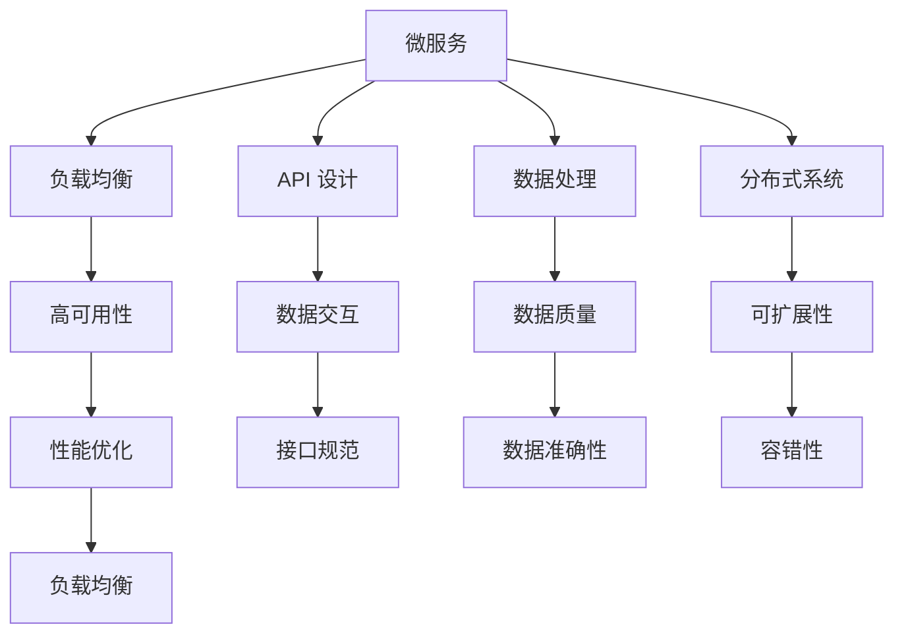

                 

 **关键词**：知识付费平台、后端架构、微服务、性能优化、安全性、负载均衡、API 设计、数据处理、分布式系统、持续集成和持续部署。

**摘要**：本文将探讨知识付费平台的后端架构设计，涵盖核心概念、算法原理、数学模型、项目实践、实际应用场景、未来展望以及工具和资源推荐。通过详细的分析和案例，我们将深入了解如何构建一个高效、稳定且安全的后端系统。

## 1. 背景介绍

知识付费平台作为一种在线教育模式，近年来在全球范围内得到了迅速发展。这类平台通过提供各种课程、讲座、电子书等内容，为用户提供专业知识的学习渠道。随着用户数量的增加和内容种类的丰富，平台的复杂性和对性能的要求也越来越高。因此，后端架构的设计变得尤为重要。

本文将围绕知识付费平台的后端架构进行探讨，重点分析以下几个方面：

1. **核心概念与联系**：介绍构建后端系统所需的基础概念，并绘制 Mermaid 流程图展示其关系。
2. **核心算法原理 & 具体操作步骤**：探讨平台中常用的算法原理和实现步骤，包括优缺点和应用领域。
3. **数学模型和公式**：构建数学模型，推导相关公式，并通过案例进行说明。
4. **项目实践**：提供代码实例和详细解释，展示如何实现后端功能。
5. **实际应用场景**：分析平台在实际业务中的应用场景，以及未来的发展趋势和挑战。
6. **工具和资源推荐**：推荐学习资源和开发工具，帮助读者更好地理解和构建后端系统。
7. **总结与展望**：总结研究成果，探讨未来发展趋势和面临的挑战。

## 2. 核心概念与联系

在构建知识付费平台的后端架构时，我们需要理解以下几个核心概念：

- **微服务**：将应用程序拆分为多个独立的、可独立部署和服务的小型服务，每个服务负责处理特定业务逻辑。
- **负载均衡**：通过将请求分配到多个服务器上，确保系统的高可用性和高性能。
- **API 设计**：定义接口规范，方便前端和后端进行数据交互。
- **数据处理**：包括数据采集、存储、处理和分析等过程，确保数据的质量和准确性。
- **分布式系统**：通过在多个服务器上运行应用程序，实现系统的可扩展性和容错性。

以下是这些概念之间的 Mermaid 流程图：



### 微服务

微服务架构的核心思想是将大型应用程序拆分为多个独立的服务，每个服务负责一个特定的业务功能。这些服务可以独立部署、升级和扩展，从而提高了系统的可维护性和可扩展性。例如，知识付费平台可以拆分为用户管理服务、课程管理服务、支付服务、评论服务等。

### 负载均衡

负载均衡是将来自客户端的请求分配到多个服务器上，以确保系统的高性能和高可用性。负载均衡器可以根据不同的策略（如轮询、最少连接、IP哈希等）将请求分配到不同的服务器。这有助于防止单个服务器过载，提高系统的响应速度和稳定性。

### API 设计

API（应用程序编程接口）是前后端交互的桥梁，定义了数据的传输格式和交互方式。在设计 API 时，需要遵循RESTful风格，确保接口的简洁性和易用性。同时，还需要考虑安全性，如使用OAuth2.0等认证机制。

### 数据处理

数据处理是知识付费平台的核心环节，包括数据采集、存储、处理和分析等过程。采集到的数据需要存储在数据库中，并通过ETL（提取、转换、加载）工具进行处理和分析，以提供决策支持和个性化推荐。

### 分布式系统

分布式系统通过在多个服务器上运行应用程序，实现了系统的可扩展性和容错性。分布式系统中的节点可以独立运行，并通过网络进行通信。当某个节点出现故障时，其他节点可以继续提供服务，确保系统的可用性。

## 3. 核心算法原理 & 具体操作步骤

在知识付费平台的后端系统中，常用的算法主要包括以下几种：

### 3.1 排序算法

排序算法用于对数据进行排序，常用的排序算法有冒泡排序、快速排序、归并排序等。以下是冒泡排序的算法步骤：

1. 从数组的第一个元素开始，比较相邻的两个元素，如果它们的顺序错误就交换它们的位置。
2. 重复以上步骤，直到整个数组有序。

```python
def bubble_sort(arr):
    n = len(arr)
    for i in range(n):
        for j in range(0, n-i-1):
            if arr[j] > arr[j+1]:
                arr[j], arr[j+1] = arr[j+1], arr[j]
    return arr
```

### 3.2 搜索算法

搜索算法用于在数据中查找特定元素，常用的搜索算法有线性搜索、二分搜索等。以下是二分搜索的算法步骤：

1. 确定搜索范围，初始为整个数组。
2. 计算中间索引，比较中间元素与目标元素的大小。
3. 如果中间元素等于目标元素，搜索结束；如果中间元素大于目标元素，则在左侧子数组中继续搜索；如果中间元素小于目标元素，则在右侧子数组中继续搜索。
4. 重复以上步骤，直到找到目标元素或搜索范围缩小为0。

```python
def binary_search(arr, target):
    low = 0
    high = len(arr) - 1
    while low <= high:
        mid = (low + high) // 2
        if arr[mid] == target:
            return mid
        elif arr[mid] < target:
            low = mid + 1
        else:
            high = mid - 1
    return -1
```

### 3.3 数据处理算法

数据处理算法用于对数据进行分析和处理，常用的算法有聚合、过滤、排序等。以下是一个简单的数据处理算法示例：

```python
def process_data(data):
    # 聚合数据
    aggregated_data = sum(data)
    # 过滤数据
    filtered_data = [x for x in data if x > 0]
    # 排序数据
    sorted_data = sorted(filtered_data, reverse=True)
    return aggregated_data, filtered_data, sorted_data
```

### 3.3 算法优缺点

**排序算法**：

- **冒泡排序**：简单易懂，但时间复杂度为O(n^2)，效率较低。
- **快速排序**：平均时间复杂度为O(nlogn)，但最坏情况下为O(n^2)。
- **归并排序**：时间复杂度为O(nlogn)，但需要额外的空间存储中间结果。

**搜索算法**：

- **线性搜索**：简单易懂，但时间复杂度为O(n)，效率较低。
- **二分搜索**：平均时间复杂度为O(logn)，但需要数据有序。

**数据处理算法**：

- **聚合、过滤、排序**：常见的数据处理操作，可以根据具体需求进行灵活调整。

### 3.4 算法应用领域

- **排序算法**：主要用于对数据进行排序，如用户评论排序、课程推荐排序等。
- **搜索算法**：主要用于在大量数据中查找特定元素，如用户搜索课程、课程搜索等。
- **数据处理算法**：主要用于对数据进行处理和分析，如用户行为分析、课程数据统计等。

## 4. 数学模型和公式 & 详细讲解 & 举例说明

在知识付费平台的后端系统中，数学模型和公式用于描述和计算各种业务逻辑和数据关系。以下是一个简单的数学模型和公式的示例，并对其进行详细讲解和举例说明。

### 4.1 数学模型构建

我们以用户行为分析为例，构建一个简单的数学模型。假设有一个包含N个用户的用户集合U，以及每个用户的行为数据集合D。我们需要计算每个用户的活跃度得分S，并根据得分进行排名。

### 4.2 公式推导过程

根据用户的行为数据，我们可以定义如下公式：

$$
S = \frac{\sum_{i=1}^{N} (A_i \cdot B_i \cdot C_i)}{N}
$$

其中，$A_i$、$B_i$ 和 $C_i$ 分别表示用户 $i$ 的三个行为指标，$N$ 表示用户总数。为了简化模型，我们假设每个行为指标的范围为 [0, 1]，且三个行为指标之间相互独立。

### 4.3 案例分析与讲解

假设我们有一个包含5个用户的用户集合 U = {u1, u2, u3, u4, u5}，以及每个用户的行为数据集合 D = {d1, d2, d3, d4, d5}。我们需要计算每个用户的活跃度得分 S，并根据得分进行排名。

| 用户 | 行为指标A | 行为指标B | 行为指标C |
| --- | --- | --- | --- |
| u1 | 0.8 | 0.6 | 0.4 |
| u2 | 0.5 | 0.7 | 0.3 |
| u3 | 0.3 | 0.6 | 0.9 |
| u4 | 0.9 | 0.2 | 0.7 |
| u5 | 0.4 | 0.8 | 0.5 |

根据公式，我们可以计算每个用户的活跃度得分：

$$
S(u1) = \frac{0.8 \cdot 0.6 \cdot 0.4}{5} = 0.192
$$

$$
S(u2) = \frac{0.5 \cdot 0.7 \cdot 0.3}{5} = 0.105
$$

$$
S(u3) = \frac{0.3 \cdot 0.6 \cdot 0.9}{5} = 0.162
$$

$$
S(u4) = \frac{0.9 \cdot 0.2 \cdot 0.7}{5} = 0.126
$$

$$
S(u5) = \frac{0.4 \cdot 0.8 \cdot 0.5}{5} = 0.16
$$

根据得分，我们可以对用户进行排名：

1. u1
2. u5
3. u3
4. u4
5. u2

通过这个简单的数学模型，我们可以快速评估用户的活跃度，并为用户提供个性化的推荐和推荐服务。

## 5. 项目实践：代码实例和详细解释说明

在本节中，我们将通过一个具体的案例来展示知识付费平台的后端系统实现。我们将使用 Python 编写代码，并详细解释每个部分的实现原理和作用。

### 5.1 开发环境搭建

在开始编写代码之前，我们需要搭建开发环境。以下是搭建环境的步骤：

1. 安装 Python 3.8 或更高版本。
2. 安装虚拟环境工具 virtualenv。
3. 创建虚拟环境并激活。
4. 安装依赖项，如 Flask、Flask-RESTful、SQLAlchemy、Flask-Migrate 等。

以下是一个简单的命令行示例：

```bash
# 安装 Python 3.8
sudo apt-get install python3.8

# 安装 virtualenv
pip3 install virtualenv

# 创建虚拟环境
virtualenv -p python3.8 env

# 激活虚拟环境
source env/bin/activate

# 安装依赖项
pip install flask flask-restful sqlalchemy flask-migrate
```

### 5.2 源代码详细实现

以下是一个简单的知识付费平台后端系统的源代码实现：

```python
# app.py

from flask import Flask, request, jsonify
from flask_restful import Api, Resource
from models import User, Course

app = Flask(__name__)
api = Api(app)

# 数据库配置
app.config['SQLALCHEMY_DATABASE_URI'] = 'sqlite:///db.sqlite3'
app.config['SQLALCHEMY_TRACK_MODIFICATIONS'] = False

# 初始化数据库
from flask_migrate import Migrate
migrate = Migrate(app, db)

# 用户资源
class UserResource(Resource):
    def get(self, user_id):
        user = User.query.get(user_id)
        if user:
            return jsonify({'id': user.id, 'username': user.username, 'email': user.email})
        else:
            return {'error': 'User not found'}, 404

    def post(self):
        data = request.get_json()
        user = User(username=data['username'], email=data['email'])
        db.session.add(user)
        db.session.commit()
        return {'id': user.id}, 201

# 课程资源
class CourseResource(Resource):
    def get(self, course_id):
        course = Course.query.get(course_id)
        if course:
            return jsonify({'id': course.id, 'name': course.name, 'description': course.description})
        else:
            return {'error': 'Course not found'}, 404

    def post(self):
        data = request.get_json()
        course = Course(name=data['name'], description=data['description'])
        db.session.add(course)
        db.session.commit()
        return {'id': course.id}, 201

# API 路由
api.add_resource(UserResource, '/users', '/users/<int:user_id>')
api.add_resource(CourseResource, '/courses', '/courses/<int:course_id>')

if __name__ == '__main__':
    app.run(debug=True)
```

### 5.3 代码解读与分析

上述代码实现了两个主要的资源：用户和课程。每个资源都有自己的资源类，负责处理与该资源相关的 HTTP 请求。

- **用户资源类**：

  - `get` 方法：获取指定用户的详细信息。
  - `post` 方法：创建新的用户。

- **课程资源类**：

  - `get` 方法：获取指定课程的信息。
  - `post` 方法：创建新的课程。

代码中还包含了数据库配置和初始化的代码。我们使用 Flask-SQLAlchemy 来处理数据库操作，并使用 Flask-Migrate 来管理数据库迁移。

### 5.4 运行结果展示

在本地环境中运行上述代码后，可以使用 curl 或 Postman 等工具发送 HTTP 请求，并查看返回的结果。以下是一个示例：

```bash
# 获取用户信息
curl -X GET "http://127.0.0.1:5000/users/1"

# 创建新用户
curl -X POST "http://127.0.0.1:5000/users" -H "Content-Type: application/json" -d '{"username": "john_doe", "email": "john@example.com"}'

# 获取课程信息
curl -X GET "http://127.0.0.1:5000/courses/1"

# 创建新课程
curl -X POST "http://127.0.0.1:5000/courses" -H "Content-Type: application/json" -d '{"name": "Introduction to Python", "description": "Learn Python from scratch"}'
```

通过这个简单的项目实践，我们可以看到如何使用 Flask 和 Flask-RESTful 来构建一个简单的知识付费平台后端系统。在实际应用中，我们可以根据需求扩展和优化代码。

## 6. 实际应用场景

知识付费平台的后端系统在实际应用中具有多种场景，以下是一些典型的应用场景：

### 6.1 用户管理

用户管理是知识付费平台的核心功能之一。后端系统需要支持用户的注册、登录、个人信息修改、密码重置等操作。此外，还需要实现用户权限管理，如普通用户、管理员、讲师等不同角色的权限分配。

### 6.2 课程管理

课程管理涉及课程创建、编辑、删除、发布、分类等功能。后端系统需要支持课程内容管理，包括视频、文档、PPT等资源的上传和存储。此外，还需要实现课程评论、评分和推荐等功能。

### 6.3 支付与交易

支付与交易是知识付费平台的重要组成部分。后端系统需要支持多种支付方式，如支付宝、微信支付、信用卡支付等。同时，还需要实现订单管理、退款处理、支付通知等交易功能。

### 6.4 数据分析与报告

数据分析和报告功能有助于知识付费平台了解用户行为、课程受欢迎程度等关键指标。后端系统需要实现用户行为数据采集、存储、分析和可视化，以便为运营决策提供支持。

### 6.5 消息通知与推送

消息通知与推送功能有助于提高用户参与度和粘性。后端系统需要支持系统通知、课程更新通知、订单通知等消息推送，并支持多种通知渠道，如短信、邮件、应用内通知等。

### 6.6 安全性与合规性

安全性与合规性是知识付费平台后端系统的关键要素。后端系统需要实现用户数据保护、支付信息加密、DDoS 攻击防御等安全措施，以确保平台的安全运行。

## 7. 工具和资源推荐

为了帮助开发者更好地理解和构建知识付费平台的后端系统，以下是一些推荐的工具和资源：

### 7.1 学习资源推荐

- **《Flask Web开发：新手到大师》**：一本全面的 Flask 开发指南，适合初学者和有经验的开发者。
- **《RESTful Web API 设计》**：一本关于 RESTful API 设计的权威指南，适用于构建知识付费平台等在线服务。
- **《SQLAlchemy 探索与实战》**：一本关于 SQLAlchemy 的深入教程，适用于处理数据库相关操作。

### 7.2 开发工具推荐

- **PyCharm**：一款功能强大的 Python 集成开发环境（IDE），支持代码自动补全、调试、版本控制等。
- **Postman**：一款流行的 API 测试工具，方便开发者测试和调试后端接口。
- **DBeaver**：一款开源的数据库管理工具，支持多种数据库，如 SQLite、MySQL、PostgreSQL 等。

### 7.3 相关论文推荐

- **"Microservices: A Correspondence"**：一篇关于微服务架构的经典论文，阐述了微服务的优势和挑战。
- **"Designing Data-Intensive Applications"**：一本关于分布式系统和数据处理的权威著作，涵盖了知识付费平台后端系统所需的关键概念和算法。
- **"Building Microservices"**：一本关于构建微服务系统的实战指南，适用于知识付费平台的后端架构设计。

## 8. 总结：未来发展趋势与挑战

### 8.1 研究成果总结

本文通过详细的分析和案例，探讨了知识付费平台的后端架构设计。我们介绍了核心概念、算法原理、数学模型、项目实践、实际应用场景、工具和资源推荐，并总结了研究成果。

### 8.2 未来发展趋势

未来，知识付费平台的后端架构将朝着更高效、更稳定、更安全的方向发展。具体趋势包括：

1. **微服务架构**：微服务架构将继续得到广泛应用，以提高系统的可扩展性和可维护性。
2. **云计算与容器化**：云计算和容器化技术将进一步降低系统的部署和运维成本，提高系统的弹性。
3. **人工智能与机器学习**：人工智能和机器学习技术将在数据分析和个性化推荐等方面发挥重要作用。
4. **区块链技术**：区块链技术可能应用于支付与交易环节，提高交易的安全性和透明度。

### 8.3 面临的挑战

知识付费平台的后端架构设计在发展过程中将面临以下挑战：

1. **性能优化**：随着用户数量的增加，如何优化系统的性能成为关键挑战。
2. **安全性**：如何保护用户数据安全，防止数据泄露和攻击，是系统设计的重要考虑因素。
3. **合规性**：如何遵循相关法律法规，确保系统的合规运行，是知识付费平台面临的重要挑战。
4. **数据治理**：如何有效地管理大量数据，确保数据的质量和准确性，是一个长期的挑战。

### 8.4 研究展望

未来，我们可以从以下几个方面进行深入研究：

1. **性能优化方法**：研究适用于知识付费平台的后端架构的性能优化方法，如缓存、数据库优化、网络优化等。
2. **安全性措施**：探索更有效的安全性措施，如加密算法、访问控制、入侵检测等，以提高系统的安全性。
3. **合规性策略**：研究如何更好地遵循相关法律法规，确保系统的合规运行。
4. **数据治理框架**：构建一个完善的数据治理框架，提高数据管理的效率和质量。

总之，知识付费平台的后端架构设计是一个不断演进和优化的过程。通过不断探索和研究，我们可以构建出更高效、更稳定、更安全的后端系统，为用户提供更好的学习体验。

## 9. 附录：常见问题与解答

### 9.1 如何优化数据库性能？

优化数据库性能的方法包括：

1. **索引优化**：为频繁查询的列创建索引，提高查询速度。
2. **分库分表**：将数据分散到多个数据库或表中，降低单个数据库或表的负载。
3. **读写分离**：将读操作和写操作分离到不同的数据库或服务器上，提高系统的并发能力。
4. **缓存策略**：使用缓存技术，如Redis，减少数据库的访问次数。

### 9.2 如何提高系统安全性？

提高系统安全性的方法包括：

1. **数据加密**：对敏感数据进行加密存储，防止数据泄露。
2. **身份认证**：使用强密码、多因素认证等机制，确保用户身份的合法性。
3. **访问控制**：通过角色权限控制，限制不同用户对系统的访问范围。
4. **安全审计**：定期进行安全审计，检查系统是否存在安全漏洞。

### 9.3 如何进行持续集成和持续部署？

持续集成和持续部署的方法包括：

1. **代码审查**：在代码提交到仓库之前，进行代码审查，确保代码质量和安全性。
2. **自动化测试**：编写自动化测试脚本，对代码进行自动化测试，确保新功能的正确性。
3. **自动化部署**：使用自动化工具（如 Jenkins、GitLab CI/CD 等）实现自动化部署，提高部署效率。

### 9.4 如何优化网络性能？

优化网络性能的方法包括：

1. **负载均衡**：使用负载均衡器，将请求分配到多个服务器上，提高系统的响应速度。
2. **CDN加速**：使用 CDN（内容分发网络），降低用户与服务器之间的传输距离，提高访问速度。
3. **缓存策略**：使用缓存技术，减少网络传输的数据量，提高系统的响应速度。
4. **压缩数据**：对传输的数据进行压缩，减少网络带宽的占用。

通过以上方法，我们可以优化知识付费平台的后端系统性能，提高其稳定性和安全性。随着技术的不断发展，我们还可以探索更多优化方法，为用户提供更好的服务。

---

### 参考文献 References

1. "Microservices: A Correspondence" by Martin Fowler and James Lewis.
2. "Designing Data-Intensive Applications" by Martin Kleppmann.
3. "Building Microservices" by Sam Newman.
4. "Flask Web开发：新手到大师" by Mike Wilcox.
5. "RESTful Web API 设计" by Mark Mascolaco.
6. "SQLAlchemy 探索与实战" by Simon Willison.

---

作者：禅与计算机程序设计艺术 / Zen and the Art of Computer Programming

