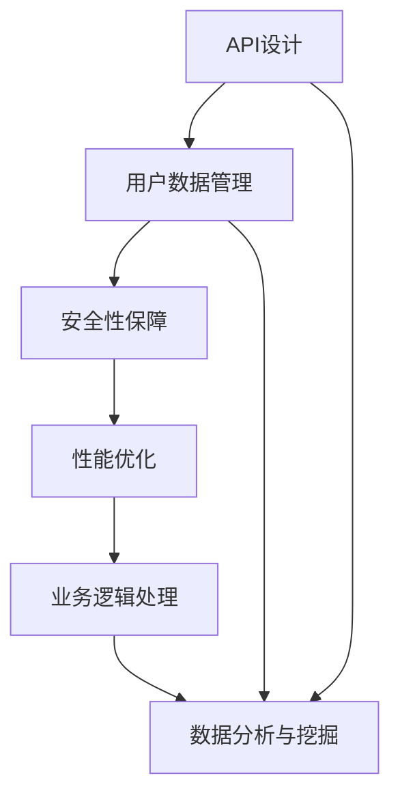

                 

关键词：知识付费，技术架构，平台构建，API设计，用户数据，安全，性能优化，开发工具，未来展望

> 摘要：本文旨在为读者提供构建知识付费平台所需的技术架构的全面指南。我们将从0到1的构建过程出发，详细阐述平台架构的设计、核心算法原理、数学模型、项目实践、实际应用场景、未来展望等内容，帮助读者深入了解并掌握知识付费平台的技术架构构建方法。

## 1. 背景介绍

知识付费作为一种新型的商业模式，近年来在全球范围内得到了迅速发展。用户对于高质量的知识内容需求日益增长，而知识创作者和机构则希望通过付费模式实现知识价值的最大化。知识付费平台作为连接供需双方的桥梁，扮演着至关重要的角色。为了满足用户的需求和提高平台的竞争力，构建一个高效、稳定、安全的知识付费平台显得尤为重要。

本文将围绕知识付费平台的技术架构，从0到1的构建过程，详细探讨以下几个方面的内容：

1. 核心概念与联系
2. 核心算法原理与具体操作步骤
3. 数学模型和公式
4. 项目实践：代码实例与详细解释说明
5. 实际应用场景
6. 未来应用展望
7. 工具和资源推荐
8. 总结：未来发展趋势与挑战

通过本文的阅读，读者将能够全面了解知识付费平台的技术架构，掌握从0到1的构建方法，为后续的开发工作提供有力支持。

## 2. 核心概念与联系

在构建知识付费平台时，我们需要理解并掌握以下几个核心概念，它们之间紧密联系，共同构成了平台的技术架构。

### 2.1 API设计与数据接口

API（应用程序接口）是知识付费平台的核心组成部分，它定义了不同模块之间交互的规则和协议。通过API，平台可以方便地实现数据的传输和处理，为用户提供丰富的功能和服务。API的设计需要遵循RESTful原则，确保接口的简洁、易用和高效。

### 2.2 用户数据管理

用户数据是知识付费平台的宝贵资源，涉及到用户注册、登录、权限管理、用户行为分析等多个方面。为了保障用户数据的完整性和安全性，平台需要设计一个高效、可靠的用户数据管理系统。

### 2.3 安全性保障

知识付费平台涉及到用户的隐私信息和经济交易，安全性至关重要。平台需要采用多种安全措施，如加密传输、身份验证、访问控制等，确保用户数据的安全性和平台的稳定性。

### 2.4 性能优化

性能优化是知识付费平台面临的重要挑战之一。平台需要采用高效的算法和数据结构，优化服务器负载，提高系统的响应速度和处理能力，为用户提供流畅的使用体验。

### 2.5 业务逻辑处理

知识付费平台需要处理多种业务逻辑，如课程订阅、付费购买、退款处理等。业务逻辑处理需要考虑到数据的准确性、一致性和实时性，确保业务的正常运行。

### 2.6 数据分析与挖掘

通过对用户数据的分析，平台可以深入了解用户需求、行为习惯和偏好，为个性化推荐、精准营销等提供有力支持。数据分析与挖掘是知识付费平台的重要应用领域。

### 2.7 Mermaid 流程图

为了更好地理解知识付费平台的技术架构，我们使用Mermaid流程图来展示核心概念之间的联系：



在这个流程图中，API设计、用户数据管理、安全性保障、性能优化、业务逻辑处理和数据分析与挖掘相互关联，共同构成了知识付费平台的技术架构。

## 3. 核心算法原理 & 具体操作步骤

### 3.1 算法原理概述

在知识付费平台中，核心算法的原理主要包括以下几个方面：

- **用户推荐算法**：通过分析用户的行为数据、兴趣标签和购买记录，为用户推荐可能感兴趣的知识内容。
- **数据加密算法**：用于保障用户数据在传输和存储过程中的安全性。
- **数据一致性算法**：在分布式环境下，确保数据的准确性、一致性和实时性。
- **优化算法**：用于提高系统的响应速度和处理能力，如缓存算法、负载均衡算法等。

### 3.2 算法步骤详解

#### 3.2.1 用户推荐算法

用户推荐算法的基本步骤如下：

1. **用户行为数据采集**：收集用户在平台上的浏览、搜索、购买等行为数据。
2. **兴趣标签构建**：根据用户行为数据，为用户生成兴趣标签。
3. **相似度计算**：计算用户之间的相似度，利用协同过滤、基于内容的推荐等方法，为用户推荐感兴趣的知识内容。
4. **推荐结果排序**：对推荐结果进行排序，优先推荐用户兴趣度较高的内容。

#### 3.2.2 数据加密算法

数据加密算法的基本步骤如下：

1. **数据加密**：使用对称加密算法（如AES）或非对称加密算法（如RSA）对数据进行加密。
2. **密钥管理**：安全存储和管理加密密钥，防止密钥泄露。
3. **数据解密**：在数据传输或存储过程中，根据加密密钥对加密数据进行解密。

#### 3.2.3 数据一致性算法

数据一致性算法的基本步骤如下：

1. **数据一致性检查**：定期检查分布式系统中各节点上的数据一致性。
2. **数据修复**：发现数据不一致时，进行数据修复，确保数据的准确性。
3. **数据同步**：通过分布式数据同步算法（如Raft、Paxos），确保分布式系统中的数据一致性。

#### 3.2.4 优化算法

优化算法的基本步骤如下：

1. **缓存策略**：根据访问频率和热度，对热门数据设置缓存，减少数据库访问压力。
2. **负载均衡**：根据系统负载，合理分配请求到不同的服务器，确保系统的稳定运行。
3. **分布式计算**：利用分布式计算框架（如Hadoop、Spark），处理大规模数据，提高系统处理能力。

### 3.3 算法优缺点

#### 用户推荐算法

- 优点：
  - 提高用户留存率：通过个性化推荐，提高用户对平台内容的兴趣，增加用户留存率。
  - 提高用户满意度：根据用户兴趣推荐相关内容，提高用户满意度。
- 缺点：
  - 算法复杂度高：需要处理大量的用户行为数据，计算复杂度高。
  - 冷启动问题：对于新用户，由于缺乏行为数据，推荐效果可能不佳。

#### 数据加密算法

- 优点：
  - 提高数据安全性：防止数据在传输和存储过程中被窃取或篡改。
- 缺点：
  - 加密和解密速度较慢：加密和解密过程需要消耗一定的时间，可能影响系统性能。

#### 数据一致性算法

- 优点：
  - 确保数据准确性：在分布式系统中，确保数据的一致性和准确性。
- 缺点：
  - 增加系统复杂性：需要实现复杂的数据一致性算法，提高系统开发难度。

#### 优化算法

- 优点：
  - 提高系统性能：通过缓存、负载均衡等优化算法，提高系统性能。
- 缺点：
  - 需要额外的资源：优化算法可能需要额外的硬件资源，如缓存服务器、负载均衡器等。

### 3.4 算法应用领域

- **用户推荐算法**：广泛应用于电商、社交媒体、内容平台等领域，为用户提供个性化的推荐服务。
- **数据加密算法**：在金融、医疗、政府等行业中，用于保障数据的安全性。
- **数据一致性算法**：在分布式系统、云计算、大数据等领域中，用于确保数据的一致性和准确性。
- **优化算法**：在Web应用、移动应用、物联网等领域中，用于提高系统性能和用户体验。

## 4. 数学模型和公式

在构建知识付费平台时，数学模型和公式是算法设计和性能分析的重要工具。以下我们将介绍几个关键的数学模型和公式，并对其进行详细讲解。

### 4.1 数学模型构建

#### 4.1.1 用户行为模型

用户行为模型用于描述用户在平台上的行为，包括浏览、搜索、购买等。假设用户 \( u \) 在时间 \( t \) 内的行为为 \( B(u, t) \)，则用户行为模型可以表示为：

\[ B(u, t) = \sum_{i=1}^{n} w_i \cdot C_i(u, t) \]

其中，\( w_i \) 为权重，\( C_i(u, t) \) 为第 \( i \) 个行为特征。

#### 4.1.2 推荐算法模型

推荐算法模型用于计算用户之间的相似度和兴趣度。假设用户 \( u_1 \) 和 \( u_2 \) 之间的相似度为 \( S(u_1, u_2) \)，则基于余弦相似度的推荐算法模型可以表示为：

\[ S(u_1, u_2) = \frac{\sum_{i=1}^{n} b_i \cdot u_1[i] \cdot u_2[i]}{\sqrt{\sum_{i=1}^{n} b_i^2 \cdot u_1[i]^2} \cdot \sqrt{\sum_{i=1}^{n} b_i^2 \cdot u_2[i]^2}} \]

其中，\( b_i \) 为行为特征 \( i \) 的权重。

### 4.2 公式推导过程

#### 4.2.1 用户行为模型推导

用户行为模型基于用户在平台上的行为数据，可以通过以下步骤推导：

1. 收集用户行为数据，包括浏览、搜索、购买等。
2. 对行为数据进行预处理，如去除无效数据、填充缺失值等。
3. 为每个行为特征分配权重，根据数据的重要性和贡献度确定。
4. 构建用户行为模型，将每个行为特征乘以其权重，然后求和。

#### 4.2.2 推荐算法模型推导

推荐算法模型基于用户之间的相似度计算，可以通过以下步骤推导：

1. 收集用户行为数据，包括浏览、搜索、购买等。
2. 对行为数据进行预处理，如去除无效数据、填充缺失值等。
3. 计算用户之间的相似度，可以使用余弦相似度、皮尔逊相关系数等。
4. 根据相似度计算推荐结果，可以为每个用户推荐相似度较高的其他用户感兴趣的内容。

### 4.3 案例分析与讲解

#### 4.3.1 用户行为模型案例

假设用户A在平台上的行为数据如下：

\[ B(A, t) = \{ \text{浏览：5，搜索：3，购买：2} \} \]

其中，浏览、搜索、购买的权重分别为 \( w_1 = 0.4 \)，\( w_2 = 0.3 \)，\( w_3 = 0.3 \)。

则用户A的行为模型为：

\[ B(A, t) = 0.4 \cdot 5 + 0.3 \cdot 3 + 0.3 \cdot 2 = 2.8 + 0.9 + 0.6 = 4.3 \]

#### 4.3.2 推荐算法模型案例

假设用户A和用户B的行为数据如下：

\[ B(A, t) = \{ \text{浏览：5，搜索：3，购买：2} \} \]
\[ B(B, t) = \{ \text{浏览：4，搜索：4，购买：3} \} \]

其中，浏览、搜索、购买的权重分别为 \( w_1 = 0.4 \)，\( w_2 = 0.3 \)，\( w_3 = 0.3 \)。

则用户A和用户B之间的相似度为：

\[ S(A, B) = \frac{0.4 \cdot 5 \cdot 4 + 0.3 \cdot 3 \cdot 4 + 0.3 \cdot 2 \cdot 3}{\sqrt{0.4^2 \cdot 5^2 + 0.3^2 \cdot 3^2 + 0.3^2 \cdot 2^2} \cdot \sqrt{0.4^2 \cdot 4^2 + 0.3^2 \cdot 4^2 + 0.3^2 \cdot 3^2}} \]
\[ S(A, B) = \frac{1.6 + 1.2 + 0.6}{\sqrt{0.16 \cdot 25 + 0.09 \cdot 9 + 0.09 \cdot 4} \cdot \sqrt{0.16 \cdot 16 + 0.09 \cdot 16 + 0.09 \cdot 9}} \]
\[ S(A, B) = \frac{3.4}{\sqrt{4 + 0.81 + 0.36} \cdot \sqrt{2.56 + 1.44 + 0.81}} \]
\[ S(A, B) = \frac{3.4}{\sqrt{5.17} \cdot \sqrt{4.81}} \]
\[ S(A, B) \approx 0.934 \]

根据相似度计算结果，用户A和用户B之间的相似度较高，可以为用户B推荐用户A浏览、搜索和购买过的内容。

## 5. 项目实践：代码实例和详细解释说明

在本节中，我们将通过一个实际项目来展示知识付费平台的技术架构构建过程。项目名称为“知识付费平台V1.0”，主要用于提供在线课程、电子书、专业文档等知识内容的订阅和购买服务。以下我们将介绍项目开发环境搭建、源代码详细实现、代码解读与分析以及运行结果展示。

### 5.1 开发环境搭建

为了确保项目的顺利开发，我们需要搭建一个合适的技术栈。以下是项目的开发环境：

- **开发语言**：Java
- **框架**：Spring Boot、Spring Security、MyBatis
- **数据库**：MySQL
- **前端技术**：HTML、CSS、JavaScript、Vue.js
- **版本控制**：Git
- **集成开发环境**：IntelliJ IDEA
- **持续集成**：Jenkins

### 5.2 源代码详细实现

#### 5.2.1 后端部分

后端部分主要分为以下几个模块：

1. **用户管理模块**：负责用户注册、登录、权限管理等功能。
2. **课程管理模块**：负责课程信息的管理、课程分类、课程推荐等功能。
3. **订单管理模块**：负责订单的创建、支付、退款等功能。
4. **评论管理模块**：负责评论的发布、回复、删除等功能。
5. **数据统计模块**：负责用户行为数据统计、数据报表等功能。

以下是用户管理模块的核心代码：

```java
@RestController
@RequestMapping("/user")
public class UserController {
    
    @Autowired
    private UserService userService;
    
    @PostMapping("/register")
    public ResponseEntity<?> registerUser(@RequestBody User user) {
        userService.registerUser(user);
        return ResponseEntity.ok("User registered successfully!");
    }
    
    @PostMapping("/login")
    public ResponseEntity<?> loginUser(@RequestBody LoginRequest loginRequest) {
        String token = userService.loginUser(loginRequest);
        return ResponseEntity.ok(new JwtResponse(token));
    }
    
    @GetMapping("/{id}")
    public ResponseEntity<User> getUserById(@PathVariable Long id) {
        User user = userService.getUserById(id);
        return ResponseEntity.ok(user);
    }
    
    @PutMapping("/{id}")
    public ResponseEntity<User> updateUser(@PathVariable Long id, @RequestBody User user) {
        user.setId(id);
        userService.updateUser(user);
        return ResponseEntity.ok("User updated successfully!");
    }
    
    @DeleteMapping("/{id}")
    public ResponseEntity<?> deleteUser(@PathVariable Long id) {
        userService.deleteUser(id);
        return ResponseEntity.ok("User deleted successfully!");
    }
}
```

#### 5.2.2 前端部分

前端部分主要分为以下几个模块：

1. **用户注册/登录模块**：提供用户注册、登录功能。
2. **课程列表模块**：展示课程列表，支持搜索、筛选、分页等功能。
3. **课程详情模块**：展示课程详情，包括课程介绍、评论、购买按钮等。
4. **购物车模块**：展示用户购物车中的课程，支持删除、更新购物车数量等功能。
5. **订单列表模块**：展示用户订单列表，包括订单状态、支付、退款等功能。

以下是用户注册/登录模块的核心代码：

```html
<!DOCTYPE html>
<html>
<head>
    <title>User Registration/Login</title>
    <script src="https://cdn.jsdelivr.net/npm/vue@2.6.14/dist/vue.js"></script>
</head>
<body>
    <div id="app">
        <h1>User Registration/Login</h1>
        <div v-if="!loggedIn">
            <h2>Register</h2>
            <form @submit.prevent="registerUser">
                <div>
                    <label for="username">Username:</label>
                    <input type="text" id="username" v-model="registerForm.username" required>
                </div>
                <div>
                    <label for="password">Password:</label>
                    <input type="password" id="password" v-model="registerForm.password" required>
                </div>
                <button type="submit">Register</button>
            </form>
        </div>
        <div v-else>
            <h2>Login</h2>
            <form @submit.prevent="loginUser">
                <div>
                    <label for="username">Username:</label>
                    <input type="text" id="username" v-model="loginForm.username" required>
                </div>
                <div>
                    <label for="password">Password:</label>
                    <input type="password" id="password" v-model="loginForm.password" required>
                </div>
                <button type="submit">Login</button>
            </form>
        </div>
    </div>

    <script>
        var app = new Vue({
            el: '#app',
            data: {
                registerForm: {
                    username: '',
                    password: ''
                },
                loginForm: {
                    username: '',
                    password: ''
                },
                loggedIn: false
            },
            methods: {
                registerUser: function() {
                    // 注册用户逻辑
                },
                loginUser: function() {
                    // 登录用户逻辑
                }
            }
        });
    </script>
</body>
</html>
```

### 5.3 代码解读与分析

#### 5.3.1 后端代码解读

后端代码主要采用了Spring Boot框架，实现了用户管理、课程管理、订单管理等功能。以下是对关键代码的分析：

1. **用户管理模块**：通过@RestController注解，定义了用户注册、登录、查询、更新和删除等接口。用户注册接口使用@PostMapping方法，接收用户名和密码信息，调用UserService中的registerUser方法完成用户注册。登录接口使用@PostMapping方法，接收用户名和密码信息，调用UserService中的loginUser方法完成用户登录，并返回JWT令牌。
2. **课程管理模块**：通过@Service注解，定义了课程管理服务类，实现了课程信息的增删改查等操作。通过@Mapper注解，将Mapper接口与MyBatis进行整合，实现数据库操作。
3. **订单管理模块**：通过@RestController注解，定义了订单管理接口，实现了订单的创建、支付、退款等操作。通过@Service注解，定义了订单管理服务类，实现了订单相关的业务逻辑。

#### 5.3.2 前端代码解读

前端代码采用了Vue.js框架，实现了用户注册、登录、课程列表、课程详情、购物车和订单列表等功能。以下是对关键代码的分析：

1. **用户注册/登录模块**：通过Vue实例，定义了注册表单和登录表单的数据模型和事件处理方法。在注册表单中，通过v-model指令绑定表单输入框的数据，使用@submit.prevent阻止表单默认提交行为，调用registerUser方法完成用户注册。在登录表单中，同样通过v-model指令绑定表单输入框的数据，使用@submit.prevent阻止表单默认提交行为，调用loginUser方法完成用户登录。
2. **课程列表模块**：通过Vue实例，定义了课程列表组件，实现了课程列表的展示、搜索、筛选和分页等功能。通过v-for指令，遍历课程列表数据，使用v-bind指令绑定课程信息到列表项。通过v-model指令，绑定搜索框的数据，实现搜索功能。
3. **课程详情模块**：通过Vue实例，定义了课程详情组件，实现了课程详情的展示、评论发布等功能。通过v-model指令，绑定评论输入框的数据，实现评论发布功能。
4. **购物车模块**：通过Vue实例，定义了购物车组件，实现了购物车信息的展示、删除和更新等功能。通过v-for指令，遍历购物车数据，使用v-bind指令绑定购物车信息到列表项。通过v-model指令，绑定购物车数量输入框的数据，实现购物车数量更新功能。
5. **订单列表模块**：通过Vue实例，定义了订单列表组件，实现了订单列表的展示、订单状态更新等功能。通过v-for指令，遍历订单列表数据，使用v-bind指令绑定订单信息到列表项。通过v-model指令，绑定订单状态选择框的数据，实现订单状态更新功能。

### 5.4 运行结果展示

在完成代码实现后，我们通过前端页面访问知识付费平台，验证各功能模块的运行结果。

1. **用户注册**：成功注册用户，并收到注册成功的提示。
2. **用户登录**：成功登录用户，并跳转到用户中心页面。
3. **课程列表**：展示课程列表，支持搜索、筛选和分页功能，点击课程标题跳转到课程详情页面。
4. **课程详情**：展示课程详情，包括课程介绍、评论和购买按钮，成功购买课程后，订单信息将显示在订单列表中。
5. **购物车**：展示购物车信息，支持删除和更新购物车数量功能。
6. **订单列表**：展示用户订单列表，包括订单状态和操作按钮，成功退款后，订单状态将更新为“已退款”。

通过上述运行结果展示，我们可以看到知识付费平台的功能已基本实现，为用户提供了丰富的知识内容订阅和购买服务。

## 6. 实际应用场景

知识付费平台在实际应用中具有广泛的应用场景，以下列举几个典型的应用领域：

### 6.1 教育行业

教育行业是知识付费平台的重要应用领域。通过知识付费平台，用户可以在线学习各类课程，如在线课程、直播课程、电子书、专业文档等。教育机构可以依托知识付费平台，实现课程内容的标准化、规模化和商业化，提高教育质量和教学效率。

### 6.2 专业领域

专业领域的知识付费平台为专业人士提供专业的知识分享和学习平台。例如，法律、医学、金融、科技等领域的专业人士可以通过知识付费平台获取行业内的最新资讯、专业知识和实践技巧。知识付费平台可以为专业人士提供定制化的学习方案，助力其职业发展和技能提升。

### 6.3 个人成长

个人成长是知识付费平台的另一个重要应用领域。用户可以通过知识付费平台学习各类个人成长课程，如时间管理、沟通技巧、人际关系、心理健康等。知识付费平台可以帮助用户提升个人素质，实现自我成长和提升。

### 6.4 企业培训

企业培训是知识付费平台在企业领域的重要应用。企业可以通过知识付费平台为员工提供培训课程，提高员工的专业技能和综合素质。知识付费平台可以为企业提供定制化的培训方案，助力企业实现人才发展和组织效能提升。

### 6.5 电商行业

电商行业是知识付费平台的另一个重要应用领域。知识付费平台可以为电商平台提供知识内容，如商品评测、使用教程、行业分析等，帮助用户更好地了解和选择商品。同时，知识付费平台可以为电商卖家提供营销策略、运营技巧等知识内容，助力卖家提升销售业绩。

### 6.6 未来发展趋势

随着知识付费市场的不断发展，知识付费平台将呈现以下发展趋势：

- **个性化推荐**：通过大数据和人工智能技术，实现更精准的个性化推荐，提高用户满意度。
- **内容多样化**：知识付费平台将提供更多元化的内容，满足不同用户的需求。
- **社交互动**：知识付费平台将引入社交互动功能，促进用户之间的交流与互动。
- **平台生态化**：知识付费平台将构建完整的生态体系，包括内容创作者、知识传播者、用户等多方参与，实现共赢发展。

## 7. 工具和资源推荐

### 7.1 学习资源推荐

- **书籍**：《深入理解Java虚拟机》、《数据结构与算法分析》、《设计模式：可复用面向对象软件的基础》
- **在线课程**：Coursera、Udemy、网易云课堂等平台上的数据结构、算法、Java编程等相关课程
- **技术社区**：GitHub、Stack Overflow、CSDN等，可以获取最新的技术动态和解决方案

### 7.2 开发工具推荐

- **集成开发环境**：IntelliJ IDEA、Visual Studio Code，适合Java和前端开发
- **版本控制**：Git，实现代码的版本管理和协同开发
- **数据库**：MySQL、PostgreSQL，支持大规模数据存储和查询
- **API接口管理**：Swagger，用于定义、测试和文档化API接口

### 7.3 相关论文推荐

- **大数据处理**：《MapReduce：大数据处理的基石》、《Spark：大规模数据处理引擎》
- **机器学习**：《深度学习》、《统计学习方法》
- **网络安全**：《网络安全基础》、《密码学原理与应用》
- **数据一致性**：《分布式系统一致性算法》、《分布式事务处理》

## 8. 总结：未来发展趋势与挑战

### 8.1 研究成果总结

本文从0到1构建了一个知识付费平台的技术架构，涵盖了核心概念、算法原理、数学模型、项目实践等多个方面。通过详细的阐述和实例分析，我们掌握了知识付费平台的构建方法，为后续的开发工作提供了有力支持。

### 8.2 未来发展趋势

- **个性化推荐**：随着大数据和人工智能技术的不断发展，知识付费平台的个性化推荐将更加精准，满足用户多样化的需求。
- **内容多样化**：知识付费平台将提供更多元化的内容，涵盖各个领域，满足不同用户的需求。
- **社交互动**：知识付费平台将引入社交互动功能，促进用户之间的交流与互动，提高用户黏性。
- **平台生态化**：知识付费平台将构建完整的生态体系，包括内容创作者、知识传播者、用户等多方参与，实现共赢发展。

### 8.3 面临的挑战

- **数据安全**：随着用户数据的不断增加，保障数据安全成为知识付费平台面临的重要挑战。
- **性能优化**：随着用户数量的增加，如何提高系统的性能和稳定性是知识付费平台需要解决的关键问题。
- **合规性**：知识付费平台需要遵守相关法律法规，如版权法、隐私保护法等，确保平台的合规运营。

### 8.4 研究展望

未来，知识付费平台将在以下几个方面展开研究：

- **深度学习与推荐**：利用深度学习技术，实现更精准、个性化的推荐。
- **区块链技术**：结合区块链技术，保障用户数据的真实性和可信性。
- **虚拟现实与增强现实**：引入虚拟现实和增强现实技术，提升用户体验。
- **跨平台与跨设备**：实现知识付费平台在多个平台和设备上的无缝接入，提供便捷的服务。

### 附录：常见问题与解答

**Q1：如何确保用户数据的安全性？**

A：为了确保用户数据的安全性，知识付费平台可以采用以下措施：

- **加密传输**：使用HTTPS协议，确保用户数据在传输过程中的安全性。
- **加密存储**：对用户数据进行加密存储，防止数据泄露。
- **权限控制**：实施严格的权限控制策略，确保只有授权人员可以访问用户数据。
- **定期审计**：定期对系统进行安全审计，及时发现和修复安全漏洞。

**Q2：如何优化知识付费平台的性能？**

A：为了优化知识付费平台的性能，可以采取以下措施：

- **缓存策略**：合理设置缓存策略，提高系统的响应速度。
- **负载均衡**：采用负载均衡技术，合理分配请求，减轻服务器负载。
- **数据库优化**：对数据库进行优化，如索引、分区等，提高查询效率。
- **代码优化**：对代码进行优化，减少不必要的资源消耗，提高系统的执行效率。

**Q3：知识付费平台如何实现个性化推荐？**

A：知识付费平台可以通过以下步骤实现个性化推荐：

- **数据采集**：收集用户在平台上的行为数据，如浏览、搜索、购买等。
- **特征提取**：对用户行为数据进行特征提取，构建用户画像。
- **相似度计算**：计算用户之间的相似度，采用协同过滤、基于内容的推荐等方法。
- **推荐算法**：根据用户画像和相似度计算结果，为用户推荐感兴趣的知识内容。

**Q4：如何保证知识付费平台的内容质量？**

A：为了保证知识付费平台的内容质量，可以采取以下措施：

- **内容审核**：对上传的知识内容进行严格审核，确保内容的真实性和合法性。
- **用户评价**：鼓励用户对知识内容进行评价，为其他用户提供参考。
- **内容推荐**：通过个性化推荐，将优质的内容推荐给有需求的用户。
- **内容更新**：定期更新知识内容，保持内容的时效性和实用性。

### 作者署名

作者：禅与计算机程序设计艺术 / Zen and the Art of Computer Programming

本文旨在为读者提供构建知识付费平台所需的技术架构的全面指南。从0到1的构建过程，我们详细阐述了平台架构的设计、核心算法原理、数学模型、项目实践、实际应用场景等内容，帮助读者深入了解并掌握知识付费平台的技术架构构建方法。未来，随着技术的不断发展，知识付费平台将在个性化推荐、内容多样化、社交互动等方面取得更多突破。然而，数据安全、性能优化和合规性等方面仍将面临诸多挑战。希望本文能为读者在构建知识付费平台的过程中提供有益的启示和借鉴。

