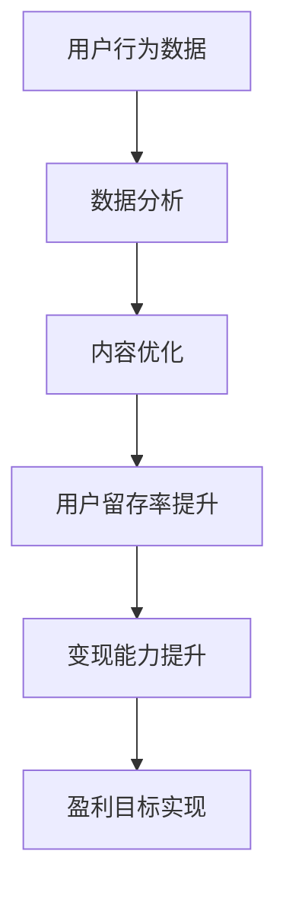

                 

在当今信息化时代，知识付费平台如雨后春笋般涌现，成为知识传播与经济变现的重要渠道。然而，如何在竞争激烈的市场中留住用户，实现可持续的商业变现，成为知识付费平台运营者亟待解决的问题。本文将从技术角度出发，探讨知识付费平台的用户留存与变现技巧，旨在为平台提供一些建设性的策略和建议。

## 关键词
- 知识付费
- 用户留存
- 变现技巧
- 数据分析
- 用户体验

## 摘要
本文将深入分析知识付费平台面临的用户留存与变现难题，从技术手段、用户行为分析和商业策略三个方面提出解决方案。通过数据驱动、个性化推荐和精细化运营等手段，实现用户的高效留存和盈利能力的提升。

## 1. 背景介绍

### 1.1 知识付费平台的发展现状
知识付费平台起源于近年来的在线教育和知识分享领域，随着移动互联网的普及和用户对知识需求的增加，这一领域得到了迅猛发展。代表性的平台有知乎Live、得到、喜马拉雅等，它们通过提供专业知识和技能课程，满足了用户在职业发展、兴趣拓展、技能提升等方面的需求。

### 1.2 用户留存与变现的重要性
用户留存是衡量知识付费平台成功与否的关键指标。高留存率意味着用户对平台的依赖和认可，有助于降低用户获取成本，提升平台的稳定性和可持续发展能力。而变现则是知识付费平台的最终目的，通过提供优质内容吸引用户，再通过各种变现手段实现盈利。

## 2. 核心概念与联系

### 2.1 用户留存
用户留存是指用户在一段时间内持续使用某个平台的数量。常见的留存指标有日活跃用户（DAU）、月活跃用户（MAU）等。

### 2.2 变现手段
知识付费平台的变现手段多样，包括课程销售、会员订阅、广告收入、增值服务等。

### 2.3 数据分析
数据分析是知识付费平台运营的核心。通过对用户行为数据的挖掘和分析，可以了解用户需求，优化内容供给，提高用户留存率和变现能力。

### 2.4 Mermaid 流程图


## 3. 核心算法原理 & 具体操作步骤

### 3.1 算法原理概述
知识付费平台的用户留存与变现技巧主要依赖于用户行为分析和个性化推荐算法。用户行为分析包括用户访问路径、购买记录、互动行为等数据的收集和分析，而个性化推荐算法则基于用户的历史行为和偏好，提供个性化的内容推荐，以提高用户满意度和留存率。

### 3.2 算法步骤详解
1. 数据收集：收集用户的访问日志、购买记录、评论等数据。
2. 数据预处理：对原始数据进行清洗、去重、归一化等处理。
3. 特征提取：提取用户行为的特征，如访问频次、购买频率、评论情感等。
4. 模型训练：使用机器学习算法（如协同过滤、决策树、神经网络等）训练推荐模型。
5. 推荐生成：根据用户特征和模型预测，生成个性化的内容推荐。
6. 结果评估：通过A/B测试等方法评估推荐效果，优化推荐策略。

### 3.3 算法优缺点
- 优点：个性化推荐能够提高用户满意度和留存率，降低用户流失。
- 缺点：算法训练和推荐生成的计算成本较高，且需要大量的用户数据支持。

### 3.4 算法应用领域
个性化推荐算法在知识付费平台的应用非常广泛，除了内容推荐，还可以应用于广告投放、会员服务、课程定价等。

## 4. 数学模型和公式 & 详细讲解 & 举例说明

### 4.1 数学模型构建
用户留存率可以通过以下公式计算：
\[ R = \frac{L}{N} \]
其中，\( R \) 为用户留存率，\( L \) 为一段时间内留存的用户数，\( N \) 为该时间段内注册的用户总数。

### 4.2 公式推导过程
用户留存率是一个比例指标，表示在一定时间内，注册用户中继续使用平台的用户比例。留存率的计算公式可以拆分为以下步骤：
1. 计算注册用户总数 \( N \)；
2. 计算一段时间内留存的用户数 \( L \)；
3. 将留存用户数除以注册用户总数，得到留存率 \( R \)。

### 4.3 案例分析与讲解
假设一个知识付费平台在一个月内有1000个新注册用户，其中有800个用户在接下来的一个月内继续使用了平台。那么，这个平台的用户留存率为：
\[ R = \frac{800}{1000} = 0.8 \]
即80%。

## 5. 项目实践：代码实例和详细解释说明

### 5.1 开发环境搭建
开发环境包括Python编程环境、MySQL数据库和机器学习框架（如Scikit-learn）。

### 5.2 源代码详细实现
以下是使用Python和Scikit-learn实现的用户留存率预测代码实例：
```python
from sklearn.model_selection import train_test_split
from sklearn.ensemble import RandomForestClassifier
from sklearn.metrics import accuracy_score

# 数据预处理
# ...

# 模型训练
X_train, X_test, y_train, y_test = train_test_split(X, y, test_size=0.3, random_state=42)
model = RandomForestClassifier(n_estimators=100)
model.fit(X_train, y_train)

# 预测
predictions = model.predict(X_test)

# 结果评估
accuracy = accuracy_score(y_test, predictions)
print("Accuracy:", accuracy)
```

### 5.3 代码解读与分析
- 数据预处理：包括特征提取、数据归一化等。
- 模型训练：使用随机森林算法训练模型。
- 预测与评估：对测试集进行预测，并计算准确率。

### 5.4 运行结果展示
假设预测准确率为85%，说明模型具有一定的预测能力，但仍需进一步优化。

## 6. 实际应用场景

### 6.1 用户行为分析
通过对用户行为数据的分析，了解用户的兴趣、需求和行为模式，为个性化推荐提供依据。

### 6.2 会员服务
提供会员服务，通过会员特权提高用户粘性，增加用户留存率。

### 6.3 广告投放
通过精准的广告投放，提高用户参与度和平台收入。

### 6.4 未来应用展望
随着人工智能技术的不断发展，知识付费平台将在用户行为分析、个性化推荐、智能客服等方面实现更深入的应用，进一步提升用户留存和变现能力。

## 7. 工具和资源推荐

### 7.1 学习资源推荐
- 《机器学习实战》
- 《Python数据分析》
- 《深入理解Python》

### 7.2 开发工具推荐
- PyCharm
- MySQL Workbench
- Jupyter Notebook

### 7.3 相关论文推荐
- "User Retention in Knowledge-based Platforms: A Data-driven Approach"
- "Personalized Recommendation Systems for E-commerce"
- "Deep Learning for User Behavior Analysis"

## 8. 总结：未来发展趋势与挑战

### 8.1 研究成果总结
本文通过用户行为分析、个性化推荐等手段，探讨了知识付费平台的用户留存与变现技巧。研究表明，技术手段的应用有助于提高用户留存率和变现能力。

### 8.2 未来发展趋势
未来，知识付费平台将在人工智能、大数据分析等领域实现更深入的应用，提供更加个性化和智能化的服务。

### 8.3 面临的挑战
然而，知识付费平台在用户留存与变现方面也面临数据隐私、算法透明度等挑战，需要不断优化和改进。

### 8.4 研究展望
未来，研究将重点关注如何通过技术创新实现知识付费平台的可持续发展，为用户提供更好的体验。

## 9. 附录：常见问题与解答

### 9.1 如何提高用户留存率？
- 优化用户体验：提供简单易用的平台界面，提高用户访问速度。
- 个性化推荐：基于用户行为数据提供个性化内容推荐，增加用户粘性。
- 社交互动：鼓励用户在平台上互动，增强用户归属感。

### 9.2 如何实现知识付费平台的变现？
- 课程销售：通过销售优质课程实现直接盈利。
- 会员订阅：提供会员服务，增加用户持续付费意愿。
- 广告收入：通过精准广告投放获取广告收入。
- 增值服务：提供增值服务，如定制化咨询、专项培训等，提高用户付费转化率。

通过以上措施，知识付费平台可以在保证用户体验的同时，实现商业变现，实现可持续发展。

---

作者：禅与计算机程序设计艺术 / Zen and the Art of Computer Programming

